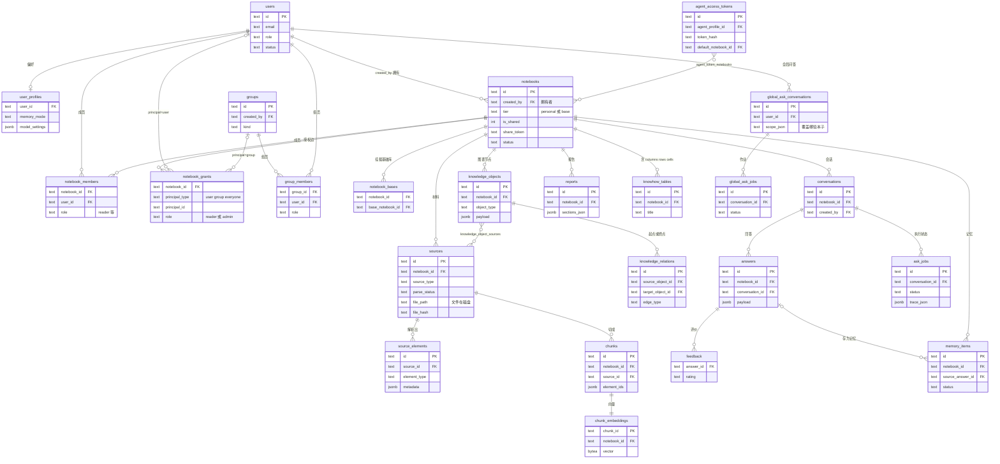

# silicon-notebook 架构

更新日期：2026-09-22

本文记录当前已经由代码与绿色回归测试固定的运行时边界。部署配置说明以 `docs/deployment-and-configuration.md` / `_zh.md` 为准，默认值与校验由 `backend/app/core/config.py` 拥有；`.env.example` 只提供常用部署模板。产品操作说明以 `docs/product-and-api.md` / `_zh.md` 为准；协作约束由 `AGENTS.md` 路由到对应权威文档。架构整改采用 contract-first strangler，不用文档中的目标结构反向描述尚未发生的迁移。

## 1. 真实行为与验证

历史说明与实现不一致时，按以下顺序判定真实行为：

1. 已通过的回归测试与 characterization test。
2. 被这些测试覆盖的生产代码。
3. `docs/` 下负责该主题的现行权威文档与本文；根 README 只作入口，`AGENTS.md` 只作 Agent 工作流和文档路由。

第一阶段用 `backend/tests/test_architecture_documentation.py` 固定以下容易漂移的架构契约：

- Ask stream 的 transport 断连与用户显式取消是两种事件；前者不取消 detached worker。
- 原文段落通道按参与集读取，`CHUNK_FEDERATION_ENABLED` 是它唯一的回退开关；知识对象的 exact-score `base` 次序不能泛化到 chunk 或 relation 检索。
- notebook 内页是来源栏 + 主区域的两列 workspace，主区域有 问答 (Ask) / 知识库 (Knowledge) / 记忆 (Memory) / 深度报告 (Deep Report) 四个 tab；没有固定 Studio 右栏。
- Memory 独立于 source/chunk/KG，始终绑定创建者和一个 notebook；Agent candidate 与 confirmed-only notebook 正式检索是两个隔离平面。

本地 beta 保持 FastAPI + Next.js 的双进程形态，repository backend 由 `DATABASE_URL` 在 PostgreSQL 与 SQLite 之间选择；PostgreSQL 是默认部署选项，当前开发和生产环境均使用 PostgreSQL，不要求 pgvector、Docker、GPU 或本地模型服务器。SQLite 仍作为可选后端受支持。生产启动固定为一个 FastAPI/Uvicorn worker，保证进程内的系统模型服务调度器就是部署全局容量边界。chat、embedding 与 reranker 仍只通过 URL 服务访问。MinerU 是独立的解析适配器：`MINERU_MODE=http` 调用远端 `mineru-api`，`MINERU_MODE=cli` 在隔离子进程运行 MinerU Python API，`MINERU_MODE=off` 使用 PyMuPDF4LLM 版面/Markdown 回退（pypdf 仅最后兜底）。未配置服务时使用离线、确定性的回退路径。全新数据库不创建 demo notebook 或合成来源。

运维 CLI 的公开目录由 `scripts/cli.py` 显式注册并按用途分组，`scripts/cli.sh` 只选择解释器并转交；旧脚本与 `app.scripts` 实现继续持有参数、业务流程和锁合同。应用类 CLI 与服务启动共用不依赖 `app` 的 `scripts/python_env.py`，在 exec 目标 Python 前准备 dotenv 和模块搜索路径；需要在自身参数解析后才能选环境的 reflect `report`/`search` 则在脚本启动层调用同一模块同步当前进程路径，不在 Settings、插件 configure 或应用业务 workflow 中修改 `sys.path`。独立诊断/显式环境工具保留自身配置策略。分发层不构造 repository、不启动插件配套服务；`extensions check` 只调用现有 discovery 检查导入与设置，运行时拓扑和管理员 admission 仍由既有组合根负责。命令与环境细节分别归 `docs/operations*.md`、`docs/deployment-and-configuration*.md` 所有。

## 2. 运行时组件

### 2.1 进程与持久化

部署插件的配套服务配置由无副作用的 `app.extensions.service_config` 解析，discovery 与
`scripts/extension_services.py` 共用校验。只有显式 `extensions services` 命令及服务启动
脚本进入进程管理层，普通 CLI、Settings 和插件 configure 不启动进程。管理器按依赖排序
启动、检查就绪、逆序关闭；私有运行目录与锁记录归属，启动凭据区分本次创建和复用。
独立 supervisor 持有子进程，worker guard 与同组清理见证共同保持租约及进程组归属，
任一意外退出会触发清理；应用运行时注册表
和管理员 admission 开关不管理操作系统进程。外部托管服务只检查就绪，绝不由此终止。
服务异常退出会停止本次服务会话，不自动重启；主应用进程保持既有启动脚本的管理边界。

- `backend/app/main.py` 创建 FastAPI 应用，挂载认证、请求上下文、CORS、日志中间件和 `/api` 路由；生产拓扑固定单 Uvicorn worker，不允许用多进程复制模型容量。
- `frontend/` 是唯一前端；Next.js/React/TypeScript 负责 notebook collection 与 notebook workspace。
- 开发和生产环境通过 `DATABASE_URL` 显式选择 PostgreSQL；完全未配置该项时，代码仍以 `.local/silicon_notebook.db` 的 SQLite 数据库兜底。原始来源文件默认位于 `.local/storage`。DATABASE_URL 通过唯一的 repository factory 选择正式 repository 后端。运行时只有一个 active repository 后端，由 `DATABASE_URL` 集中选择。PostgreSQL 是默认部署选项，SQLite 仍受支持。`SHADOW_DATABASE_URL` 不选择 active backend，单独设置也不启动同步；只有临时 `migration/shadow` 运维组合根会把它作为 PostgreSQL target 读取。
- SQLite 使用标准库 `sqlite3`、WAL 与 `busy_timeout`，模型向量存 float32 BLOB。PostgreSQL 使用有界 Psycopg pool、数据库事务/row/advisory lock 支持跨进程访问，向量存 float32 `bytea`；不安装也不需要 pgvector。

### 2.1.1 数据表组织

规范定义在 `backend/app/repositories/postgres/migrations/`（SQLite 是镜像）。组织原则：
**notebook 是数据分片与权限过滤的边界**——notebook 级的表带 `notebook_id` 列，子表
（source_elements、knowhow 的列/行/格、memory 的修订/来源/向量等约三分之一的表）经父表
归属；只有全局问答、许愿墙、认证与系统配置不落在任何 notebook 下。用户不直接拥有数据，
而是通过「拥有或被授权的 notebook」间接拥有。读/管/写三种权限的唯一定义点是 `repositories/*/access_sql.py`：写权 = owner
（`notebooks.created_by`）；管理权 = owner ∪ `role='admin'` 的授权边；读权 = owner ∪
`notebook_members` 有行 ∪ 有效授权边（`notebook_grants.principal_type` ∈ user/group/group_admins/everyone）。
`notebook_bases` 让一个 notebook 挂载另一个（如 `tier='base'` 的公共基础库），读侧查询
顺着它把基础库内容并入。原始文件与附件本体在磁盘（`sources.file_path`），库里只存元数据。
向量各自单表单列 `bytea`（chunk/element/knowledge/memory/relation）；memory_embeddings 只按
`memory_id` 归属，其余四张带 `notebook_id`。

下图只画主干 26 张表；聚类、社群、合并/冲突候选、建图与索引作业、Knowhow 历史、
认证等约 70 张辅助表沿同一 `notebook_id` 归属规则挂在对应节点下，此处省略。



### 2.2 Repository 组合与兼容 facade

`backend/app/services/repository_facade.py` 中的 `RepositoryFacade` 是后端中立 facade；唯一 factory 根据已验证的 `DATABASE_URL` 构造 `SQLiteRepository` 或 `PostgresRepository`，两者注入同一个 `RepositoryRuntime` 组合边界。公共方法只保留显式兼容 adapter 或单跳委托，不再通过 mixin 继承复用实现。AST guard 会验证每个委托的真实目标与 ownership manifest 一致；依赖方向单向：factory/wrapper → facade → runtime → application services → stores；service/store 不得反向 import facade、判断 SQL dialect 或 import 对侧 adapter。facade 公开面有逐方法调用者账本（`docs/superpowers/plans/2026-08-23-facade-retirement-ledger.md`，由只读普查脚本 `scripts/audit_facade_callers.py` 重新生成），把每个公开成员按生产/脚本/测试三桶调用数分类为 `keep`/`test-only`/`ambiguous`/`retire-now`；退役按账本分批推进，每次退役需同步 `scripts/architecture_boundary_baseline.json::facade_public_surface` 与 `scripts/generate_repository_contract_fixtures.py --rebaseline-surface` 产出的 `facade_surface.json`/`ownership_manifest.py`。

模块化扩展的 Phase 0 与 Phase-1 retrieval host 合同已落地，selected-source graph 与 generated-question recall 是前两个真实内建 contributor。稳定跨层值下沉到 `backend/app/domain`；repository ports 只依赖 domain/models/core，不再反向 import service，当前 backend 静态 import 图为 0 SCC。全部 repository 的既有 services import 按 SQLite/PostgreSQL/other 分区记录为只许下降的债务上限。`backend/app/extension_sdk` 提供 manifest、四类 contribution（Provider / ProviderChain / Contributor / Observer）、point-specific retrieval context/result/budget/cancellation/provenance 和脱敏失败合同；capability `requires` 与插件 `depends_on` 分开，contribution 默认按稳定 ID 排序。`backend/app/extensions` 拥有冻结 registry 拓扑、capability 判定入口目录与 Ask/Report 共用的 `RetrievalContributorHost`；required capability 在 freeze 时只校验判定入口存在，availability 仍在每次调用时实时判定。一个 capability 不可用只关闭对应 contribution，workflow 仍进入共享扩展点并保留其他 contributor 输出。唯一外层组合根 `app.bootstrap` 解析 process-wide extension runtime，再把窄 domain host port 注入 repository runtime、Ask 与每次构造的 Report engine；业务 workflow 不 import registry/SDK。插件实现只能依赖 SDK/domain 和获授窄端口，不得 import 具体 services/repositories。Host 共享执行循环而不强迫统一物理时点：selected-source graph 在冻结 B 后执行 `selected_evidence`，generated-question 在 `_retrieve_chunks` 完成 baseline 后、MMR/fusion 前执行 `chunk_candidates`。Proposal 先有界，再由 core 一次批量水合权威 evidence；插件 value 不直接进入结果，禁止 per-hit N+1。Graph bridge 私有持有 baseline 与 graph service并复用原 activation result，因此 attestation、rollout、scope drift、duplicate-support overlay、独立 token budget、baseline manifest/eviction guard、status 与整段 fail-closed 行为不被通用 host 降级；Ask/Report 已无 service 直调。Generated-question bridge 私有持有 query、settings、index 与 `(scored, ids, matrix)`，在隔离 copy 上暂存 collision support，proposal/read 只用请求内存，host 完整接纳后才提交；off/trigger/empty/overflow/failure 与 shadow 都保持 baseline，on 只追加原 chunk。SQLite/PostgreSQL question scan 在 `LIMIT` 前应用 notebook/source 与 retrieval-run actor 的私有 Memory 谓词。Database adapter 提供无 I/O 的当前执行上下文连接探针，host 在持有 SQLite transaction boundary 或 PostgreSQL pooled lease 时于 contributor fan-out 前阻断，pool-size-1 conformance 钉住释放顺序。Availability probe 无 I/O，执行 context 按 manifest + live capability 做最小端口投影；invocation 与 core admission policy 启动时快照。核心 request cancellation 在单/多 query 路径传播，插件局部失败/超时 fail-open；call-scoped event sink 让 context 构造前的 unavailable/failure 也可观测。工作流若已知本次调用无法提供某个 point-specific access capability（特性未配置），可经 host 只读启动冻结快照（不碰请求状态、时钟、I/O 与 capability 判定）的 `has_contributions` 查询提前判定该扩展点是否已休眠，并把该 capability 作为 `disabled_capabilities` 声明给 `run`；休眠时在 call/context 构造前原样返回 baseline。两条生产 lane（`selected_evidence` 与 `chunk_candidates`）现在都在各自 disabled 分支这样做——`selected_evidence_lane_is_dormant` 与镜像它的 `generated_question_lane_is_dormant` 分别在构造 `*ContributionCall`/`*_call_context` 之前调用。被 `disabled_capabilities` 过滤掉的 contribution 不发 unavailable 事件——「部署未配置该特性」是调用方事实而非一次实时判定失败。没有适用 contribution 时 host 仍在任何工作之前原样返回同一个 baseline 对象。`scripts/check_architecture_boundaries.py` 在 G1 contracts lane 检查无环、domain/SDK 依赖方向、ports/repository 债务上限、唯一 composition root、插件依赖隔离以及 facade 公开面只减不增；同一守卫还检查 `app.core`/`app.models` 对 `app.services` 的反向依赖——allowlist 当前为空，任何 core/models→services 边都是违规（历史仅有的两条边已修复：`app.core.llm` 改为从 `app.domain.cancellation` 取消原语，`app.models.agent_profile` 自持 `PROFILE_LABEL_ORDER` 常量并被 `app.services.agent_profile_block` 正向 import）——并把一批热点函数的行数、以及 `backend/app/repositories/ports.py` 的 Protocol 方法总数各自钉在零余量上限上（只许降、降了必须同步 baseline）。后续迁移以模块化设计与交付计划为准。

Extension runtime admission 是叠在冻结 registry 拓扑之上的另一道闸，不改写 freeze 时刻决定的拓扑本身：唯一持有者 `app.core.extension_admission`（仅标准库，一个 frozenset 加一个单调发布 token，读路径零锁零 I/O）供 registry 的两个求值口消费——`contribution_availability` 与 `capability_availability` 在做任何 provider 判定之前先查这份快照，命中即短路返回 `Availability(DISABLED, "admin_disabled")`；`ui_projection` 把它折进既有 `"disabled"` 公开取值，wire 上不新增取值，builtin 插件永不落入这份快照。填充与消费物理分层：`app.core` 不 import `app.services`（这条边被 core/models→services 的零余量 allowlist 棘轮钉住）；填充侧 `app.services.extension_toggles`（读 `extension_runtime_toggles` 表、发布快照）不被 extension 层 import，两者只经唯一组合根 `app.bootstrap.create_application_repository`（建库、迁移跑完之后 prime 一次）单向联结——因此任何经这个组合根启动的进程（服务、CLI、批处理）从第一次判定起就带着当时的 DB 真值，而不是空默认。服务进程随后由 `startup_warmup.run_startup` 另起一条低频 daemon 轮询线程收敛其它进程的写入（间隔取自 `EXTENSION_ADMISSION_REFRESH_SECONDS`），零 `trust="deployment"` 插件的进程连这条线程都不起；CLI/批处理只有启动时那一次 prime，运行期间不再刷新。管理员写路径（`PATCH /admin/extensions/{plugin_id}`）额外在本进程内立即重新发布，发起改动的那次请求当次即可见；多个发布者之间用「读前先取号、按号排序应用」的规则防止一次开始得更早、却完成得更晚的慢查询，在发布顺序上撤销一次开始得更晚、却更早落地的写入。

Parser ProviderChain 是生产 ingestion 的唯一解析路由，启动拓扑为 self-hosted MinerU → MinerU cloud → builtin 三环；链序用 `after`/`before` DAG 表达并以稳定 ID 处理并列，不允许整数 priority。`app.bootstrap` 把 host 经 repository/runtime 的 domain port 注入 service，service 不依赖 SDK/registry。Runner 在任何 provider I/O 前冻结全链 core route，随后才做实时 availability；配置 self-hosted 后只能降级到 builtin。插件 probe 与 core admission/materialization 物理分层，workbook 拒收前零资产写，accepted materializer 才替换资产。URL 的 self-hosted/builtin 共享一次临时下载，同一来源的锁覆盖资产替换、parse、element replacement 与 chunk marker 发布。旧 dispatcher 与 facade patch seam 已删除，不保留双路真源。

`.zip` 由同一 backend parser capability registry 投影到上传校验、系统配置、前端格式提示与 MCP `add_source_file`，固定路由到 builtin `markdown_bundle`，不进入 MinerU。原始 ZIP 是一个来源；解析器只在内存中读取安全、唯一、stored/deflate 的包内成员，稳定遍历所有 Markdown，按每份 Markdown 自身目录解析相对图片并经既有 `persist_image` 端口落资产，从不把归档解到宿主文件系统。整包结构/总量错误原子拒绝，单图缺失或不支持只降级为图注/描述文本；重解析继续处于同一来源锁与资产代际替换边界内。

URL 导入由 core 统一探测与建源。初始 origin 命中部署的受信代理名单时，普通界面按钮与插件端口都可接纳 `text/markdown` 快照，按 `.md` 来源交给内建 Markdown 解析器而不经过 MinerU；其它 origin 保持 PDF 直链规则。受信 origin 的 `allow_private` 判定沿重定向链和解析下载应用，来源写入与解析仍走同一权限、容量与作业边界。

Ask reasoning 与 Deep Report 的应用编排都已迁到 `backend/app/application` 的不可变 stage envelope。Ask 的 prepared input、retrieval evidence、response draft、committed answer 是四个所有权交接点，其中 response draft 由**可注入**的 `ResponseDraftStage`（入口 `execute_response_draft_stage`）产出、默认实现 `DefaultResponseDraftStage` 就是既有内联的合成/绑定逻辑，它只收冻结的 `ResponseDraftInput`（激活与 fail-open 降级之后的证据 + 检索前的披露事实）、只欠一份 `ReasoningResponseDraft`，取消在 seam 前与提交边界各检查一次；提交边界按 prepared 复核 mode 与身份元数据（`notebook_id`/`question`/`conversation_id`/`user_id`/`job_id`/`asked_at`，不一致即 `StageBoundaryError`），`model_errors` 由 core 在 stage 返回后、检索 ContextVar reset 之前统一填充；Report 明确交接 confirmed planning、generated sections、core final audit artifact 与 committed report。application 的精确 import allowlist 禁止 implementation/SDK/registry 反向依赖。两条流水都显式绑定 source scope、point-specific retrieval run、取消权威、非空 actor 与注入连接探针；retrieval run 仍是 embedding single-flight 与 leaf-I/O semaphore 的唯一所有者，stage wrapper 不占外层 slot，也不移动任何 KG/chunk/element/PPR leaf。Report planning 与 generation 各创建新 run，保留可变 `ReasoningResult` 作为 generation 内的独占工作副本，不做 evidence/id-map JSON 或递归 deep copy。多节 all-retrieval barrier → 至多一次 synthesis → 并行 drafting、单节零 synthesis、final editor、claim ledger、citation remap、整篇图片 batch、zero-body failed 与 retry 顺序均不变；final-audit 边界额外禁止改写 section Markdown。连接持有或 authority 漂移抛显式 boundary error，不能伪装成 optional retrieval miss。

流式 Ask 的完成后扩展只有 `ask.completed_observer` 一个 point-specific host，它把既有 agent-profile、retrieval-experience 与 search-profile 三段后处理迁成三个内建 contribution；同步 `POST /ask`、MCP `ask_notebook` 与全局问答 worker 也驱动同一个 host（全局问答一次作业一条通知，`scope="global"`、`notebook_id` 为锚点库、`notebook_ids` 为按检索/引用归因的参与库集）。唯一组合根把 host 作为 domain port 注入 runtime，workflow 不 import SDK/registry。执行顺序保持 answer save → job done/unregister → browser final → agent-profile → reasoning-only retrieval-experience → search-profile → sentinel；三个 observer 仍串行、各自 fail-open，身份能力分别只有 notebook+actor、零身份、actor。入口/每贡献边界都用无 I/O connection probe 防止带 lease 调用插件；无插件或无适用 contribution 不触碰 clock/event/context/I/O。同步 POST Ask 与 MCP Ask 不进入该 streaming completion 口径，facade 没有新增公开插件 seat。

新增生产扩展点 `ask.gap_consult` 只服务逐步推理 Ask，接在 `_run_reasoning_stage` 的 response-draft seam 返回之后、持久化之前；触发判据读草拟前冻结的检索事实，草拟实现看不到外扩结果，因此正文不随结果变化。`GapConsultHost.describe_sources()` 在同一运行 deadline 内收集插件的 `SourceDescriptor`；没有描述的 contributor 不进入候选。`gap_consult_query` 只看用户已见过的问题、有界缺口短语与来源描述，选择最多四个来源、每源最多两条查询词；未配置、失败、空选择或未知来源不回退调用其它 contributor。只有被选中的来源经 `GapConsultQuery.source_queries` 收到专属检索词。宿主对每个来源的可用性探测与 `consult()` 使用私有 daemon 线程，不进线程池、不复制 ContextVar。来源描述、查询模型、宿主调用和可选 `external_evidence_answer` 共用 `ASK_GAP_CONSULT_TIMEOUT_SECONDS` 墙钟截止。核心净化至多八条建议并填入 `AskResponse.gap_suggestions`；`gap_egress` 记录核心实际发起的来源调用及送交的查询词（含零结果和失败），不推断 contributor 下游的真实请求；每条建议的 `actual_query` 是有界的插件自报值。可选外部补充以独立 `external_evidence` 字段和结构化冲突呈现，用 `[Xn]` 对应建议而不改正文、`[k]` 引用、接地状态或覆盖率；这些字段均不进入公开分享投影。

新增生产扩展点 `source.element_enricher`（`SourceElementEnricherHost`）不服务 Ask，挂在 `SourceIngestionService` 的每来源流水线内，接在解析产物页边界去重之后、`with self.write()` 之前的**同一条语句**（`_enrich_parsed_elements`），因此插件写的 metadata/description 落进 chunk 流水线接下来要读的**同一代**元素，不是另一轮补丁。契约与 `ask.gap_consult` 同形：每个 contribution 的可用性探测与 `enrich()` 调用共用一条私有 daemon 线程、不 `copy_context()`，受覆盖整次调用的硬墙钟 deadline（`SOURCE_ELEMENT_ENRICHER_TIMEOUT_SECONDS`，分钟级而非秒级——它跑在解析作业内，没有读者在等）；超时放弃当前 contribution 并**结束整个点**，插件异常则单独 fail-open、下一个 contribution 照常运行。图片字节经调用线程预先解析好路径的 turn-scoped reader 按需读取，worker 线程本身零数据库访问。宿主内做候选形状/深度/字节准入，服务层（`enrich_source_elements`）做落库合成：写入 `metadata.extensions[<contribution_id>]`，`description` 追加进既有 `description`；写进 `text` 按元素类型分支——非结构化元素（image 等）压平空白后以空格追加，`code_block`/`table` 保留行结构、换行后原文追加、不压平；任一环节违规都整批丢弃、fail-open 到「来源按解析原样摄取」，绝不半成品落库，也绝不让解析或摄取本身失败。`_enrich_parsed_elements` 落在 `_process_source_scoped` 的热函数天花板计数之内，属地零松弛改动，同 diff 更新 `scripts/architecture_boundary_baseline.json`。

另一个新增生产扩展点 `ask.reflect_action`（`ReflectActionHost`）与 `ask.gap_consult` 刻意相反：它是**模型触发**、在 reflect 循环**内部**调用——模型在库内检索通道反复空手之后自行决定要不要调用一个部署插件贡献的函数（典型是互联网/文献检索）——产出的是真正**进合成、可 `[k]` 引用**的外部证据（`tier="external"`，带可打开 URL），而不是像 `gap_consult` 那样只在草拟之后追加、从不进 `anchors`/`citations` 的非证据线索。两个扩展点并存；宿主同样是私有 `daemon=True` worker、硬墙钟 deadline（`REASONING_PLUGIN_ACTION_TIMEOUT_SECONDS`）、不 `copy_context()`；模型能否在某一轮看到这个动作由一道 run 级事实闸决定（档位、策略开关、外泄问题串就绪、且本 run 已在库内至少空手一次），闸未开时 reflect 的 prompt/schema/白名单三处逐字节不变。闸打开且该轮库内检索无进展、陈旧或零命中时，core 在模型收到的 summary 末尾追加固定的站外检索引导，不引用插件文本。

Deep Report 的终态扩展同样只有 `report.completed_observer`。SQLite/PostgreSQL 以 `WHERE status='generating'` 的同构原子完成写发布正文与 `done`，取消也只允许从非终态 CAS 到 `cancelled`，因此任一终态胜出后都不可反转；只有完成 CAS 成功才构造 `CommittedReport`。manual generate 与 auto-generate 都由 coordinator 汇入同一个 post-terminal 路径，且先退出 generation gate 与 report retrieval/source/model contexts，再运行内建 agent-profile observer，最后按 identity 注销取消事件，以保留既有 active-job 窗口。Observer 仅见 actor/notebook/report ref 和 opaque at-most-once core access；它不能回写正文、引用、参考文献、claim ledger 或终态，也不新建 retrieval/model/I/O 工作。

Retrieval 的 point-specific proposal source 与通用 admission reader 是两个独立 domain port。Selected-source graph 的权威复验只命中请求级内存 map，不增加 DB/leaf；只有其他未解析 proposal 才调用一次由 repository runtime 注入、在 SQL 读取前带 notebook/source ceiling 的批量 reader。Report fallback 读取进入同一 retrieval leaf gate；SQL 即使在兼容 no-scope 调用中也按 actor 过滤 Memory source，同时保留可见来源与 notebook-wide Knowhow。

- **SQLite 持久化**：`backend/app/repositories/sqlite/` 下是 identity / notebook / sharing / source / chunk / embedding / knowledge / governance / unified-KG / ask-state / report / memory / wish / query / index-projection 等领域 store。这些 store 独占 product SQL 与 raw row selection；既定 application/query component 可组装 domain/application projection，例如 `NotebookSummaryQuery.from_row`。全局许愿墙由独立 `WishStorePort` 持有写入、列表和单用户点赞切换；跨问答与深度报告的管理员提问汇总仍归只读 `QueryStorePort`，不会把分析查询塞进按用户活动页面的前端拼接逻辑。它们共享唯一的 `SqliteDatabase`（connection factory、WAL/busy_timeout PRAGMA、实例级写锁）。application service 不拼装主业务库 SQL，只保留业务顺序、策略与 transaction seat。`SqliteMigrator` 持有 `SCHEMA_VERSION` 与版本化迁移注册表；启动顺序固定为 migrate → 恢复中断的 merge-review/Ask job → seed 与 admin 原地升级，后两步不进版本闸、每次启动照跑。
- **删除后的活动分析边界**：SQLite/PostgreSQL notebook store 在删除 notebook 聚合的同一事务、且级联发生前，把可见来源/提问/报告投影到无 notebook 外键的 `retained_user_activity`。该表只承载用户分析所需的归属、问题/提示、显示元数据、状态与删除/到期时间；答案、引用、轨迹、来源元素/正文、报告章节/参考文献继续由原聚合拥有并立即删除。query store 只合并未到期行，self-service 权限仍要求实时 notebook 可读，管理员才可查看删除后摘要。Ask 管理详情把 notebook 生命周期、self-service 的有效读授权链、job/trace 与单条 answer 投影放在同一 adapter 事务，并把锁持有到 API 响应对象组装完，避免删除或撤权提交后仍从先前无锁读取返回正文；报告管理详情以同一形状锁住 notebook 生命周期、读授权链与报告行。启动恢复与下一次删除负责物理清理，`expires_at` 读闸负责精确的逻辑到期；两种 adapter 同形。
- **来源活动归因边界**：`sources.uploaded_by` 表示真实的可见来源提交者，只用于用户最近活跃；notebook owner 仍拥有文档用量与 owner-only 活动流。Memory/Knowhow 合成来源和深拷贝行不产生上传活动；删除留存同时保存 actor 与 owner，不能拿其中一方代替另一方。
- **文件系统工件**：`backend/app/repositories/source_files.py`（原始上传文件）、`backend/app/repositories/filesystem/`（scale/viz 索引工件）与 `backend/app/repositories/analysis_artifacts.py`（Excel 分析快照、解析问题最小元数据、来源隔离副本及模型 JSON 协议失败的完整请求/响应）。`AnalysisArtifactStore` 是后两类分析工件的唯一 writer；根目录固定在当前 storage 下的 `analysis-artifacts/`，不进入用户来源目录或业务数据库。管理员问题列表只经内容最小化的只读 projection 访问；完整模型正文必须再按一个随机案例 id 单条读取，所有接口都拿不到物理路径或哈希。笔记本删除会先销毁模型正文与可关联 id，再把中性分类记录移入不含原标识的归档路径；模型 prompt 没有可信的逐来源 id 账本，因此删除任一来源也会保守销毁该笔记本全部留存模型正文。notebook 业务 scope 在进入时从共享工件目录冻结持久生命周期代次，所有嵌套线程/模型调用沿用最早的同 notebook 快照；案例发布和单条正文读取持共享文件锁，来源/笔记本清理持排他文件锁并先推进持久代次，所以 Web、CLI 与 backfill 进程中删除前已物化输入的旧响应都无法在清理结束后重新写回正文。清理逐案例销毁正文，某条中性元数据归档失败不会阻断后续正文删除。
- **业务编排**：application services（摄取、检索、evidence context、Ask、报告、KG lifecycle/governance、分享/深拷贝、scale runtime）由 runtime 组装；service 不直接拼 SQL。SQLite 专用的运维能力（批量 backfill、raw build/fold、诊断投影）归 maintenance adapter，不进入可移植 ports。
- **消费者契约**：`backend/app/repositories/ports.py` 按消费者划分可执行的小型 Protocol；最小 Protocol-only fake 可运行其声明支持的 Ask chunk/reasoning/stream、report 与 evaluation 路径，不需要 facade 或 private runtime。`app/services/repository.py` 保留为兼容 import 入口。SQLite 与 PostgreSQL adapter 均在同一 ports 后提供实现，application code 不做 dialect 分支。
- **运行态与启动补偿**：`RepositoryRuntime` 持有或引用组合后的运行态；`REPORT_CANCELLATIONS` 刻意保持 process-global canonical owner，runtime、report coordinator 与 module compatibility function 共享同一 identity reference。其他可变运行态（storage root、embedder、语言 cache、构建集合、Ask cancellation registry 与工件 cache）由 runtime 持有，组合完成后的受支持替换会同步到全部既有消费者。Ask/report 同步提交失败会把已经创建的持久化 job/report 标记为 failed、注销 cancellation entry，再重新抛出提交异常；成功 worker 的顺序及 Ask begin/save/finish/cleanup transaction checkpoint 不变。组合按领域拆分：`RepositoryRuntime.__init__` 只按顺序调用模块级 `_build_*` 领域构造函数（外加它自己的两把 `threading.Lock()`），再把每个返回的 frozen bundle 的字段逐条显式挂到自己身上，一个座位一行。调用顺序即依赖拓扑——构造函数只接收更早的 bundle，绝不接收 runtime 本身，因此写不出回指组合根的环；唯一允许的runtime 绑定输入是窄的迟绑定 callable（当前用户访问器、`ask_service` 访问器与 `_note_ask_completed`）。进程级副作用（scheduler 校验、event logger、`kg_scheduler.initialize`）与那唯一一次持久化 bundle 构造保持原有顺序；`backend/tests/test_repository_runtime_composition.py` 冻结已挂载属性集合并钉住这两条规则。
- **旧库兼容**：迁移版本闸 + 冻结 v9 fixture（`backend/tests/fixtures/repository_v9/`、`test_repository_v9_fixture.py`）共同守护「重构前创建的数据库直接打开、迁移、读取」。`scripts/verify_repository_snapshot.py` 以 backup-only 方式验证真实旧库：逐版本 migration manifest 精确列出允许新增的表/列/index/trigger/view，稳定 seed manifest 只接受指定主键与值；SQLite URI 路径经百分号编码。repository 只在临时 backup/storage 上构造；cleanup 失败时只输出保留的 backup 路径，不输出私有行。原 DB/WAL metadata 与 SHM 的存在性/大小都必须不变；连接 live WAL 时只豁免 SHM mtime，因为 SQLite 可能重建它。

当前 schema 和升级 DDL 以 [SQLite migrator](./backend/app/repositories/sqlite/migrations.py) 与
[PostgreSQL migrations](./backend/app/repositories/postgres/migrations/) 为准；
[开发文档](./docs/development_zh.md#schema-与迁移编写)拥有封存迁移、版本闸与兼容验证规则。
旧版本逐条变化可追溯[精简前记录](https://github.com/huyangc/silicon-notebook/blob/403b796f3c1620f93a4c35e92f035e68432290d4/architecture.md#22-repository-组合与兼容-facade)，
不把历史版本号作为当前部署要求。

`sqlite_identity.py` 与 `sqlite_notebook_sharing.py` 保留为兼容 re-export shim；请求 Context、`_COPY_CHUNK` 与 `_remap_json_ids` 等兼容导出继续有效，既有测试 monkeypatch 接缝保持可用。

### 2.2.1 PostgreSQL adapter 与切换边界

- `backend/app/repositories/factory.py` 是唯一 backend choice；两种后端组合对等的领域 store。
  PostgreSQL 共用有界 `PostgresDatabase` pool，启动 lease 覆盖 checksummed migration、
  恢复、warmup 与 readiness 发布；失败或被替换的实例只关闭自己的 pool。MVCC、
  row/advisory lock 不替代业务锁序与事务边界，pool acquire、statement、lock timeout 仍有界。
- `DATABASE_URL` 选择唯一 active backend；只改 URL 不复制数据。`SHADOW_DATABASE_URL`
  不启用 dual-write，也不选择应用后端。向量存 float32 `bytea`，依赖 `public.pg_trgm`，
  不依赖 pgvector。生产仍是单 Uvicorn worker，模型 scheduler、breaker 与 cancellation
  registry 的容量/归属保持进程内语义。
- 停服快照 importer 与连续 shadow 是独立运维组合根，使用不同 PostgreSQL 目标。
  `scripts/migrate_sqlite_to_postgres.py` 已支持存量导入和显式本地激活：默认 dry-run，
  在只读备份/工作副本上升级 SQLite，向空目标按 FK 顺序 COPY，以 sealed snapshot、
  内容 checksum 和逐表 checkpoint 证明可恢复性；显式激活复核停写源与目标后原子替换
  `.env`。它不复制 storage、不启停服务、不捕获快照后的写入，也不反向回放 PG 写入。
- `scripts/shadow_sqlite_to_postgres.py` 维持 SQLite-active 的单向影子复制；它提供
  preflight、baseline、worker、status 与 verify，不能把 shadow target 自动切为业务库。
  当前 catalog 从封存迁移和 manifest 派生，不在本文维护版本号、表数或约束数副本。
  单消费者以数据库时钟 lease 取得归属，业务 apply、连续 checkpoint 与脱敏 progress
  同事务提交；已证明的数据/身份错误写 poison，暂态错误整批有界重试。
- Shadow 的锁顺序与跨库生命周期不得倒置：先取 PG 控制身份，再用短 SQLite snapshot
  连读序列并 hydrate upsert；等待 PG 或执行长 proof 时不持有 SQLite 事务。最终发布 H0
  前的 live SQLite fence 跨 PG checkpoint commit 保持，失败不发布 H0。每次关键绑定
  复核路径与文件身份，不复用可能指向旧文件的线程缓存连接。
  `open_fresh_live_sqlite` 边界的非瞬态 `sqlite3.OperationalError` 归为 binding identity；
  locked、busy、interrupted open 仍整批重试，后续操作保留 schema/query 错误分类。
- Verifier 先把 SQLite snapshot 的规范化事实写私有 spool，释放源端后等待目标 checkpoint，
  再固定 PG 只读 snapshot；后续变更键单独计为 concurrent，barrier 保留到报告提交。
  structural/full/cutover 是校验等级，不能把通过校验理解为已切流量。
- PostgreSQL 离线 mutation phase 通过共享 maintenance opener，在独立非池化 session
  持有数据库级 advisory lock；`--confirm-service-stopped` 是操作者断言，不会停服务。
  `vectors-to-blob` 是 SQLite 物理格式修复，在线 scale 构建使用自己的组合根与每库锁。

完整执行步骤、兼容转换、校验/回滚条件见[运维参考](./docs/operations_zh.md#sqlite--postgresql-正向影子同步)
与[停服迁移 runbook](./docs/postgres-migration-runbook.md)；迁移编写与验证规则见
[开发文档](./docs/development_zh.md#架构边界)。

### 2.3 API、模型与领域服务

问答欢迎页的候选问题由独立 `notebook_question_suggestions` 服务拥有，通过
notebook 路由上的只读授权 POST 按需生成，不进入 Ask 会话状态。运行时注入
SQLite/PostgreSQL 来源 store 的有界快照读取与模型客户端；store 拥有 SQL，
服务拥有提示词、输出校验、内容/模型指纹、有界 LRU 与并发合并。生成前后均
复核来源版本，模型调用期间不持有数据库连接或事务。输入只取本库可见文档，
不含私有 Memory、隐藏 Knowhow 来源或参考库。生成失败回退模板，人工预期
问题始终优先；缓存与输入预算见配对产品/API 和部署参考。

Legacy 的 `prompts.reflect_prompt` 在原 user 消息内先输出固定指令，再输出问题专属引号说明、完整问题与原候选摘要。它仅调整文本位置，不拥有检索策略、候选选取或任何状态；不引入证据历史账本或布局开关。模型行为与实际缓存收益需分别通过回归和实测确认，不能由前缀变长推导。

- `backend/app/api/routes.py` composes the domain FastAPI routers；aggregate 只负责组合顺序，不承载产品 endpoint body，也不提供兼容导出。边界契约直接检查各 domain router 的 endpoint 所有权，并以语义 AST 固定 aggregate 的组合清单与 `include_router` 调用；不依赖框架是否把子路由平铺（新版 FastAPI 会保留 lazy included-router 节点）。`system_routes.py`、`notebook_routes.py`、`source_routes.py`、`knowhow_routes.py`、`knowledge_routes.py`、`ask_routes.py`、`report_routes.py`、`kg_routes.py` 与 `admin_routes.py` 各自拥有领域 endpoint；`memory_routes.py`、`auth_routes.py`、`content_overview_routes.py`、`debug_logs.py` 与 Agent Knowhow router 保持独立。`mcp_server.py` 提供默认二十八个 core 工具（七个 Memory/context、四个 knowhow、一个引用点查、七个来源、三个构建、两个库理解与四个全局问答）的 scoped Streamable HTTP 面；`CORE_TOOLS` 是默认二十八个内建前缀；`PUBLIC_TOOLS`、静态 guard 与默认 server-local discovery 均来自同一冻结组合目录；`deps.py` 承载访问控制依赖。
- 领域 Pydantic model 位于 `backend/app/models/` 的 `common.py`、`identity.py`、`memory.py`、`notebooks.py`、`sources.py`、`knowledge.py`、`kg.py`、`ask.py`、`reports.py`、`knowhow.py`、`content_overview.py`、`admin.py` 与 `model_services.py`。`backend/app/models/schemas.py` is a legacy compatibility facade：它只 re-export 同一 model object；领域模块不得反向 import facade 或 service/router/repository/store。
- `backend/app/services/model_registry.py` 持有稳定 workload 目录并加载部署 TOML；`model_provider.py` 是进程级模型访问组合根，按 workload 解析物理服务并复用每服务唯一的 `ServiceScheduler`；`model_scheduler.py` 与 `model_circuit_breaker.py` 持有容量、公平队列、截止时间与熔断状态。业务 service、repository、batch、探测路径都只能请求 workload adapter，不得直接构造/暴露 raw chat、embedding 或 rerank client。底层 HTTP 只存在于架构测试明确许可的 transport 边界。
- `backend/app/services/kg/`、`kg_ingest.py` 与 `kg_merge.py` 负责 Concept / Claim / Formula / Procedure 的抽取、证据绑定、图推理、PPR、合并、质量过滤与 scale-index 支撑；`kg/maintenance_jobs.py` 独立拥有 relink/rebuild 的共享单飞槽和后台任务编排，算法仍归 `KnowledgeLifecycleService`。
- `retrieval.py`、`retrieval_service.py`、`reasoning_retrieval.py`、`structured_retrieval.py` 与 `ask_modes.py` 负责关键词/向量召回、候选融合、查询改写、Knowhow 稳定游标枚举、mode 注册和 reasoning 迭代；`core/ask_retrieval_policy.py` 集中声明五档预算与完整枚举安全线，`services/reports/policy.py` 集中深度报告充分性和 reasoning 动作线。`services/retrieval_run.py` 用 request/report-stage 级 ContextVar 状态在 worker 间共享 query embedding single-flight 和叶子 I/O 扇出闸，不跨请求、规划或生成阶段；报告等待槽位时感知取消，并在真正发起 leaf I/O 前复查。`collection_catalog.py`（零 LLM、索引辅助的集合地图，含来源元素按类型计数、KG 对象按类型计数与用户可见来源数的有界缓存/派生）与 `collection_enumeration.py`（对地图同一物理源集合做稳定游标遍历的枚举执行器）为 reasoning 的 `enumerate_elements`/`enumerate_kg_objects` reflect 动作及其 `collection="sources"` 参数值供数；两者与地图注入、reflect prompt、schema 分支、allowed_actions 共用同一个 `REASONING_ENUM_TOOLS_ENABLED`（默认 true）总闸。`ReasoningRetriever.run` 的**首轮**（run 级账目初始化 → 理解块/打法块/集合地图注入 → 规划 → 初检索 → PPR seed → 精确查找 seed → 空证据兜底 → 已确认方向补种）已抽成 `_run_first_round` 编排 + 若干 `_first_round_*` 阶段方法，run 级状态经模块级 `_ReasoningRunState` 显式交接、轨迹记账经 `_TraceRecorder`；该状态对象是**一次性交接**而非全程权威——`run` 只解包一次，可变容器是同一批对象，标量字段在 reflect 循环开始写局部名之后即陈旧。阶段顺序本身是合同（精确查找 seed 必须排在 PPR seed 之后）；长期回归由意图、PPR、精确检索、兜底、方向补种账目、枚举与合成的聚焦行为测试承担，不再保留重构期的逐字黄金快照。reflect 循环本体与它的三个嵌套 def 尚未拆分，是登记在案的下一件事；`ppr_retrieve`/`search_chunks`/`expand_community`/`read_document` 四个动作的执行体已按同一条理由下沉为 `_action_*` 方法（`read_document` 是 PR-A 新增的按篇原文取样动作，执行体逐字复用 `document_source_overview.prepare_source_overview`，见 §3.3.2）。`services/reasoning_actions.py` 只拥有 Legacy 共用的枚举范围与精确词形常量。反思保持既有动作分支协议、候选摘要、执行前资格检查与停止策略；Ask、Deep Report 与 Knowhow 使用同一条实现。`domain/reasoning_trace_stats.py` 提供不含内容的单流程统计，`eval/reflect_context_bench.py` 按 `support_id` 关联模型与事件日志；`scripts/reflect_shadow_rig.py` 提供 Legacy 影子检索与测试库操作。V2 的能力投影、方面自评、证据历史、实验布局及专属配置和探针已退役，历史设计稿不再是运行合同。
- `report_engine.py` 保留两阶段深度报告的公共编排入口；`services/reports/policy.py` 和 `observability.py` 分别拥有规则与无内容分段事件；`background_jobs.py`、`cancellation.py` 和 repository 中的 job 状态共同管理后台任务与显式取消。
- `memory_service.py` 与 `memory_retrieval.py` 负责 owner/notebook 隔离的生命周期、revision/provenance、两个检索平面、Agent token policy 与 confirmed-only 正式投影；Memory 不写入 source/chunk/KG 表。
- `parsers.py`、`structural_markdown.py` 与 `mineru_client.py` 负责 PDF、Markdown、DOCX、PPTX、CSV、XLSX 等来源的结构化解析；FastAPI 进程不直接加载 torch 或 MinerU 模型。
- `spreadsheet_analysis.py` 是普通 parser 旁边的可选专业编译/执行 lane：摄取阶段用 openpyxl/xlrd 建有界类型化快照，逐步推理阶段最多用既有 `reasoning_agent` 做一次白名单计划，再在本地执行；它不 import Agent SDK、不执行工作簿代码，也不拥有来源状态。编译失败由 `AnalysisArtifactStore` 自动记录，普通解析仍由 `SourceIngestionService` 独立决定成败。

### 2.4 前端边界

`frontend/app/page.tsx` 是 collection/workspace 编排器，不再是所有模型与面板实现的唯一所有者：

- `workspace-model.ts` 保存共享 API/视图类型与常量。
- `notebook-question-suggestions.tsx` 仅在问答欢迎态读取模型问题建议，立即保留
  模板并隔离用户/笔记本/工作区代次；`useSourceLibrary.contentRevision` 提供与
  搜索、分页无关的内容刷新信号。生成建议不拥有 Ask 草稿或会话状态。
- `answer-panel.tsx` 保存答案、引用与 reasoning trace UI。
- `frontend/app/admin/usage/` 拥有用户总览及其只读「提问分析」（问答 / 深度报告）「解析问题」页签；它只消费管理员 GET projection，不拥有解析、重试或隔离文件 mutation。解析问题列表可按 7 类模型功能筛选，模型正文只在展开一行时经单案例 GET 读取，不随列表批量下发。`page.tsx` 的 workspace hash 可带一个来源 id，只负责打开仍获授权的笔记本和来源详情。
- `kg-type-model.ts` 保存内置知识类型文案/样式；`kg-type-mark.tsx` 消费并 re-export 该模型，保存答案与图谱共用的类型标记渲染。
- `ask-stream.ts`、`ask-reconnect.ts` 等 helper 保存流式问答和恢复行为。
- `source-list-panel.tsx` 与 `kg-graph-view.tsx` 只渲染 readonly props，状态与编排仍归既有 hook/壳层；
  `use-promotion-queue.ts` 与 `use-edge-review-queue.ts` 分别拥有晋升和关系审核队列的读取、
  写入及开窗状态，壳层只组合权限与刷新事件。
- `frontend/app/api-client.ts` is the shared transport，负责 base URL、认证 header、JSON/empty/Blob、trusted error、网络失败与 AbortSignal mechanics；七个 domain API module 仍拥有 endpoint path、body、response type 与产品策略。
- `frontend/app/notebook-transition.ts` 是「打开笔记本」的单一 transition 编排（纯逻辑，无 React/DOM/网络）：全部 `begin` 先按声明序跑完再判拒绝 → `enter` → `load` → `isCurrent` → `apply` → 各步可选 `commit`（按声明序）→ `conclude` → 对已 begin 成功的步骤按**逆 begin 序** settle 恰好一次（成功传 outcome；拒绝、取数失败、任一守门判否与异常一律传 `null` 回滚，异常随后原样抛出）。被顶替的旧 transition 只 settle 自己铸出的那批 ticket，绝不碰更晚 transition 刚建立的 owner。`page.tsx::notebookTransitionSteps` 是各 owner `begin`/可选 `commit`/`settle` 的唯一登记点，新增 owner 只加一项；root-modal 那一步必须排第一（它的 close sink 是暂存批次的唯一清理路径）。`openNotebook` 只保留自己的 prologue 与 plan 声明，四个相位落在具名 helper 里，请求数、epoch 语义、迟到丢弃、tombstone、history 与失败落点均不变。
- `frontend/app/use-source-library.ts` 是来源库状态的唯一 owner：列表/检索范围、分页、详情元素、重解析、删除 tombstone 与解析轮询都在 hook 内按 user + notebook + workspace generation 归属；`page.tsx` 只提交成对稳定的 notebook/source 首屏快照并消费 readonly view、具名 command 与窄刷新事件。文件/URL 写请求可以在服务端安全完成，但旧 owner 的迟到结果不得写入新工作区。
- `frontend/app/use-ask-session.ts` 是 Ask 状态的唯一 owner：草稿/对话、意图确认、持久 stream/reconnect、会话历史/tombstone 与会话 mutation 都按 actor + notebook + workspace owner 收口。导航只 detach durable job；同一 actor 重开该 notebook 时，restore 先接回 detached run（`started` 之前它没有 durable 会话，只能靠 hook 的本地 run 记录接回同一条 transport；推理模式的意图预检/澄清同样按本地记录接回，预检在离开期间照常完成并可直接启动 durable run），没有在途 run 才退回最新详情。显式 Stop 在 `started` 前保持 transport 读到 job id，再执行一次 cancel 后 abort。同步 cancel 端点没有可强制的整请求数据库期限，客户端因此只保留一条在飞权威请求直到服务端响应，不用本地 timer 提前释放重试权。`page.tsx` 仍拥有 notebook/source paired snapshot、Memory answer-link 批次和跨域展示，只显式触发一次历史恢复并消费 readonly view/具名 command。
- `frontend/app/use-report-workspace.ts` 是 Report 状态的唯一 owner：列表/详情、按需首读、互斥轮询、意图/大纲 mutation、分享/导出选择与删除 tombstone 都按 actor + notebook + view owner 收口。非报告页签保持零 report I/O；导航只 detach 后台任务，显式取消仍走原端点。成功删除按 actor+notebook identity 持久抑制旧响应，创建冻结 source/base scope；`page.tsx` 只组合 live policy、浏览器展示 effect 与 readonly view/具名 command。
- `frontend/app/use-kg-workspace.ts` 是三个独立可测领域 owner——`use-kg-knowledge.ts`（Knowledge 列表/类型/上下文）、`use-kg-schema.ts`（Schema view/mutation）、`use-kg-graph.ts`（统一图查询/节点/合并审阅、KG build/relink/rebuild）——之上的薄组合层，三者共享 `use-kg-owner.ts` 里唯一的 actor + notebook + generation 门，只按 exact actor + notebook + generation 接纳可见提交；维护认领与合并决定 tombstone 另按 actor+notebook identity 跨 A→B→A 收敛。三个领域互不可见，跨域协调（清空、失效、认领新 owner）只由组合层把门的扇出路由进各领域自己的具名 command。Knowledge/Schema/图内容保持惰性，打开 notebook 只保留既有维护状态探针；写命令逐次复核 live policy，只读成员没有审阅写入口或 review-job 请求。`page.tsx` 只组合权限、窄刷新 effect 与 readonly view/具名 command。
- `frontend/app/use-notebook-collection.ts` 是 collection 状态的唯一 owner：actor-scoped rows、有界搜索、筛选/排序/视图/菜单、issued/published list 水位、访问权对账、editor/delete、默认创建 single-flight 与删除 tombstone 均从 `page.tsx` 收口。壳层保留既有 model-status + health + notebook-list + system-config composite bundle，并在 sidecar settle 后用 opaque ticket 提交清单；打开 notebook 不新增 collection read。actor 替换同步隐藏旧状态，阶段写重验 live row authority，成功删除先写 actor tombstone，A→B→A 与旧 list 不能复活卡片。hook 只暴露 readonly view、具名 command 与窄 shell effect。
- `frontend/app/use-root-modal-coordinator.ts` 是 root dialog 呈现 lease 的唯一 owner：typed slot、actor/workspace/source generation、primary conflict、合法 info overlay、topmost/Escape/focus return 均由它统一裁决。domain payload、busy、权限、API 与 timer 仍归原 owner；异步 opener 先 issue frozen lease，读回后按 exact owner/issue publish。切库/换用户在导航 await 前同步撤销旧 lease，A→B→A 不复活，协调器自身不增加 I/O 或轮询。
- owner hook 的隐藏态回退值一律是稳定引用（冻结常量或 per-instance ref，见 `hook-view-stable-empty-guard`），actor 激活/离开的扇出只在 `page.tsx` 的 `activateWorkspaceOwners` / `leaveWorkspaceOwners` / `leaveActorOwners` 三个入口（见 `workspace-owner-transition-guard`）；owner 视图不得在 `Home` 顶层再摊平成局部别名（逐字段或对命名空间别名二次摊平皆算，只放行命名空间级解构本身，见 `owner-view-no-reflatten-guard`）。
- `frontend/features/extension-sdk` 是 build-time workspace UI registry 与窄 host contract。首批只承认 `workspace.side_panel` / `source.detail_section`；首个真实条目把既有 Agent Profile 入口迁入 side panel：它落在来源栏固定区（滚动的来源列表之上）的一行入口，不给工作区加独立一列，视觉复用既有按钮类与 `:root` token；插件组件点击前不做领域读取，仅通过 exact-owner action 打开既有根层面板。后端 manifest 的 metadata-only UI declaration 启动冻结，`/system/extensions` 每次请求实时判 capability、只投影脱敏 availability。成功提交 workspace 后每个 actor generation 共享一次读取；同用户切库复用投影，但 actor/notebook/workspace generation 在 transition 起点同步隐藏旧入口并拒绝旧 action。浏览器按 local exact tuple ∧ live server row ∧ core permission ∧ normalized UI mode ∧ current owner 渲染；集合/未登录/空 registry 为零请求与 exact null。禁止远程 JavaScript、runtime register、全局 store 或向插件泄露 page/domain owner。
- 来源详情进入同一 frozen primary issue 水位；来源目录审阅是唯一可与其详情兼容共存的 primary 上层。任何被覆盖的 root dialog（包括来源详情与图谱分析）都必须 inert/ARIA-hidden，不能继续接收后台交互；焦点只在提交后确认底层 lease 仍为 topmost 且 inert 已移除时归还。
- `frontend/features/kg-maintenance` 拥有 KG 维护 API 与轮询/忙碌状态纯逻辑，`use-kg-graph.ts` 是其唯一 workspace 编排 owner，经组合层 `use-kg-workspace.ts` 暴露给 `page.tsx`。
- `frontend/tests/{unit,component,guards}` 是测试入口的唯一位置，`frontend/test-support` 保存 setup 和语义源码 adapter；位置守卫禁止测试回流到 `app`/`features`。

notebook 内页采用来源栏 + 主区域的两列 workspace，主区域提供 问答 (Ask) / 知识库 (Knowledge) / 记忆 (Memory) / 深度报告 (Deep Report) 四个 tab。外层另有当前用户的总 Memory 页面，notebook 卡片数量可深链到局部 Memory tab。全屏 Knowledge Graph 和看板是独立顶栏动作；「图谱 Schema」已移入知识图谱视图头部，不再是独立顶栏动作：成员可查看当前生效定义，owner 可维护本库覆盖/自建类型，管理员可另管全局基线。「分析」菜单本身只含晋升队列（admin）、tier 切换（admin）与边审查队列。当前没有文章研究、思维导图、信息图或派生规则入口，也没有固定 Studio 右栏。

### 2.5 配置边界

系统模型配置由部署者统一管理，用户侧没有保存、编辑或测试草稿配置的能力。`.env.example` 提供常用运行参数和密钥槽位模板，高级覆盖值按部署文档配置，未显式设置时沿用 `Settings` 默认值；`model-services.example.toml` 是服务/绑定/容量模板。MinerU 单独按解析模式选择远端服务、隔离子进程或 PyMuPDF4LLM 回退：

- 数据与认证：`DATABASE_URL`、`SILICON_NOTEBOOK_STORAGE_DIR`、`SILICON_NOTEBOOK_ADMIN_PASSWORD`、`SILICON_NOTEBOOK_AUTH_OPTIONAL`。
- 模型服务：`MODEL_SERVICES_CONFIG` 指向部署 TOML；`[services]` 声明服务种类、协议、URL、模型、`api_key_env` 和唯一容量参数 `max_concurrency`，`[bindings]` 把稳定 workload 映射到同种类服务。密钥只从 `.env` 中被 `api_key_env` 引用的变量读取；空路径是显式离线模式，非空但无效则启动失败。
- 模型调用调优：`OPENAI_COMPAT_TIMEOUT_SECONDS`、各 workload 的输出预算/重试、`EMBED_DIM`、`EMBED_RUNTIME_DIM` 与 embedding batch 设置。它们不改变模型并发容量；`EMBED_DIM` 必须匹配所绑定模型。
- PDF：`MINERU_MODE`、`MINERU_API_URL`、`MINERU_BACKEND`、`MINERU_PARSE_METHOD`、`MINERU_LANG`、`MINERU_TIMEOUT_SECONDS`。
- KG / index 调度：`KG_AUTO_EXTRACT`、`KG_JOB_CONCURRENCY`、自适应窗口参数、`SCALE_INDEX_AUTO_ENABLED`、`SCALE_INDEX_AUTO_WHEN`。来源 job 与本地 CPU/ANN 线程不是模型容量，所有模型调用仍受绑定服务的 `max_concurrency` 限制。
- Agent MCP：`MCP_PUBLIC_URL`；默认允许远程明文 HTTP 并放宽 Host/Origin 校验（仅可信内网），启动会打印明文告警；公网部署设 `MCP_REQUIRE_HTTPS=1` 恢复强制 HTTPS + DNS-rebinding 保护。

模型服务状态是只读投影：`GET /api/model-services/status` 返回脱敏后的服务身份、workload 绑定、容量、运行/排队数、熔断与最近健康状态，不触发上游探测。只有 admin 能显式调用单服务或全服务 test endpoint。所有模型失败都携带安全 `support_id`，用户把它提交给维护人员，维护人员再以服务端日志关联具体坏掉的服务；状态与 UI 永不返回端点、凭据、provider body、prompt/response 或 raw exception。schema v24 已不可逆清空 `user_profiles.model_settings`、删除旧的逐用户健康行，并按部署服务 ID 持久化健康状态；个人配置路由与页面已下线。

全部 27 个 chat workload 的模型 JSON 都在 scheduler 统一出口严格解析，并按 schema example 校验已声明顶层/嵌套形状；只有 `reasoning_agent` / `ask_answer` 可按 `MODEL_JSON_REPAIR_MODE` 进入 `app.core.model_json` 的保守恢复层。该层只处理首尾完整对象的可恢复语法错误（如缺引号/逗号），限制顶层 shape 与明确类型，并要求每个非空字符串值仍逐字存在；截断和语义重写不修。统一出口把每次被拒响应交给 `AnalysisArtifactStore` 私有保存，并由 model registry 的穷尽映射归入 `ask`/`report`/`source`/`knowledge`/`memory`/`knowhow`/`retrieval`；普通观测仍只记录稳定状态/reason、workload 与安全 `support_id`，不写 prompt/response。Ask 的 NDJSON transport 在队列空闲时发送 5 秒空白心跳并关闭常见代理缓冲，前端丢弃空行；它只保持传输活跃，不制造 trace step，也不改变 detached worker 的生命周期。

新增可由环境覆盖的 pydantic v2 setting 必须使用 `validation_alias`；列表类值按现有 `NoDecode` 约定解析。

### 2.6 生产 DFX 诊断边界

生产诊断目标是 Ubuntu 24.04 上从仓库根执行 `npm run start` 的双服务形态，后端保持单
Uvicorn worker。`npm run start` 只拉起脱离 terminal 的前后端进程就退出，不负责 readiness/HTTP 校验。它是内部基础设施，不新增前端 UI 或 API。卡顿现场的主路径是在操作仍然卡住时
运行 `python3 scripts/diag.py incident`；自动发现不能唯一选中仓库范围内的生产 Uvicorn 进程时，
才用 `--pid <backend-pid>` 绑定仍在运行的 worker，不能先重启再采集。

进程内 `backend/app/core/diagnostics_runtime.py` 维护有界 registry：活跃 request/phase、background
job、SQLite 操作、写锁 holder/waiter，以及 KG/LLM/embedding concurrency/readiness。所有 helper 在
runtime 未安装时为 no-op，安装后也必须 exception-safe；观测失败不传播到业务调用，不获取 SQLite
写锁，不改变 transaction 语义，也不按每条 SQL 持久化事件。SQL 只归一化为 verb/table/fingerprint，
永不持久化参数。运行态每两秒原子更新 `.local/diagnostics/runtime.json`，六秒以上的心跳按 stale
处理，不能参与高置信推断。machine-local snapshot 可保留精确 opaque notebook id 以关联只读 DB
证据；copyable report 必须把 notebook/request/job id 稳定映射为本报告内假名，并省略其它原始
opaque id。

主线程把 `SIGUSR1` 注册为 `faulthandler` 的不终止进程、全 Python 线程栈 dump，`all_threads=True`
且不采 locals。采集通过 `.local/diagnostics/incident.lock` 串行化，只读取本次追加的栈片段；
`.local/diagnostics/thread-dumps.log` 在成功采集后保持不超过 8 MiB。SQLite 分析从源 DB/WAL 的有界
副本读取，临时 workspace 位于 `.local/diagnostics/db-snapshots/`；源库不通过 SQLite 打开，不执行
checkpoint/vacuum/analyze/reindex/migration 或任何业务写入。诊断只允许维护这些有界工件，不需要
root，不重启/终止进程，也不自动修复。

运行态文件安全边界固定为当前用户拥有的 `0700` diagnostics 目录，以及同一用户拥有、单硬链接、
普通文件类型的 `0600` `runtime.json` / `thread-dumps.log`。writer 持有并复核目录 descriptor，临时
heartbeat 使用不可预测文件名、descriptor-relative 写入和原子替换；符号链接、硬链接、FIFO/device、
权限过宽或目录路径替换一律只增加降级计数，不跟随、不阻塞、不截断敌对目标。

`scripts/diag_incident.py` 在同一个最长 10 秒的 monotonic deadline 下组合 PID identity、Linux
`/proc` CPU/RSS/thread/FD/I/O/D-state、两次栈采样、loopback readiness、历史日志和最多一秒的 DB
probe；任一来源 missing/ambiguous/stale/busy/permission/deadline/corrupt/raced 时记录 category-only
degradation，并排除不完整信号，剩余采集继续。`scripts/diag_rules.py` 只消费 allow-listed metadata，
确定性排序最多三个假设，输出 `high`/`medium`/`low` 证据强度和安全下一步；默认 stdout 是一段最多
32 KiB 的 UTF-8 文本。空闲服务可以没有有效多信号结论，不能据此编造根因。

统一入口精确包含 `incident`、`slow`、`latency`、`locks`、`open`、`db`、`base-recall` 七命令；裸调用仍为
`slow`。七个命令及其 reporter 都是纯标准库、app-import-free。`base-recall` 复用 `db` 的
`O_NOATIME` pin、非阻塞锁、身份复核和有界 DB/WAL 拷贝，只在诊断自己拥有的快照上运行固定聚合
投影；它不构造 repository、不跑 application retrieval/migration、也不用 SQLite 打开源库。
legacy `<channel>.jsonl`、daily `<channel>-YYYY-MM-DD.jsonl`、daily gzip
`<channel>-YYYY-MM-DD.jsonl.gz` 与下一层 per-user 日志目录由共享 reader 有界读取、去重并统计
malformed/truncated；独立旧引擎入口继续可运行。

runtime snapshot 与 report 只含元数据；`base-recall` 的单段报告同样受 32 KiB 上限约束，只输出固定
状态、计数与本次报告内假名。诊断不持久化/打印 request body、用户控制的原始文件名、来源与
Ask/Memory/Knowhow 内容、prompt/model message、SQL 文本/参数、authorization/cookie/token/secret、
原始进程命令行或局部变量。脱敏报告离开可信团队前仍须人工复核。

## 3. 核心数据流

### 3.1 创建与摄取

```text
创建 Untitled notebook 并立即打开
  → multipart 或受约束的公开 URL 导入 source
  → parse 为 SourceElement
  → Excel 来源在同一来源代次锁内编译专业分析快照（失败仅归档问题）
  → chunk / element embedding 后台写入
  → 按 notebook 的 KG opt-in 状态执行或跳过 KG 抽取
  → 抽取时写入 knowledge_objects / knowledge_relations 与证据
  → 标记 unified KG / index 维护状态，由独立维护路径处理
```

source 状态沿 `queued → parsing → parsed → extracting → extracted` 推进，失败进入 `failed`。重新解析保留 source 行与原始文件；它替换旧 source element / chunk 及其 embedding，并在重建前删除 extraction run 与 source-derived knowledge。Excel 快照在 authoritative elements 已提交、来源 parse lock 仍由本代持有时生成，所以快照中的行锚点与本代 elements 一致；专业编译失败不回滚 elements 或改 source 状态。来源 pipeline 终态失败自动归档 `source_parse`，之后用户侧重新解析成功会自动 resolve 并删隔离副本。删除 source/notebook 复用生命周期清理，立即删除快照/隔离副本，并把留存问题迁移到新生成的中性案例 ID 和不含原标识的归档路径后脱敏；管理员没有写入口。`extracted` 的 UI 状态不等待后台 element embedding 全部结束。

### 3.2 Ask 与 detached job

全局问答独立使用 `GlobalAskService`，由 `RepositoryRuntime.global_ask_service()` 延迟组合；
HTTP 的 `global_ask_routes.py` 与 MCP 的 `global_ask.py` 共用此服务。`GlobalAskStore` 在
SQLite/PostgreSQL bundle 中分别绑定参数占位符，持有用户所有的全局会话和任务；不扩张
单库 facade 或参考库挂载。窄批量查询复核读权并冻结来源，受理锁仅保护容量和建行。
全局会话的公开分享复用**同一条**匿名链路而不是另开一条：token 的能力命名空间前缀
（`gshr-` / `cshr-`，唯一定义点 `app/core/capability_tokens.py`）在
`ask_routes._public_conversation_or_404` 分流，投影仍是 `conversation_public_view` 那份白名单，
因此 `/c/{token}` 只有一个公开页；两条链路唯一不同的是授权——全局会话不在任何笔记本里，
`GlobalAskService.public_conversation` 每次打开都按分享者身份复核该快照被引各库的读权，
并把这份已复核的库集合交给匿名图片端点做资产归属校验。
全局问答**不再有独立的检索链路与合成适配层**：`GlobalAskService._execute` 经
`app/services/global_run.py::global_ask_run(...)` 装好四件事之后，直接调 `AskService.ask`，由同一套
引擎完成检索、提示词、锚点解析、模型服务与答案重试。那四件事只能同时成立、也只在这一个管理器里
安装：参与集覆盖（检索层经 `federated_ask_active()` 读）、逐库冻结来源天花板 + `subjectless` 位
（引用/提示词侧经 `subjectless_run_active()` 读，过滤点经 `peer_scope_ceiling_active()` 读，天花板必须
是参与集上的**全映射**）、detached 对话轮次（因此不写任何笔记本的 answers 表）、联邦运行计划（共享
执行器、公平窗口、阶段预算、取消令牌以及回执与证据指纹的唯一返回接缝）。装一半不是降级而是错误：
检索层与 ask 层读的是两个不同谓词，分开安装会让它们互相矛盾。
这次 run **没有主体库位**：交给引擎的 `notebook_id` 是 `resolved_notebook_ids[0]`，只作命名锚点，
按同一条 `_peer_leg` 判据与其余参与库同等对待（打标归属、下推逐库天花板、大库只 peek、关补召回）。
跨库检索走 `chunk_federation` 的联邦通道：参与库 × 子查询的任务表提交到 `GlobalAskService` 持有的
进程级共享线程池（进程内只组合一个实例，池容量即检索侧连接上界），任务经 `copy_context()` 携带
retrieval-run、读预算、参与集与来源范围进入工作线程；公平份额按**在途联邦调用数**分配（执行位 ÷
在途调用数），因为一次 reasoning 作业会并发多次联邦调用。数据库适配器在请求局部读预算下约束连接
等待与 SQL；失败分类由 repositories 层统一把驱动异常映射成 `timeout`/`saturated` 两种口径，services
不 import 驱动。任务只返回结果值，回执按 `resolved_notebook_ids` 有序折叠，与完成顺序无关；任一库
失败或取消时，phase 级中止令牌与用户取消事件合成一个 `is_set()` 传给 read budget，让在途任务在下一次
预算检查时释放执行位。相关度绝对/库内相对门槛过滤后各库保底，剩余按库内名次和相对置信度选材。
历史仅含范围兼容的完成轮次，助手回答只作指代语境。
引用校验覆盖被引段落**全部支撑元素**的来源与文本指纹——引用卡只带首个元素，段落其余元素经
`FederatedRunPlan.on_evidence_groups` 随检索一并回传；任一条通不过即整份作废，不再剔除后重合成。
检索时刻的指纹由 `GlobalAskSourceStorePort.passage_evidence_snapshot` 按**段落**读：一条语句、一个
快照里同时取回 `chunks.text` 的摘要与该 chunk 声明的每个元素的 `(source_id, sha256(text))`，先核对
段落原文与检索腿读到的逐字相同，再采信元素指纹。元素 id 按 `(来源, 序号)` 确定性复用，分两次读会
把重新解析后的新文字记在旧段落名下，终态复核于是拿新指纹比新指纹、恒等放行。段落对不上或已消失 →
其全部元素回传 `None`（走过本通道但无法佐证），并发 `chunk_federation_evidence_unavailable`
（`reason=passage_changed`）；run 内的去重结清按 chunk，只有过了文字核对的段落才结清。
后台线程有容量上限并持有取消事件，终态通过 `status='running'` 条件更新提交；关闭先取消并
有界等待，只有服务器启动补偿把遗留任务转为 `interrupted`，普通仓库实例化不执行补偿。
`frontend/app/ask` 拥有全局会话、范围、作业跟随（推送流优先、轮询兜底）及引用阅读状态，复用共享页面和答案组件。
其中 `use-global-ask.ts` 用 `readConversation` / `applyConversation` /
`dropConversationIdentity` 统一对账；`discardJob` 与 `reconcileMissingJob` 共用这一入口，
把轮次、历史游标和会话身份一起更新。网络失败不等于会话已删除，不能在调用点自行猜终态。
全局作业的持久骨架仍是「建作业 + 读作业行」；`backend/app/services/global_ask_feed.py`（叶子模块，只依赖标准库）
是叠在它上面的进程内分发，只服务正在看的客户端：`GlobalAskService` 在 worker 登记处建 feed、在轨迹与覆盖回执
变更后发布、由结束作业的一方从**数据库**取终态帧；别的进程里的作业由请求级的 `global-ask-follow` 线程读库跟随。
投递循环 `deliver_ask_events` 在 `app/api/task_stream.py`，笔记本内问答与全局问答的流共用。
认证后的主页挂载按用户隔离的 `GlobalAskLauncher`，首次打开才加载共享问答组件；气泡、
小窗和全屏切换保留同一组件实例；展示租约由根弹窗协调器的 actor 级 `global-ask` slot 管理，
全屏且位于最上层时使用原生 dialog 隔离背景交互，信息弹层仍由共享层级仲裁。嵌入模式不读写主页
会话参数，独立 `/ask` 页面继续拥有 URL 会话链接。
可观察行为、范围语义与预算由配对产品/API 文档定义。

`POST /api/notebooks/{id}/ask` 保留非流式兼容路径。`POST /api/notebooks/{id}/ask/stream` 先让 `ask_jobs` 行持久化 job 元数据与状态、让 `ask_trace_steps` 持久化后续 trace；cancellation event 注册在进程内，然后启动脱离 transport 生命周期的 worker：

```text
stream start
  → started {job_id}
  → detached worker 执行 chunk / reasoning
  → progress / trace 事件尽力推送给当前客户端
  → worker 正常完成并保存 answer，job=done

transport disconnect / navigation / refresh
  → 停止向该客户端继续推送
  → 不设置 cancellation event
  → detached worker 继续并可保存结果

同一用户带同一个 client_request_id 重发（v70：ask_jobs.client_request_id + 部分唯一索引）
  → begin_or_attach_durable_job 命中既有 job（不插第二行、不建第二个会话）
  → started {既有 job_id, conversation_id}
  → ask-follow 后台任务从存储回放：已持久化 trace → final（已存答案）/ cancelled / error
  → 不跑第二个引擎；running 的 job 轮询到落定。前端在推理预检交接后、started 前刷新时
    就用镜像 id 作键重发同一次提交，从而自动续上

用户点击显式中断
  → POST /api/notebooks/{id}/ask/jobs/{job_id}/cancel
  → 设置 cancellation event
  → worker / LLM 路径停止，取消的最终回答不保存
```

服务重启后仍为 `running` 的 job 会转为 `interrupted`；进程内 cancellation event 不会跨重启恢复。`GET /api/notebooks/{id}/ask/jobs/{job_id}` 返回 `status`、`trace`、`answer_id` 等 job metadata，不直接返回 `AskResponse`；job 完成后，前端重新加载 conversation 取得已持久化的最终回答。前端 logout 仍会终止本地流并重置用户态，但 transport 生命周期本身不拥有后台 job。

### 3.2.1 系统模型服务调度

```text
业务调用选择稳定 workload + actor + 优先级 + deadline
  → RuntimeModelProvider 解析 workload → physical service
  → 该 service 的唯一 ServiceScheduler 排队/准入
  → 获得并发席位后调用 raw transport
  → 结果或故障更新同一 service 的 breaker / 健康观察
  → 用户错误仅返回安全 service/model 标签 + support_id
```

每个物理服务独立执行 TOML `max_concurrency`，总队列上限为 `10 × max_concurrency`，单 actor 排队上限为 `2 × max_concurrency`。调度按 interactive:report:background 固定 `8:2:1`，同优先级内按 actor round-robin；排队截止时间分别为 30/300/1800 秒。一次 fatal 或连续三次 transient provider 故障打开 breaker 30 秒，half-open 只允许一个探测调用。不同 service id 的容量、队列与 breaker 互不影响；batch 与在线调用共用同一流程，业务 worker 数不能乘大模型并发。

### 3.3 联合检索与回答合成

原文段落通道（`chunk` 基线与 `reasoning` 的 `search_chunks` 共用）按**参与集**读取：active notebook + 本次勾选的参考库各出一条召回腿，由 `backend/app/services/chunk_federation.py` 扁平化成单层扇出后合并，`CHUNK_FEDERATION_ENABLED` 是它的单一回退开关。非 active 的参与库按「该库当前可见来源」下推天花板，且大库只借用暖索引不冷加载。启用 KG overlay 或 PPR 时再加入 federated KG 上下文与 base-backed chunk。`reasoning` 使用 federated KG 路径。

知识对象 `federated_retrieve()` 跨 active 与其显式挂载的参考库集合（`notebook_bases`，可能为空）收集并标记 tier，其相关度 score 不乘 tier 常数，也不设置 tier 配额或地板；exact-score 的 `base` 次序只适用于知识对象命中。因此相关度更高的 personal knowledge hit 仍在前。`federated_retrieve_relations()` 的关系命中只按 score 降序，不使用 base 平局次序。

base 的权威性另在答案合成 prompt 中表达：如果 personal 与 base 证据矛盾，答案服从 base，并明确披露差异。这是 synthesis policy，不是 retrieval score policy，也不参与 grounding 阈值。

当前 Ask mode registry 的默认路径是 `chunk`；`reasoning` 迭代执行计划、检索、反思并流式产出 trace；有图时可沿图谱扩展，无图时按下文的原文/枚举可用性继续。简化界面直接提交 `mode="reasoning"`，走与高级界面相同的意图预检后进入同一条 reasoning 路径，没有分类路由模型调用。`auto` 为退役别名，映射到 `reasoning`（与 `fast`/`global`/`graph` 映射到 `chunk` 同一机制）。因此持久化 mode、retrieval-run kind 与引擎真源永远只是稳定 registry id，高级界面的具名选择不受影响。退役 mode id 只保留兼容映射，不能改回默认模式。

未携带 `intent` 的 `/ask`、`/ask/stream` 直接兼容调用在 `AskService.resolve_reasoning_followup` 里先用确定性澄清闸判问句本身；只有该闸命中（指代不清或纯泛化请求）才读取同一 owner、同一 notebook 的会话历史、跑既有 `query_rewrite` 工作负载把跟进句改写成独立问题，再对改写句重判同一把闸——命中闸就是入口层的唯一改写触发条件，不做无条件改写；改写后仍命中闸返回 422，其文案固定取自原句（改写产物绝不进入错误文案），放行时改写句只顶替 `retrieval_query`/`intent.resolved_question`，`objective`/`result_scope` 等仍按原句判定。解析结果经 `ask_followup.py` 的 `followup_resolution_context` contextvar 从路由层带入（与 `retrieval_scope_receipt_context` 同形、经 `copy_context()` 跨后台任务边界），`_prepare_reasoning_ask` 读取时先校验 `resolution.question` 与当次 payload 问句逐字节相同，不同即视为没有该 resolution、按原句走引擎兼容分支判闸。MCP `ask_notebook` 不经这条入口层改写：它在调用内已跑带会话历史的模型理解步并以澄清句柄回传，跟进句由那一步解析。

Excel 专业分析插在 reasoning retrieval 结束与 response-draft seam 之前。它遍历冻结参与集中的当前笔记本及获准挂载库，只读取各自通过 `ActiveSourceScope.allows(owner_notebook_id, source_id)` 的可见来源 ceiling（显式选择，或当次全选快照，再减当前库隐藏合成来源），并按来源所属笔记本读取快照；仅在命中分析意图与已有快照时付 planner 成本。结果作为 `ResponseDraftInput.spreadsheet_results` 进入合成，并同时追加 `AskResponse.result_sets(kind="spreadsheet")` 与可点击来源引用。lane 内任何异常都只记录稳定异常类型并 fail-open，不能放宽 scope、阻塞原回答或修改用户来源。

### 3.3.1 逐步推理预算与结构化完整枚举

通用问答的明确文档介绍由 `document_overview.py` 识别，`AskService` 在既有相关性检索前
组装专用证据并沿原会话持久化；普通事实/专题问题不走此分支。`document_catalog_overview.py`
复用集合枚举与答案投影，保持授权范围、来源引用、枚举/合成两轨覆盖同源。
目录介绍默认以 `enumerate_sources(local_only=True)` 在遍历前收窄参与库，结束复检使用
同一范围；明确包括参考库时保留获准的联邦参与集，不改写请求冻结的授权上下文。
`document_guide.py` 按目录身份渲染逐篇导读、模型漏项回退与关系/阅读顺序，标题由目录拥有，
模型输入覆盖与输出回退分别披露。缺摘要来源可在剩余字符预算及共享元素额度内补充原文，
保留原始元素引用与解析版本校验，不覆盖已存摘要。
`PreparedAskTurn.user_history` 从同一批历史行投影用户问题，目录导读只消费这一会话视图，
避免解析格式化对话或把旧助手回答中的库外证据带回；其他问答路径仍使用既有完整历史。
来源目录的共同可见谓词另按 `ActiveSourceScope.allows` 收窄当前库来源，目录分母与行同步；
这不开放收窄来源下的其他类型枚举工具，原逐步推理接线闸保持不变。
单篇定位只从完整的有界目录证明唯一性；`document_source_overview.py` 通过 `SourceStorePort`
读取有界、分布的原始元素窗口，由组合根注入现有解析版本读取器做前后校验，不新增 SQL 或
仓储端口。样本按原始位置分配共享字符预算，短文可覆盖全部解析正文，长文明确披露取样，
不等同于章节完整读取。目录摘要也不等同于全文证据。该分支不调用嵌入或图谱，模式仍为
`chunk`；预算与用户可见边界见 paired product/API reference，部署参数见配置文档。

`backend/app/core/ask_retrieval_policy.py` 是逐步推理预算的后端真源，
`frontend/app/ask-retrieval-effort.ts` 镜像有浏览器消费者的字段，由跨栈测试校验；
`answer_element_items`、`enum_page_size`、`enum_pages_per_run`、
`enum_rows_per_run` 和按篇取样预算只在后端使用。候选召回窗由部署配置独立控制，
不随用户档位变化。精确数值和展示语义只维护在
[产品/API：逐步推理档位与完整集合请求](./docs/product-and-api_zh.md#逐步推理档位与完整集合请求)。

PostgreSQL KG 词法 producer 在同一召回词项和额度下选择 SQL 路径：短非 CJK 词项在
规模、scope 与索引能力闸满足时可走 GiST KNN；其余路径把 trigram 与 literal-ILIKE
拆成有界 ordered arms，再精确 union/top-k。物理索引由 planner 选择，不改变公开召回 cap；
无正文 side-channel 只记录路径计数和耗时。

`QueryIntentContract.result_scope` 区分相关性检索与集合问题。
`structured_retrieval.py` 负责可识别的 Knowhow 物理行清单/计数，通过 repository port 的
稳定 `(table_id, position, row_id)` 游标读取；筛选、distinct/type count、group-by 不会
伪装成完整枚举。来源/知识对象枚举是下节独立的模型动作，不由此 scope 自动触发。

只有游标耗尽且前后 mutation、history-backed enumeration sequence、行数、列及表范围
稳定，才能宣告完整；触顶或并发改表必须披露 partial。per-table、batch、synthesis coverage
分别证明“读全”与“送入模型分析”的范围，不能互相替代。KG/Memory/chain 共用 KG 字符池，
结构化预览/chunk/direct element 共用原文字符池；具体安全线见上述产品/API 章节。

### 3.3.2 集合枚举工具

`collection_catalog.py` 规划集合地图，`collection_enumeration.py` 通过 repository ports
遍历同一物理来源集合；`enumerate_elements` / `enumerate_kg_objects` 是模型显式选择的
零 LLM 动作，来源清单使用 `enumerate.collection="sources"`。元素/知识对象白名单
由 catalog 常量拥有，动作目录由 `CORE_REFLECT_ACTION_IDS` 拥有，本文不维护计数副本。

- 地图、目录分母和执行器使用共同的可见性谓词。来源信号查询投影 `user_visible`，
  按 `(created_at, id)` 遍历；收尾重新解析参与库集合，并批量复读显示名/类型，
  不能只靠来源时间戳发现论文元数据或空参考库的变化。
- `TypedCollectionCoverage` 区分已返回条数、已知/未知分母、完整性及截断原因；
  `TypedCollectionResult` 另记 synthesis coverage。预算在 run 内累计，游标仅存在于
  同一进程的 run 中，不入库、不交给模型。并发变更终止续跑，不能静默重置为新清单。
- 知识对象先做纯 keyset 读取，再用地图共用的 `USABLE_STATUSES` 过滤；有限过扫描
  保持前进并披露 partial，避免无状态索引时产生无界 SQL 残余过滤。
  执行器检查页查询上界，违规以 `EnumerationInvariantError` 交给调用方 fail-open。
- 来源标题在已规划范围内做确定性、唯一匹配；超出完整检查预算就拒绝证明唯一性，
  不能用前缀猜测。跨库条目保留自己的 notebook/source 身份，引用及覆盖率不借用当前库身份。
  元素替换与来源变更信号同事务提交，避免刚解析的来源被缓存地图漏计。
- 无图 reasoning 的早退放行由 `AskService._no_kg_scope_admits_run` 判断：
  未收窄来源时，枚举集合非空与原文检索有来源是独立理由，分别复用
  `enumeration_wiring_active` / `chunk_search_wiring_active`。
  原文通道已联邦化，默认按 `collection_map.sources` 的参与集判断；
  关闭 `CHUNK_FEDERATION_ENABLED` 才回到 `active_sources`。收窄来源时不装配未收窄的
  集合地图，仍可通过所选文档的原始元素检索放行。这不绕过 HTTP
  `ask_available`：本库 `local_evidence_available=false` 且只有无图参考库有来源时，
  仍受前置可用性门限制；本地证据判据也计入已确认 Memory/Knowhow，不能只看来源数量。
- `read_document` 复用 `document_source_overview.prepare_source_overview` 取原始元素样本，
  使用有界且共享的元素/字符池、来源版本前后复核，以及来源自己的引用身份。
  样本不挤占 ordinary direct-element 席位；“目录列全”与“正文取样/模型分析覆盖”
  分别披露，没有摘要或样本的文档不能凭标题补写正文。

工具参数、完整性判定、预算表和界面披露的完整合同统一见
[产品/API：集合枚举工具](./docs/product-and-api_zh.md#集合枚举工具)；
历史设计见[集合枚举设计](./docs/superpowers/specs/2026-07-28-reasoning-enumeration-tools-design.md)。

### 3.3.3 大纲便签与按节合成

`reasoning_retrieval.py` 的 `update_outline` 分支维护 run 内大纲，
`outline_synthesis.py` 负责把终态结构映射为证据切片。
`outline_wiring_active` 直接读取 `limits.effort` 与 `REASONING_OUTLINE_ENABLED`，
不从预算数字反推档位。大纲属于检索运行状态，不新增持久表或独立响应载荷。

- 结构全量替换，同一稳定节 id 的证据绑定取并集，显式 remove 才撤销。
  服务端只接纳存活且曾展示/已合法绑定的 key；模型猜出的 id、目录来源 id
  不能变成证据。无合法章节的更新保留旧稿；纯结构整理不重置 stale 熔断账目。
  修复资格、动作次数和最终 reflect 上限仍由统一检索策略控制。
- `_outline_nudge_note` 只利用已有目录/方向账目作零 I/O 引导；真正发出引导才记 trace。
  收尾 `plan_outline_sections` 解析每节证据，精确通道 reserve 只用剩余预算，
  不挤掉模型绑定证据，也不把空节变成有据节。
- 至少两个非空节，且未产出集合枚举或结构化整表 batch 时，Ask 才走按节合成；清单 run 留在单次合成，
  保持结构化结果和 coverage 同源。每节独立证据与引用号段，先按本节 id map 解析
  再合并，防止模型跨节引用误绑。被 ranked 截断的大纲绑定候选通过
  `outline_evidence` 保留，只有实际按节合成时才进入相应证据分类。
- grounded/evidence level 按节判定，整篇不得提高证据强度。任一节最终失败就丢弃
  半成品并回退单次合成；回退成功清除该失败尝试的用户可见 model error，
  事件日志仍保留。当前大纲、略过节与回退通过现有 trace/答案标题披露。
- KG 弱支撑回喂经 `RetrievalPort.weak_support_relations` 委托至 candidate service
  和双后端 store：先 fold、再有界 probe、最后解析名字。workflow 不组 SQL；
  关闭 `REASONING_OUTLINE_KG_GAP_ENABLED` 时执行处直接 skip，零 I/O。
- Deep Report 只通过 `ReasoningRetriever.run(limits=...)` 接入，不 import 大纲内部件。
  `report_retrieval_effort` 映射研究深度，单节步骤仍由报告策略控制；报告不接
  collection catalog/enumeration。终态子大纲折为 `discovered_structure` 提示写作，
  不改用户确认的 `reports.outline_json`。方向补检索后的证据再统一 clamp；
  KG/原文分区各用共享预算。大纲优先证据由 `knowledge_context` 一次装配，
  避免拆成两次调用丢掉跨分区关系。

公开行为、精确上限与报告映射见[产品/API：大纲便签与按节合成](./docs/product-and-api_zh.md#大纲便签与按节合成)
及相邻的深度报告章节。

### 3.4 Memory 与 Agent MCP

`app.api.mcp_server` 只拥有唯一 FastMCP/SSE transport、Bearer middleware 与 session manager；`app.api.mcp_tool_host` 是唯一 FastMCP tool registration exit。它从 `app.api.mcp_tools` 八个显式 registrar 捕获精确 28-tool core 目录，`mcp_server.PUBLIC_TOOLS` 就是这份活目录（`CORE_TOOLS` 是同名别名），文档/smoke 守卫全部由它派生，不存在第二份手抄。core handler 的 schema/validation/auth/I/O 顺序不变，统一 live token/scope/allowlist/membership 复核、owner-only 写策略、一次 progress wrapper 与 output budget；异常只映射稳定公开码。注册与 listing 零 repository/model I/O。原先「追加 startup-frozen、显式信任的进程内 `agent.tool_provider` contributor descriptor」那一半零消费者，已整体移除。

Ask 回答先生成不落库的 preview，用户编辑确认后写入 owner-private confirmed Memory；LLM 不可用时
使用确定性 preview。外部 Agent 通过 `propose_memory` 只能写 candidate；同一用户、同一 notebook
下具备 `memory:read_candidates` 的 Agent token 可立即在候选平面召回。网页 Ask、notebook 搜索、
Deep Report 与 `search_notebook_context` 只投影 confirmed；rejected/deprecated 在两个平面都排除。

MCP 以 scoped opaque Agent token 认证，普通 notebook 工具先 `select_notebook`；全局问答独立选库。数据工具每次重新检查
token 是否撤销/过期、profile 状态、scope、allowlist 与用户当前 notebook 访问权，不能仅信 session
缓存。Memory→KG 由创建者提案；admin queue 只展示脱敏后的结构化提取候选与服务端验证过的
evidence，不提供原始 revision/provenance 浏览。批准前会重新校验 Memory 当前仍为 confirmed 且
创建者仍有访问权，再经既有 dedupe/merge 创建或合并一个或多个 Base KG 对象，并在 API/审计中
保存完整 `base_object_ids`；私有 Memory 行仍归原创建者。

工具、scope 与参数目录统一见[产品/API：Memory 与 Agent MCP](./docs/product-and-api_zh.md#memory-与-agent-mcp)，
接入步骤见[Agent MCP SOP](./docs/agent-mcp-memory-sop_zh.md)。
全局问答工具独立解析参与库，普通 notebook 工具使用 session 选择；两者都必须逐次实时授权。

来源管理与构建工具的权限面刻意比浏览器窄（P2 后浏览器 HTTP 面的六个内容写能力已翻 admin、组管理员可写，MCP/Agent 面**仍恒 owner**、刻意不跟——长期 token 是独立凭据）。`add_source_text`/`add_source_file`/`add_source_url`/
`reparse_source` 需 `sources:write`，`build_kg`/`build_retrieval_index` 需
`maintenance:execute`，六者一律 **owner-only**：token 的白名单可能包含 owner 只是以只读成员
身份加入的笔记本，在那里发起写入或后台构建等于把共享的读侧升级成写侧。`delete_source` 另需
`sources:delete`（`sources:write` 不蕴含它），并且**只能删除 Agent 添加的来源**——判据是 v48
`sources.agent_profile_id` 非空的 `agent_created` 投影，与证明笔记本归属的是同一次单行读取；
判据是「某个 Agent 添加过」而非「本 profile 添加过」，否则轮换掉的 profile 会留下永远删不掉的
来源。出处只在 INSERT 分支写入，因此同内容去重复用用户的行时该列保持为空，笔记本深拷贝也会
显式清空它——重传用户的字节无法把它洗成 Agent 可删的来源；该列缺失时投影默认 false，闸门
fail closed。`get_source_status`/`get_build_status`/`get_cited_element` 是只读，停在
`knowledge:read` 与成员可读口径。

### 3.5 KG 与索引维护

- 新摄取数据使 unified KG 进入 dirty 状态，不在 Ask 请求路径同步整库重建。
- 打开 Knowledge Graph overlay 时读取当前图和 `GET /api/notebooks/{id}/unified-kg/status`；只有用户触发刷新时才调用 rebuild。
- KG 首次构建/整库重建使用显式 build/rebuild 端点；跨文档 merge review 只处理有界候选批次。
- vector cache 按数据版本失效；大库 scale index 由维护任务构建/刷新，并通过状态与 manifest 观察。即使 `SCALE_INDEX_AUTO_ENABLED` 开启，调度也发生在后台维护路径，而不是把全库 backfill 塞进 Ask。
- Ask 不同步补齐整库 embedding、不同步重建 unified KG，也不为 citation validation 扫描全部 source element。

大型选源图由 `source_partitioned_ppr.py` 在选定来源的独立 companion 分区上组合，
不会加载整库图再过滤。主工件与 companion 同时校验版本和 build identity；两者都有
build id 时必须同代，缺失/不匹配时该能力不可用，不能退回整图后过滤。无 build id 的
旧工件保留版本配对兼容，直到重建后获得代次身份。专用 LRU 在锁内探测两个根的 manifest，
跨进程同版本重发也会失效；探测无法证明身份时不继续服务旧代缓存。
`ScaleArtifactStore` 的所有工件根（包括 viz）共用 claim 检查、临时目录 staging 与
原子 swap，在线写入不得绕过此发布协议。构建、导入和恢复操作见
[运维参考](./docs/operations_zh.md#离线--异机-scale-构建scriptsbuild_scale_indexpy)。

**簇图代际发布协议（批 3·W2）。** 三张派生表（`concept_clusters`/`communities`/
`community_members`）带 `generation` 列；一切读者按 `unified_kg_state` 上的
published 指针（`cluster_generation`/`community_generation`，无 state 行 ⇒ 代 0）
取行，重建从「DELETE+INSERT 同事务换表」改为写不可见新代再翻指针，读者因此
永不见半态、重建期间检索不降级。写者协议按序：

1. **取号**：`derived_generation_counter` 单调 +1 并登记在飞代
   （`derived_building_generation`+DB 时钟 `claimed_at`），UPSERT+CAS 构成
   数据级跨进程单飞——离线 CLI 直连同样被闸。释放三通道：翻转清零（主）、
   finally CAS（只清自己，覆盖一切失败出口）、TTL 崩溃兜底
   （`KG_DERIVED_BUILD_TTL_SECONDS`，仅救 kill -9/掉电）。counter 绝不回卷
   （版本键防混叠，与 `kg_reset_epoch` 同一条红线）；`delete_notebook_kg`
   终局把两个指针/在飞/催收标记归零但不动 counter。
2. **预回收**：残代行（∉ {published, 在飞}）按扫描键分页删（各表沿
   notebook 前导索引 keyset，LIMIT 界住扫描行数而非命中数），是唯一回收
   通道（加启动恢复）；退休代刻意保留一整轮给跨翻转在飞读者，稳态容量按
   2× 规划。催收欠账标记在时整库跳过回收。
3. **写新代**：INSERT 进在飞代，不持 advisory lock、不 DELETE、不推进任何
   版本序（两段式红线：未发布代写入对读者不可见，bump=假失效）；每个写段
   先复读在飞认领，被 TTL 抢占/终局重置即响亮作废早停。
4. **翻指针**：毫秒级微事务——cluster 侧按 key 字节序取齐全 4 类 advisory
   lock 后双 CAS（published 未被动过 ∧ 认领仍是自己），
   `cluster_mutation_seq` 在同一条 UPDATE 里推进（版本身份与可见性同提交）；
   communities 侧翻转骑在既有发布事务里（copy-forward 未重建 level 的行、
   板块 id 重铸+成员重映射、账本作废与 `community_seq` 同事务）。零行更新
   =本轮作废不发布。
5. **催收**：翻转锚点（取号时的 DB 时钟）之前窗口内落进退休代的并发
   append（append 走锁后读指针写行，PG 侧行时间戳用 DB 语句时钟保持单
   时钟域），按 keyset 分页重放安置进新 published 代（幂等，探针按代收窄；
   `added>0` 才推进版本身份），当前在飞代整体排除；完成后 CAS 清欠账标记。
   翻转后崩溃 → 标记落库，下一轮取号（或输入未变时的 skip 短路）先补欠账。

收尾写回（`finish_rebuild_state`）带 published 指针守卫：指针已被更新的
发布者动过时整条 no-op。启动恢复先全局释放滞留认领（双 CAS 保证误清活认领
只会让受害者响亮作废），再按预算逐本回收残代。数值围栏
（TTL/偏斜/回收页宽）见部署文档。

### 3.6 深度报告

深度报告由 `report_engine.py` 作为可取消后台 job 执行。阶段 1a 先做完全不读取语料的问题理解，停在 `intent_ready`；确认端点通过 store 级 compare-and-set 原子认领 `intent_ready → planning`，把用户已审阅的合同和澄清答案确定性冻结，不再做隐藏的二次 LLM 理解。阶段 1b 才做语料侦察与多视角大纲，停在 `outline_ready` 供用户编辑；覆盖/充分性探针先按逻辑组保留各自 first-N，再把跨主题/章节重复的 query 合并为一次检索，并在 report-wide leaf fanout 内并行 KG/element 叶子；聚合仍按原输入顺序。不可复制的大库不扫描整表 element，而从有界 chunk ANN 命中的 `element_ids` 恢复精确元素；ANN 不可用时才走有界 FTS 回退，精确短语/标识符仍是独立通道。阶段二在确认大纲后按 section 并行运行 reasoning 深挖并写成带证据纪律的 Markdown，内部检索问题可含澄清答案，但可见标题只使用确认后的研究问题。状态、逐节进度、下载、批量导出、取消与删除都通过 report API 暴露，不能在请求线程内同步跑完整报告。已认证的后端批量导出先由 repository SQL 完成 notebook/creator/done/nonempty 收窄并释放连接，再把不可变最小视图交给启动冻结的 single `report.exporter` Provider；默认内建 Markdown provider 是唯一默认实现，文件名/重复后缀和 ZIP 外壳继续归 core，不存在 fallback renderer。浏览器单篇 Markdown Blob 仍是已授权详情的本地呈现，不进入 backend Provider。

### 3.7 Knowhow 表投影与 Agent 面

Knowhow 表是自由列名 × 行的结构化领域经验。存储是 `knowhow_tables/columns/rows/cells/assets`
加 `knowhow_cell_code` 的 5+1 表 schema 域（`knowhow_store.py`），每张表挂一个隐藏合成源，复用既有
element/chunk 管线做检索。其投影（`services/knowhow/projection.py`）是唯一零 LLM 的 KG 写入方：
表级最多一个行标题列，设置后每个非空格子确定性地成为 `object_type=列名` 的知识对象，用既有
`about` 边连回行标题节点，同列同值短文本跨行归并；不设置则该表只做 chunk 检索投影、零图谱节点。
列内容类型（方法步骤/工具事物/普通）只是确定性解析提示。所有变更路径（格子编辑、导入、追加、
重投影、深拷贝发布）收敛到 per-table 防抖单飞的 `ProjectionScheduler`，经 `background_jobs`
后台执行；启动时对 legacy 角色词表的存量表做一次自动结构性重投影（零 LLM、零重嵌入）。

新表导入在请求层接受 `orientation=columns|rows`（默认 `columns`）。`grid_parser.py`
先提取 xlsx/csv/Markdown 原始矩阵；`rows` 模式将不等长行右侧补空后转置，再统一进入
表头校验、预览、建表和投影。方向不持久化；追加导入、存储网格、检索和 KG 投影始终保持
“列是属性”的内部契约。属性行预览默认建议规范化后的首列为行标题，用户仍可改选或不设置。

格子可挂代码附件（每格一份，与格子内容分离）：代码只存不执行，永不进 element/chunk/embedding/
FTS/KG，Ask 上下文不含（隔离不变量有专门测试守护）；`implemented`/`stale` 新鲜度由附件保存时的
格子净文本 hash 与当前内容对比在读取时推导。LLM 表达优化是显式按钮 + 对照预览 + 逐格确认回填，
绝不自动触发。

行详情或行标题分组矩阵物理分支的「智能补全空列」是另一个显式、建议式交互：`POST /api/notebooks/{id}/knowhow/{table_id}/rows/{row_id}/complete`
接收可选的 `target_column_ids`，只返回结构化 `retrieval_mode`、`retrieval_scope`、`retrieval_status`、`reasoning_trace`、服务端签发的库内 `evidence` 与 `suggestions`，不写库。
只有缺失格或精确空串可作为目标；纯空白存量文本不算空。服务先从当前位置附近至多 512 行构造候选池，只取至多 32 个已知列、
每格至多 1000 字符参与评分，再以固定大小 heap 挑出至多 8 条参考行；同一 anchor/行标题分组优先，其次按当前行已知列的相似度和覆盖度排序。
同一行的全部目标列只启动一次 `ReasoningRetriever`（`top_n=12`、`max_steps=6`），以当前行已知列与目标列构造最多 12000 字符的有效 JSON 不可信数据查询，对当前 notebook + 当前有效显式挂载库执行与 Ask `reasoning` 同源的 plan→federated retrieve→reflect/expand/follow-chain。补全专用 candidate policy 会在候选进入模型反思前过滤私有 Memory 派生证据和当前整张 table 的投影，并关闭无法在中间节点证明来源归属的 PPR/社区扩展；它只返回检索结果，绝不进入 Ask 的 answer synthesis、conversation/job 或 answer persistence。库内证据最多 24 张卡、合计最多 24000 字符，单卡摘录最多 900 字符；最终 prompt（含规则、schema、同表数据与库内证据）硬限 96000 字符，超限时先按证据预算截断并从最低优先参考行开始移除，绝不截掉规则或输出 schema。两个模型阶段都以 system 级指令把格子/检索文本视为不可信数据；模型只可回传服务端签发的 evidence key 或允许的同表 row id，未知引用被过滤，过滤后无引用的 suggestion 强制 abstain。base/personal 冲突时沿 Ask 合成规则以 base 为准并披露。检索使用 `reasoning_agent`，结构化合成使用 `knowhow_complete`；推理响应畸形、任一 provider 未配置/执行失败，或合成响应不可解析/顶层结构不可用时直接返回明确错误，单条 suggestion 畸形则过滤、降级或转成 abstain，禁止同表静默降级或离线伪补全。前端以可拖动审阅弹窗展示推理轨迹，并把同表参考与禁用链接/图片的库内 Markdown 证据分开供逐项人工接受；接受操作仍是
既有 cell PATCH，传 `expected_before=""` 和 `origin="llm_complete"`，从而在生成期间目标格被其他操作填入时返回冲突而不覆盖，
并保留正常的变更历史和投影调度。

外部 Agent 面（REST `/api/agent/knowhow/*` 与四个 knowhow MCP 工具）与会话路由共用同一服务核心：
双鉴权依赖同时接受登录会话与 `snm_` Agent token，读取需 `knowledge:read`、代码写入需
`knowhow:code`，跨 owner 探测一律统一 404、不暴露存在性。判别集按列全量返回（刻意不做语义预筛），
行详情机器视图把图片剥成占位文本并附代码本体，供外部 Agent 自带判别/修复逻辑消费。

每张 knowhow 表带完整变更历史（`knowhow_changes` + `knowhow_milestones`，schema v26）。每个写事务方法
都在各自写事务的最后一步经模块级 `record_change` 追加一条流水，存受影响实体的 before/after 加**变更后的
整表指纹**（复用传输守卫的 `_FINGERPRINT_SQL`，覆盖表元/列/行/格子/代码附件、刻意不含时间戳）；一条
架构守卫（`backend/tests/test_knowhow_history_coverage_guard.py`）对 SQLite 与 PostgreSQL 两份
`KnowhowStore` 各扫一遍，保证白名单外的写事务默认报红，防将来新增写路径漏挂，也防某个后端的 store
文件搬家后悄悄脱离覆盖。它要求 `record_change` 落在写事务 `with` 块**体内**（挪到块外就丢了
「数据变更与流水同事务」的原子性，照样报红）；不钉的是它在块内的**位置**，「挂在最后一步」仍由
代码评审承担。
回退是纯 delta 反向重放：在一个写事务内先校验当前指纹等于最新流水的指纹（否则中止），从 head 逆序把
before 写回到目标点（行/列**原样复用 id**，引用跳转与代码附件才不断），再校验结果指纹等于目标点的指纹
（否则整事务回滚），最后追加一条 `revert` 流水——历史只增不减，故「回退的回退」天然成立。里程碑零快照，
只是给某个 seq 起名；流水被「清理历史」删除后里程碑保留为「已失效」不级联删。清理只删最老的连续前缀
（按 seq 不按 `created_at`，防时钟回拨挖洞）且永远保留 head。孤儿图片清扫器的存活引用集扩到历史流水，
故图片进过格子后基本不再自动回收——代价是「清理历史」要等最后一次引用不在 head 上时才释放该图。回退提交
后经同一个 `ProjectionScheduler` 触发全量重投影。详见 `docs/superpowers/specs/2026-07-22-knowhow-table-version-control-design.md`。

## 4. 关键行为契约

- **断连不等于取消**：transport 断连只停止向该客户端继续推送；detached Ask worker 仍执行并可持久化。只有显式 cancel endpoint 能设置 cancellation event。
- **空闲不等于无响应**：Ask stream 每 5 秒发一条无内容空白行来防代理 idle timeout；总请求时长硬上限仍是部署侧边界。
- **显式中断端到端**：前端 interrupt 控件拿已返回的 `job_id` 调 cancel endpoint；worker 与流式 LLM 在保存最终回答前检查取消状态。
- **启动失败有持久化终态**：Ask/report 同步提交失败时，已创建的 job/report 进入 failed、进程内 cancellation entry 被注销，提交异常继续抛给调用方；正常完成顺序不变。
- **检索范围按 mode**：`chunk` 基线只读 active notebook；KG overlay/PPR 才可加入 federated KG/base-backed chunk；`reasoning` 走 federated KG。
- **tier 次序只限知识对象**：`federated_retrieve()` 的 knowledge hit 完全平局时 base 作为第二排序键；relation hit 仍只按 score。base-wins 矛盾规则只属于回答合成。
- **升级不回填挂载**：迁移到 schema 20 只建 `notebook_bases` 表，不写入任何挂载行；所有既有笔记本挂载数清零，联邦检索对所有人停止，直到用户显式挂载一个参考库。
- **两列四 tab workspace**：固定区域只有来源栏与主区域；主区域含 问答 (Ask)、知识库 (Knowledge)、记忆 (Memory)、深度报告 (Deep Report)，当前没有固定 Studio 右侧栏。
- **Memory 双平面隔离**：candidate 仅同用户、同 notebook 的 scoped Agent 候选召回可见；正式 Ask、搜索、报告与 notebook context 只使用 confirmed。
- **source cleanup 边界**：reparse 保留 source 行和原始文件，替换解析/分块/embedding 并清理抽取派生；delete 再删除 source 行与本地文件。
- **维护工作显式可观测**：Ask 不承担整库 embedding、KG rebuild 或 scale-index build。图与索引状态必须可查询，重建/刷新由独立任务完成。
- **证据与治理一致**：只有 usable knowledge status 进入检索；所有图消费者排除 `review_status='rejected'` 的关系，并保持存储的 `source_object_id → target_object_id` 方向。
- **兼容 facade**：本阶段不改变 endpoint、SQLite schema、repository 公共方法、旧 import、前端交互或异步任务语义。
- **本地 beta 约束**：无 Docker 默认流程、无强制外部服务、无 demo 数据；模型服务通过 URL，测试保持离线且不读取真实密钥。
- **系统模型容量唯一性**：部署 TOML 的每服务 `max_concurrency` 是唯一模型容量；单进程 provider/scheduler 同时承接在线、后台、报告和批处理，不允许第二套 gate、用户覆盖或进程数乘法。

## 5. 当前模块边界

| 区域 | 当前所有者 | 当前边界与约束 |
|---|---|---|
| FastAPI 应用 | `backend/app/main.py` | 应用装配、中间件与 router 挂载；同步 SQLite 授权工作不能阻塞 event loop。 |
| API | `backend/app/api/routes.py` + domain routers、`auth_routes.py`、`deps.py` | aggregate 只负责组合顺序，不提供兼容导出；endpoint body 按领域所有权放置，保持路径、依赖与 response schema。 |
| API models | `backend/app/models/*.py` + `schemas.py` | domain module 是唯一 model definition 所有者；`schemas.py` 只作 legacy compatibility facade。 |
| Repository facade/factory | `backend/app/services/repository_facade.py`、`sqlite_repository.py`、`backend/app/repositories/factory.py` | 中立 facade + 唯一 backend choice；SQLite wrapper 只保留 migration/maintenance 兼容接缝。 |
| Repository stores | `backend/app/repositories/`（`sqlite/`、`postgres/`、`source_files.py`、`filesystem/`、`ports.py`） | 每种 SQL 只在所属 adapter；两套 bundle 实现同一 ports，application 不判断 dialect。 |
| Identity | `backend/app/repositories/sqlite/identity_store.py` | 用户、session、管理员用量与 v24 用户模型配置清理兼容；不再提供运行时个人模型配置；`sqlite_identity.py` 为兼容 shim。 |
| 系统模型服务 | `backend/app/services/model_registry.py`、`model_provider.py`、`model_scheduler.py`、`model_circuit_breaker.py` + model-service status/admin routes | 部署 TOML 绑定 workload；provider 独占 adapter 解析，scheduler 按物理服务独占容量/队列/熔断；状态只读脱敏，admin 探测显式执行，support id 关联维护日志。 |
| Sharing | `backend/app/services/notebook_sharing.py` + `backend/app/repositories/sqlite/sharing_store.py` | share token、reader 权限、深拷贝与补偿/恢复；`sqlite_notebook_sharing.py` 为兼容 shim。授权谓词唯一定义点在 `repositories/{sqlite,postgres}/access_sql.py`（双后端镜像）：三条谓词成严格包含链 `写权 ⊆ 管理权 ⊆ 读权`——写权 owner-only、管理权 owner∪`role='admin'` 有效授权边（`NOTEBOOK_ADMIN_SQL`，复用受限三臂+`role='admin'`、排除 everyone）、读权 owner∪成员∪四值授权边；Memory 读侧 SQL 的嵌入片段同源派生。API 写端点经 `api/deps.py::require_notebook_capability` 按 13 个能力名归类，值域 `{owner, admin}`（P2 把六个内容写能力＋`notebook:manage` 翻 admin，`notebook:configure`（链接分享与只读的挂载投影）／`notebook:mount`（挂载配置）／`notebook:delete`／`reports:write` 恒 owner，Agent/MCP 面刻意不翻；守卫见 `test_access_sql_contract.py` / `test_notebook_capability_guard.py`）。同一批键上的第二张表 `_CAPABILITY_MIRROR_FENCE` 是与权限正交的一轴——「这个能力的端点会不会改写同步层内容」，会的在镜像笔记本（`notebooks.sync_origin` 非空）上恒在级别守卫之后返回 `409 notebook_mirrored`，但只对非安全方法生效（GET/HEAD/OPTIONS 即使挂在挡的能力下也放行）；`notebook:grant`（授权边端点）、`notebook:mount` 与 `scale_index:write`（目标端自有的检索索引重建，镜像上必须可用）就是被这条轴从 `notebook:manage`／`notebook:configure`／`kg:write` 拆出来的，级别不变。`user_or_agent_scope` 的写分支与 MCP 内容写工具接同一围栏；设计与分层见 `docs/incremental-sync-design.md`。群组／成员／授权边的行持久化在 `repositories/{sqlite,postgres}/group_store.py`（与 `sharing_store.py` 并列，同一层），策略集中在 `api/group_routes.py`（群组可见性 404 口径、发边双重条件、不对称撤销、系统管理员运维旁路，以及 P2 成员贡献审批流 `notebook_share_requests` 的 6 个端点：状态机 pending→approved/rejected、撤回=DELETE 整行、创建撞防重复 pending 索引时幂等）；`mount_sql.py` 仍是参与集解析的唯一定义点，只是有效性谓词加了「受限读权 + 挂载方未被共享」这一支。深度报告是唯一不能表达成单个 notebook 级能力的写面（成员建自己的报告），改由 `require_notebook_read` + 体内行级 `created_by` 校验承担。 |
| KG | `backend/app/services/kg/`、`kg_ingest.py`、`kg_merge.py` | 抽取、证据、图、PPR、质量与合并；`maintenance_jobs.py` 拥有 relink/rebuild 任务编排，算法仍归 lifecycle。 |
| Retrieval / Ask | `retrieval.py`、`retrieval_service.py`、`reasoning_retrieval.py`、`structured_retrieval.py`、`retrieval_run.py`、`collection_catalog.py`、`collection_enumeration.py`、`core/ask_retrieval_policy.py`、`ask_modes.py` 与 facade 中的兼容方法 | 分数、grounding、tier 次序与集合完整性保持分离；mode registry 是 mode 真源，effort policy 是档位与枚举阈值真源；retrieval run 是单轮 embedding 复用与报告叶子扇出的边界。 |
| Reports | `backend/app/services/report_engine.py` + `backend/app/services/reports/` | 两阶段后台 job，保持 outline 审阅、取消与 section progress 语义；policy 与无内容观测从编排器分离。 |
| Memory / MCP | `memory_service.py`、`memory_retrieval.py`、`memory_store.py`、`memory_routes.py`、`mcp_server.py` | owner+notebook 隔离；Agent candidate 与 confirmed-only 正式投影分离；token/scope/allowlist 每次调用重校验。 |
| Knowhow 表 | `backend/app/services/knowhow/`（`projection.py`、`api.py`、`grid_parser.py`、`textops.py`、`assets.py`）+ `repositories/sqlite/knowhow_store.py` + `api/knowhow_agent_routes.py` | 5+1 表 schema 域；唯一零 LLM KG 写入方；变更统一走 `ProjectionScheduler`；代码附件与检索/KG 严格隔离；会话与 Agent 面共享服务核心。 |
| Frontend workspace | `frontend/app/page.tsx`、`frontend/features/`、`frontend/tests/`、`frontend/test-support/` | `page.tsx` 负责编排，feature 纵切片拥有生产策略；测试与 production 物理分离并由 guard 强制。 |

Repository 侧的 persistence 与业务编排已按上表分层完成；应用边界已完成 router、model facade 与 shared transport 的领域分工。collection、来源、Ask、Report、KG workspace 与 typed root-modal 呈现状态已分别迁入独立 owner hook；`page.tsx` 只保留跨域 shell 编排与领域 payload，FastAPI lifespan/application lifecycle composition 仍尚未独立，后续整改继续以现有 facade 和测试为保护层逐域迁移。

## 6. 已知架构债务与整改顺序

整改源自已批准设计的六阶段历史编号；Repository 相关的旧阶段 2、4、6 已合并为一个保持行为不变的 Repository composition refactor 交付（设计见 `docs/superpowers/specs/2026-07-10-repository-composition-refactor-design.md`）。下表按当前债务账本合并记录已完成工作与剩余项，列表序号不再等同于原阶段编号：

1. **2026-07-10 历史记录——行为契约与文档对齐**（已完成）：当时修正 Ask disconnect、mode-specific federation/tier 排序、三 tab 两列 workspace、source cleanup 与退役能力文档漂移，重写本文并加入文档契约测试；不改运行时代码。当前 workspace 已扩展为四 tab，见上文实时边界。
2. **Notebook 规模策略与 Repository ports**（已随 composition refactor 交付）：中性 `NotebookScaleProfile` 让 copy 与 retrieval 分别消费自己的策略；巨型 repository Protocol 拆成 `app/repositories/ports.py` 的领域小 Protocol，保留兼容组合类型。
3. **2026-07-21 历史记录——application boundary foundation**（已完成）：领域 FastAPI router 由 `app/api/routes.py` 组合，领域 Pydantic model 以 `schemas.py` compatibility facade 保持旧 import，七个前端 domain API module 共用 `api-client.ts` transport；public/domain seam 与等价性测试替代 aggregate-private coupling。完整 warm gate 已验证三 lane 均不超过 60 秒。
4. **前端 workspace 状态拆分**（已完成当前范围）：`useNotebookCollection`、`useSourceLibrary`、`useAskSession`、`useReportWorkspace` 与 `useKgWorkspace` 已各自成为领域 owner，`useRootModalCoordinator` 另行负责 typed root presentation lease。未引入全局状态库，既有请求数量与轮询节奏保持。
5. **FastAPI application lifecycle**（计划项）：repository 内部 runtime 组合、retrieval/Ask/report service 与取消/重连 characterization test 已交付；FastAPI lifespan 管理的 application runtime、executor shutdown 与统一应用生命周期仍延后为独立工作。

非目标包括一次性 clean-architecture 重写、在本轮引入 SQLAlchemy/容器/新模型服务、实现应用内 dual-write/shadow replication，或借整改改变公开 API、检索排序、Ask 持久化、断连/取消语义和 UI 布局。

## 7. 验证命令

按改动先跑相关回归，再执行标准门：

```bash
PYTHON_BIN=/opt/homebrew/Caskroom/miniconda/base/bin/python bash scripts/check.sh
```

G0–G3 分级、环境隔离、并发和 CI 要求统一见[开发文档的验证章节](./docs/development_zh.md#验证)。
标准门已包含前端生产构建；PostgreSQL 集成使用该文档规定的独立环境。

| 架构边界 | 主要回归入口 |
| --- | --- |
| 文档归属与当前契约 | `backend/tests/test_architecture_documentation.py` |
| Ask 断连/取消与联邦检索 | `backend/tests/test_ask_stream_cancel.py`、`test_two_tier_federated.py` |
| Repository 组合与旧库兼容 | `backend/tests/test_repository_v9_fixture.py`、`test_repository_snapshot_verifier.py` |
| 依赖方向与兼容 facade | `scripts/check_architecture_boundaries.py` |

旧库 snapshot 验证器与 backup-only 边界见[开发文档](./docs/development_zh.md#架构边界)；
不要对运行中的数据库直接执行测试。


## 认证扩展与业务身份边界

外部认证通过 `app.domain.auth_provider.AuthProviderHostPort` 注入，SDK合同由 `app.extension_sdk.auth` 拥有，`app.extensions.auth` 负责单provider、冻结描述、参数/输出验证、实时admission和受限deadline。主仓不import W3示例。独立打包的 `examples/extensions/w3-auth` 只实现供应商协议，不获得本站repository、密码、会话或资源授权。

组合根在数据库迁移和extension admission prime之后复验持久化认证策略。固定主仓认证路由是未登录协议入口；普通插件HTTP路由的登录依赖不变。认证流程由 `app.services.auth_flow` 编排，外部网络调用始终发生在数据库事务之外；`identity.auth` 持有后端共用的AuthStore，经SQLite/PostgreSQL适配统一锁住策略行后执行映射、一次性凭证和会话提交。新权限不扩散到兼容facade。

`users.id` 是业务身份主键；正式外部用户名和临时本地登录名分开存储。唯一外部映射、凭据来源、绝对期限及持久化迁移阶段决定准入。Agent初验和工具调用使用同一所有者准入，网页认证流式响应每帧复验会话；MCP由其协议逐请求和逐工具检查，保留已提交写入的终态确认。插件不可更改阶段或签发本站会话。关闭本地认证不删除业务用户、权限和资产；完整运行合同与迁移操作分别归产品/API和运维参考。
