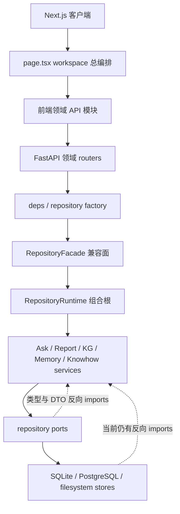

# silicon-notebook 架构评审（2026-08-21）

评审基线：`c39cb33ca616296be0428b7f0fc7f0aac99b4935`

本文是问题清单和讨论材料，不是目标架构承诺。此次变更不修改产品行为、公开 API、数据库结构、检索语义或部署约束；后续是否整改、按什么顺序整改，需要在评审讨论后另行设计和实施。

后续讨论稿见 `docs/modular-plugin-architecture-design-2026-08-21.md`，其目标是以模块化单体、类型化扩展点和受治理插件机制落实本文的高内聚、低耦合整改方向。

## 1. 结论摘要

当前仓库的优势是行为契约强、回归覆盖深、SQLite/PostgreSQL 双后端已有正式适配层，Ask、Deep Report、KG、Memory、Knowhow 等复杂链路也有较完整的失败边界和可观测性。它不是“架构失控、需要重写”的状态。

主要问题是：过去几轮 contract-first 拆分控制住了行为风险，但兼容层、组合根、Protocol、双后端镜像和前端总编排器持续增长，开始形成新的结构成本。现在最值得治理的不是目录命名，而是以下四个可验证的问题：

1. `RepositoryRuntime`、`RepositoryFacade` 和 `ports.py` 已成为高扇出、高表面积的中心节点；抽象数量继续增长，但变更隔离收益递减。
2. 持久化层仍大量反向依赖 `services`，静态依赖图存在 3 个强连通环，说明“ports → services → stores”的文档方向还没有在代码层完全闭合。
3. 前端 API/纯逻辑虽已拆出，但页面级状态、轮询、弹窗和 workspace 编排仍集中在一个约 10K 行的客户端组件里。
4. 核心 Ask、Reasoning、KG 生命周期、MCP 注册函数仍有超长流程；出错时的影响面主要由测试兜住，而不是由模块边界自然限制。

综合判断：

| 维度 | 判断 | 说明 |
|---|---|---|
| 当前行为可靠性 | 较强 | 契约、characterization、双后端 conformance 和失败路径测试丰富 |
| 可演进性 | 中等偏弱 | 中央组合对象和兼容面持续膨胀，跨域改动触点多 |
| 依赖边界清晰度 | 中等 | 目录分层清楚，但实际 import 方向尚有倒挂和环 |
| 前端可维护性 | 偏弱 | 纵向 API 模块已有基础，页面级控制平面仍高度集中 |
| 部署扩展性 | 有明确上限 | 当前单 Uvicorn worker 是有意设计，适合本地/单节点形态，不具备横向扩展与进程级高可用 |
| 工程卫生与可复现性 | 中等 | Git 工作树干净、CI 完整；Python 依赖无锁定且运行/测试依赖混装 |

## 2. 评审范围与方法

本次检查覆盖：

- 根目录规范、正式架构文档、开发/部署文档和近期架构整改记录；
- `backend/app` 的 API、models、services、repositories、migration 和 composition root；
- `frontend/app`、`frontend/features` 及对应测试；
- Git 跟踪/忽略状态、构建产物、缓存、空文件、尾随空白和现有检查脚本；
- Python AST 静态 import 图、函数长度、Protocol/facade 表面积、文件/测试规模；
- 标准后端门禁、contracts 门禁和 `architecture_contract` 测试组。

本次没有：

- 连接 PostgreSQL 或真实模型服务；
- 安装缺失的前端依赖；
- 运行浏览器端到端测试；
- 修改任何业务实现；
- 把历史设计文档当成当前实现证据。判断顺序仍以测试、当前生产代码、当前正式文档为准。

## 3. 仓库卫生结果

### 3.1 已完成的清理

- 删除 `.superpowers/sdd/task-5-report.md`。该文件位于 `.gitignore` 明确标注的“subagent-driven-development scratch”目录，却仍被 Git 跟踪；内容是一次性 Task 5 执行报告，不是正式规范源，历史仍可从 Git 恢复。
- 清理本次检查生成的 `.local/` 日志/字体缓存和 Python `__pycache__`，最终不把验证产物留在工作树。

### 3.2 检查通过项

- 初始工作树无未提交改动、无未跟踪文件。
- `git diff --check` 通过。
- 没有被跟踪的 `.DS_Store`、`*.pyc`、日志、`node_modules`、`.next`、pytest/mypy/ruff 缓存。
- 空文件仅为合法的 Python package `__init__.py`。
- 没有生产代码中的 `TODO`、`FIXME`、`HACK`、`XXX` 标记。

### 3.3 暂不直接修改的卫生问题

以下事项会影响工程一致性，但涉及工具链选择，不宜在“清垃圾”时顺手决定：

- 后端只有 `backend/requirements.txt`，运行依赖、测试依赖混在一起；大量包只设下界，没有可复现锁文件。
- CI 固定 Python 3.13，本机实际验证使用 Python 3.14.6；仓库没有单一 Python 项目元数据声明来统一解释器范围和开发工具配置。
- 前端安装了 ESLint 和 `eslint-config-next`，但 `npm run lint` 实际只执行 `tsc --noEmit`，标准门禁也没有执行 ESLint。
- `docs/` 下有 336 个跟踪文件，其中 317 个是 `docs/superpowers` 历史 spec/plan；历史很完整，但发现当前事实的成本不断上升。

这些问题应单独形成工具链/文档治理方案，而不是本次直接引入新的 formatter、linter 或包管理器。

## 4. 当前架构与实测规模

### 4.1 主要运行链路

这是模块所有权的概念图，不表示所有请求都逐层调用 facade；当前领域 route 已经在使用较窄依赖，部分服务也直接消费 store ports。问题在于兼容组合面仍是大多数运行时对象的集中创建者，且底层包仍引用上层定义。

### 4.2 规模快照

| 指标 | 当前值 | 观察 |
|---|---:|---|
| Git 跟踪文件 | 1,937 | 仓库规模已进入需要自动化边界治理的阶段 |
| 跟踪内容总大小 | 约 42 MB | 测试 fixture、文档和大源文件占比高 |
| 后端生产 Python 文件 | 364 | 领域已较多，继续依靠人工记忆依赖方向不现实 |
| 后端测试文件 | 555 | 覆盖强，但收集和维护成本高 |
| 前端生产 TS/TSX 文件 | 181 | API/logic 拆分已有明显进展 |
| 前端生产 TS/TSX 行数 | 约 64K | `page.tsx` 仍占约六分之一 |
| `docs/` 跟踪文件 | 336 | 其中 317 个为历史 spec/plan |
| `backend/app` / `backend/tests` | 约 10 MB / 13 MB | 测试体量已经超过生产后端源码体量 |
| `frontend/app/page.tsx` | 10,394 行 | `Home` 主组件大致从 837 行延伸到 9,920 行 |
| `RepositoryFacade` 公开方法 | 313 | 兼容表面积过大，调用者很难理解最小能力 |
| repository Protocol | 67 个 / 875 个方法 | 抽象总量已形成自身治理成本 |
| Python ≥150 行函数/方法 | 102 个 | 核心流程存在大量超长控制路径 |
| SQLite / PostgreSQL 同名 store 模块 | 31 个 | 双实现是产品能力，也是持续 parity 成本 |

### 4.3 静态依赖图

对 `backend/app/**/*.py` 的 import 做 AST 扫描，得到 365 个模块节点（含 package 根）和 1,317 条内部依赖边。关键结果：

- `RepositoryRuntime` 直接依赖 54 个内部模块；`RepositoryFacade` 直接依赖 39 个。
- `app.repositories.ports` 被 70 个模块引用，是全仓最中心的业务接口模块之一。
- `repositories → services` 有 65 条模块依赖边；按直接 `from app.services...` 语句统计为 45 处。
- `services → repositories` 同时有 55 条模块依赖边。
- 静态图中有 3 个强连通分量：
  - `repositories.ports ↔ evidence_context ↔ kg.graph_reason ↔ retrieval_candidates`；
  - `notebook_sharing ↔ repository_runtime`；
  - `sqlite_notebook_sharing ↔ sqlite_repository`。

其中一部分边位于 `TYPE_CHECKING` 或函数内延迟 import，不一定造成 Python 启动时的循环导入故障；但它们仍证明类型所有权和模块所有权是闭环的，重构时必须同时理解两侧。

## 5. 做得好的架构部分

### 5.1 行为契约和失败边界成熟

Ask 断连/取消、报告重试、来源删除与重建、范围冻结、双后端迁移、Memory 隔离等高风险语义都有明确的测试和文档契约。当前架构债务的主要风险是修改成本和误伤半径，不是已发现的数据正确性事故。

### 5.2 API 和前端 transport 已开始领域化

后端已经从单一 aggregate route 拆成领域 routers；前端也有 notebook/source/ask/report/knowledge/group 等 API 模块以及独立纯逻辑模块。说明增量式纵切拆分路径是可行的，不需要引入第二套框架。

### 5.3 双后端不是“半功能”

SQLite 和 PostgreSQL 都有 bundle/store、迁移和 conformance 覆盖，PostgreSQL 还有独立 CI。这里的问题是维护成本，不是建议退回单后端或用 ORM 一次性重写。

### 5.4 有正式的离线门禁分层

G1/G2/G3、前端 Node 多版本、PostgreSQL 集成和 architecture contract 均已有明确入口。下一步应调整门禁归属和速度，而不是再复制一套命令。

## 6. 架构问题清单

### A1（P1）：组合根和兼容 facade 已成为系统级变更热点

证据：

- `RepositoryRuntime.__init__` 约 415 行，直接 import/组合 54 个内部模块。
- `RepositoryFacade` 有 313 个公开方法，构造函数约 458 行，文件约 4,340 行。
- `ports.py` 约 4,941 行，包含 67 个 Protocol 和 875 个方法；最大的单个 Protocol 有 72 个方法。
- `repository_runtime.py`、`repository_facade.py` 分别位于内部依赖出度第一、第二。

影响：

- 新领域通常要同时改 store、bundle、port、runtime、facade、ownership/contract fixture，局部能力的交付成本被中央登记成本放大。
- facade 既承担兼容，又暴露大量运行时对象；“先从 facade 拿到大对象，再访问内部能力”很容易重新出现。
- 组合根需要知道每个领域的构造细节，生命周期、关闭顺序和替换测试越来越难推理。

建议：

1. 冻结 facade 新增面：新 route/新 service 默认不能新增 facade 方法，除非有明确的遗留调用者和退役条件。
2. 按领域提取纯构造函数，例如 Ask、Report、KG、Memory/Agent 各自返回一个最小 application service 集；`RepositoryRuntime` 只组合这些结果，不内联所有接线细节。
3. route dependency 直接注入领域 application service 或窄 port，不以整个 repository/facade 为默认入口。
4. 为 facade 方法建立“调用者、真实 owner、兼容原因、退役条件”账本，方法数只能下降或有显式例外。

验收信号：新增一个用户能力时，不再天然触碰 facade 和总 runtime；领域构造测试可以不创建完整 repository；facade 公开方法持续减少。

### A2（P1）：依赖方向仍有倒挂和静态环

证据：

- `repositories/ports.py` 直接从 `services` 导入取消、检索、scale 和 follow-chain 类型。
- SQLite/PostgreSQL stores 从 `services` 导入向量编码、知识状态、显示标题、搜索档案、抽取 profile、KG 常量等。
- `core/llm.py` 反向依赖 `services.cancellation`；`models/agent_profile.py` 依赖 service 层标签常量。
- 静态 import 图存在 3 个强连通分量。

影响：

- ports 不再是稳定的低层契约包，而是会被上层 DTO/算法变化牵动。
- store conformance 测试要加载更多 service 依赖，独立测试和复用成本增加。
- 当前用 `TYPE_CHECKING` 和局部 import 避开运行时故障，但没有消除所有权循环。

建议：

1. 新建或明确一个无副作用、低依赖的 contract/domain primitives 层，只放 DTO、枚举、常量和 Protocol 使用的值对象。
2. 把向量 codec、可用状态、显示标题规则等按所有权分类：纯存储 codec 放 repository primitives；领域规则由 service 计算后作为参数传入 store。
3. 先消除 3 个 SCC，再把 `repositories → services` 依赖数设为受检指标；不要追求一次清零。
4. 在 architecture contract 中加入 package import 方向和 SCC 检查，允许列表必须逐项写明原因及删除条件。

验收信号：`ports.py` 不再 import `app.services.*`；models/core 不依赖 services；静态依赖图无 SCC；store 可用最小依赖单独导入。

### A3（P1）：前端“逻辑已拆、控制平面未拆”

证据：

- `frontend/app/page.tsx` 10,394 行，`Home` 主组件覆盖约 9K 行。
- 同一组件管理 collection/workspace 跳转、source scope、Ask 会话、KG、reports、Memory、Knowhow、group sharing、维护任务、多个轮询和大量 modal 状态。
- 现有 `architecture.md` 也把 workspace 状态拆分列为未完成项。

影响：

- 任一功能增加 state/effect 都会扩大整个组件的闭包和依赖集合。
- effect 依赖、请求竞态、modal/轮询清理和 notebook 切换状态复位难以局部证明。
- 组件测试需要构造大环境；review diff 很难只围绕一个用户流程。

建议：

1. 先按“状态所有权”拆 hooks，而不是按 JSX 大小拆展示组件：collection、source library、Ask session、report workspace、KG workspace、modal manager。
2. 每个 hook 明确输入的 notebook/user identity、取消/cleanup 规则和对外事件；禁止直接读取其他 hook 的内部 setter。
3. 把 notebook 切换、权限重验、删除 tombstone、轮询停止做成显式 transition，而不是散落在多个 effect。
4. 继续沿用现有 API modules、Testing Library 和纯逻辑测试，不为拆分引入新的全局状态库。

验收信号：`page.tsx` 只保留页面级路由/布局编排；核心领域状态可在不渲染整个 Home 的情况下测试；notebook 切换和卸载只有一个清理入口。

### A4（P1）：核心流程函数过长，阶段边界主要存在于注释和测试中

代表性证据：

- `reasoning_retrieval.py::run` 约 1,920 行；
- `api/mcp_server.py::create_memory_mcp` 约 1,475 行；
- `ask_service.py::ask_reasoning` 约 1,119 行；
- `notebook_sharing.py::copy_notebook` 约 660 行；
- `knowledge_lifecycle.py::rebuild_unified_kg` 约 535 行；
- 全仓有 102 个不短于 150 行的 Python 函数/方法。

影响：

- 取消、重试、数据库连接、模型调用、事件记录和结果组装混在同一控制流时，局部修改很难证明不改变阶段顺序。
- 超长函数虽然被回归测试保护，但单元边界弱，失败注入通常只能从较高层进行。

建议：

1. 只沿已有语义阶段拆分：prepare/resolve scope/retrieve/synthesize/persist/audit/terminalize；不要为了行数制造无意义 helper。
2. 阶段之间使用不可变输入/输出对象，正文、证据、计时、取消状态分开传递。
3. 数据库连接和 leaf I/O 的持有区间在接口上显式化，避免抽取 helper 后意外扩大锁或连接生命周期。
4. MCP 工具按 capability 分模块注册，由一个薄 composition 函数汇总；共享授权/错误映射保持唯一实现。

验收信号：每个阶段可独立失败注入；顶层函数主要表达顺序与终态；阶段拆分不改变事件顺序、事务边界和持久化 JSON。

### A5（P1）：最关键的架构门禁不在 PR 标准门内

证据：

- G1 后端明确排除 `architecture_contract` 和 `graph_index_contract`。
- 64 个 architecture contract 本次单独执行全部通过，但用时约 56 秒，并要先收集 9,442 个测试。
- G2 每日任务才执行这些契约；因此结构违规可以先合入 master，等夜间任务才发现。

影响：

- repository 调用边界、模型 transport、测试架构、隐私 guard 等结构回归可能在主分支存在一个检测窗口。
- 因为所有 architecture tests 共用一个 marker，轻量 AST guard 和较重检查不能分别安排。

建议：

1. 把纯 AST/manifest/import 方向检查拆成快速 PR architecture lane；真正冷启动或全仓高成本检查保留每日 G2。
2. 避免让快速 lane 收集整个 9K 测试树；使用明确测试根或独立脚本，但仍由唯一 wrapper 维护命令。
3. CI 输出结构指标趋势：SCC 数、反向依赖数、facade 公开面；阈值只在评审确认后收紧。

验收信号：关键依赖违规无法合入 master；每日门仍覆盖重检查；本地 G1 的时间目标不被破坏。

### A6（P2）：Python 构建与依赖不可完全复现

证据：

- `requirements.txt` 同时包含 FastAPI、解析/科学计算、数据库、pytest/xdist 等运行与测试依赖。
- 多数依赖只有下界；只有少量兼容性敏感包有上界。
- 没有 `pyproject.toml`、constraints/lock 文件或统一的 lint/type 配置。
- CI 用 Python 3.13，本次本机门禁实际运行于 Python 3.14.6。

影响：

- 同一 commit 在不同日期安装会得到不同依赖图；上游大版本或传递依赖变化可能导致无代码变更回归。
- 生产安装携带不必要测试工具；本地和 CI 的解释器/工具行为可能漂移。

建议：

1. 先决定 pip-tools、uv 或等价方案，再建立运行、开发/测试两个输入集合和受控锁文件。
2. 在项目元数据中声明支持的 Python 范围，并让 CI 至少覆盖最低版本与当前主版本。
3. 把 formatter/linter/typecheck 配置集中到项目元数据；引入工具前先确定增量采用和存量基线策略。

验收信号：同一 commit 可解析出相同依赖；生产依赖不包含 pytest；本地/CI 对支持版本有一致解释。

### A7（P2）：双数据库后端的 parity 成本持续上升

证据：

- SQLite 目录 35 个 Python 模块，PostgreSQL 目录 39 个，其中 31 个同名 store 模块。
- 两端都有数千行级 knowledge/knowhow/maintenance/query store；conformance 测试本身也出现 4K–5K 行级文件。
- SQLite schema 已到 v56，PostgreSQL 有独立迁移序列和 shadow/cutover 设施。

影响：

- 每个数据能力通常要实现两次 SQL、两次 row mapping、两套迁移，再补 conformance；策略不慎落入 adapter 时容易漂移。
- 继续扩大 ports 会进一步放大双实现和 fixture 更新成本。

建议：

1. SQL 和数据库锁语义继续分开，不建议引入 ORM 统一查询。
2. 把验证、状态机、排序键定义、DTO 装配等后端无关规则移到共享纯函数；store 只保留 dialect/事务/row selection。
3. 建立 capability parity matrix，由测试从 manifest 生成缺口报告，减少手工比对。
4. 新增能力设计必须明确：共享规则、SQLite 特有实现、PostgreSQL 特有实现、conformance 断言各归哪里。

验收信号：新增 store 方法时共享规则只实现一次；两后端差异有显式理由；conformance failure 能直接指出哪个 capability 漂移。

### A8（P2）：规范和历史文档的增长正在削弱“单一事实源”

证据：

- `AGENTS.md` 约 375 KB，`CLAUDE.md` 约 240 KB。
- `product-and-api.md` / `_zh.md` 分别约 388 KB / 346 KB。
- `architecture.md` 约 92 KB，标题更新时间仍是 2026-07-22，但正文已继续追加到 SQLite v56 和 2026-08 的能力。
- 正式文档、根 README、代理合同、历史 spec/plan 之间有大量同步义务。

影响：

- 修改一个约束需要触碰多份大文件，review 很难判断是实质变化还是同步复制。
- 新开发者或 Agent 很难快速找到当前架构边界；历史设计容易被误读为现状。
- 超大代理合同增加上下文成本，也提高局部规则互相覆盖或过期的概率。

建议：

1. 保留中英文产品/运维文档要求，但把长期不变的开发契约拆成可索引的主题文件，由短入口文件链接；先确认各 Agent 是否支持 include/索引机制。
2. `architecture.md` 保留当前组件、数据流、ADR 和活跃债务；逐版本迁移叙述移到 schema history/runbook。
3. 历史 spec/plan 增加索引和状态元数据（implemented/superseded/abandoned），默认搜索先命中 current 文档。
4. 为四文件同步做语义检查或共享生成片段，减少人工复制。

验收信号：新成员从短入口可找到当前事实；架构文档更新时间可信；历史计划不会被当作现行约束；同步变更 diff 显著缩小。

### A9（P2，战略约束）：单进程运行时限制横向扩展和高可用

当前生产固定单 Uvicorn worker，以保证进程内模型 scheduler、取消 registry、后台任务和容量边界具有部署级唯一性。这在当前本地 beta/单节点目标下是合理且明确的架构决策，不是缺陷。

风险在于：PostgreSQL 后端和共享授权已经具备更强部署能力，但应用运行时仍不能通过增加 worker/实例横向扩展；进程重启也会丢失仅存在内存中的协调状态。若未来目标变成多实例或高可用，不能只改 worker 数。

建议：

- 现在只把单进程约束写成正式 ADR 和容量告警，不提前引入消息队列或分布式锁。
- 当出现明确的多实例目标时，再把 scheduler admission、job lease/cancellation、progress/event bus 和 leader/worker 生命周期作为一组设计，避免局部外置造成双重容量权威。

## 7. 建议的整改顺序

### 阶段 0：先建立可量化护栏，不改行为

1. 确认本报告的优先级和非目标。
2. 把轻量 architecture checks 移入 PR gate。
3. 固化依赖图基线：SCC、`repositories → services`、facade 公开方法、runtime 出度。
4. 决定 Python 依赖锁定方案。

### 阶段 1：先闭合依赖方向，再拆组合根

1. 提取 contract/domain primitives，消除 `ports.py` 对 services 的反向依赖。
2. 消除 3 个静态 SCC。
3. 将各领域接线从 `RepositoryRuntime.__init__` 提取为可独立测试的构造函数。
4. 冻结 facade 新增面，建立退役账本。

这一步优先于大规模拆长函数，因为稳定的依赖方向能避免拆出的新模块继续挂回中央对象。

### 阶段 2：前端按状态所有权纵切

建议从 source library 或 Ask session 选一个流程做样板：它们都有明确的 notebook identity、请求取消、轮询/流式状态和 UI surface，能够验证 hook 边界是否真的降低竞态复杂度。每次只迁移一个状态域，并用现有交互测试保持行为。

### 阶段 3：拆核心工作流阶段

优先处理 `reasoning_retrieval.run`、`ask_reasoning` 和 `create_memory_mcp`。以取消、I/O、事务和持久化终态为边界，不以文件行数为唯一目标。

### 阶段 4：双后端和文档治理

在前述边界稳定后，再提取共享数据规则、生成 parity matrix，并重组正式架构/迁移历史。否则文档会在整改过程中反复重写。

## 8. 明确不建议的操作

- 不建议一次性 Clean Architecture 重写。
- 不建议为了减少重复 SQL 引入 ORM 并统一 SQLite/PostgreSQL 查询。
- 不建议立即拆微服务、拆仓库或引入消息队列。
- 不建议用新的前端全局状态库掩盖当前状态所有权不清。
- 不建议按固定行数机械拆函数。
- 不建议删除 facade 兼容面后批量修改所有调用者；应按真实调用者逐域收缩。
- 不建议在没有多实例产品目标前外置进程内 scheduler。

## 9. 需要讨论并作出的决定

1. 第一优先是前端 workspace 状态拆分，还是后端依赖方向/组合根收缩？本报告建议先做后端阶段 0/1 的轻量闭环，再并行推进一个前端样板域。
2. 是否接受“facade 公开面冻结，新增需例外审批”作为新约束？
3. architecture contract 中哪些必须进入 PR，哪些继续留在 daily？
4. Python 依赖治理选择哪套工具，是否同时建立生产/开发依赖分层？
5. 单 Uvicorn worker 是未来一年内的稳定产品边界，还是已经需要多实例路线？
6. 历史 spec/plan 是否可以加状态索引并从默认当前文档导航中降级？

## 10. 验证记录

| 检查 | 结果 |
|---|---|
| Git 初始状态、忽略产物、跟踪型缓存、空文件、尾随空白 | 通过；发现并删除 1 个跟踪型 scratch |
| `architecture_contract` | 64 passed，9,378 deselected，56.06s |
| G1 后端测试主体 | 8,425 passed；9 failed 均为受限环境禁止 `socket.bind(127.0.0.1, 0)`，不是业务断言失败 |
| contracts smoke + harness | smoke/契约通过，harness 54 passed；wrapper 最终因受限环境禁止写 `/dev/stdout` 返回非零 |
| 前端测试/构建 | 未运行：工作树未安装 `frontend/node_modules`，本次未联网安装依赖 |
| PostgreSQL / G2 / G3 | 未运行 |

因此，本次不能声称完整 `scripts/check.sh` 绿色。可以确认的是：架构契约全绿，后端主体除受限 socket 生命周期用例外全绿，文档与 scratch 清理未触碰运行时代码。

## 11. 证据入口

- 当前架构：`architecture.md`
- Repository contracts：`backend/app/repositories/ports.py`
- 组合根：`backend/app/services/repository_runtime.py`
- 兼容 facade：`backend/app/services/repository_facade.py`
- 前端总编排：`frontend/app/page.tsx`
- 标准门禁：`scripts/check.sh`、`scripts/check_backend.sh`、`scripts/check_frontend.sh`
- 架构测试：`backend/tests/test_architecture_hardening.py`、`backend/tests/test_repository_dependency_contract.py`
- 历史整改：`docs/superpowers/specs/2026-07-10-architecture-remediation-design.md`、`docs/superpowers/specs/2026-07-11-repository-review-remediation-design.md`
