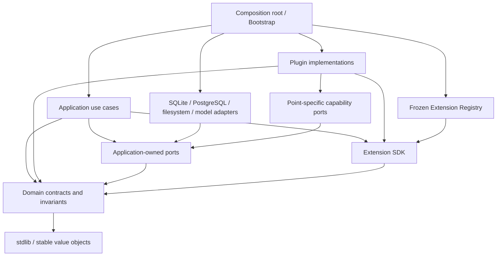
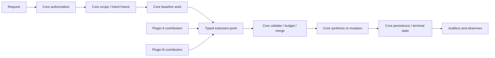

# silicon-notebook 模块化与插件扩展架构设计（修订版）

> **注记（2026-08-23）**：`answer.audit`、`report.audit`、`source.element_enricher`、
> `knowledge.candidate_projector` 与 `agent.tool_provider`（外部 provider descriptor 追加那一半）
> 五个扩展点已因零消费者移除——与本文 §17「不为以后可能有用预建没有真实消费者的 hook」一致。
> 本文保留原始设计记录，不代表当前代码状态。

日期：2026-08-21
状态：实施稿（取代同名初稿；供实现，实施后由最终 review 收口）
依据：`docs/architecture-review-2026-08-21.md`；初稿；初稿评审意见（Claude，2026-08-21）

本文设计的是 **silicon-notebook 应用内部的功能扩展机制**，不是 Codex/IDE 插件。目标是优化当前代码仓的高内聚、低耦合能力，并让后续功能可以通过新增受治理的插件接入摄取、检索、Ask、Deep Report、知识处理和 UI 主流程。

本文不是逐任务实现计划，也不改变当前产品行为。文中的"必须"用于保护现有安全、数据和行为契约；"建议"给出优选形态；其余实现细节留给具体功能的 developer 在设计和评审中决定。**实施任何一个阶段时，若触碰开发约束，须按仓库文档同步红线同批更新 `README.md`/`README_zh.md`/`AGENTS.md`/`CLAUDE.md` 与 `docs/` 权威文档；精确数值上限只登记在 `docs/product-and-api*.md`。**

## 0. 与初稿的差异（修订记录）

初稿的主体结构、内核不变量清单、四类贡献语义、失败/预算/取消语义与非目标全部保留。以下是实质调整，均来自对照仓库既有硬契约的评审：

1. **Provider 语义拆分**：初稿的 Provider（"由内核选择一个"）与解析路由的真实形状不匹配，拆成 `Provider`（单选）与 `ProviderChain`（有序候选链 + 产出验收裁决 + 分级降级 + 警告面）两种；parser 属后者（§4.2、§6.2）。
2. **样板顺序对调**：Phase 1 改为 retrieval contributor host（原 Phase 2），parser 迁移后移为 Phase 2 并以 ProviderChain 语义承载（§14）。理由：contributor 语义与仓库现有红线逐字同构、已有两个护栏完备的真实消费者；parser 若按单选语义先行会把错误抽象定型。
3. **注册拓扑冻结与能力可用性动态显式分离**：模型服务配置热加载、解析引擎可用状态动态，availability 不得在启动时定死；`/system/extensions` 读实时可用性；`ScheduledModelAccess` 是按调用解析实时绑定的句柄（§2.5、§5.3、§9、§11）。
4. **状态型插件的 schema 成本模型重写**：任何插件新表都是核心级 schema 变更（正向 shadow 不变量、停车方案、deep-copy、merge 归类、哨兵登记缺一不可）；新增"模板表形状"快速通道与升级判据（§10）。
5. **`synthesis.guidance` 移出 v1**，与 `ask.mode_provider` 一起推迟，并写明各自开放前置条件（§6.4、§17、§19）。
6. **MCP `agent.tool_provider` 补上 `PUBLIC_TOOLS` 单一真源的迁移路径**：组合清单派生、逐工具心跳不变式、scope 词表双侧同步、Agent 面 owner-only 分叉继承（§6.6）。
7. **测试落点钉死在既有测试根**：后端 `backend/tests`、前端 `frontend/tests/{unit,component,guards}`；feature/插件目录内不放测试（初稿 §15 样例会让插件测试静默逃出 G1 收集）（§13.3、§15）。
8. **目录边界对齐生产目录红线**：前端 SDK 落 `frontend/features/extension-sdk/`；后端每个新顶层包的引入必须同批 rebaseline 语义架构守卫，并确认用户文案守卫覆盖面（§3.2）。
9. **前端拆分为并行轨道**：state-owner hooks 抽取不依赖 Extension SDK，Phase 0 完成后即可启动并行推进；Phase 5 只保留 build-time registry 与 contribution 渲染（§14）。
10. **前端首批 slot 收窄**为 `workspace.side_panel` + `source.detail_section`；`toolbar_action`、`main_tab` 推迟（§6.7）。
11. **插件错误文案、界面词、长任务按钮忙碌态等前端红线**进入"必须遵守"清单（§8.4、§16）。
12. **LLM 响应缓存政策归内核**：插件经 `ScheduledModelAccess` 使用统一的 validator/缓存机制，不得自建响应缓存（§5.3、§7.3）。
13. **facade 新增面冻结与 SDK 解耦**：它是评审报告 A1 的独立整改项，Phase 0 即执行，不等插件机制（§14）。
14. 初稿 §19 的 7 个开放问题落为决定记录（§19）。
15. **（2026-08-23 补记）五个零消费者扩展点已由 #569 整体移除**：`answer.audit`（§6.4）、`report.audit`（§6.5）、`source.element_enricher`、`knowledge.candidate_projector`（均 §6.2）与 `agent.tool_provider`（§6.6，含其四条前置红线）在仓库里从未有真实消费者，按 §17「不为以后可能有用预建没有真实消费者的 hook」的原则被整体退役；§6.2/§6.4/§6.5/§6.6 里描述它们的段落，以及 §19「遗留待后续单独决策」中「`agent.tool_provider` 正式开放时 `PUBLIC_TOOLS` 组合派生的具体实现与守卫改造」一条，均随之失效，只作原始设计记录保留，不代表当前代码状态。下一阶段方向不是重新引入这五点，而是探索**可信、同进程、仓库外（部署装入）的第三档插件**；具体接入方式以后续的扩展接入 SOP 文档为准。

## 1. 背景与设计目标

当前仓库已经完成多轮 contract-first 拆分，但仍存在以下结构性问题（证据见评审报告）：

- `RepositoryRuntime`、`RepositoryFacade` 和 `ports.py` 是高扇出、高表面积中心；
- repositories、services、core/models 之间仍有反向依赖和 3 个静态强连通环；
- Ask、Reasoning、Report、MCP、KG 等主流程的阶段边界不够显式；
- 前端 API/纯逻辑已经拆开，但 workspace 状态和 UI 编排仍集中在约 10K 行的 `page.tsx`；
- parser、Ask mode、model workload、retrieval enrichment 已分别形成注册/扩展雏形，但缺少统一的生命周期、能力、安全和失败语义。

本设计的目标是：

1. **高内聚**：一个功能模块拥有自己的应用逻辑、契约适配、状态、API、UI 和测试落点，修改该功能时尽量不触碰无关领域。
2. **低耦合**：主流程只依赖稳定扩展契约，不依赖具体插件；插件不依赖 facade、runtime 或其他插件实现。
3. **主流程可扩展**：新增解析器、检索补充、审计、导出、知识投影、workspace panel 等能力时，通过注册贡献接入，而不是修改多个中央 `if/elif` 或巨型构造函数。
4. **不变量不可绕过**：权限、范围冻结、模型调度、事务、取消、终态、证据绑定、隐私和内容安全继续由内核唯一拥有。
5. **渐进迁移**：不重写现有系统；先建立扩展 SDK 和护栏，再把已有可选能力包装成内建插件。
6. **给 developer 留空间**：固定边界和验收条件，不规定插件内部必须使用哪种类层次、函数拆法或第三方库。

## 2. 核心架构决策

### 2.1 继续采用模块化单体

第一阶段保持 FastAPI + Next.js + SQLite/PostgreSQL 的单体仓库和现有进程模型（生产固定单 Uvicorn worker）。插件是模块化单体内部的受治理扩展，不等于微服务，也不要求独立部署。

理由：

- 当前主要矛盾是代码依赖和变更半径，不是网络隔离或独立扩缩容；
- 主流程包含范围冻结、取消、数据库事务和模型容量等紧密语义，过早跨进程会显著增加一致性成本；
- 单 worker 前提下，进程内锁（如命令目录的 per-notebook 目录锁）与进程内注册表是既有安全论证的一部分，插件机制不得引入第二个进程语义；
- 模块化单体可以先验证扩展点是否稳定，未来再为同一契约增加 RPC adapter。

### 2.2 使用显式、类型化的扩展点，不使用万能 hook/event bus

主流程由明确的 application pipeline 负责。pipeline 只在少数稳定阶段调用具名扩展点，例如：

- `source.parser_chain`（ProviderChain，见 §4.2）
- `retrieval.query_hint`
- `retrieval.contributor`
- `answer.audit`
- `report.exporter`
- `knowledge.candidate_projector`
- `workspace.side_panel` / `source.detail_section`

不提供通用的 `before_anything`、`after_anything`、任意事件订阅或运行时 monkeypatch。新增扩展点必须先定义输入、输出、顺序、预算、失败策略和不可变条件。

### 2.3 内核固定流程，插件只提交 contribution

插件不能直接修改 pipeline 的共享可变对象。它接收不可变、最小化的上下文，返回一个类型化 contribution；内核负责验证、裁剪、去重、合并和持久化。

这使插件承担"产生候选能力"，内核承担"接受什么以及如何生效"的最终责任。

### 2.4 可信内建插件优先，不可信插件必须进程隔离

插件分为两种信任级别：

| 类型 | 第一阶段支持 | 执行位置 | 适用场景 |
|---|---|---|---|
| 可信内建插件 | 是 | FastAPI/Next.js 同进程、随版本构建 | 本仓库团队开发的功能模块 |
| 外部隔离插件 | 预留（仅文档，不做协议原型） | 独立进程或服务，经 RPC adapter | 第三方、不完全可信或独立发布能力 |

绝不在生产 Web 进程中动态 `pip install` 或 import 未审查的第三方代码。若未来需要插件市场、在线安装或用户自定义代码，必须进入隔离插件阶段，不能扩大第一阶段的信任假设。

### 2.5 注册拓扑启动冻结；能力可用性是运行时动态的

**这是两层，必须分开**（初稿混为一谈）：

1. **注册拓扑**（哪些插件存在、贡献了哪些 contribution、依赖顺序）在应用启动时完成发现、配置验证、依赖排序和能力检查后**冻结为只读**。启用/停用插件需要重启。这避免请求进行中 registry 变化、后台 worker 看到不同插件集合、报告 planning/generation 使用不同能力等一致性问题。
2. **能力可用性**（这个插件此刻能不能用）是**每次消费时实时判定的**。仓库既有先例是硬性的：模型服务配置热加载（watcher、离线模式、代际切换，且"状态页必须读取实时 registry，业务服务不得缓存或直连物理 raw client"）、解析引擎可用状态随 MinerU 配置动态变化（现有解析注册表就是下发"可用状态 + 固定原因枚举"）。依赖模型或外部服务的插件，availability 不得在启动时定死。

推论：

- `/system/extensions` 投影的"可用状态"字段读实时判定，不读启动快照；
- `ScheduledModelAccess` 是按调用解析当前绑定/当前 runtime 代际的句柄（见 §5.3）；
- 插件 manifest 的 `requires` 在启动时只校验"该 capability 的判定入口存在"，不校验"此刻可用"。

## 3. 目标依赖结构

### 3.1 逻辑分层



依赖规则：

- `domain/contracts` 不依赖 services、repositories、API 或具体插件；
- application use case 依赖 ports 和 extension contracts，不依赖 adapter；
- adapter 实现 port，不反向 import application service；
- 插件依赖 Extension SDK 和它被授予的窄 capability ports；
- 内核不 import 插件实现；只有 composition root 同时认识两者；
- 插件之间不得直接 import 实现。需要协作时通过稳定 capability 或显式 manifest dependency。

### 3.2 目录形态与既有边界红线的对接

推荐后端形态（不要求一次性移动既有文件）：

```text
backend/app/
  domain/                    # 稳定值对象、枚举、不变量
  application/               # Ask/Report/Ingestion 等 use-case/pipeline
  ports/                     # application-owned ports，按领域拆分
  extension_sdk/             # manifest、extension point、context、result
  extensions/                # registry、runner、bootstrap、diagnostics
  features/
    <feature>/               # 内建插件或高内聚功能模块（生产代码，不含测试）
      plugin.py
      application.py
      contracts.py
      adapters/
      api.py
  infrastructure/
    sqlite/
    postgres/
    filesystem/
```

前端形态（**与初稿不同**）：

```text
frontend/
  app/                       # shell、路由、全局 transport
  features/
    extension-sdk/           # UI contribution contracts（不新开顶层目录）
    <feature>/               # 组件、hook、API、状态（生产代码，不含测试）
      plugin.ts
```

**对接既有红线的三条硬性要求**：

1. **前端生产目录红线**：前端生产代码只放 `frontend/app` 与 `frontend/features`。因此 UI extension SDK 落 `frontend/features/extension-sdk/`，不新开 `frontend/extension-sdk/` 顶层目录。用户文案守卫（`scripts/check_ui_vocabulary.py`）的信任边界覆盖 `app` 与 `features`，SDK 与所有插件 UI 自动落在覆盖面内；任何要新开前端顶层目录的提案都必须同批修改该红线与守卫覆盖面，且单独过评审。
2. **后端新顶层包的引入必须同批 rebaseline 架构守卫**：语义化架构守卫（`{path, scope, kind, target}`）与 repository dependency contract 均含路径基线。每引入一个新顶层包（`domain/`、`extension_sdk/` 等），同一 PR 里必须跑 `--rebaseline-surface` / `--rebaseline-callers` 并解释 diff；不允许"先建目录、守卫红了再说"或顺手放宽守卫。
3. **测试不进 feature 目录**：见 §13.3。生产目录里不放测试是既有红线，插件不豁免。

现有目录可按修改触达逐步迁移；不做"为了目录好看"的全仓搬家。具体插件内部是否再分 domain/application/adapters，由功能复杂度和 developer 判断。

## 4. 稳定内核与可扩展区域

### 4.1 不允许插件替代的内核责任

以下能力必须保持唯一所有者，不能成为可覆盖 hook：

| 内核责任 | 原因 |
|---|---|
| 身份认证与 notebook/group/row-level 授权 | 插件不能成为第二套权限系统；授权谓词唯一定义点在 `access_sql.py`/`mount_sql.py` |
| source/base/Memory/Knowhow 参与范围冻结与漂移复检 | 防止越权和隐藏前提 |
| Ask/report job 创建、取消、重试和终态顺序 | 保持持久化和断连语义 |
| 模型 workload 解析、scheduler、容量、熔断、响应缓存 | 保持唯一物理服务容量权威与缓存投毒面控制 |
| 数据库连接、事务、锁和 migration runner | 防止插件扩大锁窗口或绕过双后端/shadow 契约 |
| 引用、证据 key、citation binding 和 provenance 验证 | 防止插件伪造可点击证据 |
| 基线结果保护、用户数据上限和无静默截断 | 防止插件改变既有结果或吞数据 |
| content-free 运行事件的字段白名单 | 防止问题、来源、证据或异常文本泄露 |
| UI mode、权限投影和前后端能力一致性 | 防止半功能或隐藏值复用 |
| 用户可见错误文案出处（`user_error()` / `errors.ts`）与界面词表 | deny-by-default 按出处判信任，插件不得另起炉灶 |

插件可以请求这些能力的受限服务，但不能重新实现或绕过判定。

### 4.2 允许扩展的贡献类型（五类）

1. **Provider**：为某个能力提供一个实现，由内核**单选**，例如 report exporter。适用于"同一时刻恰好一个实现生效"的点。
2. **ProviderChain**（新增，初稿没有）：为某个能力提供**有序候选链中的一环**。内核按既有确定性顺序逐个尝试，每环的产出要过**验收裁决**（accept / reject-with-reason），被拒或失败则按链降级到下一环，并在需要时点亮**警告面**。解析路由是这个形状的现实标杆：MinerU→PyMuPDF4LLM→pypdf 的分级降级、workbook 行+格覆盖对账拒收、探针映射与带图重映射两段式、自托管绝不静默切公共云、`MINERU_CAPABLE_SUFFIXES` 与刻意更窄的 `MINERU_FALLBACK_WARNING_SUFFIXES` 两个真源集合。把这些压进"单选 Provider"会静默丢掉验收与警告语义，所以它必须是独立的贡献类型。
3. **Contributor**：向已有结果增加候选、证据、提示或 UI surface；不能删除或改写基线。
4. **Auditor**：在核心结果完成后生成审计状态或附加说明；不能重写正文或新增事实。
5. **Observer**：接收已经完成的生命周期通知，用于统计、索引或异步投影；不能改变当前请求结果。

Provider 是"选择一个"；ProviderChain 是"按序尝试直到验收通过"；Contributor/Auditor/Observer 是"运行零到多个"。不要用一个通用接口混合这五种语义。

## 5. Extension SDK

### 5.1 Manifest

每个插件必须声明不可变 manifest。示意接口：

```python
@dataclass(frozen=True)
class ExtensionManifest:
    id: str
    version: str
    api_version: str
    display_name: str
    trust: Literal["builtin", "isolated"]
    contributions: tuple[str, ...]
    requires: tuple[str, ...]
    optional_requires: tuple[str, ...] = ()
    depends_on: tuple[str, ...] = ()
```

`requires` / `optional_requires` 声明 capability，`depends_on` 才声明插件 ID；两者不得混用。manifest 只声明能力、插件拓扑和兼容性，不包含密钥、endpoint、文件路径或任意异常文本。

启动时必须校验：

- 插件 ID 和 contribution ID 唯一；
- Extension API 版本兼容；
- required capability 的**判定入口存在**（不校验此刻可用，见 §2.5）；
- `depends_on` 指向已注册插件且插件依赖无环；
- 一个 single-provider 扩展点没有多个同时生效的 provider；ProviderChain 的链序确定且无重复环节；
- 配置 schema 可解析、数据库 schema 版本满足该插件声明的最低版本；
- 后端启用的用户能力具有对应前端 contribution，反之亦然（Full-Stack Parity 的启动侧检查）。

### 5.2 注册接口

插件只通过 registrar 注册具名 contribution：

```python
class ExtensionBundle(Protocol):
    manifest: ExtensionManifest

    def register(self, registrar: "ExtensionRegistrar") -> None: ...


class ExtensionRegistrar(Protocol):
    def add_parser_chain_link(self, link: "ParserChainLink") -> None: ...
    def add_retrieval_contributor(
        self, contributor: "RetrievalContributor"
    ) -> None: ...
    def add_answer_auditor(self, auditor: "AnswerAuditor") -> None: ...
    def add_report_exporter(self, exporter: "ReportExporter") -> None: ...
```

registrar 不是 service locator。它不提供 repository、runtime、settings 或其他插件实例。

### 5.3 最小化执行上下文

不要设计一个包含所有能力的 `PluginContext`。每个扩展点定义自己的最小上下文，例如：

```python
@dataclass(frozen=True)
class RetrievalExtensionContext:
    actor: ActorRef
    notebook: NotebookRef
    scope: FrozenRetrievalScope
    run: RetrievalRunRef
    cancellation: CancellationToken
    budget: RetrievalContributionBudget
    reader: ScopeBoundEvidenceReader
    models: ScheduledModelAccess
```

上下文不得暴露：

- `RepositoryFacade`、`RepositoryRuntime` 或完整 `NotebookRepository`；
- 原始数据库连接、cursor 或 write transaction；
- 未过滤的 Settings、环境变量或模型密钥；
- 另一个插件实例；
- 可修改的全局 request ContextVar；
- scope 外的 source、Memory、Knowhow 或 base identity。

`ScopeBoundEvidenceReader` 必须在 SQL/adapter 边界执行冻结范围，不允许插件先读全集再做结果过滤。Memory 归属谓词（按创建者私有）必须写在取数 SQL 里而不是结果侧——与仓库既有红线同一条。

`ScheduledModelAccess` 的三条硬性语义：

1. **实时解析**：每次调用按当前 registry 解析绑定与 runtime 代际，绝不缓存 raw client（镜像模型热加载红线）；
2. **缓存政策归内核**：`chat_json` 的内容寻址缓存是"传 `response_validator` 才读写"的 opt-in。插件是否享受缓存由该扩展点的内核合同决定（点级声明是否接受 validator），插件**不得自建响应缓存**——那会重新引入"偶发坏值固化整个 TTL"的投毒面；
3. **workload 归属**：插件模型调用必须挂在内核为该扩展点分配的 workload 上，不得复用无关 workload 的容量或预算。

### 5.4 Contribution 结果

插件返回领域结果，不返回"下一步该调用什么"的命令字符串。以检索为例：

```python
@dataclass(frozen=True)
class RetrievalContribution:
    hits: tuple[EvidenceCandidate, ...]
    supports: tuple[ProducerSupport, ...]
    status: Literal["available", "unavailable", "partial"]
```

内核接收后负责：

- 验证 notebook/source/provenance；
- 丢弃 scope 外、身份未知或结构非法的条目；
- 应用 deployment-owned 预算；
- 去重并合并 producer support；
- 保护 baseline 顺序和内容；
- 生成 content-free 计数事件；
- 决定是否进入 synthesis，而不是由插件直接修改 prompt 或回答。

## 6. 主流程与扩展点设计

### 6.1 通用 pipeline 形态



插件扩展的是一个阶段的输入候选，不拥有整个流程的控制权。

### 6.2 Source ingestion

固定内核阶段：

1. 用户与 notebook 能力校验；
2. 上传 rail、格式 admission、文件持久化和 source 行；
3. parser chain 执行（见下）；
4. element 结构/provenance 验证；
5. chunk、embedding、KG/derived projections 的核心调度；
6. source 终态与失败恢复。

建议扩展点：

| 扩展点 | 类型 | 插件可以做什么 | 内核必须复检什么 |
|---|---|---|---|
| `source.parser_chain` | ProviderChain | 作为某格式候选链的一环支持新格式或新解析服务 | admission、execution boundary、产出验收、元素归属、秘密脱敏、警告面 |
| `source.element_enricher` | Contributor | 为已解析元素增加结构化 metadata/caption 候选 | source/element identity、大小、字段 schema |
| `knowledge.candidate_projector` | Contributor | 产生知识对象/关系候选 | evidence provenance、对象 schema、写入代次 |
| `source.ingested_observer` | Observer | 触发索引、统计或外部通知 | 终态已经提交；失败不能回滚 source |

`source.parser_chain` 的合同必须原生表达（不是事后补丁）：

- **按格式的确定性链序**与每环的适用后缀集合（真源仍是 `parsers.py` 的具名集合，不复制第二份）；
- **验收裁决**：每环产出交内核验收（如 workbook 的行+格覆盖对账 `mineru_workbook_output_accepted`），被拒即降级下一环，绝不采信残缺产出；
- **两段式副作用**：先无副作用探针映射喂验收、通过后才做带持久化的重映射（防孤儿资产），链合同要能表达"验收前禁止持久化副作用"；
- **降级警告面**：哪一环降级要点亮 `parse_quality_warning` 由内核按既有集合判定，插件不得自定；
- **禁止的路由**：已配置自托管 MinerU 绝不能静默切公共云；不在 capable 集合内的格式不得外发第三方。

禁止插件直接写 `sources`、`source_elements`、chunks、KG 核心表，或自行决定 public-cloud fallback。

### 6.3 Retrieval

固定内核阶段：

1. server-side scope freeze 和 narrowed 判定；
2. baseline retrieval 完成；
3. additive contributors 在独立预算内运行；
4. scope/provenance/baseline guard；
5. evidence assembly 和 citation key 分配。

建议扩展点：

| 扩展点 | 类型 | 语义 |
|---|---|---|
| `retrieval.query_hint` | Contributor | 增加查询词/结构提示，不能改变目标问题或 scope |
| `retrieval.contributor` | Contributor | 增加候选 evidence，不能驱逐或重排 baseline |
| `retrieval.evidence_enricher` | Contributor | 给已选 evidence 增加经过验证的 metadata/image target/support |
| `retrieval.audit` | Auditor | 输出充分性、风险或覆盖状态，不改 evidence 正文 |

现有两个适合做内建插件样板的能力：

- selected-source graph activation：已经具备独立预算、baseline guard、scope drift 和 fail-closed 语义；
- generated-question retrieval supplement：已经具备 off/shadow/on、只追加原始 chunks、不驱逐 baseline 的语义。

迁移时先增加 adapter，把它们接到统一 contributor host；不得借"插件化"改变任何现有顺序、预算或 rollout 行为。**host 合同是下界不是上界**：selected-source graph 的 attestation、baseline manifest 等价性、eviction 即整段丢弃等不变量远强于通用 contributor 合同，adapter 必须能在 host 合同之内**保留**这些更强不变量，不得为了适配通用形状而降级它们。

### 6.4 Ask

Ask pipeline 建议显式化为：

```text
prepare durable turn
  → validate mode / confirmed intent
  → freeze scope
  → retrieve baseline + contributions
  → assemble evidence
  → synthesize answer
  → bind citations
  → persist answer and terminal job
  → auditors / observers
```

**v1 开放的扩展点**：

- `retrieval.*`：大多数"增强 Ask"的功能应走检索扩展，而不是新建 mode；
- `answer.audit`：返回风险标签、grounding 检查或附加说明，不重写 answer body；
- `ask.completed_observer`：接收已经持久化的终态通知，用于 profile/experience 等后处理。

现有 `note_ask_completed` 三段串联应逐步改为多个 observer contribution，由统一 runner 处理 fail-open、耗时和计数；但回答终态仍必须先持久化和交付，observer 不能把已完成回答改成失败。

**v1 明确不开放的两个扩展点**（初稿只推迟了前者，本版两个都推迟并写明前置条件）：

- `ask.mode_provider`：贡献新的完整 Ask mode。开放前置条件——① retrieval contributor 与 auditor 两类语义已在生产稳定至少一个真实插件周期；② mode 契约面同批接入：`scripts/check_ask_modes_contract.py`（backend `AskMode.streaming` ↔ frontend `streamsTrace` 锁同步）、持久化 mode ID 稳定与退役别名（`_RETIRED_MODES` 先例）、禁用后的明确 unavailable 行为；③ `ui_mode=auto` 的"隐藏控件必须在请求侧强制默认值"契约覆盖新 mode 的全部控件。
- `synthesis.guidance`：贡献合成提示。这是全设计风险最高的扩展点——仓库刚为"用户回答偏好"与"检索经验注入"建立了极端保守的门（`origin="job"` 值绝不注入、风格块结构上不含 source/notebook/scope 词并有反向守卫、注入闸默认 false 待验证）。一个允许插件向合成 prompt 注入内容的通用点直接跨过这些门的精神。开放前置条件——同款护栏成为扩展点合同的一部分：schema 验证、独立预算、结构性不含 scope/来源词的守卫、部署级注入闸默认关、不能覆盖问题/scope/citation/安全指令；且至少一个第一方消费者先以非插件形态验证过收益。

### 6.5 Deep Report

报告必须继续遵守 intent confirmation、mandatory topics、scope revalidation、all-section retrieval、synthesis blueprint、parallel drafting、claim ledger 和 final editor 的现有契约。

建议扩展点：

| 扩展点 | 类型 | 边界 |
|---|---|---|
| `report.planning_probe` | Contributor | 提供 bounded corpus signals，不替换 mandatory topic |
| `retrieval.contributor` | Contributor | 复用 Ask 同一 evidence contract（同一个 host，不分别实现插件循环） |
| `report.audit` | Auditor | post-hoc 审计，不作为 drafting 输入，不重写正文 |
| `report.exporter` | Provider | 新增导出格式，只读取完成报告的 public/export view |
| `report.completed_observer` | Observer | 终态后的索引、统计或通知 |

插件不能插入隐藏的第二次 intent 理解、改变已确认 wording、重排 core section lifecycle，或让 final editor 重写正文。

### 6.6 Knowledge、Memory 和 Agent/MCP

- Knowledge 插件可以贡献 candidate projector、schema definition 或 governance auditor；核心写入前必须验证 evidence 和 generation。
- Memory 插件默认只能读当前用户确认后的 Memory capability view；不能获得其他成员 private Memory source ids；归属谓词在 SQL 里。
- Agent/MCP 工具可以通过 `agent.tool_provider` 注册工具 descriptor 和 handler，但 token scope、allowlist、notebook 权限、参数 schema 和审计由核心 tool host 统一处理。
- MCP 插件不能直接拿 FastMCP server、repository 或原始 bearer token；handler 接收已经解析的 `AgentExecutionContext`。

**`agent.tool_provider` 必须接住四条既有红线，缺一不开放**：

1. **`PUBLIC_TOOLS` 单一真源的迁移路径**：当前红线是"权威工具清单只有 `mcp_server.PUBLIC_TOOLS` 一份"，测试、smoke、文档守卫都从它派生并与实时 `list_tools()` 对账。插件化后 `PUBLIC_TOOLS` 必须变成**从冻结注册表派生的组合清单**（核心 bundle + 各插件 bundle 的确定性拼接），所有既有派生守卫改从组合面取值且逐字保留对账语义；绝不允许插件工具绕开派生链另行注册——那会让三份对账守卫互相认同一个陈旧值，正是该红线要防的。
2. **心跳不变式**：每个工具（含插件工具）**恰好一次**主阻塞调用包 `_run_with_progress`，progress 通知只含工具名与已耗秒数；tool host 在注册时强制这个包装，不交给插件自觉。
3. **scope 词表双侧同步**：插件新增 scope 必须同批更新 `AGENT_SCOPES`（后端）与 `AGENT_SCOPE_OPTIONS`（前端），文档侧 scope 校验从 `AGENT_SCOPES` 派生的守卫链保持成立。
4. **Agent 面写权分叉继承**：HTTP 面内容写能力已放宽到 admin，Agent/MCP 面**刻意不跟**（owner-only 是拍板取舍）。插件工具的写门按同一张表解析，不得以"插件"为由绕开这道分叉。

`create_memory_mcp` 可按 capability 拆成多个工具 bundle，再由 tool host 汇总；这比继续在一个 2.5K 行文件里注册工具更适合插件扩展。拆分本身不等注册表：它是 A4 的常规重构，可以在 tool host 之前先做。

### 6.7 Frontend workspace

前端插件第一阶段是 **build-time contribution**，不加载远程 JavaScript。

**首批只开放两个 slot**（初稿列了六个，本版收窄）：

- `workspace.side_panel`
- `source.detail_section`

推迟的 slot 及理由：

- `workspace.main_tab`：牵动路由、`ui_mode` 可见性与顶栏布局契约，等 side_panel 样板稳定后单独评审；
- `workspace.toolbar_action`：会立刻撞上长任务按钮忙碌态红线（点击即禁用、按证据解除、按 notebook 单飞、`long-task-button-guard` 回归门）——这些语义必须先成为 slot 合同的一部分才能开放；
- `settings.page` / `admin.page`：等真实需求。

示意：

```ts
export type WorkspaceContribution = {
  id: string;
  slot: "workspace.side_panel" | "source.detail_section";
  capability: string;
  Component: React.ComponentType<WorkspaceFeatureProps>;
};
```

Slot wire names只接受上面的 canonical 值，不接受 `side_panel`、`source_detail_section` 等别名。Registry 登记 component 而非可选 hook；只有四门全部通过后才挂载 component，避免动态列表改变 Hook 调用顺序或让隐藏 contribution 先产生 effect/I/O。

宿主只传递：当前 user/notebook 摘要、server capability、受控 navigation/action 和领域 API client。插件组件不能接触 `page.tsx` 的全部 setter，也不能修改其他 feature 的内部状态。

服务端提供脱敏的 `/system/extensions` capability projection：只包含插件 ID、显示名、版本、**实时**可用状态、UI contribution ID 和固定 unavailable reason 枚举；不返回密钥、路径、endpoint 或异常文本。

用户可见插件必须满足 Full-Stack Parity：同一变更包含后端 capability/API 和前端 contribution；禁止只有 route 没入口，或只有 UI 没后端。

## 7. 顺序、并发、预算和失败语义

### 7.1 顺序

主流程核心 stage 顺序不可由插件改变。同一扩展点内部：

- 默认使用稳定的 contribution ID 排序；ProviderChain 使用扩展点声明的链序；
- 只有确实存在语义依赖时，manifest 才声明 `after`/`before`；
- registry 在启动时构建 DAG，未知依赖或环直接拒绝启动；
- 不使用难以解释的全局整数 priority 竞争顺序。

### 7.2 并发

每个扩展点由内核声明执行模型：sequential、parallel 或 observer queue。插件不能自行创建无界线程池；后台工作只能经既有的重活/轻活两个固定 worker 队列提交（capability `job:light_background:submit` 等）。

Retrieval contributor 必须复用当前 retrieval run：

- 共享 request/report-stage 内的 embedding single-flight；
- 只有真实 leaf I/O 获取 fan-out slot；
- 持有数据库连接、事务或外层 orchestration 时不得等待 child plugin；
- 获取 slot 后再次检查取消；
- 状态不能跨请求或跨 report stage。

### 7.3 预算

预算由内核按 extension point 和 deployment Settings 分配，插件只获得只读 budget view。插件不能：

- 从 baseline 借预算；
- 通过重复调用绕开总预算；
- 自己静默截断用户输入；
- 直接调用 raw model client 绕过 scheduler；
- 把模型输出预算继承自无关的全局 chat cap；
- 自建 LLM 响应缓存（缓存政策归内核，见 §5.3）。

具体数值继续只记录在 `docs/product-and-api*.md` 和 Settings，不在插件代码中散落结果改变型 literal（既有"数值上限与截断"红线对插件同等生效）。

### 7.4 失败策略

失败策略由 extension point 定义，插件 manifest 不能自行选择：

| 类型 | 失败策略 |
|---|---|
| 被选中的必需 Provider | fail-closed，或由内核选择已经声明的 fallback |
| ProviderChain 的一环 | 该环失败/被拒 = 降级到下一环；整链耗尽按该链既有终态语义（如解析失败落 source error + 可重试） |
| additive Contributor | fail-open，丢弃该 contribution，baseline 不变 |
| Auditor | 结果标记 unavailable/invalid，正文和 evidence 不变 |
| Observer | 当前请求不回滚；失败可重试或记录稳定状态 |
| 授权/范围/provenance 复检 | 永远 fail-closed |

插件异常对用户只映射成稳定错误或 unavailable reason。原始 exception 可进入受控内部日志，但不得进入 content-free event 或公共 capability payload。

### 7.5 取消与超时

- 所有可能阻塞的扩展点接收 cancellation token；
- optional contributor 超时等价于无 contribution；
- in-process 插件采用协作式取消，内核不会遗弃仍在执行数据库调用的后台线程；
- 需要强制终止或不可信代码时，必须使用隔离插件 host，由进程边界实现超时终止。

## 8. 权限与能力模型

### 8.1 两层能力

1. **部署能力**：插件是否安装、启用、配置完成，是否获得指定 model/data/background/UI capability（可用性实时判定，见 §2.5）。
2. **用户能力**：当前 actor 是否能对当前 notebook/source/report 执行这次操作。

插件启用不代表用户有权限。用户权限由核心依照当前 capability guard（`require_notebook_capability` / `_CAPABILITY_LEVELS`）和 row-level 规则计算，插件只收到已授权且已收窄的上下文。

### 8.2 Manifest capability 示例

```text
model:retrieval_query_embedding
data:scoped_source_elements:read
data:confirmed_memory:self:read
job:light_background:submit
ui:workspace.side_panel
api:extension_namespace
```

能力命名表达"能做什么"，不暴露具体 store 或类名。插件请求新能力时需要安全评审；没有声明的能力不注入。

### 8.3 API 路由

插件 route 默认挂载在 `/api/extensions/{plugin_id}/...`，由核心 route host 统一添加认证、request context、错误映射和 request ID。**v1 插件不获得匿名路由面**：主 API router 带 router 级认证依赖，匿名端点必须挂独立 router 是既有安全边界（报告/会话公开分享的先例），插件不参与。真正晋升为稳定产品域的功能可以拥有一等 domain route，但那意味着它已从可选插件演进为核心 feature，需单独决策。

插件不能注册全局 middleware、覆盖现有路径或绕过 notebook capability dependencies。

### 8.4 用户可见文案与前端红线

插件的用户可见面不豁免任何既有前端红线，特别是：

- **错误文案出处**：后端中文用户文案必须走 `deps.user_error()`（`X-User-Message` 头），前端翻译只在 `frontend/app/errors.ts`；插件不得另建错误文案通道；
- **界面词表**：面向用户的文案只用界面词，`scripts/check_ui_vocabulary.py` 硬门覆盖插件 UI（目录选择已保证覆盖面，见 §3.2）；
- **长任务按钮忙碌态**、**浮动弹窗拖动**、**异常提示分级**等前端契约在插件 UI 触达相应形态时同等生效。

## 9. 配置、生命周期与可观测性

### 9.1 配置

建议使用单一、显式、可验证的扩展配置文件，与 model service registry 类似：

```toml
[extensions.example]
enabled = true

[extensions.example.settings]
# plugin-owned, schema-validated values
```

- 插件定义自己的 Pydantic/settings schema；
- 未知键和类型错误 fail-closed；
- secret 只通过 env reference 解析，配置/API/UI 不回显值；
- 不从 Python entry point、当前目录扫描或任意环境变量自动启用插件；
- 配置改变后重启生效（注册拓扑层面；插件自身 settings 是否支持热加载由各扩展点合同决定，v1 一律不支持）。

配置文件名称、解析库和具体 Settings 接线属于实现选择，本设计不强制。

### 9.2 生命周期

统一生命周期：

```text
discover → validate manifest → validate config/schema
  → register contributions → freeze registry
  → start resources → ready
  → drain jobs → stop resources
```

插件的 `start/stop` 只能管理自己拥有的资源。系统关闭顺序由 application lifecycle 统一编排；不能继续把插件线程、client 和 executor 追加到 `RepositoryRuntime` 的隐式生命周期里。

### 9.3 可观测性

统一插件执行事件只允许以下类别：

- 稳定 `kind`、plugin ID、extension point ID；
- opaque run/report/request ID；
- status、调用次数、输入/输出计数、drop 数、毫秒；
- timeout/cancel/fallback 等固定 reason。

禁止记录内容性 identity、问题、标题、查询、prompt、evidence、正文或异常文本。**是否允许 notebook/source ID 逐扩展点遵循它挂靠的现有事件契约**（检索运行时事件严禁 notebook/source id；某些构建事件允许 notebook id）——由扩展点合同写死，不能由插件自行决定。

## 10. 插件状态与数据库

### 10.1 先说清成本模型：插件新表永远是核心级 schema 变更

初稿只写了"双后端 migration + conformance"，严重低估。本仓每加一张表的**完整**义务是：

1. 追加 `_migration_N` 并 bump `SCHEMA_VERSION`（SQLite 与 PostgreSQL 两侧）；
2. 更新正向 shadow 复制不变量：业务表数与 unique surface 数（当前 82 表 / 112 面）；
3. **为每个新 unique surface 制定静态停车方案**（NULL 停车 / 哨兵候选 / 叶表 delete-reinsert——选错会 poison 整条正向复制通道）；
4. 验证 FK constraint branch 闭包不抬高 12 row slot 上界；
5. 登记 deep-copy 参与策略（进不进 `_COPY_VALIDATED_TABLES`，以及不进时的注释理由）；
6. `merge_dbs.py` 归类（notebook-scoped 并入 / 全局并集 / 不参与）；
7. 可空时间列绝不写空串、刻意不进 `POSTGRES_EMPTY_TIME_SENTINELS` 等哨兵登记；
8. source delete/reparse、notebook copy 等生命周期的级联策略。

因此：**§18 成功标准里"developer 在独立目录完成大部分工作"对带表插件的 schema 部分不成立，这是明说的边界而不是缺陷。**

### 10.2 模板表形状：快速通道

为了让常见的状态型插件不必每次做完整 shadow 分析，定义一个**预先通过分析的模板表形状**（由 `retrieval_experiences` 与 `agent_observations` 两个已落地先例验证）：

- 叶表：无入向 FK；至多一条出向 FK 指向 `notebooks`；
- 主键为 `TEXT PRIMARY KEY` 且逐字等于 replication key（自动落 `REPLICATION_KEY` 停车，无需哨兵列）；SQLite 侧显式 `NOT NULL`；
- 除主键外**不新增 unique surface**；确需幂等唯一索引时，只允许"可空列 + partial unique + NULL 停车"的形状（`idx_agent_observations_request` 先例），且停车列不得是 FK 列或隐私/作用域列；
- 非唯一辅助索引不受限（不进 unique surface）；
- 时间列只写 ISO 时间戳或 SQL NULL，绝不写空串；
- 深拷贝默认不复制（过程状态），`merge_dbs.py` 按 notebook 归属或全局并集二选一登记；
- 表名使用稳定插件 namespace 前缀。

符合模板的插件表：migration 仍走核心 runner 和正常评审，但 shadow 分析简化为"确认符合模板 + 更新两个计数不变量"。**任何超出模板的形状（入向 FK、复合唯一约束、指向核心表的额外 FK、触发器）自动升级为核心 schema 评审**，插件目录里不允许出现绕过判定的变通写法。

### 10.3 状态所有权

状态型插件拥有自己的表和 store contract。不要默认使用一个通用 `extension_state(key, json)` 表承载所有业务状态，因为它会失去 schema、索引、约束、迁移和查询边界。

- 插件不能直接读写其他插件表或核心私有表；
- 跨域数据通过公开 application/query port 获取；
- 插件禁用不自动删除数据；
- 卸载/清理是独立、显式、可恢复操作；
- 数据复制、source delete/reparse、notebook copy 等生命周期需要插件 manifest 声明参与策略（§10.1 第 8 条的登记落点）。

### 10.4 双后端

可信内建状态插件若进入正式产品路径，必须同时提供 SQLite/PostgreSQL migration、store 和 conformance。单后端实验只能存在于 dev/eval 路径，不得注册用户可见 capability、进入正式 API/UI 或宣称产品能力。

插件 migration 进入现有受控 migration runner 和 schema manifest。插件不能在 request 或普通启动 hook 中执行临时 DDL。

外部隔离插件优先使用自己的存储，不把第三方 schema 注入核心数据库。

### 10.5 事务

普通插件不接收核心 write transaction。优先模式是：

1. 插件产生纯 contribution；
2. 核心在自己的事务内验证并写入；
3. 终态提交后通知 observer。

只有必须与核心写原子提交的第一方能力，才可以定义专用 transactional extension point；该接口要明确锁顺序、重试、双后端和 TOCTOU 复检，不能提供通用"拿连接回调"。

## 11. 前后端插件发现与一致性

第一阶段采用双 registry：

- 后端 registry：权威地决定安装、配置、能力和 API availability（availability 实时判定）；
- 前端 build-time registry：包含可渲染 component/hook；
- `/system/extensions`：把后端的脱敏**实时** availability 投影给前端；
- 启动/构建契约测试：用户可见 contribution 在两边必须一一对应。

前端不能根据"代码里存在组件"自行显示插件；必须同时满足：

```text
build-time contribution exists
AND server capability is available (live)
AND current user/notebook permission allows it
AND current UI mode permits it
```

auto mode 隐藏的高级插件控制必须像现有核心控制一样，在请求侧强制默认值，不能复用早先 advanced session 留下的状态。

## 12. 版本与兼容策略

- Extension SDK 使用独立 API version，不与产品版本或插件版本混用；
- registry 在启动时拒绝不兼容版本，不做猜测性兼容；
- contribution schema 只做向后兼容增加，破坏性变化升级 API version；
- persisted plugin ID、Ask mode ID、tool ID 和 state schema ID 一旦落库就稳定；
- 插件被禁用时，历史数据仍可读或显示明确 unavailable，不能静默映射为另一个插件；
- 内建插件 API 可以先标记 `experimental`，成熟后再成为 `stable`；实验 API 不承诺外部包兼容。

至少经历一个真实内建插件和一个失败/禁用场景后，再承诺外部插件 API 稳定性。

## 13. 测试与架构门禁

### 13.1 Extension Contract Kit

每个扩展点提供共享 contract tests。最低覆盖：

- no-op 插件返回结果与无插件 baseline 完全一致；
- optional 插件异常、超时、取消时 baseline 不变；
- scope 外 identity 和非法 provenance 被核心拒绝；
- contribution 不能驱逐、重排或改写 baseline；
- ProviderChain：验收拒收触发降级、警告面点亮、验收前无持久化副作用；
- model 调用只能走 scheduled capability，且缓存行为符合扩展点声明；
- 插件不持有数据库连接等待 child work；
- content-free event 无内容字段；
- disabled/unavailable 插件不执行 I/O；
- registry 的重复 ID、未知依赖和依赖环启动失败；
- 用户可见插件通过 backend/frontend parity guard；
- 状态型插件通过 SQLite/PostgreSQL conformance、模板形状判定和 notebook lifecycle 测试。

守卫必须做**变异验证**（把代码改回违规形态确认真的报红，删除与移动两种变异都做）——这是仓库既有红线，contract kit 不豁免。

### 13.2 静态架构 guard

PR gate 至少检查：

- plugin implementation 不能 import `repository_facade`、`repository_runtime`、具体 SQLite/PostgreSQL store；
- core/domain/contracts 不能 import plugins、services 或 infrastructure；
- plugins 之间无直接实现 import；
- application 不依赖 adapter；
- registry freeze 后无运行时 mutation；
- facade 公开面不因新增插件增长；
- repository → services 反向依赖不增加，并按迁移阶段逐步归零；
- 全仓静态 SCC 不增加，并先消除已有 3 个环。

**门禁归属与预算**：轻量 AST/import guard 进入 PR lane，但必须服从 G1 的既有时间目标（Apple Silicon warm ≤60 秒）——用独立测试根或独立脚本收集，不得让快速 lane 收集整个 9K+ 测试树；冷启动、真实索引和重型 conformance 留在 G2/G3。G1/G2 的 backend marker 必须保持精确互补。

### 13.3 测试落点（硬性）

- 后端插件测试**只放 `backend/tests`**（可按插件命名子目录或 `test_ext_<plugin>_*.py` 前缀）。G1 的收集根就是 `backend/tests`，feature 目录内的测试会**静默不被门禁收集**——这是本仓最危险的失败形态（假绿）；
- 前端插件测试**只放 `frontend/tests/{unit,component,guards}`**，共享 setup/adapter 放 `frontend/test-support`（既有生产/测试目录边界红线）；
- 初稿 §15 样例中 `features/<plugin>/tests/` 的写法**作废**。若未来确要改收集配置，必须在同一变更里改 wrapper 脚本 + 加"新测试根确实被 G1 收集"的守卫，单独过评审。

## 14. 迁移方案

具体 PR 边界、subagent review、CI 与合入流水见[交付与 PR 流水计划](./modular-plugin-architecture-delivery-plan-2026-08-21.md)。Phase 是迁移波次，不等同于单个 PR。

### 并行轨道 F：前端状态所有权 hooks（Phase 0 之后即可启动，不等 SDK）

`page.tsx` 的 state-owner hooks 抽取是纯重构，不依赖 Extension SDK 的任何类型；把它捆在 Phase 5 会让 `page.tsx` 在 SDK 建设期间每个 PR 继续膨胀。因此单列为并行轨道：

- 按"状态所有权"拆 hooks（collection、source library、Ask session、report workspace、KG workspace、modal manager），每次只迁移一个状态域；
- 每个 hook 明确输入的 notebook/user identity、取消/cleanup 规则和对外事件；禁止直接读取其他 hook 的内部 setter；
- notebook 切换、权限重验、删除 tombstone、轮询停止做成显式 transition；
- 沿用现有 API modules、Testing Library 和纯逻辑测试，不引入新的全局状态库；
- 样板域建议从 source library 或 Ask session 选一个（评审报告阶段 2 的建议原文）。

### Phase 0：架构护栏和稳定 contracts

目标：不改产品行为，先阻止债务继续增长。

- 建立 domain/contract primitives 的最小落点（服务于消除 `ports.py` 反向依赖）；
- 增加 import DAG/SCC 和 facade freeze guard；**facade 新增面冻结在本阶段即生效**——它是评审报告 A1 的独立整改项，与插件机制无关，不等 SDK；
- 把轻量 architecture tests 前移到 PR（遵守 §13.2 的预算约束）；
- 定义 Extension SDK 的 manifest、registry、context、result 和 failure taxonomy（含 ProviderChain）；
- 增加 empty registry，启动后 freeze，所有现有行为仍走原路径；
- 消除 3 个既有静态 SCC、`ports.py` 不再 import `app.services.*`（评审报告阶段 1 的依赖闭合，先于任何插件迁移——否则拆出的新模块会继续挂回中央对象）。

### Phase 1：用 retrieval enrichment 验证 Contributor 模式（原 Phase 2 提前）

目标：在最关键主流程中验证"插件增加能力但不能改变 baseline"。选它先行的理由：contributor 语义（additive、fail-open、独立预算、不驱逐 baseline）与仓库现有红线逐字同构，且已有两个护栏完备的真实消费者，冻结这个合同风险最小。

- 建立 `RetrievalContributorHost`；
- 先适配 selected-source graph activation（host 合同是下界，adapter 保留 attestation 等更强不变量）；
- 再适配 generated-question supplement；
- 复用 retrieval run、scope-bound reader、独立预算和 content-free events；
- Ask/Report 通过同一 host 消费，不分别实现插件循环；
- 不得借"插件化"改变任何现有顺序、预算或 rollout 行为（off/shadow/on 逐字保留）。

### Phase 2：用 parser registry 验证 ProviderChain 模式（原 Phase 1 后移）

目标：以带验收裁决的链语义迁移解析路由，而不是把它压进单选 Provider。

- 先把 ProviderChain 合同（链序、验收、两段式副作用、警告面、禁止路由）落进 SDK；
- 把内置、MinerU self-hosted、MinerU cloud 包装成 chain links；
- 保留现有 automatic routing、fallback 和 sanitized UI capabilities；后缀集合真源仍在 `parsers.py`，不复制第二份；
- upload admission 仍从核心 guaranteed fallback surface 派生；
- 用 contract kit 验证注册顺序、验收拒收降级、availability 和未知格式行为。

### Phase 3：拆 Ask/Report application pipeline

目标：让扩展点落在清晰阶段，而不是继续嵌入超长函数。

- 将 Ask 和 Report 顶层流程拆为不可变 stage input/output（优先 `reasoning_retrieval.run`、`ask_reasoning`；只沿已有语义阶段拆，不为行数制造 helper）；
- 保持取消、持久化、事件和终态顺序；数据库连接和 leaf I/O 的持有区间在接口上显式化；
- 引入 answer/report auditor 和 completed observer；
- 把现有 Ask completion 后处理迁成内建 observers；
- facade 只保留旧调用 adapter，不新增插件方法。

### Phase 4：Ingestion、Knowledge、MCP 和 export

- element enricher、knowledge candidate projector；
- `create_memory_mcp` 按 capability 拆 bundle（可先做，属 A4 重构）→ 统一 tool host → `agent.tool_provider`（必须满足 §6.6 四条红线的迁移路径后才开放）；
- report exporters（单选 Provider 的首个真实消费者）；
- 状态型插件 migration/conformance 模板与模板表形状判定（§10.2）。

### Phase 5：Frontend workspace shell

前置：并行轨道 F 已完成核心状态域抽取。

- 建立 build-time workspace registry；
- 由 shell 渲染 `workspace.side_panel` / `source.detail_section` contribution（首批只这两个 slot）；
- 选择一个真实插件完成全栈样板；
- 禁止插件直接接触 shell 全部 state setters。

首个样板选择既有 `builtin.ask_agent_profile`：manifest 声明
`builtin.ask_agent_profile.workspace_panel` 到 `workspace.side_panel`，前端静态组件只展示入口，
并通过 exact actor/notebook/workspace generation 校验后的 `openUnderstanding` action 打开既有
根层面板。availability projection 每 actor generation 共享一次；同 actor 切库不重取，
transition 起点同步隐藏旧入口。组件点击前不读取理解数据，Agent Profile 的 API、busy、轮询和
root-modal payload 仍由原 owner 持有。这个样板不新增 slot，也不把通用 host 变成 command bus。

### Phase 6：按真实需求决定外部插件

只有出现独立团队、第三方发布、不同信任级别或独立升级需求时，再设计：isolated plugin host、RPC/streaming protocol adapter、包签名/allowlist/安装回滚、资源配额、进程级超时和健康检查、外部插件自己的存储与数据导出/删除协议。

不要在 Phase 0–5 提前实现插件市场或动态代码下载。

## 15. 一个插件开发样例

以"术语证据增强"功能为例（**注意测试落点与初稿不同**）：

```text
backend/app/features/terminology_evidence/
  plugin.py                 # manifest + contribution registration
  contributor.py            # RetrievalContributor
  contracts.py              # plugin-private DTO
  store_port.py             # 只读术语索引能力
  adapters/sqlite.py
  adapters/postgres.py
  api.py                    # 可选管理 API

backend/tests/extensions/terminology_evidence/   # 测试在既有收集根内
  test_contributor.py
  test_store_conformance.py

frontend/features/terminology-evidence/
  plugin.ts                 # workspace side_panel contribution
  api.ts
  use-terminology.ts
  panel.tsx

frontend/tests/component/terminology-evidence-panel.component.test.tsx
frontend/tests/unit/terminology-evidence-logic.test.mjs
```

运行时：

1. core 冻结用户的 notebook/source/base scope；
2. baseline retrieval 完成；
3. contributor 只通过 scope-bound reader 查询术语候选；
4. contributor 返回带 provenance 的 evidence candidates；
5. core 丢弃 scope 外条目，应用独立预算并追加合法候选；
6. Ask/Report 使用统一 evidence assembly；
7. UI panel 仅在 server capability（实时）、用户权限和 UI mode 同时允许时展示。

开发该插件不应修改 `RepositoryFacade`、`RepositoryRuntime`、`ask_service.py`、`report_engine.py` 或 `page.tsx` 主体。正常触点应限于插件目录、显式 composition registry、配置和必要的 capability manifest；**若它带表，schema 部分按 §10.1/§10.2 走核心流程或模板快速通道**。

## 16. 给 developer 的自由与边界

### 必须遵守

- 依赖方向、核心不变量、最小 context、类型化 contribution；
- 由扩展点定义的失败/顺序/预算/取消语义（含 ProviderChain 验收）；
- 权限和 scope 在 adapter/SQL 边界 fail-closed；
- 模型调度、引用 provenance、content-free observability、响应缓存政策归内核；
- 用户可见能力的前后端 parity；
- 用户可见错误文案走 `user_error()` / `errors.ts`，界面词过 `check_ui_vocabulary.py` 硬门；
- 测试只落既有测试根（§13.3）；守卫变更做变异验证；
- 状态型插件的迁移、双后端契约与 §10.1 全部登记义务；
- 精确数值上限只登记在 `docs/product-and-api*.md`。

### 推荐但可在设计评审中调整

- 推荐目录结构（feature 内部划分）；
- dataclass、Pydantic 或等价 immutable DTO 实现；
- registrar 的具体 API 形态；
- 配置文件名称和解析工具；
- 同一扩展点采用同步还是 async Protocol；
- 插件内部的类/函数划分；
- 内建插件是同包还是独立 Python distribution。

### 暂时保持开放

- 第一个真实业务插件选择；
- 外部插件是否需要跨版本独立发布；
- 是否允许第三方 UI；
- isolated host 使用本地进程、容器还是远端服务；
- stable Extension API 的兼容周期；
- 插件管理 UI 和 marketplace 是否需要存在。

原则是：内核规定"不能破坏什么、如何接入和如何验证"，developer 决定"插件内部如何最好地完成能力"。

## 17. 非目标

- 一次性重写 repository、Ask、Report 或前端；
- 把每个 service 都改名为 plugin；
- 建立一个全能 service locator；
- 允许插件直接访问 repository/runtime/database；
- 允许运行时 monkeypatch 或热替换核心 handler；
- 引入通用工作流 DSL 取代明确的 Python application pipeline；
- 立即拆微服务、引入消息队列或分布式事务；
- 用插件机制绕过 Full-Stack Parity；
- 在 Web 进程加载未审查的第三方代码；
- 为"以后可能有用"预先创建大量没有真实消费者的 hook；
- **v1 开放 `ask.mode_provider` 或 `synthesis.guidance`**（前置条件见 §6.4）；
- 插件自建 LLM 响应缓存或第二套错误文案/权限/事件通道。

## 18. 成功标准

完成前五个阶段后，应能观察到：

- 新插件不需要增加 facade 公开方法或扩大 `RepositoryRuntime` 构造函数；
- core application 只依赖 extension contracts，不 import plugin implementations；
- repositories → services 反向依赖和静态 SCC 持续下降（3 个既有 SCC 在 Phase 0 清零）；
- 无插件、插件关闭、插件失败三种情况下 baseline 行为有精确等价测试；
- Ask 和 Report 共享同一 retrieval contributor host；
- 插件不能越过 frozen scope、model scheduler、citation binding 或 terminal-state owner；
- 前端 shell 根据 contribution 渲染功能，插件不再把状态和 JSX 追加进 `page.tsx`；
- 一个 developer 可以在独立 feature/plugin 目录完成**除 schema 变更外**的大部分工作（带表插件的 schema 部分按 §10 走核心流程或模板通道，这是明说的边界）；
- 架构违规在 PR 阶段失败，而不是合入后等待 daily gate。

## 19. 已决事项与遗留问题

初稿 §19 的 7 个开放问题，本版落为决定：

| # | 问题 | 决定 |
|---|---|---|
| 1 | 第一批只支持可信内建插件？ | **是**。外部隔离插件保持文档预留，不做协议原型 |
| 2 | 首个样板选 parser 还是 retrieval contributor？ | **retrieval contributor 先行**（Phase 1），parser 以 ProviderChain 语义后移（Phase 2）。理由见 §0 第 2 条 |
| 3 | 接受 facade 新增面冻结作为前置约束？ | **接受**，且与 SDK 解耦、Phase 0 即执行 |
| 4 | `ask.mode_provider` 首期开放？ | **不开放**，且 `synthesis.guidance` 一并推迟；两者前置条件见 §6.4 |
| 5 | 状态型插件一律双后端；单后端实验仅限 dev/eval？ | **接受**，并叠加 §10.1 完整登记义务与 §10.2 模板表形状快速通道 |
| 6 | 前端首批开放哪些 slot？ | **workspace.side_panel + source.detail_section**；toolbar_action/main_tab 推迟（理由见 §6.7） |
| 7 | 是否预期不可信第三方插件？ | **近期不预期**。isolated host 仅文档预留 |

遗留待后续单独决策：

- `workspace.main_tab` / `toolbar_action` 的 slot 合同（含长任务忙碌态语义）；
- `agent.tool_provider` 正式开放时 `PUBLIC_TOOLS` 组合派生的具体实现与守卫改造；
- 状态型插件模板表形状之外的形状是否值得开第二个模板；
- Extension API 从 `experimental` 到 `stable` 的判据。
