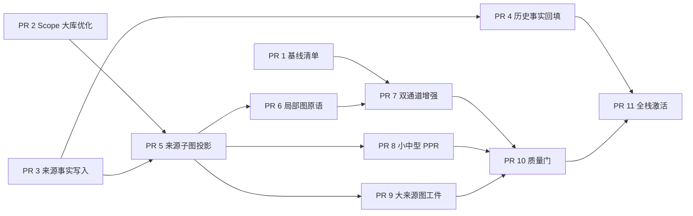

# 来源子图检索“不回退”PR 序列

- 日期：2026-08-04
- 状态：实施中；PR 1–8 已合并，PR 9 正在独立 worktree 实施
- 设计依据：`docs/superpowers/specs/2026-08-04-source-subgraph-retrieval-design_zh.md`
- 总目标：用户在大 notebook 中只选择一篇或少数来源时，在所选来源子图内恢复图检索，同时保证现有 source-scoped 直接检索候选、证据、预算和引用不回退。

## 1. 拆分原则

1. 每个 PR 都可独立合并；数据库变更只做向前兼容的 additive migration。
2. 在最终激活 PR 前，新增检索能力默认 `off` 或 `shadow`，不能改变用户收到的答案。
3. 所有图能力都依赖冻结的 baseline manifest；没有通过 baseline preservation 的 PR 不得进入下一 rollout 阶段。
4. 内部基础设施 PR 可以没有 UI；一旦新增状态或行为对用户可见，必须在同一 PR 完成 Ask、Deep Report 和前端呈现。
5. SQLite/PostgreSQL 语义与测试同 PR 交付，不能先落一套后端。
6. 配置、产品行为、架构或运维契约发生变化时，同 PR 同步 `README.md`、`README_zh.md`、`AGENTS.md` 以及所属 `docs/` 中英文文档（`CLAUDE.md` 刻意不在这个集合里，判据与体量门见 `AGENTS.md`「Documentation Sync」）。
7. 只有最终用户能力通过 `scripts/check.sh`、前端 build 和质量门后，才更新 `fangan_done.md`。

## 2. 依赖关系

PR 1、PR 2、PR 3 可以并行开发，但建议按编号依次合并，减少后续分支反复解决检索热路径冲突。

| PR | 简称 | 规模 | 默认用户行为 |
|---|---|---:|---|
| 1 | 基线清单 | M | 不变 |
| 2 | Scope 大库优化 | M | 结果不变、请求更省 |
| 3 | 来源事实写入 | L | 不变 |
| 4 | 历史事实回填 | L | 不变，离线任务 |
| 5 | 来源子图投影 | L | 不变 |
| 6 | 局部图原语 | L | 不变 |
| 7 | 双通道增强 | L | shadow，用户仍收 baseline |
| 8 | 小中型 PPR | L | shadow |
| 9 | 大来源图工件 | XL | shadow |
| 10 | 质量门 | M–L | 不变 |
| 11 | 全栈激活 | L | allowlist 起步 |

## 3. PR 清单

### PR 1 — 固化来源限定检索基线

实施状态：**worktree 已完成首版**。已接入 chunk、reasoning 与 Deep Report；真正 narrowed 的请求生成 request-local manifest 并只向事件日志发送脱敏 hash/计数，全选路径保持 inert。

建议标题：`test(retrieval): freeze selected-source baseline manifests`

目标：先建立可机器验证的“不回退”定义，不恢复任何图能力。

主要改动：

- 新增内部 `RetrievalBaselineManifest`；记录 KG/chunk/element 候选 ID、分数、顺序、最终证据 hash、token 和 citation key，不记录正文。
- 在 Ask chunk、reasoning 与 Deep Report 的直接检索边界采集同一结构。
- 增加 enrichment `off` 的零行为开关和 manifest 抽样日志。
- 固化 EnergAIzer 同形夹具：多来源 notebook 中只选一篇，保存当前安全路径的基线结果。

主要代码面：

- `backend/app/services/retrieval.py`
- `backend/app/services/ask_service.py`
- `backend/app/services/reasoning_retrieval.py`
- `backend/app/services/report_engine.py`
- `backend/app/eval/retrieval_metrics.py`

合并门：

- manifest 开/关不改变任何响应、trace、候选顺序和模型 prompt。
- 固定配置下重复运行 manifest 稳定。
- 不新增模型调用和数据库查询。

回滚：删除内部采集即可；没有 schema 和公开 API 变化。

### PR 2 — 大库少量来源 Scope 解析改为 O(selected)

建议标题：`perf(scope): validate compact selected-source scopes`

目标：选择一篇或少数来源时，不再读取 notebook 全部 source ID，也不发送巨大的 exclude 列表。

主要改动：

- 前端 `sourceScopePayload` 自动选择更短的 include/exclude 表达；少量选择必须生成 `include`。
- 后端 include 使用定向 ownership/visibility 查询与可见来源 COUNT 计算 `narrowed`。
- reasoning intent → stream、report intent → generation 复用冻结 scope manifest，并重验所选来源，不重复物化 universe。
- 保持公开 `SourceScope` 兼容；老客户端 exclude 请求继续可用。

主要代码面：

- `frontend/app/source-scope.ts`
- `frontend/app/query-syntax.test.mjs` 同级的 source-scope 测试
- `backend/app/api/ask_routes.py`
- `backend/app/api/report_routes.py`
- `backend/app/services/source_scope.py`
- repository source ownership/count ports 与双后端实现

合并门：

- include 少量来源的数据库读取量与 notebook 总来源数无关。
- intent/stream 并发新增、删除、隐藏来源仍保持冻结语义。
- 前后端 scope parity、空 scope、单篇 notebook 全选、mounted base 测试全绿。

回滚：保留旧 exclude 兼容分支；可恢复旧解析器而不改存量数据。

### PR 3 — 来源级 KG 事实 provenance 写入

建议标题：`feat(kg): persist source-local fact provenance`

目标：解决合并对象 payload 不能同时满足强隔离与信息完整的问题；本 PR 只写不读，不改变检索。

主要改动：

- additive schema：来源级 object fact、绑定 evidence element、source generation、projection version 与必要索引。
- 在来源抽取结果合并进全局 `knowledge_objects` 前，持久化 source-local facts。
- 删除、重解析、对象合并/拆分、notebook copy 与 source generation 竞态保持一致。
- SQLite/PostgreSQL store、migration manifest、repository port 同步。

主要代码面：

- 双后端 migrations/schema manifest
- 双后端 knowledge store
- KG extraction/merge 与 lifecycle
- repository ports/facade/ownership manifest

合并门：

- 写入失败不能发布半份来源事实或推进错误 generation。
- 重试幂等；删除/重解析不会留下可被新检索读取的旧代次事实。
- feature read path 仍为 off，现有问答结果逐位不变。

回滚：停止新写入；additive 表保留，不做破坏性 down migration。

### PR 4 — 历史来源事实的可恢复回填

建议标题：`ops(kg): backfill source-local facts by source generation`

目标：让存量 notebook 达到来源事实完整状态，避免上线只覆盖新导入来源。

主要改动：

- 在 `scripts/batch_ingest.py` 增加显式离线回填命令；按 notebook/source generation keyset 分页。
- 持久化进度、水位、失败原因和 projection version；支持中断续跑。
- 优先复用来源抽取阶段的 evidence-bound 中间结果；无法确定字段来源时不猜测，标记 incomplete。
- 增加只读审计命令，输出计数和 ID，不输出 evidence 正文。

合并门：

- 在线问答请求绝不触发全源回填或模型补抽。
- 中断、重跑、来源并发重解析、删除均不会发布混合代次。
- 存量 EnergAIzer 来源完成后，source facts 覆盖率与审计状态可验证。

回滚：停止任务；已完成代次数据保持可审计，读路径尚未启用。

### PR 5 — 来源有界的 SourceSubgraphSnapshot

建议标题：`feat(retrieval): build bounded selected-source graph snapshots`

依赖：PR 2、PR 3。

目标：建立查询前隔离、成本与所选来源规模相关的统一子图投影；尚不接 Ask/Report。

主要改动：

- 新增 `SourceSubgraphSnapshot`、逐通道 capability 与 generation-aware cache。
- 对象通过 `knowledge_object_sources` 取；关系要求 relation source 和两端同时获授权。
- membership 只读取允许对象 evidence 与允许 chunk；不调用整库 `_ent_chunk_map`。
- cluster membership 只读取允许对象涉及的成员。
- facts 从来源级 provenance 读取；不完整来源只提供安全名称和 evidence。
- 双后端查询保证来源谓词、endpoint 约束发生在 LIMIT 前。

主要代码面：

- `backend/app/repositories/ports.py`
- 双后端 `index_projection_store.py`
- 新的 source-subgraph service/cache
- `backend/app/services/retrieval_service.py`

合并门：

- A/B/C 隔离夹具全部通过。
- 大 notebook 只选 A 时，SQL 行数与 A 子图及硬上限相关，不读取 B/C membership/cluster。
- 空 scope、代次漂移、缓存失效、未回填状态 fail closed。

回滚：没有消费者；移除 service wiring 即可。

### PR 6 — 来源约束的局部图原语

建议标题：`feat(retrieval): add selected-source graph primitives`

依赖：PR 5。

目标：在 snapshot 上实现可复用的局部图能力，但继续只供测试/shadow 调用。

主要改动：

- scoped neighbors / `expand_graph`。
- scoped `follow_chain`，每一跳复验关系来源和端点授权。
- scoped relation retrieval：无安全 ANN sidecar 时使用来源内 FTS/端点补召回。
- scoped exact lookup：probe、section grouping、chunk hydration 全程携带 allowed source IDs。
- scoped enumeration：来源内 SQL count/cursor，不复用整库 collection map。
- 统一 capability reason code；移除各原语内部对一个全局 unsafe 布尔值的依赖，但入口仍不对用户开放。

合并门：

- 高度节点、两跳、exact subtree、分页 enumeration 均有 endpoint/行数上限。
- graph primitive 返回项全部能绑定所选来源 evidence/citation。
- 未选来源不能成为中间节点，不能影响顺序或总数。

回滚：保持公开入口 off；内部原语无人调用。

### PR 7 — 受保护的 Baseline + Enrichment 双通道

建议标题：`feat(retrieval): protect baseline evidence from graph enrichment`

依赖：PR 1、PR 6。

目标：解决现有 `select_with_reserves` 会在同预算内驱逐直接候选的问题，并给 reasoning 图动作独立步骤额度。

主要改动：

- 先按历史路径选出不可变 `B_final`，再在独立 enrichment token budget 中选 `G`。
- 同一 chunk 命中 B/G 时只合并 provenance；不改变 baseline relevance、位置、正文和 citation key。
- reasoning enrichment action/step 与 baseline reflect/raw fallback/answer 步数分账。
- Deep Report 每个 retrieval direction 保存 baseline manifest；graph failure 不改变直接证据账目。
- 增加 `baseline_evicted_count` 熔断；非零即丢弃整段 G。
- 模式保持 shadow，用户仍收到 B。

合并门：

- enrichment off/on/failure/timeout 下 baseline manifest 完全一致。
- 图预算不足先丢 G，不能重新截断 B。
- enrichment=0 时调用序列、prompt 和结果与合并前一致。

回滚：切回 off；双通道代码保留但不执行 G。

### PR 8 — 小中型来源子图 PPR

建议标题：`feat(retrieval): run PPR inside selected-source snapshots`

依赖：PR 5、PR 7。

目标：对在线硬上限内的来源子图恢复 PPR，不切整库 CSR 后过滤。

主要改动：

- 从 snapshot 构建稀疏 transition，并按 scope/generation 缓存。
- reset 只含来源限定 KG/chunk seed；cluster hub 只连接允许成员。
- PPR min-max、Top-K 和 hydration 只在允许 chunk 集合内。
- PPR 只排序 G，不改变 B 的分数和顺序。
- 超限返回明确 capability reason，保留局部图与 baseline。

合并门：

- A/B/C fixture 中 B/C 不影响 A 的度数、reset、归一化和排名。
- 超限、缓存失效、构建异常都退回 baseline + 已安全完成的局部 G。
- 峰值内存、构建时间和缓存容量有硬上限。

回滚：单独关闭 scoped PPR，不影响 PR 6 的局部原语和 baseline。

### PR 9 — 超大来源的 source-partitioned scale artifact

实施状态：**worktree 实现与完整门已完成**。采用同时绑定主 scale manifest identity 与无正文 source/run/backfill signature 的独立伴生根；每个可见来源用 SHA-256 目录直寻，运行时只加载所选 partition，旧版/缺失/identity 失配 fail closed。尚待独立 review 与 CI。

建议标题：`feat(scale): add source-partitioned graph artifacts`

依赖：PR 5。

目标：单篇来源本身很大时，也不靠在线构建全子图或关闭 PPR。

主要改动：

- scale artifact 增加 KG-node、relation、membership 的 row-aligned source sidecar/partition metadata。
- builder/fold/rebuild、manifest identity、artifact version、lazy handle 与 single-flight 全部纳入新工件。
- 运行时按选中 source 诱导 CSR/candidate window；旧 artifact 确定性返回 capability unavailable，不全图后过滤。
- scale status 若新增用户可见状态，必须在同 PR 更新前端索引状态 UI。

主要代码面：

- `backend/app/services/scale_index_builder.py`
- `backend/app/services/kg/scale_index.py`
- filesystem scale artifact store/catalog/runtime
- notebook scale status/API；必要时对应前端组件

合并门：

- 大来源查询不物化 notebook 全图，不读取未选 source partition。
- 新旧 artifact identity 不混用；fold/rebuild 后缓存正确失效。
- 小来源在线 snapshot 与大来源 artifact 在相同夹具上具有一致授权语义。

回滚：旧 artifact 继续可读；关闭新 artifact consumer 后回到 baseline/局部图。

### PR 10 — 真实问题质量门与 Shadow 对照

建议标题：`test(eval): gate selected-source graph retrieval rollout`

依赖：PR 7、PR 8、PR 9；PR 4 至少完成评测 notebook 的回填。

目标：证明“不删 baseline”之外，新增图上下文没有造成答案质量统计回退。

主要改动：

- 增加 selected-source golden set：单篇、少量来源、超大单篇、mounted base、跨来源同名对象。
- 固定模型版本与采样参数，对 baseline/shadow 运行 evidence Recall@K、citation coverage/validity、grounded sentence coverage、无答案率、outline dropped section。
- 记录延迟、数据库读取行数、峰值内存、新增 prompt token 和模型调用数。
- allowlist/hash rollout gate 读取质量状态；硬隔离或 baseline preservation 失败直接阻止 on。

合并门：

- 所有硬指标：baseline eviction 为零、越界证据为零、citation key 保持可用。
- 统计质量指标不低于批准的 baseline 门槛。
- EnergAIzer 的根因分析问题在 shadow 中能执行来源内 expand，并保留原 20 个直接 KG 候选及原有引用能力。

回滚：评测与 gate 不改变用户行为。

### PR 11 — Ask、Deep Report 与前端统一激活

建议标题：`feat(ask): enable selected-source graph enrichment safely`

依赖：PR 1–10；评测所需存量来源完成 PR 4 回填。

目标：首次让用户看到来源子图能力；同一 PR 完成后端、前端、文档和 rollout。

主要改动：

- Ask `chunk`、`reasoning`、实验 `graph` 与 Deep Report 共用 capability/snapshot/enrichment service。
- 按 `off → shadow → allowlist → stable hash rollout → on` 激活；默认是否 on 由评审后的质量结果决定，不能提前写死。
- reasoning trace 显示来源子图 build/cache、neighbors、chain、PPR 和具体 unavailable reason。
- 不再显示笼统的“限定来源下已关闭无法安全隔离的图扩展通道”。
- 前端 Ask 与 Deep Report 展示相同能力状态；不新增来源选择步骤。
- 同步根 README、AGENTS/CLAUDE、产品/API、部署配置、运维、开发文档的中英文对。
- `scripts/check.sh` 和前端 build 全绿后更新 `fangan_done.md`。

合并门：

- Full-stack parity 完整；没有只在后端 trace 可见的状态。
- 全选/省略 scope 路径逐位保持历史行为；单篇 notebook 全选仍不是 narrowed。
- narrowed 的 baseline manifest 在生产配置下保持；图失败可由单一开关立即退回 baseline。
- EnergAIzer 真机复测：只选 PDAgent 时能在该来源子图 expand/follow/PPR，引用仍全部来自允许参与范围。

回滚：运行时切回 shadow/off，无需回滚 schema 或重建旧 artifact；用户立即回到当前安全 baseline。

## 4. 里程碑与可停止点

| 里程碑 | 包含 PR | 用户行为 | 可安全停止吗 |
|---|---|---|---|
| M1 不回退地基 | 1–2 | 完全不变，少量 scope 更省 | 可以 |
| M2 来源数据与子图 | 3–6 | 完全不变，内部能力可测 | 可以 |
| M3 小中型 shadow | 7–8 | 用户仍收 baseline | 可以 |
| M4 大来源等价 | 9 | 用户仍收 baseline | 可以 |
| M5 质量与激活 | 10–11 | 通过 gate 后逐步看到来源子图 | 可以，随时切 off |

若希望尽早验证 EnergAIzer，可在 PR 8 后先做内部/预发布 shadow 和对应问题集评测；但本完整序列仍要求 PR 9–10 合并并通过后才进入 PR 11 的用户 allowlist，避免为了单一实例提前建立第二套临时发布路径。

## 5. 每个 PR 的统一验证清单

- 新增/修改的 SQLite 与 PostgreSQL conformance 测试通过。
- `backend/tests/test_source_scope.py` 及相关 Ask/Reasoning/Report 测试通过。
- `scripts/check.sh` 通过。
- 触及前端的 PR 执行 `cd frontend && npm run build`，并运行对应组件/契约测试。
- `git diff --check` 通过；不夹带无关工作树改动。
- 默认配置下没有新增模型调用；shadow 的额外成本必须有事件与配置开关。
- 所有失败路径明确验证：超时、空 scope、source 删除/重解析、代次漂移、旧索引、缓存失效和 mounted base。
- PR 描述记录 baseline manifest 对比、数据库查询形状和 rollout/rollback 方法。

## 6. 评审时需要一次性确认的决策

1. 接受独立 enrichment token/step budget；否则只能保证 baseline 不被驱逐，但无法保证图证据有空间进入最终 prompt。
2. 接受来源级 fact provenance 的 additive schema 与存量离线回填。
3. 确认大来源完整 PPR 是首轮正式激活前置，还是允许先对中小来源 allowlist 激活。
4. community 继续关闭，直到存在可证明来源可分解的预计算产物。
5. mounted base 第一版独立检索合并，不新增不可审计的跨层桥。
