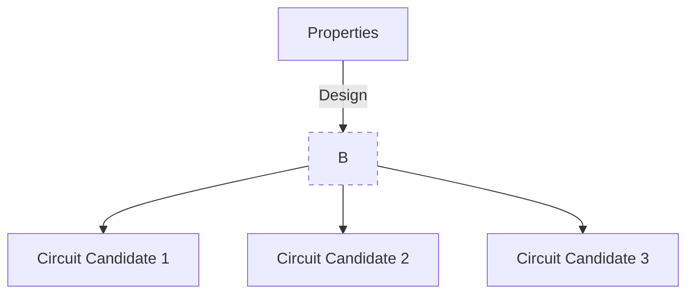
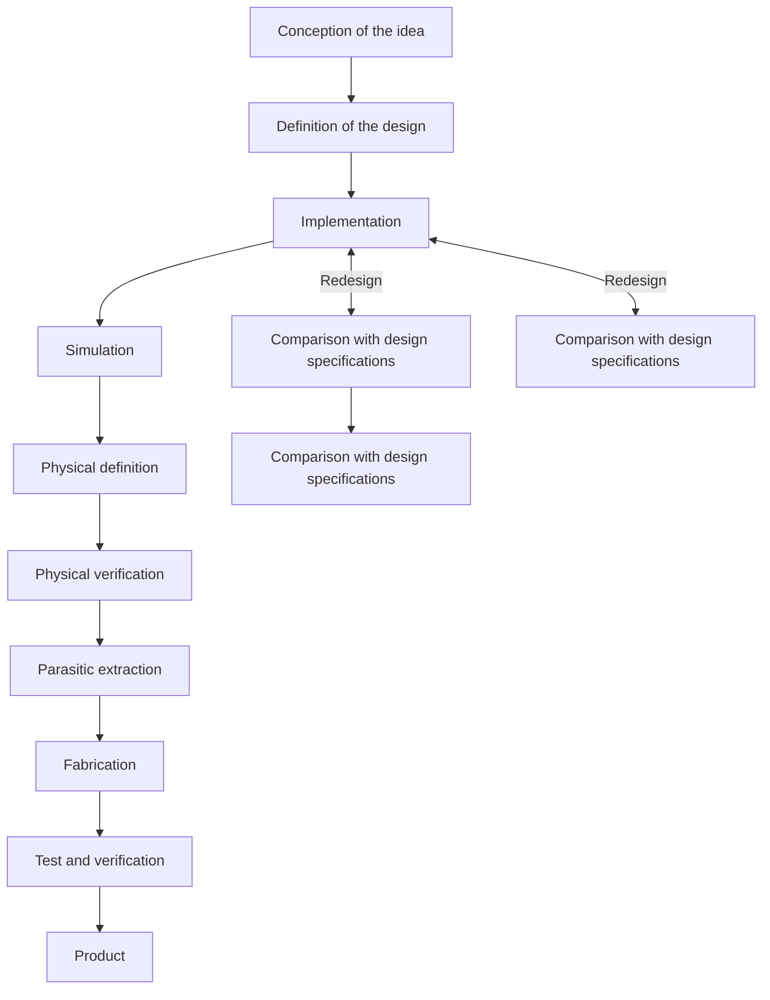
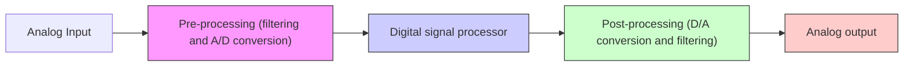
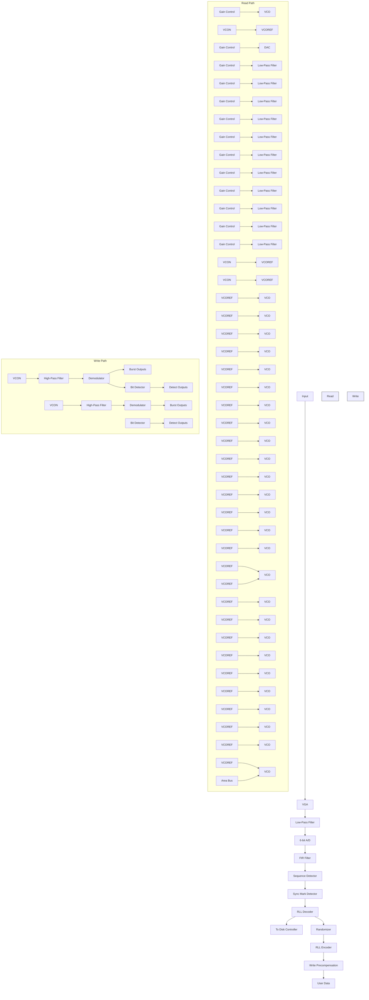
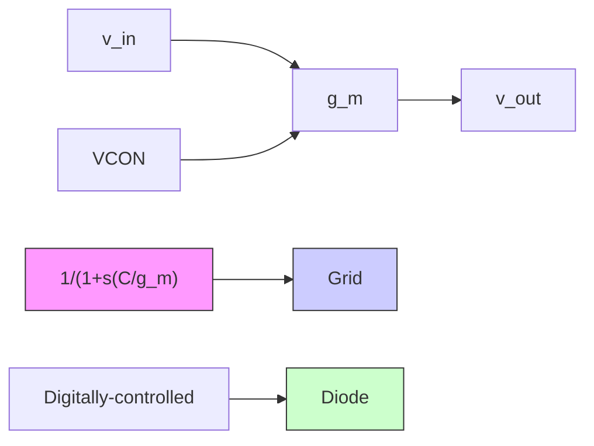
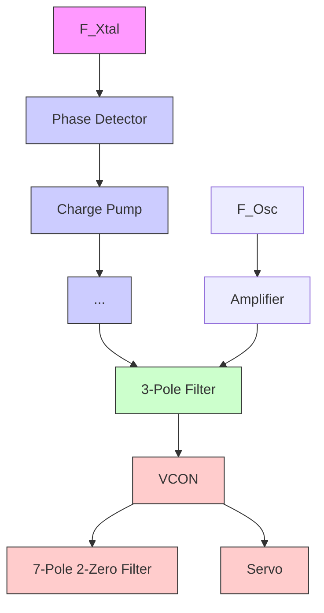
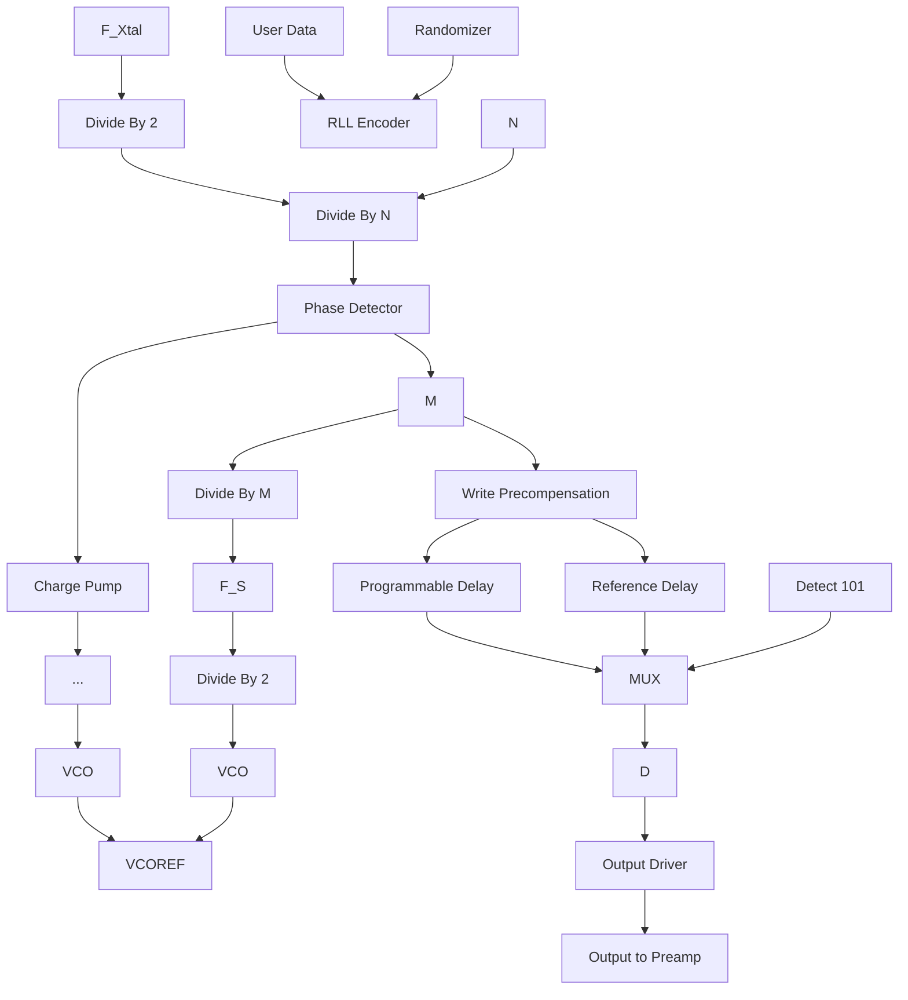
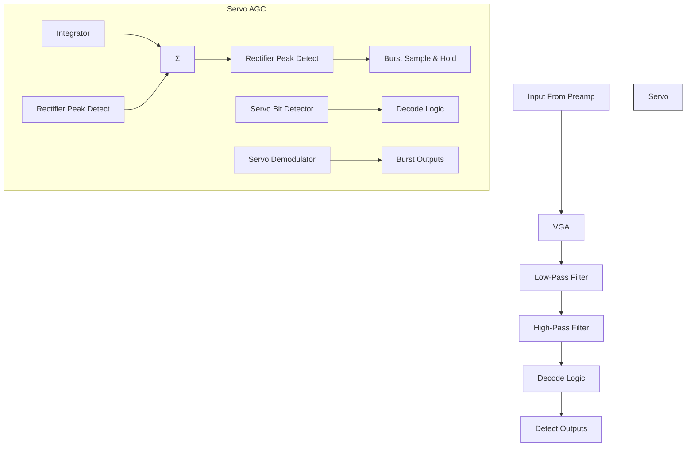

<!-- VIEWER-ONLY verbatim slice of CMOS_Analog_Circuit_Design_-_Allen_Holberg_mineru.md lines 3-742. NOT authoritative; all gold coordinates point at CMOS_Analog_Circuit_Design_-_Allen_Holberg_mineru.md. -->
# Chapter 1 Introduction and Background

The evolution of very large scale integration (VLSI) technology has developed to the point where millions of transistors can be integrated on a single die or “chip.” Where integrated circuits once filled the role of sub-system components, partitioned at analogdigital boundaries, they now integrate complete systems on a chip by combining both analog and digital functions [1]. Complementary metal-oxide semiconductor (CMOS) technology has been the mainstay in mixed-signal1 implementations because it provides density and power savings on the digital side, and a good mix of components for analog design. By reason of its wide-spread use, CMOS technology is the subject of this text.

Due in part to the regularity and granularity of digital circuits, computer aided design (CAD) methodologies have been very successful in automating the design of digital systems given a behavioral description of the function desired. Such is not the case for analog circuit design. Analog design still requires a “hands on” design approach in general. Moreover, many of the design techniques used for discrete analog circuits are not applicable to the design of analog/mixed-signal VLSI circuits. It is necessary to examine closely the design process of analog circuits and to identify those principles that will increase design productivity and the designer’s chances for success. Thus, this book provides a hierarchical organization of the subject of analog integrated-circuit design and identification of its general principles.

The objective of this chapter is to introduce the subject of analog integrated-circuit design and to lay the groundwork for the material that follows. It deals with the general subject of analog integrated-circuit design followed by a description of the notation, symbology, and terminology used in this book. The next section covers the general considerations for an analog signal-processing system, and the last section gives an example of analog CMOS circuit design. The reader may wish to review other topics pertinent to this study before continuing to Chapter 2. Such topics include modeling of electronic components, computer simulation techniques, Laplace and z-transform theory, and semiconductor device theory.

# 1.1 Analog Integrated Circuit Design

Integrated-circuit design is separated into two major categories: analog and digital. To characterize these two design methods we must first define analog and digital signals. A signal will be considered to be any detectable value of voltage, current, or charge. A signal should convey information about the state or behavior of a physical system. An analog signal is a signal that is defined over a continuous range of time and a continuous range of amplitudes. An analog signal is illustrated in Fig. 1.1-1(a). A digital signal is a signal that is defined only at discrete values of amplitude, or said another way, a digital signal is quantized to discrete values. Typically, the digital signal is a binary-weighted sum of signals having only two defined values of amplitude as illustrated in Fig. 1.1-1(b) and shown in Eq. (1). Figure 1.1-1(b) is a 3-bit representation of the analog signal shown in Fig. 1.1-1(a).

$$
D = b _ {0} 2 ^ {- 1} + b _ {1} 2 ^ {- 2} + b _ {2} 2 ^ {- 3} + \dots + b _ {N - 1} 2 ^ {- (N - 1)} = \sum_ {i = 0} ^ {N - 1} b _ {i} 2 ^ {- i} \tag {1}
$$

line

| t/T | Amplitude |
| --- | --------- |
| 0   | 0         |
| 1   | 2         |
| 2   | 4         |
| 3   | 3         |
| 4   | 8         |
| 5   | 5         |
| 6   | 4         |
| 7   | 2         |
| 8   | 0         |

line

| t/T | Amplitude |
| --- | --- |
| 0   | 0   |
| 1   | 2   |
| 2   | 3   |
| 3   | 6   |
| 4   | 7   |
| 5   | 5   |
| 6   | 4   |
| 7   | 1   |
| 8   | 0   |

line

| Sample times | Amplitude (Sampled) | Amplitude (Held Analog) |
| ------------ | ------------------- | ----------------------- |
| 0            | 0                   | 0                       |
| 1            | 2                   | 2                       |
| 2            | 3                   | 4                       |
| 3            | 6                   | 8                       |
| 4            | 7                   | 7                       |
| 5            | 5                   | 5                       |
| 6            | 4                   | 4                       |
| 7            | 1                   | 1                       |
| 8            | 0                   | 0                       |

Figure 1.1-1 Signals. (a) Analog or continuous time. (b) Digital. (c) Analog sampled data or discrete time. T is the period of the digital or sampled signals.

The individual binary numbers, $b _ { i } ,$ have a value of either zero or one. Consequently, it is possible to implement digital circuits using components that operate with only two stable states. This leads to a great deal of regularity and to an algebra that can be used to describe the function of the circuit. As a result, digital circuit designers have been able to adapt readily to the design of more complex integrated circuits.

Another type of signal encountered in analog integrated-circuit design is an analog sampled-data signal. An analog sampled-data signal is a signal that is defined over a continuous range of amplitudes but only at discrete points in time. Often the sampled analog signal is held at the value present at the end of the sample period, resulting in a sampled-and-held signal. An analog sampled-and-held signal is illustrated in Fig. 1.1-1(c).

Circuit design is the creative process of developing a circuit that solves a particular problem. Design can be better understood by comparing it to analysis. The analysis of a circuit, illustrated in Fig. 1.1-2(a), is the process by which one starts with the circuit and finds its properties. An important characteristic of the analysis process is that the solution or properties are unique. On the other hand, the synthesis or design of a circuit is the process by which one starts with a desired set of properties and finds a circuit that satisfies them. In a design problem the solution is not unique thus giving opportunity for the designer to be creative. Consider the design of a 1.5 Ω resistance as a simple example. This resistance could be realized as the series connection of three 0.5 Ω resistors, the combination of a 1 Ω resistor in series with two 1 Ω resistors in parallel, and so forth. All would satisfy the requirement of 1.5 Ω resistance although some might exhibit other properties that would favor their use. Figure 1.1-2 illustrates the difference between synthesis (design) and analysis.

flowchart

flowchart

Figure 1.1-2 (a) The analysis process. (b) The design process.

The differences between integrated and discrete analog circuit design are important. Unlike integrated circuits, discrete circuits use active and passive components that are not on the same substrate. A major benefit of components sharing the same substrate in close proximity is that component matching can be used as a tool for design. Another difference between the two design methods is that the geometry of active devices and passive components in integrated circuit design are under the control of the designer. This control over geometry gives the designer a new degree of freedom in the design process. A second difference is due to the fact that it is impractical to breadboard the integrated-circuit design. Consequently, the designer must turn to computer simulation methods to confirm the design’s performance. Another difference between integrated and discrete analog design is that the integrated-circuit designer is restricted to a more limited class of components that are compatible with the technology being used.

The task of designing an analog integrated circuit includes many steps. Figure 1.1-3 illustrates the general approach to the design of an integrated circuit. The major steps in the design process are:

1. Definition   
2. Synthesis or implementation   
3. Simulation or modeling   
4. Geometrical description   
5. Simulation including the geometrical parasitics   
6. Fabrication   
7. Testing and verification

The designer is responsible for all of these steps except fabrication. The first steps are to define and synthesize the function. These steps are crucial since they determine the performance capability of the design. When these steps are completed, the designer must be able to confirm the design before it is fabricated. The next step is to simulate the circuit to predict the performance of the circuit. The designer makes approximations about the physical definition of the circuit initially. Later, once the layout is complete, simulations are checked using parasitic information derived from the layout. At this point, the designer may iterate using the simulation results to improve the circuit’s performance. Once satisfied with this performance, the designer can address the next step—the geometrical description (layout) of the circuit. This geometrical description typically consists of a computer database of variously shaped rectangles or polygons (in the x-y plane) at different levels (in the z-direction); it is intimately connected with the electrical performance of the circuit. As stated earlier, once the layout is finished, it is necessary to include the geometrical effects in additional simulations. If results are satisfactory, the circuit is ready for fabrication. After fabrication, the designer is faced with the last step—determining whether the fabricated circuit meets the design specifications. If the designer has not carefully considered this step in the overall design process, it may be difficult to test the circuit and determine whether or not specifications have been met.

As mentioned earlier, one distinction between discrete and integrated analog-circuit design is that it may be impractical to breadboard the integrated circuit. Computer simulation techniques have been developed that have several advantages, provided the models are adequate. These advantages include:

• the elimination of the need for breadboards.   
• the ability to monitor signals at any point in the circuit.   
• the ability to open a feedback loop.   
• the ability to easily modify the circuit.   
• the ability to analyze the circuit at different processes and temperatures.

flowchart

Figure 1.1-3 The design process for analog integrated circuits.

Disadvantages of computer simulation include:

• the accuracy of models.   
• the failure of the simulation program to converge to a solution.   
• the time required to perform simulations of large circuits.   
• the use of the computer as a substitute for thinking.

Because simulation is closely associated with the design process, it will be included in the text where appropriate.

In accomplishing the design steps described above, the designer works with three different types of description formats. These include: the design description, the physical description, and the model/simulation description. The format of the design description is the way in which the circuit is specified; the physical description format is the geometrical definition of the circuit; the model/simulation format is the means by which the circuit can be simulated. The designer must be able to describe the design in each of these formats. For example, the first steps of analog integrated-circuit design could be carried out in the design description format. The geometrical description obviously uses the geometrical format. The simulation steps would use the model/simulation format.

Analog integrated-circuit design can also be characterized from the viewpoint of hierarchy. Table 1.1-1 shows a vertical hierarchy consisting of devices, circuits, and systems, and horizontal description formats consisting of design, physical, and model. The device level is the lowest level of design. It is expressed in terms of device specifications, geometry, or model parameters for the design, physical, and model description formats, respectively. The circuit level is the next higher level of design and can be expressed in terms of devices. The design, physical, and model description formats typically used for the circuit level include voltage and current relationships, parameterized layouts, and macromodels. The highest level of design is the systems level—expressed in terms of circuits. The design, physical, and model description formats for the systems level include mathematical or graphical descriptions, a chip floor plan, and a behavioral model.

Table 1.1-1 Hierarchy and Description of the Analog Circuit Design Process. 

<table><tr><td>Hierarchy</td><td>Design</td><td>Physical</td><td>Model</td></tr><tr><td>Systems</td><td>System Specifications</td><td>Floor plan</td><td>Behavioral Model</td></tr><tr><td>Circuits</td><td>Circuit Specifications</td><td>Parameterized Blocks/Cells</td><td>Macromodels</td></tr><tr><td>Devices</td><td>Device Specifications</td><td>Geometrical Description</td><td>Device Models</td></tr></table>

This book has been organized to emphasize the hierarchical viewpoint of integratedcircuit design, as illustrated in Table 1.1-2. At the device level, Chapters 2 and 3 deal with CMOS technology, and models. In order to design CMOS analog integrated circuits the designer must understand the technology, so Chapter 2 gives an overview of CMOS technology, along with the design rules that result from technological considerations. This information is important for the designer’s appreciation of the constraints and limits of the technology. Before starting a design, one must have access to the process and electrical parameters of the device model. Modeling is a key aspect of both the synthesis and simulation steps and is covered in Chapter 3. The designer must also be able to characterize the actual model parameters in order to confirm the assumed model parameters. Ideally, the designer has access to a test chip from which these parameters can be measured. Finally, the measurement of the model parameters after fabrication can be used in testing the completed circuit. Device-characterization methods are covered in Appendix B.

Table 1.1-2 Relationship of the Book Chapters to Analog Circuit Design. 

<table><tr><td>Design Level</td><td colspan="3">CMOS Technology</td></tr><tr><td>Systems</td><td>Chapter 9Switched CapacitorCircuits</td><td>Chapter 10D/A and A/D Converters</td><td></td></tr><tr><td>Complex Circuits</td><td>Chapter 6Simple Operational Amplifiers</td><td>Chapter 7Complex Operational Amplifiers</td><td>Chapter 8Comparators</td></tr><tr><td>Simple Circuits</td><td>Chapter 4Analog Subcircuits</td><td></td><td>Chapter 5Amplifiers</td></tr><tr><td>Devices</td><td>Chapter 2Technology</td><td>Chapter 3Modeling</td><td>Appendix BCharacterization</td></tr></table>

Chapters 4 and 5 cover circuits consisting of two or more devices that are classified as simple circuits. These simple circuits are used to design more complex circuits, which are covered in Chapters 6 through 8. Finally, the circuits presented in Chapters 6 through 8 are used in Chapters 9 and 10 to implement analog systems. Some of the dividing lines between the various levels will at times be unclear. However, the general relationship is valid and should leave the reader with an organized viewpoint of analog integrated circuit design.

# 1.2 Notation, Symbology, and Terminology

To help the reader have a clear understanding of the material presented in this book, this section dealing with notation, symbology, and terminology is included. The conventions chosen are consistent with those used in undergraduate electronic texts and with the standards proposed by technical societies. The International System of Units has been used throughout. Every effort has been made in the remainder of this book to use the conventions here described.

The first item of importance is the notation (the symbols) for currents and voltages. Signals will generally be designated as a quantity with a subscript. The quantity and the subscript will be either upper or lower case according to the convention illustrated in Table 1.2-1. Figure 1.2-1 shows how the definitions in Table 1.2-1 would be applied to a periodic signal superimposed upon a dc value.

Table 1.2-1 Definition of the Symbols for Various Signals. 

<table><tr><td>Signal Definition</td><td>Quantity</td><td>Subscript</td><td>Example</td></tr><tr><td>Total instantaneous value of the signal</td><td>Lowercase</td><td>Uppercase</td><td> $q_{A}$ </td></tr><tr><td>dc value of the signal</td><td>Uppercase</td><td>Uppercase</td><td> $Q_{A}$ </td></tr><tr><td>ac value of the signal</td><td>Lowercase</td><td>Lowercase</td><td> $q_{a}$ </td></tr><tr><td>Complex variable, phasor, or rms value of the signal</td><td>Uppercase</td><td>Lowercase</td><td> $Q_{a}$ </td></tr></table>

This notation will be of help when modeling the devices. For example, consider the portion of the MOS model that relates the drain-source current to the various terminal voltages. This model will be developed in terms of the total instantaneous variables $( i _ { D } )$ . For biasing purposes, the dc variables $( I _ { D } )$ will be used; for small signal analysis, the ac variables $( i _ { d } ) ;$ and finally, the small signal frequency discussion will use the complex variable $( I _ { d } )$ .

text_image

I_D
i_d
i_D
t
I_dm

Figure 1.2-1 Notation for signals.

The second item to be discussed here is what symbols are used for the various components. (Most of these symbols will already be familiar to the reader. However, inconsistencies exist about the MOS symbol shown in Fig. 1.2-2.) The symbols shown in Figs. 1.2-2(a) and 1.2-2(b) are used for enhancement-mode MOS transistors when the substrate or bulk (B) is connected to the appropriate supply. Most often, the appropriate supply is the most positive one for p-channel transistors and the most negative one for nchannel transistors. Although the transistor operation will be explained later, the terminals are called drain (D), gate (G), and source (S). If the bulk is not connected to the appropriate supply, then the symbols shown in Fig. 1.2-2(c) and Fig. 1.2-2(d) are used for the enhancement-mode MOS transistors. It will be important to know where the bulk of the MOS transistor is connected when it is used in circuits.

Figure 1.2-3 shows another set of symbols that should be defined. Figure 1.2-3(a) represents a differential-input operational amplifier, or in some instances, a comparator which may have a gain approaching that of the operational amplifier. Figures 1.2-3(b) and (c) represent an independent voltage and current source. Sometimes, the battery symbol is used instead of Fig. 1.2-3(b). Finally, Figures 1.2-3(d) through (g) represent the four types of ideal controlled sources. Figure 1.2-3(d) is a voltage-controlled, voltage source (VCVS), Fig. 1.2-3(e) is a voltage-controlled, current source (VCCS), Fig. 1.2-3(f) is a currentcontrolled, voltage source (CCVS), and Fig. 1.2-3(g) is a current-controlled, current source (CCCS). The gains of each of these controlled sources are given by the symbols $A _ { \nu } , G _ { m } ,$ $R _ { m } ,$ and $A _ { i }$ (for the VCVS, VCCS, CCVS, and CCCS, respectively).

chemical

N-channel MOSFET transistor symbol with labeled terminals G, D, and S

chemical

Electrical symbol for a MOSFET transistor with labeled terminals G, D, B, S and internal gate connection

chemical

Electronic symbol of a MOSFET transistor with labeled terminals G, D, B, S and base connection

Figure 1.2-2 MOS device symbols. (a) Enhancement n-channel transistor with bulk connected to most negative supply. (b) Enhancement p-channel transistor with bulk connected to most positive supply. (c) and (d) same as (a) and (b) except bulk connection is not constrained to respective supply.

natural_image

Pure electrical circuit symbol of an operational amplifier with input and output terminals (no text or labels)

(a)

  
(b)

  
(c)

chemical

Electrical circuit symbol for a voltage-controlled current source with input and output terminals labeled V1 and V2

text_image

+
V₁
-
GₘV₁
I₂

(e)

text_image

I₁
RₘI₁
+

text_image

I₁
AᵢI₁
I₂

Figure 1.2-3 (a) Symbol for an operational amplifier. (b) Independent voltage source. (c) Independent current source. (d) Voltage-controlled voltage source (VCVS). (e) Voltage-controlled current source (VCCS). (f) Current-controlled voltage source (CCVS). (g) Current-controlled current source (CCCS).

# 1.3 Analog Signal Processing

Before beginning an in-depth study of analog-circuit design, it is worthwhile considering the application of such circuits. The general subject of analog signal processing includes most of the circuits and systems that will be presented in this text. Figure 1.3-1 shows a simple block diagram of a typical signal-processing system. In the past, such a signal-processing system required multiple integrated circuits with considerable additional passive components. However, the advent of analog sampled-data techniques and MOS technology has made viable the design of a general signal processor using both analog and digital techniques on a single integrated circuit [2].

The first step in the design of an analog signal-processing system is to examine the specifications and decide what part of the system should be analog and what part should be digital. In most cases, the input signal is analog. It could be a speech signal, a sensor output, a radar return, and so forth. The first block of Fig. 1.3-1 is a preprocessing block. Typically, this block will consist of filters, an automatic-gain-control circuit, and an analogto-digital converter (ADC or A/D). Often, very strict speed and accuracy requirements are placed on the components in this block. The next block of the analog signal processor is a digital signal processor. The advantage of performing signal processing in the digital domain are numerous. One advantage is due to the fact that digital circuitry is easily implemented in the smallest geometry processes available providing a cost and speed advantage. Another advantage relates to the additional degrees of freedom available in digital signal processing (e.g., linear-phase filters). Additional advantages lie in the ability to easily program digital devices. Finally, it may be necessary to have an analog output. In this case, a postprocessing block is necessary. It will typically contain a digital-to-analog converter (DAC or D/A), amplification, and filtering.

flowchart

Figure 1.3-1 A typical signal-processing system block diagram.

In a signal processing system, one of the important system consideration is the bandwidth of the signal to be processed. A graph of the operating frequency of a variety of signals is given in Fig. 1.3-2. At the low end are seismic signals, which do not extend much below 1 Hz because of the absorption characteristics of the earth. At the other extreme are microwave signals. These are not used much above 30 GHz because of the difficulties in performing even the simplest forms of signal processing at higher frequencies.

other

| Category             | Frequency Range (Hz) |
|----------------------|----------------------|
| Seismic              | 1-10                 |
| Sonar                | 100-1k               |
| Audio                | 1k-10k               |
| Video                | 1M-10M               |
| Acoustic Imaging     | 10M-10M              |
| Radar                | 10M-10M              |
| AM-FM radio, TV      | 100M-1G              |
| Telecommunications   | 1G-10G               |
| Microwave            | 1G-10G               |

Figure 1.3-2 Frequency of signals used in signal processing applications.

To address any particular application area illustrated in Fig 1.3-2 a technology that can support the required signal bandwidth must be used. Figure 1.3-3 illustrates the speed capabilities of the various process technologies available today. Bandwidth requirements and speed are not the only considerations when deciding which technology to use for an integrated circuit addressing an application area. Other considerations are cost and integration. The clear trend today is to use CMOS digital combined with CMOS analog (as needed) whenever possible because significant integration can be achieved thus providing highly reliable compact system solutions.

other

| Component              | Frequency (Hz) |
| ---------------------- | -------------- |
| BiCMOS                 | ~10^1          |
| Bipolar analog         | ~10^1          |
| Bipolar digital logic  | ~10^1          |
| Surface acoustic waves| ~10^1          |
| MOS digital logic     | ~10^1          |
| MOS analog             | ~10^1          |
| Optical                | ~10^2          |
| GaAs                   | ~10^2          |

Figure 1.3-3 Frequencies that can be processed by present-day technologies.

# 1.4 Example of Analog VLSI Mixed-Signal Circuit Design

Analog circuit design methodology is best illustrated by example. Figure 1.4-1 shows the block diagram of a fully-integrated digital read/write channel for disk drive recording applications. The device employs partial response maximum likelihood (PRML) sequence detection when reading data to enhance bit-error-rate versus signal-to-noise ratio performance. The device supports data rates up to 64 Mbits/sec and is fabricated in a 0.8 m double-metal CMOS process.

In a typical application, this IC receives a fully-differential analog signal from an external preamplifier which senses magnetic transitions on a spinning disk-drive platter. This differential read pulse is first amplified by a variable gain amplifier (VGA) under control of a real-time digital gain-control loop. After amplification, the signal is passed to a 7-pole 2-zero equiripple-phase low-pass filter. The zeros of the filter are real and symmetrical about the imaginary axis. The location of the zeros relative to the location of the poles is programmable and are designed to boost filter gain at high frequencies and thus narrow the width of the read pulse.

flowchart

Figure 1.4-1 Read/Write channel integrated circuit block diagram.

The low-pass filter is constructed from transconductance stages $( g _ { m }$ stages) and capacitors. A one-pole prototype illustrating the principles embodied in the low-pass filter design is shown in Fig. 1.4-2. While the relative pole arrangement is fixed, two mechanisms are available for scaling the low-pass filter’s frequency response. The first is via a control voltage (labeled “VCON”) which is common to all of the transconductance stages in the filter. This control voltage is applied to the gate of an n-channel transistor in each of the transconductance stages. The conductance of each of these transistors determines the overall conductance of its associated stage and can be continuously varied by the control voltage. The second frequency response control mechanism is via the digital control of the value of the capacitors in the low-pass filter. All capacitors in the low-pass filter are constructed identically, and each consists of a programmable array of binarily weighted capacitors.

The continuous control capability via VCON designed into the transconductance stage provides for a means to compensate for variations in the low-pass filter’s frequency response due to process, temperature, and supply voltage changes [3]. The control-voltage, VCON, is derived from the “Master PLL” composed of a replica of the filter configured as a voltage-controlled oscillator in a phase-locked-loop configuration as illustrated in Fig. 1.4-3. The frequency of oscillation is inversely proportional to the characteristic time constant, $C / g _ { m }$ , of the replica filter’s stages. By forcing the oscillator to be phase and frequency-locked to an external frequency reference through variation of the VCON terminal voltage, the characteristic time constant is held fixed. To the extent that the circuit elements in the low-pass filter match those in the master filter, the characteristic time constants of the low-pass filter (and thus the frequency response) are also fixed.

flowchart

Figure 1.4-2 Single-pole low-pass filter.

flowchart

Figure 1.4-3 Master filter phase-locked loop.

The normal output of the low-pass filter is passed through a buffer to a 6-bit one-stepflash sampling A/D converter. The A/D is clocked by a voltage-controlled oscillator (VCO) whose frequency is controlled by a digital timing-recovery loop. Each of the sixtythree comparators in the flash A/D converter contains capacitors to sample the buffered analog signal from the low-pass filter. While sampling the signal each capacitor is also absorbing the comparator’s offset voltage to correct for distortion errors these offsets would otherwise cause [4]. The outputs from the comparators are passed through a block of logic that checks for invalid patterns, which could cause severe conversion errors if left unchecked [5]. The outputs of this block are then encoded into a 6-bit word.

As illustrated in Fig. 1.4-1, after being digitized, the 6-bit output of the A/D converter is filtered by a finite-impulse-response (FIR) filter. The digital gain and timing control loops mentioned above monitor the raw digitized signal or the FIR filter output for gain and timing errors. Because these errors can only be measured when signal pulses occur, a digital transition detector is provided to detect pulses and activate the gain and timing error detectors. The gain and timing error signals are then passed through digital low-pass filters and subsequently to D/A converters in the analog circuitry to adjust the VGA gain and A/D VCO frequency, respectively.

The heart of the read channel IC is the sequence detector. The detector’s operation is based on the Viterbi algorithm, which is generally used to implement maximum likelihood detection. The detector anticipates linear inter-symbol interference and after processing the received sequence of values deduces the most likely transmitted sequence (i.e., the data read from the media) as in [6]. The bit stream from the sequence detector is passed to the run-length-limited (RLL) decoder block where it is decoded. If the data written to the disk were randomized before being encoded, the inverse process is applied before the bit stream appears on the read channel output pins.

The write-path is illustrated in detail in Fig. 1.4-4. In write mode, data is first encoded by an RLL encoder block. The data can optionally be randomized before being sent to the encoder. When enabled, a linear feedback shift register is used to generate a pseudorandom pattern that is XOR’d with the input data. Using the randomizer insures that bit patterns that may be difficult to read occur no more frequently than would be expected from random input data.

A write clock is synthesized to set the data rate by a VCO placed in a phase-lockedloop. The VCO clock is divided by a programmable value “M,” and the divided clock is phase-locked to an external reference clock divided by two and a programmable value “N.” The result is a write clock at a frequency M/2N times the reference clock frequency. The values for M and N can each range from 2 to 256, and write clock frequencies can be synthesized to support zone-bit-recording designs, wherein zones on the media having different data rates are defined.

Encoded data are passed to the write precompensation circuitry. While linear bit-shift effects caused by inter-symbol interference need not be compensated in a PRML channel, non-linear effects can cause a shift in the location of a magnetic transition caused by writing a one in the presence of other nearby transitions. Although the particular RLL code implemented prohibits two consecutive ‘ones’ (and therefore two transitions in close proximity) from being written, a ‘one/zero/one’ pattern can still create a measurable shift in the second transition. The write precompensation circuitry delays the writing of the second ‘one’ to counter the shift. The synthesized write clock is input to two delay lines, each constructed from stages similar to those found in the VCO. Normally the signal from one delay line is used to clock the channel data to the output drivers. However, when a ‘one/zero/one’ pattern is detected, the second ‘one’ is clocked to the output drivers by the signal from the other delay line. This second delay line is current-starved, thus exhibiting a longer delay than the first, and the second ‘one’ in the pattern is thereby delayed. The amount of delay is programmable.

flowchart

Figure 1.4-4 Frequency synthesizer and write-data path.

The servo channel circuitry, shown in Fig. 1.4-5, is used for detecting embedded head positioning information. There are three main functional blocks in the servo section. They are:

• Automatic gain control loop (AGC)   
• Bit detector   
• Burst demodulator

Time constants and charge rates in the servo section are programmable and controlled by the master filter to avoid variation due to supply voltage, process, and temperature. All blocks are powered down between servo fields to conserve power.

The AGC loop feedback around the VGA forces the output of the high-pass filter to a constant level during the servo preamble. The preamble consists of an alternating bit pattern and defines the 100% full-scale level. To avoid the need for timing acquisition, the servo AGC loop is implemented in the analog domain. The peak amplitude at the output of the high-pass filter is detected with a rectifying peak detector. The peak detector either charges or discharges a capacitor, depending on whether the input signal is above or below the held value on the capacitor. The output of the peak detector is compared to a full-scale reference and integrated to control the VGA gain. The relationship between gain and control voltage for the VGA is an exponential one, thus the loop dynamics are independent of gain. The burst detector is designed to detect and hold the peak amplitude of up to four servo positioning bursts, indicating the position of the head relative to track center.

flowchart

Figure 1.4-5 Servo channel block diagram.

An asynchronous bit detector is included to detect the servo data information and address mark. Input pulses are qualified with a programmable threshold comparator such that a pulse is detected only for those pulses whose peak amplitude exceeds the threshold. The servo bit detector provides outputs indicating both zero-crossing events and the polarity of the detected event.

Figure 1.4-6 shows a photomicrograph of the read-channel chip described. The circuit was fabricated in a single-polysilicon, double-metal, 0.8 m CMOS process.

# 1.5 Summary

This chapter has presented an introduction to the design of CMOS analog integrated circuits. Section 1.1 gave a definition of signals in analog circuits and defined analog, digital, and analog sampled-data signals. The difference between analysis and design was discussed. The design differences between discrete and integrated analog circuits are primarily due to the designer’s control over circuit geometry and the need to computersimulate rather than build a breadboard. The first section also presented an overview of the text and showed in Table 1.1-2 how the various chapters tied together. It is strongly recommended that the reader refer to Table 1.1-2 at the beginning of each chapter.

Section 1.2 discussed notation, symbology, and terminology. Understanding these topics is important to avoid confusion in the presentation of the various subjects. The choice of symbols and terminology has been made to correspond with standard practices and definitions. Additional topics concerning the subject in this section will be given in the text at the appropriate place.

An overview of analog signal processing was presented in Section 1.3. The objective of most analog circuits was seen to be the implementation of some sort of analog signal processing. The important concepts of circuit application, circuit technology, and system bandwidth were introduced and interrelated, and it was pointed out that analog circuits rarely stand alone but are usually combined with digital circuits to accomplish some form of signal processing. The boundaries between the analog and digital parts of the circuit depend upon the application, the performance, and the area.

Section 1.4 gave an example of the design of a fully-integrated disk-drive readchannel circuit. The example emphasized the hierarchical structure of the design and showed how the subjects to be presented in the following chapters could be used to implement a complex design.

Before beginning the study of the following chapters, the reader may wish to study Appendix A, which presents material that should be mastered before going further. It covers the subject of circuit analysis for analog-circuit design, and some of the problems at the end of this chapter refer to this material. The reader may also wish to review other subjects, such as electronic modeling, computer-simulation techniques, Laplace and ztransform theory, and semiconductor-device theory.

# PROBLEMS

1. Using Eq. (1) of Sec 1.1, give the base-10 value for the 5-bit binary number 11010 $( b _ { 4 }$ b3 b2 $b _ { 1 }$ b0 ordering).   
2. Process the sinusoid in Fig. P1.2 through an analog sample and hold. The sample points are given at each integer value of t/T.

line

| t/T | Amplitude |
| --- | --------- |
| 0   | 8         |
| 1   | 12        |
| 2   | 14        |
| 3   | 14.5      |
| 4   | 13        |
| 5   | 10        |
| 6   | 7         |
| 7   | 3         |
| 8   | 1.5       |
| 9   | 2         |
| 10  | 5         |
| 11  | 8         |

Figure P1.2

3. Digitize the sinusoid given in Fig. P1.2 according to Eq. (1) in Sec. 1.1 using a four-bit digitizer.

The following problems refer to material in Appendix A. 4. Use the nodal equation method to find $\nu _ { \mathrm { o u t } } / \nu _ { \mathrm { i n } }$ of Fig. P1.4.

text_image

R1
+
vin
-
R3
v1
+
-
R2
gmv1
gmv1
R4
vout
+

Figure P1.4

5. Use the mesh equation method to find $\nu _ { \mathrm { o u t } } / \nu _ { \mathrm { i n } }$ of Fig. P1.4.   
6. Use the source rearrangement and substitution concepts to simplify the circuit shown in Fig. P1.6 and solve for $i _ { \mathrm { o u t } } / i _ { \mathrm { i n } }$ by making chain-type calculations only.

text_image

i
i_in ↑
R_1 +
v_1 r_m i -
- +
R_2
R_3 ↓ i_out

Figure P1.6

7. Find $\nu _ { 2 } / \nu _ { 1 }$ and $\nu _ { 1 } / i _ { 1 }$ of Fig. P1.7.

text_image

i₁
gm(v₁-v₂)
+
v₁
-
Rₗ
v₂
+

Figure P1.7

8. Use the circuit-reduction technique to solve for $\nu _ { o u t } / \nu _ { i n }$ of Fig. P1.8.

text_image

A_v(v_{in} - v_1)
+
-
v_{in} R_1 v_1
-
R_2 v_{out}

Figure P1.8

9. Use the Miller simplification concept to solve for $\nu _ { o u t } / \nu _ { i n }$ of Fig. A-3 (see Appendix A).   
10. Find $\nu _ { o u t } / i _ { i n }$ of Fig. A-12 and compare with the results of Example A-1.   
11. Use the Miller simplification technique described in Appendix A to solve for the output resistance, $\nu _ { o } / i _ { o } ,$ of Fig. P1.4. Calculate the output resistance not using the Miller simplification and compare your results.   
12. Consider an ideal voltage amplifier with a voltage gain of $A _ { \nu } = 0 . 9 9$ . A resistance R = 50 kΩ is connected from the output back to the input. Find the input resistance of this circuit by applying the Miller simplification concept.

# REFERENCES

1. D. Welland, S. Phillip, K. Leung, T. Tuttle, S. Dupuie, D. Holberg, R. Jack, N. Sooch, R. Behrens, K. Anderson, A. Armstrong, W. Bliss, T. Dudley, B. Foland, N. Glover, and L. King, “A Digital Read/Write Channel with EEPR4 Detection,” Proc. IEEE International Solid-State Circuits Conference, Feb.1994.   
2. M. Townsend, M. Hoff, Jr., and R. Holm, “An NMOS Microprocessor for Analog Signal Processing,” IEEE Journal of Solid-State Circuits, vol. SC-15, pp. 33-38, Feb. 1980.   
3. M. Banu, Y. Tsividis, “An Elliptic Continuous-Time CMOS Filter with On-Chip Automatic Tuning,” IEEE Journal of Solid-State Circuits, vol. 20, pp. 1114-1121, Dec. 1985.   
4. Y. Yee, et al., “A 1mV MOS Comparator,” IEEE Journal of Solid-State Circuits, vol. 13, pp. 294-297, Jun. 1978.   
5. A. Yukawa, “A CMOS 8-Bit High-Speed A/D Converter IC,” IEEE Journal of Solid-State Circuits, vol. 20, pp. 775-779, Jun. 1985.   
6. R. Behrens, A. Armstrong, “An Advanced Read/Write Channel for Magnetic Disk Storage,” Proc. 26th Asilomar Conference on Signals, Systems, & Computers, pp. 956-960, Oct. 1992.

<!-- MinerU pages 21-40 -->

