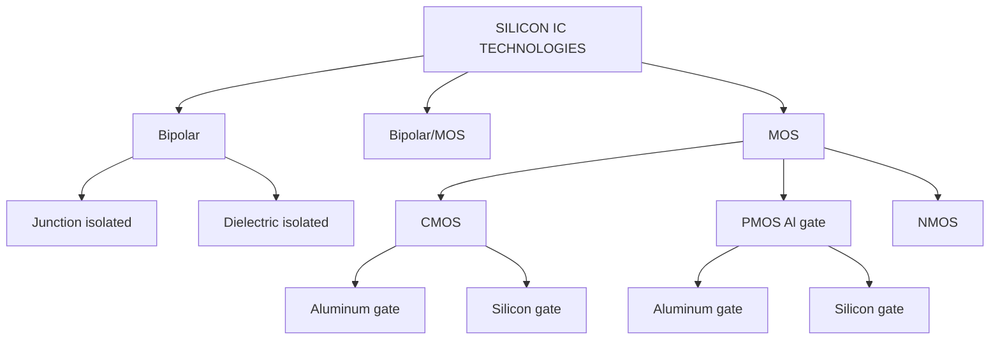
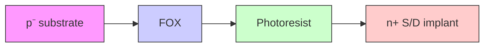
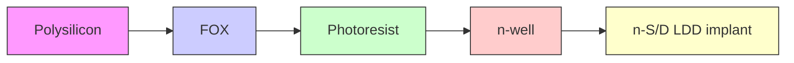
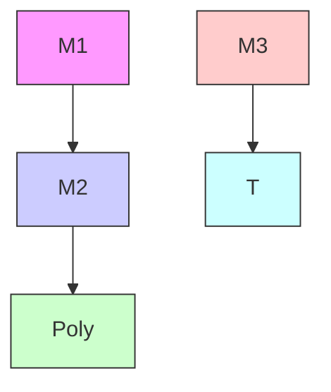
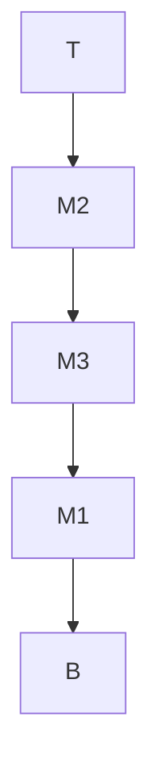
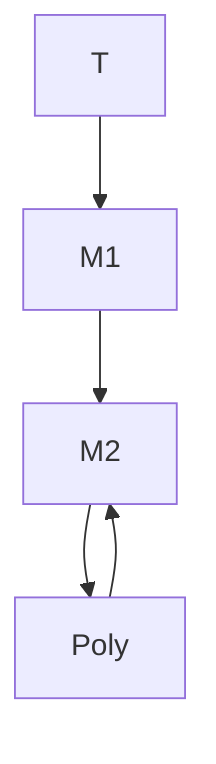
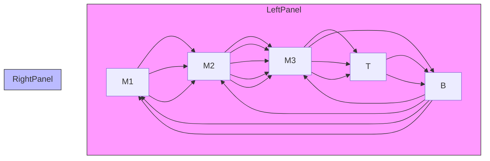

<!-- source.md = VIEWER-ONLY verbatim slice of CMOS_Analog_Circuit_Design_-_Allen_Holberg_mineru.md, original lines 743-2916 (Chapter 2).
     Authoritative gold coordinates are in gold.yaml under each atom's source_span (file=the mineru .md).
     viewer_span here is optional/debug. -->
# Chapter 2 CMOS Technology

The two most prevalent integrated-circuit technologies are bipolar and MOS. Within each of these families are various subgroups as illustrated in Fig. 2.0-1, which shows a family tree of some of the more widely used silicon integrated-circuit technologies. For many years the dominant silicon integrated-circuit technology was bipolar, as evidenced by the ubiquitous monolithic operational amplifier and the TTL (transistor-transistor logic) family. In the early 1970s MOS technology was demonstrated to be viable in the area of dynamic random-access memories (DRAMs), microprocessors, and the 4000- series logic family. By the end of the 1970s, driven by the need for density, it was clear that MOS technology would be the vehicle for growth in the digital VLSI area. At this same time, several organizations were attempting analog circuit designs using MOS [1,2,3,4]. NMOS technology was the early technology of choice for the majority of both digital and analog MOS designs. The early 1980s saw the movement of the VLSI world toward silicon-gate CMOS which has been the dominant technology for VLSI digital and mixed-signal designs ever since [5,6]. Recently, processes that combine both CMOS and bipolar (BiCMOS) have proven themselves to be both a technological and market success where the primary market force has been improved speed for digital circuits (primarily in static random-access memories, SRAMs). BiCMOS has potential as well in analog design due to the enhanced performance that a bipolar transistor provides in the context of CMOS technology. This book focuses on the use of CMOS for analog and mixed-signal circuit design.


<details>
<summary>flowchart</summary>


</details>

Figure 2.0-1 Categories of silicon technology

There are numerous references that develop the details of the physics of MOS device operation [7,8]. Therefore, this book covers only the aspects of this theory which are pertinent to the viewpoint of the circuit designer. The objective is to be able to appreciate the limits of the MOS circuit models developed in the next chapter and to understand the physical constraints on electrical performance.

This chapter covers various aspects of the CMOS process from a physical point of view. In order to understand CMOS technology, a brief review of the basic semiconductor fabrication processes is presented, followed by a description of the fabrication steps required to build the basic CMOS process. Next, the pn junction is presented and characterized. This discussion is followed by a description of how active and passive components compatible with the CMOS technology are built. Next, important limitations on the performance of CMOS technology including latch-up, temperature dependence, and noise are covered. Finally, this chapter deals with the topological rules employed when drawing the integrated circuit for subsequent fabrication.

# 2.1 Basic MOS Semiconductor Fabrication Processes

Semiconductor technology is based on a number of well-established process steps, which are the means of fabricating semiconductor components. In order to understand the fabrication process, it is necessary to understand these steps. The process steps described here include: oxidation, diffusion, ion implantation, deposition, and etching. The means of defining the area of the semiconductor subject to processing is called photolithography.

All processing starts with single-crystal silicon material. There are two methods of growing such crystals [9]. Most of the material is grown by a method based on that developed by Czochralski in 1917. A second method, called the float zone technique, produces crystals of high purity and is often used for power devices. The crystals are normally grown in either a <100> or <111> crystal orientation. The resulting crystals are cylindrical and have a diameter of 75-200 mm and a length of 1 m. The cylindrical crystals are sliced into wafers which are approximately 0.5 to 0.7 mm thick for wafers of size 100 mm to 150 mm respectively [10]. This thickness is determined primarily by the physical strength requirements. When the crystals are grown, they are doped with either an n-type or p-type impurity to form a n- or p-substrate. The substrate is the starting material in wafer form for the fabrication process. The doping level of most substrates is approximately $1 0 ^ { 1 5 }$ impurity atoms/cm3, which roughly corresponds to a resistivity of 3-5 Ω-cm for an n-substrate and 14-16 Ω-cm for a p-substrate [11].

An alternative to starting with a lightly-doped silicon wafer is to use a heavily-doped wafer that has a lightly-doped epitaxial on top of it where subsequent devices are formed. Although epi wafers are more expensive, they can provide some benefits by reducing sensitivity to latchup (discussed later) and reduce interference between analog and digital circuits on mixed-signal integrated circuits.

The five basic processing steps which are applied to the doped silicon wafer to fabricate semiconductor components (oxidation, diffusion, ion implantation, deposition, and etching) will be described in the following paragraphs.

# Oxidation

The first basic processing step is oxide growth or oxidation [12]. Oxidation is the process by which a layer of silicon dioxide $( \mathrm { { S i O } } _ { 2 } )$ is formed on the surface of the silicon wafer. The oxide grows both into as well as on the silicon surface as indicated in Fig. 2.1-1. Typically about 56% of the oxide thickness is above the original surface while about 44% is below the original surface. The oxide thickness, designated $t _ { o x }$ , can be grown using either dry or wet techniques, with the former achieving lower defect densities. Typically oxide thickness varies from less than 150 Å for gate oxides to more than 10,000 Å for field oxides. Oxidation takes place at temperatures ranging from $7 0 0 ^ { \circ } \mathrm { C }$ to $1 1 0 0 ~ ^ { \circ } \mathrm { C }$ with the resulting oxide thickness being proportional to the temperature at which it is grown (for a fixed amount of time).


<details>
<summary>text_image</summary>

Original silicon surface
Silicon dioxide
0.44 tox
Silicon substrate
tox
</details>

Figure 2.1-1 Silicon dioxide growth at the surface of a silicon wafer.

# Diffusion

The second basic processing step is diffusion [13]. Diffusion in semiconductor material is the movement of impurity atoms at the surface of the material into the bulk of the material. Diffusion takes place at temperatures in the range of $8 0 0 ~ ^ { \circ } \mathrm { C }$ to $1 4 0 0 ~ ^ { \circ } \mathrm { C }$ in the same way as a gas diffuses in air. The concentration profile of the impurity in the semiconductor is a function of the concentration of the impurity at the surface and the time in which the semiconductor is placed in a high-temperature environment. There are two basic types of diffusion mechanisms which are distinguished by the concentration of the impurity at the surface of the semiconductor. One type of diffusion assumes that there is an infinite source of impurities at the surface $( N _ { 0 } \mathrm { { ^ { - } { } c m ^ { - 3 } } } )$ during the entire time the impurity is allowed to diffuse. The impurity profile for an infinite-source impurity as a function of diffusion time is given in Fig. 2.1-2(a). The second type of diffusion assumes that there is a finite source of impurities at the surface of the material initially. $\mathbf { A } \mathbf { t } \ t = 0$ this value is given by $N _ { 0 } .$ . However, as time increases, the impurity concentration at the surface decreases as shown in Fig. 2.1-2(b). In both cases, $N _ { B }$ is the pre-diffusion impurity concentration of the semiconductor.

The infinite-source and finite-source diffusions are typical of predeposition and drive-in diffusions, respectively. The object of a predeposition diffusion is to place a large concentration of impurities near the surface of the material. There is a maximum impurity concentration that can be diffused into silicon depending upon the type of impurity. This maximum concentration is due to the solid solubility limit which is in the range of $5 \times 1 0 ^ { 2 0 }$ to $2 \times 1 0 ^ { 2 1 }$ atoms/cm 3. The drive-in diffusion follows the deposition diffusion and is used to drive the impurities deeper into the semiconductor. The crossover between the pre-diffusion impurity level and the diffused impurities of the opposite type defines the semiconductor junction. This junction is between a p-type and n-type material and is simply called a pn junction. The distance between the surface of the semiconductor and the junction is called the junction depth. Typical junction depths for diffusion can range from 0.1 m for predeposition type diffusions to greater than 10 m for drive-in type diffusions.


<details>
<summary>line</summary>

| Depth (x) | N(x) for t1 | N(x) for t2 | N(x) for t3 |
|-----------|-------------|-------------|-------------|
| 0         | N0          | N0          | N0          |
| t1        | ~-1.5       | ~-2.5       | ~-3.5       |
| t2        | ~-2.5       | ~-3.5       | ~-4.5       |
| t3        | ~-3.5       | ~-4.5       | ~-5.5       |
</details>


<details>
<summary>line</summary>

| Depth (x) | t1     | t2     | t3     |
|-----------|--------|--------|--------|
| 0         | N0     | N0     | N0     |
| 1         | ~0.8   | ~0.6   | ~0.4   |
| 2         | ~0.5   | ~0.4   | ~0.2   |
| 3         | ~0.3   | ~0.2   | ~0.1   |
</details>

Figure 2.1-2 Diffusion profiles as a function of time for (a) infinite-source of impurities at the surface, and (b) a finite source of impurities at the surface.

# Ion Implantation

The next basic processing step is ion implantation and is widely used in the fabrication of MOS components [14,15]. Ion implantation is the process by which ions of a particular dopant (impurity) are accelerated by an electric field to a high velocity and physically lodge within the semiconductor material. The average depth of penetration varies from 0.1 to 0.6 m depending on the velocity and angle at which the ions strike the silicon wafer. The path of each ion depends upon the collisions it experiences. Therefore, ions are typically implanted off-axis from the wafer so that they will experience collisions with lattice atoms thus avoiding undesirable channeling of ions deep into the silicon. An alternative method to address channeling is to implant through silicon dioxide which randomizes the implant direction before the ions enter the silicon. The ionimplantation process causes damage to the semiconductor crystal lattice leaving many of the implanted ions electrically inactive. This damage can be repaired by an annealing process in which the temperature of the semiconductor after implantation is raised to around $8 0 0 ~ ^ { \circ } \mathrm { C }$ to allow the ions to move to electrically active locations in the semiconductor crystal lattice.

Ion implantation can be used in place of diffusion since in both cases the objective is to insert impurities into the semiconductor material. Ion implantation has several advantages over thermal diffusion. One advantage is the accurate control of doping—to within ±5%. Reproducibility is very good, making it possible to adjust the thresholds of MOS devices or to create precise resistors. A second advantage is that ion implantation is a room-temperature process, although annealing at higher temperatures is required to remove the crystal damage. A third advantage is that it is possible to implant through a thin layer. Consequently, the material to be implanted does not have to be exposed to contaminants during and after the implantation process. Unlike ion implantation, diffusion requires that the surface be free of silicon dioxide or silicon nitride layers. Finally, ion implantation allows control over the profile of the implanted impurities. For example, a concentration peak can be placed below the surface of the silicon if desired.

# Deposition

The fourth basic semiconductor process is deposition. Deposition is the means by which films of various materials may be deposited on the silicon wafer. These films may be deposited using several techniques which include deposition by evaporation [16], sputtering [17], and chemical-vapor deposition (CVD) [18,19]. In evaporation deposition, a solid material is placed in a vacuum and heated until it evaporates. The evaporant molecules strike the cooler wafer and condense into a solid film on the wafer surface. Thickness of the deposited materiel is determined by the temperature and the amount of time evaporation is allowed to take place (a thickness of 1 m is typical). The sputtering technique uses positive ions to bombard the cathode, which is coated with the material to be deposited. The bombarded or target material is dislodged by direct momentum transfer and deposited on wafers which are placed on the anode. The types of sputtering systems used for depositions in integrated circuits include dc, radio frequency (RF), or magnetron (magnetic field). Sputtering is usually done in a vacuum. Chemical vapor deposition uses a process in which a film is deposited by a chemical reaction or pyrolytic decomposition in the gas phase which occurs in the vicinity of the silicon wafer. This deposition process is generally used to deposit polysilicon, silicon dioxide $( \mathrm { { S i O } } _ { 2 } )$ , or silicon nitride $( \mathrm { S i } _ { 3 } \mathrm { N } _ { 4 } )$ . While the chemical vapor deposition is usually performed at atmospheric pressure, it can also be done at low pressures where the diffusivity increases significantly. This technique is called low-pressure chemical-vapor deposition (LPCVD).

# Etching

The final basic semiconductor fabrication process considered here is etching. Etching is the process of removing exposed (unprotected) material. The means by which some material is exposed and some is not will be considered next in discussing the subject of photolithography. For the moment, we will assume that the situation illustrated in Fig. 2.1-3(a) exists. Here we see a top layer called a film and an underlying layer. A protective layer, called a maski, covers the film except in the area which is to be etched. The objective of etching is to remove just the section of the exposed film. To achieve this, the etching process must have two important properties: selectivity, and anisotropy. Selectivity is the characteristic of the etch whereby only the desired layer is etched with no effect on either the protective layer (masking layer) or the underlying layer. Selectivity can quantified as the ratio of the desired layer etch rate to the undesired layer etch rate as given below.

$$
\mathrm{S} _ {\mathrm{A} - \mathrm{B}} = \frac {\text { Desired   layer   etch   rate(A)}}{\text { Undesired   layer   etch   rate(B)}} \tag {1}
$$

Anisotropy is the property of the etch to manifest itself in one direction, i.e., a perfectly anisotropic etchant will etch in one direction only. The degree of anisotropy can be quantified by the relation given below.

$$
\mathrm{A} = 1 - \frac {\text { Lateral   etch   rate }}{\text { Vertical   etch   rate }} \tag {2}
$$

Reality is such that neither perfect selectivity nor perfect anisotropy can be achieved in practice, resulting in undercutting effects and partial removal of the underlying layer as illustrated in Fig. 2.1-3(b). As illustrated, the lack of selectivity with respect to the mask is given by dimension “a.” Lack of selectivity with respect to the underlying layer is given by dimension “b.” Dimension “c” shows the degree of anisotropy. There are preferential etching techniques which achieve high degrees of anisotropy and thus minimize undercutting effects, as well as maintain high selectivity. Materials which are normally etched include polysilicon, silicon dioxide, silicon nitride, and aluminum.


<details>
<summary>text_image</summary>

Mask
Film
Underlying layer
(a)
</details>


<details>
<summary>text_image</summary>

Mask
Film
a
b
c
Underlying layer
(b)
</details>

Figure 2.1-3 (a) Portion of the top layer ready for etching. (b) Result of etching indicating horizontal etching and etching of underlying layer.

There are two basic types of etching techniques. Wet etching uses chemicals to remove the material to be etched. Hydrofluoric acid (HF) is used to etch silicon dioxide; phosphoric acid $( \mathrm { H } _ { 3 } \mathrm { P O } _ { 4 } )$ is used to remove silicon nitride; nitric acid, acetic acid, or hydrofluoric acid is used to remove polysilicon, potassium hydroxide is used to etch silicon; and a phosphoric acid mixture is used to remove metal. The wet-etching technique is strongly dependent upon time and temperature, and care must be taken with the acids used in wet etching as they represent a potential hazard. Dry etching or plasma etching uses ionized gases that are rendered chemically active by an RF-generated plasma. This process requires significant characterization to optimize pressure, gas flow rate, gas mixture, and RF power. Dry etching is very similar to sputtering and in fact the same equipment can be used. Reactive ion etching (RIE) induces plasma etching accompanied by ionic bombardment. Dry etching is used for submicron technologies since it achieves anisotropic profiles (no undercutting).

Photolithography

Each of the basic semiconductor fabrication processes discussed thus far is only applied to selected parts of the silicon wafer with the exception of oxidation and deposition. The selection of these parts is accomplished by a process called photolithography [12,20,21]. Photolithography refers to the complete process of transferring an image from a photomask or computer database to a wafer. The basic components of photolithography are the photoresist material and the photomask used to expose some areas of the photoresist to ultraviolet (UV) light while shielding the remainder. All integrated circuits consist of various layers which overlay to form the device or component. Each distinct layer must be physically defined as a collection of geometries. This can be done by physically drawing the layer on a large scale and optically reducing it to the desired size. However, the usual technique is to draw the layer using a computer-aided design (CAD) system and store the layer description in electronic data format.

The photoresist is an organic polymer whose characteristics can be altered when exposed to ultraviolet light. Photoresist is classified into positive and negative photoresist. Positive photoresist is used to create a mask where patterns exist (where the photomask is opaque to UV light). Negative photoresist creates a mask where patterns do not exist (where the photomask is transparent to UV light). The first step in the photolithographic process is to apply the photoresist to the surface to be patterned. The photoresist is applied to the wafer and the wafer spun at several thousand revolutions per minute in order to disperse the photoresist evenly over the surface of the wafer. The thickness of the photoresist depends only upon the angular velocity of the spinning wafer. The second step is to “soft bake” the wafer to drive off solvents in the photoresist. The next step selectively exposes the wafer to UV light. Using positive photoresist, those areas exposed to UV light can be removed with solvents leaving only those areas that were not exposed. Conversely, if negative photoresist is used, those areas exposed to UV light will be made impervious to solvents while the unexposed areas will be removed. This process of exposing and then selectively removing the photoresist is called developing. The developed wafer is then “hard baked” at a higher temperature to achieve maximum adhesion of the remaining photoresist. The hardened photoresist protects selected areas from the etch plasma or acids used in the etching process. When its protective function is complete, the photoresist is removed with solvents or plasma ashing that will not harm underlying layers. This process must be repeated for each layer of the integrated circuit. Fig. 2.1-4 shows, by way of example, the basic photolithographic steps in defining a polysilicon geometry using positive photoresist.


<details>
<summary>text_image</summary>

Photomask
UV Light
Photomask
(a)
Photoresist
Polysilicon
</details>

Figure 2.1-4 Basic photolithographic steps to define a polysilicon geometry.   
(a) Expose (b) Develop (c) Etch (d) Remove photoresist


<details>
<summary>text_image</summary>

(b)
Polysilicon
Photoresist
Etch
Photoresist
Polysilicon
(c)
Remove photoresist
(d)
</details>

Figure 2.1-4 Basic photolithographic steps to define a polysilicon geometry (cont'd).   
(a) Expose (b) Develop (c) Etch (d) Remove photoresist

The process of exposing selective areas of a wafer to light through a photomask is called printing. There are three basic types of printing systems used. They are listed below:

• Contact printing   
• Proximity printing   
• Projection printing

The simplest and most accurate method is contact printing. This method uses a glass plate a little larger than the size of the actual wafer with the image of the desired pattern on the side of the glass that comes in physical contact with the wafer. This glass plate is commonly called a photomask. The system results in high resolution, high throughput, and low cost. Unfortunately, because of the direct contact, the photomask wears out and has to be replaced after 10-25 exposures. This method also introduces impurities and defects, because of the physical contact. For these reasons, contact printing is not used in modern VLSI.

A second exposure system is called proximity printing. In this system, the photomask and wafer are placed very close to one another but not in intimate contact. As the gap between the photomask and the wafer increases, resolution decreases. In general, this method of patterning is not useful where minimum feature size is below 2 m. Therefore, proximity printing is not used in present-day VLSI.

The projection printing method separates the wafer from the photomask by a relatively large distance. Lenses or mirrors are used to focus the photomask image on the surface of the wafer. There are two approaches used for projection printing: scanning, and step and repeat. The scanning method passes light through the photomask which follows a complex optical path reflecting off multiple mirrors imaging the wafer with an arc of illumination optimized for minimum distortion. The photomask and wafer scan the illuminated arc. Minimum feature size for this method is ≈2-3 m.

The projection printing system most used today is step-and-repeat. This method is applied in two ways: reduction, and non-reduction. Reduction projection printing uses a scaled image, typically 5X, on the photomask. One benefit of this method is that defects are reduced by the scale amount. Non-reduction systems do not have this benefit and thus greater burden for low defect densities is placed on the manufacture of the photomask itself.

Electron beam exposure systems are often used to generate the photomasks for projection printing systems because of its high resolution (less than 1 m). However, the electron beam can be used to directly pattern photoresist without using a photomask. The advantages of using the electron beam as an exposure system are accuracy and the ability to make software changes. The disadvantages are high cost and low throughput.

# N-Well CMOS Fabrication Steps

It is important for a circuit designer to understand some of the basic steps involved in fabricating a CMOS circuit. The fabrication steps of one of the more popular CMOS silicon-gate processes will be described in detail. The first step in the n-well silicon-gate CMOS process is to grow a thin silicon-dioxide region on a p- substrate (wafer). Subsequent to this, the regions where n-wells are to exist are defined in a masking step by depositing a photoresist material on top of the oxide. After exposing and developing the photoresist, n-type impurities are implanted into the wafer as illustrated in Fig. 2.1-5(a). Next, photoresist is removed and a high-temperature oxidation/drive-in step is performed causing the implanted ions to diffuse into the p- substrate. This is followed by oxide removal and subsequent growth of a thin pad oxide layer. [The purpose of the pad oxide is to protect the substrate from stress due to the difference in the thermal expansion of silicon and silicon nitride.] Then a layer of silicon nitride is deposited over the entire wafer as illustrated in Fig. 2.1-5(b). Photoresist is deposited, patterned, and developed as before, and the silicon nitride is removed from the areas where it has been patterned. The silicon nitride and photoresist remain in the areas where active devices will reside. These regions where silicon nitride remain are called active area or moat.

Next, a global n-type field (channel stop) implant is performed as illustrated in Fig. 2.1-5(c). The purpose of this is to insure that parasitic p-channel transistors do not turn on under various interconnect lines. Photoresist is removed, re-deposited and patterned using the p-type field (channel stop) implant mask followed by a p- field-implant step as shown in Fig. 2.1-5(d). This is to insure that parasitic n-channel transistors do not turn on under various interconnect lines. Next, to achieve isolation between active regions, a thick silicon-dioxide layer is grown over the entire wafer except where silicon nitride exists (silicon nitride impedes oxide growth). This particular way of building isolation between devices is called LOCOS isolation. One of the non-ideal aspects of LOCOS isolation is due to the oxide growth encroaching under the edges of the silicon nitride resulting in a reduced active-area region (the well-known “bird’s beak”). Figure 2.1-4(e) shows the results of this step. Once the thick field oxide (FOX) is grown, the remaining silicon nitride is removed and a thin oxide, which will be the gate oxide, is grown followed by a polysilicon deposition step (Fig. 2. 1-5(f)). Polysilicon is then patterned and etched, leaving only what is required to make transistor gates and interconnect lines.

At this point, the drain and source areas have not been diffused into the substrate. Modern processes employ lightly-doped drain/source (LDD) diffusions to minimize impact ionization. The LDD structure is built by depositing a spacer oxide over the patterned polysilicon followed by an anisotropic oxide etch leaving spacers on each side of the polysilicon gate as shown in Fig. 2.1-5(g). To make $\mathfrak { n } ^ { + }$ sources and drains, photoresist is applied and patterned everywhere n-channel transistors are required; $\mathfrak { n } ^ { + }$ is also required where metal connections are to be made to $\mathrm { \Omega } ^ { \mathrm { n } ^ { \mathrm { - } } }$ material such as the n-well. After developing, the $\mathfrak { n } ^ { + }$ areas are implanted as illustrated in Fig. 2.1-5(h). The photoresist acts as a barrier to the implant as does the polysilicon and spacer. As a result, the $\mathfrak { n } ^ { + }$ regions that result are properly aligned with the spacer oxide. The spacer is etched next, followed by a lighter $\mathfrak { n } ^ { - }$ implant (Fig. 2.1-5(i)) producing the higher resistivity source/drain regions aligned with the polysilicon gate. These steps are repeated for the pchannel transistors resulting in the cross section illustrated in Fig. 2.1-5(j). Annealing is performed in order to activate the implanted ions. At this point, as shown in Fig. 2.1-5(k), n- and p-channel LDD transistors are complete except for the necessary terminal connections.

In preparation for the contact step, a new, thick oxide layer is deposited over the entire wafer (Fig. 2.1-5(l)). This layer is typically borophosphosilicate glass (BPSG) which has a low reflow temperature (and thus provides a more planar surface for subsequent layers)[22]. Contacts are formed by first defining their location using the photolithographic process applied in previous steps. Next, the oxide areas where contacts are to be made are etched down to the surface of the silicon. The remaining photoresist is removed and metal (aluminum) is deposited on the wafer. First metal (Metal 1) interconnect is then defined photolithographically and subsequently etched so that all unnecessary metal is removed. To prepare for a second metal, another interlayer dielectric is deposited (Fig. 2.1-5(m)). This is usually a sandwich of CVD $\mathrm { S i O } _ { 2 }$ , spun-on glass (SOG), and CVD $\mathrm { S i O } _ { 2 }$ to achieve planarity. Intermetal connections (via’s) are defined through the photolithographic process followed by an etch and the second metal (Metal 2) is then deposited (Fig. 2.1-5(n). A photolithographic step is applied to pattern the second layer metal, followed by a metal etch step.

In order to protect the wafer from chemical intrusion or scratching, a passivation layer of $\mathrm { S i O } _ { 2 }$ or $\mathrm { S i N } _ { 3 }$ is applied covering the entire wafer. Pad regions are then defined (areas where wires will be bonded between the integrated circuit and the package containing the circuit) and the passivation layer removed only in these areas. Figure 2.1- 5(o) shows a cross section of the final circuit.


<details>
<summary>text_image</summary>

n-well implant
Photoresist	SiO₂	Photoresist
p⁻ substrate
</details>


<details>
<summary>text_image</summary>

Si₃N₄
SiO₂
n-well
p⁻ substrate
</details>

(b)


<details>
<summary>text_image</summary>

n- field implant
Si₃N₄
Photoresist
Pad oxide (SiO₂)
n-well
p- substrate
</details>

(c)


<details>
<summary>text_image</summary>

p- field implant
Si₃N₄
Photoresist
n-well
p- substrate
</details>

Figure 2.1-5 The major CMOS process steps.


<details>
<summary>text_image</summary>

Si₃N₄
FOX
p⁻ substrate
n-well
</details>

(e)


<details>
<summary>text_image</summary>

Polysilicon
FOX
n-well
p⁻ substrate
</details>

(f)


<details>
<summary>text_image</summary>

Polysilicon
SiO₂ spacer
Photoresist
FOX
n-well
p⁻ substrate
</details>

(g)


<details>
<summary>flowchart</summary>


</details>

(h)   
Figure 2.1-5 The major CMOS process steps (cont'd).


<details>
<summary>flowchart</summary>


</details>

(i)


<details>
<summary>text_image</summary>

Polysilicon
LDD Diffusion
FOX
p⁻ substrate
n-well
</details>

(j)


<details>
<summary>text_image</summary>

n+ Diffusion
p+ Diffusion
Polysilicon
FOX
FOX
n-well
p⁻ substrate
</details>

(k)


<details>
<summary>text_image</summary>

n+ Diffusion
p+ Diffusion
Polysilicon
BPSG
FOX
FOX
n-well
p- substrate
</details>

(l)   
Figure 2.1-5 The major CMOS process steps (cont'd).


<details>
<summary>text_image</summary>

CVD oxide, Spin-on glass (SOG)
Metal 1
BPSG
FOX
FOX
n-well
p⁻ substrate
</details>

(m)


<details>
<summary>text_image</summary>

Metal 2
Metal 1
BPSG
FOX
FOX
n-well
p⁻ substrate
</details>

(n)


<details>
<summary>text_image</summary>

Metal 2
Passivation protection layer
Metal 1
BPSG
FOX
FOX
n-well
p⁻ substrate
</details>

(o)   
Figure 2.1-5 The major CMOS process steps (cont'd).

In order to illustrate the process steps in sufficient detail, actual relative dimensions are not given (i.e., the side-view drawings are not to scale). It is valuable to gain an appreciation of actual scale thus Fig. 2.1-6 is provided below to illustrate relative dimensions.


<details>
<summary>text_image</summary>

Metal 4
Metal 3
Metal 2
Metal 1
1µm
Polysilicon
Diffusion
8µm
7µm
6µm
5µm
4µm
3µm
2µm
1µm
</details>

Figure 2.1-6 Side view of CMOS integrated circuit.

Thus far, the basic N-Well CMOS process has been described. There are a variety of enhancements that can be applied to this process to improve circuit performance. These will be covered in the following paragraphs.

# Silicide/Salicide Technology

Silicide technology was born out of the need to reduce interconnect resistivity. For with it, a low-resistance silicide such as TiSi2, WSi2, TaSi2 or several other candidate silicides, is placed on top of polysilcon so that the overall polysilicon resistance is greatly reduced without compromising the other salient benefits of using polysilicon as a transistor gate (well-known work-function and polysilicon-Si interface properties).

Salicide technology (self-aligned silicide) i goes one step further by providing lowresistance source/drain connections as well as low-resistance polysilicon. Examples of silicide and salicide transistor cross-sections are illustrated in Fig. 2.1-7[23]. For analog designs, it is important to have available polysilicon and diffusion resistors that are not salicided, so a good mixed-signal process should provide a salicide block.


<details>
<summary>text_image</summary>

Polysilicide
Metal
FOX
</details>

(a)


<details>
<summary>text_image</summary>

Polysilicide
Silicide
FOX
</details>

Figure 2.1-7 (a) Polycide structure and (b) Salicide structure.

There are many other details associated with CMOS processes that have not yet been described here. Furthermore, there are different variations on the basic CMOS process just described. Some of these provide multiple levels of polysilicon as well as additional layers of metal interconnect. Others provide good capacitors using either two layers of polysilicon, two layers of metal (MOM capacitors), or polysilicon on top of a heavily implanted (on the same order as a source or drain) diffusion. Still other processes start with a n - substrate and implant p-wells (rather than n-wells in an p- substrate). The latest processes also use shallow trench isolation (STI) instead of LOCOS to eliminate the problem of oxide encroachment into the width of a transistor. Newer processes also employ chemical mechanical polishing (CMP) to achieve maximum surface planarity.

# 2.2 The pn Junction

The pn junction plays an important role in all semiconductor devices. The objective of this section is to develop the concepts of the pn junction that will be useful to us later in our study. These include the depletion-region width, the depletion capacitance, reverse-bias or breakdown voltage, and the diode equation. Further information can be found in the references [24,25].

Fig. 2.2-1(a) shows the physical model of a pn junction. In this model it is assumed that the impurity concentration changes abruptly from $N _ { D }$ donors in the n-type semiconductor to $N _ { A }$ acceptors in the p-type semiconductor. This situation is called a step junction and is illustrated in Fig. 2.2-1(b). The distance x is measured to the right from the metallurgical junction at $x = 0$ . When two different types of semiconductor materials are formed in this manner, the free carriers in each type move across the junction by the principle of diffusion. As these free carriers cross the junction, they leave behind fixed atoms which have a charge opposite to the carrier. For example, as the electrons near the junction of the n-type material diffuse across the junction they leave fixed donor atoms of opposite charge (+) near the junction of the n-type material. This is represented in Fig. 2.2-1(c) by the rectangle with a height of $q N _ { D }$ . Similarly, the holes which diffuse across the junction from the p-type material to the n-type material leave behind fixed acceptor atoms that are negatively charged. The electrons and holes that diffuse across the junction quickly recombine with the free majority carriers across the junction. As positive and negative fixed charges are uncovered near the junction by the diffusion of the free carriers, an electric field develops which creates an opposing carrier movement. When the current due to the free carrier diffusion equals the current caused by the electric field, the pn junction reaches equilibrium. In equilibrium, both $\nu _ { D }$ and $i _ { D }$ of Fig. 2.2-1(a) are zero.


<details>
<summary>text_image</summary>

(a)
p-type
semiconductor
xn
xp
xd
n-type
semiconductor
iD
+ vD -
Impurity concentration (cm-3)
</details>


<details>
<summary>text_image</summary>

(b)
N_D
0	x
-N_A
</details>


<details>
<summary>bar</summary>

| Region | Description                          | Value Label |
|--------|--------------------------------------|-------------|
| (c)    | Depletion charge concentration (cm⁻³)  | qN_D        |
| (c)    | Electric Field (V/cm)                 | x_p         |
| (c)    | Electric Field (V/cm)                 | -qN_A       |
| (d)    | Potential (V)                        | E_0         |
| (d)    | Potential (V)                        | x           |
| (e)    | Potential (V)                        | φ₀−v_D      |
| (e)    | Potential (V)                        | x_d         |
</details>

Figure 2.2-1 PN junction (a) Physical structure (b) Impurity concentration. (c) Depletion charge concentration (d) Electric field (e) Electrostatic potential

The distance over which the donor atoms have a positive charge (because they have lost their free electron) is designated as $x _ { n }$ in Fig. 2.2-1(c). Similarly, the distance over which the acceptor atoms have a negative charge (because they have lost their free hole) is $x _ { p }$ . In this diagram, $x _ { p }$ is a negative number. The depletion region is defined as the region about the metallurgical junction which is depleted of free carriers. The depletion region is defined as

$$
x _ {d} = x _ {n} - x _ {p} \tag {1}
$$

Note that $x _ { p } < 0 .$ .

Due to electrical neutrality, the charge on either side of the junction must be equal. Thus,

$$
q N _ {D} x _ {n} = - q N _ {A} x _ {p} \tag {2}
$$

where $q$ is the charge of an electron $( 1 . 6 0 \times 1 0 ^ { - 1 9 } \mathrm { C } )$ . The electric field distribution in the depletion region can be calculated using the point form of Gauss’s law.

$$
\frac {d E (x)}{d x} = \frac {q N}{\varepsilon_ {s i}} \tag {3}
$$

By integrating either side of the junction, the maximum electric field that occurs at the junction, $E _ { \mathrm { o } } ,$ , can be found. This is illustrated in Fig. 2.2-1(d). Therefore, the expression for $E _ { 0 }$ is

$$
E _ {0} = \int_ {0} ^ {E _ {\mathrm{o}}} d E = \int_ {x _ {p}} ^ {0} \frac {- q N _ {A}}{\varepsilon_ {s i}} d x = \frac {q N _ {A} x _ {p}}{\varepsilon_ {s i}} = \frac {- q N _ {D} x _ {n}}{\varepsilon_ {s i}} \tag {4}
$$

where $\varepsilon _ { s i }$ is the dielectric constant of silicon and is $1 1 . 7 \varepsilon _ { o } ( \varepsilon _ { o }$ is $8 . 8 5 \times 1 0 ^ { - 1 4 } \mathrm { F / c m ) }$ .

The voltage drop across the depletion region is shown in Fig. 2.2-1(e). The voltage is found by integrating the negative electric field resulting in

$$
\phi_ {o} - v _ {D} = \frac {- E _ {o} (x _ {n} - x _ {p})}{2} \tag {5}
$$

where $\nu _ { D }$ is an applied external voltage and $\phi _ { o }$ is called the barrier potential and is given as

$$
\phi_ {o} = \frac {k T}{q} \ln \left(\frac {N _ {A} N _ {D}}{n _ {i} ^ {2}}\right) = V _ {t} \ln \left(\frac {N _ {A} N _ {D}}{n _ {i} ^ {2}}\right) \tag {6}
$$

Here, k is Boltzmann’s constant $( 1 . 3 8 \times 1 0 ^ { - 2 3 } \ : \mathrm { J } / \mathrm { K } )$ and $n _ { i }$ is the intrinsic concentration of silicon which is $1 . 4 5 \times 1 0 ^ { 1 0 } / \mathrm { c m } ^ { 3 }$ at 300 Κ. At room temperature, the value of $V _ { t }$ is 25.9 mV. It is important to note that the notation for $k T / q$ is $V _ { t }$ rather than the conventional $V _ { T }$ . The reason for this is to avoid confusion with $V _ { T }$ which will be used to designate the threshold voltage of the MOS transistor (see Sec. 2.3). Although the barrier voltage exists with $\nu _ { D } = 0 ,$ , it is not available externally at the terminals of the diode. When metal leads are attached to the ends of the diode a metal-semiconductor junction is formed. The barrier potentials of the metal-semiconductor contacts are exactly equal to $\phi _ { o }$ so that the open circuit voltage of the diode is zero.

Equations (2), (4), and (5) can be solved simultaneously to find the width of the depletion region in the n-type and p-type semiconductor. These widths are found as

$$
x _ {n} = \left[ \frac {2 \varepsilon_ {s i} (\phi_ {o} - v _ {D}) N _ {A}}{q N _ {D} (N _ {A} + N _ {D})} \right] ^ {1 / 2} \tag {7}
$$

and

$$
x _ {p} = - \left[ \frac {2 \varepsilon_ {s i} (\phi_ {o} - v _ {D}) N _ {D}}{q N _ {A} (N _ {A} + N _ {D})} \right] ^ {1 / 2} \tag {8}
$$

The width of the depletion region, $x _ { d } ,$ is found from Eqs. (1), (7) and (8) and is

$$
x _ {d} = \left[ \frac {2 \varepsilon_ {s i} (N _ {A} + N _ {D})}{q N _ {A} N _ {D}} \right] ^ {1 / 2} (\phi_ {o} - v _ {D}) ^ {1 / 2} \tag {9}
$$

It can be seen from Eq. (9) that the depletion width for the pn junction of Fig. 2.2-1 is proportional to the square root of the difference between the barrier potential and the externally-applied voltage. It can also be shown that $x _ { d }$ is approximately equal to $x _ { n }$ or $x _ { p }$ for $N _ { A } > > N _ { D }$ or $N _ { D } > > N _ { A }$ , respectively. Consequently, the depletion region will extend further into the lightly-doped semiconductor than it will into the heavily-doped semiconductor.

It is also of interest to characterize the depletion charge $Q _ { j }$ which is equal to the magnitude of the fixed charge on either side of the junction. The depletion charge can be expressed from the above relationships as

$$
Q _ {j} = \left| A q N _ {A} x _ {p} \right| = A q N _ {D} x _ {n} = A \left[ \frac {2 \varepsilon_ {s i} q N _ {A} N _ {D}}{N _ {A} + N _ {D}} \right] ^ {1 / 2} \left(\phi_ {o} - v _ {D}\right) ^ {1 / 2} \tag {10}
$$

where A is the cross-sectional area of the pn junction.

The magnitude of the electric field at the junction $E _ { o }$ can be found from Eqs. (4) and (7) or (8). This quantity is expressed as

$$
E _ {o} = \left[ \frac {2 q N _ {A} N _ {D}}{\varepsilon_ {s i} (N _ {A} + N _ {D})} \right] ^ {1 / 2} (\phi_ {o} - v _ {D}) ^ {1 / 2} \tag {11}
$$

Equations (9), (10), and (11) are key relationships in understanding the pn junction.

The depletion region of a pn junction forms a capacitance called the depletion-layer capacitance. It results from the dipole formed by uncovered fixed charges near the junction and will vary with the applied voltage. The depletion-layer capacitance $C _ { j }$ can be found from Eq. (10) using the following definition of capacitance.

$$
C _ {j} = \frac {d Q _ {j}}{d v _ {D}} = A \left[ \frac {\varepsilon_ {s i} q N _ {A} N _ {D}}{2 (N _ {A} + N _ {D})} \right] ^ {1 / 2} \frac {1}{(\phi_ {o} - v _ {D}) ^ {1 / 2}} = \frac {C _ {j 0}}{\left[ 1 - (v _ {D} / \phi_ {o}) \right] ^ {\mathrm{m}}} \tag {12}
$$

$C _ { j 0 }$ is the depletion-layer capacitance when $\nu _ { D } = 0$ and $m$ is called a grading coefficient. The coefficient m is 1/2 for the case of Fig. 2.2-1 which is called a step junction. If the junction is fabricated using diffusion techniques described in Sec. 2.1, Fig. 2.2-1(b) will become more like the profile of Fig. 2.2-2. It can be shown for this case that m is 1/3. The range of values of the grading coefficient will fall between $1 / 3$ and 1/2.

<!-- MinerU pages 41-60 -->

Fig. 2.2-3 shows a plot of the depletion layer capacitance for a pn junction. It is seen that when $\nu _ { D }$ is positive and approaches $\phi _ { o } ,$ the depletion-layer capacitance approaches infinity. At this value of voltage, the assumptions made in deriving the above equations are no longer valid. In particular, the assumption that the depletion region is free of charged carriers is not true. Consequently, the actual curve bends over and $C _ { j }$ decreases as $\nu _ { D }$ approaches $\phi _ { o }$ [26].


<details>
<summary>text_image</summary>

N_D
0
-x
-N_A
</details>

Figure 2.2-2 Impurity concentration profile for diffused pn junction.


<details>
<summary>line</summary>

| v_D | C_j |
| --- | --- |
| 0   | C_j0 |
| φ_0 | >C_j0 |
</details>

Figure 2.2-3 Depletion capacitance as a function of externally-applied junction voltage.

# Example 2.2-1 Characteristics of a pn Junction

Find $x _ { p } , x _ { n } , x _ { d } , \phi _ { o } , C _ { j 0 }$ , and $C _ { j }$ for an applied voltage of −4 V for a pn diode with a step junction, $N _ { A } = 5 \times 1 0 ^ { 1 5 } / \mathrm { c m } ^ { 3 } , N _ { D } = 1 0 ^ { 2 0 } / \mathrm { c m } ^ { 3 }$ , and an area of 10 m by 10 m.

At room temperature, Eq. (6) gives the barrier potential as 0.917 V. Equations (7) and (8) give $x _ { n } \cong 0$ and $x _ { p } = 1 . 1 2 8$ m. Thus, the depletion width is approximately $x _ { p }$ or 1.128 m. Using these values in Eq. (12) we find that $C _ { j 0 }$ is 20.3 fF and at a voltage of − 4 V, $C _ { j }$ is 9.18 fF.

The voltage breakdown of a reverse biased $( \nu _ { D } < 0 )$ pn junction is determined by the maximum electric field $E _ { \mathrm { m a x } }$ that can exist across the depletion region. For silicon, this maximum electric field is approximately $3 \times 1 0 ^ { 5 }$ V/cm. If we assume that $| \nu _ { D } | > \phi _ { o } ,$ then substituting $E _ { \mathrm { m a x } }$ into Eq. (11) allows us to express the maximum reverse-bias voltage or breakdown voltage (BV) as

$$
B V \cong \frac {\varepsilon_ {s i} (N _ {A} + N _ {D})}{2 q N _ {A} N _ {D}} E _ {\max} ^ {2} \tag {13}
$$

Substituting the values of Example 2.2-1 in Eq. (13) and using a value of $3 \times 1 0 ^ { 5 }$ V/cm for $E _ { \mathrm { m a x } }$ gives a breakdown voltage of 58.2 volts. However, as the reverse bias voltage starts to approach this value, the reverse current in the pn junction starts to increase. This increase is due to two conduction mechanisms that can take place in a reverse-biased junction between two heavily-doped semiconductors. The first current mechanism is called avalanche multiplication and is caused by the high electric fields present in the pn junction; the second is called Zener breakdown. Zener breakdown is a direct disruption of valence bonds in high electric fields. However, the Zener mechanism does not require the presence of an energetic ionizing carrier. The current in most breakdown diodes will be a combination of these two current mechanisms.

If $i _ { R }$ is the reverse current in the pn junction and $\nu _ { R }$ is the reverse-bias voltage across the pn junction, then the actual reverse current $i _ { R A }$ can be expressed as

$$
i _ {R A} = M i _ {R} = \left[ \frac {1}{1 - (v _ {R} / B V) ^ {n}} \right] i _ {R} \tag {14}
$$

M is the avalanche multiplication factor and n is an exponent which adjusts the sharpness of the “knee” of the curve shown in Fig. 2.2-4. Typically, n varies between 3 and 6. If both sides of the pn junction are heavily doped, the breakdown will take place by tunneling, leading to the Zener breakdown, which generally occurs at voltages less than 6 volts. Zener diodes can be fabricated where an $\mathfrak { n } ^ { + }$ diffusion overlaps with $\tt { a } _ { P } { } ^ { + }$ diffusion. Note that the Zener diode is compatible with the basic CMOS process although one terminal of the Zener must be either on the lowest power supply, $V _ { S S }$ , or the highest power supply, $V _ { D D }$ .


<details>
<summary>line</summary>

| v_R | i_R |
| --- | --- |
| 0   | 0   |
| B_V | Peak |
</details>

Figure 2.2-4 Reverse-bias volgate-current characteristics of the pn junction illustrating voltage breakdown.

The diode voltage-current relationship can be derived by examining the minoritycarrier concentrations in the pn junction. Fig. 2.2-5 shows the minority-carrier concentration for a forward-biased pn junction. The majority-carrier concentrations are much larger and are not shown on this figure. The forward bias causes minority carriers to move across the junction where they recombine with majority carriers on the opposite side. The excess of minority-carrier concentration on each side of the junction is shown by the cross-hatched regions. We note that this excess concentration starts at a maximum value at $x = 0 \ ( x ^ { \prime } = 0 )$ and decreases to the equilibrium value as $x \left( x \right)$ becomes large. The value of the excess concentration at $x = 0$ , designated as $p _ { n } ( 0 )$ , or $x ^ { \prime } = 0$ , designated as $n _ { p } ( 0 )$ , is expressed in terms of the forward-bias voltage $\nu _ { D }$ as

$$
p _ {n} (0) = p _ {n o} \exp \left(\frac {v _ {D}}{V _ {t}}\right) \tag {15}
$$

and

$$
n _ {p} (0) = n _ {p o} \exp \left(\frac {\nu_ {D}}{V _ {t}}\right) \tag {16}
$$

where $p _ { n o }$ and $n _ { p o }$ are the equilibrium concentrations of the minority carriers in the ntype and p-type semiconductors, respectively. We note that these values are essentially equal to the intrinsic concentration squared divided by the donor or acceptor impurity atom concentration, as shown on Fig. 2.2-5. As $\nu _ { D }$ is increased, the excess minority concentrations are increased. If $\nu _ { D }$ is zero, there is no excess minority concentration. If $\nu _ { D }$ is negative (reverse-biased) the minority-carrier concentration is depleted below its equilibrium value.

<table><tr><td>p-type semiconductor</td><td>Depletion region</td><td>n-type semiconductor</td></tr></table>


<details>
<summary>text_image</summary>

n_p(0)=n_p0\exp\left(\frac{v_D}{V_t}\right)\np_{p}(x')\np_n(0)=p_n0\exp\left(\frac{v_D}{V_t}\right)\np_{p0}=\frac{n_t^2}{N_A}\rightarrow\nabla\notimes\notimes\notimes\notimes\notimes\notimes\notimes\notimes\notimes\notimes\notimes\notimes\notimes\notimes\notimes\notimes\notimes\notimes\notimes\notimes\notimes\notimes\notimes\notimes\notimes\notimes\notimes\notimes\notimes\notimes\notimes\notimes\notimes\notimes\neq 0\nx'=0\nx=0\nx\np_n(x)\np_n(0)=p_n0\exp\left(\frac{v_D}{V_t}\right)\np_n0=\frac{n_t^2}{N_D}
</details>

Figure 2.2-5 Impurity concentration profile for diffused pn junction.

The current that flows in the pn junction is proportional to the slope of the excess minority-carrier concentration at $x = 0 ( x ^ { \prime } = 0 )$ . This relationship is given by the diffusion equation expressed below for holes in the n-type material.

$$
J _ {p} (x) = - q D _ {p} \left. \frac {d p _ {n} (x)}{d x} \right| _ {x = 0} \tag {17}
$$

where the $D _ { p }$ is the diffusion constant of holes in n-type semiconductor. The excess holes in the n-type material can be defined as

$$
p _ {n} ^ {\prime} (x) = p _ {n} (x) - p _ {n o} \tag {18}
$$

The decrease of excess minority carriers away from the junction is exponential and can be expressed as

$$
p _ {n} ^ {\prime} (x) = p _ {n} ^ {\prime} (0) \exp \left(\frac {- x}{L _ {p}}\right) = \left[ p _ {n} (0) - p _ {n o} \right] \exp \left(\frac {- x}{L _ {p}}\right) \tag {19}
$$

where $L _ { p }$ is the diffusion length for holes in an n-type semiconductor. Substituting Eq. (15) into Eq. (19) gives

$$
p _ {n} ^ {\prime} (x) = p _ {n o} \left[ \exp \left(\frac {v _ {D}}{V _ {t}}\right) - 1 \right] \exp \left(\frac {- x}{L _ {p}}\right) \tag {20}
$$

The current density due to the excess-hole concentration in the n-type semiconductor is found by substituting Eq. (20) in Eq. (17) resulting in

$$
J _ {p} (0) = \frac {q D p p n o}{L _ {p}} \left[ \exp \left(\frac {v _ {D}}{V _ {t}}\right) - 1 \right] \tag {21}
$$

Similarly, for the excess electrons in the p-type semiconductor we have

$$
J _ {n} (0) = \frac {q D _ {n} n p o}{L _ {n}} \left[ \exp \left(\frac {v _ {D}}{V _ {t}}\right) - 1 \right] \tag {22}
$$

Assuming negligible recombination in the depletion region leads to an expression for the total current density of the pn junction given as

$$
J (0) = J _ {p} (0) + J _ {n} (0) = q \left[ \frac {D p p n o}{L _ {p}} + \frac {D n n p o}{L _ {n}} \right] \left[ \exp \left(\frac {v _ {D}}{V _ {t}}\right) - 1 \right] \tag {23}
$$

Multiplying Eq. (23) by the pn junction area A gives the total current as

$$
i _ {D} = q A \left[ \frac {D p p n o}{L _ {p}} + \frac {D n n p o}{L _ {n}} \right] \left[ \exp \left(\frac {v _ {D}}{V _ {t}}\right) - 1 \right] = I _ {s} \left[ \exp \left(\frac {v _ {D}}{V _ {t}}\right) - 1 \right] \tag {24}
$$

$I _ { s }$ is a constant called the saturation current. Equation (24) is the familiar voltage-current relationship that characterizes the pn junction diode.

Example 2.2-2 Calculation of the Saturation Current

Calculate the saturation current of a pn junction diode with $N _ { A } = 5 \times 1 0 ^ { 1 5 } / \mathrm { c m } ^ { 3 } , N _ { D } =$ $1 0 ^ { 2 0 / \mathrm { c m } ^ { 3 } , D _ { n } } = 2 0 \mathrm { c m } ^ { 2 / \mathrm { s } , D _ { p } } = 1 0 \mathrm { c m } ^ { 2 / \mathrm { s } , L _ { n } } = 1 0 \mu \mathrm { m } , L _ { p } = 5 \mu \mathrm { m } , L _ { p } = 7 0 \mu \mathrm { m } , L _ { p } = 7 0 \mu \mathrm { m } , L _ { p } = 7 0 \mu \mathrm { m } , L _ { p } = 7 0 \mu \mathrm { m }$ , and $A = 1 0 0 0 \mu \mathrm { m } ^ { 2 } .$ .

From Eq. (24), the saturation current is defined as

$$
I _ {s} = q A \left[ \frac {D _ {p} p _ {n o}}{L _ {p}} + \frac {D _ {n} n _ {p o}}{L _ {n}} \right]
$$

$p _ { n o }$ is calculated from $n ^ { 2 } { } _ { i } / N _ { D }$ to get $2 . 1 0 3 / \mathrm { c m } ^ { 3 } ; n _ { v o }$ is calculated from $n ^ { 2 } { } _ { i } / N _ { A }$ to get 4.205 $\times 1 0 ^ { 4 } / \mathrm { c m } ^ { 3 }$ . Changing the units of area from $\mu \mathrm { m } ^ { 2 }$ to $\mathrm { c m } ^ { 2 }$ results in a saturation current magnitude of $1 . 3 4 6 \times 1 0 ^ { - 1 5 } \mathrm { A }$ or 1.346 fA.

This section has developed the depletion-region width, depletion capacitance, breakdown voltage, and the voltage-current characteristics of the pn junction. These concepts will be very important in determining the characteristics and performance of MOS active and passive components.

# 2.3 The MOS Transistor

The structure of an n-channel and p-channel MOS transistor using an n-well technology is shown in Fig. 2.3-1. The p-channel device is formed with two heavilydoped $\mathfrak { p } ^ { + }$ regions diffused into a lighter doped n- material called the well. The two $\mathfrak { p } ^ { + }$ regions are called drain and source, and are separated by a distance, L (referred to as the device length). At the surface between the drain and source lies a gate electrode that is separated from the silicon by a thin dielectric material (silicon dioxide). Similarly, the nchannel transistor is formed by two heavily doped $\mathfrak { n } ^ { + }$ regions within a lightly doped $\mathsf { p } ^ { - }$ substrate. It, too, has a gate on the surface between the drain and source separated from the silicon by a thin dielectric material (silicon dioxide). Essentially, both types of transistors are four-terminal devices as shown in Fig. 1.2-2(c,d). The B terminal is the bulk, or substrate, which contains the drain and source diffusions. For an n-well process, the p-bulk connection is common throughout the integrated circuit and is connected to $V _ { S S }$ (the most negative supply). Multiple n-wells can be fabricated on a single circuit, and they can be connected to different potentials in various ways depending upon the application.


<details>
<summary>text_image</summary>

p-channel transistor
Polysilicon
L
SiO₂
source (p⁺)
W
drain (p⁺)
n-channel transistor
L
source (n⁺)
W
drain (n⁺)
n-well
FOX
p- substrate
p+
</details>

Figure 2.3-1 Physical structure of an n-channel and p-channel transistor in an n-well technology.


<details>
<summary>text_image</summary>

S
G
D
SiO₂
Gate
FOX
FOX
Depletion regions
p- substrate
B
</details>

Figure 2.3-2 Cross-section of an n-channel transistor with all terminals grounded.


<details>
<summary>text_image</summary>

FOX
inverted channel
p- substrate
vGS +
G
Gate
D
+
-
vDS
v(y)
y=0
y+dy
y=L
B
vSB +
</details>

Figure 2.3-3 Cross-section of an n-channel transistor with small $\nu _ { D S }$ and $\nu _ { G S } > V _ { T } .$

Figure 2.3-2 shows an n-channel transistor with all four terminals connected to ground. At equilibrium, the $\mathfrak { p } ^ { - }$ substrate and the $\mathfrak { n } ^ { + }$ source and drain form a pn junction. Therefore a depletion region exists between the $\mathfrak { n } ^ { + }$ source and drain and the p- substrate. Since the source and drain are separated by back-to-back pn junctions, the resistance between the source and drain is very high $( > 1 0 ^ { 1 2 } \Omega )$ . The gate and the substrate of the MOS transistor form the parallel plates of a capacitor with the $\mathrm { S i O } _ { 2 }$ as the dielectric. This capacitance divided by the area of the gate is designated as $C _ { o x } ^ { \mathrm { ~ \scriptsize ~ i ~ } }$ When a positive potential is applied to the gate with respect to the source a depletion region is formed under the gate resulting from holes being pushed away from the silicon-silicon dioxide interface. The depletion region consists of fixed ions which have a negative charge. Using onedimensional analysis, the charge density, ρ, of the depletion region is given by

$$
\rho = q \left(- N _ {A}\right) \tag {1}
$$

Applying the point form of Gauss’s law, the electric field resulting from this charge is

$$
E (x) = \int \frac {\rho}{\varepsilon} d x = \int \frac {- q N _ {A}}{\varepsilon_ {s i}} d x = \frac {- q N _ {A}}{\varepsilon_ {s i}} x + C \tag {2}
$$

where C is the constant of integration. The constant, C, is determined by evaluating $E ( x )$ at the edges of the depletion region $( x = 0$ at the ${ \mathrm { S i } } { - } { \mathrm { S i O } } _ { 2 }$ interface; $x = x _ { d }$ at the boundary of the depletion region in the bulk).

$$
E (0) = E _ {0} = \frac {- q N _ {A}}{\varepsilon_ {s i}} 0 + C = C \tag {3}
$$

$$
E (x _ {d}) = 0 = \frac {- q N _ {A}}{\varepsilon_ {s i}} x _ {d} + C \tag {4}
$$

$$
C = \frac {q N _ {A}}{\varepsilon_ {s i}} x _ {d} \tag {5}
$$

This gives an expression for $E ( x )$

$$
E (x) = \frac {q N _ {A}}{\varepsilon_ {s i}} (x _ {d} - x) \tag {6}
$$

Applying the relationship between potential and electric field yields

$$
\int d \phi = - \int E (x) d x = - \int \frac {q N _ {A}}{\varepsilon_ {s i}} (x _ {d} - x) d x \tag {7}
$$

Integrating both sides of Eq. (7) with appropriate limits of integration gives

$$
\int_ {\phi_ {s}} ^ {\phi_ {F}} d \phi = - \int_ {0} ^ {x _ {d}} \frac {q N _ {A}}{\varepsilon_ {s i}} (x _ {d} - x) d x = - \frac {q N _ {A} x _ {d} ^ {2}}{2 \varepsilon_ {s i}} = \phi_ {F} - \phi_ {s} \tag {8}
$$

$$
\frac {q N _ {A} x _ {d} ^ {2}}{2 \varepsilon_ {s i}} = \phi_ {s} - \phi_ {F} \tag {9}
$$

where $\phi _ { F }$ is the equilibrium electrostatic potential (Fermi potential) in the semiconductor, $\phi _ { S }$ is the surface potential of the semiconductor, and $x _ { d }$ is the thickness of the depletion region. For a p-type semiconductor, $\phi _ { F }$ is given as

$$
\phi_ {F} = - V _ {t} \ln \left(N _ {A} / n _ {i}\right) \tag {10}
$$

and for an n-type semiconductor $\phi _ { F }$ is given as

$$
\phi_ {F} = V _ {t} \ln (N _ {D} / n _ {i}) \tag {11}
$$

Eq. (9) can be solved for $x _ { d }$ assuming that $| \phi _ { s } - \phi _ { F } | \geq 0$ to get

$$
x _ {d} = \left[ \frac {2 \varepsilon_ {S i} | \phi_ {S} - \phi_ {F} |}{q N _ {A}} \right] ^ {1 / 2} \tag {12}
$$

The immobile charge due to acceptor ions that have been stripped of their mobile holes is given by

$$
Q = - q N _ {A} x _ {d} \tag {13}
$$

Substituting Eq. (12) into Eq. (13) gives

$$
Q \cong - q N _ {A} \left[ \frac {2 \varepsilon_ {s i} | \phi_ {s} - \phi_ {F} |}{q N _ {A}} \right] ^ {1 / 2} = - \sqrt {2 q N _ {A} \varepsilon_ {s i} | \phi_ {s} - \phi_ {F} |} \tag {14}
$$

When the gate voltage reaches a value called the threshold voltage, designated as $V _ { T } ,$ the substrate underneath the gate becomes inverted, i.e., it changes from a p-type to an ntype semiconductor. Consequently, an n-type channel exists between the source and drain that allows carriers to flow. In order to achieve this inversion, the surface potential must increase from its original negative value $( \phi _ { s } = \phi _ { F } )$ , to zero $( \phi _ { s } = 0 )$ , and then to a positive value $( \phi _ { s } = - \phi _ { F } )$ . The value of gate-source voltage necessary to cause this change in surface potential is defined as the threshold voltage, $V _ { T }$ . This condition is known as strong inversion. The n-channel transistor in this condition is illustrated in Fig. 2.3-3. With the substrate at ground potential, the charge stored in the depletion region between the channel under the gate and the substrate is given by Eq. (14) where $\phi _ { s }$ has been replaced by $- \phi _ { F }$ to account for the fact that $\nu _ { G S } = V _ { T }$ . This charge $Q _ { b 0 }$ is written as

$$
Q _ {b 0} \cong - \sqrt {2 q N _ {A} \varepsilon_ {s i} | - 2 \phi_ {F} |} \tag {15}
$$

If a reverse bias voltage $\nu _ { B S }$ is applied across the pn junction, Eq. (15) becomes

$$
Q _ {b} \cong \sqrt {2 q N _ {A} \varepsilon_ {s i} | - 2 \phi_ {F} + v _ {S B} |} \tag {16}
$$

An expression for the threshold voltage can be developed by breaking it down into several components. First, the term $\phi _ { M S } ^ { \mathrm { ~ i ~ } }$ must be included to represent the difference in the work functions between the gate material and bulk silicon in the channel region. The term $\phi _ { M S }$ is given by

$$
\phi_ {M S} = \phi_ {F} (\text { substrate }) - \phi_ {F} (\text { gate }) \tag {17}
$$

where $\phi _ { F } ( \mathrm { m e t a l } ) = 0 . 6 \ \mathrm { V }$ . Second, a gate voltage of $[ - 2 \phi _ { F } - ( Q _ { b } / C _ { o x } ) ]$ is required to change the surface potential and offset the depletion layer charge $Q _ { b }$ . Lastly, there is always an undesired positive charge $Q _ { s s }$ present in the interface between the oxide and the bulk silicon. This charge is due to impurities and imperfections at the interface and must be compensated by a gate voltage of $- Q _ { s s } / C _ { o x }$ . Thus, the threshold voltage for the MOS transistor can be expressed as

$$
\begin{array}{l} V _ {T} = \phi_ {M S} + \left[ - 2 \phi_ {F} - \frac {Q _ {b}}{C _ {o x}} \right] + \left[ \frac {- Q _ {s s}}{C _ {o x}} \right] \\ = \phi_ {M S} - 2 \phi_ {F} - \frac {Q _ {b 0}}{C _ {o x}} - \frac {Q _ {s s}}{C _ {o x}} - \frac {Q _ {b} - Q _ {b 0}}{C _ {o x}} \tag {18} \\ \end{array}
$$

The threshold voltage can be rewritten as

$$
V _ {T} = V _ {T 0} + \gamma (\sqrt {\left| - 2 \phi_ {F} + v _ {S B} \right|} - \sqrt {\left| - 2 \phi_ {F} \right|}) \tag {19}
$$

where

$$
V _ {T 0} = \phi_ {M S} - 2 \phi_ {F} - \frac {Q _ {b 0}}{C _ {o x}} - \frac {Q _ {s s}}{C _ {o x}} \tag {20}
$$

and the body-factor, body-effect coefficient or bulk-threshold parameter  is defined as

$$
\gamma = \frac {\sqrt {2 q \varepsilon_ {s i} N _ {A}}}{C _ {o x}} \tag {21}
$$

The signs of the above analysis can become very confusing. Table 2.3-1 attempts to clarify any confusion that might arise [25].

Table 2.3-1 Signs for the Quantities in the Threshold Voltage Equation. 

<table><tr><td>Parameter</td><td>N-CHANNEL (p-type substrate)</td><td>P-CHANNEL (n-type substrate)</td></tr><tr><td> $\phi_{MS}$ </td><td></td><td></td></tr><tr><td>Metal</td><td>-</td><td>-</td></tr><tr><td> $n^{+}$  Si Gate</td><td>-</td><td>-</td></tr><tr><td> $p^{+}$  Si Gate</td><td>+</td><td>+</td></tr><tr><td> $\phi_{F}$ </td><td>-</td><td>+</td></tr><tr><td> $Q_{b0},Q_{b}$ </td><td>-</td><td>+</td></tr><tr><td> $Q_{ss}$ </td><td>+</td><td>+</td></tr><tr><td> $V_{SB}$ </td><td>+</td><td>-</td></tr><tr><td> $\gamma$ </td><td>+</td><td>-</td></tr></table>

# Example 2.3-1 Calculation of the Threshold Voltage

Find the threshold voltage and body factor $\gamma$ for an n-channel transistor with an $\mathfrak { n } ^ { + }$ silicon gate if $t _ { o x } = 2 0 0 \textup { \AA } , N _ { A } = 3 \times 1 0 ^ { 1 6 } \textup c m ^ { - 3 }$ , gate doping, $N _ { D } { = } 4 \times 1 0 ^ { 1 9 } \mathrm { c m } ^ { - 3 }$ , and if the positively-charged ions at the oxide-silicon interface per area is $1 0 ^ { 1 0 } \mathrm { c m } ^ { - 2 }$ .

From Eq. (10), $\phi _ { F }$ (substrate) is given as

$$
\phi_ {F} (\text { substrate }) = - 0. 0 2 5 9 \ln \left[ \frac {3 \times 1 0 ^ {1 6}}{1 . 4 5 \times 1 0 ^ {1 0}} \right] = - 0. 3 7 7 \mathrm{V}
$$

The equilibrium electrostatic potential for the $\mathfrak { n } ^ { + }$ polysilicon gate is found from Eq. (11) as

$$
\phi_ {F} (\text {gate}) = 0. 0 2 5 9 \ln \left[ \frac {4 \times 1 0 ^ {1 9}}{1 . 4 5 \times 1 0 ^ {1 0}} \right] = 0. 5 6 3 \mathrm{V}
$$

Eq. (17) gives MS as

$$
\phi_ {F} (\mathrm{substrate}) - \phi_ {F} (\mathrm{gate}) = - 0. 9 4 0 \mathrm{V}.
$$

The oxide capacitance is given as

$$
C _ {o x} = \varepsilon_ {o x} / t _ {o x} = \frac {3 . 9 \times 8 . 8 5 4 \times 1 0 ^ {- 1 4}}{2 0 0 \times 1 0 ^ {- 8}} = 1. 7 2 7 \times 1 0 ^ {- 7} \mathrm {F / cm^ {2}}
$$

The fixed charge in the depletion region, $Q _ { b 0 } ,$ is given by Eq. (15) as

$$
\begin{array}{l} Q _ {b 0} = - [ 2 \times 1. 6 \times 1 0 ^ {- 1 9} \times 1 1. 7 \times 8. 8 5 4 \times 1 0 ^ {- 1 4} \times 2 \times 0. 3 7 7 \times 3 \times 1 0 ^ {1 6} ] ^ {1 / 2} \\ = - 8. 6 6 \times 1 0 ^ {- 8} \mathrm {C / cm^ {2}}. \\ \end{array}
$$

Dividing $Q _ { b 0 }$ by $C _ { o x }$ gives −0.501 V. Finally, $Q _ { s s } / C _ { o x }$ is given as

$$
\frac {Q _ {s s}}{C _ {o x}} = \frac {1 0 ^ {1 0} \times 1 . 6 0 \times 1 0 ^ {- 1 9}}{1 . 7 2 7 \times 1 0 ^ {- 7}} = 9. 3 \times 1 0 ^ {- 3} \mathrm{V}
$$

Substituting these values in Eq. (18) gives

$$
V _ {T 0} = - 0. 9 4 0 + 0. 7 5 4 + 0. 5 0 1 - 9. 3 \times 1 0 ^ {- 3} = 0. 3 0 6 \mathrm{V}
$$

The body factor is found from Eq. (21) as

$$
\gamma = \frac {\left[ 2 \times 1 . 6 \times 1 0 ^ {- 1 9} \times 1 1 . 7 \times 8 . 8 5 4 \times 1 0 ^ {- 1 4} \times 3 \times 1 0 ^ {1 6} \right] ^ {1 / 2}}{1 . 7 2 7 \times 1 0 ^ {- 7}} = 0. 5 7 7 \mathrm{V} ^ {1 / 2}
$$

The above example shows how the value of impurity concentrations can influence the threshold voltage. In fact, the threshold voltage can be set to any value by proper choice of the variables in Eq. (18). Standard practice is to implant the proper type of ions into the substrate in the channel region to adjust the threshold voltage to the desired value. If the opposite impurities are implanted in the channel region of the substrate, the threshold for an n-channel transistor can be made negative. This type of transistor is called a depletion transistor and can have current flow between the drain and source for zero values of the gate-source voltage.

When the channel is formed between the drain and source as illustrated in Fig. 2.3-3, a drain current $i _ { D }$ can flow if a voltage $\nu _ { D S }$ exists across the channel. The dependence of this drain current on the terminal voltages of the MOS transistor can be developed by considering the characteristics of an incremental length of the channel designated as dy in Fig. 2.3-3. It is assumed that the width of the MOS transistor (into the page) is W and that vDS is small. The charge per unit area in the channel, QI(y), can be expressed as

$$
Q _ {I} (y) = C _ {o x} \left[ v _ {G S} - v (y) - V _ {T} \right] \tag {22}
$$

The resistance in the channel per unit of length dy can be written as

$$
d R = \frac {d y}{\mu_ {n} Q _ {I} (y) W} \tag {23}
$$

where $\mu _ { n }$ is the average mobility of the electrons in the channel. The voltage drop, referenced to the source, along the channel in the y direction is

$$
d v (y) = i _ {D} d R = \frac {i _ {D} d y}{\mu_ {n} Q _ {I} (y) W} \tag {24}
$$

or

$$
i _ {D} d y = W \mu_ {n} Q _ {I} (y) d v (y) \tag {25}
$$

Integrating along the channel from y = 0 to y = L gives

$$
\int_ {0} ^ {\mathrm{L}} i _ {D} d y = \int_ {0} ^ {v _ {D S}} W \mu_ {n} Q _ {I} (y) d v (y) = \int_ {0} ^ {v _ {D S}} W \mu_ {n} C _ {o x} [ v _ {G S} - v (y) - V _ {T} ] d v (y) \tag {26}
$$

Performing the integration results in the desired expression for $i _ { D }$ as

$$
i _ {D} = \frac {\mu_ {n} C _ {o x} W}{L} \left[ (v _ {G S} - V _ {T}) v (y) - \frac {v (y) ^ {2}}{2} \right] _ {0} ^ {v _ {D S}} = \frac {\mu_ {n} C _ {o x} W}{L} \left[ (v _ {G S} - V _ {T}) v _ {D S} - \frac {v _ {D S} ^ {2}}{2} \right] \tag {27}
$$

This equation is sometimes called the Sah equation [27] and has been used by Shichman and Hodges [28] as a model for computer simulation. Eq. (27) is only valid when

$$
v _ {G S} \geq V _ {T} \text { and } v _ {D S} \leq (v _ {G S} - V _ {T}) \tag {28}
$$

The factor $\mu _ { n } C _ { o x }$ is often defined as the device-transconductance parameter, given as

$$
K ^ {\prime} = \mu_ {n} C _ {o x} = \frac {\mu_ {n} \varepsilon_ {o x}}{t _ {o x}} \tag {29}
$$

Eq. (28) will be examined in more detail in the next chapter, concerning the modeling of MOS transistors. The operation of the p-channel transistor is essentially the same as that of the n-channel transistor, except that all voltage and current polarities are reversed.

# 2.4 Passive Components

This section examines the passive components that are compatible with fabrication steps used to build the MOS device. These passive components include the capacitor and the resistor.

# Capacitors

A good capacitor is often required when designing analog integrated circuits. They are used as compensation capacitors in amplifier designs, as bandwidth-determining components in gm/C filters, as charge storage devices in switched-capacitor filters and digital-to-analog converters, and other places as well. The desired characteristics for capacitors used in these applications are given below:

• Good matching accuracy   
• Low voltage-coefficient   
• High ratio of desired capacitance to parasitic capacitance   
• High capacitance per unit area

Analog CMOS processes differentiate themselves from purely digital ones by providing capacitors that meet the above criteria. For such analog processes, there are basically two types of capacitors made available. One type of capacitor is formed using one of the available interconnect layer s (metal or polysilicon) on top of crystalline silicon separated by a dielectric (silicon dioxide layer). Figure 2.4-1(a) shows an example of this capacitor using polysilicon as the top conducting plate. In order to achieve a low voltagecoefficient capacitor, the bottom plate must be heavily-doped diffusion (similar to that of the source and drain). As the process was described in Sec. 2.3, such heavily-doped diffusion is normally not available underneath polysilicon because the source/drain implant step occurs after polysilicon is deposited and defined. To solve this problem, an extra implant step must be included prior to deposition of the polysilicon layer. The mask-defined implanted region becomes the bottom plate of the capacitor. The capacitance achieved using this technique is inversely proportional to gate oxide thickness. Typical values for a 0.8 m process are given in Table 2.4-1. This capacitor achieves a high capacitance per unit area and good matching performance, but has a significant voltage dependent parasitic capacitance to the substrate.


<details>
<summary>text_image</summary>

SiO₂
Gate SiO₂
Metal
Polysilicon top plate
FOX
FOX
n+ bottom-plate implant
p- substrate
</details>


<details>
<summary>text_image</summary>

Polysilicon top plate
Polysilicon bottom plate
FOX
Inter-poly SiO₂
p- substrate
</details>

(b)


<details>
<summary>text_image</summary>

SiO₂
Gate SiO₂
Metal
Polysilicon top plate
FOX
n- well
FOX
p- substrate
n+ diffusion
</details>

(c)   
Figure 2.4-1 MOS capacitors. (a) Polysilicon-oxide-channel. (b) Polysilicon-oxide-polysilicon (c) Accumulation MOS capacitor.

The second type of capacitor available in analog-taylored processes is that formed by providing an additional polysilicon layer on top of gate polysilicon (separated by a dielectric). An example of a double polysilicon capacitor is illustrated in Fig. 2.4-1(b). The dielectric is formed by a thin silicon-dioxide layer which can only be produced by using several steps beyond the usual single polysilicon process. This capacitor does an excellent job of meeting the criteria set forth above. In fact, it is the best of all possible choices for high-performance capacitors. Typical values for a 0.8µm process are given in Table 2.4-1.

A third type of capacitor is illustrated in Fig. 2.4-1(c). This capacitor is constructed by putting an n-well underneath an n-channel transistor. It is similar to the capacitor in Fig2.4-1(a) except that its bottom plate (the n-well) has a much higher resistivity. Because of this fact, it is not used in circuits where a low voltage coefficient is important. It is, however, often used when one terminal of the capacitor is connected to ground (or VSS). It offers a very high capacitance per unit area, it can be matched well, and is available in all CMOS processes because no unique steps or masks are required.

Quite often, the processing performance required by the digital component of a mixed-signal integrated circuit, necessitates the use of a process targeted for digital applications. Such processes do not provide taylored capacitors for analog applications. Therefore, when a capacitor is needed, it must be derived from two or more of the interconnect layers. Figure 2.4-2 illustrates symbolically various schemes for making capacitors in one-, two-, and three-layer metal digital processes. In Fig. 2.4-2(a) capacitors are constructed vertically using the interlayer oxide as the capacitor dielectric. The four-layer example achieves the highest ratio of desired capacitance to parasitic capacitance whereas the two-layer capacitor achieves the lowest. As processes migrate toward finer line widths and higher speed performance, the oxide between metals increases while the allowed space between metals decreases. For such processes, samelayer, horizontal, capacitors can be more efficient than different-layer vertical capacitors. This is due to the fact that the allowed space between two M1 lines, for example, is less than the vertical space between M1 and M2 (see Fig. 2.1-6). An example of a same-layer horizontal capacitor is illustrated in Fig. 2.4-2(b). Compared to polysilicon-oxidepolysilcon capacitors, these capacitors typically suffer from lower per-unit-area capacitance and lower ratio of desired capacitance to parasitic capacitance. Matching accuracy of capacitors implemented like those in Fig 2.4-2 is on the order of 1-2% and voltage coefficient is low. Typical values for vertical capacitors in a 0.8µm process are given in Table 2.4-1.


<details>
<summary>flowchart</summary>


</details>


<details>
<summary>flowchart</summary>


</details>


<details>
<summary>flowchart</summary>


</details>


<details>
<summary>text_image</summary>

M2
T M1
B
</details>


(a)   


<details>
<summary>flowchart</summary>


</details>

(b)   
Figure 2.4-2 Various ways to implement capacitors using available interconnect layers illustrated with a side view. M1, M2, and M3 represent the first, second, and third metal layers respectively. (a) Vertical parallel plate structures. (b) Horizontal parallel plate structures.

The voltage coefficient of integrated capacitors generally falls within the range of 0 to −200 ppm/V depending upon the structure of the capacitor and, if applicable, the doping concentration of the capacitor plates [32]. The temperature coefficient of integrated capacitors is found to be in the range of 20 to 50 ppm/°C. When considering the ratio of two capacitors on the same substrate, note that the variations on the absolute value of the capacitor due to temperature tend to cancel. Therefore temperature variations have little effect on the matching accuracy of capacitors. When capacitors are switched to different voltages, as in the case of sampled-data circuits, the voltage coefficient can have a deleterious effect if it is not kept to a minimum.

The parasitic capacitors associated with the capacitors of Fig’s. 2.4-1 and 2.4-2 can give rise to a significant source of error in analog sampled-data circuits. The capacitor plate with the smallest parasitic associated with it is referred to as the top plate. It is not necessarily physically the top plate although quite often it is. In contrast, the bottom plate is that plate having the larger parasitic capacitance associated with it. Schematically, the top plate is represented by the flat plate in the capacitor symbol while the curved plate represents the bottom plate. For the capacitors illustrated in Fig. 2.4-1 the parasitic capacitor associated with the top plate of the capacitor itself is due primarily to interconnect lines leading to the capacitor and the bottom-plate parasitic capacitance is primarily due to the capacitance between the bottom plate and the substrate. The capacitors available in a digital process shown in Fig. 2.4-2 have parasitics that are not so easily generalized. The parasitics are very dependent upon the layout of the device (layout is discussed in Sec. 2.6).

Figure 2.4-3 shows a general capacitor with its top and bottom plate parasitics. These parasitic capacitances depend on the capacitor size, layout, and technology, and are unavoidable.


<details>
<summary>text_image</summary>

Top plate parasitic
C_desired
Bottom plate parasitic
</details>

Figure 2.4-3 A model for the integrated capacitors showing top and bottom plate parasitics.

# Resistors

The other passive component compatible with MOS technology is the resistor. Even though we shall use circuits consisting of primarily MOS active devices and capacitors, some applications, such as digital-to-analog conversion, use the resistor. Resistors compatible with the MOS technology of this section include diffused, polysilicon, and nwell (or p-well) resistors. Though not as common, metal can be used as a resistor as well.

A diffused resistor is formed using source/drain diffusion and is shown in Fig. 2.4-4(a). The sheet resistance of such resistors in a non-salicided process is usually in the range of 50 to 150 Ω/❑ (Ohms per square as explained in Sec 2.6). For a salicide process, these resistors are in the range of 5 to 15 Ω/❑. The fact that the source/drain diffusion is needed as a conductor in integrated circuits conflicts with its use as a resistor. Clearly the goal of a salicide process is to achieve “conductor-like” performance from source/drain diffusion. In these processes, a salicide block can be used to mask the silicide film thus allowing for a high-resistance source/drain diffusion where desired. The diffused resistor is found to have a voltage coefficient of resistance in the 100 to 500 ppm/V range. The parasitic capacitance to ground is also voltage dependent in this type of resistor.

A polysilicon resistor is shown in Fig. 2.4-4(b). This resistor is surrounded by thick oxide and has a sheet resistance in the range of 30 to 200 Ω/❑ depending upon doping levels. For a polysilicide process, the effective resistance of the polysilicon is about 10 Ω/❑.

An n-well resistor shown in Fig. 2.4-4(c) is made up of a strip of n-well contacted at both ends with $\mathfrak { n } ^ { + }$ source/drain diffusion. This type of resistor has a resistance of 1 to 10 kΩ/❑ and a high value for its voltage coefficient. In cases where accuracy is not required, such as pull-up resistors, or protection resistors, this structure is very useful.


<details>
<summary>text_image</summary>

Metal
SiO₂
p+
FOX
FOX
n- well
p- substrate
</details>

(a)


<details>
<summary>text_image</summary>

Metal
Polysilicon resistor
FOX
p- substrate
</details>


<details>
<summary>text_image</summary>

Metal
FOX
n+
FOX
FOX
FOX
n- well
p- substrate
</details>

(c)   
Figure 2.4-4 Resistors. (a) Diffused (b) Polysilicon (c) N-well

Other types of resistors are possible if the process is altered. The three categories above represent those most commonly applied with standard MOS technology. Table 2.4-1 summarizes the characteristics of the passive components hitherto discussed.

Table 2.4-1 Approximate Performance Summary of Passive Components in a 0.8µm CMOS Process 

<table><tr><td>Component Type</td><td>Range of Values</td><td>Matching Accuracy</td><td>Temperature Coefficient</td><td>Voltage Coefficient</td></tr><tr><td>Poly/poly capacitor</td><td> $0.8-1.0 \text{ fF}/\mu\text{m}^{2}$ </td><td>0.05%</td><td>50 ppm/°C</td><td>50ppm/V</td></tr><tr><td>MOS capacitor</td><td> $2.2-2.7 \text{ fF}/\mu\text{m}^{2}$ </td><td>0.05%</td><td>50 ppm/°C</td><td>50ppm/V</td></tr><tr><td>M1-Poly capacitor</td><td> $0.021-0.025 \text{ fF}/\mu\text{m}^{2}$ </td><td>1.5%</td><td></td><td></td></tr><tr><td>M2-M1 capacitor</td><td> $0.021-0.025 \text{ fF}/\mu\text{m}^{2}$ </td><td>1.5%</td><td></td><td></td></tr><tr><td>M3-M2 capacitor</td><td> $0.021-0.025 \text{ fF}/\mu\text{m}^{2}$ </td><td>1.5%</td><td></td><td></td></tr><tr><td>P+ Diffused resistor</td><td> $80-150 \Omega/\square$ </td><td>0.4%</td><td>1500 ppm/°C</td><td>200ppm/V</td></tr><tr><td>N+ Diffused resistor</td><td> $50-80 \Omega/\square$ </td><td>0.4%</td><td>1500 ppm/°C</td><td>200ppm/V</td></tr><tr><td>Poly resistor</td><td> $20-40 \Omega/\square$ </td><td>0.4%</td><td>1500 ppm/°C</td><td>100ppm/V</td></tr><tr><td>N-well resistor</td><td> $1-2 \text{ k}\Omega/\square$ </td><td></td><td>8000 ppm/°C</td><td>10k ppm/V</td></tr></table>

# 2.5 Other Considerations of CMOS Technology

In the previous two sections, the active and passive components of the basic CMOS process have been presented. In this section we wish to consider some other components that are also available from the basic CMOS process but that are not used as extensively as the previous components. We will further consider some of the limitations of CMOS technology, including latch-up, temperature, and noise. This information will become useful later, when the performance of CMOS circuits is characterized.

So far we have seen that it is possible to make resistors, capacitors, and pn diodes that are compatible with the basic single-well CMOS fabrication process illustrated in Fig. 2.3-1. It is also possible to implement a bipolar junction transistor (BJT) that is compatible with this process, even though the collector terminal is constrained to $V _ { D D }$ (or $V _ { S S } )$ . Figure 2.5-1 shows how the BJT is implemented for a n-well process. The emitter is the source or drain diffusion of an p-channel device, the base is the n-well (with a base width of $W _ { B } )$ and the p- substrate is the collector. Because the pn junction between the nwell and the p- substrate must be reverse biased, the collector must always be connected to the most negative power-supply voltage, $V _ { S S } .$ . The BJT will still find many useful applications even though the collector is constrained. The BJT illustrated in Fig. 2.5-1 is often called a substrate BJT. The substrate BJT functions like the BJT fabricated in a process designed for BJTs. The only difference is that the collector is constrained and the base width is not well controlled, resulting in a wide variation of current gains.

Fig. 2.5-2 shows the minority-carrier concentrations in the BJT. Normally, the baseemitter (BE) pn junction is forward biased and the collector-base (CB) pn junction is reverse biased. The forward-biased EB junction causes free electrons to be injected into the base region. If the base width $W _ { B }$ is small, most of these electrons reach the CB junction and are swept into the collector by the reverse-bias voltage. If the minoritycarrier concentrations are much less than the majority-carrier concentrations, then the collector current can be found by solving for the current in the base region. In terms of current densities, the collector current density is


<details>
<summary>text_image</summary>

Metal
Emitter (p+)
Base (n+)
FOX
FOX
FOX
n- well
W_B
Collector (p- substrate)
</details>

Figure 2.5-1 Substrate BJT available from a bulk CMOS process.


<details>
<summary>text_image</summary>

Depletion regions
p Emitter
n Base
p Collector
Carrier concentration
p_pE
N_A
n_pE(0)
n_pE
x=0
x=w_B
n_n(x)
n_D
p_n(0)
p_n(x)
p_n(w_B)
x=w_B
p_nC
N_A
p_pC
x
</details>

Figure 2.5-2 Minority carrier concentrations for a bipolar junction transistor.

$$
J _ {C} = - J _ {n} \left| _ {\text { base }} = - q D _ {n} \frac {d n _ {p} (x)}{d x} = q D _ {n} \frac {n _ {p} (0)}{W _ {B}} \right. \tag {1}
$$

From Eq. (16) of Sec. 2.2 we can write

$$
n _ {p} (0) = n _ {p o} \exp \left(\frac {\nu_ {B E}}{V _ {t}}\right) \tag {2}
$$

Combining Eqs. (1) and (2) and multiplying by the area of the BE junction A gives the collector current as

$$
i _ {C} = A J _ {C} = \frac {q A D n n p o}{W _ {B}} \exp \left(\frac {\nu_ {B E}}{V _ {t}}\right) = I _ {s} \exp \left(\frac {\nu_ {B E}}{V _ {t}}\right) \tag {3}
$$

where $I _ { s }$ is defined as

$$
I _ {s} = \frac {q A D n n p o}{W _ {B}} \tag {4}
$$

As the holes travel through the base, a small fraction will recombine with electrons which are the majority carriers in the base. As this occurs, an equal number of electrons must enter the base from the external base circuit in order to maintain electrical neutrality in the base region. Also, there will be injection of the electrons from the base to the emitter due to the forward-biased BE junction. This injection is much smaller than the hole injection from the emitter because the emitter is more heavily doped than the base. The injection of electrons into the emitter and the recombination of electrons with holes in the base both constitute the external base current $i _ { B }$ that flows into the base. The ratio of collector current to base current, $i _ { C } / i _ { B }$ is defined as $\beta _ { F }$ or the common-emitter current gain. Thus, the base current is expressed as

$$
i _ {B} = \frac {i _ {C}}{\beta_ {F}} = \frac {I _ {S}}{\beta_ {F}} \exp \left(\frac {\nu_ {B E}}{V _ {t}}\right) \tag {5}
$$

The emitter current can be found from the base current and the collector current because the sum of all three currents must equal zero. Although $\beta _ { F }$ has been assumed constant it varies with $i _ { C } ,$ , having a maximum for moderate currents and falling off from this value for large or small currents.

In addition to the substrate BJT, it is also possible to have a lateral BJT. Figure 2.3-1 can be used to show how the lateral BJT can be implemented. The emitter could be the n+ source of the n-channel device, the base the p- substrate, and the collector the n- well. Although the base is constrained to the substrate potential of the chip, the emitter and collector can have arbitrary voltages. Unfortunately the lateral BJT is not very useful because of the large base width. In fact the lateral BJT is considered more as a parasitic transistor. However, this lateral BJT becomes important in the problem of latch-up of CMOS circuits which is discussed next [33].

Latch-up in integrated circuits may be defined as a high current state accompanied by a collapsing or low-voltage condition. Upon application of a radiation transient or certain electrical excitations, the latched or high current state can be triggered. Latch-up can be initiated by at least three regenerative mechanisms. They are: (1) the four-layer, silicon-controlled-rectifier (SCR), regenerative switching action; (2) secondary breakdown; and (3) sustaining voltage breakdown. Because of the multiple p and n diffusions present in CMOS, they are susceptible to SCR latch-up.

Fig. 2.5-3(a) shows a cross-section of Fig. 2.3-1 and how the PNPN SCR is formed. The schematic equivalent of Fig. 2.5-3(a) is given in Fig. 2.5-3(b). Here the SCR action is clearly illustrated. The resistor $R _ { N }$ is the n-well resistance from the base of the vertical PNP (Q 2) to $V _ { D D }$ . The resistor $R _ { P } .$ - is the substrate resistance from the base of the lateral NPN (Q2) to $V _ { S S }$ .

<!-- MinerU pages 61-80 -->


<details>
<summary>text_image</summary>

Substrate tie
FOX n+
S G D=B
Q1 n+
FOX p+
S G D=A
Well tie
FOX n+
Q2
R_N-
n-well
p-substrate
R_P-
</details>

(a)


<details>
<summary>text_image</summary>

VDD
RN-
Q2
A
Q1
B
RP-
</details>

Figure 2.5-3 (a) Parasitic lateral NPN and vertical PNP bipolar transistor in CMOS integrated circuits. (b) Equivalent circuit of the SCR formed from the parasitic bipolar transistors.

Regeneration occurs when three conditions are satisfied. The first condition is that the loop gain must exceed unity. This condition is stated as

$$
\beta_ {N P N} \beta_ {P N P} \geq 1 \tag {6}
$$

where $\beta _ { N P N }$ and $\beta _ { P N P }$ are the common-emitter, current-gain ratios of Q2 and Q1, respectively. The second condition is that both of the base-emitter junctions must become forward biased. The third condition is that the circuits connected to the emitter must be capable of sinking and sourcing a current greater than the holding current of the PNPN device.

To prevent latch-up, several standard precautions are taken. One approach is to keep the source/drain of the n-channel device as far away from the n-well as possible. This reduces the value of $\beta _ { N P N }$ and helps to prevent latch-up. Unfortunately, this is very costly in terms of area. A second approach is to reduce the values of $R _ { N }$ and $R _ { P } .$ . Smaller resistor values are helpful because more current must flow through them in order to forward bias the base-emitter regions of Q1 and Q2. These resistances can be reduced by surrounding the p-channel devices with a n+ guard ring connected to $V _ { D D }$ and by surrounding n-channel transistors with $\mathfrak { p } ^ { + }$ guard rings tied to $V _ { S S }$ as shown in Fig. 2.5-4.


<details>
<summary>text_image</summary>

p-channel transistor
n+ guard bars
V_DD
n-channel transistor
p+ guard bars
V_SS
FOX
n-well
p- substrate
</details>

Figure 2.5-4 Preventing latch-up using guard bars in an n-well technology

Latch-up can also be prevented by keeping the potential of the source/drain of the pchannel device [A in Fig. 2.5-3 (b)] from being higher than $V _ { D D }$ or the potential of the source/drain of the n-channel device [B in Fig. 2.5-3 (b)] from going below $V _ { S S } .$ By careful design and layout, latch-up can be avoided in most cases. In the design of various circuits, particularly those that have high currents, one must use care to avoid circuit conditions that will initiate latch-up.

Another important consideration of CMOS technology is the electrostatic discharge protection of the gates of transistors which are externally accessible. To prevent accidental destruction of the gate oxide, a resistance and two reverse-biased pn junction diodes are employed to form an input protection circuit. One of the diodes is connected with the n side to the highest circuit potential $( V _ { D D } )$ and the p side to the gate to be protected. The other diode is connected with the n side to the gate to be protected and the p side to the lowest circuit potential $( V _ { S S } )$ . This is illustrated in Fig. 2.5-5. For an n-well process, the first diode is usually made by a $\mathfrak { p } ^ { + }$ diffusion into the n- well. The second diode is made by a $\mathfrak { n } ^ { + }$ diffusion into the substrate. The resistor is connected between the external contact and the junction between the diodes and the gate to be protected. If a large voltage is applied to the input, one of the diodes will breakdown depending upon the polarity of the voltage. If the resistor is large enough, it will limit the breakdown current so that the diode is not destroyed. This circuit should be used whenever the gates of a transistor (or transistors) are taken to external circuits.

  
Figure 2.5-5 Electrostatic discharge protection circuitry. (a) Electrical equivalent circuit (b) Implementation in CMOS technology

The temperature dependence of MOS components is an important performance characteristic in analog circuit design. The temperature behavior of passive components is usually expressed in terms of a fractional temperature coefficient $\bar { T C } _ { F }$ defined as

$$
T C _ {F} = \frac {1}{X} \cdot \frac {d X}{d T} \tag {7}
$$

where X can be the resistance or capacitance of the passive component. Generally, the fractional temperature coefficient is multiplied by $1 0 ^ { 6 }$ and expressed in units of parts per million per $^ \circ \mathrm { C }$ or $\mathrm { p p m } / \mathrm { ^ { \circ } C }$ . The fractional temperature coefficient of various CMOS passive components has been given in Table 2.4-1.

The temperature dependence of the MOS device can be found from the expression for drain current given in Eq. (28) of Sec. 2.3. The primary temperature-dependent parameters are the mobility  and the threshold voltage $V _ { T }$ . The temperature dependence of the carrier mobility  is given as [34],

$$
\mu = K _ {\mu} T ^ {- 1. 5} \tag {8}
$$

The temperature dependence of the threshold voltage can be approximated by the following expression [35]

$$
V _ {T} (\mathrm{T}) = V _ {T} \left(\mathrm{T} _ {0}\right) - \alpha (T - T _ {0}) \tag {9}
$$

where α is approximately 2.3 $\mathrm { m V / \mathrm { { } ^ { \circ } C } } .$ This expression is valid over the range of 200 to 400 Κ, with α depending on the substrate doping level and the dosages of the implants used during fabrication. These expressions for the temperature dependence of mobility and threshold voltage will be used later to determine the temperature performance of MOS circuits and are valid only for limited ranges of temperature variation about room temperature. Other modifications are necessary for extreme temperature ranges.

The temperature dependence of the pn junction is also important in this study. For example, the pn-junction diode can be used to create a reference voltage whose temperature stability will depend upon the temperature characteristics of the pn-junction diode. We shall consider the reverse-biased pn-junction diode first. Eq. (24) of Sec. 2.2 shows that when $\nu _ { D } < 0$ , that the diode current is given as

$$
- i _ {D} \cong I _ {s} = q A \left[ \frac {D _ {p} p _ {n o}}{L _ {p}} + \frac {D _ {n} n _ {p o}}{L _ {n}} \right] \cong \frac {q A D}{L} \frac {n _ {\mathrm{i}} ^ {2}}{N} = K T ^ {3} \exp \left(\frac {- V _ {G o}}{V _ {t}}\right) \tag {10}
$$

where it has been assumed that one of the terms in the brackets is dominant and that L and N correspond to the diffusion length and impurity concentration of the dominant term. Also T is the absolute temperature in Kelvin and $V _ { G o }$ is the bandgap voltage of silicon at 300 Κ (1.205 V). Differentiating Eq. (10) with respect to T results in

$$
\frac {d I _ {S}}{d T} = \frac {3 K T ^ {3}}{T} \exp \left(\frac {- V _ {G o}}{V _ {t}}\right) + \frac {q K T ^ {3} V _ {G o}}{K T ^ {2}} \exp \left(\frac {- V _ {G o}}{V _ {t}}\right) = \frac {3 I _ {S}}{T} + \frac {I _ {S}}{T} \frac {V _ {G o}}{V _ {t}} \tag {11}
$$

The $T C _ { F }$ for the reverse diode current can be expressed as

$$
\frac {1}{I _ {S}} \frac {d I _ {S}}{d T} = \frac {3}{T} + \frac {1}{T} \frac {V _ {G o}}{V _ {t}} \tag {12}
$$

The reverse diode current is seen to double approximately every $5 ~ ^ { \circ } \mathrm { C }$ increase as illustrated in the following example.

Example 2.5-1 Calculation of the Reverse Diode Current Temperature Dependence and $T C _ { F }$

Assume that the temperature is 300 Κ (room temperature) and calculate the reverse diode current change and the $T C _ { F }$ for a 5 Κ increase.

The $T C _ { F }$ can be calculated from Eq. (12) as

$$
T C _ {F} = 0. 0 1 + 0. 1 5 5 = 0. 1 6 5
$$

Since the $T C _ { F }$ is change per degree, the reverse current will increase by a factor of 1.165 for every degree $\mathbf { K _ { \alpha } } ( \mathrm { o r ~ } ^ { \circ } \mathbf { C } )$ change in temperature. Multiplying by 1.165 five times gives an increase of approximately 2. This implies that the reverse saturation current will approximately double for every $5 ~ ^ { \circ } \mathrm { C }$ temperature increase. Experimentally, the reverse current doubles for every $8 ~ ^ { \circ } \mathrm { C }$ increase in temperature because the reverse current is in part leakage current.

The forward biased pn-junction diode current is given by

$$
i _ {D} \cong I _ {s} \exp \left(\frac {v _ {D}}{V _ {t}}\right) \tag {13}
$$

Differentiating this expression with respect to temperature and assuming that the diode voltage is a constant $( \nu _ { D } = V _ { D } )$ gives

$$
\frac {d i _ {D}}{d T} = \frac {i _ {D}}{I _ {s}} \cdot \frac {d I _ {s}}{d T} - \frac {1}{T} \cdot \frac {V _ {D}}{V _ {t}} i _ {D} \tag {14}
$$

The fractional temperature coefficient for $i _ { D }$ results from Eq. (14) as

$$
\frac {1}{i _ {D}} \cdot \frac {d i _ {D}}{d T} = \frac {1}{I _ {s}} \cdot \frac {d I _ {s}}{d T} - \frac {V _ {D}}{T V _ {t}} = \frac {3}{T} + \left[ \frac {V _ {G o} - V _ {D}}{T V _ {t}} \right] \tag {15}
$$

If $V _ { D }$ is assumed to be 0.6 volts, then the fractional temperature coefficient is equal to $0 . 0 1 + ( 0 . 1 5 5 - 0 . 0 7 7 ) = 0 . 0 8 7 9$ . It can be seen that the forward diode current will double for approximately a $1 0 ^ { \circ } \mathbf { C }$ increase in temperature.

The above analysis for the forward-bias pn-junction diode assumed that the diode voltage $\nu _ { D }$ was held constant. If the forward current is held constant $( i _ { D } = I _ { D } )$ , then the fractional temperature coefficient of the forward diode voltage can be found. From Eq. (13) we can solve for $\nu _ { D }$ to get

$$
v _ {D} = V _ {t} \ln \left(\frac {I _ {D}}{I _ {s}}\right) \tag {16}
$$

Differentiating Eq. (16) with respect to temperature gives

$$
\frac {d v _ {D}}{d T} = \frac {v _ {D}}{T} - V _ {t} \left(\frac {1}{I _ {s}} \cdot \frac {d I _ {s}}{d T}\right) = \frac {v _ {D}}{T} - \frac {3 V _ {t}}{T} - \frac {V _ {G o}}{T} = - \left[ \frac {V _ {G o} - v _ {D}}{T} \right] - \frac {3 V _ {t}}{T} \tag {17}
$$

Assuming that $\nu _ { D } = V _ { D } = 0 . 6 \ : \mathrm { V }$ the temperature dependence of the forward diode voltage at room temperature is approximately $- 2 . 3 \mathrm { m V } / ^ { \circ } \mathrm { C }$ .

Another limitation of CMOS components is noise. Noise is a phenomenon caused by small fluctuations of the analog signal within the components themselves. Noise results from the fact that electrical charge is not continuous but the result of quantized behavior and is associated with the fundamental processes in a semiconductor component. In essence, noise acts like a random variable and is often treated as one. Our objective is to introduce the basic concepts concerning noise in CMOS components. More detail can be found in several excellent references [24,36].

Several sources of noise are important in CMOS components. Shot noise is associated with the dc current flow across a pn junction. It typically has the form of

$$
\overline {{i}} ^ {2} = 2 q I _ {D} \Delta f (A m p e r e s ^ {2}) \tag {18}
$$

where ${ \overline { { i } } } ^ { 2 }$ is the mean-square value of the noise current, $q$ is the charge of an electron, $I _ { D }$ is the average dc current of the pn junction, and $\Delta f$ is the bandwidth in hertz. Noise-current spectral density can be found by dividing $\overline { { i } } ^ { 2 }$ by $\Delta f .$ The noise-current spectral density is denoted as ${ \overline { { i } } ^ { 2 } } / { \Delta f } .$

Another source of noise, called thermal noise, is due to random thermal motion of the electron and is independent of the dc current flowing in the component. It generally has the form of

$$
\overline {{{v}}} ^ {2} = 4 k T R \Delta f \tag {19}
$$

where k is Boltzmann's constant and R is the resistor or equivalent resistor in which the thermal noise is occurring.

An important source of noise for MOS components is the flicker noise or the 1/f noise. This noise is associated with carrier traps in semiconductors which capture and release carriers in a random manner. The time constants associated with this process give rise to a noise signal with energy concentrated at low frequency. The typical form of the 1/f noise is given as

$$
\overline {{i}} ^ {2} = K _ {f} \left[ \frac {I ^ {a}}{f ^ {b}} \right] \Delta f \tag {20}
$$

where K is a constant, a is a constant (0.5 to 2), and b is a constant (≅1). The currentnoise spectral density for typical 1/f noise is shown in Fig. 2.5-6. Other sources of noise exist, such as burst noise and avalanche noise, but are not important in CMOS components and are not discussed here.


<details>
<summary>line</summary>

| log(f) | Noise power spectral density |
| ------ | ---------------------------- |
| 0      | 1/f                          |
</details>

Figure 2.5-6 1/f noise spectrum.

# 2.6 Integrated Circuit Layout

The final subject in this chapter concerns the geometrical issues involved in the design of integrated circuits. A unique aspect of integrated-circuit design is that it requires understanding of the circuit beyond the schematic. A circuit defined and functioning properly at the schematic level can fail if it is not correctly designed physically. Physical design, in the context of integrated circuits, is referred to as layout.

As a designer works through the process of designing a circuit, he must consider all implications that the physical layout might have on a circuit’s operation. Effects due to matching of components or parasitic components must be kept in mind. If, for example, two transistors are intended to exhibit identical performance, their layout must be identical. A wide-bandwidth amplifier design will not function properly if parasitic capacitances at critical nodes are not minimized through careful layout. To appreciate these finer issues dealing with physical design, it is important to first develop a basic understanding of integrated-circuit layout and the rules that govern it.

As described in Sec. 2.1, an integrated circuit is made up of multiple layers, each defined by a photomask using a photolithographic process. Each photomask is built from a computer database which describes it geometrically. This database is derived from the physical layout drawn by a mask designer or by computer (at present, most analog layout is still performed manually). The layout consists of topological descriptions of all electrical components that will ultimately be fabricated on the integrated circuit. The most common components which have been discussed thus far are transistors, resistors, and capacitors.

# Matching Concepts

As will be seen in later chapters, matching performance of two or more components is very important to overall circuit operation. Since matching is dependent upon layout topology, it is appropriate to discuss it here.

The rule for making two components electrically equivalent is simply to draw them as identical units. This is the unit-matching principle. To say that two components are identical means that both they and their surroundings must be identical. This concept can be explained in non-electrical terms.

Consider the two square components, A and B, illustrated in Fig. 2.6-1(a). In this example, these objects could be pieces of metal that are desired after deposition and etching. They have identical shape in area and perimeter as drawn. However, the surroundings seen by A and B are different due to the presence of object C. The presence of object C nearer to object B may cause that object to change in some way different than A. The solution to this is somehow force the surroundings of both geometries A and B to be the same. This can never be achieved perfectly! However, matching performance can normally be improved by at least making the immediate surroundings identical as illustrated in Fig. 2.6-1(b). This general principle will be applied repeatedly to components of various types. When it is desired to match components of different size, optimal matching is achieved when both geometries are made from integer numbers of units with all units being designed applying the unit-matching principle.


<details>
<summary>text_image</summary>

A
B
C
A
B
C
</details>

Figure 2.6-1 (a)Illustration of how matching of A and B is disturbed by the presence of C. (b) Improved matching achieved by matching surroundings of A and B

When multiple units are being matched using the unit-matching principle, another issue can arise. Suppose that there is some gradient that causes objects to grow smaller along some path as illustrated in Fig. 2.6-2(a). By design, component A composed of units A1 and A2 should be twice the size of unit component B. However, due to the gradient, component A is less than twice the size of component B. If the gradient is linear, this situation can be resolved by applying the principle of common-centroid layout. As illustrated in Fig. 2.6-2(b), component B is placed in the center (the centroid) between the units $\mathbf { A } _ { 1 }$ and $\mathbf { A } _ { 2 }$ . Now, any linear gradient will cause A1 to change by an amount equal and opposite to $\mathbf { A } _ { 2 }$ such that their average value remains constant with respect to B. This is easily shown analytically in the following way.

If the linear gradient is described as

$$
y = m x + b \tag {1}
$$

then for Fig. 2.6-2(a) we have

$$
\mathrm{A} _ {1} = m x _ {1} + b \tag {2}
$$

$$
\mathrm{A} _ {2} = m x _ {2} + b \tag {3}
$$

$$
\mathrm{B} = m x _ {3} + b \tag {4}
$$

$$
\frac {\mathrm{A} _ {1} + \mathrm{A} _ {2}}{\mathrm{B}} = \frac {m (x _ {1} + x _ {2}) + 2 \mathrm{b}}{m x _ {3} + \mathrm{b}} \tag {5}
$$

This ratio cannot be equal to two because

$$
x _ {3} \neq \frac {x _ {1} + x _ {2}}{2} \tag {6}
$$

However, for the case illustrated in Fig. 2.6-2(b) it easy to show that

$$
x _ {2} = \frac {x _ {1} + x _ {3}}{2} \tag {7}
$$

if $x _ { 1 } - x _ { 2 }$ , and $x _ { 2 } - x _ { 3 }$ are equal.


<details>
<summary>flowchart</summary>

```mermaid
graph TD
    subgraph (a)
        A1["A₁"] --> A2["A₂"]
        A2 --> B["B"]
    end
    subgraph (b)
        A1A["A₁"] --> BAB["B"]
        A1A --> A2A["A₂"]
    end
    y["y"]
    x1["x₁"] --> x2["x₂"]
    x2 --> x3["x₃"]
```
</details>

Figure 2.6-2 Components placed in the presence of a gradient, (a) without common-centroid layout and (b) with common-centroid layout.

The matching principles described thus far should be applied to capacitors when it is desired to match them. In addition, there are other rules that should be applied when dealing with capacitors. When laying out a capacitor, the capacitor’s value should be determined by only one plate to reduce its variability. Consider the dual-plate capacitors shown in Fig. 2.6-3. In this figure, the electric field lines are illustrated to indicate that the capacitance between the plates is due to both an area field and fringe field. In Fig. 2.6-3(a) the total capacitance between the two plates will vary if the edges of the top plate indicated by points A and A' move, or if the edges of the bottom plate indicated by points B and B' move. On the other hand, the value of the capacitor illustrated in Fig. 2.6-3(b) is sensitive only to the edge variations of the top plate. Even if the top plate shifts to the left or to the right by a small amount, the capacitance changes very little. The capacitor in Fig. 2.6-3(a) is sensitive to movement of both plates and thus will have greater variability due to process variations that the capacitor in Fig. 2.6-3(b).


<details>
<summary>text_image</summary>

A
A'
B
B'
</details>

(a)


<details>
<summary>text_image</summary>

A
A'
B
B'
</details>

(b)   
Figure 2.6-3 Side view of a capacitor made from two plates. The capacitor shown in (a) will vary in value do to edge variations at points $_ { \mathrm { A , A ^ { \prime } } }$ and B,B'. The capacitor shown in (b) is not sensitive to edge variations at B,B'. It is only sensitive to edge variations at points A,A'.

The field lines illustrated in Fig. 2.6-3 are helpful to appreciate the fact that the total capacitance between two plates is due to an area component (the classic parallel plate capacitor) and a perimeter component (the fringe capacitance). With this in mind, consider a case where it is desired to ratio two capacitors, $C _ { 1 }$ and $C _ { 2 }$ by a precise amount (e.g., two to one ratio).

Let $C _ { 1 }$ be defined as

$$
C _ {1} = C _ {1 \mathrm{A}} + C _ {1 \mathrm{P}} \tag {8}
$$

and $C _ { 2 }$ be defined as

$$
C _ {2} = C _ {2 \mathrm{A}} + C _ {2 \mathrm{P}} \tag {9}
$$

where

$\mathrm { C _ { X A } }$ is the area capacitance (parallel-plate capacitance)

$\mathrm { C } _ { \mathrm { X P } }$ is the peripheral capacitance (the fringe capacitance)

The ratio of $C _ { 2 }$ to $C _ { 1 }$ can be expressed as

$$
\frac {C _ {2}}{C _ {1}} = \frac {C _ {2 \mathrm{A}} + C _ {2 \mathrm{P}}}{C _ {1 \mathrm{A}} + C _ {1 \mathrm{P}}} = \frac {C _ {2 \mathrm{A}}}{C _ {1 \mathrm{A}}} \left[ \frac {1 + \frac {\mathrm{C} _ {2 \mathrm{P}}}{\mathrm{C} _ {2 \mathrm{A}}}}{1 + \frac {\mathrm{C} _ {1 \mathrm{P}}}{\mathrm{C} _ {1 \mathrm{A}}}} \right] \tag {10}
$$

If $C _ { \mathrm { 1 P } } / C _ { \mathrm { 1 A } }$ equals $C _ { 2 \mathrm { P } } / C _ { 2 \mathrm { A } }$ then $C _ { 2 } / C _ { 1 }$ is determined by the ratios of capacitor areas only. Thus the equations show that maintaining a constant area-to-perimeter ratio eliminates matching sensitivity due to the perimeter. It should not be a surprise that a constant area-to-perimeter ratio is achieved when the unit-matching principle is applied! At this point it is worthwhile to ask what geometry is best at maintaining constant areato-perimeter ratio—a square, rectangle, circle, or something else. Referring again to Eq. (10) it is clear that minimizing the perimeter-to-area ratio is a benefit. It is easy to show (see problem 29) that a circle achieves the least perimeter for a given area and thus it is the best choice for minimizing perimeter effects. Moreover, a circle has no corners and corners experience more etch variation than do sides. For a variety of reasons unrelated to the technology, circles may be undesirable. A reasonable compromise between a square and a circle is a square with chamfered corners (an octagon) as illustrated in Fig. 2.6-4.


<details>
<summary>text_image</summary>

Top plate
of capacitor
Bottom plate
of capacitor
</details>

Figure 2.6-4 Illustration of a capacitor using an octagon to approximate a circle to minimize the ratio of perimeter to area.

Another useful capacitor layout technique uses the Yiannoulos $p a t h ^ { \mathrm { i } } .$ . This method uses a serpentine structure that can maintain a constant area-to-perimeter ratio. The beauty of the technique is that you are not limited to integer ratios as is the case when using the unit-matching principle. An example of this layout technique is given in Fig. 2.6-5. It can be easily shown that this structure maintains a constant area-to-perimeter ratio (see problem 30)


<details>
<summary>text_image</summary>

One unit
Etch compensation
Total area is 12.5 units
Total area is 18 units.
</details>

Figure 2.6-5 The Y-path technique for achieving non-integer capacitor ratios while maintaining constant area-to-perimeter ratio.

# MOS Transistor Layout

Figure 2.6-6 illustrates the layout of a single MOS transistor and its associated side view. Transistors which are used for analog applications are drawn as linear stripes as opposed to a transistor drawn with a bend in the gate. The dimensions that will be important later on are the width and length of the transistor as well as the area and periphery of the drain and source. It is the W/L ratio that is the dominant dimensional component governing transistor conduction, and the area and periphery of the drain and source that determine drain and source capacitance on a per-device basis.


<details>
<summary>text_image</summary>

Metal
FOX
Active area
drain/source
Polysilicon
gate
Contact
Cut
L
W
Active area
drain/source
Metal 1
</details>

Figure 2.6-6 Example layout of an MOS transistor showing top view and side view at the cut line indicated.

When it is desired to match transistors, the unit-matching principle, and the common-centroid method should be applied. Once applied, the question arises as to whether, the drain/source orientation of the transistors should be mirror symmetric or have the same orientation. In Fig. $2 . 6 \mathrm { - } 7 ( \mathrm { a } )$ transistors exhibit mirror symmetry while in Fig. 2.6-7(b) transistors exhibit identical orientation, or photolithographic invariance (PLI)i. It is not uncommon for the drain/source implant to be applied at an angle. Because of its height (its thickness), polysilicon can shadow the implant on one side or the other causing the gate-source capacitance to differ from the gate-drain capacitance. By applying the PLI layout method, the effect of the implant angle is matched so that the two $C _ { G S }$ are matched and the two $C _ { G D }$ are matched. In order to achieve both common centroid and PLI layouts, matched transistors must be broken into four units each and laid out in accordance with Fig. 2.6-7(c).


<details>
<summary>natural_image</summary>

Pure mechanical or electrical schematic diagram without any text, numbers, or symbols
</details>

(a)


<details>
<summary>natural_image</summary>

Pure electrical circuit lines without any symbols
</details>

(b)


<details>
<summary>text_image</summary>

Via 1
Metal 2
Metal 1
</details>

(c)


<details>
<summary>text_image</summary>

Metal 2
Via 1
Metal 1
Metal 2
(4)
</details>

(d)   
Figure 2.6-7 Example layout of MOS transistors using (a) mirror symmetry, (b) photolithographic invariance, and (c) two transistors sharing a common source and laid out to achieve both photolithographic invariance and common centroid. (d) Compact layout of (c).

# Resistor Layout

Figure 2.6-8(a) shows the layout of a resistor. The top view is general in that the resistive component can represent either diffusion (active area) or polysilicon. The side view is particular to the diffusion case. A well resistor is illustrated in Fig. 2.6-8(b). To understand the dimensions that are important in accessing the performance of a resistor, it is necessary to review the relationship for the resistance of a conductive bar.

For a conductive bar of material as shown in Fig. 2.6-9, the resistance R is given as

$$
R = \frac {\rho L}{A} (\Omega) \tag {11}
$$

where $\rho$ is resistivity in Ω-cm, and A is a plane perpendicular to the direction of current flow. In terms of the dimensions given in Fig. 2.6-9, Eq. (11) can be rewritten as

$$
R = \frac {\rho L}{W T} (\Omega) \tag {12}
$$

Since the nominal values for $\rho$ and T are generally fixed for a given process and material type, they are grouped together to form a new term $\rho _ { \mathrm { s } }$ called sheet resistivity. This is clarified by the following expression

$$
R = \left(\frac {\rho}{\mathrm{T}}\right) \frac {L}{W} = \rho_ {\mathrm{S}} \frac {L}{W} (\Omega) \tag {13}
$$

It is conventional to give $\rho _ { \mathrm { s } }$ the units of Ω/❑ (read Ohms per square). From the layout point of view, a resistor has the value determined by the number of squares of resistance multiplied by $\rho _ { \mathrm { s } }$ .


<details>
<summary>text_image</summary>

Metal
FOX
Substrate
Active area (diffusion)
Contact
Active area or Polysilicon
W
Cut
L
Metal 1
</details>

(a) Diffusion or polysilicon resistor


<details>
<summary>text_image</summary>

Metal
FOX
FOX
FOX
Substrate
Active area (diffusion) Well diffusion
</details>


<details>
<summary>text_image</summary>

Active area
Contact
Cut
Well diffusion
W
Metal 1
L
</details>

(b) Well resistor   
Figure 2.6-8 Example layout of (a) diffusion or polysilicon resistor and (b) Well resistor along with their respective side views at the cut line indicated.


<details>
<summary>text_image</summary>

Direction of current flow
T
W
L
Area, A
</details>

Figure 2.6-9 Current flow in a conductive bar.

# Example 2.6-1 Resistance Calculation

Given a polysilicon resistor like that drawn in Fig. 2.6-8(a) with W=0.8 m and L=20 m, calculate $\rho _ { \mathrm { s } }$ (in Ω/❑), the number of squares of resistance, and the resistance value. Assume that $\rho$ for polysilicon is $9 \times 1 0 ^ { - 4 }$ Ω-cm and polysilicon is 3000 Å thick. Ignore any contact resistance.

First calculate $\rho _ { \mathrm { s } }$

$$
\rho_ {\mathrm{S}} = \frac {\rho}{\mathrm{T}} = \frac {9 \times 1 0 ^ {- 4} \Omega \cdot \mathrm{cm}}{3 0 0 0 \times 1 0 ^ {- 8} \mathrm{cm}} = 3 0 \Omega / \square
$$

The number of squares of resistance, N, is

$$
\mathrm{N} = \frac {L}{W} = \frac {2 0 \mu \mathrm{m}}{0 . 8 \mu \mathrm{m}} = 2 5
$$

giving the total resistance as

$$
R = \rho_ {\mathrm{S}} \times \mathrm{N} = 3 0 \times 2 5 = 7 5 0 \Omega
$$

Returning to Fig. 2.6-8, the resistance of each resistor shown is determined by the L/W ratio and its respective sheet resistance. One should wonder what the true values of L and W are since, in reality, the current flow is neither uniform nor unidirectional. It is convenient to measure L and W as shown and then characterize the total resistance in two components: the body component of the resistor (the portion along the length, L) and the contact component. One could choose a different approach as long as devices are characterized consistently with the measurement technique (this is covered in more detail in Appendix B on device characterization).

# Capacitor Layout

Capacitors can be constructed in a variety of ways depending upon the process as well as the particular application. Only two detailed capacitor layouts will be shown here.

The double-polysilicon capacitor layout is illustrated in Fig. 2.6-10(a). Notice that the second polysilicon layer boundary falls completely within the boundaries of the first polysilicon layer (gate) and the top-plate contact is made at the center of the second polysilicon geometry. This technique minimizes top-plate parasitic capacitance that would have been worsened if the top polysilicon had, instead, followed a path outside the boundary of polysilicon gate and made contact to metal elsewhere.

Purely digital processes do not generally provide double-polysilicon capacitors. Therefore, precision capacitors are generally made using multiple layers of metal. If only one layer of metal exists, a metal-polysilicon capacitor can be constructed. For multilayer metal processes, polysilicon can still be used as one of the capacitor layers. The problem with using polysilicon as a capacitor layer in this case is that the polysilicon-tosubstrate capacitance can represent a substantial parasitic capacitance compared to the desired capacitor. If the additional parasitic capacitance resulting from the use of polysilicon is not a problem, greater per-unit-area capacitance can be achieved with this type of capacitor.

An example of a triple-metal capacitor is illustrated in Fig. 2.6-10(b). In this layout, the top plate of the capacitor is the metal two layer. The bottom plate is made from metals one and three.

The value of integrated circuit capacitors is approximatelyi

$$
C = \frac {\varepsilon_ {o x} A}{t _ {o x}} = C _ {o x} A \tag {14}
$$

where $\varepsilon _ { o x }$ is the dielectric constant of the silicon dioxide (approximately $3 . 4 5 \times 1 0 ^ { - 5 }$ $\mathrm { p F } / \mu \mathrm { m } ) , t _ { o x }$ is the thickness of the oxide, and A is the area of the capacitor. The value of the capacitor is seen to depend upon the area A and the oxide thickness $t _ { o x }$ . There is, in addition, a fringe capacitance that is a function of the periphery of the capacitor. Therefore, errors in the ratio accuracy of two capacitors result from an error in either the ratio of the areas, or the oxide thickness. If the error is caused by a uniform linear variation in the oxide thickness, then a common centroid geometry can be used to eliminate its effects [29]. Area related errors result from the inability to precisely define the dimensions of the capacitor on the integrated circuit. This is due to the error tolerance associated with making the mask, the nonuniform etching of the material defining the capacitor plates, and other limitations [30].

  
Figure 2.6-10 Example layout of (a) double-polysilicon capacitor, and (b) triple-level metal capacitor along with their respective side views at the cut line indicated.

The performance of analog sampled-data circuits can be directly related to the capacitors used in the implementation. From the standpoint of analog sampled-data applications, one of the most important characteristics of the capacitor is ratio accuracy [31].

# Layout Rules

As the layout of an integrated circuit is being drawn, there are layout rules that must be observed in order to ensure that the integrated circuit is manufacturable. Layout rules governing manufacturability arise, in part, from the fact that at each mask step in the process, features of the next photomask must be aligned to features previously defined on the integrated circuit. Even when using precision automatic alignment tools, there is still some error in alignment. In some cases, alignment of two layers is critical to circuit operation. As a result, alignment tolerances impose a limitation of feature size and orientation with respect to other layers on the circuit.

Electrical performance requirements also dictate feature size and orientation with respect to other layers. A good example of this is the allowable distance between diffusions supporting a given voltage difference. Understanding the rules associated with electrical performance is most important to the designer if circuits are to be designed that challenge the limits of the technology. The limits for these rules are constrained by the process (doping concentration, junction depth, etc.) characterized under a specific set of conditions.

The following set of design rules are based upon the minimum dimension resolution (lambda, not to be confused with the channel length modulation parameter  which will be introduced in Chapter 3). The minimum dimension resolution  is typically one-half the minimum geometry allowed by the process technology.

The basic layout levels needed to define a double-metal, bulk, silicon gate CMOS circuit include well (p- or n-), active area (AA), polysilicon-gate (poly), second polysilicon (capacitor top plate), contact, metal-1, via, metal-2, and pad opening. The symbols for these levels are shown in Fig. 2.6-11(c). Table 2.6-1 gives the simplified design rules for a polysilicon-gate, bulk CMOS process. Figure 2.6-11 illustrates these rules.

In most cases design rules are unique to each wafer manufacturer. The design rules for the particular wafer manufacturer should be obtained before the design is begun and consulted during the design. This is especially important in the design of state-of-the-art analog CMOS. However, the principles developed here should remain unaltered while translated to specific processes.

Table 2.6-1 Design Rules for a Double-Metal, Double-Polysilicon, N-Well, Bulk CMOS Process.   
Minimum Dimension Resolution ( ) 

<table><tr><td>1.</td><td>N-Well</td></tr><tr><td></td><td>1A. width 6</td></tr><tr><td></td><td>1B. spacing (same potential)8</td></tr><tr><td></td><td>1C. spacing (different potential)22</td></tr><tr><td>2.</td><td>Active Area (AA)</td></tr><tr><td></td><td>2A. width 4</td></tr><tr><td></td><td>Spacing to Well</td></tr><tr><td></td><td>2B. AA-n contained in n-Well1</td></tr></table>

<!-- MinerU pages 81-100 -->

2C. AA-n external to n-Well... .10   
2D. AA-p contained in n-Well . 3   
2E. AA-p external to n-Well..   
Spacing to other AA (inside or outside well)   
2F. AA to AA (p or n) ..... .3

3. Polysilicon Gate (Capacitor bottom plate)

3A. width.. .2   
3B. spacing....... .3   
3C. spacing of polysilicon to AA (over field)...   
3D. extension of gate beyond AA (transistor width direction) ....2   
3E. spacing of gate to edge of AA (transistor length direction) ..4

4. Polysilicon Capacitor top plate

4A. width.. .2   
4B. spacing.... .2   
4C. spacing to inside of polysilicon gate (bottom plate)..............2

5. Contacts

5A. size ..2x2   
5B. spacing.. .4   
5C. spacing to polysilicon gate ........   
5D. spacing polysilicon contact to AA... .2   
5E. metal overlap of contact ....   
5F. AA overlap of contact .... .2   
5G. polysilicon overlap of contact . 2   
5H. capacitor top plate overlap of contact.... .2

6. Metal-1

6A. width... (   
6B. spacing.... .3

7. Via

7A. size ..3x3   
7B. spacing....... .4   
7C. enclosure by Metal-1.. .2   
7D. enclosure by Metal-2.. .2

8. Metal-2

8A. width...   
8B. spacing....... .3

Bonding Pad

8C. spacing to AA... ..24   
8D. spacing to metal circuitry ...... ..24   
8E. spacing to polysilicon gate ..... .24

9. Passivation Opening (Pad)

9A. bonding-pad opening........ ....100 m x 100 m   
9B. bonding-pad opening enclosed by Metal-2 . .8   
9C. bonding-pad opening to pad opening space ...... ...40

# 2.7 Summary

This chapter has introduced CMOS technology from the viewpoint of its use to implement analog circuits. The basic semiconductor fabrication processes were described in order to understand the fundamental elements of this technology. The basic fabrication steps include diffusion, implantation, deposition, etching, and oxide growth. These steps are implemented by the use of photolithographic methods which limit the processing steps to certain physical areas of the silicon wafer. The basic processing steps needed to implement a typical silicon-gate CMOS process were described next.

The pn junction was reviewed following the introduction to CMOS technology because it plays an important role in all semiconductor devices. This review examined a step pn junction and developed the physical dimensions, the depletion capacitance, and the voltage-current characteristics of the pn junction. Next, the MOS transistor was introduced and characterized with respect to its behavior. It was shown how the channel between the source and drain is formed and the influence of the gate voltage upon this channel was discussed. The MOS transistor is physically a very simple component. Finally, the steps necessary to fabricate the transistor were presented.

A discussion of possible passive components that can be achieved in CMOS technology followed. These components include only resistors and capacitors. The absolute accuracy of these components depends on their edge uncertainties and improves as the components are made physically larger. The relative accuracy of passive components depends upon type and layout.

The next section discussed further considerations of CMOS technology. These considerations included: the substrate and lateral BJTs compatible with the CMOS process; latch-up, which occurs under certain high-current conditions; the temperature dependence of CMOS components; and the noise sources in these components.

The last section covered the geometrical definition of CMOS devices. This focused on the physical constraints that insure that the devices will work correctly after fabrication. This material will lead naturally to the next chapter where circuit models are developed to be used in analyzing and designing circuits.

  
Figure 2.6-11(a) Illustration of the design rules 1-3 of Table 2.6-1.


<details>
<summary>text_image</summary>

4C
4B
4A
</details>


<details>
<summary>text_image</summary>

5A
5C
5B
5D
5E
</details>


<details>
<summary>text_image</summary>

5F
5G
5H
</details>

Figure 2.6-11(b) Illustration of the design rules 4-5 of Table 2.6-1.

  
Figure 2.6-11(c) Illustration of the design rules 6-9 of Table 2.6-1.

# PROBLEMS

1. List the five basic MOS fabrication processing steps and give the purpose or function of each step.   
2. What is the difference between positive and negative photoresist and how is photoresist used?   
3. Illustrate the impact on source and drain diffusions of a $7 ^ { \circ }$ angle off perpendicular ion implant. Assume that the thickness of polysilicon is 8000 Å and that out diffusion from point of ion impact is 0.07 m.   
4. Repeat Example 2.2-1 if the applied voltage is -2 V.   
5. Develop Eq. (9) of Sec. 2.2 using Eqs. (1), (7), and (8) of the same section.   
6. Redevelop Eqs. (7) and (8) pf Sec. 2.2 if the impurity concentration of a pn junction is given by Fig. 2.2-2 rather than the step junction of Fig. 2.2-1(b).   
7. Plot the normalized reverse current, $i _ { R A } / i _ { R } ,$ versus the reverse voltage $\nu _ { R }$ of a silicon pn diode which has $B V = 1 2 \mathrm { V }$ and $n = 6$ .   
8. What is the breakdown voltage of a pn junction with $N _ { A } = N _ { D } = 1 0 ^ { 1 6 } / \mathrm { c m } ^ { 3 } ?$   
9. What change in $\nu _ { D }$ of a silicon pn diode will cause an increase of 10 (an order of magnitude) in the forward diode current?   
10. Explain in your own words why the magnitude of the threshold voltage in Eq. (19) of Sec. 2.3 increases as the magnitude of the source-bulk voltage increases (The source-bulk pn diode remains reversed biased.)   
11. If $V _ { S B } = 2 \mathrm { V }$ , find the value of $V _ { T }$ for the n-channel transistor of Ex. 2.3-1.   
