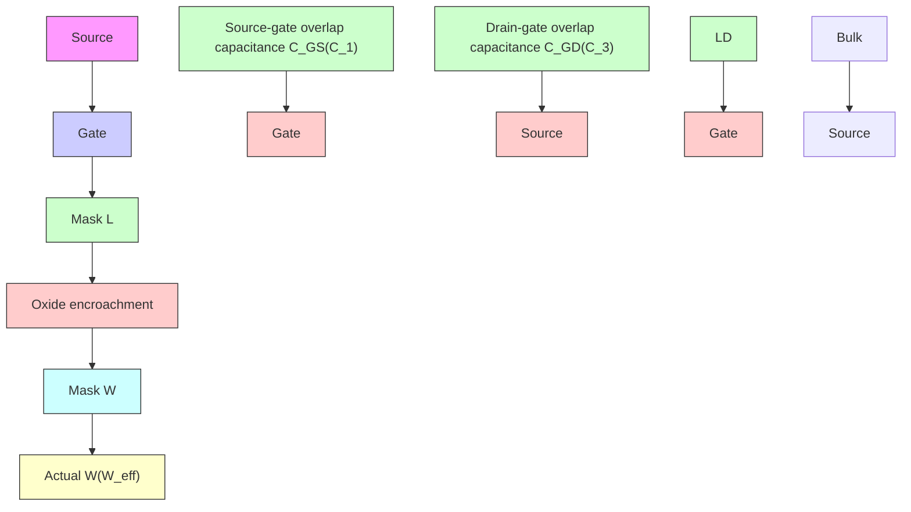

<!-- VIEWER-ONLY verbatim slice of CMOS_Analog_Circuit_Design_-_Allen_Holberg_mineru.md lines 3189-4872. NOT authoritative; all gold coordinates point at CMOS_Analog_Circuit_Design_-_Allen_Holberg_mineru.md. -->
# Chapter 3 CMOS Device Modeling

Before one can design a circuit to be integrated in CMOS technology, one must first have a model describing the behavior of all the components available for use in the design. A model can take the form of mathematical equations, circuit representations, or tables. Most of the modeling used in this text will focus on the active and passive devices discussed in the previous chapter as opposed to higher-level modeling such as macromodeling, or behavioral modeling.

It should be stressed at the outset that a model is just that and no more—it is not the real thing! In an ideal world, we would have a model that accurately describes the behavior of a device under all possible conditions. Realistically, we are happy to have a model that predicts simulated performance to within a few percent of measured performance. There is no clear agreement as to which model comes closest to meeting this “ideal” model [1]. This lack of agreement is illustrated by the fact that, at this writing, HSPICE [25] offers the user 43 different MOS transistor models from which to choose!

This text will concentrate only three of these models. The simplest model which is appropriate for hand calculations was described in Sec 2.3 and will be further developed here to include capacitance, noise, and ohmic resistance. In SPICE terminology, this simple model is called the LEVEL 1 model. Next, a small-signal model is derived from the LEVEL 1 large-signal model and is presented in Sec. 3.3.

A far more complex model, the SPICE LEVEL 3 model is presented in Sec. 3.4. This model includes many effects that are more evident in modern short-channel technologies as well as subthreshold conduction. It is adequate for device geometries down to about 0.8µm. Finally, the BSIM3v3 model is presented. This model is the closest to becoming a standard for computer simulation.

# Notation

SPICE was originally implemented in FORTRAN where all input was required to be uppercase ASCII characters. Lowercase, greek, and super/subscripting were not allowed. Modern SPICE implementations generally accept (but do not distinguish between) upperand lowercase but the tradition of using uppercase ASCII still lives on. This is particularly evident in the device model parameters. Since greek characters are not available, these were simply spelled out, e.g.,  entered as GAMMA. Super and subscripts were simply not used.

It is inconvenient to adopt the SPICE naming convention throughout the book because equations would appear unruly and would not be familiar to what is commonly seen in the literature. On the other hand, it is necessary to provide the correct notation where application to SPICE is intended. To address this dilemma, we have decided to use SPICE uppercase (non italic) notation for all model parameters except those applied to the simple model (SPICE LEVEL 1).

# 3.1 Simple MOS Large-Signal

All large-signal models will be developed for the n-channel MOS device with the positive polarities of voltages and currents shown in Fig. 3.1-1(a). The same models can be used for the p-channel MOS device if all voltages and currents are multiplied by −1 and the absolute value of the p-channel threshold is used. This is equivalent to using the voltages and currents defined by Fig. 3.1-1(b) which are all positive quantities. As mentioned in Chapter 1, lower-case variables with capital subscripts will be used for the variables of large-signal models and lower-case variables with lower-case subscripts will be used for the variables of small-signal models. When the voltage or current is a model parameter, such as threshold voltage, it will be designated by an upper-case variable and an upper-case subscript.


<details>
<summary>chemical</summary>

NPN bipolar junction transistor (BJT) standard symbol with gate, drain, source terminals and current/voltage annotations
</details>

(a)


<details>
<summary>chemical</summary>

MOSFET transistor symbol with labeled terminals and biasing voltages
</details>

(b)   
Figure 3.1-1 Positive sign convention for (a) n-channel, and (b) p-channel MOS transistor.

When the length and width of the MOS device is greater than about $1 0 \ \mu \mathrm m$ , the substrate doping is low, and when a simple model is desired, the model suggested by Sah [2] and used in SPICE by Shichman and Hodges [3] is very appropriate. This model was developed in Eq. (28) of Sec. 2.3 and given below.

$$
i _ {D} = \frac {\mu_ {o} C _ {o x} W}{L} \left[ \left(v _ {G S} - V _ {T}\right) - \left(\frac {v _ {D S}}{2}\right) \right] v _ {D S} \tag {1}
$$

The terminal voltages and currents have been defined in the previous chapter. The various parameters of (1) are defined as

$\mu _ { o } =$ surface mobility of the channel for the n-channel or p-channel device $( \mathrm { c m } ^ { 2 } / \mathrm { V } { \mathrm { - s } } )$

$C _ { o x } = \frac { \varepsilon _ { o x } } { t _ { o x } } =$ ox capacitance per unit area of the gate oxide (F/cm2) tox

W = effective channel width

L = effective channel length

The threshold voltage $V _ { T }$ is given by Eq. (19) of Sec. 2.3 for an n-channel transistor

$$
V _ {T} = V _ {T 0} + \gamma \left[ \sqrt {2 | \phi_ {F} | + v _ {S B}} - \sqrt {2 | \phi_ {F} |} \right] \tag {2}
$$

$$
V _ {T 0} = V _ {T} \left(v _ {S B} = 0\right) = V _ {F B} + 2 \left| \phi_ {F} \right| + \frac {\sqrt {2 q \varepsilon_ {s i} N _ {S U B} 2 \left| \phi_ {F} \right|}}{C _ {o x}} \tag {3}
$$

$$
\gamma = \text { bulk   threshold   parameter } \left(\mathrm{V} ^ {1 / 2}\right) = \frac {\sqrt {2 \varepsilon_ {s i} q N _ {S U B}}}{C _ {o x}} \tag {4}
$$

$$
\phi_ {F} = \text { strong   inversion   surface   potential   (V) } = - \frac {k T}{q} \ln \left(\frac {N _ {S U B}}{n _ {i}}\right) \tag {5}
$$

$$
V _ {F B} = \text { flatband   voltage   (V) } = \phi_ {M S} - \frac {Q _ {s s}}{C _ {o x}} \tag {6}
$$

$$
\phi_ {M S} = \phi_ {F} (\text { substrate }) - \phi_ {F} (\text { gate }) \quad [ \text { Eq.   (17)   of   Sec.   2.3 } ] \tag {7}
$$

$$
\phi_ {F} (\text { substrate }) = - \frac {k T}{q} \ln \left(\frac {N _ {S U B}}{n _ {i}}\right) [ \text { n - channel   with   p - substrate } ] \tag {8}
$$

$$
\phi_ {F} (\text { gate }) = \frac {k T}{q} \ln \left(\frac {N _ {\text { GATE }}}{n _ {i}}\right) [ \mathrm{n-channelwithn} ^ {+} \text { polysilicongate } ] \tag {9}
$$

$$
Q _ {s s} = \text { oxide   charge } = q N _ {s s} \tag {10}
$$

$$
k = \text { Boltzmann's   constant }
$$

$$
T = \text { temperature   (K) }
$$

$$
n _ {i} = \text { intrinsic   carrier   concentration }
$$

Table 3.1-1 gives some of the pertinent constants for silicon.   
Table 3.1-1 Constants for Silicon. 

<table><tr><td>Constant Symbol</td><td>Constant Description</td><td>Value</td><td>Units</td></tr><tr><td> $V_G$ </td><td>Silicon bandgap (27°C)</td><td>1.205</td><td>V</td></tr><tr><td>k</td><td>Boltzmann&#x27;s constant</td><td> $1.381 \times 10^{-23}$ </td><td>J/K</td></tr><tr><td> $n_i$ </td><td>Intrinsic carrier concentration (27°C)</td><td> $1.45 \times 10^{10}$ </td><td>cm-3</td></tr><tr><td> $ε_0$ </td><td>Permittivity of free space</td><td> $8.854 \times 10^{-14}$ </td><td>F/cm</td></tr><tr><td> $ε_{si}$ </td><td>Permittivity of silicon</td><td> $11.7 \, ε_0$ </td><td>F/cm</td></tr><tr><td> $ε_{ox}$ </td><td>Permittivity of SiO2</td><td> $3.9 \, ε_0$ </td><td>F/cm</td></tr></table>

A unique aspect of the MOS device is its dependence upon the voltage from the source to bulk as shown by Eq. (2). This dependence means that the MOS device must be treated as a four-terminal element. It will be shown later how this behavior can influence both the large- and small-signal performance of MOS circuits.

In the realm of circuit design, it is more desirable to express the model equations in terms of electrical rather than physical parameters. For this reason, the drain current is often expressed as

$$
i _ {D} = \beta \left[ \left(v _ {G S} - V _ {T}\right) - \frac {v _ {D S}}{2} \right] v _ {D S} \tag {11}
$$

or

$$
i _ {D} = K ^ {\prime} \frac {W}{L} \left[ \left(v _ {G S} - V _ {T}\right) - \frac {v _ {D S}}{2} \right] v _ {D S} \tag {12}
$$

where the transconductance parameter $\beta$ is given in terms of physical parameters as

$$
\beta = \left(K ^ {\prime}\right) \frac {W}{L} \cong \left(\mu_ {o} C _ {o x}\right) \frac {W}{L} \quad (\mathrm{A} / \mathrm{V} ^ {2}) \tag {13}
$$

When devices are characterized in the nonsaturation region with low gate and drain voltages the value for $K ^ { \prime }$ is approximately equal to $\mu _ { o } C _ { o x }$ in the simple model. This is not the case when devices are characterized with larger voltages introducing effects such as mobility degradation. For these latter cases, $K ^ { \prime }$ is usually smaller. Typical values for the model parameters of Eq. (12) are given in Table 3.1-2.

Table 3.1-2 Model Parameters for a Typical CMOS Bulk Process Suitable for Hand Calculations Using the Simple Model. These Values Are Based upon a 0.8 µm Silicon-Gate Bulk CMOS n-Well Process. 

<table><tr><td rowspan="2">Parameter Symbol</td><td rowspan="2">Parameter Description</td><td colspan="3">Typical Parameter Value</td></tr><tr><td>N-Channel</td><td>P-Channel</td><td>Units</td></tr><tr><td> $V_{T0}$ </td><td>Threshold Voltage (VBS=0)</td><td>0.7 ± 0.15</td><td>-0.7 ± 0.15</td><td>V</td></tr><tr><td> $K'$ </td><td>Transconductance Parameter (in saturation)</td><td>110.0 ± 10%</td><td>50.0 ± 10%</td><td> $\mu A/V^2$ </td></tr><tr><td> $\gamma$ </td><td>Bulk threshold parameter</td><td>0.4</td><td>0.57</td><td> $(V)^{1/2}$ </td></tr><tr><td> $\lambda$ </td><td>Channel length modulation parameter</td><td>0.04 (L=1 μm)0.01 (L=2 μm)</td><td>0.05 (L = 1 μm)0.01 (L = 2 μm)</td><td> $(V)^{-1}$ </td></tr><tr><td> $2|\phi_F|$ </td><td>Surface potential at strong inversion</td><td>0.7</td><td>0.8</td><td>V</td></tr></table>

There are various regions of operation of the MOS transistor based on the model of Eq. (1). These regions of operation depend upon the value of $\nu _ { G S } - V _ { T } . \mathrm { I f } \nu _ { G S } - V _ { T }$ is zero or negative, then the MOS device is in the cutoffi region and Eq. (1) becomes

$$
i _ {D} = 0, \quad v _ {G S} - V _ {T} \leq 0 \tag {14}
$$

In this region, the channel acts like an open circuit.

A plot of Eq. (1) with $\lambda = 0$ as a function of $\nu _ { D S }$ is shown in Fig. 3.1-2 for various values of $\nu _ { G S } - V _ { T }$ . At the maximum of these curves the MOS transistor is said to saturate. The value of $\nu _ { D S }$ at which this occurs is called the saturation voltage and is given as

$$
v _ {D S} (\mathrm{sat}) = v _ {G S} - V _ {T} \tag {15}
$$


<details>
<summary>line</summary>

| v_DS | i_D (Solid Line) | i_D (Dashed Line) |
|------|------------------|-------------------|
| 0    | 0                | 0                 |
| >v_DS | Increasing v_GS   | Decreasing v_GS   |
</details>

Figure 3.1-2 Graphical illustration of the modified Sah equation.

Thus, $\nu _ { D S } ( \mathrm { s a t } )$ defines the boundary between the remaining two regions of operation. If $\nu _ { D S }$ is less than $\nu _ { D S } ( \mathrm { s a t } )$ , then the MOS transistor is in the nonsaturated region and Eq. (1) becomes

$$
i _ {D} = (K ^ {\prime}) \frac {W}{L} \bigg [ (v _ {G S} - V _ {T}) - \frac {v _ {D S}}{2} \bigg ] v _ {D S}; 0 <   v _ {D S} \leq (v _ {G S} - V _ {T}) \tag {16}
$$

In Fig. 3.1-2, the nonsaturated region lies between the vertical axis $( \nu _ { D S } = 0 )$ and $\nu _ { D S } =$ $\nu _ { G S } - V _ { T }$ curve.

The third region occurs when $\nu _ { D S }$ is greater than $\nu _ { D S } ( \mathrm { s a t } )$ or $\nu _ { G S } - V _ { T } .$ . At this point the current $i _ { D }$ becomes independent of $\nu _ { D S }$ . Therefore, $\nu _ { D S }$ in Eq. (1) is replaced by $\nu _ { D S } ( \mathrm { s a t } )$ of Eq. (11) to get

$$
i _ {D} = K ^ {\prime} \frac {W}{2 L} (v _ {G S} - V _ {T}) ^ {2}, \quad 0 <   (v _ {G S} - V _ {T}) \leq v _ {D S} \tag {17}
$$

Equation (17) indicates that drain current remains constant once $\nu _ { D S }$ is greater than $\nu _ { G S } - V _ { T } .$ In reality, this is not true. As drain voltage increases, the channel length is reduced resulting in increased current. This phenomenon is called channel length modulation and is accounted for in the saturation model with the addition of the factor, $( 1 + \lambda \nu _ { D S } )$ where $\nu _ { D S }$ is the actual drain-source voltage and not $\nu _ { D S } ( \mathrm { s a t } )$ . The saturation region model modified to include channel-length modulation is given in Eq. (18)

$$
i _ {D} = K ^ {\prime} \frac {W}{2 L} (v _ {G S} - V _ {T}) ^ {2} (1 + \lambda v _ {D S}), \quad 0 <   (v _ {G S} - V _ {T}) \leq v _ {D S} \tag {18}
$$

The output characteristics of the MOS transistor can be developed from Eqs. (14), (16), and (18). Figure 3.1-3 shows these characteristics plotted on a normalized basis. These curves have been normalized to the upper curve where $V _ { G S 0 }$ is defined as the value of $\nu _ { G S }$ which causes a drain current of $I _ { D 0 }$ in the saturation region. The entire characteristic is developed by extending the solid curves of Fig. 3.1-2 horizontally to the right from the maximum points. The solid curves of Fig. 3.1-3 correspond to $\lambda = 0 .$ . If $\lambda \neq 0$ , then the curves are the dashed lines.


<details>
<summary>line</summary>

| Channel-length modulation effects | v_DS / (V_GSO - V_T) = 1.00 | v_DS / (V_GSO - V_T) = 0.867 | v_DS / (V_GSO - V_T) = 0.707 | v_DS / (V_GSO - V_T) = 0.50 | v_DS / (V_GSO - V_T) = 0.00 |
| --------------------------------- | ----------------------------- | ------------------------------ | ------------------------------ | ----------------------------- | ----------------------------- |
| i_D / I_D0                       | 1.0                           | 1.0                            | 1.0                            | 1.0                           | 1.0                           |
</details>

Figure 3.1-3 Output characteristics of the MOS device.

Another important characteristic of the MOS transistor can be obtained by plotting $i _ { D }$ versus $\nu _ { G S }$ using Eq. (18). Fig. 3.1-4 shows this result. This characteristic of the MOS transistor is called the transconductance characteristic. We note that the transconductance characteristic in the saturation region can be obtained from Fig. 3.1-3 by drawing a vertical line to the right of the parabolic dashed line and plotting values of $i _ { D }$ versus $\nu _ { G S } .$ Fig. 3.1-4 is also useful for illustrating the effect of the source-bulk voltage, vSB. As the value of $\nu _ { S B }$ increases, the value of $V _ { T }$ increases for the enhancement, n-channel devices (for a p-channel device, $| V _ { T } |$ increases as $\nu _ { B S }$ increases). $V _ { T }$ also increases positively for the n-channel depletion device, but since $V _ { T }$ is negative, the value of $V _ { T }$ approaches zero from the negative side. If $\nu _ { S B }$ is large enough, $V _ { T }$ will actually become positive and the depletion device becomes an enhancement device.


<details>
<summary>line</summary>

| v_GS | i_D (v_SB3 > v_SB2 > v_SB1 > 0) |
|------|----------------------------------|
| 0    | 0                                |
| >0   | >0                               |
</details>

Figure 3.1-4 Transconductance characteristic of the MOS transistor as a function of the bulk-source voltage, vSB.

Since the MOS transistor is a bidirectional device, determining which physical node is the drain and which the source may seem arbitrary. This is not really the case. For an nchannel transistor, the source is always at the lower potential of the two nodes. For the pchannel transistor, the source is always at the higher potential. It is obvious that the drain and source designations are not constrained to a given node of a transistor but can switch back and forth depending upon the terminal voltages applied to the transistor.

A circuit version of the large-signal model of the MOS transistor consists of a current source connected between the drain and source terminals, that depends on the drain, source, gate, and bulk terminal voltages defined by the simple model described in this section. This simple model has five electrical and process parameters that completely define it. These parameters are K', $V _ { T } , \gamma , \lambda$ , and $2 \phi _ { F }$ . The subscript n or p will be used when the parameter refers to an n-channel or p-channel device, respectively. They constitute the Level I model parameters of SPICE [23]. Typical values for these model parameters are given in Table 3.1-2.

The function of the large-signal model is to solve for the drain current given the terminal voltages of the MOS device. An example will help to illustrate this as well as show how the model is applied to the p-channel device.

# Example 3.1-1Application of the Simple MOS Large Signal Model

Assume that the transistors in Fig. 3.1-1 have a W/L ratio of 5 m/1 m and that the large signal model parameters are those given in Table 3.1-2. If the drain, gate, source, and bulk voltages of the n-channel transistor is 3 V, 2 V, 0 V, and 0 V, respectively, find the drain current. Repeat for the p-channel transistor if the drain, gate, source, and bulk voltages are −3 V, −2 V, 0 V, and 0 V, respectively.

We must first determine in which region the transistor is operating. Eq. (15) gives $\nu _ { D S } ( \mathrm { s a t } )$ as 2 V − 0.7 V = 1.3 V. Since $\nu _ { D S }$ is 3 V, the n-channel transistor is in the saturation region. Using Eq. (18) and the values from Table 3.1-2 we have

$$
i _ {D} = \frac {K _ {N} ^ {\prime} W}{2 L} (v _ {G S} - V _ {T N}) ^ {2} (1 + \lambda_ {N} v _ {D S})
$$

$$
= \frac {1 1 0 \times 1 0 ^ {- 6} (5 \mu \mathrm{m})}{2 (1 \mu \mathrm{m})} (2 - 0. 7) ^ {2} (1 + 0. 0 4 \times 3) = 5 2 0 \mu \mathrm{A}
$$

Evaluation of Eq. (15) for the p-channel transistor is given as

$$
v _ {S D} (\mathrm{sat}) = v _ {S G} - | V _ {T P} | = 2 \mathrm{V} - 0. 7 \mathrm{V} = 1. 3 \mathrm{V}
$$

Since vSD is 3 V, the p-channel transistor is also in the saturation region, Eq. (17) is applicable. The drain current of Fig. 3.1-1(b) can be found using the values from Table 3.1-2 as

$$
\begin{array}{l} i _ {D} = \frac {K _ {P} ^ {\prime} W}{2 L} (v _ {S G} - | V _ {T P} |) ^ {2} (1 + \lambda_ {P} v _ {S D}) \\ = \frac {5 0 \times 1 0 ^ {- 6} (5 \mu \mathrm{m})}{2 (1 \mu \mathrm{m})} (2 - 0. 7) ^ {2} (1 + 0. 0 5 \times 3) = 2 4 3 \mu \mathrm{A} \\ \end{array}
$$

It is often useful to describe $\nu _ { G S }$ in terms of $i _ { D }$ in saturation as shown below.

$$
v _ {G S} = V _ {T} + \sqrt {\frac {2 i _ {D}}{\beta}} \tag {19}
$$

This expressions illustrates that there are two components to $\nu _ { G S }$ —an amount to invert the channel plus an additional amount to support the desired drain current. This second component is often referred to in the literature as $V _ { O N }$ . Thus $V _ { O N }$ can be defined as

$$
V _ {O N} = \sqrt {\frac {2 i _ {D}}{\beta}} \tag {20}
$$

The term $V _ { O N }$ should be recognized as the term for saturation voltage $V _ { D S }$ (sat). They can be used interchangeably.

# 3.2 Other MOS Large-Signal Model Parameters

The large-signal model also includes several other characteristics such as the source/drain bulk junctions, source/drain ohmic resistances, various capacitors, and noise. The complete version of the large-signal model is given in Fig. 3.2-1.


<details>
<summary>chemical</summary>

Electrical circuit diagram with transistors, resistors, and diodes labeled with component names and current/voltage notations
</details>

Figure 3.2-1 Complete large-signal model for the MOS transistor.

The diodes of Fig. 3.2-1 represent the pn junctions between the source and substrate and the drain and substrate. For proper transistor operation, these diodes must always be reverse biased. Their purpose in the dc model is primarily to model leakage currents. These currents are expressed as

$$
i _ {B D} = I _ {S} \left[ \exp \left(\frac {q v _ {B D}}{k T}\right) - 1 \right] \tag {1}
$$

and

$$
i _ {B S} = I _ {S} \left[ \exp \left(\frac {q v _ {B S}}{k T}\right) - 1 \right] \tag {2}
$$

where $I _ { s }$ is the reverse saturation current of a pn junction, $q$ is the charge of an electron, k is Boltzmann’s constant, and T is temperature in Kelvin units.

The resistors $r _ { D }$ and $r _ { S }$ represent the ohmic resistance of the drain and source, respectively. Typically, these resistors may be 50 to 100 ohmsi and can often be ignored at low drain currents.

The capacitance of Fig. 3.2-1 can be separated into three types. The first type includes capacitors $C _ { B D }$ and $C _ { B S }$ which are associated with the back-biased depletion region between the drain and substrate and the source and substrate. The second type includes capacitors $C _ { G D } , C _ { G S } ,$ , and $C _ { G B }$ which are all common to the gate and are

<!-- MinerU pages 101-120 -->

dependent upon the operating condition of the transistor. The third type includes parasitic capacitors which are independent of the operating conditions.

The depletion capacitors are a function of the voltage across the pn junction. The expression of this junction-depletion capacitance is divided into two regions to account for the high injection effects. The first is given as

$$
C _ {B X} = (\mathrm{CJ}) (\mathrm{AX}) \left[ 1 - \frac {\nu_ {B X}}{\mathrm{PB}} \right] ^ {- \mathrm{MJ}}, \quad \nu_ {B X} \leq (\mathrm{FC}) (\mathrm{PB}) \tag {3}
$$

where

$$
X = D \mathrm{for} C _ {B D} \mathrm{or} X = S \mathrm{for} C _ {B S}
$$

$$
\mathrm{AX} = \text { area   of   the   source } (\mathrm{X} = \mathrm{S}) \text { or   drain } (\mathrm{X} = \mathrm{D})
$$

$$
\mathrm{CJ} = \text { zero - bias } (v _ {B X} = 0) \text { junction   capacitance(per   unit   area) }
$$

$$
\mathrm{CJ} \cong \sqrt {\frac {q \varepsilon_ {s i} N _ {S U B}}{2 \mathrm{PB}}}
$$

$$
\mathrm{PB} = \text { bulk   junction   potential   (same   as } \phi_ {o} \text { given   in   Eq.   (6),   sec.   2.2) }
$$

$$
\mathrm{FC} = \text { forward - bias   nonideal   junction - capacitance   coefficient } (\cong 0. 5)
$$

$$
\begin{array}{l} \text { MJ } = \text { bulk - junction   grading   coefficient(1 / 2   for   step   junctions   and1 / 3   for   graded } \\ \text { junctions) } \end{array}
$$

The second region is given as

$$
C _ {B X} = \frac {(\mathrm{CJ}) (\mathrm{AX})}{(1 - \mathrm{FC}) ^ {1 + \mathrm{MJ}}} \left[ 1 - (1 + \mathrm{MJ}) \mathrm{FC} + \mathrm{MJ} \frac {\nu_ {B X}}{\mathrm{PB}} \right], \quad \nu_ {B X} > (\mathrm{FC}) (\mathrm{PB}) \tag {4}
$$

Fig. 3.2-2 illustrates how the junction-depletion capacitances of Eqs. (3) and (4) are combined to model the large signal capacitances $\bar { C _ { B D } }$ and $C _ { B S } .$ . It is seen that Eq. (4) prevents $C _ { B X }$ from approaching infinity as $\nu _ { B X }$ approaches PB.


<details>
<summary>text_image</summary>

C_{BX}
C_{BX0}
Eq. (3)
0
(FC)(PB)
Eq. (4)
PB
v_{BX}
</details>

Figure 3.2-2 Example of the method of modeling the voltage dependence of the bulk junction capacitances.

A closer examination of the depletion capacitors in Fig. 3.2-3 shows that this capacitor is like a tub. It has a bottom with an area equal to the area of the drain or source. However, there are the sides that are also part of the depletion region. This area is called the sidewall. $A _ { B X }$ in Eqs. (3) and (4) should include both the bottom and sidewall assuming the zero-bias capacitances of the two regions are similar. To more closely model the depletion capacitance, break it into the bottom and sidewall components, given as follows.

$$
C _ {B X} = \frac {(\mathrm{CJ}) (\mathrm{AX})}{\left[ 1 - \left(\frac {\nu_ {B X}}{\mathrm{PB}}\right) \right] ^ {\mathrm{MJ}}} + \frac {(\mathrm{CJSW}) (\mathrm{PX})}{\left[ 1 - \left(\frac {\nu_ {B X}}{\mathrm{PB}}\right) \right] ^ {\mathrm{MJSW}}}, \nu_ {B X} \leq (\mathrm{FC}) (\mathrm{PB}) \tag {5}
$$

and

$$
\begin{array}{l} C _ {B X} = \frac {(\mathrm{CJ}) (\mathrm{AX})}{(1 - \mathrm{FC}) ^ {1 + \mathrm{MJ}}} \left[ 1 - (1 + \mathrm{MJ}) \mathrm{FC} + \mathrm{MJ} \frac {\nu_ {B X}}{\mathrm{PB}} \right] \\ + \frac {(\mathrm{CJSW}) (\mathrm{PX})}{(1 - \mathrm{FC}) ^ {1 + \mathrm{MJSW}}} \left[ 1 - (1 + \mathrm{MJSW}) \mathrm{FC} + \frac {\nu_ {B X}}{\mathrm{PB}} (\mathrm{MJSW}) \right], \\ \end{array}
$$

$$
v _ {B X} \geq (\mathrm{FC}) (\mathrm{PB}) \tag {6}
$$

where

AX = area of the source (X = S) or drain (X = D)

PX = perimeter of the source (X = S) or drain (X = D)

CJSW = zero-bias, bulk-source/drain sidewall capacitance

MJSW = bulk-source/drain sidewall grading coefficient


<details>
<summary>text_image</summary>

Polysilicon gate
H
G
D
C
Source
Drain
F
E
A
B
SiO₂
Bulk
Drain bottom = ABCD
Drain sidewall = ABFE + BCGF + DCGH + ADHE
</details>

Figure 3.2-3 Illustration showing the bottom and sidewall components of the bulk junction capacitors.

Table 3.2-1 gives the values for CJ, CJSW, MJ, and MJSW for an MOS device which has an oxide thickness of 140 $\mathring \mathrm { A }$ resulting in a $C _ { o x } = 2 4 . 7 \times 1 0 ^ { - 4 } ~ \mathrm { F } / \mathrm { m } ^ { 2 }$ . It can be seen that the depletion capacitors cannot be accurately modeled until the geometry of the device is known, e.g., the area and perimeter of the source and drain. However, values can be assumed for the purpose of design. For example, one could consider a typical source or drain to be 1.8 m by $5 \mu \mathrm { m }$ . Thus a value for $C _ { B X }$ of 2.9 fF and 6.9 fF results, for n-channel and p-channel devices respectively, for $V _ { B X } = 0$ .

The large-signal, charge-storage capacitors of the MOS device consist of the gate-tosource $( C _ { G S } )$ , gate-to-drain $( C _ { G D } )$ , and gate-to-bulk $( C _ { G B } )$ capacitances. Figure 3.2-4 shows a cross section of the various capacitances that constitute the charge-storage capacitors of the MOS device. $C _ { B S }$ and $\bar { C } _ { B D }$ are the source-to-bulk and drain-to-bulk capacitors discussed above. The following discussion represents a heuristic development of a model for the large-signal charge-storage capacitors.


<details>
<summary>text_image</summary>

SiO₂
Gate
Source Drain
C₁ C₂ C₃
C₄
C_BD
C_BS
Bulk
</details>

Figure 3.2-4 Large-signal, charge-storage capacitors of the MOS device.

Table 3.2-1 Capacitance Values and Coefficients for the MOS Model. 

<table><tr><td>Type</td><td>P-Channel</td><td>N-Channel</td><td>Units</td></tr><tr><td>CGSO</td><td> $220 \times 10^{-12}$ </td><td> $220 \times 10^{-12}$ </td><td>F/m</td></tr><tr><td>CGDO</td><td> $220 \times 10^{-12}$ </td><td> $220 \times 10^{-12}$ </td><td>F/m</td></tr><tr><td>CGBO</td><td> $700 \times 10^{-12}$ </td><td> $700 \times 10^{-12}$ </td><td>F/m</td></tr><tr><td>CJ</td><td> $560 \times 10^{-6}$ </td><td> $770 \times 10^{-6}$ </td><td> $F/m^2$ </td></tr><tr><td>CJSW</td><td> $350 \times 10^{-12}$ </td><td> $380 \times 10^{-12}$ </td><td>F/m</td></tr><tr><td>MJ</td><td>0.5</td><td>0.5</td><td></td></tr><tr><td>MJSW</td><td>0.35</td><td>0.38</td><td></td></tr></table>

Based on an oxide thickness of 140 $\mathring \mathrm { A }$ or $\mathrm { C o x } { = } 2 4 . 7 \times 1 0 ^ { - 4 } \ \mathrm { F } / \mathrm { m } ^ { 2 }$ .

$C _ { 1 }$ and $C _ { 3 }$ are overlap capacitances and are due to an overlap of two conducting surfaces separated by a dielectric. The overlapping capacitors are shown in more detail in Fig. 3.2-5. The amount of overlap is designated as LD. This overlap is due to the lateral diffusion of the source and drain underneath the polysilicon gate. For example, a 0.8 m CMOS process might have a lateral diffusion component, LD, of approximately 16 nm. The overlap capacitances can be approximated as

$$
C _ {1} = C _ {3} \cong (\mathrm{LD}) (W _ {\text {eff}}) C _ {o x} = (\mathrm{CGXO}) W _ {\text {eff}} \tag {7}
$$

where $W _ { \mathrm { e f f } }$ is the effective channel width and CGXO (X = S or D) is the overlap capacitance in F/m for the gate-source or gate-drain overlap. The difference between the mask W and actual W is due to the encroachment of the field oxide under the silicon nitride. Table 3.2-1 gives a value for CGSO and CGDO based on a device with an oxide thickness of 140 Å. A third overlap capacitance that can be significant is the overlap between the gate and the bulk. Fig. 3.2-6 shows this overlap capacitor $( C _ { 5 } )$ in more detail. This is the capacitance that occurs between the gate and bulk at the edges of the channel and is a function of the effective length of the channel, $L _ { \mathrm { e f f } } .$ Table 3.2-1 gives a typical value for CGBO for a device based on an oxide thickness of 140 Å.


<details>
<summary>flowchart</summary>


</details>

Figure 3.2-5 Overlap capacitances of an MOS transistor. (a) Top view showing the overlap between the source or drain and the gate. (b) Side view.

The channel of Fig. 3.2-4 is shown for the saturated state and would extend completely to the drain if the MOS device were in the nonsaturated state. $C _ { 2 }$ is the gateto-channel capacitance and is given as

$$
C _ {2} = W _ {\text { eff }} (L - 2 \mathrm{LD}) C _ {o x} = W _ {\text { eff }} (L _ {\text { eff }}) C _ {o x} \tag {8}
$$

The term $L _ { \mathrm { e f f } }$ is the effective channel length resulting from the mask-defined length being reduced by the amount of lateral diffusion (note that up until now, the symbols L and W were used to refer to “effective” dimensions whereas now these have been changed for added clarification). $C _ { 4 }$ is the channel-to-bulk capacitance which is a depletion capacitance that will vary with voltage like $C _ { B S }$ or $C _ { B D } .$

It is of interest to examine $C _ { G B } , C _ { G S } ,$ and $C _ { G D }$ as $\nu _ { D S }$ is held constant and $\nu _ { G S }$ is increased from zero. To understand the results, one can imagine following a vertical line on Fig. 3.1-3 at say, $\nu _ { D S } = 0 . 5 ( V _ { G S 0 } - V _ { T } )$ , as $\nu _ { G S }$ increases from zero. The MOS device will first be off until $\nu _ { G S }$ reaches $V _ { T }$ Next, it will be in the saturated region until $\nu _ { G S }$ becomes equal to $\nu _ { D S } ( \mathrm { s a t } ) + V _ { T }$ . Finally, the MOS device will be in the nonsaturated region. The approximate variation of $C _ { G B } , C _ { G S } ,$ and $C _ { G D }$ under these conditions is shown in Fig. 3.2-7. In cutoff, there is no channel and $C _ { G B }$ is approximately equal to $C _ { 2 } + 2 C _ { 5 }$ . As $\nu _ { G S }$ approaches $V _ { T }$ from the off region, a thin depletion layer is formed, creating a large value of $C _ { 4 }$ . Since $C _ { 4 }$ is in series with $C _ { 2 }$ , little effect is observed. As $\nu _ { G S }$ increases, this depletion region widens, causing $C _ { 4 }$ to decrease and reducing $C _ { G B }$ . When $\nu _ { G S } = V _ { T }$ an inversion layer is formed which prevents further decreases of $C _ { 4 }$ (and thus $C _ { G B } )$ .


<details>
<summary>text_image</summary>

Overlap
Overlap
C5 Gate C5
FOX Source/Drain FOX
Bulk
</details>

Figure 3.2-6 Gate-bulk overlap capacitances.

$C _ { 1 } , C _ { 2 } ,$ and $C _ { 3 }$ constitute $C _ { G S }$ and $C _ { G D } .$ . The problem is how to allocate $C _ { 2 }$ to $C _ { G S }$ and $C _ { G D }$ . The approach used is to assume in saturation that approximately $2 \bar { / 3 }$ of $\bar { C _ { 2 } }$ belongs to $C _ { G S }$ and none to $C _ { G D }$ . This is, of course, an approximation. However, it has been found to give reasonably good results. Fig. 3.2-7 shows how $C _ { G S }$ and $C _ { G D }$ change values in going from the off to the saturation region. Finally, when $\nu _ { G S }$ is greater than $\nu _ { D S } + \ V _ { T } ,$ the MOS device enters the nonsaturated region. In this case, the channel extends from the drain to the source and $C _ { 2 }$ is simply divided evenly between $C _ { G D }$ and $C _ { G S }$ as shown in Fig. 3.2-7.


<details>
<summary>line</summary>

| Voltage Stage | Capacitance Level |
| ------------- | ----------------- |
| Off           | C₂ + 2C₅          |
| V_T           | C₁, C₃            |
| Saturation    | C_GD              |
| Non-Saturation | C_GS, C_GD        |
| v_DS = constant | C_GS              |
| v_BS = 0       | C_GS, C_GD        |
| v_DS + V_T    | C_GD              |
| v_DS + V_T    | C_GB              |
| v_DS + V_T    | 2C₅               |
</details>

Figure 3.2-7 Voltage dependence of ${ \cal C } _ { G S } , { \cal C } _ { G D } ,$ and $C _ { G B }$ as a function of $V _ { G S }$ with $V _ { D S }$ constang and $V _ { B S } = 0 .$

As a consequence of the above considerations, we shall use the following formulas for the charge-storage capacitances of the MOS device in the indicated regions.

Off

$$
C _ {G B} = C _ {2} + 2 C _ {5} = C _ {o x} \left(W _ {\text {eff}}\right) \left(L _ {\text {eff}}\right) + 2 \mathrm{CGBO} \left(L _ {\text {eff}}\right) \tag {9a}
$$

$$
C _ {G S} = C _ {1} \cong C _ {o x} (\mathrm{LD}) (W _ {\text {eff}}) = \mathrm{CGSO} (W _ {\text {eff}}) \tag {9b}
$$

$$
C _ {G D} = C _ {3} \cong C _ {o x} (\mathrm{LD}) (W _ {\text {eff}}) = \mathrm{CGDO} (W _ {\text {eff}}) \tag {9c}
$$

Saturation

$$
C _ {G B} = 2 C _ {5} = \text { CGBO } (L _ {\text { eff }}) \tag {10a}
$$

$$
C _ {G S} = C _ {1} + (2 / 3) C _ {2} = C _ {o x} (\mathrm{LD} + 0. 6 7 L _ {\mathrm{eff}}) (W _ {\mathrm{eff}})
$$

$$
= \operatorname{CGSO} (W _ {\text { eff }}) + 0. 6 7 C _ {o x} (W _ {\text { eff }}) (L _ {\text { eff }}) \tag {10b}
$$

$$
C _ {G D} = C _ {3} \cong C _ {o x} (\mathrm{LD}) (W _ {\text {eff}}) = \mathrm{CGDO} (W _ {\text {eff}}) \tag {10c}
$$

Nonsaturated

$$
C _ {G B} = 2 C _ {5} = \text { CGBO } (L _ {\text { eff }}) \tag {11a}
$$

$$
C _ {G S} = C _ {1} + 0. 5 C _ {2} = C _ {o x} (\mathrm{LD} + 0. 5 L _ {\mathrm{eff}}) (W _ {\mathrm{eff}})
$$

$$
= (\mathrm{CGSO} + 0. 5 C _ {o x} L _ {\text { eff }}) W _ {\text { eff }} \tag {11b}
$$

$$
C _ {G D} = C _ {3} + 0. 5 C _ {2} = C _ {o x} (\mathrm{LD} + 0. 5 L _ {\mathrm{eff}}) (W _ {\mathrm{eff}})
$$

$$
= (\mathrm{CGDO} + 0. 5 C _ {o x} L _ {\text { eff }}) W _ {\text { eff }} \tag {11c}
$$

Equations which provide a smooth transition between the three regions can be found in the literature [5].

Other capacitor parasitics associated with transistors are due to interconnect to the transistor, e.g., polysilicon over field (substrate). This type of capacitance typically constitutes the major portion of $C _ { G B }$ in the nonsaturated and saturated regions, thus are very important and should be considered in the design of CMOS circuits.

Another important aspect of modeling the CMOS device is noise. The existence of noise is due to the fact that electrical charge is not continuous but is carried in discrete amounts equal to the charge of an electron. In electronic circuits, noise manifests itself by representing a lower limit below which electrical signals cannot be amplified without significant deterioration in the quality of the signal. Noise can be modeled by a current source connected in parallel with $i _ { D }$ of Fig. 3.2-1. This current source represents two sources of noise, called thermal noise and flicker noise [6,7]. These sources of noise were discussed in Sec. 2.5. The mean-square current-noise source is defined as

$$
\overline {{i}} _ {N} ^ {2} = \left[ \frac {8 k T g _ {m} (1 + \eta)}{3} + \frac {(K F) I _ {D}}{f C _ {o x} L ^ {2}} \right] \Delta f \tag {12}
$$

where

$\Delta f = \mathbf { a }$ small bandwidth (typically 1 Hz) at a frequency f

$$
\eta = g _ {m b s} / g _ {m} (\text { see   Eq.   (8)   of   Section   3.3 })
$$

k = Boltzmann’s constant

$$
T = \text { temperature   (K) }
$$

$$
g _ {m} = \text { small - signal   transconductance   from   gate   to   channel   (see   Eq. } (6)
$$

of Section 3.3)

$$
\mathrm{KF} = \text { flicker - noise   coefficient } (\mathrm{F} \cdot \mathrm{A})
$$

$$
f = \text { frequency   (Hz) }
$$

KF has a typical value of $1 0 ^ { - 2 8 } \left( \mathbf { F \cdot A } \right)$ . Both sources of noise are process dependent and the values are usually different for enhancement and depletion mode FETs.

The mean-square current noise can be reflected to the gate of the MOS device by dividing Eq. (12) ${ \mathrm { \bar { ~ } b y } } g _ { m } { } ^ { 2 } ,$ , giving

$$
\overline {{v}} _ {N} ^ {2} = \frac {\overline {{i}} _ {N} ^ {2}}{g _ {m} ^ {2}} = \left[ \frac {8 k T (1 + \eta)}{3 g _ {m}} + \frac {\mathrm{KF}}{2 f C _ {o x} W L K ^ {\prime}} \right] \Delta f \tag {13}
$$

The equivalent input-mean-square voltage-noise form of Eq. (13) will be useful for analyzing the noise performance of CMOS circuits in later chapters.

The experimental noise characteristics of n-channel and p-channel devices are shown in Figures 3.2-8(a) and 3.2-8(b). These devices were fabricated using a sub-micron, silicon-gate, n-well, CMOS process. The data in Figs. 3.2-8(a) and 3.2-8(b) are typical for MOS devices and show that the 1/f noise is the dominant source of noise for frequencies below 100 kHz (at the given bias conditions)i . Consequently, in many practical cases, the equivalent input-mean-square voltage noise of Eq. (13) is simplified to

$$
\overline {{v}} _ {e q} ^ {2} = \left[ \frac {\mathrm{KF}}{2 f C _ {o x} W L K ^ {\prime}} \right] \Delta f \tag {14}
$$

or in terms of the input-voltage-noise spectral density we can rewrite Eq. (14) as

$$
\overline {{e}} _ {e q} ^ {2} = \frac {\overline {{v}} _ {e q} ^ {2}}{\Delta f} = \frac {\mathrm{KF}}{2 f C _ {o x} W L K ^ {\prime}} = \frac {B}{f W L} \tag {15}
$$

where B is a constant for a n-channel or p-channel device of a given process. The righthand expression of Eq. (15) will be important in optimizing the design with respect to noise performance.


<details>
<summary>line</summary>

| Frequency (Hz) | i²_N (A²/Hz) |
| -------------- | ------------ |
| 1              | 1e-16        |
| 10             | 1e-17        |
| 100            | 1e-18        |
| 1K             | 1e-19        |
| 10K            | 1e-20        |
| 100K           | 1e-21        |
| 1Meg           | 1e-22        |
</details>


<details>
<summary>line</summary>

| Frequency (Hz) | i²_N (A²/Hz) |
| -------------- | ------------ |
| 1              | 1e-16        |
| 10             | 1e-18        |
| 100            | 1e-20        |
| 1K             | 1e-22        |
| 10K            | 1e-24        |
| 100K           | 1e-24        |
| 1Meg           | 1e-24        |
</details>

(b)   
Figure 3.2-8 Drain-current noise for a (a) n-channel and (b) p-channel MOSFET measured on a silicon-gate submicron process.

# 3.3 Small-Signal Model for the MOS Transistor

Up to this point, we have been considering the large-signal model of the MOS transistor shown in Fig. 3.2-1. However, after the large-signal model has been used to find the dc conditions, the small-signal model becomes important. The small-signal model is a linear model which helps to simplify calculations. It is only valid over voltage or current regions where the large-signal voltage and currents can be adequately represented by a straight line.

Fig. 3.3-1 shows a linearized small-signal model for the MOS transistor. The parameters of the small-signal model will be designated by lower case subscripts. The various parameters of this small-signal model are all related to the large-signal model parameters and dc variables. The normal relationship between these two models assumes that the small-signal parameters are defined in terms of the ratio of small perturbations of the large-signal variables or as the partial differentiation of one large-signal variable with respect to another.

The conductances $g _ { b d }$ and $g _ { b s }$ are the equivalent conductances of the bulk-to-drain and bulk-to-source junctions. Since these junctions are normally reverse biased, the conductances are very small. They are defined as

$$
g _ {b d} = \frac {\partial I _ {B D}}{\partial V _ {B D}} (\text { at   the   quiescent   point }) \cong 0 \tag {1}
$$

and

$$
g _ {b s} = \frac {\partial I _ {B S}}{\partial V _ {B S}} (\text { at   the   quiescent   point }) \cong 0 \tag {2}
$$

The channel conductances, $g _ { m } , g _ { m b s } ,$ and $g _ { d s }$ are defined as

$$
g _ {m} = \frac {\partial I _ {D}}{\partial V _ {G S}} (\text { at   the   quiescent   point }) \tag {3}
$$

$$
g _ {m b s} = \frac {\partial I _ {D}}{\partial V _ {B S}} (\text { at   the   quiescent   point }) \tag {4}
$$

and

$$
g _ {d s} = \frac {\partial I _ {D}}{\partial V _ {D S}} (\text { at   the   quiescent   point }) \tag {5}
$$


<details>
<summary>text_image</summary>

D
r_D
C_bd
i_nrD
G
C_gd
g_m v_gs
g_mbs v_bs
g_ds
i_nD
B
C_gs
g_bd
g_bs
i_nrS
C_bs
C_gb
r_S
S
</details>

Figure 3.3-1 Small-signal model of the MOS transistor.

The values of these small signal parameters depend on which region the quiescent point occurs in. For example, in the saturated region $g _ { m }$ can be found from Eq. (13) of Section 3.1 as

$$
g _ {m} = \sqrt {(2 K ^ {\prime} W / L) | I _ {D} | (1 + \lambda V _ {D S})} \cong \sqrt {(2 K ^ {\prime} W / L) | I _ {D} |} \tag {6}
$$

which emphasizes the dependence of the small-signal parameters upon the large-signal operating conditions. The small-signal channel transconductance due to $\nu _ { S B }$ is found by rewriting Eq. (4) as

$$
g _ {m b s} = \frac {- \partial I _ {D}}{\partial V _ {S B}} = - \left(\frac {\partial I _ {D}}{\partial V _ {T}}\right) \left(\frac {\partial V _ {T}}{\partial V _ {S B}}\right) \tag {7}
$$

Using Eq. (2) of Section 3.1 and noting that $\frac { \partial I _ { D } } { \partial V _ { T } } { = } \frac { - \partial I _ { D } } { \partial V _ { G S } }$ ∂ID , we get ∂VGS

$$
g _ {m b s} = g _ {m} \frac {\gamma}{2 (2 | \phi_ {F} | + V _ {S B}) ^ {1 / 2}} = \eta g _ {m} \tag {8}
$$

This transconductance will become important in our small-signal analysis of the MOS transistor when the ac value of the source-bulk potential $\nu _ { s b }$ is not zero.

The small-signal channel conductance, $g _ { d s } \left( g _ { o } \right)$ , is given as

$$
g _ {d s} = g _ {o} = \frac {I _ {D} \lambda}{1 + \lambda V _ {D S}} \cong I _ {D} \lambda \tag {9}
$$

The channel conductance will be dependent upon L through  which is inversely proportional to L. We have assumed the MOS transistor is in saturation for the results given by Eqs. (6), (8), and (9).

The important dependence of the small-signal parameters upon the large-signal model parameters and dc voltages and currents is illustrated in Table 3.3-1. In this Table we see that the three small-signal model parameters of $g _ { m } , g _ { m b s } ,$ , and $g _ { d s }$ have several alternate forms. An example of the typical values of the small-signal model parameters follows.

# Example 3.3-1 Typical Values of Small Signal Model Parameters

Find the values of $g _ { m } , g _ { m b s } ,$ and $g _ { d s }$ using the large signal model parameters in Table 3.1-2 for both an n-channel and p-channel device if the dc value of the magnitude of the drain current is 50 A and the magnitude of the dc value of the source-bulk voltage is 2 V. Assume that the W/L ratio is 1 m/1 m.

Using the values of Table 3.1-2 and Eqs. (6), (8), and (9) gives $g _ { m } = 1 0 5 \mu \mathrm { A } / \mathrm { V } , g _ { m b s }$ $= 1 2 . 8 \mu \mathrm { { A } } / \mathrm { { V } }$ , and $g _ { d s } \cong 2 . 0 ~ \mu \mathrm { A } / \mathrm { V }$ for the n-channel device and $g _ { m } = 7 0 . 7 ~ \mu \mathrm { A } / \mathrm { V } , g _ { m b s } =$ $1 2 . 0 \mu \mathrm { { A } / V }$ , and $g _ { d s } \cong 2 . 5 \mu \mathrm { A } / \mathrm { V }$ for the p-channel device.

Table 3.3-1 Relationships of the Small Signal Model Parameters upon the DC Values of Voltage and Current in the Saturation Region. 

<table><tr><td>Small Signal Model Parameters</td><td>DC Current</td><td>DC Current and Voltage</td><td>DC Voltage</td></tr><tr><td> $g_m$ </td><td> $\cong (2K' I_D W/L)^{1/2}$ </td><td>—</td><td> $\cong \frac{K' W}{L}(V_{GS} - V_T)$ </td></tr><tr><td> $g_{mbs}$ </td><td>—</td><td> $\frac{\gamma(2I_D\beta)^{1/2}}{2(2|\phi_F| + V_{SB})^{1/2}}$ </td><td> $\frac{\gamma[\beta(V_{GS}-V_T)]^{1/2}}{2(2|\phi_F| + V_{SB})^{1/2}}$ </td></tr><tr><td> $g_{ds}$ </td><td> $\cong \lambda I_D$ </td><td>—</td><td>—</td></tr></table>

Although the MOS devices are not often used in the nonsaturation region in analog circuit design, the relationships of the small-signal model parameters in the nonsaturation region are given as

$$
g _ {m} = \frac {\partial I _ {d}}{\partial V _ {G S}} = \beta V _ {D S} (1 + \lambda V _ {D S}) \cong \beta V _ {D S} \tag {10}
$$

$$
\mathrm{g} _ {\mathrm{mbs}} = \frac {\partial I _ {D}}{\partial V _ {B S}} = \frac {\beta \gamma V _ {D S}}{2 (2 | \phi_ {F} | + \mathrm{V} _ {S B}) ^ {1 / 2}} \tag {11}
$$

and

$$
g _ {d s} = \beta (V _ {G S} - V _ {T} - V _ {D S}) (1 + \lambda V _ {D S}) + \frac {I _ {D} \lambda}{1 + \lambda V _ {D S}}
$$

$$
\cong \beta (V _ {G S} - V _ {T} - V _ {D S}) \tag {12}
$$

Table 3.3-2 summarizes the dependence of the small-signal model parameters on the large-signal model parameters and dc voltages and currents for the nonsaturated region. The typical values of the small-signal model parameters for the nonsaturated region are illustrated in the following example.

Table 3.3-2 Relationships of the Small-Signal Model Parameters upon the DC Values of Voltage and Current in the Nonsaturation Region. 

<table><tr><td>Small Signal Model Parameters</td><td>DC Voltage and/or Current Dependence</td></tr><tr><td>gm</td><td> $\cong \beta V_{DS}$ </td></tr><tr><td>gmbs</td><td> $\frac{\beta \gamma V_{DS}}{2(2|\phi_F| + V_{SB})^{1/2}}$ </td></tr><tr><td>gds</td><td> $\cong \beta (V_{GS} - V_T - V_{DS})$ </td></tr></table>

Example 3.3-2 Typical Values of the Small-Signal Model Parameters in the Nonsaturated Region

Find the values of the small-signal model parameters in the nonsaturation region for an n-channel and p-channel transistor if $V _ { G S } = 5 \mathrm { ~ V } , V _ { D S } = 1 \mathrm { ~ V } ,$ and $| V _ { B S } | = 2 \mathrm { V } .$ . Assume that the W/L ratios of both transistors is 1 m/1 m. Also assume that the value for K’ in the nonsaturation region is that same as that for the saturation (generally a poor assumption).

First it is necessary to calculate the threshold voltage of each transistor using Eq. (2) of Sec. 3.1. The results are a $V _ { T }$ of 1.02 V for the n-channel and −1.14 V for the pchannel. This gives a dc current of 383 $\mu \mathrm { A }$ and 168 $\mu \mathrm { A }$ , respectively. Using Eqs. (10), (11), and (12), we get $g _ { m } = 1 1 0 ~ \mu \mathrm { A } / \mathrm { V } , g _ { m b s } = 4 6 . 6 ~ \mu \mathrm { A } / \mathrm { V }$ , and $r _ { d s } = 3 . 0 5$ KΩ for the nchannel transistor and $g _ { m } = 5 0 ~ \mu \mathrm { A } / \mathrm { V } , ~ g _ { m b s } = 2 8 . 6 ~ \mu \mathrm { A } / \mathrm { V }$ , and $r _ { d s } = 6 . 9 9 ~ \mathrm { K } \Omega$ for the pchannel transistor.

The values of $r _ { d }$ and $r _ { s }$ are assumed to be the same as $r _ { D }$ and $r _ { S }$ of Fig. 3.2-1. Likewise, for small-signal conditions $C _ { g s } , C _ { g d } , C _ { g b } , C _ { b d } ,$ and $C _ { b s }$ are assumed to be the same as $C _ { G S } , C _ { G D } , C _ { G B } , C _ { B D } ,$ and $C _ { B S } ,$ respectively.

If the noise of the MOS transistor is to be modeled, then three additional current sources are added to Fig. 3.3-1 as indicated by the dashed lines. The values of the meansquare noise-current sources are given as

$$
\overline {{i}} _ {n r D} ^ {2} = \left(\frac {4 k T}{r _ {D}}\right) \Delta f \quad (\mathrm{A} ^ {2}) \tag {13}
$$

$$
\overline {{i}} _ {n r S} ^ {2} = \left(\frac {4 k T}{r _ {S}}\right) \Delta f \quad (\mathrm{A} ^ {2}) \tag {14}
$$

and

$$
\overline {{i}} _ {n D} ^ {2} = \left[ \frac {8 k T g _ {m} (1 + \eta)}{3} + \frac {(\mathrm{KF}) I _ {D}}{f C _ {o x} L ^ {2}} \right] \Delta f (\mathrm{A} ^ {2}) \tag {15}
$$

The various parameters for these equations have been previously defined. With the noise modeling capability, the small-signal model of Fig. 3.3-1 is a very general model.

It will be important to be familiar with the small-signal model for the saturation region developed in this section. This model, along with the circuit simplification techniques given in Appendix A, will be the key element in analyzing the circuits in the following chapters.

# 3.4 Computer Simulation Models

The large-signal model of the MOS device previously discussed is simple to use for hand calculations but neglects many important second-order effects. While a simple model for hand calcualtion and design intuition is critical, a more accurate model is required for computer simulation. There are many model choices available for the designer when choosing a device model to use for computer simulation. At one time, HSPICEi supported 43 different mosfet models [25] (many of which were company proprietary) while SmartSpice publishes support for 14 [24]. Which model is the right one to use? In the fabless semiconductor environment, the user must use the model provided by the wafer foundry. In companies where the foundry is captive (i.e., the company owns their own wafer fabrication facility) a modeling group provides the model to circuit designers. It is seldom that the designer takes it upon himself to choose a model and perform parameter extraction to get the terms for the model chosen.

The SPICE Level 3 dc model will be covered in some detail because it is a relatively straightforward extension of the Level 2 model. The BSIM3v3 model will be introduced but the detailed equations will not be presented because of the volume of equations required to describe it—there are other good texts that deal with the subject of modeling exclusively [ 28,29], and there is little additional design intuition derived from covering the details.

Models developed for computer simulation have improved over the years but no model has yet been developed that, with a single set of parameters, covers device operation for all possible geometries. Therefore, many SPICE simulators offer a feature called “model binning.” Parameters are derived for transistors of different geometry (Ws and Ls) and the simulator determines which set of parameters to use based upon the particular W and L called out in the device instantiation line in the circuit description. The circuit designer need only be aware of this since the binning is done by the model provider.

# SPICE Level 3 Model

The large-signal model of the MOS device previously discussed is simple to use for hand calculations but neglects many important second-order effects. Most of these second-order effects are due to narrow or short channel dimensions (less than about 3 m). In this section, we will consider a more complex model that is suitable for computer-based analysis (circuit simulation, i.e., SPICE simulation). In particular, the SPICE Level 3 model will be covered. This model is typically good for MOS technologies down to about 0.8 m. We will also consider the effects of temperature upon the parameters of the MOS large signal model.

We first consider second-order effects due to small geometries. When $\nu _ { G S }$ is greater than $V _ { T } ,$ the drain current for a small device can be given as [25]

# Drain Current

$$
i _ {D S} = \text { BETA } \left[ v _ {G S} - V _ {T} - \left(\frac {1 + f _ {b}}{2}\right) v _ {D E} \right] \cdot v _ {D E} \tag {1}
$$

$$
\mathrm{BETA} = \mathrm{KP} \frac {W _ {\text {eff}}}{L _ {\text {eff}}} = \mu_ {\text {eff}} \mathrm{COX} \frac {W _ {\text {eff}}}{L _ {\text {eff}}} \tag {2}
$$

$$
L _ {\text { eff }} = L - 2 (\mathrm{LD}) \tag {3}
$$

$$
W _ {\text { eff }} = W - 2 (\mathrm{WD}) \tag {4}
$$

$$
v _ {D E} = \min (v _ {D S}, v _ {D S} (\text { sat })) \tag {5}
$$

$$
f _ {b} = f _ {n} + \frac {\text {GAMMA} \cdot f _ {s}}{4 (\mathrm{PHI} + v _ {S B}) ^ {1 / 2}} \tag {6}
$$

Note that PHI is the SPICE model term for the quantity $2 \phi _ { f }$ . Also be aware that PHI is always positive in SPICE regardless of the transistor type (p- or n-channel). In this text, the term, PHI, will always be positive while the term, $2 \phi _ { f }$ , will have a polarity determined by the transistor type as shown in Table 2.3-1.

$$
f _ {n} = \frac {\text { DELTA }}{W _ {\text { eff }}} \frac {\pi \varepsilon_ {\mathrm{si}}}{2 \cdot \mathrm{COX}} \tag {7}
$$

$$
f _ {s} = 1 - \frac {x _ {j}}{L _ {\text {eff}}} \left\{\frac {\mathrm{LD} + w c}{x _ {j}} \left[ 1 - \left(\frac {w p}{x _ {j} + w p}\right) ^ {2} \right] ^ {1 / 2} - \frac {\mathrm{LD}}{x _ {j}} \right\} \tag {8}
$$

$$
w p = x d \left(\mathrm{PHI} + v _ {S B}\right) ^ {1 / 2} \tag {9}
$$

$$
x d = \left(\frac {2 \cdot \varepsilon_ {s i}}{q \cdot \mathrm{NSUB}}\right) ^ {1 / 2} \tag {10}
$$

$$
w c = x _ {j} \left[ k _ {1} + k _ {2} \left(\frac {w p}{x _ {j}}\right) - k _ {3} \left(\frac {w p}{x _ {j}}\right) ^ {2} \right] \tag {11}
$$

$$
k _ {1} = 0. 0 6 3 1 3 5 3, k _ {2} = 0. 0 8 0 1 3 2 9 2, k _ {3} = 0. 0 1 1 1 0 7 7 7
$$

# Threshold V oltage

$$
V _ {T} = V _ {b i} - \left(\frac {\mathrm{ETA} \cdot 8 . 1 5 ^ {- 2 2}}{C _ {\mathrm{ox}} L _ {\mathrm{eff}} ^ {3}}\right) v _ {D S} + \text {GAMMA} \cdot f _ {s} (\text {PHI} + v _ {S B}) ^ {1 / 2} + f _ {n} (\text {PHI} + v _ {S B}) \tag {12}
$$

$$
v _ {b i} = \mathrm{v} _ {f b} + \mathrm{PHI} \tag {13}
$$

or

$$
v _ {b i} = \mathrm{VTO} - \text {GAMMA} \cdot \sqrt {\mathrm{PHI}} \tag {14}
$$

# Saturation Voltage

$$
v _ {s a t} = \frac {v _ {g s} - V _ {T}}{1 + f _ {b}} \tag {15}
$$

$$
v _ {D S} (\text { sat }) = v _ {s a t} + v _ {C} - \left(v _ {\text { sat }} ^ {2} + v _ {C} ^ {2}\right) ^ {1 / 2} \tag {16}
$$

$$
v _ {C} = \frac {\mathrm{VMAX} \cdot L _ {\mathrm{eff}}}{\mu_ {\mathrm{s}}} \tag {17}
$$

If VMAX is not given, then vDS(sat) = vsat $\nu _ { D S } ( \mathrm { s a t } ) = \nu _ { s a t }$

# Effective Mobility

$$
\mu_ {s} = \frac {\mathrm{U0}}{1 + \text { THETA } (v _ {G S} - V _ {T})} \text {   when   VMAX   } = 0 \tag {18}
$$

$$
\mu_ {\text { eff }} = \frac {\mu_ {s}}{1 + \frac {v _ {D E}}{v _ {C}}} \text {   when   VMAX   } > 0; \text {   otherwise   } \mu_ {\text { eff }} = \mu_ {s} \tag {19}
$$

# Channel-Length Modulation

When VMAX = 0

$$
\Delta L = x d \left[ \text { KAPPA } (v _ {D S} - v _ {D S} (\text { sat })) \right] ^ {1 / 2} \tag {20}
$$

when VMAX > 0

$$
\Delta L = - \frac {e p \cdot x d ^ {2}}{2} + \left[ \left(\frac {e p \cdot x d ^ {2}}{2}\right) ^ {2} + \mathrm{KAPPA} \cdot x d ^ {2} \cdot (v _ {D S} - v _ {D S} (\mathrm{sat})) \right] ^ {1 / 2} \tag {21}
$$

where

$$
e p = \frac {v _ {C} \left(v _ {C} + v _ {D S} (\mathrm{sat})\right)}{L _ {\text {eff}} v _ {D S} (\mathrm{sat})} \tag {22}
$$

$$
i _ {D S} = \frac {i _ {D S}}{1 - \Delta L} \tag {21}
$$

Table 3.4-1 Typical Model Parameters Suitable for SPICE Simulations Using Level-3 Model (Extended Model). These Values Are Based upon a 0.8µm Si-Gate Bulk CMOS n-Well Process and Include Capacitance Parameters from Table 3.2-1. 

<table><tr><td rowspan="2">Parameter Symbol</td><td rowspan="2">Parameter Description</td><td colspan="3">Typical Parameter Value</td></tr><tr><td>N-Channel</td><td>P-Channel</td><td>Units</td></tr><tr><td>VTO</td><td>Threshold</td><td>0.7 ± 0.15</td><td>-0.7 ± 0.15</td><td>V</td></tr><tr><td>UO</td><td>mobility</td><td>660</td><td>210</td><td>cm2/V-s</td></tr><tr><td>DELTA</td><td>Narrow-width threshold adjust factor</td><td>2.4</td><td>1.25</td><td>—</td></tr><tr><td>ETA</td><td>Static-feedback threshold adjust factor</td><td>0.1</td><td>0.1</td><td>—</td></tr><tr><td>KAPPA</td><td>Saturation field factor in channel-length modulation</td><td>0.15</td><td>2.5</td><td>1/V</td></tr><tr><td>THETA</td><td>Mobility degradation factor</td><td>0.1</td><td>0.1</td><td>1/V</td></tr><tr><td>NSUB</td><td>Substrate doping</td><td>3×1016</td><td>6×1016</td><td>cm-3</td></tr><tr><td>TOX</td><td>Oxide thickness</td><td>140</td><td>140</td><td>Å</td></tr><tr><td>XJ</td><td>Mettallurgical junction depth</td><td>0.2</td><td>0.2</td><td>μm</td></tr><tr><td>WD</td><td>Delta width</td><td></td><td></td><td>μm</td></tr><tr><td>LD</td><td>Lateral diffusion</td><td>0.016</td><td>0.015</td><td>μm</td></tr><tr><td>NFS</td><td>Parameter for weak inversion modeling</td><td>7×1011</td><td>6×1011</td><td>cm-2</td></tr><tr><td>CGSO</td><td></td><td>220 × 10-12</td><td>220 × 10-12</td><td>F/m</td></tr><tr><td>CGDO</td><td></td><td>220 × 10-12</td><td>220 × 10-12</td><td>F/m</td></tr><tr><td>CGBO</td><td></td><td>700 × 10-12</td><td>700 × 10-12</td><td>F/m</td></tr><tr><td>CJ</td><td></td><td>770 × 10-6</td><td>560 × 10-6</td><td>F/m2</td></tr><tr><td>CJSW</td><td></td><td>380 × 10-12</td><td>350 × 10-12</td><td>F/m</td></tr><tr><td>MJ</td><td></td><td>0.5</td><td>0.5</td><td></td></tr><tr><td>MJSW</td><td></td><td>0.38</td><td>0.35</td><td></td></tr></table>

The temperature-dependent variables in the models developed so far include the: Fermi potential, PHI, EG, bulk junction potential of the source-bulk and drain-bulk junctions, PB, the reverse currents of the pn junctions, $I _ { S } ,$ and the dependence of mobility upon temperature. The temperature dependence of most of these variables is found in the equations given previously or from well-known expressions. The dependence of mobility upon temperature is given as

$$
\mathrm{UO} (T) = \mathrm{UO} (T _ {0}) \left(\frac {T}{T _ {0}}\right) ^ {\mathrm{BEX}} \tag {15}
$$

where BEX is the temperature exponent for mobility and is typically -1.5.

$$
v _ {\text {therm}} (T) = \frac {K T}{q} \tag {16}
$$

$$
\operatorname{EG} (T) = 1. 1 6 - 7. 0 2 \cdot 1 0 ^ {- 4} \cdot \left[ \frac {T ^ {2}}{T + 1 1 0 8 . 0} \right] \tag {17}
$$

$$
\operatorname{PHI} (T) = \operatorname{PHI} \left(T _ {0}\right) \cdot \left(\frac {T}{T _ {0}}\right) - v _ {\text {therm}} (T) \left[ 3 \cdot \ln \left(\frac {T}{T _ {0}}\right) + \frac {\operatorname{EG} \left(T _ {0}\right)}{v _ {\text {therm}} \left(T _ {0}\right)} - \frac {\operatorname{EG} (T)}{v _ {\text {therm}} (T)} \right] \tag {18}
$$

$$
v _ {b i} (T) = v _ {b i} \left(T _ {0}\right) + \frac {\mathrm{PHI} (T) - \mathrm{PHI} \left(T _ {0}\right)}{2} + \frac {\mathrm{EG} \left(T _ {0}\right) - \mathrm{EG} (T)}{2} \tag {19}
$$

$$
\operatorname{VT0} (T) = v _ {b i} (T) + \operatorname{GAMMA} \left[ \sqrt {\operatorname{PHI} (T)} \right] \tag {20}
$$

$$
\mathrm{PHI} (T) = 2 \cdot v _ {\text {therm}} \ln \left(\frac {\mathrm{NSUB}}{n _ {i} (T)}\right) \tag {21}
$$

$$
n _ {i} (T) = 1. 4 5 \cdot 1 0 ^ {1 6} \cdot \left(\frac {T}{T _ {0}}\right) ^ {3 / 2} \cdot \exp \left[ \mathrm{EG} \cdot \left(\frac {T}{T _ {0}} - 1\right) \cdot \left(\frac {1}{2 \cdot v _ {\text {therm}} (T _ {0})}\right) \right] \tag {22}
$$

For drain and source junction diodes, the following relationships apply.

$$
\mathrm{PB} (T) = \mathrm{PB} \cdot \left(\frac {T}{T _ {0}}\right) - v _ {\text {therm}} (T) \left[ 3 \cdot \ln \left(\frac {T}{T _ {0}}\right) + \frac {\mathrm{EG} \left(T _ {0}\right)}{v _ {\text {therm}} \left(T _ {0}\right)} - \frac {\mathrm{EG} (T)}{v _ {\text {therm}} (T)} \right] \tag {23}
$$

and

$$
I _ {S} (T) = \frac {I _ {S} (T _ {0})}{\mathrm{N}} \cdot e x p \left[ \frac {\mathrm{EG} (T _ {0})}{v _ {t h e r m} (T _ {0})} - \frac {\mathrm{EG} (T)}{v _ {t h e r m} (T)} + 3 \cdot \ln \left(\frac {T}{T _ {0}}\right) \right] \tag {24}
$$

where N is diode emission coefficient.

The nominal temperature, $T _ { 0 } ,$ is 300 K.

An alternate form of the temperature dependence of the MOS model can be found elsewhere [12].

# BSIM 3v3 Model

MOS transistor models introduced thus far in this chapter have been used successfully when applied to 0.8 µm technologies and above. As geometries shrink below 0.8 µm, better models are required. Researchers in the Electrical Engineering and Computer Sciences department at The University of California at Berkeley have been leaders in the developement of SPICE and the models used in it. In 1984 they introduced the BSIM1 model [27] to address the need for a better submicron MOS transistor model. The BSIM1 model model approached the modeling problem as a multi-parameter curvefitting exercise. The model contained 60 parameters covering the dc performance of the

MOS transistor. There was some relationship to device physics, but in a large part, it was a non-phycal model. Later, in 1991, UC Berkeley released the BSIM2 model that improved performance related to the modeling of output resistance changes due to hotelectron effects, source/drain parasitic resistance, and inversion-layer capacitance. This model contained 99 dc parameters, making it more unwieldy than the 60-parameter (dc parameters) BSIM1 model. In 1994, U.C. Berkeley introduced the BSIM3 model (version 2) which, unlike the earlier BSIM models, returned to a more device-physic based modeling approach. The model is simpler to use and only has 40 dc parameters. Moreover, the BSIM3 provides good performance when applied to analog as well as digital circuit simulation. In its third version, BSIM3v3 [26], it has become the industry standard MOS transistor model.

The BSIM3 model addresses the following important effects seen in deep-submicron MOSFET operation:

Threshold voltage reduction   
Mobility degradation do to a vertical field   
Velocity saturation effects   
• Drain-induced barrier lowering (DIBL)   
Channel length modulation   
Subthreshold (weak inversion) conduction   
Parasitic resistance in the source and drain   
Hot-electron effects on output resistance

The plot shown in Fig. 3.4-2 shows a comparison of a 20/0.8 device using the Level 1, Level 3, and the BSIM3v3 models. The model parameters were adjusted to provide similar characterists (given the limitations of each model). Assuming that the BSIM3v3 model closely approximates actual transistor performance, this figure indicates that the Level 1 model is grossly in error, the Level 3 model shows a significant difference in modeling the transition from non-saturation to linear region.

  
Figure 3.4-2 Simulation of MOSFET transconductance characteristic using Level=1, Level=3, and the BSIM3v3 models.

# 3.5 Subthreshold MOS Model

The models discussed in previous sections predict that no current will flow in a device when the gate-source voltage is at or below the threshold voltage. In reality, this is not the case. As vGS approaches $V _ { T }$ the $i _ { D } - \nu _ { G S }$ characteristics change from square-law to exponential. Whereas the region where $\nu _ { G S }$ is above the threshold is called the strong inversion region, the region below (actually, the transition between the two regions is not well defined as will be explained later) is called the subthreshold, or weak inversion region. This is illustrated in Fig. 3.5-1 where the transconductance characteristic a MOSFET in saturation is shown with the square root of current plotted as a function of the gate-source voltage. When the gate-source voltage reaches the value designated as $\nu _ { o n }$ (this relates to the SPICE model formulation), the current changes from square-law to an exponential-law behavior. It is the objective of this section to present two models suitable for the subthreshold region. The first is the SPICE LEVEL 3 [25] model for computer simulation while the second is useful for hand calculations.

<!-- MinerU pages 121-140 -->


<details>
<summary>line</summary>

| v_GS | √(i_D) |
|------|--------|
| 0    | 0      |
| V_T  | ~0.1   |
| V_ON | ~0.5   |
| v_GS | >0     |
</details>


<details>
<summary>line</summary>

| v_GS | i_D (nA) |
|------|----------|
| 0    | 1.0      |
| V_T  | ~10.0    |
| V_ON | ~1000.0  |
| >V_ON | >1000.0  |
</details>

Figure 3.5-1 Weak-inversion characteristics of the MOS transistor as modeled by Eq. (4).

In the SPICE Level 3 model, the transition point from the region of strong inversion to the weak inversion characteristic of the MOS device is designated as $\nu _ { o n }$ and is greater than $V _ { T } , \nu _ { o n }$ is given by

$$
v _ {o n} = V _ {T} + f a s t \tag {1}
$$

where

$$
f a s t = \frac {k T}{q} \left[ 1 + \frac {q \cdot N F S}{\mathrm{COX}} + \frac {\mathrm{GAMMA} \cdot f _ {s} (\mathrm{PHI} + v _ {S B}) ^ {1 / 2} + f _ {n} (\mathrm{PHI} + v _ {S B})}{2 (\mathrm{PHI} + v _ {S B})} \right] \tag {2}
$$

N F S is a parameter used in the evaluation of $\nu _ { o n }$ and can be extracted from measurements. The drain current in the weak inversion region, $\nu _ { G S }$ less than $\nu _ { o n }$ , is given as

$$
i _ {D S} = i _ {D S} \left(v _ {o n}, v _ {D E}, v _ {S B}\right) e ^ {\left(\frac {v _ {G S} - v _ {o n}}{f a s t}\right)} \tag {3}
$$

where $i _ { D S }$ is given as (from Eq. (1), Sec. 3.4 with $\nu _ { G S }$ replaced with $^ { \nu } { } _ { o n } )$

$$
i _ {D S} = \mathrm{BETA} \left[ v _ {o n} - V _ {T} - \left(\frac {1 + f _ {b}}{2}\right) v _ {D E} \right] \cdot v _ {D E} \tag {4}
$$

For hand calculations, a simple model describing weak-inversion operation is given as

$$
i _ {D} \cong \frac {W}{L} I _ {D O} \exp \left(\frac {\nu_ {G S}}{n (k T / q)}\right) \tag {5}
$$

where term n is the subthreshold slope factor, and $I _ { D O }$ is a process-dependent parameter which is dependent also on $\nu _ { S B }$ and $V _ { T } .$ . These two terms are best extracted from experimental data. Typically n is greater than 1 and less than $3 \left( 1 < n < 3 \right)$ . The point at which a transistor enters the weak-inversion region can be approximated as

$$
v _ {g s} <   V _ {T} + n \frac {k T}{q} \tag {6}
$$

Unfortunately, the model equations given here do not properly model the transistor as it makes the transition from strong to weak inversion. In reality, there is a transition region of operation between strong and weak inversion called the “moderate inversion” region [15]. This is illustrated in Fig. 3.5-2. A complete treatment of the operation of the transistor through this region is given in the literature [15,16].


<details>
<summary>line</summary>

| v_GS | i_D (nA) |
|------|----------|
| 0    | 1.0      |
| Moderate inversion region | ~100.0   |
| Strong inversion region | ~1000.0  |
</details>

Figure 3.5-2 The three regions of operation of an MOS transistor.

It is important to consider the temperature behavior of the MOS device operating in the subthreshold region. As is the case for strong inversion, the temperature coefficient of the threshold voltage is negative in the subthreshold region. The variation of current due to temperature of a device operating in weak inversion is dominated by the negative temperature coefficient of the threshold voltage. Therefore, for a given gate-source voltage, subthreshold current increases as the temperature increases. This is illustrated in Fig. 3.5-3 [21].


<details>
<summary>line</summary>

| v_GS | T=290K | T=230K | T=200K | T=150K | T=100K | T=77K |
|------|--------|--------|--------|--------|--------|-------|
| -0.2 | ~10^-12 | ~10^-12 | ~10^-12 | ~10^-12 | ~10^-12 | ~10^-12 |
| 0.0  | ~10^-8  | ~10^-8  | ~10^-8  | ~10^-8  | ~10^-8  | ~10^-8  |
| 0.2  | ~10^-6  | ~10^-6  | ~10^-6  | ~10^-6  | ~10^-6  | ~10^-6  |
| 0.4  | ~10^-4  | ~10^-4  | ~10^-4  | ~10^-4  | ~10^-4  | ~10^-4  |
| 0.6  | ~10^-4  | ~10^-4  | ~10^-4  | ~10^-4  | ~10^-4  | ~10^-4  |
| 0.8  | ~10^-4  | ~10^-4  | ~10^-4  | ~10^-4  | ~10^-4  | ~10^-4  |
</details>

Figure 3.5-3 Transfer characteristics of a long-channel device as a function of temperature. (© IEEE)

Operation of the MOS device in the subthreshold region is very important when lowpower circuits are desired. A whole class of CMOS circuits have been developed based on the weak-inversion operation characterized by the above model [17,18,19,20]. We will consider some of these circuits in later chapters.

# 3.6 SPICE Simulation of MOS Circuits

The objective of this section is to show how to use SPICE to verify the performance of an MOS circuit. It is assumed that the reader already has experience using SPICE to simulate circuits containing resistors, capacitors, sources, etc. This section will extend the readers knowledge to include the application of MOS transistors into SPICE simulations. The models used in this section are the Level 1 and Level 3 models.

In order to simulate MOS circuits in SPICE, two components of the SPICE simulation file are needed. They are instance declarations and model descriptions. Instance declarations are simply descriptions of MOS devices appearing in the circuit along with characteristics unique to each instance. A simple example which shows the minimum required terms for a transistor instance follows:

$$
\mathrm{M} 1 3 6 7 0 \mathrm{NCHW} = 1 0 0 \mathrm{UL} = 1 \mathrm{U}
$$

Here, the first letter in the instance declaration, “M,” tells SPICE that the instance is an MOS transistor (just like “R” tells SPICE that an instance is a resistor). The “1” makes this instance unique (different from M2, M99, etc.) The four numbers following”M1” specify the nets (or nodes) to which the drain, gate, source, and substrate (bulk) are connected. These nets have a specific order as indicated below:

$$
\mathrm{M} <   \text {number} > <   \text {DRAIN} > <   \text {GATE} > <   \text {SOURCE} > <   \text {BULK} > \dots
$$

Following the net numbers, is the model name governing the character of the particular instance. In the example given above, the model name is “NCH.” There must be a model description somewhere in the simulation file that describes the model “NCH.” The transistor width and length are specified for the instance by the $\mathrm { ^ { * } W { = } 1 0 0 U ^ { \dprime } }$ and $^ { 6 6 } \mathrm { L } \mathrm { = } 1 \mathrm { U } ^ { \mathrm { 9 } }$ expressions. The default units for width and length are meters so the “U”

following the number 100 is a multiplier of 10-6. [Recall that the following multipliers can be used in SPICE: M, U, N, P, F, for 10-3, 10-6, 10-9, 10-12 , 10-15 , respectively.]

Additional information can be specified for each instance. Some of these are

Drain area and periphery (AD and PD)

Source area and periphery (AS and PS)

Drain and source resistance in squares (NRD and NRS)

Multiplier designating how many devices are in parallel (M)

Initial conditions (for initial transient analysis)

Drain and source area and periphery terms are used in calculating depletion capacitance and diode currents (remember, the drain and source are pn diodes to the bulk or well). The number of squares of resistance in the drain and source (NRD and NRS) are used to calculate the drain and source resistance for the transistor. The multiplier designator is very important and thus deserves extended discussion here.

In Sec 2.6 layout matching techniques were developed. One of the fundamental principles described was the “unit-matching” principle. This principle prescribes that when one device needs to be “M” times larger than another device, then the larger device should be made from “M” units of the smaller device. In the layout, the larger device would be drawn using “M” copies of the smaller device—all of them in parallel (i.e., all of the gates tied together, all of the drains tied together, and all of the sources tied together). In SPICE, one must account for the multiple components tied in parallel. One way to do this would be to instantiate the larger device by instantiating “M” of the smaller devices. A more convenient way to handle this is to use the multiplier parameter when the larger device is instantiated. Figure 3.6-1 illustrates two methods for implementing a 2X device (unit device implied). In Fig. 3.6-1(a) the correct way to instantiate the device in SPICE is

$\mathrm { \texttt { M 1 3 2 1 0 N C H W = 2 0 U } \texttt { L = 1 U } }$

whereas in Fig3.6-1(b) the correct SPICE instantiation is

$\mathrm { M 1 } \phantom { - } 3 \phantom { - } 2 \phantom { - } 1 \phantom { - } 0 \phantom { - } \mathrm { N C H } \mathsf { W } \phantom { - } \mathrm { 1 } 0 \mathrm { U } \phantom { - } \mathrm { L } \mathrm { = } \mathrm { 1 } \mathrm { U } \phantom { - } \mathrm { M } \mathrm { = } 2$

Clearly, from the point of view of matching (again, it is implied that an attempt is made to achieve a 2 to 1 ratio), case (b) is the better choice and thus the instantiation with the multiplier is required. For the sake of completeness, it should be noted that the following pair of instantiations are equivalent to the use of the multiplier:


<details>
<summary>natural_image</summary>

Pure mechanical cross-section diagram without any text, numbers, or symbols
</details>

(a)


<details>
<summary>natural_image</summary>

Pure mechanical assembly diagram showing two symmetrical components with hatched sections and black square markers (no text or symbols)
</details>

(b)   
Figure 3.6-1 (a)M1 3 2 1 0 NCH W=20U L=1U. (b) M1 3 2 1 0 NCH W=10U L=1U M=2.

Some SPICE simulators offer additional terms further describing an instance of a MOS transistor.

A SPICE simulation file for an MOS circuit is incomplete without a description of the model to be used to characterize the MOS transistors used in the circuit. A model is described by placing a line in the simulation file using the following format.

$\begin{array} { r l r l } { . \mathtt { M O D E L \_ < M O D E L } , } & { \mathtt { M A M E L \_ M A M E > } } & { \mathtt { < M O D E L \_ T Y P E > } } & { \mathtt { < M O D E L } , } & { \mathtt { P A R L M E T E R S > } } \end{array}$

The model line must always begin with “.MODEL” and be followed by a model name such as “NCH” in our example. Following the model name is the model type. The appropriate choices for model type in MOS circuits is either “PMOS” or “NMOS.” The final group of entries is model parameters. If no entries are provided, SPICE uses a default set of model parameters. Except for the crudest of simulations, you will always want to avoid the default parameters. Most of the time you should expect to get a model from the foundry where the wafers will be fabricated, or from the modeling group within your company. For times where it is desired to check hand calculations that were performed using the simple model (Level 1 model) it is useful to know the details of entering model information. An example model description line follows.

```txt
.MODEL NCH NMOS LEVEL=1 VTO=1 KP=50U GAMMA=0.5 +LAMBDA=0.01 
```

In this example, the model name is “NCH” and the model type is “NMOS.” The model parameters dictate that the LEVEL 1 model is used with VTO, KP, GAMMA, and LAMBDA specified. Note that the “+” is SPICE syntax for a continuation line.

The information on the model line is much more extensive and will be covered in this and the following paragraphs. The model line is preceded by a period to flag the program that this line is not a component. The model line identifies the model LEVEL (e.g., LEVEL=1) and provides the electrical and process parameters. If the user does not input the various parameters, default values are used. These default values are indicated in the user’s guide for the version of SPICE being used (e.g., SmartSpice). The LEVEL 1 model parameters were covered in Sec. 3.1 and are: the zero-bias threshold voltage, VTO $( V _ { T 0 } )$ , in volts extrapolated to $i _ { \mathrm { D } } = 0$ for large devices, the intrinsic transconductance parameter, $\mathrm { K P } \left( K \right)$ , in $\mathrm { a m p s } / \mathrm { v o l t } ^ { 2 }$ , the bulk threshold parameter, GAMMA ( ) in $\mathrm { v o l t } ^ { 1 / 2 }$ , the surface potential at strong inversion, PHI (2 f), in volts, and the channel-length modulation parameter, LAMBDA ( ), in $\mathrm { v o l t } ^ { - 1 }$ . Values for these parameters can be found in Table 3.1-2.

Sometimes, one would rather let SPICE calculate the above parameters from the appropriate process parameters. This can be done by entering the surface state density in $\mathrm { c m } ^ { - 2 }$ (NSS), the oxide thickness in meters (TOX), the surface mobility, UO $( \mu _ { 0 } )$ , in $\mathrm { c m } ^ { 2 } / \mathrm { V } { \cdot } \mathrm { s } .$ , and the substrate doping in $\mathrm { c m } ^ { - 3 }$ (NSUB). The equations used to calculate the electrical parameters are

$$
\mathrm{VTO} = \phi_ {M S} - \frac {q (\mathrm{NSS})}{(\varepsilon_ {o x} / \mathrm{TOX})} + \frac {(2 q \cdot \varepsilon_ {s i} \cdot \mathrm{NSUB} \cdot \mathrm{PHI}) ^ {1 / 2}}{(\varepsilon_ {o x} / \mathrm{TOX})} + \mathrm{PHI} \tag {1}
$$

$$
\mathrm{KP} = \mathrm{UO} \frac {\varepsilon_ {o x}}{\mathrm{TOX}} \tag {2}
$$

$$
\mathrm{GAMMA} = \frac {(2 q \cdot \varepsilon_ {s i} \cdot \mathrm{NSUB}) ^ {1 / 2}}{(\varepsilon_ {o x} / \mathrm{TOX})} \tag {3}
$$

and

$$
\mathrm{PHI} = \left| 2 \phi_ {F} \right| = \frac {2 k T}{q} \ln \left(\frac {\mathrm{NSUB}}{n _ {i}}\right) \tag {4}
$$

LAMBDA is not calculated from the process parameters for the LEVEL 1 model. The constants for silicon, given in Table 3.1-1, are contained within the SPICE program and do not have to be entered.

The next model parameters considered are those that were considered in Sec. 3.2. The first parameters considered were associated with the bulk-drain and bulk-source pn junctions. These parameters include the reverse current of the drain-bulk or source-bulk junctions in A (IS) or the reverse-current density of the drain-bulk or source-bulk junctions in $\mathrm { A } / \mathrm { m } ^ { 2 }$ (JS). JS requires the specification of AS and AD on the model line. If IS is specified, it overrides JS. The default value of IS is usually $1 0 ^ { - 1 4 }$ A. The next parameters considered in Sec. 3.2 were the drain ohmic resistance in ohms (RD), the source ohmic resistance in ohms (RS), and the sheet resistance of the source and drain in ohms/square (RSH). RSH is overridden if RD or RS are entered. To use RSH, the values of NRD and NRS must be entered on the model line.

The drain-bulk and source-bulk depletion capacitors can be specified by the zerobias bulk junction bottom capacitance in farads per $\mathrm { m } ^ { 2 }$ of junction area (CJ). CJ requires NSUB and assumes a step junction using a formula similar to Eq. (12) of Sec. 2.2. Alternately, the drain-bulk and source-bulk depletion capacitances can be specified using Eqs. (5) and (6) of Sec. 3.2. The necessary parameters include the zero-bias bulk-drain junction capacitance in farads (CBD), the zero-bias bulk-source junction capacitance in farads (CBS), the bulk junction potential in volts (PB), the coefficient for forward-bias depletion capacitance (FC), the zero-bias bulk junction sidewall capacitance in farads per meter of junction perimeter (CJSW), and the bulk junction sidewall capacitance grading coefficient (MJSW). If CBD or CBS is specified, then CJ is overridden. The values of

AS, AD, PS, and PD must be given on the device line to use the above parameters. Typical values of these parameters are given in Table 3.2-1.

The next parameters discussed in Sec. 3.2 were the gate overlap capacitances. These capacitors are specified by the gate-source overlap capacitance in farads/meter (CGSO), the gate-drain overlap capacitance in farads/meter (CGDO), and the gate-bulk overlap capacitance in farads/meter (CGBO). Typical values of these overlap capacitances can be found in Table 3.2-1. Finally, the noise parameters include the flicker noise coefficient (KF) and the flicker noise exponent (AF). Typical values of these parameters are 10-28 and 1, respectively.

Additional parameters not discussed in Sec. 3.4 include the type of gate material (TPG), the thin oxide capacitance model flag and the coefficient of channel charge allocated to the drain (XQC). The choices for TPG are +1 if the gate material is opposite to the substrate, −1 if the gate material is the same as the substrate, and 0 if the gate material is aluminum. A charge controlled model is used in the SPICE simulator if the value of the parameter XQC has a value smaller than or equal to 0.5. This model attempts to keep the sum of charge associated with each node equal to zero. If XQC is larger than 0.5, charge conservation is not guaranteed.

In order to illustrate its use and to provide examples for the novice user to follow, several examples will be given showing how to use SPICE to perform various simulations.

# Example 3.6-1 Use of SPICE to Simulate MOS Output Characteristics

Use SPICE to obtain the output characteristics of the n-channel transistor shown in Fig. 3.6-2 using the LEVEL 1 model and the parameter values of Table 3.1-2. The output curves are to be plotted for drain-source voltages from 0 to 5 V and for gate-source voltages of 1, 2, 3, 4, and 5 V. Assume that the bulk voltage is zero. Table 3.6-1 shows the input file for SPICE to solve this problem. The first line is a title for the simulation file and must be present. The lines not preceded by “.” define the interconnection of the circuit. The second line describes how the transistor is connected, defines the model to be used, and gives the W and L values. Note that because the units are meters, the suffix “U” is used to convert to m. The third and forth lines describe the independent voltages. VDS and VGS are used to bias the MOSFET. The fifth line is the model description for M1. The remaining lines instruct SPICE to perform a dc sweep and print desired results. “.DC” asks for a dc sweep. In this particular case, a nested dc sweep is specified in order to avoid seven consecutive analyses. The “.DC...” line will set VGS to a value of 1 V and then sweep VDS from 0 to 5 V in increments of 0.2 V. Next, it will increment VGS to 2 V and repeat the VDS sweep. This is continued until five VDS sweeps have been made with the desired values of VGS. The “.PRINT...” line directs the program to print the values of the dc sweeps. The last line of every SPICE input file must be .END which is line eleven. Fig. 3.6-3 shows the output plot of this analysis.


<details>
<summary>text_image</summary>

VGS
①
②
M1
③
VIDS
+
-
VDS
+
-
①
</details>

Figure 3.6-2 Circuit for Example 3.6-1

Table 3.6-1 SPICE Input File for Example 3.6-1.   
```batch
Ex. 3.6-1 Use of SPICE to Simulate MOS Output
M1 2 1 0 0 MOS1 W=5U L=1.0U
VDS 2 0 5
VGS 1 0 1
.MODEL MOS1 NMOS VTO=0.7 KP=110U GAMMA=0.4 LAMBDA=0.04 PHI=0.7
.DC VDS 0 5 0.2 VGS 1 5 1
.PRINT DC V(2) I(VDS)
.END 
```


<details>
<summary>line</summary>

| v_DS | VGS=2 | VGS=3 | VGS=4 | VGS=5 |
|------|-------|-------|-------|-------|
| 0.0  | 0.0   | 0.0   | 0.0   | 0.0   |
| 0.5  | ~0.2  | ~0.4  | ~0.6  | ~1.0  |
| 1.0  | ~0.3  | ~0.6  | ~0.9  | ~1.8  |
| 1.5  | ~0.4  | ~0.8  | ~1.2  | ~2.8  |
| 2.0  | ~0.45 | ~1.0  | ~1.5  | ~3.8  |
| 2.5  | ~0.48 | ~1.1  | ~1.7  | ~4.8  |
| 3.0  | ~0.5  | ~1.2  | ~1.8  | ~5.5  |
| 3.5  | ~0.5  | ~1.25 | ~1.85 | ~5.8  |
| 4.0  | ~0.5  | ~1.3  | ~1.9  | ~6.0  |
| 4.5  | ~0.5  | ~1.35 | ~1.95 | ~6.1  |
| 5.0  | ~0.5  | ~1.4  | ~2.0  | ~6.2  |
</details>

Figure 3.6-3 Output from Example 3.6-1

Example 3.6-2 dc Analysis of Fig. 3.6-4.

Use the SPICE simulator to obtain a plot of the value of $\nu _ { \mathrm { O U T } }$ as a function of $\nu _ { \mathrm { I N } }$ of Fig. 3.6-3. Identify the dc value of $\nu _ { \mathrm { I N } }$ which gives $\nu _ { \mathrm { O U T } } = 0 \mathrm { V }$ .

The input file for SPICE is shown in Table 3.6-2. It follows the same format as the previous example except that two types of transistors are used. These models are designated by MOSN and MOSP. A dc sweep is requested starting from $\nu _ { \mathrm { I N } } = 0 \mathrm { ~ V ~ }$ and going to +5 V. Figure 3.6-5 shows the resulting output of the dc sweep.


<details>
<summary>text_image</summary>

VDD = 5 V
④
M3
③
M2
vOUT
②
R1=100kΩ
vIN
①
M1
</details>

Figure 3.6-4 A simple MOS amplifier for Example 3.6-2

Table 3.6-2 SPICE Input File for Example 3.6-2.   
```batch
Ex. 3.6-2 DC Analysis of Fig. 3.6-3.
M1 2 1 0 0 MOSN W=20U L=10U
M2 2 3 4 4 MOSP W=10U L=20U
M3 3 3 4 4 MOSP W=10U L=20U
R1 3 0 100K
VDD 4 0 DC 5.0
VIN 1 0 DC 5.0
.MODEL MOSN NMOS VTO=0.7 KP=110U GAMMA=0.4 LAMBDA=0.04 PHI=0.7
.MODEL MOSP PMOS VTO=-0.7 KP=50U GAMMA=0.57 LAMBDA=0.05 PHI=0.8
.DC VIN 0 5 0.1
.PRINT DC V(2)
.END
```


<details>
<summary>line</summary>

| v_IN | v_OUT |
|------|-------|
| 0.0  | 5.0   |
| 1.0  | 4.8   |
| 1.5  | 0.2   |
| 2.0  | 0.1   |
| 2.5  | 0.05  |
| 3.0  | 0.02  |
| 3.5  | 0.01  |
| 4.0  | 0.005 |
| 4.5  | 0.002 |
| 5.0  | 0.0   |
</details>

Figure 3.6-5 Output of Example 3.6-2

# Example 3.6-3 ac Analysis of Fig. 3.6-4

Use SPICE to obtain a small signal frequency response of $V _ { \mathrm { O U T } } ( \omega ) / V _ { \mathrm { I N } } ( \omega )$ when the amplifier is biased in the transition region. Assume that a 5 pF capacitor is attached to the output of Fig. 3.6-4 and find the magnitude and phase response over the frequency range of 100 Hz to 100 MHz.

The SPICE input file for this example is shown in Table 3.6-3. It is important to note that $\nu _ { \mathrm { I N } }$ has been defined as both an ac and dc voltage source with a dc value of 1.07 V. If the dc voltage were not included, SPICE would find the dc solution for $\nu _ { \mathrm { I N } } = 0 \mathrm { V }$ which is not in the transition region. Therefore, the small signal solution would not be evaluated in the transition region. Once the dc solution has been evaluated, the amplitude of the signal applied as the ac input has no influence on the simulation. Thus, it is convenient to use ac inputs of unity in order to treat the output as a gain quantity. Here, we have assumed an ac input of 1.0 volt peak.

The simulation desired is defined by the “.AC DEC 20 100 100MEG” line. This line directs SPICE to make an ac analysis over a log frequency with 20 points per decade from 100 Hz to 100 MHz. The .OP option has been added to print out the dc voltages of all circuit nodes in order to verify that the ac solution is in the desired region. The program will calculate the linear magnitude, dB magnitude, and phase of the output voltage. Figures 3.6-6(a) and (b) show the magnitude (dB) and the phase of this simulation.

Table 3.6-3 SPICE Input File for Example 3.6-3.   
```txt
Ex. 3.6-3 AC Analysis of Fig. 3.6-3.
M1 2 1 0 0 MOSN W=20U L=10U
M2 2 3 4 4 MOSP W=10U L=20U
M3 3 3 4 4 MOSP W=10U L=20U
CL 2 0 5P
R1 3 0 100K
VDD 4 0 DC 5.0
VIN 1 0 DC -2.42 AC 1.0
.MODEL MOSN NMOS VTO=0.7 KP=110U GAMMA=0.4 LAMBDA=0.04 PHI=0.7
.MODEL MOSP PMOS VTO=-0.7 KP=50U GAMMA=0.57 LAMBDA=0.05 PHI=0.8
.AC DEC 20 100 100MEG
.OP
.PRINT AC VM(2) VDB(2) VP(2)
.END
```


<details>
<summary>line</summary>

| Frequency | VDB(2) (decibels) |
| --------- | ----------------- |
| 100Hz     | 36.0              |
| 1kHz      | 36.0              |
| 10kHz     | 36.0              |
| 100kHz    | 34.0              |
| 1MHz      | 20.0              |
| 10MHz     | 5.0               |
| 100MHz    | -25.0             |
</details>


<details>
<summary>line</summary>

| Frequency | VP(2) |
| --------- | ----- |
| 100Hz     | 180°  |
| 1kHz      | 180°  |
| 10kHz     | 175°  |
| 100kHz    | 150°  |
| 1MHz      | 120°  |
| 10MHz     | 90°   |
| 100MHz    | 90°   |
</details>

Figure 3.6-6 (a) Magnitude response of Example 3.6-3, (b) Phase response of Example 3.6-3

# Example 3.6-4 Transient Analysis of Fig. 3.6-4

The last simulation to be made with Fig. 3.6-4 is the transient response to an input pulse. This simulation will include the 5 pF output capacitor of the previous example and will be made from time zero to 4 microseconds.

Table 3.6-4 shows the SPICE input file. The input pulse is described using the piecewise linear capability (PWL) of SPICE. The output desired is defined by “.TRAN 0.01U 4U” which asks for a transient analysis from 0 to 4 microseconds at points spaced every 0.01 microseconds. The output will consist of both $\nu _ { \mathrm { I N } } ( t )$ and $\nu _ { \mathrm { O U T } } ( t )$ and is shown in Fig. 3.6-7.

The above examples will serve to introduce the reader to the basic ideas and concepts of using the SPICE program. In addition to what the reader has distilled from these examples, a useful set of guidelines is offered which has resulted from extensive experience in using SPICE. These guidelines are listed as:

1. Never use a simulator unless you know the range of answers beforehand.   
2. Never simulate more of the circuit than is necessary.   
3. Always use the simplest model that will do the job.   
4. Always start a dc solution from the point at which the majority of the devices are on.   
5. Use a simulator in exactly the same manner as you would make the measurement on the bench.   
6. Never change more than one parameter at a time when using the simulator for design.   
7. Learn the basic operating principles of the simulator so that you can enhance its capability. Know how to use its options.   
8. Watch out for syntax problems like O and 0.   
9. Use the correct multipliers for quantities.   
10. Use common sense.

Most problems with simulators can be traced back to a violation of one or more of these guidelines.

Table 3.6-4 SPICE Output for Example 3.6-4.   
```txt
Ex. 3.6-4 Transient Analysis of Fig. 3.6-3.
M1 2 1 0 0 MOSN W=20U L=10U
M2 2 3 4 4 MOSP W=10U L=20U
M3 3 3 4 4 MOSP W=10U L=20U
CL 2 0 5P
R1 3 0 100K
VDD 4 0 DC 5.0
VIN 1 0 PWL(0 0V 1U 0V 1.05U 3V 3U 3V 3.05U 0V 6U 0V)
*VIN 1 0 DC -2.42 AC 1.0
.MODEL MOSN NMOS VTO=0.7 KP=110U GAMMA=0.4 LAMBDA=0.04 PHI=0.7
.MODEL MOSP PMOS VTO=-0.7 KP=50U GAMMA=0.57 LAMBDA=0.05 PHI=0.8
.TRAN 0.01U 4U
.PRINT TRAN V(2) V(1)
.END 
```


<details>
<summary>line</summary>

| Time (μs) | V(1) | V(2) |
| --------- | ---- | ---- |
| 0.0       | 5.0  | -    |
| 1.0       | 5.0  | -    |
| 1.0       | 0.0  | -    |
| 3.0       | 0.0  | -    |
| 3.0       | 0.0  | -    |
| 3.5       | -    | 5.0  |
| 4.0       | -    | 5.0  |
</details>

Figure 3.6-7 Transient response of Example 3.6-4

There are many SPICE simulators in use today. The discussion here focused on the more general versions of SPICE and should apply in most cases. However, there is nothing fundamental about the syntax or use of a circuit simulator, so it is prudent to carefully study the manuel of the SPICE simulator you are using.

# 3.7 Summary

This chapter has tried to give the reader the background necessary to be able to simulate CMOS circuits. The approach used has been based on the SPICE simulation program. This program normally has three levels of MOS models which are available to the user. The function of models is to solve for the dc operating conditions and then use this information to develop a linear small-signal model. Sec. 3.1 described the LEVEL 1 model used by SPICE to solve for the dc operating point. This model also uses the additional model parameters presented in Sec. 3.2. These parameters include bulk resistance, capacitance, and noise. A small-signal model that was developed from the large-signal model was described in Sec. 3.3. These three sections represent the basic modeling concepts for MOS transistors.

Models for computer simulation were presented. The SPICE Level 3 model which is effective for device lengths of 0.8µm and greater was covered. The BSIM3v3 model which is effective for deep-submicron devices was introduced. Large signal models suitable for weak inversion were also described. Further details of these models and other models are found in the references for this chapter. A brief background of simulation methods was presented in Sec. 3.6. Simulation of MOS circuits using SPICE was discussed. After reading this chapter, the reader should be able to use the model information presented along with a SPICE simulator to analyze MOS circuits. This ability will be very important in the remainder of this text. It will be used to verify intuitive design approaches and to perform analyses beyond the scope of the techniques presented. One of the important aspects of modeling is to determine the model parameters which best fit the MOS process that is being used. The next chapter will be devoted to this subject.

# PROBLEMS

1 Sketch to scale the output characteristics of an enhancement n-channel device if $V _ { T } = 0 . 7$ volt and $I _ { D } = 5 0 0 \mu \mathrm { A }$ when $V _ { G S } = 5 \mathrm { ~ V ~ }$ in saturation. Choose values of $V _ { G S }$ $= 1 , 2 , 3 , 4 ,$ , and 5 V. Assume that the channel modulation parameter is zero.   
2. Sketch to scale the output characteristics of an enhancement p-channel device if $V _ { T }$ $= - 0 . 7$ volt and $I _ { D } = - 5 0 0 \mu \mathrm { A }$ when $V _ { G S } = - 1 , - 2 , - 3 , - 4$ , and -6 V. Assume that the channel modulation parameter is zero.   
3. In Table 3.1-2, why is $\gamma _ { P }$ greater than $\gamma _ { N }$ for a n-well, CMOS technology?   
4. A large-signal model for the MOSFET which features symmetry for the drain and source is given as

$$
i _ {D} = K ^ {\prime} \frac {W}{L} \{[ (v _ {G S} - V _ {T S}) ^ {2} u (v _ {G S} - V _ {T S}) ] - [ (v _ {G D} - V _ {T D}) ^ {2} u (v _ {G D} - V _ {T D}) ]
$$

where u(x) is 1 if x is greater than or equal to zero and 0 if x is less than zero (step function) and $V _ { T X }$ is the threshold voltage evaluated from the gate to X where X is either S (Source) or D (Drain). Sketch this model in the form of $i _ { D }$ versus $\nu _ { D S }$ for a constant value of $\nu _ { G S } ~ ( \nu _ { G S } > V _ { T S } )$ and identify the saturated and nonsaturated regions. Be sure to extend this sketch for both positive and negative values of $\nu _ { D S }$ . Repeat the sketch of $i _ { D }$ versus $\nu _ { D S }$ for a constant value of $\nu _ { G D } ~ ( \nu _ { G D } > ~ V _ { T D } )$ . Assume that both $V _ { T S }$ and $V _ { T D }$ are positive.

5. Equation (11) and Eq. (18) in Sec. 3.1 describe the MOS model in nonsaturation and saturation region, respectively. These equations do not agree at the point of transition between between saturation and nonsaturation regions. For hand calculations, this is not an issue, but for computer analysis, it is. How would you change Eq. (18) so that it would agree with Eq. (11) at $\nu _ { D S } = \nu _ { D S }$ (sat)?

6. Using the values of Tables 3.1-1 and 3.2-1, calculate the values of CGB, CGS, and CGD for a MOS device which has a W of 5 m and an L of 1 m for all three regions of operation

7. Find $C _ { B X }$ at $V _ { B X } = 0 \mathrm { V }$ and 0.75 V of Fig. P3.7 assuming the values of Table 3.2-1 apply to the MOS device where $\mathrm { F C } = 0 . 5$ and PB = 1 V. Assume the device is nchannel and repeat for a p-channel device.


<details>
<summary>text_image</summary>

Active Area
1.6µm
0.8µm
2.0µm
Metal
Polysilicon
</details>

Figure P3.7

8. Calculate the value of $C _ { G B } , C _ { G S }$ , and $C _ { G D }$ for an n-channel device with a length of 1 m and a width of 5 m. Assume $V _ { D } = 2 \mathrm { ~ V } , V _ { G } = 2 . 4 \mathrm { ~ V }$ , and $V _ { S } = 0 . 5 \ : \mathrm { V }$ and let $V _ { B } = 0 \mathrm { V }$ . Use model parameters from Tables 3.1-1, 3.1-2, and 3.2-1.   
9. Calculate the transfer function $\nu _ { o u t } ( s ) / \nu _ { i n } ( s )$ for the circuit shown in Fig. P3.9. The W/L of M1 is 2µm/0.8µm and the W/L of M2 is 4µm/4µm. Note that this is a small-signal analysis and the input voltage has a dc value of 2 volts.


<details>
<summary>text_image</summary>

5 Volts
W/L = 2/0.8
W/L = 4/4
+
v_IN = 2V_{(dc)} + 1mV_{(rms)}
-
v_out
</details>

Figure P3.9

10. Design a low-pass filter patterened after the circuit in Fig. P3.9 that achieves a -3dB frequency of 100 KHz.   
11. Repeat Examples 3.3-1 and 3.3-2 if the W/L ratio is 100 m/10 m.   
12. Find the complete small-signal model for an n-channel transistor with the drain at 4 V, gate at 4 V, source at 2 V, and the bulk at 0 V. Assume the model parameters from Tables 3.1-1, 3.1-2, and 3.2-1, and $W / L = 1 0 \ \mu \mathrm { m } / 1 \ \mu \mathrm { m }$ .   
13. Consider the circuit in Fig P3.13. It is a parallel connection of n mosfet transistors. Each transistor has the same length, L, but each transistor can have a different width, W. Derive an expression for W and L for a single transistor that replaces, and is equivalent to, the multiple parallel transistors.


<details>
<summary>text_image</summary>

M1
M2
Mn
</details>

Figure P3.13

14. Consider the circuit in Fig P3.14. It is a series connection of n mosfet transistors. Each transistor has the same width, W, but each transistor can have a different length, L. Derive an expression for W and L for a single transistor that replaces, and is equivalent to, the multiple parallel transistors. When using the simple model, you must ignore body effect.


<details>
<summary>text_image</summary>

Mn
M2
M1
</details>

Figure P3.14

15. Calculate the value for $V _ { O N }$ for n MOS transistor in weak inversion assuming that $f s$ and fn can be approximated to be unity (1.0).   
16. Develop an expression for the small signal transconductance of a MOS device operating in weak inversion using the large signal expression of Eq. (5) of Sec. 3.5.   
17. Another way to approximate the transition from strong inversion to weak inversion is to find the current at which the weak-inversion transconductance and the stronginversion transconductance are equal. Using this method and the approximation for drain current in weak inversion (Eq. (5) of Sec. 3.5), derive an expression for drain current at the transition between strong and weak inversion.   
18. Consider the circuit illustrated in Fig. P3.19. (a) Write a SPICE netlist that describes this circuit. (b) Repeat part (a) with M2 being 2µm/1µm and it is intended that M3 and M2 are ratio matched, 1:2.   
19. Use SPICE to perform the following analyses on the circuit shown in Fig. P3.19: (a) Plot $\nu _ { O U T }$ versus $\nu _ { I N }$ for the nominal parameter set shown. (b) Separately, vary $K ^ { \prime }$ and $V _ { T }$ by +10% and repeat part (a)—four simulations.

<table><tr><td>Parameter</td><td>N-Channel</td><td>P-Channel</td><td>Units</td></tr><tr><td> $V_T$ </td><td>0.7</td><td>-0.7</td><td>V</td></tr><tr><td> $K'$ </td><td>110</td><td>50</td><td> $μA/V^2$ </td></tr><tr><td>1</td><td>0.04</td><td>0.05</td><td> $V^{-1}$ </td></tr></table>


<details>
<summary>text_image</summary>

VDD = 5 V
W/L = 1μ/1μ
④
M3
③
M2
W/L = 1μ/1μ
vOUT
R = 50kΩ
②
vIN
①
M1
W/L = 1μ/1μ
</details>

Figure P3.19

20. Use SPICE to plot $i _ { 2 }$ as a function of $\nu _ { 2 }$ when $i _ { 1 }$ has values of 10, 20, 30, 40, 50, 60, and $7 0 ~ \mu \mathrm { A }$ for Fig. P3.20. The maximum value of $\nu _ { 2 }$ is $5 \mathrm { ~ V ~ }$ . Use the model parameters of $V _ { T } = 0 . 7 \ : \mathrm { V }$ and $K ^ { \prime } = 1 1 0 \ \mu \mathrm { A } / \mathrm { V } ^ { 2 }$ and $\lambda = 0 . 0 1 { \mathrm { V } } ^ { - 1 }$ . Repeat with $\lambda =$ 0.04 $\mathrm { V } ^ { - 1 }$ .


<details>
<summary>text_image</summary>

W/L = 10µm/2µm
i₁
M1
i₂
+
v₂
W/L = 10µm/2µm
M2
-
</details>

Figure P3.20

21. Use SPICE to plot $i _ { D }$ as a function of $\nu _ { D S }$ for values of $\nu _ { G S } = 1 , 2 , 3 ,$ 4 and $5 \mathrm { V }$ for an n-channel transistor with $V _ { T } = 1 \mathrm { \Delta V } , K ^ { \prime } = 1 1 0 \mu \mathrm { A } / \mathrm { V } ^ { 2 }$ , and $1 = 0 . 0 4 { \mathrm { ~ V } } ^ { - 1 }$ . Show how SPICE can be used to generate and plot these curves simultaneously as illustrated by Fig. 3.1-3.   
22. Repeat Example 3.6-1 if the transistor of Fig. 3.6-5 is a PMOS having the model parameters given in Table 3.1-2.   
23. Repeat Examples 3.6-2 through 3.6-4 for the circuit of Fig. 3.6-2 if R1 = 200 KΩ.

# REFERENCES

1. Y. Tsividis, “Problems With Modeling of Analog MOS LSI,” IEDM, (1982) pp. 274-277.   
2. C.T. Sah, “Characteristics of the Metal-Oxide-Semiconductor Transistor,” IEEE Transactions on Electron Devices, ED-11, No. 7(July 1964) pp. 324-345.   
3. H. Shichman and D. Hodges, “Modelling and Simulation of Insulated-Gate Field-Effect Transistor Switching Circuits,” IEEE Journal Solid State Circuits, Vol. SC-3, No. 3 (September 1968) pp. 285-289.   
4. A. Vladimirescu and S. Liu, “The Simulation of MOS Integrated Circuits using SPICE2,” Memorandum No. UCB/ERL M80/7, October 1980, (Electronics Research Laboratory, College of Engineering, University of California, Berkeley, CA 94720).   
5. D.R. Alexander, R.J. Antinone, and G.W. Brown, “SPICE Modelling Handbook,” Report BDM/A-77-071-TR, (BDM Corporation, 2600 Yale Blvd., Albuquerque, NM 87106).   
6. P.R. Gray and R.G. Meyer, “Analysis and Design of Analog Integrated Circuits,” Second Ed., (New York: John Wiley & Sons, 1984), p. 646.   
7. P.E. Allen and E. Sanchez-Sinencio, “Switched Capacitor Circuits,” (New York: Van Nostrand Reinhold, 1984), p. 589.   
8. R.D. Jolly and R.H. McCharles, “A Low-Noise Amplifier for Switched Capacitor Filters,” IEEE Journal of Solid-State Circuits, Vol. SC-17, No. 6, (December 1982), pp. 1192-1194.   
9. Y.P. Tsividis, “Relation Between Incremental Intrinsic Capacitances and Transconductances in MOS Transistors,” IEEE Transactions on Electron Devices, Vol. ED-27, No. 5 (May 1980) pp. 946-948.   
11. S. Liu and L.W. Nagel, “Small-Signal MOSFET Models for Analog Circuit Design,” IEEE Journal of Solid-State Circuits, Vol. SC-17, No. 6 (December 1982) pp. 983-998.   
12. F.H. Gaensslen and R.C. Jaeger, “Temperature Dependent Threshold Behavior of Depletion Mode MOSFET’s,” Solid-State Electronics, Vol. 22, No. 4 (1979) pp. 423-430.   
13. D.E. Ward and R.W. Dutton, “A Charge-Oriented Model for MOS Transistor Capacitances,” IEEE Journal of Solid-State Circuits, Vol. SC-13, No. 5 (October 1978).   
14. R. Swanson and J.D. Meindl, “Ion-Implanted Complementary MOS Transistors in Low-Voltage Circuits,” IEEE Journal of Solid-State Circuits, Vol. SC-7, No. 2 (April 1972) pp. 146-153.   
15. Y. Tsividis, “Moderate Inversion In MOS Devices,” Solid State Electronics, Vol. 25, No. 11 (1982) pp. 1099-1104.   
16. P. Antognetti, D.D. Caviglia, and E. Profumo, “CAD Model for Threshold and Subthreshold Conduction in MOSFET’s,” IEEE Journal of Solid-State Circuits, Vol. SC-17, No. 2 (June 1982) pp. 454-458.   
17. E. Vittoz and J. Fellrath, “CMOS Analog Integrated Circuits Based on Weak Inversion Operation,” IEEE Journal of Solid-State Circuits, Vol. SC-12, No. 3 (June 1977) pp. 231-244.   
18. M.G. DeGrauwe, J. Rigmenants, E. Vittoz, and H.J. DeMan, “Adaptive Biasing CMOS Amplifiers,” IEEE Journal of Solid-State Circuits, Vol. SC-17, No. 3 (June 1982) pp. 522-528.

<!-- MinerU pages 141-160 -->

19. W. Steinhagen and W.L. Engl, “Design of Integrated Analog CMOS Circuits—A Multichannel Telemetry Transmitter,” IEEE Journal of Solid-State Circuits, Vol. SC-13, No. 6 (December 1978) pp. 799-805.   
20. Y. Tsividis and R. Ulmer, “A CMOS voltage Reference,” IEEE Journal of Solid-State Circuits, Vol. SC-13, No. 6 (December 1978) pp. 774-778.   
21. S.M. Sze, Physics of Semiconductor Devices, Second ed. (New York: John Wiley and Sons, 1981).   
22. L.W. Nagel, SPICE2: A Computer Program to Simulate Semiconductor Circuits, ERL Memo No. ERL-M520, (Electronics Research Laboratory, University of California, Berkeley, CA, May 1975).   
23. A Vladimerescu, A.R. Newton, and D.O. Pederson, SPICE Version 2G.0 User’s Guide, September 1980 (University of California, Berkeley).   
24. Silvaco International, SmartSpice Modeling Manual, September 1999, Volumes 1 and 2.   
25. Meta-Software, HSPICE User’s Manual, 1996   
26. BSIM3v3 Manual (Final Version), Yuhua Cheng et al., Department of Electrical Engineering and Computer Sciences, University of California, Berkeley, CA 94720 1995, 1996   
27. J.R. Pierret, A MOS Parameter Extraction Program for the BSIM Model, Electronics Research Laboratory, University of California, Berkeley, Calif., 94720. Memorandum No. UCB/ERL M84/99, November 21, 1984   
28. Daniel P. Foty, MOSFET Modeling With SPICE: Principals and Practice, Printice Hall Canada, 1997.   
29. G. Massobrio and P. Antognetti, Semiconductor Device Modeling with SPICE, 2nd ed., McGraw-Hill, 1993.

