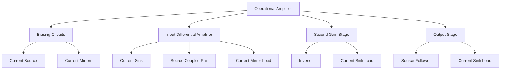
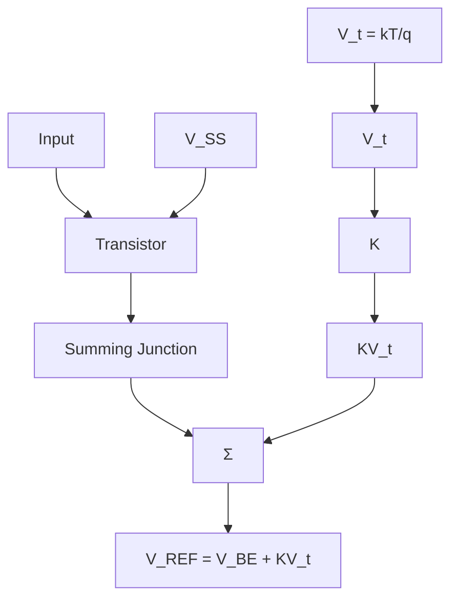

<!-- source.md = VIEWER-ONLY verbatim slice of CMOS_Analog_Circuit_Design_-_Allen_Holberg_mineru.md, original lines 4873-7479 (Chapter 4).
     Authoritative gold coordinates are in gold.yaml under each atom's source_span (file=the mineru .md).
     viewer_span here is optional/debug. -->
# Chapter 4 Analog CMOS Subcircuits

From the viewpoint of Table 1.1-2, the previous two chapters have provided the background for understanding the technology and modeling of CMOS devices and components compatible with the CMOS process. The next step toward our objective— methodically developing the subject of CMOS analog-circuit design—is to develop subcircuits. These simple circuits consist of one or more transistors; they are simple; and they generally perform only one function. A subcircuit is typically combined with other simple circuits to generate a more complex circuit function. Consequently, the circuits of this and the next chapter can be considered as building blocks.

The operational amplifier, or op amp, to be covered in Chapters 6 and 7, is a good example of how simple circuits are combined to perform a complex function. Figure 4.0- 1 presents a hierarchy showing how an operational amp lifier—a complex circuit—might be related to various simple circuits. Working our way backward, we note that one of the stages of an op amp is the differential amplifier. The differential amplifier consists of simple circuits that might include a current sink, a current-mirror load, and a sourcecoupled pair. Another stage of the op amp is a second gain stage, which might consist of an inverter and a current-sink load. If the op amp is to be able to drive a low-impedance load, an output stage is necessary. The output stage might consist of a source follower and a current-sink load. It is also necessary to provide a stabilized bias for each of the previous stages. The biasing stage could consist of a current sink and current mirrors to distribute the bias currents to the other stages.

flowchart

Figure 4.0-1 Illustration of the hierarchy of analog circuits for an operational amplifier.

The subject of basic CMOS analog circuits has been divided into two chapters to avoid one lengthy chapter and yet provide sufficient detail. Chapter 4 covers the simpler subcircuits, including: the MOS switch, active loads, current sinks/sources, current mirrors and current amplifiers, and voltage and current references. Chapter 5 will examine more complex circuits like CMOS amplifiers. That chapter represents a natural extension of the material presented in Chapter 4. Taken together, these two chapters are fundamental for the analog CMOS designer's understanding and capability, as most designs will start at this level and progress upward to synthesize the more complex circuits and systems of Table 1.1-2.

# 4.1 MOS Switch

The switch finds many applications in integrated-circuit design. In analog circuits, the switch is used to implement such useful functions as the switched simulation of a resistor [1]. The switch is also useful for multiplexing, modulation, and a number of other applications. The switch is used as a transmission gate in digital circuits and adds a dimension of flexibility not found in standard logic circuits. The objective of this section is to study the characteristics of switches that are compatible with CMOS integrated circuits.

We begin with the characteristics of a voltage-controlled switch. Figure 4.1-1 shows a model for such a device. The voltage $\nu _ { C }$ controls the state of the switch—ON or OFF. The voltage-controlled switch is a three-terminal network with terminals A and B comprising the switch and terminal C providing the means of applying the control voltage $\nu _ { C } .$ . The most important characteristics of a switch are its ON resistance, $r _ { \mathrm { O N } }$ , and its OFF resistance , $r _ { \mathrm { O F F } }$ . Ideally $r _ { \mathrm { O N } }$ is zero and $r _ { \mathrm { O F F } }$ is infinite. Reality is such that rON is never zero and $r _ { \mathrm { O F F } }$ is never infinite. Moreover, these values are never constant with respect to terminal conditions. In general, switches can have some form of voltage offset which is modeled by $V _ { O S }$ of Fig. 4.1-1. $V _ { O S }$ represents the small voltage that may exist between terminals A and B when the switch is in the ON state and the current is zero. $I _ { \mathrm { O F F } }$ represents the leakage current that may flow in the OFF state of the switch. Currents $I _ { A }$ and $I _ { B }$ represent leakage currents from the switch terminals to ground (or some other supply potential). The polarities of the offset sources and leakage currents are not known and have been arbitrarily assigned the directions indicated in Fig. 4.1-1. The parasitic capacitors are an important consideration in the application of analog sampled-data circuits. Capacitors $C _ { A }$ , and $C _ { B } ,$ , are the parasitic capacitors between the switch terminals A and B and ground. Capacitor $C _ { A B } $ is the parasitic capacitor between the switch terminals A and B. Capacitors $C _ { A C }$ and $C _ { B C }$ are parasitic capacitors that may exist between the voltage-control terminal C and the switch terminals A and B. Capacitors $C _ { A C }$ and $C _ { B C }$ contribute to the effect called charge feedthrough—where a portion of the control voltage appears at the switch terminals A and B.

text_image

I_OFF
r_OFF
A
r_ON
V_OS
+
-
B
C_AB
I_A
C_AC
C
C_BC
V_C
C_A
C_B
I_B

Figure 4.1-1 Model for a nonideal switch.

One advantage of MOS technology is that it provides a good switch. Figure 4.1-2 shows a MOS transistor that is to be used as a switch. Its performance can be determined by comparing Fig. 4.1-1 with the large-signal model for the MOS transistor. We see that either terminal, A or $B ,$ can be the drain or the source of the MOS transistor depending upon the terminal voltages (e.g., for an n-channel transistor, if terminal A is at a higher potential than B, then terminal A is the drain and terminal B is the source). The ON resistance consists of the series combination of $r _ { D } , r _ { S } ,$ and whatever channel resistance exists. Typically, by design, the contribution from $r _ { D }$ and $r _ { S }$ is small such that the primary consideration is the channel resistance. An expression for the channel resistance can be found as follows. In the ON state of the switch, the voltage across the switch should be small and $\nu _ { G S }$ should be large. Therefore the MOS device is assumed to be in the nonsaturation region. Equation (1) of Sec. 3.1, repeated below, is used to model this state.

$$
I _ {D} = \frac {K ^ {\prime} W}{L} \left[ \left(V _ {G S} - V _ {T}\right) V _ {D S} - \frac {V _ {D S} ^ {2}}{2} \right] \tag {1}
$$

text_image

C
A
B

Figure 4.1-2 An n-channel transistor used as a switch.

where $V _ { D S }$ is less than $V _ { G S } - V _ { T }$ but greater than zero. $( V _ { G S }$ becomes $V _ { G D }$ if $V _ { D S }$ is negative.) The small-signal channel resistance given as

$$
r _ {\mathrm{ON}} = \frac {1}{\partial I _ {D} / \partial V _ {D S}} = \frac {L}{K ^ {\prime} W (V _ {G S} - V _ {T} - V _ {D S})} \tag {2}
$$

Figure 4.1-3 illustrates drain current of an n-channel transistor as a function of the voltage across the drain and source terminals, plotted for equal increasing steps of $V _ { G S }$ for $W / L = 5 / 1$ . This figure illustrates some very important principles about MOS transistor operation. Notice that the curves are not symmetrical about $V _ { 1 } = 0$ . This is because the transistor terminals (drain and source) switch roles as $V _ { 1 }$ crosses zero volts. For example, when $V _ { 1 }$ is positive, node B is the drain and node $A$ is the source and $V _ { B S }$ is fixed at -2.5 volts and $V _ { G S }$ is fixed as well (for a given $V _ { G } )$ . When $V _ { 1 }$ is negative, node B is the source and node $A$ is the drain and as $V _ { 1 }$ continues to decrease, $V _ { B S }$ decreases and $V _ { G S }$ increases resulting in an increase in current.

line

| V_G (V) | I (mA) at V_1 (volts) = -2.5 | I (mA) at V_1 (volts) = -2.0 | I (mA) at V_1 (volts) = -1.5 | I (mA) at V_1 (volts) = -1.0 | I (mA) at V_1 (volts) = -0.5 | I (mA) at V_1 (volts) = 0.0 | I (mA) at V_1 (volts) = 0.5 | I (mA) at V_1 (volts) = 1.0 | I (mA) at V_1 (volts) = 1.5 | I (mA) at V_1 (volts) = 2.0 | I (mA) at V_1 (volts) = 2.5 |
|---------|-------------------------------|-------------------------------|-------------------------------|-------------------------------|-------------------------------|-------------------------------|-------------------------------|-------------------------------|-------------------------------|-------------------------------|-------------------------------|
| 5       | ~3.7                          | ~3.4                          | ~3.0                          | ~2.6                          | ~1.8                          | ~0.0                          | ~-0.2                         | ~-0.4                         | ~-0.6                         | ~-0.8                         | ~-1.0                         |
| 4       | ~3.5                          | ~3.1                          | ~2.6                          | ~2.1                          | ~1.2                          | ~0.0                          | ~-0.1                         | ~-0.3                         | ~-0.5                         | ~-0.7                         | ~-0.9                         |
| 3       | ~3.2                          | ~2.8                          | ~2.2                          | ~1.7                          | ~0.8                          | ~0.0                          | ~-0.1                         | ~-0.3                         | ~-0.5                         | ~-0.7                         | ~-0.9                         |
| 2       | ~2.9                          | ~2.5                          | ~1.8                          | ~1.3                          | ~0.6                          | ~0.0                          | ~-0.1                         | ~-0.3                         | ~-0.5                         | ~-0.7                         | ~-0.9                         |
| 1       | ~2.6                          | ~2.2                          | ~1.4                          | ~1.0                          | ~0.4                          | ~0.0                          | ~-0.1                         | ~-0.3                         | ~-0.5                         | ~-0.7                         | ~-0.9                         |
The chart includes two sets of lines: one for V_G from 5V to 1V, the other for V_G from 1V to 5V, and a separate schematic shows the output current I over time in a circuit with nodes A and B labeled.

Figure 4.1-3 I-V characteristic of an n-channel transistor operating as a switch.

A plot of $r _ { \mathrm { O N } }$ as a function of $V _ { G S }$ is shown in Fig. 4.1-4 for $V _ { D S } = 0 . 1$ volts and for W/L = 1, 2, 5, and 10. It is seen that a lower value of $r _ { \mathrm { O N } }$ is achieved for larger values of W/L. When $V _ { G S }$ approaches $V _ { T } ( V _ { T } = 0 . 7 $ volts in this case), rON approaches infinity because the switch is turning off.

line

| V_GS (volts) | ON Resistance (Ω) for W/L = 1 | ON Resistance (Ω) for W/L = 2 | ON Resistance (Ω) for W/L = 5 | ON Resistance (Ω) for W/L = 10 |
| ------------ | ----------------------------- | ----------------------------- | ----------------------------- | ------------------------------ |
| 1            | ~25k                          | ~15k                          | ~10k                          | ~5k                            |
| 2            | ~10k                          | ~7k                           | ~5k                           | ~2.5k                          |
| 3            | ~5k                           | ~4k                           | ~3k                           | ~1.5k                          |
| 4            | ~3k                           | ~2.5k                         | ~2k                           | ~1k                            |
| 5            | ~2k                           | ~2k                           | ~1.5k                         | ~0.8k                          |

Figure 4.1-4 Illustration of on resistance for an n-channel transistor.

When, $V _ { G S }$ is less than or equal to $V _ { T }$ the switch is OFF and $r _ { \mathrm { O F F } }$ is ideally infinite. Of course, it is never infinite, but because it is so large, the performance in the OFF state is dominated by the drain-bulk and source-bulk leakage current as well as subthreshold leakage from drain to source. The leakage from drain and source to bulk is primarily due to the pn junction leakage current and is modeled in Fig. 4.1-1 as $I _ { A }$ and $I _ { B } .$ Typically this leakage current is on the order of 1 $\mathrm { f A } / \mu \mathrm { m } ^ { 2 }$ at room temperature and doubles for every 8 $^ \circ \mathrm { C }$ increase (see Ex. 2.5-1).

The offset voltage modeled in Fig. 4.1-1 does not exist in MOS switches and thus is not a consideration in MOS switch performance. The capacitors $C _ { A } , C _ { B } , C _ { A C } ,$ , and $C _ { B C }$ of Fig. 4.1-1 correspond directly to the capacitors $C _ { B S } , \bar { C } _ { B D } , C _ { G S }$ , and $C _ { G D }$ of the MOS transistor (see Fig. 3.2-1). $C _ { A B } $ is small for the MOS transistor and is usually negligible.

One important aspect of the switch is the range of voltages on the switch terminals compared to the control voltage. For the n-channel MOS transistor we see that the gate voltage must be considerably larger than either the drain or source voltage in order to ensure that the MOS transistor is ON. (For the p-channel transistor, the gate voltage must be considerably less than either the drain or source voltage.) Typically, the bulk is taken to the most negative potential for the n-channel switch (positive for the p-channel switch). This requirement can be illustrated as follows for the n-channel switch. Suppose that the ON voltage of the gate is the positive power supply $V _ { D D }$ . With the bulk to ground this should keep the n-channel switch ON until the signal on the switch terminals (which should be approximately identical at the source and drain) approaches $V _ { D D } - \mathrm { ~ } V _ { T }$ . As the signal approaches $V _ { D D } - V _ { T }$ the switch begins to turn OFF. Typical voltages used for an n-channel switch are shown in Fig. 4.1-5 where the switch is connected between the two networks shown.

text_image

0 volts - OFF
5 volts - ON
G
Circuit
1
(0 to 4V)
S
(0 to 4V)
D
Circuit
2

Figure 4.1-5 Application of an n-channel transistor as a switch with typical terminal voltages indicated.

Consider the use of a switch to charge a capacitor as shown in Fig. 4.1-6. An nchannel transistor used as a switch and $\phi$ is the control voltage (clock) applied to the gate. The ON resistance of the switch is important during the charge transfer phase of this circuit. For example, when $\phi$ goes high $( V _ { \phi } > \nu _ { \mathrm { i n } } + V _ { T } )$ , M1 connects C to the voltage source $\nu _ { \mathrm { i n } } .$ The equivalent circuit at this time is shown in Fig. 4.1-7. It can be seen that C will charge to $\nu _ { \mathrm { i n } }$ with the time constant of $r _ { \mathrm { O N } } C$ . For successful operation $r _ { \mathrm { O N } } C < < T$ where $T$ is the time $\phi$ is high. Clearly, $r _ { \mathrm { O N } }$ varies greatly with $\nu _ { g s }$ as illustrated in $\operatorname { F i g }$ . 4.1-4. The worst-case value for $r _ { \mathrm { O N } }$ (the highest value) during the charging of $C ,$ is when $\nu _ { d s } = 0$ and $\nu _ { g s } = V _ { \phi } - \nu _ { \mathrm { i n } } .$ This value should be used when sizing the transistor to achieve the desired charging time.

text_image

φ
+
vin
-
C
+
vc
-

Figure 4.1-6 An application of a MOS switch.

text_image

rON
+
vin
-
C
+
vc
-

Figure 4.1-7 Model for the ON state of the switch in Fig 4.1-6.

Consider a case where the time $\phi$ is high is $T = 0 . 1$ s and $C = 0 . 2 \mathrm { p F }$ , then $r _ { \mathrm { O N } }$ must be less than 100 kΩ if sufficient charge transfer occurs in five time constants. For a 5-volt clock swing , $\nu _ { \mathrm { i n } }$ of 2.5 volts, the MOS device of Fig. 4.1-4 with $W = L$ gives $r _ { \mathrm { O N } }$ on the order of 2.8 kΩ, which is sufficiently small to transfer the charge in the desired time. It is desirable to keep the switch size as small as possible (minimize W×L) to minimize charge feedthrough from the gate.

The OFF state of the switch has little influence upon the performance of the circuit in Fig. 4.1-6 except for the leakage current. Figure 4.1-8 shows a sample-and-hold circuit where the leakage current can create serious problems. If $C _ { H }$ is not large enough, then in the hold mode where the MOS switch is OFF the leakage current can charge or discharge $C _ { H }$ a significant amount.

text_image

I_OFF
v_in
C_H
+
-
v_C_H
+
-
v_out

Figure 4.1-8 Example of the influence of $I _ { \mathrm { o f f } }$ in a sample-and-hold circuit.

One of the most serious limitations of monolithic switches is the clock feedthrough effect. Clock feedthrough (also called charge injection, and charge feedthrough) is due to the coupling capacitance from the gate to both source and drain. This coupling allows charge to be transferred from the gate signal (which is generally a clock) to the drain and source nodes—an undesirable but unavoidable effect. Charge injection involves a complex process whose resulting effects depend upon a number of factors such as the layout of the transistor, its dimensions, impedance levels at the source and drain nodes, and gate waveform. It is hopeless to attempt to describe all of these effects precisely analytically—we have computers to do that! Nevertheless, it is useful to develop a qualitative understanding of this important effect.

Consider a simple circuit suitable for studying charge injection analysis shown in Fig. 4.1-9(a). Figure 4.1-9(b) illustrates modeling a transistor with the channel symbolized as a resistor, $R _ { c h a n n e l } ,$ and gate-channel coupling capacitance denoted $C _ { c h a n n e l } .$ . The characters of $C _ { c h a n n e l }$ and $R _ { c h a n n e l }$ depend upon the terminal conditions of the device. The gate-channel coupling is distributed across the channel as is the channel resistance, $R _ { c h a n n e l } .$ In addition to the channel capacitance, there is the overlap capacitance, CGS0 and CGD0. It is convenient to approximate the total channel capacitance by splitting it into two capacitors of equal size placed at the gate-source and gate-drain terminals as illustrated in Fig. 4.1-9(c).

For the circuit in Fig. 4.1-9, charge injection is of interest during a high to low transition at the gate of $\phi _ { 1 }$ . Moreover, it is convenient to consider two cases regarding the gate transition—a fast transition time, and a slow transition time. Consider the slowtransition case first (what is meant by slow and fast will be covered shortly). As the gate is falling, some charge is being injected into the channel. However, initially, the transistor remains on so that whatever charge is injected flows in the input voltage source, $V _ { S }$ . None of this charge will appear on the load capacitor, $C _ { L }$ . As the gate voltage falls, at some point, the transistor turns off (when the gate voltage reaches $V _ { S } -$ + $V _ { T } )$ . When the transistor turns off, there is no other path for the charge injection other than into $C _ { L }$ .

For the fast case, the time constant associated with the channel resistance and the channel capacitance limits the amount of charge that can flow to the source voltage so that some of the channel charge that is injected while the transistor is on contributes to the total charge on $C _ { L }$ .

To develop some intuition about the fast and slow cases, it is useful to model the gate voltage as a piecewise constant waveform (a quantized waveform) and consider the charge flow at each transition as illustrated in Fig 4.1-10(a) and (b). In this figure, the range of voltage at $C _ { L }$ illustrated represent the period while the transistor is on. In both cases, the quantized voltage step is the same, but the time between steps is different. The voltage across $C _ { L }$ is observed to be an exponential whose time constant is due to the channel resistance and channel capacitance and does not change from fast case to slow case.

text_image

φ₁
+
Vs
-
CL
+
vCL
-
(a)

text_image

φ₁
Cchannel
CGS0
CGD0
Rchannel
CL
+
-
V_S
-
(b)

text_image

Cchannel
2
CGS0
φ1
Cchannel
2
CGD0
Rchannel
CL
+
-
VS
-
(c)

Figure 4.1-9 (a) Simple switch circuit useful for studying charge injection. (b) Distributed model for the transistor switch. (c) Lumped model of Fig. 4.1-9(a).

  
Figure 4.1-10 (a) Illustration of slow ramp and (b) fast ramp using a quantized voltage ramp to illustrate the effects due to the time constant of the channel resistance and capacitance.

Analytical expressions have been derived which describe the approximate operation of a transistor in the slow and fast regimes[2]. Consider the gate voltage traversing from $V _ { H }$ to $V _ { L }$ (e.g., 5.0 volts to 0.0 volts, respectively) described in the time domain as

$$
v _ {G} = V _ {H} - U t \tag {3}
$$

When operating in the slow regime defined by the relationship

$$
\frac {\beta V _ {H T} ^ {2}}{2 C _ {L}} > > U \tag {4}
$$

where $V _ { H T }$ is defined as

$$
V _ {H T} = V _ {H} - V _ {S} - V _ {T} \tag {5}
$$

the error (the difference between the desired voltage $V _ { S }$ and the actual voltage, $V _ { C _ { L } } )$ due to charge injection can be described as

$$
V _ {e r r o r} = \left(\frac {W \cdot \mathrm{CGD0} + \frac {C _ {\text {channel}}}{2}}{C _ {L}}\right) \sqrt {\frac {\pi U C _ {L}}{2 \beta}} + \frac {W \cdot \mathrm{CGD0}}{C _ {L}} (V _ {S} + V _ {T} - V _ {L}) \tag {6}
$$

In the fast switching regime defined by the relationship

$$
\frac {\beta V _ {H T} ^ {2}}{2 C _ {L}} <   <   U \tag {7}
$$

the error voltage is given as

$$
V _ {e r r o r} = \left(\frac {W \cdot \mathrm{CGD0} + \frac {C _ {c h a n n e l}}{2}}{C _ {L}}\right) \left(V _ {H T} - \frac {\beta V _ {H T} ^ {3}}{6 U C _ {L}}\right) + \frac {W \cdot \mathrm{CGD0}}{C _ {L}} (V _ {S} + V _ {T} - V _ {L}) (8)
$$

The following example illustrates the application of the charge-feedthrough model given by Eq’s. (3) through (8).

Example 4.1-1 Calculation of Charge Feedthrough Error

Calculate the effect of charge feedthrough on the circuit shown in Fig. 4.1-9 where $V _ { S } = 1 . 0$ volts, $C _ { L } = 2 0 0$ fF, $\ W / \mathrm { L } = 0 . 8 \mu \mathrm { m } / 0 . 8 \mu \mathrm { m }$ , and $V _ { G }$ is given for two cases illustrated below. Use model parameters from Tables 3.1-2 and 3.2-1. Neglect ∆L and ∆W effects.

line

| Time     | Case 1 | Case 2 |
| -------- | ------ | ------ |
| 0        | 5      | 5      |
| 0.2 ns   | 0      | 0      |
| 10 ns    | 0      | 0      |

Case 1:

The first step is to determine the value of U in the expression

$$
v _ {G} = V _ {H} - U t
$$

For a transition from 5 volts to 0 volts in 0.2 ns, $U = 2 5 \times 1 0 ^ { 9 } \mathrm { V / s }$ .

In order to determine operating regime, the following relationship must be tested.

$$
\frac {\beta V _ {H T} ^ {2}}{2 C _ {L}} > > U \text {for slow or} \frac {\beta V _ {H T} ^ {2}}{2 C _ {L}} <   <   U \text {for fast}
$$

Observing that there is a backbias on the transistor switch effecting VT, VHT is

$$
V _ {H T} = V _ {H} - V _ {S} - V _ {T} = 5 - 1 - 0. 8 8 7 = 3. 1 1 3
$$

giving

$$
\frac {\beta V _ {H T} ^ {2}}{2 C _ {L}} = \frac {1 1 0 \times 1 0 ^ {- 6} \times 3 . 1 1 3 ^ {2}}{2 \times 2 0 0 \mathrm{f}} = 2. 6 6 \times 1 0 ^ {9} <   <   2 5 \times 1 0 ^ {9} \text {thus fast regime.}
$$

Applying Eq. (8) for the fast regime yields

$$
V _ {\text {error}} = \left(\frac {1 7 6 \times 1 0 ^ {- 1 8} + \frac {1 . 5 8 \times 1 0 ^ {- 1 5}}{2}}{2 0 0 \times 1 0 ^ {- 1 5}}\right) \left(3. 1 1 3 - \frac {3 . 3 2 \times 1 0 ^ {- 3}}{3 0 \times 1 0 ^ {- 3}}\right) + \frac {1 7 6 \times 1 0 ^ {- 1 8}}{2 0 0 \times 1 0 ^ {- 1 5}} (5 + 0. 8 8 7 - 0)
$$

$$
V _ {e r r o r} = 1 9. 7 \mathrm{mV}
$$

Case 2:

The first step is to determine the value of U in the expression

$$
v _ {G} = V _ {H} - U t
$$

For a transition from 5 volts to 0 volts in 10 ns, $U = 5 \times 1 0 ^ { 8 }$ thus indicating the slow regime according to the following test

$$
2. 6 6 \times 1 0 ^ {9} > > 5 \times 1 0 ^ {8}
$$

$$
V _ {\text { error }} = \left(\frac {1 7 6 \times 1 0 ^ {- 1 8} + \frac {1 . 5 8 \times 1 0 ^ {- 1 5}}{2}}{2 0 0 \times 1 0 ^ {- 1 5}}\right) \sqrt {\frac {3 1 4 \times 1 0 ^ {- 6}}{2 2 0 \times 1 0 ^ {- 6}}} + \frac {1 7 6 \times 1 0 ^ {- 1 8}}{2 0 0 \times 1 0 ^ {- 1 5}} (5 + 0. 8 8 7 - 0)
$$

$$
V _ {e r r o r} = 1 0. 9 5 \mathrm{mV}
$$

This example illustrates the application of the charge-feedthrough model. The reader should be cautioned not to expect Eq’s (3) through (8) to give precise answers regarding the amount of charge feedthrough one should expect in an actual circuit. The model should be used as a guide in understanding the effects of various circuit elements and terminal conditions in order to minimize unwanted behavior by design.

It is possible to partially cancel some of the feedthrough effects using the technique illustrated in Fig. 4.1-11. Here a dummy MOS transistor MD (with source and drain both attached to the signal line and the gate attached to the inverse clock) is used to apply an opposing clock feedthrough due to M1. The area of MD can be designed to provide minimum clock feedthrough. Unfortunately, this method never completely removes the feedthrough and in some cases may worsen it. Also it is necessary to generate an inverted clock, which is applied to the dummy switch. Clock feedthrough can be reduced by using the largest capacitors possible, using minimum-geometry switches, and keeping the clock swings as small as possible. Typically, these solutions will create problems in other areas, requiring some compromises.

text_image

Switch
transistor
M1
Dummy
transistor
MD
φ
φ̄

Figure 4.1-11 The use of a dummy transistor to cancel clock feedthrough.

The dynamic range limitations associated with single-channel MOS switches can be avoided with the CMOS switch shown in Fig. 4.1-12. Using CMOS technology, a switch is usually constructed by connecting p-channel and n-channel enhancement transistors in parallel as illustrated. For this configuration, when $\phi$ is low, both transistors are off, creating an effective open circuit. When  is high, both transistors are on, giving a lowimpedance state. The bulk potentials of the p-channel and the n-channel devices are taken to the highest and lowest potentials, respectively.

chemical

Electrical circuit symbol for a four-terminal transistor with labeled terminals A, B, and φ̄

Figure 4.1-12 A CMOS switch

The primary advantage of the CMOS switch over the single-channel MOS switch is that the dynamic analog-signal range in the ON state is greatly increased.

The increased dynamic range of the analog signal is evident in Fig. 4.1-13 where the on resistance of a CMOS switch is plotted as a function of the input voltage. In this figure, the p-channel and n-channel devices are sized in such a way so that they have equivalent resistance with identical terminal conditions. The double-peak behavior is due to the n-channel device dominating when $\nu _ { i n }$ is low and the p-channel dominating when $\nu _ { i n }$ is high (near $V _ { D D } )$ . At the mid range (near $V _ { D D } / 2 )$ , the parallel combination of the two devices results in a minima.

line

| v_in (volts) | Switch ON resistance (kΩ) |
| ------------ | ------------------------- |
| 1.0          | 2.0                       |
| 2.0          | 2.5                       |
| 3.0          | 2.7                       |
| 4.0          | 2.5                       |
| 5.0          | 2.0                       |

Figure 4.1-13 $r _ { \mathrm { O N } }$ of Fig 4.1-12 as a function of the voltage $\nu _ { i n } .$

In this section we have seen that MOS transistors make one of the best switch realizations available in integrated-circuit form. They require small area, dissipate very little power, and provide reasonable values of $r _ { \mathrm { O N } }$ and $r _ { \mathrm { O F F } }$ for most applications. The inclusion of a good realization of a switch into the designer's basic building blocks will produce some interesting and useful circuits and systems which will be studied in the following chapters.

# 4.2 MOS Diode/Active Resistor

When the gate and drain of an MOS transistor are tied together as illustrated in Fig. 4.2-1(a) and (b), the I-V characteristics are qualitatively similar to a pn-junction diode, thus the name MOS diode. The MOS diode is used as a component of a current mirror (Sec. 4.4) and for level translation (voltage drop).

The I-V characteristics of the MOS diode are illustrated in Fig. 4.2-1(c) and described by the large-signal equation for drain current in saturation (the connection of the gate to the drain guarantees operation in the saturation region) shown below.

$$
I = I _ {D} = \left(\frac {K ^ {\prime} W}{2 L}\right) \left[ \left(V _ {G S} - V _ {T}\right) ^ {2} \right] = \frac {\beta}{2} \left(V _ {G S} - V _ {T}\right) ^ {2} \tag {1}
$$

or

$$
V = V _ {G S} = V _ {D S} = V _ {T} + \sqrt {2 I _ {D} / \beta} \tag {2}
$$

If V or I is given, then the remaining variable can be designed using either Eq. (1) or Eq. (2) and solving for the value of $\beta .$

text_image

I
+
V
-
+
-

(a)

chemical

Simple electronic circuit diagram with voltage source, diode, and current label

(b)

text_image

I
V

text_image

+
v
-
i
gm v
gmbs vs
rds

(d)   
Figure 4.2-1 Active resistor. (a) N-channel. (b) P-channel. (c) I-V characteristics for n-channel case. (d) Small-signal model.

Connecting the gate to the drain means that $\nu _ { D S }$ controls $i _ { D }$ and therefore the channel transconductance becomes a channel conductance. The small-signal model of an MOS diode (excluding capacitors) is shown in Fig. 4.2-1(d). It is easily seen that the smallsignal resistance of an MOS diode is

$$
r _ {\text { out }} = \frac {1}{g _ {m} + g _ {m b s} + g _ {d s}} \cong \frac {1}{g _ {m}} \tag {3}
$$

where $g _ { m }$ is greater than $g _ { m b s } \operatorname { o r } g _ { d s } .$ .

An illustration of the application of the MOS diode is shown in Fig. 4.2-2 where a bias voltage is generated with respect to ground (the value of such a circuit will become obvious later). Noting that $V _ { D S } = V _ { G S }$ for both devices,

$$
V _ {D S} = \sqrt {\frac {2 I}{\beta}} + V _ {T} = V _ {O N} + V _ {T} \tag {4}
$$

$$
V _ {B I A S} = V _ {D S 1} + V _ {D S 2} = 2 V _ {O N} + 2 V _ {T} \tag {5}
$$

text_image

VDD
VBIAS
M2
M1

Figure 4.2-2 Voltage division using active resistors.

The MOS switch described in Sec 4.1 and illustrated in Fig. 4.1-2 can be viewed as a resistor, albeit rather nonlinear as illustrated in Fig. 4.1-4. The nonlinearity can be mitigated where the drain and source voltages vary over a small range so that the transistor ON resistance can be approximated as small signal resistance. Figure 4.2-3 illustrates this point showing a configuration where the transistor's drain and source form the two ends of a “floating” resistor. For the small-signal premise to be valid, $\nu _ { D S }$ is assumed small. The I-V characteristics of the floating resistor are given by Fig. 4.1-3. Consequently, the range of resistance values is large but nonlinear. When the transistor is operated in the nonsaturation region, the resistance can be calculated from Eq. (2) of Sec. 4.1 and repeated below, where $\nu _ { D S }$ is assumed small.

chemical

Circuit diagram showing a BJT transistor with bias voltage V_BIAS and equivalent circuit symbol

Figure 4.2-3 Floating active resistor using a single MOS transistor.

$$
r _ {d s} = \frac {L}{K ^ {\prime} W \left(V _ {G S} - V _ {T}\right)} \tag {6}
$$

Example 4.2-1 Calculation of the Resistance of an Active Resistor

The floating active resistor of Fig. 4.2-3 is to be used to design a 1 kΩ resistance. The dc value of $V _ { A , B } = 2 \mathrm { ~ V ~ }$ . Use the device parameters in Table 3.1-2 and assume the active resistor is an n-channel transistor with the gate voltage at 5 V. Assume that

$V _ { D S } = 0 . 0$ . Calculate the required W/L to achieve 1 kΩ resistance. The bulk terminal is 0.0 V.

Before applying Eq. (6), it is necessary to calculate the new threshold voltage, $V _ { T } ,$ due to $V _ { B S }$ not being zero $( | V _ { B S } | = 2 \ : \mathrm { V } )$ . From Eq. (2) of Sec. 3.1 the new $V _ { T }$ is found to be 1.022 volts. Equating Eq. (5) to 1000 Ω gives a W/L of $4 . 5 9 7 \cong 4 . 6$ .

# 4.3 Current Sinks and Sources

A current sink and current source are two terminal components whose current at any instant of time is independent of the voltage across their terminals. The current of a current sink or source flows from the positive node, through the sink or source to the negative node. A current sink typically has the negative node at $V _ { S S }$ and the current source has the positive node at $\bar { V } _ { D D }$ . Figure 4.3-1 (a) shows the MOS implementation of a current sink. The gate is taken to whatever voltage necessary to create the desired value of current. The voltage divider of Fig. 4.2-2 can be used to provide this voltage. We note that in the nonsaturation region the MOS device is not a good current source. In fact the voltage across the current sink must be larger than $V _ { \mathrm { M I N } }$ in order for the current sink to perform properly. For Fig. 4.3-1(a) this means that

$$
v _ {\text { OUT }} \geq V _ {G G} - V _ {T 0} - V _ {S S} \tag {1}
$$

text_image

iOUT
VGG
+
vOUT
-
iOUT
Vmin
0
VGG - VT0
vOUT

Figure 4.3-1 (a) Current sink. (b) Current-voltage characteristics of (a).

If the gate-source voltage is held constant, then the large-signal characteristics of the MOS transistor are given by the output characteristics of Fig. 3.1-3. An example is shown in Fig. 4.3-1 (b). If the source and bulk are both connected to $V _ { S S }$ , then the small-signal output resistance is given by (see Eq. (9) of Sec. 3.3)

$$
r _ {\text { out }} = \frac {1 + \lambda V _ {D S}}{\lambda I _ {D}} \cong \frac {1}{\lambda I _ {D}} \tag {2}
$$

If the source and bulk are not connected to the same potential, the characteristics will not change as long as $V _ { B S }$ is a constant.

Figure 4.3-2 (a) shows an implementation of a current source using a p-channel transistor. Again, the gate is taken to a constant potential as is the source. With the definition of $\nu _ { \mathrm { O U T } }$ and $i _ { \mathrm { O U T } }$ of the source as shown in Fig. 4.3-2(a), the large-signal V-I characteristic is shown in Fig. 4.3-2(b). The small-signal output resistance of the current source is given by Eq. (2). The source-drain voltage must be larger than $V _ { \mathrm { M I N } }$ for this current source to work properly. This current source only works for values of $\nu _ { \mathrm { O U T } }$ given by

$$
v _ {\text { OUT }} \leq V _ {G G} + | V _ {T 0} | \tag {3}
$$

chemical

Electronic circuit diagram of a MOSFET amplifier with labeled gate, drain, and output currents

line

| v_OUT | i_OUT |
|-------|-------|
| 0     | High  |
| V_GG  | Low   |
| V_T0  | Low   |
| V_DD  | Low   |
| V_min | V_min |

Figure 4.3-2 (a) Current source. (b) Current-voltage characteristics of (a).

The advantage of the current sink and source of Figs. 4.3-1(a) and 4.3-2(a) is their simplicity. However, there are two areas in which their performance may need to be improved for certain applications. One improvement is to increase the small-signal output resistance—resulting in a more constant current over the range of $\nu _ { \mathrm { O U T } }$ values. The second is to reduce the value of $V _ { \mathrm { M I N } }$ , thus allowing a larger range of vOUT over which the current sink/source works properly. We shall illustrate methods to improve both areas of performance. First, the small-signal output resistance can be increased using the principle illustrated in Fig. 4.3-3(a). This principle uses the common-gate configuration to multiply the source resistance r by the approximate voltage gain of the common-gate configuration with an infinite load resistance. The exact small-signal output resistance $r _ { \mathrm { o u t } }$ can be calculated from the small-signal model of Fig. 4.3-3(b) as

$$
r _ {\mathrm{out}} = \frac {v _ {\mathrm{out}}}{i _ {\mathrm{out}}} = r + r _ {d s 2} + [ (g _ {m 2} + g _ {m b s 2}) r _ {d s 2} ] r \cong (g _ {m 2} r _ {d s 2}) r \tag {4}
$$

where $g _ { m 2 } r _ { d s 2 } > > 1$ and $g _ { m 2 } > g _ { m b s 2 } .$

text_image

VGG
iOUT
+
r
vOUT
-

text_image

g_m2 v_gs2
g_mbs2 v_bs2
r
+
-
v_s2
i_out
r_ds2
v_out

Figure 4.3-3 (a) Technique for increasing the output resistance of a resistor r. (b) Small-signal model for the circuit in (a).

The above principle is implemented in Fig. 4.3-4(a) where the output resistance $( r _ { d s 1 } )$ of the current sink of Fig. 4.3-1(a) should be increased by the common-gate voltage gain of M2. To verify the principle, the small-signal output resistance of the cascode current sink of Fig. 4.3-4(a) will be calculated using the model of Fig. 4.3-4(b). Since $\nu _ { g s 2 } = - \nu _ { 1 }$ and $\nu _ { g s 1 } = 0$ , summing the currents at the output node gives

$$
i _ {\text {out}} + g _ {m 2} v _ {1} + g _ {m b s 2} v _ {1} = g _ {d s 2} (v _ {\text {out}} - v _ {1}) \tag {5}
$$

Since $\nu _ { 1 } = i _ { \mathrm { o u t } } r _ { d s 1 }$ , we can solve for $r _ { \mathrm { o u t } }$ as

$$
r _ {\text {out}} = \frac {v _ {\text {out}}}{i _ {\text {out}}} = r _ {d s 2} (1 + g _ {m 2} r _ {d s 1} + g _ {m b s 2} r _ {d s 1} + g _ {d s 2} r _ {d s 1}) \tag {6}
$$

$$
= r _ {d s 1} + r _ {d s 2} + g _ {m 2} r _ {d s 1} r _ {d s 2} (1 + \eta_ {2})
$$

Typically, $g _ { m 2 } r _ { d s 2 }$ is greater than unity so that Eq. (6) simplifies to

$$
r _ {\text { out }} \cong (g _ {m 2} r _ {d s 2}) r _ {d s 1} \tag {7}
$$

We see that the small-signal output resistance of the current sink of Fig. 4.3-4(a) is increased by the factor of $g _ { m 2 } r _ { d s 2 }$ .

text_image

iOUT
+
VGC
M2
vOUT
VGG
M1
-

text_image

D2
gmbs2vbs2
gm2vgs2
S2
rds2
iout
+
vm1vgs1
D1
rds1
v1
-
S1
vout
-

Figure 4.3-4 (a) Circuit for increasing $\mathrm { r _ { o u t } }$ of a current sink. (b) Small-signal model for the circuit in (a).

# Example 4.3-1 Calculation of Output Resistance for a Current Sink

Use the model parameters of Table 3.1-2 to calculate: (a) the small-signal output resistance for the simple current sink of Fig. 4.3-1(a) if $I _ { \mathrm { O U T } } = 1 0 0 \mu \mathrm { A } ; $ ; and (b) the smallsignal output resistance if the simple current sink of (a) is inserted into the cascode current-sink configuration of Fig. 4.3-4(a). Assume that $W _ { 1 } / L _ { 1 } = W _ { 2 } / L _ { 2 } = 1$ .

(a) Using $\lambda = 0 . 0 4$ and $I _ { \mathrm { O U T } } = 1 0 0 $ A gives a small-signal output resistance of 250 kΩ. (b) The body-effect term, $g _ { m b s 2 }$ can be ignored with little error in the result. Equation (6) of Sec. 3.3 gives $g _ { m 1 } = g _ { m 2 } = 1 4 8 \mu \mathrm { A } / \mathrm { V }$ . Substituting these values into Eq. (7) gives the small-signal output resistance of the cascode current sink as 9.25 MΩ.

The other performance limitation of the simple current sink/source was the fact that the constant output current could not be obtained for all values of $\nu _ { \mathrm { O U T } } .$ This was illustrated in Figs. 4.3-1(b) and 4.3-2(b). While this problem may not be serious in the simple current sink/source, it becomes more severe in the cascode current-sink/source configuration that was used to increase the small-signal output resistance. It therefore becomes necessary to examine methods of reducing the value of $V _ { \mathrm { M I N } } \left[ 3 \right]$ Obviously, $V _ { \mathrm { M I N } }$ can be reduced by increasing the value of W/L and adjusting the gate-source voltage to get the same output current. However, another method which works well for the cascode current-sink/source configuration will be presented.

We must introduce an important principle used in biasing MOS devices before showing the method of reducing $V _ { \mathrm { M I N } }$ of the cascode current sink/source. This principle can be best illustrated by considering two MOS devices, M1 and M2. Assume that the applied dc gate-source voltage $V _ { G S }$ can be divided into two parts, given as

$$
V _ {G S} = V _ {O N} + V _ {T} \tag {8}
$$

where $V _ { O N }$ is that part of $V _ { G S }$ which is in excess of the threshold voltage, $V _ { T } .$ This definition allows us to express the minimum value of $\nu _ { D S }$ for which the device will remain in saturation as

$$
v _ {D S} (\mathrm{sat}) = V _ {G S} - V _ {\mathrm{T}} = V _ {O N} \tag {9}
$$

Thus, $V _ { O N }$ can be thought of as the minimum drain-source voltage for which the device remains saturated. In saturation, the drain current can be written as

$$
i _ {D} = \frac {K ^ {\prime} W}{2 L} \left(V _ {O N}\right) ^ {2} \tag {10}
$$

The principle to be illustrated is based upon Eq. (10). If the currents of two MOS devices are equal (because they are in series), then the following relationship holds.

$$
\frac {K _ {1} W _ {1}}{L _ {1}} \left(V _ {O N 1}\right) ^ {2} = \frac {K _ {2} W _ {2}}{L _ {2}} \left(V _ {O N 2}\right) ^ {2} \tag {11}
$$

If both MOS transistors are of the same type, then Eq. (11) reduces to

$$
\frac {W _ {1}}{L _ {1}} \left(V _ {O N 1}\right) ^ {2} = \frac {W _ {2}}{L _ {2}} \left(V _ {O N 2}\right) ^ {2} \tag {12}
$$

or

$$
\frac {\left(\frac {W _ {1}}{L _ {1}}\right)}{\left(\frac {W _ {2}}{L _ {2}}\right)} = \frac {(V _ {O N 2}) ^ {2}}{(V _ {O N 1}) ^ {2}} \tag {13}
$$

The principle above can also be used to define a relationship between the current and W/L ratios. If the gate-source voltages of two similar MOS devices are equal (because they are physically connected), then $V _ { O N 1 }$ is equal to $V _ { O N 2 }$ . From Eq. (10) we can write

$$
i _ {D 1} \left(\frac {W _ {2}}{L _ {2}}\right) = i _ {D 2} \left(\frac {W _ {1}}{L _ {1}}\right) \tag {14}
$$

Eq. (13) is useful even though the gate-source terminals of M1 and M2 may not be physically connected because voltages can be identical without being physically connected as will be seen in later material. Eq’s. (13) and (14) represent a very important principle that will be used not only in the material immediately following but throughout this text to determine biasing relationships.

<!-- MinerU pages 161-180 -->

text_image

IREF
2VT+ 2VON
M4
+
VT+ VON
-
M3
+
VT+ VON
-
M2
iOUT
+
vOUT
+
M1
VT+ VON
-
-

line

| v_OUT | i_OUT |
|-------|-------|
| 0     | 0     |
| V_T+  | max   |
| 2V_ON | max   |

Figure 4.3-5 (a) Standard cascode current sink. (b) Output characteristics of circuit in (a).

Consider the cascode current sink of Fig. 4.3-5(a). Our objective is to use the above principle to reduce the value of $V _ { \mathrm { M I N } } \left[ = V _ { \mathrm { O U T } } ( \mathrm { s a t } ) \right]$ . If we ignore the bulk effects on M2 and M4 and assume that M1, M2, M3, and M4 are all matched with identical W/L ratios, then the gate-source voltage of each transistor can be expressed as $V _ { T } + V _ { O N }$ as shown in Fig. 4.3-5(a). At the gate of M2 we see that the voltage with respect to the lower power supply is $2 V _ { T } + ~ 2 V _ { O N }$ . In order to maintain current-sink/source operation, it will be assumed that M1 and M2 must have at least a voltage of $V _ { O N }$ as given in Eq. (9). In order to find $V _ { \mathrm { M I N } } \left[ = V _ { \mathrm { O U T } } ( \mathrm { s a t } ) \right]$ of Fig. 4.3-5(a) we can rewrite Eq. (10) of Sec. 3.1 as

$$
v _ {D} \geq v _ {G} - V _ {T} \tag {15}
$$

Since $V _ { G 2 } = 2 V _ { T } + 2 ~ V _ { O N } ,$ substituting this value into Eq. (15) gives

$$
V _ {D 2} (\min) = V _ {\mathrm{MIN}} = V _ {T} + 2 V _ {O N} \tag {16}
$$

The current-voltage characteristics of Fig. 4.3-5(a) are illustrated in Fig. 4.3-5(b) where the value of $V _ { \mathrm { M N } }$ of Eq. (16) is shown.

$V _ { \mathrm { M I N } }$ of Eq. (16) is dropped across both M1 and M2. The drop across M2 is $V _ { O N }$ while the drop across M1 is $V _ { T } + V _ { O N } .$ From the results of Eq. (9), this implies that $V _ { \mathrm { M I N } }$ of Fig. 4.3-5 could be reduced by $V _ { T }$ and still keep both M1 and M2 in saturation. Figure 4.3-6(a) shows how this can be accomplished[12]. The W/L ratio of M4 is made 1/4 of the identical W/L ratios of M1 through M3. This causes the gate-source voltage across M4 to be $V _ { T } + 2 ~ V _ { O N }$ rather than $V _ { T } + V _ { O N }$ Consequently, the voltage at the gate of M2 is now $V _ { T } + 2 ~ V _ { O N } .$ . Substituting this value into Eq. (15) gives

$$
V _ {D 2} (\min) = V _ {\mathrm{MIN}} = 2 V _ {O N} \tag {17}
$$

The resulting current-voltage relationship is shown in Fig. 4.3-6(b). It can be seen that a voltage of $2 { \cal V } _ { O N }$ is across both M1 and M2 giving the lowest value of $V _ { \mathrm { M I N } }$ and still keeping both M1 and M2 in saturation. Using this approach and increasing the W/L ratios will result in minimum values of $V _ { \mathrm { M I N } } .$ .

text_image

IREF
IREF
M4
1/4
VT+2VON
+
-
M3
1/1
M2
1/1
+
-
M1
1/1
VT+VON
+
-
iOUT
+
VON
-
+
VON
-
-
(a)

line

| v_OUT | i_OUT |
|-------|-------|
| 0     | 0     |
| 2V_ON | V_OUT(sat.) |
| >2V_ON | >0    |

Figure 4.3-6 (a) High-swing cascode. (b) Output characteristics of circuit in (a).

# Example 4.3-2 Designing the Cascode Current Sink for a Given $V _ { \mathrm { M I N } }$

Use the cascode current-sink configuration of Fig. 4.3-6(a) to design a current sink of 100 $\mu \mathrm { A }$ and a $V _ { \mathrm { M I N } }$ of 1 V. Assume the device parameters of Table 3.1-2. With $V _ { \mathrm { M I N } }$ of 1 V, choose $V _ { O N } = 0 . 5 \ : \mathrm { V }$ . Using the saturation model, the W/L ratio of M1 through M3 can be found from

$$
\frac {W}{L} = \frac {2 i _ {\mathrm{OUT}}}{K ^ {\prime} V _ {O N} ^ {2}} = \frac {2 \times 1 0 0 \times 1 0 ^ {- 6}}{1 1 0 \times 1 0 ^ {- 6} \times 0 . 2 5} = 7. 2 7
$$

The W /L ratio of M4 will be 1/4 this value or 1.82.

A problem exists with the circuit in Fig. 4.3-6. The $V _ { D S }$ of M1 and the $V _ { D S }$ of M3 are not equal. Therefore, the current $i _ { O U T }$ will not be an accurate replica of $I _ { R E F }$ due to channel-length modulation as well as drain-induced threshold shift. If precise mirroring of the current $I _ { R E F }$ to $\mathrm { I } _ { o u t }$ is desired, a slight modification of the circuit of Fig. 4.3-6 will minimize this problem. Figure 4.3-7 illustrates this fix. An additional transistor, M5, is added in series with M3 so as to force the drain voltages of M3 and M1 to be equal, thus eliminating and errors due to channel-length modulation and drain-induced threshold shift.

The above technique will be useful in maximizing the voltage-signal swings of cascode configurations to be studied later. This section has presented implementations of the current sink/source and has shown how to boost the output resistance of a MOS device. A very important principle that will be used in biasing was based on relationships between the excess gate-source voltage $V _ { O N } ,$ the drain current, and the W/L ratios of MOS devices. This principle was applied to reduce the voltage $V _ { \mathrm { M I N } }$ of the cascode current source.

text_image

IREF
+
M4
VT+2VON
-
IREF
M5
1/4
1/1
+
M3
VON
-
+
M2
1/1
+
M1
1/1
+
VT+VON
-
iOUT
+
VON
-
+
VON
-
-
-

Figure 4.3-7 Improved high-swing cascode.

When power dissipation must be kept at a minimum, the circuit in Fig. 4.3-7 can be modified to eliminate one of the $I _ { R E F }$ currents. Figure 4.3-8 illustrates a self-biased cascode current source that requires only one reference current[4].

text_image

IREF
R
+
VON
-
VT+ 2VON
iOUT
+
M4
+
VT+VON
-
M2
vOUT
+
M1
+
VT+VON
-
M3
-
-

Figure 4.3-8 Self-biased high-swing cascode current source.

Example 4.3-3 Designing the Self-Biased High-Swing Cascode Current Sink for a Given $V _ { \mathrm { M I N } }$

Use the cascode current-sink configuration of Fig. 4.3-8 to design a current sink of 250 A and a $V _ { \mathrm { M I N } }$ of 0.5 V. Assume the device parameters of Table 3.1-2. With $V _ { \mathrm { M I N } }$ of 0.5 V, choose $V _ { O N } = 0 . 2 5 \mathrm { \ : V } .$ . Using the saturation model, the W/L ratio of M1 and M3 can be found from

$$
\frac {W}{L} = \frac {2 i _ {\mathrm{OUT}}}{K ^ {\prime} V _ {O N} ^ {2}} = \frac {2 \times 5 0 0 \times 1 0 ^ {- 6}}{1 1 0 \times 1 0 ^ {- 6} \times 0 . 0 6 2 5} = 7 2. 7 3
$$

The back-gate bias on M2 and M4 is −0.25 V. Therefore, the threshold voltage for M2 and M4 is calculated to be

$$
V _ {T H} = 0. 7 + 0. 4 \left[ \sqrt {0 . 2 5 + 0 . 7} - \sqrt {0 . 7} \right] = 0. 7 5 5
$$

Taking into account the increased value of the threshold voltage, the gate voltage of M4 and M2 is

$$
V _ {G 4} = 0. 7 5 5 + 0. 2 5 + 0. 2 5 = 1. 2 5 5
$$

The gate voltage of M1 and M3 is

$$
V _ {G 1} = 0. 7 0 + 0. 2 5 = 0. 9 5
$$

Both terminals of the resistor are now defined so that the required resistance value is easily calculated to be

$$
R = \frac {V _ {G 4} - V _ {G 1}}{2 5 0 \times 1 0 ^ {- 6}} = \frac {1 . 2 5 5 - 0 . 9 5}{2 5 0 \times 1 0 ^ {- 6}} = 1 2 2 0 \Omega
$$

# 4.4 Current Mirrors

Current mirrors are simply an extension of the current sink/source of the previous section. In fact, it is unlikely that one would ever build a current sink/source that was not biased as a current mirror. The current mirror uses the principle that if the gate-source potential of two identical MOS transistors are equal, the channel currents should be equal. Figure 4.4-1 shows the implementation of a simple n-channel current mirror. The current $i _ { I }$ is assumed to be defined by a current source or some other means and $i _ { O }$ is the output or “mirrored” current. M1 is in saturation because $\nu _ { D S 1 } = \nu _ { G S 1 }$ . Assuming that $\nu _ { D S 2 } \geq \nu _ { G S } - \mathrm { \Delta } V _ { T 2 }$ is greater than $V _ { T 2 }$ allows us to use the equations in the saturation region of the MOS transistor. In the most general case, the ratio of $i _ { O }$ to $i _ { I }$ is

$$
\frac {i _ {O}}{i _ {I}} = \left(\frac {L _ {1} W _ {2}}{W _ {1} L _ {2}}\right) \left(\frac {V _ {G S} - V _ {T 2}}{V _ {G S} - V _ {T 1}}\right) ^ {2} \left[ \frac {1 + \lambda v _ {D S 2}}{1 + \lambda v _ {D S 1}} \left(\frac {K _ {2}}{K _ {1}}\right) \right] \tag {1}
$$

Normally, the components of a current mirror are processed on the same integrated circuit and thus all of the physical parameters such as $V _ { T } , K$ , etc., are identical for both devices. As a result, Eq. (1) simplifies to

$$
\frac {i _ {O}}{i _ {I}} = \left(\frac {L _ {1} W _ {2}}{W _ {1} L _ {2}}\right) \left(\frac {1 + \lambda v _ {D S 2}}{1 + \lambda v _ {D S 1}}\right) \tag {2}
$$

If $\nu _ { D S 2 } = \nu _ { D S 1 }$ (not always a good assumption), then the ratio of $i _ { O } / i _ { I }$ becomes

$$
\frac {i _ {O}}{i _ {I}} = \left(\frac {L _ {1} W _ {2}}{W _ {1} L _ {2}}\right) \tag {3}
$$

Consequently, $i _ { O } / i _ { I }$ is a function of the aspect ratios that are under the control of the designer.

text_image

iI
+
M1
VDS1
-
+
VGS
-
M2
iO
+
VDS2
-

Figure 4.4-1 N-channel current mirror.

There are three effects that cause the current mirror to be different than the ideal situation of Eq. (3). These effects are: (1) channel-length modulation, (2) threshold offset between the two transistors, and (3) imperfect geometrical matching. Each of these effects will be analyzed separately.

Consider the channel-length modulation effect. Assuming all other aspects of the transistor are ideal and the aspect ratios of the two transistors are both unity, then Eq. (2) simplifies to

$$
\frac {i _ {O}}{i _ {I}} = \frac {1 + \lambda v _ {D S 2}}{1 + \lambda v _ {D S 1}} \tag {4}
$$

with the assumption that $\lambda$ is the same for both transistors. This equation shows that differences in drain-source voltages of the two transistors can cause a deviation for the ideal unity current gain or current mirroring. Figure 4.4-2 shows a plot of current ratio error versus $ { \nu } _ { D S 2 } -  { \nu } _ { D S 1 }$ for different values of $\lambda$ with both transistors in the saturation region. Two important facts should be recognized from this plot. The first is that significant ratio error can exist when the mirror transistors do not have the same drainsource voltage and secondly, for a given difference in drain-source voltages, the ratio of the mirror current to the reference current improves as $\lambda$ becomes smaller (output resistance becomes larger). Thus, a good current mirror or current amplifier should have identical drain-source voltages and a high output resistance.

line

| v_DS2 - v_DS1 (volts) | Ratio Error (λ = 0.02) | Ratio Error (λ = 0.015) | Ratio Error (λ = 0.01) |
| --------------------- | ---------------------- | ----------------------- | ---------------------- |
| 0.0                   | 0.0                    | 0.0                     | 0.0                    |
| 4.0                   | 7.8                    | 6.0                     | 4.0                    |

Figure 4.4-2 Plot of ratio error (in %) versus drain voltage difference for the current mirror of Fig. 4.4-1. For this plot, $\nu _ { D S 1 } = 2 . 0$ volts.

The second nonideal effect is that of offset between the threshold voltage of the two transistors. For clean silicon-gate CMOS processes, the threshold offset is typically less than 10 mV for transistors that are identical and in close proximity to one another. Consider two transistors in a mirror configuration where both have the same drain-source voltage and all other aspects of the transistors are identical except $V _ { T } .$ In this case, Eq. (1) simplifies to

$$
\frac {i _ {Q}}{i _ {I}} = \left(\frac {v _ {G S} - V _ {T 2}}{v _ {G S} - V _ {T 1}}\right) ^ {2} \tag {5}
$$

Figure 4.4-3 shows a plot of the ratio error versus $\Delta V _ { T }$ where $\Delta V _ { T } = V _ { T 1 } - V _ { T 2 }$ . It is obvious from this graph that better current-mirror performance is obtained at higher currents, because $\nu _ { G S }$ is higher for higher currents and thus $\Delta V _ { T }$ becomes a smaller percentage of $\nu _ { G S }$ .

line

| ΔV_T (mV) | Ratio Error [i_O / i_i - 1] × 100 % (i_I = 1μA) | Ratio Error [i_O / i_i - 1] × 100 % (i_I = 3μA) | Ratio Error [i_O / i_i - 1] × 100 % (i_I = 5μA) | Ratio Error [i_O / i_i - 1] × 100 % (i_I = 10μA) | Ratio Error [i_O / i_i - 1] × 100 % (i_I = 100μA) |
| --------- | ----------------------------------------------- | ----------------------------------------------- | ----------------------------------------------- | ----------------------------------------------- | ----------------------------------------------- |
| 0.0       | 0.0                                             | 0.0                                             | 0.0                                             | 0.0                                             | 0.0                                             |
| 1.0       | ~2.5                                            | ~1.5                                            | ~1.0                                            | ~0.5                                            | ~0.2                                            |
| 2.0       | ~5.0                                            | ~3.0                                            | ~2.0                                            | ~1.0                                            | ~0.5                                            |
| 3.0       | ~7.5                                            | ~4.5                                            | ~3.0                                            | ~1.5                                            | ~0.8                                            |
| 4.0       | ~10.0                                           | ~6.0                                            | ~4.0                                            | ~2.0                                            | ~1.0                                            |
| 5.0       | ~12.5                                           | ~7.5                                            | ~5.0                                            | ~2.5                                            | ~1.2                                            |
| 6.0       | ~15.0                                           | ~9.0                                            | ~6.0                                            | ~3.0                                            | ~1.4                                            |
| 7.0       | ~17.5                                           | ~10.5                                           | ~7.0                                            | ~3.5                                            | ~1.6                                            |
| 8.0       | ~20.0                                           | ~12.0                                           | ~8.0                                            | ~4.0                                            | ~1.8                                            |
| 9.0       | ~22.5                                           | ~13.5                                           | ~9.0                                            | ~4.5                                            | ~2.0                                            |
| 10.0      | ~25.0                                           | ~15.0                                           | ~10.0                                           | ~5.0                                            | ~2.2                                            |

Figure 4.4-3 Plot of ratio error (in %) versus offset voltage for the current mirror of Fig. 4.4-1. For this plot, $\nu _ { \scriptscriptstyle T 1 } = 0 . 7$ volts, $\mathbf { K W } { \boldsymbol { \mathbf { L } } } = 1 1 0 \mu \mathbf { A } / \mathbf { V } ^ { 2 }$

It is also possible that the transconductance gain $K "$ of the current mirror is also mismatched (due to oxide gradients). A quantitative analysis approach to variations in both $K ^ { \prime }$ and $V _ { T }$ is now given. Let us assume that the W/L ratios of the two mirror devices are exactly equal but that $K$ and $V _ { T }$ may be mismatched. Eq. (5) can be rewritten as

$$
\frac {i _ {Q}}{i _ {I}} = \frac {K _ {2} ^ {\prime} \left(v _ {G S} - V _ {T 2}\right) ^ {2}}{K _ {1} ^ {\prime} \left(v _ {G S} - V _ {T 1}\right) ^ {2}} \tag {6}
$$

where $\nu _ { G S 1 } = \nu _ { G S 2 } = \nu _ { G S }$ . Defining $\Delta K = K _ { 2 } - K _ { 1 }$ and $K ^ { } = 0 . 5 ( K _ { 2 } + K _ { 1 } )$ and $\Delta V _ { T } { = } V _ { T 2 }$ $- \ V _ { T 1 }$ and $V _ { T } { = } 0 . 5 ( V _ { T 2 } { + } V _ { T 1 } )$ gives

$$
K _ {1} ^ {\prime} = K ^ {\prime} - 0. 5 \Delta K ^ {\prime} \tag {7}
$$

$$
K _ {2} ^ {\prime} = K ^ {\prime} + 0. 5 \Delta K ^ {\prime} \tag {8}
$$

$$
V _ {T 1} = V _ {T} - 0. 5 \Delta V _ {T} \tag {9}
$$

$$
V _ {T 2} = V _ {T} + 0. 5 \Delta V _ {T} \tag {10}
$$

Substituting Eq’s. (7) through (10) into Eq. (6) gives

$$
\frac {i _ {O}}{i _ {I}} = \frac {(K ^ {\prime} + 0 . 5 \Delta K ^ {\prime}) (v _ {G S} - V _ {T} - 0 . 5 \Delta V _ {T}) ^ {2}}{(K ^ {\prime} - 0 . 5 \Delta K ^ {\prime}) (v _ {G S} - V _ {T} + 0 . 5 \Delta V _ {T}) ^ {2}} \tag {11}
$$

Factoring out K' and $( \nu _ { G S } - V _ { T } )$ gives

$$
\frac {i _ {O}}{i _ {I}} = \frac {\left(1 + \frac {\Delta K ^ {\prime}}{2 K}\right) \left(1 - \frac {\Delta V _ {T}}{2 \left(v _ {G S} - V _ {T}\right)}\right) ^ {2}}{\left(1 - \frac {\Delta K ^ {\prime}}{2 K}\right) \left(1 + \frac {\Delta V _ {T}}{2 \left(v _ {G S} - V _ {T}\right)}\right) ^ {2}} \tag {12}
$$

Assuming that the quantities in Eq. (12) following the $" 1 > "$ are small, Eq. (12) can be approximated as

$$
\frac {i _ {Q}}{i _ {I}} \cong \left(1 + \frac {\Delta K ^ {\prime}}{2 K ^ {\prime}}\right) \left(1 + \frac {\Delta K ^ {\prime}}{2 K ^ {\prime}}\right) \left(1 - \frac {\Delta V _ {T}}{2 (v _ {G S} - V _ {T})}\right) ^ {2} \left(1 - \frac {\Delta V _ {T}}{2 (v _ {G S} - V _ {T})}\right) ^ {2} \tag {13}
$$

Retaining only first order products gives

$$
\frac {i _ {O}}{i _ {I}} \cong 1 + \frac {\Delta K ^ {\prime}}{K ^ {\prime}} - \frac {2 \Delta V _ {T}}{\left(v _ {G S} - V _ {T}\right)} \tag {14}
$$

If the percentage change of K' and $V _ { T }$ are known, Eq. (14) can be used on a worst-case basis to predict the error in the current-mirror gain. For example, assume that $\Delta K / K = \pm 5 \%$ and $\Delta V _ { T } / ( \nu _ { G S } - V _ { T } ) = \pm 1 0 \%$ . Then the current-mirror gain would be given as $i _ { O } / i _ { I } \cong 1 \pm 0 . 0 5 \pm ( - 0 . 2 0 ) \mathrm { o r } 1 \pm ( - 0 . 1 5 )$ amounting to a 15% error in gain.

The third nonideal effect of current mirrors is the error in the aspect ratio of the two devices. We saw in Chapter 3 that there are differences in the drawn values of W and L. These are due to mask, photolithographic, etch, and out-diffusion variations. These variations can be different even for two transistors placed side by side. One way to avoid the effects of these variations is to make the dimensions of the transistors much larger than the typical variation one might see. For transistors of identical size with W and L greater than 10 m, the errors due to geometrical mismatch will generally be insignificant compared to offset-voltage and $\nu _ { D S }$ -induced errors.

In some applications, the current mirror is used to multiply current and function as a current amplifier. In this case, the aspect ratio of the multiplier transistor (M2) is much greater than the aspect ratio of the reference transistor (M1). To obtain the best performance, the geometrical aspects must be considered. An example will illustrate this concept.

# Example 4.4-1 Aspect Ratio Errors in Current Amplifiers

Figure 4.4-4 shows the layout of a one-to-four current amplifier. Assume that the lengths are identical $( L _ { 1 } = L _ { 2 } )$ and find the ratio error if $W _ { 1 } = 5 \pm 0 . 0 5$ m. The actual widths of the two transistors are

$$
W _ {1} = 5 \pm 0. 0 5 \mu \mathrm{m}
$$

and

$$
W _ {2} = 2 0 \pm 0. 0 5 \mu \mathrm{m}
$$

We note that the tolerance is not multiplied by the nominal gain factor of 5. The ratio of $W _ { 2 }$ to $W _ { 1 }$ and consequently the gain of the current amplifier is

$$
\frac {i _ {O}}{i _ {I}} = \frac {W _ {2}}{W _ {1}} = \frac {2 0 \pm 0 . 0 5}{5 \pm 0 . 0 5} = 4 \pm 0. 0 5
$$

where we have assumed that the variations would both have the same sign. It is seen that this ratio error is 1.25% of the desired current ratio or gain.

text_image

M2
iO
iI
M1
GND
iI
+
M1
VDS1
+
-
VGS
iO
M2
VDS2
-

Figure 4.4-4 Layout of current mirror without ∆W correction.

The error noted above would be valid if every other aspect of the transistor were matched perfectly. A solution to this problem can be achieved by using proper layout techniques. The correct one-to-five ratio should be implemented using five duplicates of the transistor M1. In this way, the tolerance on $W _ { 2 }$ is multiplied by the nominal current gain. Let us reconsider the above example using this approach.

Example 4.4-2 Reduction of the Aspect Ratio Error in Current Amplifiers

Use the layout technique illustrated in Fig. 4.4-5 and calculate the ratio error of a current amplifier having the specifications of the previous example.

The actual widths of M1 and M2 are

$$
W _ {1} = 5 \pm 0. 0 5 \mu \mathrm{m}
$$

and

$$
W _ {2} = 4 (5 \pm 0. 0 5) \mu \mathrm{m}
$$

The ratio of $W _ { 2 }$ to $W _ { 1 }$ and consequently the current gain is seen to be

$$
\frac {i _ {O}}{i _ {I}} = \frac {4 (5 \pm 0 . 0 5)}{5 \pm 0 . 0 5} = 4
$$

  
Figure 4.4-5 Layout of current mirror with ∆W correction as well as common centroid layout techniques.

In the above examples we made the assumption that ∆W should be the same for all transistors. Unfortunately this is not true, but the ∆W matching errors will be small compared to the other error contributions. If the widths of two transistors are equal but the lengths differ, the scaling approach discussed above for the width is also applicable to the length. Usually one does not try to scale the length because the tolerances are greater than the width tolerances due to diffusion (out diffusion) under the polysilicon gate.

We have seen that the small-signal output resistance is a good measure of the perfection of the current mirror or amplifier. The output resistance of the simple nchannel mirror of Fig. 4.4-1 is given as

$$
r _ {\text { out }} = \frac {1}{g _ {d s}} \cong \frac {1}{\lambda I _ {D}} \tag {15}
$$

Higher-performance current mirrors will attempt to increase the value of $r _ { \mathrm { o u t } } .$ Eq. (15) will be the point of comparison.

Up to this point we have discussed aspects of and improvements on the current mirror or current amplifier shown in Fig. 4.4-1, but there are ways of improving current mirror performance using the same principles employed in Section 4.3. The current mirror shown in Fig. 4.4-6, applies the cascode technique which reduces ratio errors due to differences in output and input voltage.

text_image

i_i
M3
M4
i_o
M1
M2

Figure 4.4-6 Standard cascode current sink.

Figure 4.4-7 shows an equivalent small-signal model of Fig. 4.4-6. Since $i _ { i } = 0$ , the small-signal voltages $\nu _ { 1 }$ and $\nu _ { 3 }$ are both zero. Therefore, Fig. 4.4-7 is exactly equivalent to the circuit of Example 4.3-1. Using the correct subscripts for Fig. 4.4-7, we can use the results of Eq. (6) of Sec. 4.3 to write

$$
r _ {\text { out }} = r _ {d s 2} + r _ {d s 4} + g _ {m 4} r _ {d s 2} r _ {d s 4} \left(1 + \eta_ {4}\right) \tag {16}
$$

We have already seen from Example 4.3-1 that the small-signal output resistance of this configuration is much larger than for the simple mirror of Eq. (15).

text_image

D3
i_i
-g_mbs3v_1
+
-
g_m3v_3
r_ds3
v_3
-
S3
v_gs4
D4
i_o
-g_mbs4v_2
+
-
g_m4v_gs4
r_ds4
v_4
-
S4
v_o
-g_m1v_1
D1
+
-
r_ds1
v_1
-
S1
g_m2v_1
D2
+
-
r_ds2
v_2
-
S1
-

Figure 4.4-7 Small-signal model for the circuit of Fig. 4.4-6.

Another current mirror is shown in Fig. 4.4-8. This circuit is an n-channel implementation of the well-known Wilson current mirror [5]. The output resistance of the Wilson current mirror is increased through the use of negative, current feedback. If $i _ { O }$ increases, then the current through M2 also increases. However, the mirroring action of M1 and M2 causes the current in M1 to increase. If $i _ { I }$ is constant and if we assume there is some resistance from the gate of M3 (drain of M1) to ground, then the gate voltage of M3 is decreased if the current $i _ { O }$ increases. The loop gain is essentially the product of $g _ { m 1 }$ and the small signal resistance seen from the drain of M1 to ground.

text_image

i_i
M3
i_o
M1
M2

Figure 4.4-8 Wilson current mirror.

It can be shown that the small-signal output resistance of the Wilson current source of Fig. 4.4-8 is

$$
r _ {\text { out }} = r _ {d s 3} + r _ {d s 2} \left(\frac {1 + r _ {d s 3} g _ {m 3} (1 + \eta_ {3}) + g _ {m 1} r _ {d s 1} g _ {m 3} r _ {d s 3}}{1 + g _ {m 2} r _ {d s 2}}\right) \tag {17}
$$

The output resistance of Fig. 4.4-8 is seen to be comparable with that of Fig. 4.4-6.

Unfortunately, the behavior described above for the current mirrors or amplifier requires a non-zero voltage at the input and output before it is achieved. Consider the cascode current mirror of Fig. 4.4-6 from a large-signal viewpoint. This voltage at the input, designated as $V _ { I } ( \mathrm { m i n } )$ , can be shown to depend upon the value of $i _ { I }$ as follows. Since $\nu _ { D G } = 0$ for both M1 and M3, these devices are always in saturation. Therefore we may express VI(min) as

$$
V _ {I} (\min) = \left(\frac {2 i _ {I}}{K}\right) ^ {1 / 2} \left[ \left(\frac {L _ {1}}{W _ {1}}\right) ^ {1 / 2} + \left(\frac {L _ {3}}{W _ {3}}\right) ^ {1 / 2} \right] + (V _ {T 1} + V _ {T 3}) \tag {18}
$$

It is seen that for a given $i _ { I }$ the only way to decrease VI(min) is to increase the W/L ratios of both M1 and M3. One must also remember that $V _ { T 3 }$ will be larger due to the back gate bias on M3. The techniques used to reduce $V _ { \mathrm { M I N } }$ of the cascode current-sink/source in Sec. 4.3 are not applicable here.

We are also interested in the voltage, $V _ { \mathrm { O U T } } ( \mathrm { s a t } )$ , where M4 makes the transition from the nonsaturated region to the saturated region. This voltage can be found from the relationship

$$
v _ {D S 4} \geq \left(v _ {G S 4} - V _ {T 4}\right) \tag {19}
$$

or

$$
v _ {D 4} \geq v _ {G 4} - V _ {T 4} \tag {20}
$$

which is when M4 is on the threshold between the two regions. Equation (20) can be used to obtain the value of $V _ { \mathrm { O U T } } ( \mathrm { s a t } )$ as

$$
V _ {\mathrm{OUT}} (\mathrm{sat}) = V _ {I} - V _ {T 4} = \left(\frac {2 I _ {I}}{K}\right) ^ {1 / 2} \left[ \left(\frac {L _ {1}}{W _ {1}}\right) ^ {1 / 2} + \left(\frac {L _ {3}}{W _ {3}}\right) ^ {1 / 2} \right] + (V _ {T 1} + V _ {T 3} - V _ {T 4}) \tag {21}
$$

For voltages above $V _ { \mathrm { O U T } } ( \mathrm { s a t } )$ , the transistor M4 is in saturation and the output resistance should be that calculated in Eq. (16). Since the value of voltage across M2 is greater than necessary for saturation, the technique used to decrease $V _ { \mathrm { M I N } }$ in Sec. 5.3 can be used to decrease $V _ { \mathrm { O U T } } ( \mathrm { s a t } )$ . Unfortunately, the value of $V _ { I } ( \mathrm { m i n } )$ will be increased.

Similar relationships can be developed for the Wilson current mirror or amplifier. If M3 is saturated, then $V _ { I } ( \mathrm { m i n } )$ is expressed as

$$
V _ {I} (\min) = \left(\frac {2 I _ {O}}{K}\right) ^ {1 / 2} \left[ \left(\frac {L _ {2}}{W _ {2}}\right) ^ {1 / 2} + \left(\frac {L _ {3}}{W _ {3}}\right) ^ {1 / 2} \right] + (V _ {T 2} + V _ {T 3}) \tag {22}
$$

For M3 to be saturated, $\nu _ { \mathrm { O U T } }$ must be greater than $V _ { \mathrm { O U T } } ( \mathrm { s a t } )$ given as

$$
V _ {\mathrm{OUT}} (\text { sat }) = V _ {I} - V _ {T 3} = \left(\frac {2 I _ {O}}{K}\right) ^ {1 / 2} \left[ \left(\frac {L _ {2}}{W _ {2}}\right) ^ {1 / 2} + \left(\frac {L _ {3}}{W _ {3}}\right) ^ {1 / 2} \right] + V _ {T 2} \tag {23}
$$

It is seen that both of these circuits require at least $2 V _ { T }$ across the input before they behave as described above. Larger W/L ratios will decrease $V _ { I } ( \mathrm { m i n } )$ and $\bar { V _ { \mathrm { O U T } } } ( \mathrm { s a t } )$ .

An improvement on the Wilson current mirror can be developed by viewing from a different perspective. Consider the Wilson current mirror redrawn in Fig. 4.4-9. Note that the resistance looking into the diode-connection of M2 is

$$
r _ {\mathrm{M} 2} = \frac {r _ {d s 2}}{1 + g _ {m 2} r _ {d s 2}} \tag {24}
$$

If the gate of M2 is tied to a bias voltage so that $r _ { \mathbf { M } 2 }$ becomes

$$
r _ {\mathrm{M} 2} = \frac {r _ {d s 2}}{1 + g _ {m 2} r _ {d s 2}} \quad \Rightarrow \quad r _ {\mathrm{M} 2} = r _ {d s 2} \tag {25}
$$

then the expression for $r _ { \mathrm { o u t } }$ is given as

$$
r _ {\text {out}} = r _ {d s 3} + r _ {d s 2} \left(\frac {1 + r _ {d s 3} g _ {m 3} (1 + \eta_ {3}) + g _ {m 1} r _ {d s 1} g _ {m 3} r _ {d s 3}}{1}\right) \tag {26}
$$

$$
r _ {\text { out }} \cong r _ {d s 2} g _ {m 1} r _ {d s 1} g _ {m 3} r _ {d s 3} \tag {27}
$$

text_image

i_i
i_o
M3
M1
r_{M2}=\frac{r_{ds2}}{1+g_{m2}r_{ds2}}
M2

(a)

text_image

i_i
M3
i_o
M1
r_{M2}=r_{ds2}
V_{bias2}
M2

(b)   
Figure 4.4-9 (a) Wilson current mirror redrawn. (b) Wilson modified to increase $r _ { o u t }$ at M2

This new current mirror illustrated fully in Fig 4.4-10 is called a regulated cascode and it achieves an output resistance on the order of $g _ { m } ^ { 2 } r ^ { 3 }$ .

text_image

i_i
I_REG
i_o
M3
M1
M4
M2

Figure 4.4-10 Regulated cascode current mirror.

Each of the current mirrors discussed above can be implemented using p-channel devices. The circuits perform in an identical manner and exhibit the same small-signal output resistance. The use of n-channel and p-channel current mirrors will be useful in dc biasing of CMOS circuits.

# 4.5 Current and Voltage References

An ideal voltage or current reference is independent of power supply and temperature. Many applications in analog circuits require such a building block, which provides a stable voltage or current. The large-signal voltage and current characteristics of an ideal voltage and current reference are shown in Fig. 4.5-1. These characteristics are identical to those of the ideal voltage and current source. The term reference is used when the voltage or current values have more precision and stability than ordinarily found in a source. A reference is typically dependent upon the load connected to it. It will always be possible to use a buffer amplifier to isolate the reference from the load and maintain the high performance of the reference. In the discussion that follows, it will be assumed that a high-performance voltage reference can be used to implement a highperformance current reference and vice versa.

text_image

i
I_REF
V_REF
v

Figure 4.5-1 V-I characteristics of ideal voltage and current references.

A very crude voltage reference can be made from a voltage divider between the power supplies. Passive or active components can be used as the divider elements. Figure 4.5-2(a) and (b) shows an example of each. Unfortunately, the value of $V _ { \mathrm { R E F } }$ is directly proportional to the power supply. Let us quantify this relationship by introducing the concept of sensitivity S. The sensitivity of $V _ { \mathrm { R E F } }$ of Fig. 4.5-2(a) to $V _ { D D }$ can be expressed as

$$
\underset {\mathrm{V} _ {D D}} {\mathrm{S}} ^ {\mathrm{V} _ {\text {REF}}} = \frac {\left(\partial V _ {\text {REF}} / V _ {\text {REF}}\right)}{\left(\partial V _ {D D} / V _ {D D}\right)} = \frac {V _ {D D}}{V _ {\text {REF}}} \left(\frac {\partial V _ {\text {REF}}}{\partial V _ {D D}}\right) \tag {1}
$$

Eq. (1) can be interpreted as: if the sensitivity is 1, then a 10% change in $V _ { D D }$ will result in a 10% change in $V _ { \mathrm { R E F } }$ (which is undesirable for a voltage reference). It may also be shown that the sensitivity of $V _ { \mathrm { R E F } }$ of Fig. 4.5-2(b) with respect to $V _ { D D }$ is unity (see Problem 5.24).

chemical

Electrical circuit diagram with two resistors R1 and R2, voltage labels V_DD and V_REF, and polarity indicators

(a)

text_image

VDD
M2
+
M1 VREF
-

(b)   
Figure 4.5-2 Voltage references using voltage division. (a) Resistor implementation. (b) Active device implementation.

A simple way of obtaining a voltage reference is to use an active device as shown in Fig. 4.5-3(a) and (b). In Fig. 4.5-3(a), the substrate BJT has been connected to power supply through a resistance ${ \bar { R } } .$ The voltage across the pn junction is given as

$$
V _ {\mathrm{REF}} = V _ {E B} = \frac {k T}{q} \ln \left(\frac {I}{I _ {s}}\right) \tag {2}
$$

where $I _ { s }$ is the junction-saturation current defined in Eq. (4) of Sec. 2.5. If $V _ { D D }$ is much greater than $V _ { E B } ,$ , then the current I is given as

$$
I = \frac {V _ {D D} - V _ {E B}}{R} \cong \frac {V _ {D D}}{R} \tag {3}
$$

Thus the reference voltage of this circuit is given as

$$
V _ {\mathrm{REF}} \cong \frac {k T}{q} \ln \left(\frac {V _ {D D}}{R I _ {s}}\right) \tag {4}
$$

The sensitivity of $V _ { \mathrm { R E F } }$ of Fig. 4.5-3(a) to $V _ { D D }$ is shown to be

$$
\underset {\mathrm{V} _ {D D}} {\mathrm{S}} ^ {\mathrm{V} _ {\text { REF }}} = \frac {1}{\ln \left[ V _ {D D} / \left(R I _ {s}\right) \right]} = \frac {1}{\ln \left(I / I _ {s}\right)} \tag {5}
$$

Interestingly enough, since I is normally greater than $I _ { s } ,$ the sensitivity of $V _ { \mathrm { R E F } }$ of Fig. 4.5-3(a) is less than unity. For example, if I = 1 mA and $I _ { s } = 1 0 ^ { - 1 5 }$ amperes, then Eq. (5) becomes 0.0362. Thus, a 10% change in $V _ { D D }$ creates only a 0.362% change in $V _ { \mathrm { R E F } } .$ . Figure 4.5-3(b) shows a method of increasing the value of $V _ { \mathrm { R E F } }$ in Fig. 4.5-3(a). The reference voltage of Fig. 4.5-3(b) can be written as

$$
V _ {\mathrm{REF}} \cong V _ {E B} \left(\frac {R _ {1} + R _ {2}}{R _ {1}}\right) \tag {6}
$$

In order to find the value of $V _ { E B } .$ , it is necessary to assume that the transistor beta is large and/or the resistance $R _ { 1 } + R _ { 2 }$ is large. The larger $V _ { \mathrm { R E F } }$ becomes in Fig. 4.5-3(b), the more the current I becomes a function of $V _ { \mathrm { R E F } }$ and eventually an iterative solution is necessary.

text_image

VDD
I
R
+
VREF
-

text_image

VDD
I
R
+
VREF
-
R1
R2

(b)   
Figure 4.5-3 (a) PN junction voltage reference. (b) Increasing $V _ { \mathrm { R E F } }$ of (a).

The BJT of Fig. 4.5-3(a) may be replaced with a MOS enhancement device to achieve a voltage which is less dependent on $V _ { D D }$ than Fig. 4.5-2(a). $V _ { \mathrm { R E F } }$ can be found from Eq. (2) of Sec. 4.2, which gives $V _ { G S }$ as

$$
V _ {G S} = V _ {T} + \sqrt {\frac {2 I}{\beta}} \tag {7}
$$

Ignoring channel-length modulation, $V _ { \mathrm { R E F } }$ is

$$
V _ {\mathrm{REF}} = V _ {T} - \frac {1}{\beta R} + \sqrt {\frac {2 \left(V _ {D D} - V _ {T}\right)}{\beta R} + \frac {1}{\beta^ {2} R ^ {2}}} \tag {8}
$$

If $V _ { D D } = 5$ volts, $W / L = ~ 2$ , and R is 100 kΩ, the values of Table 3.1-2 give a reference voltage of 1.281 volts. The sensitivity of Fig. 4.5-4(a) can be found as

$$
\underset {\mathrm{V} _ {D D}} {\mathrm{S}} ^ {\mathrm{V} _ {\mathrm{REF}}} = \left[ \frac {1}{1 + \beta (V _ {\mathrm{REF}} - V _ {T}) R} \right] \left[ \frac {V _ {D D}}{V _ {\mathrm{REF}}} \right] \tag {9}
$$

Using the previous values gives a sensitivity of $V _ { \mathrm { R E F } }$ to $V _ { D D }$ of 0.281. This sensitivity is not as good as the BJT because the logarithmic function is much less sensitive to its argument than the square root. The value of $V _ { \mathrm { R E F } }$ of Fig. 4.5-4(a) can be increased using the technique employed for the BJT reference of Fig. 4.5-3(b), with the result shown in Fig. 4.5-4(b), where the reference voltage is given as

$$
V _ {\mathrm{REF}} = V _ {G S} \left(1 + \frac {R _ {2}}{R _ {1}}\right) \tag {10}
$$

In the types of voltage references illustrated in Fig. 4.5-3 and Fig. 4.5-4, the designer can use geometry to adjust the value of $V _ { \mathrm { R E F } }$ . In the BJT reference the geometric-dependent parameter is $I _ { s }$ and for the MOS reference it is W/L. The small-signal output resistance of these references is a measure of how dependent the reference will be on the load (see Problem 5.28).

text_image

VDD
I
R
+
VREF
-

(a)

text_image

VDD
I
R
+
VREF
-
R1
R2

(b)   
Figure 4.5-4 (a) MOS equivalent of the pn junction voltage reference. (b) Increasing $V _ { \mathrm { R E F } } \mathbf { o f } \left( \mathbf { a } \right) .$

A voltage reference can be implemented using the breakdown phenomenon that occurs in the reverse-bias condition of a heavily-doped pn junction discussed in Sec. 2.2. The symbol and current-voltage characteristics of the breakdown diode are shown in Fig. 4.5-5. The breakdown in the reverse direction (v and i are defined for reverse bias in Fig. 4.5-5) occurs at a voltage BV. BV falls in the range of $^ 6$ to 8 volts, depending on the doping concentrations of the $\mathfrak { n } ^ { + }$ and $\mathfrak { p } ^ { + }$ regions. The knee of the curve depends upon the material parameters and should be very sharp. The small-signal output resistance in the breakdown region is low, typically 30 to 100 Ω, which makes an excellent voltage reference or voltage source. The temperature coefficient of the breakdown diode will vary with the value of breakdown voltage BV as seen in Fig. 4.5-6. Breakdown by the Zener mechanism has a negative temperature coefficient while the avalanche breakdown has a positive temperature coefficient. The breakdown voltage for typical CMOS technologies is around 6.5 to 7.5 volts which gives a temperature coefficient around +3 $\mathrm { m V / \mathrm { { c } } }$ .

text_image

i
VDD/R
i
+
v
-
IQ
Q
VBV
VDD
v

Figure 4.5-5 V-I characteristics of a breakdown diode.   

line

| VB   | Temperature coefficient of VB (mV/°C) |
| ---- | -------------------------------------- |
| 2    | -2.0                                   |
| 4    | -1.0                                   |
| 6    | 2.0                                    |
| 8    | 4.0                                    |
| 10   | 6.0                                    |

Figure 4.5-6 Variation of the temperature coefficient of the breakdown diode as a function of the breakdown voltage, BV. (By permission from John Wiley & Sons, Inc.)

The breakdown diode can be used as a voltage reference by simply connecting it in series with a voltage-dropping element (resistor or active device) to $V _ { D D }$ or $V _ { S S }$ as illustrated in Fig. 4.5-7(a). The dotted load line on Fig. 4.5-5 illustrates the operation of the breakdown-diode voltage reference. If $V _ { D D }$ or R should vary, little change in BV will result because of the steepness of the curve in the breakdown region. The sensitivity of the breakdown-diode voltage reference can easily be found by replacing the circuit in Fig. 4.5-7(a) with its small-signal equivalent model. The resistor $r _ { Z }$ is equal to the inverse of the slope of Fig. 4.5-5 at the point $Q .$ The sensitivity of $V _ { \mathrm { R E F } }$ to $V _ { D D }$ can be expressed as

$$
\underset {\mathrm{V} _ {D D}} {\mathrm{S}} ^ {\mathrm{V} _ {\text {REF}}} = \left(\frac {\partial V _ {\text {REF}}}{\partial V _ {D D}}\right) \left(\frac {V _ {D D}}{V _ {\text {REF}}}\right) \cong \left(\frac {v _ {r e f}}{v _ {d d}}\right) \left(\frac {V _ {D D}}{B V}\right) = \left(\frac {r _ {Z}}{r _ {Z} + R}\right) \left(\frac {V _ {D D}}{B V}\right) \tag {11}
$$

Assume that $V _ { D D } = 1 0 $ volts, $B V = 6 . 5$ volts, $r _ { Z } = 1 0 0 ~ \Omega$ , and $R = 3 5 { \mathrm { ~ k } } \Omega ,$ . Eq. (11) gives the sensitivity of this breakdown-diode voltage reference as 0.0044. Thus a 10% change in $V _ { D D }$ would cause only a 0.044% change in $V _ { \mathrm { R E F } } .$ . Other configurations of a voltage reference that uses the breakdown diode are considered in the problems.

chemical

Electrical circuit diagram with resistor and diode components, labeled with voltage and current notations

(a)

chemical

Electrical circuit diagram with resistor and variable resistor labeled R, r_z, v_ref, and v_DD

Figure 4.5-7 (a) Breakdown diode voltage reference. (b) Small-signal model of (a).

We have noted in Fig. 4.5-3(a) and Fig. 4.5-4(a) that the sensitivity of the voltage across an active device is less than unity. If the voltage across the active device is used to create a current and this current is somehow used to provide the original current through the device, then a current or voltage will be obtained that is for all practical purposes independent of $V _ { D D }$ . This technique is called a $V _ { T }$ referenced source. This technique is also called a bootstrap reference. Fig. 4.5-8(a) shows an example of this technique using all MOS devices. M3 and M4 cause the currents $I _ { 1 }$ and $I _ { 2 }$ to be equal. $I _ { 1 }$ flows through M1 creating a voltage $V _ { G S 1 } . I _ { 2 }$ flows through R creating a voltage $I _ { 2 } R .$ . Because these two voltages are connected together, an equilibrium point is established. Figure 4.5-8(b) illustrates how the equilibrium point is achieved. On this curve, $I _ { 1 }$ and $I _ { 2 }$ are plotted as a function of V. The intersection of these curves defines the equilibrium point indicated by Q. The equation describing this equilibrium point is given as

$$
I _ {2} R = V _ {T 1} + \left(\frac {2 I _ {1} L _ {1}}{K ^ {\prime} {} _ {N} W _ {1}}\right) ^ {1 / 2} \tag {12}
$$

This equation can be solved for $I _ { 1 } = I _ { 2 } = I _ { Q }$ so giving (ignoring )

$$
I _ {Q} = I _ {2} = \frac {V _ {T 1}}{R} + \frac {1}{\beta_ {1} R ^ {2}} + \frac {1}{R} \sqrt {\frac {2 V _ {T 1}}{\beta_ {1} R} + \frac {1}{\beta_ {1} ^ {2} R ^ {2}}} \tag {13}
$$

To the first order, neither $I _ { 1 }$ nor $I _ { 2 }$ changes as a function of $V _ { D D }$ , thus the sensitivity of $I _ { Q }$ to $V _ { D D }$ is essentially zero. A voltage reference can be achieved by mirroring ${ \cal I } _ { 2 } \ : ( = \ : I _ { Q } )$ through M5 or M6 and using a resistor.

<!-- MinerU pages 181-200 -->

text_image

VDD
M3
I1
M7
M8
Startup
-
M1
+
VGS1
-
I2
M2
R
M4
M5
I5
I6
M6

line

| v     | i (I₁ = K'N * W/L) | i (I₂ = V_GS1/R) |
|-------|---------------------|------------------|
| 0     | 0                   | 0                |
| V_Q   | ~0.5                | V_Q              |
| >V_Q  | >0.5                | >0.5             |

Figure 4.5-8 (a) Threshold-referenced circuit. (b) V-I characteristics of (a) illustrating how the bias point is established.

Unfortunately, there are two possible equilibrium points on Fig. 4.5-8(b). One is at Q and the other is at the origin. In order to prevent the circuit from choosing the wrong equilibrium point, a start-up circuit is necessary. The circuit within the dotted box in Fig. 4.5-8(a) functions as a start-up circuit. If the circuit is at the undesired equilibrium point, then $I _ { 1 }$ and $I _ { 2 }$ are zero. However, M7 will provide a current in M1 that will cause the circuit to move to the equilibrium point at Q. As the circuit approaches the point Q, the source voltage of M7 increases causing the current through M7 to decrease. At Q the current through M1 is essentially the current through M3.

An alternate version of Fig. 4.5-8(a) that uses $V _ { B E }$ to reference the voltage or current is shown in Fig. 4.5-9. It can be shown that the equilibrium point is defined by the relationship

$$
I _ {2} R = V _ {B E 1} = V _ {T} \ln \left(\frac {I _ {1}}{I _ {s}}\right) \tag {14}
$$

This reference circuit also has two equilibrium points and a start-up circuit similar to Fig. 4.5-8(a) is necessary. The reference circuits in Fig. 4.5-8(a) and Fig. 4.5-9 represent a very good method of implementing power supply independent references. Either circuit can be operated in the weak-threshold inversion in order to develop a low-power, lowsupply voltage reference.

text_image

VDD
M3
I1
M7
M1
I2
M4
M5
I5
M2
Q1
+
-
VEB1
+
-
R
VR
-
Startup
M6

Figure 4.5-9 Base-emitter voltage-referenced circuit.

Unfortunately, supply-independent references are not necessarily temperature independent because the pn junction and gate-source voltage drops are temperature dependent as noted in Sec. 2.5. The concept of fractional temperature coefficient $( T C _ { F } ) ,$ defined in Eq. (7) of Sec. 2.5 will be used to characterize the temperature dependence of voltage and current references. We see that $T C _ { F }$ is related to the sensitivity as defined in Eq. (1)

$$
T C _ {F} = \frac {1}{T} \left( \begin{array}{c} X \\ S \\ T \end{array} \right) \tag {15}
$$

where $X = V _ { \mathrm { R E F } }$ or $I _ { \mathrm { R E F } }$ . Let us now consider the temperature characteristics of the simple pn junction of Fig. 4.5-3(a). If we assume that $V _ { D D }$ is much greater than $V _ { \mathrm { R E F } } ,$ then Eq. (4) describes the reference voltage. Although $V _ { D D }$ is independent of temperature, R is not and must be considered. The fractional temperature coefficient of this voltage reference can be expressed using the results of Eq. (17) of Sec. 2.5 as

$$
T C _ {F} = \frac {1}{V _ {\mathrm{REF}}} \frac {d V _ {\mathrm{REF}}}{d T} \cong \frac {V _ {\mathrm{REF}} - V _ {G 0}}{V _ {\mathrm{REF}} T} - \frac {3 k}{V _ {\mathrm{REF}} q} \tag {16}
$$

if $\nu _ { E } = V _ { \mathrm { R E F } }$ . Assuming a $V _ { \mathrm { R E F } }$ of 0.6 volts at room temperature, the $T C _ { F }$ of the simple pn voltage reference is approximately $- 2 5 0 0 \mathrm { p p m } / ^ { \circ } \mathrm { C }$ .

Figure 4.5-4(a) is the MOS equivalent of the simple pn junction voltage reference. The temperature dependence of $V _ { \mathrm { R E F } }$ of this circuit can be written as

$$
\frac {d V _ {\mathrm{REF}}}{d T} = \frac {- \alpha + \sqrt {\frac {V _ {D D} - V _ {\mathrm{REF}}}{2 \beta R}} \left(\frac {1 . 5}{T} - \frac {1}{R} \frac {d R}{d T}\right)}{1 + \frac {1}{\sqrt {2 \beta R (V _ {D D} - V _ {\mathrm{REF}})}}} \tag {17}
$$

Example 4.5-1 Calculation of Threshold Voltage Reference Circuit

Calculate the temperature coefficient of the circuit in Fig. 4.5-4(a) where W/L=2,

$V _ { D D } = 5 , R = 1 0 0$ kΩ using the parameters of Table 3.1-2. Resistor, R, is polysilicon and has a temperature coefficient of $1 5 0 0 \ { \mathrm { p p m } } / { } ^ { \circ } { \mathrm { C } } .$ .

Using Eq. (9) of section 4.5

$$
V _ {\mathrm{REF}} = V _ {T} - \frac {1}{\beta R} + \sqrt {\frac {2 (V _ {D D} - V _ {T})}{\beta R} + \frac {1}{\beta^ {2} R ^ {2}}}
$$

$$
\beta R = 2 2 0 \times 1 0 ^ {- 6} \times 1 0 ^ {5} = 2 2
$$

$$
V _ {\mathrm{REF}} = 0. 7 - \frac {1}{2 2} + \sqrt {\frac {2 (5 - 0 . 7)}{2 2} + \left(\frac {1}{2 2}\right) ^ {2}}
$$

$$
V _ {\mathrm{REF}} = 1. 2 8 1
$$

$$
\frac {1}{R} \frac {d R}{d T} = 1 5 0 0 \mathrm{ppm/°C}
$$

$$
\frac {d V _ {\mathrm{REF}}}{d T} = \frac {- \alpha + \sqrt {\frac {V _ {D D} - V _ {\mathrm{REF}}}{2 \beta R}} \left(\frac {1 . 5}{T} - \frac {1}{R} \frac {d R}{d T}\right)}{1 + \frac {1}{\sqrt {2 \beta R (V _ {D D} - V _ {\mathrm{REF}})}}}
$$

$$
\frac {\mathrm{dV} _ {\mathrm{REF}}}{\mathrm{dT}} = \frac {- 2 . 3 \times 1 0 ^ {- 3} + \sqrt {\frac {5 - 1 . 2 8 1}{2 (2 2)}} \left(\frac {1 . 5}{3 0 0} - 1 5 0 0 \times 1 0 ^ {- 6}\right)}{1 + \frac {1}{\sqrt {2 (2 2) (5 - 1 . 2 8 1)}}}
$$

$$
\frac {\mathrm{dV} _ {\mathrm{REF}}}{\mathrm{dT}} = - 1. 1 8 9 \times 1 0 ^ {- 3} \mathrm {V / ^ {\circ} C}
$$

The fractional temperature coefficient is given by

$$
T C _ {F} = \frac {1}{V _ {\mathrm{REF}}} \frac {d V _ {\mathrm{REF}}}{d T}
$$

giving, for this example,

$$
T C _ {F} = - 1. 1 8 9 \times 1 0 ^ {- 3} \left(\frac {1}{1 . 2 8 1}\right) = - 9 2 8 \mathrm{ppm} / ^ {\circ} \mathrm{C}
$$

Unfortunately, the $T C _ { F }$ of this example is not realistic because the values of  and the $T C _ { F }$ of the resistor do not have the implied accuracy.

The temperature characteristics of the breakdown diode were illustrated in Fig. 4.5-6. Typically, the temperature coefficient of the breakdown diode is positive. If the breakdown diode can be suitably combined with a negative temperature coefficient, then the possibility of temperature independence exists. Unfortunately, the temperature coefficient depends upon the processing parameters and cannot be well defined, so this approach is not attractive.

The bootstrap reference circuit of Fig. 4.5-8(a) has its current $I _ { 2 }$ given by Eq. (13) if the product of R and $\beta$ are large, the $T C _ { F }$ of the bootstrap reference circuit can be approximated as

$$
T C _ {F} = \frac {1}{V _ {T}} \frac {d V _ {T}}{d T} - \frac {1}{R} \frac {d R}{d T} = \frac {- a}{V _ {T}} - \frac {1}{R} \frac {d R}{d T} \tag {18}
$$

Example 4.5-2 Calculation of Bootstrap Reference Circuit

Calculate the temperature coefficient of the circuit in Fig. 4.5-8(a) where $( \mathrm { W } / \mathrm { L } ) _ { 1 } = 2 0 ,$ , $V _ { D D } = 5 , R = 1 0 0$ kΩ using the parameters of Table 3.1-2. Resistor, R, is polysilicon and has a temperature coefficient of $1 5 0 0 \mathrm { p p m } / { } ^ { \circ } \mathrm { C } .$ .

Using Eq. (13) of section 4.5

$$
\begin{array}{l} I _ {Q} = I _ {2} = \frac {V _ {T 1}}{R} + \frac {1}{\beta_ {1} R ^ {2}} + \frac {1}{R} \sqrt {\frac {2 V _ {T 1}}{\beta_ {1} R} + \frac {1}{\beta_ {1} ^ {2} R ^ {2}}} \\ \beta_ {1} R = 2 2 0 \times 1 0 ^ {- 5} \times 1 0 ^ {5} = 2 2 0 \\ \beta_ {1} R ^ {2} = 2 2 0 \times 1 0 ^ {- 5} \times 1 0 ^ {1 0} = 2 2 \times 1 0 ^ {6} \\ I _ {Q} = \frac {0 . 7}{1 0 ^ {5}} - \frac {1}{2 2 \times 1 0 ^ {6}} + \frac {1}{1 0 ^ {5}} \sqrt {\frac {2 \times 0 . 7}{2 2 0} + \left(\frac {1}{2 2 0}\right) ^ {2}} \\ I _ {Q} = 7. 7 5 \mu \mathrm{A} \\ \frac {1}{R} \frac {d R}{d T} = 1 5 0 0 \mathrm{ppm/°C} \\ T C _ {F} = \frac {- 2 . 3 \times 1 0 ^ {- 3}}{0 . 7} - 1 5 0 0 \times 1 0 ^ {- 6} = - 4. 7 9 \times 1 0 ^ {- 3} \\ \end{array}
$$

The temperature behavior of the base-emitter-referenced circuit of Fig. 4.5-9 is identical to that of the threshold-referenced circuit of Fig. 4.5-8(a). Eq. (14) showed that $I _ { 2 }$ is equal to $V _ { B E 1 }$ divided by R. Thus, Eq. (18) above expresses the $T C _ { F }$ of this reference if $V _ { T }$ is replaced by $V _ { B E }$ as follows.

$$
T C _ {F} = \frac {1}{V _ {B E}} \frac {d V _ {B E}}{d T} - \frac {1}{R} \frac {d R}{d T} \tag {19}
$$

Assuming $V _ { B E }$ of 0.6 volts gives a $T C _ { F } { - } 2 3 3 3 \mathrm { p p m } / { } ^ { \circ } \mathrm { C } .$ .

The voltage and current references presented in this section have the objective of providing a stable value of current with respect to changes in power supply and temperature. It was seen that while power-supply independence could thus be obtained, satisfactory temperature performance could not.

# 4.6 Bandgap Reference

In this section we present a technique that results in references which have very little dependence upon temperature and power supply. The bandgap reference [7,8,9,10,11] can generate references having a temperature coefficient on the order of 10 $\mathsf { p p m } ^ { \mathsf { / o } } \mathbf { C }$ over the temperature range of $0 ~ ^ { \circ } \mathbf { C }$ to $7 0 ~ ^ { \circ } \mathrm { C }$ . The principle behind the bandgap reference is illustrated in Fig. 4.6-1. A voltage $V _ { B E }$ is generated from a pn-junction diode having a temperature coefficient of approximately −2.2 mV/°C at room temperature. Also generated is a thermal voltage $V _ { t } \ ( V _ { t } \ = k \ T / q )$ which is proportional to absolute temperature (PTAT) and has a temperature coefficient of $+ 0 . 0 8 5 ~ \mathrm { m V / ^ { \circ } C }$ at room temperature. If the $V _ { t }$ voltage is multiplied by a constant K and summed with the $V _ { B E }$ voltage, then the output voltage is given as

$$
V _ {\mathrm{REF}} = V _ {B E} + K V _ {t} \tag {1}
$$

flowchart

Figure 4.6-1 General principle of the bandgap reference.

Differentiating Eq. (1) with respect to temperature and using the temperature coefficients for $V _ { B E }$ and $\bar { \boldsymbol { V } } _ { t }$ leads to a value of K that should theoretically give zero temperature dependence. In order to achieve the desired performance, it is necessary to develop the temperature dependence of $V _ { B E }$ in more detail. One can see that since $V _ { B E }$ can have little dependence upon the power supply (i.e. the bootstrapped references of Sec. 4.5), the power-supply dependence of the bandgap reference will be quite small.

To understand thoroughly how the bandgap reference works, we must first develop the temperature dependence of $V _ { B E }$ . Consider the relationship for the collector-current density in a bipolar transistor

$$
J _ {C} = \frac {q D _ {n} n _ {p o}}{W _ {B}} \exp \left(\frac {V _ {B E}}{V _ {t}}\right) \tag {2}
$$

where

$$
J _ {C} = \text { collector   current   density } (\mathrm{A} / \mathrm{m} ^ {2})
$$

$$
n _ {p o} = \text { equilibrium   concentration   of   electrons   in   the   base }
$$

$$
D _ {n} = \text { average   diffusion   constant   for   electrons }
$$

$$
W _ {B} = \text { base   width }
$$

The equilibrium concentration can be expressed as

$$
n _ {p o} = \frac {n _ {i} ^ {2}}{N _ {A}} \tag {3}
$$

where

$$
n _ {i} ^ {2} = D T ^ {3} \exp (- V _ {G 0} / V _ {t}) \tag {4}
$$

The term D is a temperature independent constant and $V _ { G 0 }$ is the bandgap voltage (1.205 volts). Combining Eq’s. (2) through (4) result in the following equation for collector current density

$$
J _ {C} = \frac {q D _ {n}}{N _ {A} W _ {B}} D T ^ {3} \exp \left(\frac {V _ {B E} - V _ {G 0}}{V _ {t}}\right) \tag {5}
$$

$$
= A T ^ {\gamma} \exp \left(\frac {V _ {B E} - V _ {G 0}}{V _ {t}}\right) \tag {6}
$$

In Eq. (6), the temperature independent constants of Eq. (5) are combined into a single constant A. The coefficient of temperature  is slightly different from 3 due to the temperature dependence of $D _ { n } .$

A relation for $V _ { B E }$ can be developed from $\operatorname { E q } .$ . (6) and is given as

$$
V _ {B E} = \frac {k T}{q} \ln \left(\frac {J _ {C}}{A T ^ {\gamma}}\right) + V _ {G 0} \tag {7}
$$

Now consider $J _ { C }$ at a temperature $T _ { 0 } .$ .

$$
J _ {C 0} = A T _ {0} ^ {\gamma} \exp \left[ \frac {q}{k T _ {0}} (V _ {B E 0} - V _ {G 0}) \right] \tag {8}
$$

The ratio of $J _ { C }$ to $J _ { C 0 }$ is

$$
\frac {J _ {C}}{J _ {C 0}} = \left(\frac {T}{T _ {0}}\right) ^ {\gamma} \exp \left[ \frac {q}{k} \left(\frac {V _ {B E} - V _ {G 0}}{T} - \frac {V _ {B E 0} - V _ {G 0}}{T _ {0}}\right) \right] \tag {9}
$$

Eq. (9) can be rearranged to get $V _ { B E }$

$$
V _ {B E} = V _ {G O} \left(1 - \frac {T}{T _ {0}}\right) + V _ {B E 0} \left(\frac {T}{T _ {0}}\right) + \frac {\gamma k T}{q} \ln \left(\frac {T _ {0}}{T}\right) + \frac {k T}{q} \ln \left(\frac {J _ {C}}{J _ {C 0}}\right) \tag {10}
$$

By taking the derivative of Eq. (10) at $T _ { 0 }$ with respect to temperature, (assuming that $J _ { C }$ has a temperature dependence of $T ^ { \alpha } )$ , the dependence of $V _ { B E }$ on temperature is clearly seen to be

$$
\left. \frac {\partial V _ {B E}}{\partial T} \right| _ {T = T 0} = \frac {V _ {B E} - V _ {G 0}}{T _ {0}} + (\alpha - \gamma) \left(\frac {k}{q}\right) \tag {11}
$$

At $3 0 0 ~ ^ { \circ } \mathrm { K }$ the change of $V _ { B E }$ with respect to temperature is approximately $- 2 . 2 \ : \mathrm { m V / ^ { \circ } C } .$ . We have thus derived a suitable relationship for the $V _ { B E }$ term shown in Fig. 4.6-1. Now, it is also necessary to develop the relationship for $\Delta V _ { B E }$ for two bipolar transistors having different current densities. Using the relationship given in Eq. (7), a relationship for $\Delta V _ { B E }$ can be given as

$$
\Delta V _ {B E} = \frac {k T}{q} \ln \left(\frac {J _ {C 1}}{J _ {C 2}}\right) \tag {12}
$$

Therefore

$$
\frac {\partial \Delta V _ {B E}}{\partial T} = \frac {V _ {t}}{T} \ln \left(\frac {J _ {C 1}}{J _ {C 2}}\right) \tag {13}
$$

In order to achieve zero temperature coefficient at $T _ { 0 } ,$ the variations of $V _ { B E }$ and $\Delta V _ { B E }$ as given in $\mathrm { E q ^ { \prime } s }$ . (11) and (13) must add up to zero. This is expressed mathematically as

$$
0 = K ^ {\prime \prime} \left(\frac {V _ {t 0}}{T _ {0}}\right) \ln \left(\frac {J _ {C 1}}{J _ {C 2}}\right) + \frac {V _ {B E 0} - V _ {G 0}}{T _ {0}} + \frac {(\alpha - \gamma) V _ {t 0}}{T _ {0}} \tag {14}
$$

where $K "$ is a circuit constant adjusted to make Eq. (14) true.

$$
0 = K \left(\frac {V _ {t 0}}{T _ {0}}\right) + \frac {V _ {B E 0} - V _ {G 0}}{T _ {0}} + \frac {(\alpha - \gamma) V _ {t 0}}{T _ {0}} \tag {15}
$$

Solving for K yields

$$
K = \frac {V _ {G 0} - V _ {B E 0} + (\gamma - \alpha) V _ {t 0}}{V _ {t 0}} \tag {16}
$$

The term $K ( K = K ^ { * } \ln [ J _ { C 1 } / J _ { C 2 } ] )$ is under the designer's control, so that it can be designed to achieve zero temperature coefficient. Rearranging Eq. (16) yields

$$
K V _ {t 0} = V _ {G 0} - V _ {B E 0} + V _ {t 0} (\gamma - \alpha) \tag {17}
$$

Noting that K in Eq. (17) is the same as that in Eq. (1), as both are constants required to achieve a zero temperature coefficient, then substituting of Eq. (17) into Eq. (1) gives

$$
\left. V _ {\mathrm{REF}} \right| _ {T = T 0} = V _ {G 0} + V _ {t 0} (\gamma - \alpha) \tag {18}
$$

For typical values of $\gamma = 3 . 2$ and  = 1, $V _ { \mathrm { R E F } } = 1 . 2 6 2$ at $3 0 0 ~ ^ { \circ } \mathrm { K }$ . A typical family of reference-voltage variations as a function of T for various values of $T _ { 0 }$ is shown in Fig. 4.6-2.

line

| Temperature (°C) | V_REF (T₀=400 K) | V_REF (T₀=300 K) | V_REF (T₀=200 K) |
| ---------------- | ---------------- | ---------------- | ---------------- |
| -60              | 1.290            | 1.260            | 1.250            |
| -40              | 1.285            | 1.255            | 1.245            |
| -20              | 1.280            | 1.250            | 1.240            |
| 0                | 1.275            | 1.245            | 1.235            |
| 20               | 1.270            | 1.240            | 1.230            |
| 40               | 1.265            | 1.235            | 1.225            |
| 60               | 1.260            | 1.230            | 1.220            |
| 80               | 1.255            | 1.225            | 1.215            |
| 100              | 1.250            | 1.220            | 1.210            |
| 120              | 1.245            | 1.215            | 1.205            |

Figure 4.6-2 Variation of bandgap reference output with temperature (© John Wiley and Sons, Inc.).

A conventional CMOS bandgap reference for an n-well process is illustrated in Fig. 4.6-3. The input-offset voltage of the otherwise ideal op amp $( V _ { O S } )$ has been included in the circuit. Transistors Q1 and Q2 are assumed to have emitter-base areas of $A _ { E 1 }$ and $A _ { E 2 }$ , respectively. If we assume for the present that $V _ { O S }$ is zero, then the voltage across $R _ { 1 }$ is given as

$$
V _ {R 1} = V _ {E B 2} - V _ {E B 1} = V _ {t} \ln \left(\frac {J _ {2}}{J _ {S 2}}\right) - V _ {t} \ln \left(\frac {J _ {1}}{J _ {S 2}}\right) = V _ {t} \ln \left(\frac {I _ {2} A _ {E 1}}{I _ {1} A _ {E 2}}\right) \tag {19}
$$

However, the op amp also forces the relationship

$$
I _ {1} R _ {2} = I _ {2} R _ {3} \tag {20}
$$

The reference voltage of Fig. 4.6-3 can be written as

$$
V _ {\mathrm{REF}} = V _ {E B 2} + I _ {2} R _ {3} = V _ {B E 2} + V _ {R 1} \left(\frac {R _ {2}}{R _ {1}}\right) \tag {21}
$$

Substituting Eq. (20) into Eq. (19) and the result into Eq. (21) gives

$$
V _ {\mathrm{REF}} = V _ {E B 2} + \left(\frac {R _ {2}}{R _ {1}}\right) V _ {t} \ln \left(\frac {R _ {2} A _ {E 1}}{R _ {3} A _ {E 2}}\right) \tag {22}
$$

Comparing Eq. (22) with Eq. (1) defines the constant K as

$$
K = \left(\frac {R _ {2}}{R _ {1}}\right) \ln \left(\frac {R _ {2} A _ {E 1}}{R _ {3} A _ {E 2}}\right) \tag {23}
$$

Thus, the constant K is defined in terms of resistor and emitter-base area ratios. It can be shown that if the input-offset voltage is not zero, that Eq. (22) becomes

$$
V _ {\mathrm{REF}} = V _ {E B 2} - \left(1 + \frac {R _ {2}}{R _ {1}}\right) V _ {O S} + \frac {R _ {2}}{R _ {1}} V _ {t} \ln \left[ \frac {R _ {2} A _ {E 1}}{R _ {3} A _ {E 2}} \left(1 - \frac {V _ {O S}}{I _ {1} R _ {2}}\right) \right] \tag {24}
$$

It is clear that the input-offset voltage of the op amp should be small and independent of temperature in order not to deteriorate the performance of $V _ { \mathrm { R E F } }$ .

text_image

R₃
R₂
I₁
Vₒₛ
+
-
I₂
+
Vᵣᵢ₁
R₁
Q₂
-
Q₁
Vᵣₑᵣ
+
-

Figure 4.6-3 A conventional bandgap reference.

The dependence of $V _ { \mathrm { R E F } }$ upon power supply can now be investigated. In Eq. (24), the only possible parameters which may depend upon power supply are $V _ { E B 2 } , V _ { O S }$ and $I _ { \mathrm { l } } .$ . Since $V _ { E B 2 }$ and $I _ { 1 }$ are derived from $V _ { \mathrm { R E F } } .$ , the only way in which $V _ { \mathrm { R E F } }$ can depend upon the power supply is through a finite power-supply rejection ratio of the op amp (manifesting itself as a variation in $V _ { O S } )$ . If the PSRR of the op amp is large, then Fig. 4.6-3 is for all practical purposes a power supply independent reference as well as a temperature independent reference.

Example 4.6-1 The Design of a Bandgap-Voltage Reference

Assume that $A _ { E 1 } = 1 0 \ A _ { E 2 }$ , VEB2 = 0.7 V, $R _ { 2 } = R _ { 3 }$ , and $V _ { t } = ~ 0 . 0 2 6 \mathrm { ~ V ~ }$ at room temperature. Find $R _ { 2 } / R _ { 1 }$ to give a zero temperature coefficient at room temperature. If $V _ { O S } = 1 0 \mathrm { m V }$ , find the change in $V _ { \mathrm { R E F } }$ . Note that $I _ { 1 } R _ { 2 } = V _ { \mathrm { R E F } } - V _ { E B 2 } - V _ { \mathrm { O S } }$ .

Using the values of $V _ { E B 2 }$ and $V _ { t }$ in Eq. (1) and assuming that $V _ { \mathrm { R E F } } { = } 1 . 2 6 2 \ : \mathrm { V }$ gives a value of K equal to 21.62. Eq. (23) gives $R _ { 2 } / R _ { 1 } = 9 . 3 9$ . In order to use Eq. (24), we must know the approximate value of $V _ { \mathrm { R E F } }$ and iterate if necessary. Assuming $V _ { \mathrm { R E F } }$ to be 1.262, we obtain from Eq. (24) a new value $V _ { \mathrm { R E F } } { = } 1 . 1 5 3 \ \mathrm { V }$ . The second iteration makes little difference on the result because $V _ { \mathrm { R E F } }$ is in the argument of the logarithm.

The temperature dependence of the conventional bandgap reference of Fig. 4.6-3 is capable of realizing temperature coefficients in the vicinity of 100 ppm/°C. Unfortunately, there are several important second-order effects that must be considered in order to approach the $1 0 \ \mathrm { p p m } / { } ^ { \circ } \mathrm { C }$ behavior [3]. One of these effects, as we have already seen, is the input-offset voltage $V _ { O S }$ of the op amp. We have seen in Eq. (24) how the magnitude of $\bar { V } _ { O S }$ can contribute a significant error in the output of the reference circuit. Furthermore, $V _ { O S }$ is itself a function of temperature and will introduce further deviations from ideal behavior. A further source of error is the temperature coefficient of the resistors. Other effects include the mismatch in the betas of Q1 and Q2 and the mismatch in the finite base resistors of Q1 and Q2. Yet another source of complication is that the silicon bandgap voltage varies as a function of temperature over wide temperature ranges. A scheme for compensating the $V _ { G 0 }$ curvature and canceling $V _ { O S }$ , the mismatches in $\beta$ (bipolar current gain), and the mismatches in base resistance, has permitted temperature coefficients of the reference circuit to be as small as $1 3 \ : \mathrm { p p m } / { } ^ { \circ } \mathrm { C }$ over the range of $0 ~ ^ { \circ } \mathbf { C }$ to $7 0 ~ ^ { \circ } \mathrm { C }$ .

Suppose that a temperature-independent current is desired. A first attempt in achieving this would be to place the bandgap voltage across a resistor thus generating a $V _ { \mathrm { B E } } / R$ current. The obvious problem with this is the lack of a temperature-independent resistor! The solution to achieving a near temperature independent current source lies in recognizing that the bandgap reference voltage developed in this chapter is not perfectly temperature independent as illustrated in Fig. 4.5-2. In fact, a positive or negative temperature coefficient can be achieved by designing the circuit so that at the nominal temperature $( T _ { 0 } )$ , the temperature coefficient is either positive or negative. By adjusting the slope of the circuit’s temperature characteristic so that it is the same as a resistor, a near zero-temperature coefficient circuit is achieved. Equation (25) illustrates the equivalence required to achieve the near zero temperature coefficient for the circuit shown in Fig. 4.6-4.

$$
\frac {\partial R _ {4}}{\partial T} = K ^ {\prime \prime} \left(\frac {V _ {t 0}}{T _ {0}}\right) \ln \left(\frac {J _ {C 1}}{J _ {C 2}}\right) + \frac {V _ {B E 0} - V _ {G 0}}{T _ {0}} + \frac {(\alpha - \gamma) V _ {t 0}}{T _ {0}} \tag {25}
$$

text_image

R₃
R₂
I₁
-
+
Vᵣᵢ₁
R₁
Q₂
-
Q₁
M1
M2
R₄
I₀ₑₗ
I₀ₑ

Figure 4.6-4 A temperature-independent reference current.

Although other techniques have been used to develop power-supply and temperature-independent references, the bandgap circuit has proven the best to date. In this section we have used the bandgap concept to develop precision references. As the requirement for higher precision increases, the designer will find it necessary to begin including second-order and sometimes third-order effects that might normally be neglected. These higher-order effects require the designer to be familiar with the physics and operation of the MOS devices.

# 4.7 Summary

This chapter has introduced CMOS subcircuits, including the switch, active resistors, current sinks/sources, current mirrors or amplifiers, and voltage and current references. The general principles of each circuit were covered as was their large-signal and smallsignal performance. Remember that the circuits presented in this chapter are rarely used by themselves, rather they are joined with other such circuits to implement a desired analog function.

The approach used in each case was to present a general understanding of the circuit and how it works. This presentation was followed by analysis of large-signal performance, typically a voltage-transfer function or a voltage-current characteristic. Limitations such as signal swing or nonlinearity were identified and characterized. This was followed by the analysis of small-signal performance. The important parameters of small-signal performance include ac resistance, voltage gain, and bandwidth.

The subject matter presented in this chapter will be continued and extended in the next chapter. A good understanding of the circuits in this and the next chapter will provide a firm foundation for the later chapters and subject material.

# Problems

1. Using SPICE, generate a set of parametric I-V curves similar to Fig. 4.1-3 for a transistor with a $\mathbf { W } / \mathbf { L } = 1 0 / 1$ . Use model parameters from Table 3.1-2.   
2. The circuit shown in Fig. P4.1 illustrates a single-channel MOS resistor with a W/L of $2 \mu \mathrm { m } / 1 \mu \mathrm { m }$ . Using Table 3.1-2 model parameters, calculate the small-signal on resistance of the MOS transistor at various values for $V _ { S }$ and fill in the table below.

<table><tr><td> $V_S$  (volts)</td><td>R (ohms)</td></tr><tr><td>0.0</td><td></td></tr><tr><td>1.0</td><td></td></tr><tr><td>2.0</td><td></td></tr><tr><td>3.0</td><td></td></tr><tr><td>4.0</td><td></td></tr><tr><td>5.0</td><td></td></tr></table>

text_image

5 Volts
I = 0.0
Vs
+ -

Figure P4.1

3. The circuit shown in Fig. P4.2 illustrates a single-channel MOS resistor with a W/L of 4µm/1µm. Using Table 3.1-2 model parameters, calculate the small-signal on resistance of the MOS transistor at various values for $V _ { S }$ and fill in the table below. Note that the most positive supply voltage is 5 volts.

<table><tr><td> $V_S$  (volts)</td><td>R (ohms)</td></tr><tr><td>0.0</td><td></td></tr><tr><td>1.0</td><td></td></tr><tr><td>2.0</td><td></td></tr><tr><td>3.0</td><td></td></tr><tr><td>4.0</td><td></td></tr><tr><td>5.0</td><td></td></tr></table>

text_image

5 Volts
I = 0.0
Vs
+

Figure P4.2

3. The circuit shown in Fig. P4.3 illustrates a complementary MOS resistor with an nchannel W/L of 2µm/1µm and a p-channel W/L of 4µm/1µm. Using Table 3.1-2 model parameters, calculate the small-signal on resistance of the complementary MOS resistor at various values for $V _ { S }$ and fill in the table below. Note that the most positive supply voltage is 5 volts.

<table><tr><td> $V_S$  (volts)</td><td>R (ohms)</td></tr><tr><td>0.0</td><td></td></tr><tr><td>1.0</td><td></td></tr><tr><td>2.0</td><td></td></tr><tr><td>3.0</td><td></td></tr><tr><td>4.0</td><td></td></tr><tr><td>5.0</td><td></td></tr></table>

text_image

5 Volts
I = 0.0
Vs
+ -

Figure P4.3

4. For the circuit in Figure P4.4 assume that there are NO capacitance parasitics associated with M1. The voltage source $\nu _ { i n }$ is a small-signal value whereas voltage source $V _ { d c }$ has a dc value of 3 volts. Design M1 to achieve the following frequency response.

line

| Frequency | v_out/v_in (dB) |
| :--- | :--- |
| 2.5 MHz | 0 |
| 5 MHz | 0 |
| 10 MHz | 0 |
| 20 MHz | 0 |
| 40 MHz | -6 |
| 80 MHz | -12 |
| 160 MHz | -24 |

text_image

5 Volts
M1
+
-
vin
+
-
Vdc
+
-
2 pF
+
-
vout

Figure P4.4

5. Using the result of Problem 4, calculate the frequency response resulting from changing the gate voltage of M1 to 4.5 volts. Draw a Bode diagram of the resulting frequency response.   
6. Consider the circuit shown in Fig. P4.6 Assume that the slow regime of charge injection is valid for this circuit. Initially, the charge on $\mathrm { C } _ { 1 }$ is zero. Calculate $\nu _ { O U T }$ at time $\mathfrak { t } _ { 1 }$ after $\Phi _ { 1 }$ pulse occurs. Assume that CGS0 and CGD0 are both 5 fF. $\mathrm { C _ { 1 } } { = } 3 0 \mathrm { f F }$ . You cannot ignore body effect.

text_image

5 V
0 V
φ₁
t₁

text_image

φ₁
M1
2.0
+
-
C₁
+
-
vₒᵤₜ

Figure P4.6

7. In Problem 6, how long must $\Phi _ { 1 }$ remain high for $\mathrm { C } _ { 1 }$ to charge up to 99% of the desired final value (2.0 volts)?   
8. In Problem, the charge feedthrough could be reduced by reducing the size of M1. What impact does reducing the size (W/L) of M1 have on the requirements on the width of the $\Phi _ { 1 }$ pulse width?   
9. Considering charge feedthrough due to slow regime only, will reducing the magnitude of the $\Phi _ { 1 }$ pulse impact the resulting charge feedthrough? What impact does reducing the magnitude of the $\Phi _ { 1 }$ pulse have on the accuracy of the voltage transfer to the output?   
10. Repeat Example 4.1-1 with the following conditions. Calculate the effect of charge feedthrough on the circuit shown in Fig. 4.1-9 where $V _ { S } = 1 . 5$ volts, $C _ { L } = 1 5 0 ~ \mathrm { f F } ,$ , $\mathbf { W } / \mathrm { L } = 1 . 6 \mu \mathrm { m } / 0 . 8 \mu \mathrm { m }$ , and $V _ { G }$ is given for two cases illustrated below. The fall time is 8ns instead of 10ns.   
11. Figure P4.11 illustrates a circuit that contains a charge-cancellation scheme. Design the size of M2 to minimize the effects of charge feedthrough. Assume slow regime.

  
Figure P4.11

12. Figure P4.12 illustrates a source-degenerated current source. Using Table 3.1-2 model parameters calculate the output resistance at the given current bias.

text_image

VGG
2/1
10 μA
+
vOUT
-
100K

Figure P4.12

13. Calculate the minimum output voltage required to keep device in saturation in Problem 12.   
14. Using the cascode circuit shown in Fig. P4.14, design the W/L of M1 to achieve the same output resistance as the circuit in Fig. P4.12.

text_image

10 µA
+
VGC
2/1
M2
vOUT
VGG
M1
-

Figure P4.14

15. Calculate the minimum output voltage required to keep device in saturation in Problem 14. Compare this result with that of Problem 13. Which circuit is a better choice in most cases?   
16. Calculate the output resistance and the minimum output voltage, while maintaining all devices in saturation, for the circuit shown in Fig. P4.16. Assume that ${ \mathit { I } } _ { O U T }$ i s actually $1 0 \mu \mathrm { A } .$ . Simulate this circuit using SPICE Level 3 model (Table 3.4-1) and determine the actual output current, ${ { I } _ { O U T } }$ . Use Table 3.1-2 for device model information.

text_image

10 μA
M4
5/1
M2
iOUT
+
vOUT
M3
5/1
M1
5/1
5/1
-

Figure P4.16

17. Calculate the output resistance, and the minimum output voltage, while maintaining all devices in saturation, for the circuit shown in Fig. P4.17. Assume that $I _ { O U T }$ i s actually $1 0 \mu \mathrm { A }$ . Simulate this circuit using SPICE Level 3 model (Table 3.4-1) and determine the actual output current, $I _ { O U T }$ . Use Table 3.1-2 for device model information.

text_image

10 μA
10 μA
iOUT
+
M2
4/1
M4
1/1
vOUT
M3
4/1
M1
4/1
-

Figure P4.17

18. Design M3 and M4 of Fig. P4.18 so that the output characteristics are identical to the circuit shown in Fig. P4.17. It is desired that $I _ { O U T }$ is ideally 10µA.

text_image

5 µA
5 µA
iOUT
+
M2
4/1
vOUT
M4
M1
M3
4/1
-

Figure P4.18

19. For the circuit shown in Fig. P4.19, determine $I _ { O U T }$ by simulating it using SPICE Level 3 model (Table 3.4-1). Use Table 3.1-2 for device model information. Compare the results with the SPICE results from Problem 17.

text_image

10 μA
10 μA
iOUT
+
M2
4/1
vOUT
M4
1/1
4/1
M3
4/1
M1
4/1
-

Figure P4.19

20. Consider the simple current mirror illustrated in Fig. P4.20. Over process, the absolute variations of physical parameters are as follows:

Width variation +/- 5%

Length variation +/- 5%

K’ variation +/- 5%

VT variation +/- 5mV

Assuming that the drain voltages are identical, what is the minimum and maximum output current measured over the process variations given above.

text_image

20 µA
iO
3/1
+
M1
M2
3/1
+
VDS1
+
VGS
-
VDS2
-

Figure P4.20

21. Consider the circuit in Fig. P4.21 where a single MOS diode (M2) drives two current mirrors (M1 and M3). A signal $( \nu _ { S i g } )$ is present at the drain of M3 (due to other circuitry not shown). What is the effect of $\nu _ { s i g }$ on the signal at the drain of M1, $\nu _ { O U T } :$ Derive the transfer function $\nu _ { S i g } ( \mathrm { s } ) / \nu _ { O U T } ( \mathrm { s } )$ . You must take into account the gate-drain capacitance of M3 but you can ignore the gate-drain capacitance of M1. Given that $I _ { B I A S } { = } 1 0 { \mu } \mathrm { A }$ , W/L of all transistors is 2µm/1µm, and

<!-- MinerU pages 201-220 -->

using the data from Table 3.1-2 and Table 3.2-1, calculate $\nu _ { O U T }$ for $\nu _ { s i g } = 1 0 0 \mathrm { m V }$ at 1MHz.

text_image

I_BIAS
+
V_OUT
-
M1
M2
I_BIAS
I_BIAS
M3
+
-
v_sig
-

Figure P4.21

22 An improved bandgap reference generator is illustrated in Fig. P4-22. Assume that the devices M1 through M5 are identical in W/L. Further assume that the area ratio for the bipolar transistors is 10:1. Design the components to achieve an output reference voltage of 1.262 volts. Assume that the amplifier is ideal. What advantage, if any, is there in stacking the bipolar transistors?

text_image

VDD
M1 M2 M3 M4 M5
I2 I1
R3 R1
+ -
Q2b Q1b
Q2a Q1a
R2 VREF
+ -
Q3 -

Figure P4-22

23. In an attempt to reduce the noise output of the reference circuit shown in Fig. P4-22, a capacitor is placed on the gate of M5. Where should the other side of the capacitor be connected and why?   
24. In qualitative terms, explain the effect of low Beta for the bipolar transistors in Fig. P4-22?   
25. Consider the circuit shown in Fig. P4-25. It is a variation of the circuit shown in Fig. P4-22. What is the purpose of the circuit made up of M6-M9 and Q4?   
26. Extend Example 4.6-1 to the design of a temperature-independent current based upon the circuit shown in Fig. 4.6-4. The temperature coefficient of the resistor, $R _ { 4 }$ , is +1500 ppm/°C.

text_image

VDD
M6
M1
M2
M3
M4
I2
R3
I1
+
-
+-
VR1
R1
Q4
Q2b
Q1b
Q7
M8
M9
Q2a
Q1a
R2
VREF
Q3
-

Figure P4-25

# References

1. P.E. Allen and E. Sanchez-Sinencio, Switched Capacitor Circuits, (New York: Van Nostrand Reinhold, 1984) Chapter 8.   
2. B. J. Sheu and Chenming Hu, “Switch-Induced Error Voltage on a Switched Capacitor,” IEEE J. of Solid-State Circuits, Vol. SC-19, No. 4 (August 1984) pp. 519-525.   
3. T.C. Choi, R.T. Kaneshiro, R.W. Brodersen, P.R. Gray, W.B. Jett, and M. Wilcox, “High-Frequency CMOS Switched-Capacitor Filters for Communications Applications,” IEEE Journal of Solid-State Circuits, Vol. SC-18, No. 6 (December 1983) p. 652-664.   
4. Todd L. Brooks and Mathew A. Rybicki, “Self-Biased Cascode Current Mirror Having High Voltage Swing and Low Power Consumption,” U. S. Patent #5,359,296   
5. G.R. Wilson, “A Monolithic Junction FET-npn Operational Amplifier,” IEEE J. of Solid-State Circuits, Vol. SC-3, No. 5 (December 1968) pp. 341-348.   
6. P.R. Gray and R.J. Meyer, Analysis and Design of Analog Integrated Circuits, (New York: John Wiley & Sons, 1977) Chapter 4.   
7. R.J. Widlar, “New Developments in IC Voltage Regulators,” IEEE Journal of Solid-State Circuits, Vol. SC-6, No.1 (February 1971) pp. 2-7.   
8. K.E. Kujik, “A Precision Reference Voltage Source,” IEEE Journal of Solid-State Circuits, Vol. SC-8, No. 3 (June 1973) pp. 222-226.   
9. B.S. Song and P.R. Gray, “A Precision Curvature-Corrected CMOS Bandgap Reference,” IEEE Journal of Solid-State Circuits, Vol. SC-18, No. 6 (December 1983) pp. 634-643.

10. Y.P. Tsividis and R.W. Ulmer, “A CMOS Voltage Reference,” IEEE Journal of Solid-State Circuits, Vol. SC-13, No. 6 (December 1982) pp. 774-778.   
11. G. Tzanateas, C.A.T. Salama, and Y.P. Tsividis, “A CMOS Bandgap Voltage Reference,” IEEE Journal of Solid-State Circuits, Vol. SC-14, No. 3 (June 1979) pp. 655-657.   
12. Eric J. Swanson, “Compound Current Mirror,” U.S. Patent #4,477,782

