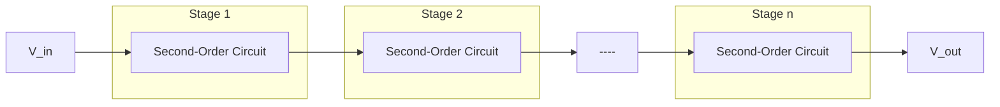
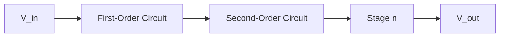
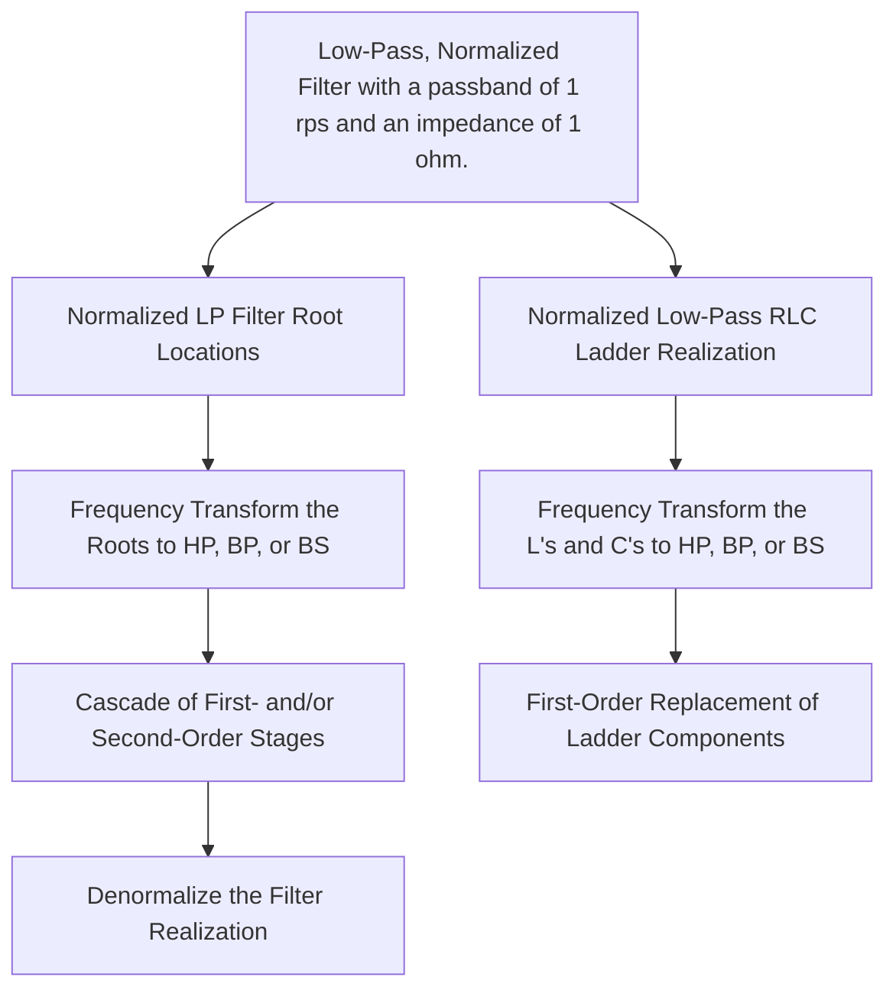
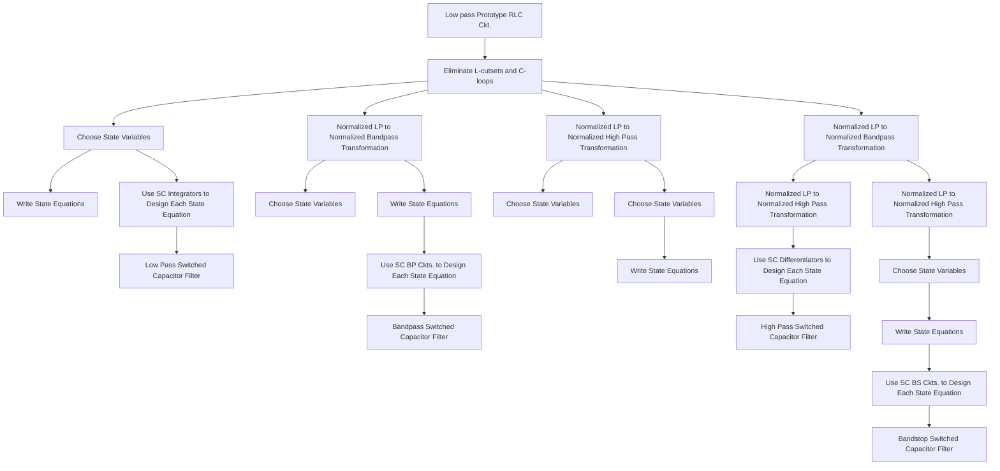

<!-- VIEWER-ONLY verbatim slice of CMOS_Analog_Circuit_Design_-_Allen_Holberg_mineru.md lines 7496-13705. NOT authoritative; all gold coordinates point at CMOS_Analog_Circuit_Design_-_Allen_Holberg_mineru.md. -->
# Chapter 9 - Switched Capacitor Circuits

Until the early 1970’s, analog signal processing circuits used continuous time circuits consisting of resistors, capacitors and op amps. Unfortunately, the absolute tolerances of resistors and capacitors available in standard CMOS technologies are not good enough to perform most analog signal processing functions. In the early $1 9 7 0 ^ { \circ } { \mathrm { s } } ,$ , analog sampled data techniques were used to replace the resistor resulting in circuits consisting of only MOSFET switches, capacitors and op amps [1,2]. These circuits are called switched capacitor circuits and have become a popular method of implementing analog signal processing circuits in standard CMOS technologies. One the important reasons for the success of switched capacitor circuits is that the accuracy of the signal processing function is proportional to the accuracy of capacitor ratios. We have seen in previous chapters that the relative accuracy of capacitors implemented on standard CMOS technology can be quite good. The primary advantages of switched capacitor circuits include (1) compatibility with CMOS technology, (2) good accuracy of time constants, (3) good voltage linearity, and (4) good temperature characteristics. The primary disadvantages are (1) clock feedthrough, (2) the requirement of a nonoverlapping clock, and (3) the bandwidth of the signal must be less than the clock frequency.

The important component of signal processing circuits are the signals. Signals can be characterized by their time and amplitude properties. From a time viewpoint, signals are categorized as continuous and discrete. A continuous time signal is defined for all time whereas a discrete time signal is defined only over a range of times (often only a point in time). Signals can also be continuous or discrete in amplitude. An analog signal is defined as a signal that is continuous in amplitude (can have all possible amplitude values). A digital signal is a signal that is defined only for certain amplitude values. For example, a binary digital signal has only two amplitude states normally designated as 1 and 0. Switched capacitor circuits are continuous in amplitude and discrete in time. They are often called analog sampled data circuits [3].

The concepts of switched capacitor circuits are introduced in this chapter. While a strong background on analog sampled data circuits and z-domain techniques would be helpful, the approach used in this chapter is based on standard circuit analysis methods for capacitive circuits. The first section focuses on the use of switched capacitor circuits to emulate resistors. We will only consider the basic, two-phase, non-overlapping clock schemes. The analysis methods will be developed in the next section. The following two sections applies the concepts to switched capacitor amplifiers followed by switched capacitor integrators. These two blocks form the basis of switched capacitor circuits. Next, we consider z-domain models for switched capacitor circuits. This will help in the analysis and design of switched capacitor circuits. Switched capacitor filter builiding blocks will be considered next. This will include first-order and second-order building blocks. Finally, the chapter concludes by examining aliasing and the methods that are used to prevent its influence on switched capacitor circuits.

# 9.1 Switched Capacitor Circuits

The basic concepts of transferring charge among capacitors will be given in this section. The emulation of resistors with circuits containing switches and capacitors will be developed. This will be followed by a review of circuit analysis techniques that allow the analysis of switched capacitor circuits. A first-order, low pass filter will be examined to illustrate the methods developed.

# Resistor Emulation

The first recorded use of switches and capacitors to emulate (measure) resistance is found in a text written by James Clerk Maxwell in 1873 [4]. On pages 420 through 425 he describes how to measure the resistance of a galvanometer by connecting it in series with a battery, ammeter and capacitor and periodically reversing the capacitor. Using a similar approach, we can illustrate how to emulate a resistor. Consider the switched capacitor circuit of Fig. 9.1-1(a). This configuration is called the parallel switched capacitor equivalent resistor. Next, we show how Fig. 9.1-1(a) is equivalent to the resistor R in Fig. 9.1-1(b.)


<details>
<summary>text_image</summary>

i₁(t) φ₁ φ₂ i₂(t)
S₁ S₂
v₁(t) v_C(t) v₂(t)
- - C -
</details>

(a.)


<details>
<summary>text_image</summary>

i₁(t)
R
i₂(t)
v₁(t)
+
-
v₂(t)
+
</details>

Figure 9.1-1 (a.) Parallel switched capacitor equivalent resistor. (b.) Continuous time resistor of value R.

The parallel switched capacitor equivalent resistor circuit in Fig. 9.1-1(a) consists two independent voltage sources, $\nu _ { 1 } ( t )$ and $\nu _ { 2 } ( t )$ , two controlled switches, $S _ { 1 }$ and $\mathbf { S } _ { 2 }$ and a capacitor, C. The switches, $S _ { 1 }$ and $S _ { 2 }$ are controlled by the clock waveforms. These clock waveforms are illustrated in Fig. 9.1-2. There are two clock waveforms, $\phi _ { 1 }$ and $\phi _ { 2 } .$ When a clock waveform has the value of 1, the switch is closed. When the value of the clock waveform is 0, the switch is open. Note, that $\phi _ { 1 }$ and $\phi _ { 2 }$ never have the value of 1 at the same time. This type of clock is called a nonoverlapping clock. The period of the clock waveforms in Fig. 9.1-2 is T. The width of each individual clock is slightly less than T/2.


<details>
<summary>bar</summary>

| Time | φ₁ | φ₂ |
|------|----|----|
| T/2  | 1  | 1  |
| T    | 1  | 1  |
| 3T/2 | 1  | 1  |
| 2T   | 0  | 0  |
</details>

Figure 9.1-2 - Waveforms of a typical two-phase, nonoverlapping clock scheme.

Assume that the voltages $\nu _ { 1 } ( t )$ and $\nu _ { 2 } ( t )$ in Fig. 9.1-1(a) do not change very much during the period of the clock, T. Thus, we can approximately assume that $\nu _ { 1 } ( t )$ and $\nu _ { 2 } ( t )$ clo are nearly constant during the time T. Now let us find the average value of the current, $i _ { 1 } ( t )$ , flowing from $\nu _ { 1 } ( t )$ into the capacitor C. The definition of the average current is

$$
i _ {1} (\text { average }) = \frac {1}{T} \int_ {0} ^ {T} i _ {1} (t) d t. \tag {1}
$$

Because, $i _ { 1 } ( t )$ only flows during the time $\begin{array} { r } { O \le t \le T / 2 } \end{array}$ , we can rewrite Eq. (1) as

$$
i _ {1} (\text { average }) = \frac {1}{T} \int_ {0} ^ {T / 2} i _ {1} (t) d t. \tag {2}
$$

However, we know that charge and current are related as follows.

$$
i _ {1} (t) = \frac {d q _ {1} (t)}{d t} \tag {3}
$$

Substituting Eq. (3) into Eq. (2) gives

$$
i _ {1} (\text { average }) = \frac {1}{T} \int_ {0} ^ {T / 2} d q _ {1} (t) = \frac {q _ {1} (T / 2) - q _ {1} (0)}{T}. \tag {4}
$$

The charge associated with a time-invariant capacitor is expressed as

$$
q _ {C} (t) = C v _ {C} (t). \tag {5}
$$

Substituting Eq. (5) into Eq. (4) gives the desired result of

$$
i _ {1} (\text { average }) = \frac {C [ v _ {C} (T / 2) - v _ {C} (0) ]}{T}. \tag {6}
$$

The clock waveforms of Fig. 9.1-2 applied to the parallel switched capacitor circuit of Fig. 9.1-1(a), show that the voltage $\nu _ { c } ( T / 2 )$ is equal to the value of $\nu _ { 1 } ( T / 2 )$ and the value of $\nu _ { c } ( \theta )$ is equal to the value of $\nu _ { 2 } ( O )$ . Therefore, Eq. (6) becomes

$$
i _ {1} (\text { average }) = \frac {C [ v _ {1} (T / 2) - v _ {2} (0) ]}{T}. \tag {7}
$$

However, if $\nu _ { 1 } ( t )$ and $\nu _ { 2 } ( t )$ are approximately constant over the period T, then

$$
v _ {1} (0) \approx v _ {1} (T / 2) \approx v _ {1} (T) \approx V _ {1} \tag {8}
$$

and

$$
v _ {2} (0) \approx v _ {2} (T / 2) \approx v _ {2} (T) \approx V _ {2}. \tag {9}
$$

$\nu _ { 1 } ( t )$ and $\nu _ { 2 } ( t )$ can be considered a constant over a clock period, T, if the signal frequency is much less than the clock frequency. Substituting the approximations of Eqs. (8) and (9) into Eq. (7) gives the average current flowing into the capacitor C as

$$
i _ {1} (\text { average }) = \frac {C (V _ {1} - V _ {2})}{T}. \tag {10}
$$

Now let us find the average current, i1(average), flowing into the resistor R of Fig. 9.1-1(b). This value is easily written as

$$
i _ {1} (\text { average }) = \frac {V _ {1} - V _ {2}}{R}. \tag {11}
$$

Equating the average currents of Eqs. (10) and (11) gives the desired result of

$$
\mathrm{R} = \frac {\mathrm{T}}{\mathrm{C}}. \tag {12}
$$

Eq. (12) shows that the parallel switched capacitor circuit of Fig. 9.1-1(a) is equivalent to a resistor if the changes in $\nu _ { 1 } ( t )$ and $\nu _ { 2 } ( t )$ can be neglected during the period T. It is noted that the parallel switched capacitor resistor emulation is a three-terminal network that emulates a resistance between two ungrounded terminals.

# Example 9.1-1

Design of a Parallel Switched Capacitor Resistor Emulation

If the clock frequency of Fig. 9.1-1(a) is 100kHz, find the value of the capacitor C that will emulate a 1MΩ resistor.

Solution

The period of a 100kHz clock waveform is 10µsec. Therefore, using Eq. (12) we get that

$$
C = \frac {T}{R} = \frac {1 0 ^ {- 5}}{1 0 ^ {6}} = 1 0 p F
$$

We know from previous considerations that the area required for 10pF capacitor is much less than for a 1MΩ resistor when implemented in CMOS technology.

Figure 9.1-3 shows three more switched capacitor circuits that can emulate a resistor. Fig. 9.1-3(a) is called a series switched capacitor resistor, Fig. 9.1-3(b) is called a seriesparallel switched capacitor resistor, and Fig. 9.1-3(c) is called the bilinear switched capacitor resistor . Note that the series and bilinear switched capacitor resistor circuits are two-terminal rather than three-terminal. It can be shown that the equivalent resistance of the series switched capacitor resistor circuit is given by Eq. (12). We will illustrate how to find the equivalent resistance of the series-parallel switched capacitor resistor circuit of Fig. 9.1-3(b).

For the series-parallel switched capacitor resistor of Fig. 9.1-3(b), we see that the current, $i _ { 1 } ( t )$ , flows during both the $\phi _ { 1 }$ and $\phi _ { 2 }$ clock half periods or phases. Therefore, we rewrite Eq. (1) as

$$
i _ {1} (\text { average }) = \frac {1}{T} \int_ {0} ^ {T} i _ {1} (t) d t = \frac {1}{T} \left(\int_ {0} ^ {T / 2} i _ {1} (t) d t + \int_ {T / 2} ^ {T} i _ {1} (t) d t\right). \tag {13}
$$

  
Figure 9.1-3 - Switched capacitor circuits that emulate a resistor. (a.) Series. (b.) Seriesparallel. (c.) Bilinear.

Using the result of Eq. (4) we can express the average value of $I _ { 1 }$ as

$$
i _ {1} (\text { average }) = \frac {1}{T} \int_ {0} ^ {T / 2} d q _ {1} (t) + \frac {1}{T} \int_ {T / 2} ^ {T} d q _ {1} (t) = \frac {q _ {1} (T / 2) - q _ {1} (0)}{T} + \frac {q _ {1} (T) - q _ {1} (T / 2)}{T}. \tag {14}
$$

Therefore, $i _ { 1 } ( a \nu e r a g e )$ can be written in terms of $C _ { 1 } , C _ { 2 } , \nu _ { C 1 }$ , and $\nu _ { C 2 }$ as

$$
i _ {1} (\text { average }) = \frac {C _ {2} \left[ v _ {C 2} (T / 2) - v _ {C 2} (0) \right]}{T} + \frac {C _ {1} \left[ v _ {C 1} (T) - v _ {C 1} (T / 2) \right]}{T}. \tag {15}
$$

$\mathrm { A t } t = 0 , T / 2$ , and T, the capacitors in the circuit have the voltage that was last across them before $S _ { 1 }$ and $S _ { 2 }$ opened. Thus the sequence of switches in Fig. 9.1-3(b) cause $\nu _ { C 2 } ( O ) =$ $V _ { 2 } , \nu _ { C 2 } ( T / 2 ) = V _ { 1 } , \nu _ { C 1 } ( T / 2 ) = { \cal O } _ { 5 }$ , and $\nu _ { C 1 } ( T ) = V _ { 1 } - V _ { 2 }$ . Applying these results to Eq. (15) gives

$$
i _ {1} (\text { average }) = \frac {C _ {2} \left[ V _ {1} - V _ {2} \right]}{T} + \frac {C _ {1} \left[ V _ {1} - V _ {2} - 0 \right]}{T} = \frac {\left(C _ {1} + C _ {2}\right) \left(V _ {1} - V _ {2}\right)}{T}. \tag {16}
$$

Equating Eqs. (11) and (16) gives the desired relationship which is

$$
R = \frac {T}{C _ {1} + C _ {2}}. \tag {17}
$$

# Example 9.1-2

# Design of a Series-Parallel Switched Capacitor Resistor Emulation

If C1 = C2 = C, find the value of C that will emulate a 1MΩ resistor if the clock frequency is 250kHz.

Solution

The period of the clock waveform is 4µsec. Using Eq. (17) we find that C is given as

$$
2 \mathrm{C} = \frac {\mathrm{T}}{\mathrm{R}} = \frac {4 \mathrm{x} 1 0 ^ {- 6}}{1 0 6} = 4 \mathrm{pF}
$$

Therefore, $\mathbf { C } 1 = \mathbf { C } 2 = \mathbf { C } = 2 \mathbf { p } \mathbf { F } .$

Table 9.1-1 summarizes the equivalent resistance of each of the four switched capacitor resistor emulation circuits that we have considered. It is significant to note that in each case, the emulated resistance is proportional to the reciprocal of the capacitance. This is the characteristic of switched capacitor circuits implemented in CMOS technology that yields much more accurate time constants than continuous time circuits.

Table 9.1-1   
Summary of the Emulated Resistance of Four Switched Capacitor Resistor Circuits. 

<table><tr><td>Switched Capacitor Resistor Emulation Circuit</td><td>Schematic</td><td>Equivalent Resistance</td></tr><tr><td>Parallel</td><td></td><td> $\frac{T}{C}$ </td></tr><tr><td>Series</td><td></td><td> $\frac{T}{C}$ </td></tr><tr><td>Series-Parallel</td><td></td><td> $\frac{T}{C_1 + C_2}$ </td></tr><tr><td>Bilinear</td><td></td><td> $\frac{T}{4C}$ </td></tr></table>

# Accuracy of Switched Capacitor Circuits

The frequency or time precision of an analog signal processing circuit is determined by the accuracy of the circuit time constants. To illustrate this, consider the simple firstorder, lowpass filter shown in Fig. 9.1-4. The voltage transfer function of this circuit in the frequency domain is

$$
H (j \omega) = \frac {V _ {2} (j \omega)}{V _ {1} (j \omega)} = \frac {1}{j \omega R _ {1} C _ {2} + 1} = \frac {1}{j \omega \tau_ {1} + 1} \tag {18}
$$

where

$$
\tau_ {1} = R _ {1} C _ {2}. \tag {19}
$$

$\tau _ { 1 }$ is called the time constant of the circuit. In order to compare the accuracy of a continuous time circuit with a discrete time, or switched capacitor circuit, let us designate $\tau _ { 1 }$ as $\tau _ { C } .$ . The accuracy of $\tau _ { C }$ can be expressed as

$$
\frac {d \tau_ {C}}{\tau_ {C}} = \frac {d R _ {1}}{R _ {1}} + \frac {d C _ {2}}{C _ {2}}. \tag {20}
$$

We see that the accuracy is equal to the sum of the accuracy of the resistor, $R _ { 1 } ,$ , and the accuracy of the capacitor, $C _ { 2 } .$ . In standard CMOS technology, the accuracy of $\tau _ { C }$ can vary between 5% to 20% depending on the type of components and their physical size. This accuracy is not good enough for most signal processing applications.


<details>
<summary>chemical</summary>

Simple RC circuit diagram with resistor R1 and capacitor C2, showing input v1 and output v2
</details>

Figure 9.1-4 - Continuous time, first-order, low pass circuit.

Now let us consider the case where the resistor, $R _ { 1 }$ , of Fig. 9.1-4 is replaced by one of the switched capacitor circuits of Table 9.1-1. For example, let us select the parallel switched capacitor emulation of $R _ { 1 } .$ . If we designate the time constant for this case as $\tau _ { D } ,$ , then the equivalent time constant can be written as

$$
\tau_ {D} = \left(\frac {T}{C _ {1}}\right) C _ {2} = \left(\frac {1}{f _ {c} C _ {1}}\right) C _ {2} \tag {21}
$$

where $f _ { c }$ is the frequency of the clock. The accuracy of $\tau _ { D }$ can be expressed as

$$
\frac {d \tau_ {D}}{\tau_ {D}} = \frac {d C _ {2}}{C _ {2}} - \frac {d C _ {1}}{C _ {1}} - \frac {d f _ {c}}{f _ {c}}. \tag {22}
$$

This is an extremely significant result. It states that the accuracy of the discrete time constant, $\tau _ { D } ,$ is equal to the relative accuracy of $C _ { 1 }$ and $\mathrm { C } _ { 2 }$ and the accuracy of the clock frequency. Assuming that the clock frequency is perfectly accurate, then the accuracy of $\tau _ { D }$ can be as small as 0.1% in standard CMOS technology. This accuracy is more than sufficient for most signal processing applications and is the primary reason for the widespread use of switched capacitor circuits in CMOS technology.

# Analysis Methods for Switched Capacitor Circuits using Two-phase, Nonoverlapping Clocks

Switched capacitor circuits are often called analog sampled data circuits because the signals are continuous in amplitude and discrete in time. An arbitrary continuous time voltage waveform, v(t), is shown on Fig. 9.1-5 by the gray line. At the time t = 0, T/2, T, $3 T / 2 , \ldots$ . this voltage has been sampled and held for a half-period (T/2). The sampled data waveform, $\nu ^ { * } ( t )$ , of Fig. 9.1-5(a) is typical of a switched capacitor waveform assuming that the input signal to the switched capacitor circuit has been sampled and held. The shaded and unshaded rectangles correspond to the $\phi _ { 1 }$ phase and the $\phi _ { 2 }$ phase, respectively, of the two-phase of the nonoverlapping clock of Fig. 9.1-2.

  
Figure 9.1-5 - (a.) A sampled data voltage waveform for a two-phase clock. (b.) Waveform for the odd clock (φ1). (c.) Waveform for the even clock (φ2).

It is clear from Fig. 9.1-5 that the Fig. 9.1-5(a) is equal to the sum of Figs. 9.1-5(b) and 9.1-5(c). This relationship can be expressed as

$$
v ^ {*} (t) = v ^ {o} (t) + v ^ {e} (t) \tag {23}
$$

where the superscript o denotes the odd phase $( \Phi _ { 1 } )$ and the superscript e denotes the even phase $( \Phi _ { 2 } )$ . For any given sample point, $t = n T / 2 , \mathrm { E q }$ . (23) may be expressed as

$$
v ^ {*} (n T / 2) = v ^ {o} \left((n - 1) \frac {T}{2}\right) + v ^ {e} \left((n - 1) \frac {T}{2}\right) \tag {24}
$$

where for the odd phase, $\mathbf { n } = 1 , 3 , 5 , \cdots$ and for the even phase, $\mathbf { n } = 2 , 4 , 6 , \cdots$ .

To examine switched capacitor circuits in the frequency domain, it is necessary to transform the sequence in the time domain to a z-domain equivalent expression. To illustrate, consider the one-sided z-transform of a sequence, v(nT), defined as [5]

$$
V (z) = \sum_ {n = 0} ^ {\infty} v (n T) z ^ {- n} = v (0) + v (T) z ^ {- 1} + v (2 T) z ^ {- 2} + \dots \tag {25}
$$

for all z for which the series $V ( z )$ converges. Now, Eq. (23) can be expressed in the zdomain as

$$
V ^ {*} (z) = V ^ {0} (z) + V ^ {e} (z). \tag {26}
$$

The z-domain format for switched capacitor circuits allows one to analyze transfer functions.

A switched capacitor circuit viewed from a z-domain viewpoint is shown in Fig. 9.1-6. Both, the input voltage , $V _ { i } ( z ) ,$ and output voltage, $V _ { o } ( z )$ , can be decomposed into its odd and even component voltages. Depending on whether the odd or even voltages are selected, there are four possible transfer functions. In general they are expressed as

$$
H ^ {i j} (z) = \frac {V _ {o} ^ {j} (z)}{V _ {i} ^ {i} (z)} \tag {27}
$$

where i and j can be either e or o. For example, $H ^ { e } ( z )$ represents $V _ { o } ^ { e } \left( z \right) / V _ { i } ^ { o } \left( z \right)$ . Also, a transfer function, H(z) can be defined as

$$
H (z) = \frac {V _ {o} (z)}{V _ {i} (z)} = \frac {V _ {o} ^ {e} (z) + V _ {o} ^ {o} (z)}{V _ {i} ^ {e} (z) + V _ {i} ^ {o} (z)}. \tag {28}
$$

$$
V _ {i} (z) = V _ {i} ^ {o} (z) + V _ {i} ^ {e} (z) \longrightarrow \boxed {\text { Switched Capacitor Circuit }} \longrightarrow V _ {o} (z) = V _ {o} ^ {o} (z) + V _ {o} ^ {e} (z)
$$

Figure 9.1-6 - Input-output voltages of a general switched capacitor circuit in the z-domain.

The analysis approach for switched capacitor circuits using a two-phase, nonoverlapping clock consists of analyzing the circuit in the time-domain during a selected phase period. Because the circuit consists of only capacitors (charged and uncharged) and voltage sources, the equations are easy to derive using simple algebraic methods. Once the selected phase period has been analyzed, then the following phase period is analyzed carrying over the initial conditions from the previous analysis. At this point, a time-domain equation can be found that relates the output voltage during the second period to the inputs during either of the phase periods. Next, the time-domain equation is converted to the z-domain using Eq. (25). The desired z-domain transfer function can be found from this expression. The following example will illustrate this approach.

It is convenient to associate a point in time with each clock phase. The obvious choices are at the beginning of the clock phase or the end of the clock phase. We will arbitrarily choose the beginning of the clock phase. However, one could equally well choose the end of the clock phase. The key is to be consistent thoughout a given analysis. In the following example, the time point is selected as the beginning of the phase period as indicated by the single parenthesis in Fig. 9.1-7b associating the beginning of the phase period with that phase period.

# Example 9.1-3

# Analysis of a Switched Capacitor, First-order, Lowpass Filter

Use the above approach to find the z-domain transfer function of the first-order, lowpass switched capacitor circuit shown in Fig. 9.1-7a. This circuit was developed by replacing the resistor, $R _ { 1 } ,$ of Fig. 9.1-4 with the parallel switched capacitor resistor circuit of Table 9.1-1. Fig. 9.1-7b gives the timing of the clocks. This timing is arbitrary and is used to assist the analysis and does not change the result.


<details>
<summary>chemical</summary>

Electrical circuit diagram with capacitors and switches labeled C1, C2, φ1, φ2, v1, v2
</details>

(a.)


<details>
<summary>text_image</summary>

φ₂ φ₁ φ₂ φ₁ φ₂
n-3/2 n-1 n-1/n n+1/n+1 → t/T
</details>

(b.)   
Figure 9.1-7 (a.) Switched capacitor, lowpass filter. (b.) Clock phasing.

# Solution

Let us begin with the $\phi _ { 1 }$ phase during the time interval from (n-1)T to (n-1/2)T. Fig. 9.1-8a is the equivalent of Fig. 9.1-7a during this time period. During this time period, $C _ { 1 } ,$ , is charged to $\nu _ { 1 } ^ { o } ~ ( n \mathrm { - } 1 ) T$ . However, $C _ { 2 } ,$ , remains at the voltage of the previous period, $\nu _ { 2 } ^ { e } ( n - 3 / 2 ) T .$ Fig. 9.1-8(b) show a useful simplification to Fig. 9.1-8a by replacing $C _ { 2 }$ which has been charged to $\nu _ { 2 } ^ { e } ( n \mathrm { - } 3 / 2 ) T$ by an uncharged capacitor, $C _ { 2 } ,$ in series with a voltage source of $\nu _ { 2 } ^ { e } ( n - 3 / 2 ) T .$ . This voltage source is a step function that starts at $t = ( n { - } 3 / 2 ) \mathrm { T }$ . Because there is no voltage across $C _ { 2 } ,$ then

$$
v _ {2} ^ {o} (n - 1) T = v _ {2} ^ {e} (n - 3 / 2) T. \tag {29}
$$


<details>
<summary>chemical</summary>

Electrical circuit diagram with capacitors and voltage labels
</details>

(a.)


<details>
<summary>chemical</summary>

Electrical circuit diagram with capacitors and voltage labels
</details>

(b.)   
Figure 9.1-8 (a.) Equivalent circuit of Fig. 9.1-7(a.) during the period from $t \ : =$ (n-1)T to $t = ( n { - } 3 / 2 ) T .$ (b.) Simplified equivalent of Fig. 9.1-8(a.).

Now, let us consider the next clock period, $\phi _ { 2 } ,$ during the time from $t = ( n \mathrm { - } 1 / 2 ) T$ to $t = n T$ . The equivalent circuit of Fig. 9.1-7a during this period is shown in Fig. 9.1-9. We see that $C _ { 1 }$ with its previous charge of $\nu _ { 1 } ^ { o } ( n \mathrm { - } 1 ) T$ is connected in parallel with $C _ { 2 }$ which has the voltage given by Eq. (29). Thus, the output of Fig. 9.1-9 can be expressed as the superposition of two voltage sources, $\nu _ { 1 } ^ { o } ~ ( n \mathrm { - } 1 ) T$ and $\nu _ { 2 } ^ { o } ~ ( n \mathrm { - } 1 ) T$ given as

$$
v _ {2} ^ {e} (n - 1 / 2) T = \left(\frac {C _ {1}}{C _ {1} + C _ {2}}\right) v _ {1} ^ {o} (n - 1) T + \left(\frac {C _ {2}}{C _ {1} + C _ {2}}\right) v _ {2} ^ {o} (n - 1) T. \tag {30}
$$

If we advance Eq. (29) by one full period, T, it can be rewritten as

$$
v _ {2} ^ {o} (n) T = v _ {2} ^ {e} (n - 1 / 2) T. \tag {31}
$$

Substituting, Eq. (30) into $\operatorname { E q . }$ (31) yields the desired result given as

$$
v _ {2} ^ {o} (n T) = \left(\frac {C _ {1}}{C _ {1} + C _ {2}}\right) v _ {1} ^ {o} (n - 1) T + \left(\frac {C _ {2}}{C _ {1} + C _ {2}}\right) v _ {2} ^ {o} (n - 1) T. \tag {32}
$$


<details>
<summary>chemical</summary>

Electrical circuit diagram with capacitors C1 and C2, showing voltage and current labels
</details>

Figure 9.1-9 - Equivalent circuit of Fig. 9.1-7a during the time from $t = ( n { - } 1 / 2 ) T$ to t $= n T .$ .

The next step is to write the z-domain equivalent expression for Eq. (32). This can be done term by term using the sequence shifting property given as

$$
v (n - n _ {1}) T \leftrightarrow z ^ {n _ {1} T} V (z). \tag {33}
$$

The result is

$$
z ^ {n T} V _ {2} ^ {o} (z) = \left(\frac {C _ {1}}{C _ {1} + C _ {2}}\right) z ^ {(n - 1) T} V _ {1} ^ {o} (z) + \left(\frac {C _ {2}}{C _ {I} + C _ {2}}\right) z ^ {(n - 1) T} V _ {2} ^ {o} (z). \tag {34}
$$

Factoring out $z ^ { n T }$ , gives

$$
V _ {2} ^ {o} (z) = \left(\frac {C _ {1}}{C _ {1} + C _ {2}}\right) z ^ {- T} V _ {1} ^ {o} (z) + \left(\frac {C _ {2}}{C _ {1} + C _ {2}}\right) z ^ {- T} V _ {2} ^ {o} (z). \tag {35}
$$

Assume that T = 1 second so that Eq. (35) becomes,

$$
V _ {2} ^ {o} (z) = \left(\frac {C _ {1}}{C _ {1} + C _ {2}}\right) z ^ {- 1} V _ {1} ^ {o} (z) + \left(\frac {C _ {2}}{C _ {1} + C _ {2}}\right) z ^ {- 1} V _ {2} ^ {o} (z). \tag {36}
$$

Finally, solving for $V _ { 2 } ^ { o } ( z ) / V _ { 1 } ^ { o } ( z )$ gives the desired z-domain transfer function for the switched capacitor circuit of Fig. 9.1-7a as

$$
H ^ {o o} (z) = \frac {V _ {2} ^ {o} (z)}{V _ {1} ^ {o} (z)} = \frac {z ^ {- 1} \left(\frac {C _ {1}}{C _ {1} + C _ {2}}\right)}{1 - z ^ {- 1} \left(\frac {C _ {2}}{C _ {1} + C _ {2}}\right)} = \frac {z ^ {- 1}}{1 + \alpha - \alpha z ^ {- 1}} \tag {37}
$$

where

$$
\alpha = \frac {C _ {2}}{C _ {1}}. \tag {38}
$$

The above example illustrates the approach of finding the z-domain transfer function of switched capacitor circuits. In general, one tries to find the transfer function corresponding to even or odd phase at the output and input, i.e. $H ^ { o o } ( z )$ or $H ^ { e e } ( z )$ . However, in some cases, $H ^ { o e } ( z )$ or $H ^ { e o } ( z )$ is used.

The frequency response of a continuous time circuit can be found from the complex frequency transfer function, H(s), given as

$$
H (s) = \frac {V _ {\text {out}} (s)}{V _ {\text {in}} (s)} \tag {39}
$$

where s is the familiar complex frequency variable defined as

$$
s = \sigma + j \omega \tag {40}
$$

where  is the real part and  is the imaginary part of the complex frequency variable s. The s domain is shown in Fig. 9.1-10a. The continuous time frequency response is found when  = 0 or s = j . The z-domain variable is also a complex variable expressed as

$$
z = r e ^ {j \omega T} \tag {41}
$$

where r is the radius from the origin to a point,  is the radian frequency variable in radians per second and T is the clock period in seconds. The z domain is shown in Fig. 9.1-10b. The discrete time frequency response is found by letting r = 1. We see that the continuous time frequency response corresponds to the vertical axis of Fig. 9.1-10a and the discrete time frequency response corresponds to the unit circle of Fig. 9.1-10b. Therefore, to find the frequency response of a discrete time or switched capacitor circuit, we replace the z variable with $e ^ { j \bar { \omega } T }$ and evaluate the result as a function of . The following example will illustrate the method.


<details>
<summary>text_image</summary>

Continuous
time frequency
response
jω
ω = ∞
ω = 0
σ
ω = -∞
</details>


<details>
<summary>text_image</summary>

Discrete
time frequency
response
Imaginary Axis
+j1
r = 1
ω = 0
-1
ω = -∞
+1 Real Axis
-j1
</details>

Figure 9.1-10 (a.) Continuous frequency domain. (b.) Discrete frequency domain.

<!-- MinerU pages 221-240 -->

# Example 9.1-4

# Frequency Response of Example 9.1-3

Use the results of the previous example to find the magnitude and phase of the discrete time frequency response for the switched capacitor circuit of Fig. 9.1-7a.

Solution

The first step is to replace z in Eq. (37) by $e ^ { j \omega T }$ . The result is given below as

$$
H ^ {o o} \left(e ^ {j \omega T}\right) = \frac {e ^ {- j \omega T}}{1 + \alpha - \alpha e ^ {- j \omega T}} = \frac {1}{(1 + \alpha) e ^ {j \omega T} - \alpha} = \frac {1}{(1 + \alpha) c o s (\omega T) - \alpha + j (1 + \alpha) s i n (\omega T)} \tag {42}
$$

where we have used Eulers formula to replace $e ^ { j \omega T }$ by cos( T)+jsin( T). The magnitude of Eq. (42) is found by taking the square root of the square of the real and imaginary components of the denominator to give

$$
\begin{array}{l} | H ^ {o o} | = \frac {1}{\sqrt {(1 + \alpha) ^ {2} c o s ^ {2} (\omega T) - 2 \alpha (1 + \alpha) c o s (\omega T) + \alpha^ {2} + (1 + \alpha) ^ {2} s i n ^ {2} (\omega T)}} \\ = \frac {1}{\sqrt {(1 + \alpha) ^ {2} [ c o s ^ {2} (\omega T) + s i n ^ {2} (\omega T) ] + \alpha^ {2} - 2 \alpha (1 + \alpha) c o s (\omega T)}} \\ = \frac {1}{\sqrt {1 + 2 \alpha + 2 \alpha^ {2} - 2 \alpha (1 + \alpha) \cos (\omega T)}} = \frac {1}{\sqrt {1 + 2 \alpha (1 + \alpha) (1 - \cos (\omega T))}}. \tag {43} \\ \end{array}
$$

The phase shift of Eq. (42) is expressed as

$$
\operatorname{Arg} \left[ H ^ {o o} \right] = - \tan^ {- 1} \left[ \frac {(1 + \alpha) \sin (\omega T)}{(1 + \alpha) \cos (\omega T) - \alpha} \right] = - \tan^ {- 1} \left[ \frac {\sin (\omega T)}{\cos (\omega T) - \frac {\alpha}{1 + \alpha}} \right] \tag {44}
$$

Once the frequency response of the switched capacitor circuit has been found, it is necessary to design any of the circuit parameters. In the previous two examples,  which is the ratio of $C _ { 2 }$ to $C _ { 1 } ,$ , is a circuit parameter. The design is typically done by assuming that the frequency of the signal applied to the switched capacitor circuit is much less than the clock frequency. This is called the oversampling assumption. It is expressed as

$$
f _ {\text { signal }} <   <   f _ {\text { clock }}. \tag {45}
$$

If we let $f _ { s i g n a l }$ be represented as $f ,$ then we may rewrite the inequality of Eq. (45) as

$$
f _ {\text { signal }} = f <   <   \frac {1}{T}. \tag {46}
$$

Multiplying Eq. (46) by 2π gives

$$
2 \pi f = \omega <   <   \frac {2 \pi}{T} \tag {47}
$$

or

$$
\omega T <   <   2 \pi . \tag {48}
$$

If we use the oversampling assumption of Eq. (48), then T is much less than 2π and we can simplify the discrete time frequency response and equate it to the continuous time frequency response to find values for the circuit parameters. The following example illustrates this approach and completes the frequency analysis of Fig. 9.1-7a.

# Example 9.1-5

# Design of Switched Capacitor Circuit and Resulting Frequency Response

Design the first-order, lowpass, switched capacitor circuit of Fig. 9.1-7a to have a -3dB frequency at 1kHz. Assume that the clock frequency is 20kHz (The clock frequency should be higher but for illustration purposes we have chosen 20kHz.) Plot the frequency response for the resulting discrete time circuit and compare with a first-order, lowpass, continuous time filter.

# Solution

If we assume that T is less than unity, then cos( T) approaches 1 and sin( T) approaches T. Substituting these approximations into the magnitude response of Eq. (42) results in

$$
\mathrm{H} ^ {o o} \left(e ^ {j \omega T}\right) \approx \frac {1}{(1 + \alpha) - \alpha + \mathrm{j} (1 + \alpha) \omega T} = \frac {1}{1 + \mathrm{j} (1 + \alpha) \omega T}. \tag {49}
$$

Comparing this equation to Eq. (18) results in the following relationship which permits the design of the circuit parameter .

$$
\omega \tau_ {1} = (1 + \alpha) \omega T \tag {50}
$$

Solving for  gives

$$
\alpha = \frac {\tau_ {1}}{T} - 1 = f _ {c} \tau_ {1} - 1 = \frac {f _ {c}}{\omega_ {- 3 d B}} - 1 = \frac {\omega_ {c}}{2 \pi \omega_ {- 3 d B}} - 1. \tag {51}
$$

Using the values given in the example, we see that  = (20/6.28)-1 =2.1831. Therefore, $C _ { 2 } = 2 . 1 8 3 1 C _ { 1 }$ .

The magnitude and phase response of the continuous and discrete time, firstorder, lowpass circuits are shown on Fig. 9.1-11. We note that for  small, both the continuous time, H(j ), and discrete time, $H ^ { o o } e ^ { j \omega T }$ frequency responses are almost identical. However, as  increases, the discrete time frequency response deviates from the continuous time response. An important characteristic of a discrete time frequency magnitude response in Fig. 9.1-11a, is that it is repeated at the clock frequency and each harmonic of the clock frequency. Thus, we note that $\omega = 0 . 5 \omega _ { c } ,$ that the discrete time magnitude response reaches a minimum and increases back to the value at $\omega _ { c }$ that it had at $\omega = 0 .$ Because, $\omega _ { I } \left( = 2 0 0 0 \pi \right)$ is not much less than $\omega _ { c } ,$ the discrete time response deviates even at the -3dB frequency. This match could be improved by simply choosing a higher clock frequency such as 100kHz. The phase response shows good match between the two circuits at frequencies below $0 . 1 \omega _ { \mathrm { c } } .$ Above that frequency, the discrete time phase response becomes much larger than the continuous time phase response. The discrete time phase response at ${ \mathfrak { O } } _ { \mathrm { c } }$ is similar to that at $\Theta = 0$ , however the phase shifted by an amount of $- 3 6 0 ^ { \circ } \mathrm { o r } - 2 \pi$ .


(a.)   


<details>
<summary>line</summary>

| ω/ω_c | Phase Shift (Degrees) |
|-------|------------------------|
| 0.0   | 0                      |
| 0.1   | -80                    |
| 0.2   | 80                     |
| 0.3   | -80                    |
| 0.4   | 50                     |
| 0.5   | 0                      |
| 0.6   | -50                    |
| 0.7   | -100                   |
| 0.8   | -100                   |
| 0.9   | 80                     |
| 1.0   | 0                      |
</details>

(b.)   
Figure 9.1-11 Frequency response of the continuous time low pass filter of Fig. 9.1-4 and the discrete time low pass filter of Fig. 9.1-7a. (a.) Magnitude response. (b.) Phase response.

The analysis of Fig. 9.1-7a illustrated through Examples 9.1-3, 9.1-4, and 9.1-5 show how to analyze a general discrete-time circuit. If the discrete time circuits become very complex, this method can be tedious and error-prone. Fortunately, most switched capacitor circuits are closely associated with op amps which reduces the complexity and results in circuits that are similar in complexity compared to the one illustrated above. The problems at the end of the chapter will provide other analysis opportunities.

# 9.2 Switched Capacitor Amplifiers

In this section, the use of switched capacitors for amplification will be presented. This class of circuits will use the op amp with negative feedback to achieve gains that are proportional to the ratios of capacitors. We will begin with amplifiers using resistor feedback. These amplifiers will serve as the basis for switched capacitor amplifiers. The influence of the op amp open-loop gain and unity-gainbandwidth on these amplifiers will be examined.

# Continuous Time Amplifiers

Figure 9.2-1 shows the familiar noninverting and inverting amplifiers using resistors and op amps. The ideal gain of both circuits can be easily be found [6]. For the noninverting amplifier of Fig. 9.2-1a, the ideal gain is

$$
\frac {v _ {O U T}}{v _ {I N}} = \frac {R _ {1} + R _ {2}}{R _ {1}} \tag {1}
$$

and for the inverting amplifier of Fig. 9.2-1b, the ideal gain is

$$
\frac {v _ {O U T}}{v _ {I N}} = - \frac {R _ {2}}{R _ {1}}. \tag {2}
$$

The results of Eqs. (1) and (2) assume that the differential gain of the op amps in Fig. 9.2-1 approach infinity.


<details>
<summary>text_image</summary>

R₁ R₂ vₐₐₜ
vₐₙ - +
+
</details>

(a.)


<details>
<summary>text_image</summary>

vIN R1 R2 vOUT
- +
(b)
</details>

(b.)   
Figure 9.2-1 - (a.) Continuous time noninverting amplifier. (b.) Continous time inverting amplifier.

Figure 9.2-1 - (a.) Continuous time noninverting amplifier. (b.) Continuous time inverting amplifier.

The influence of a finite gain and finite unity-gainbandwidth can be seen by replacing the op amps of Fig. 9.2-1 with a the voltage-controlled, voltage source model shown in Fig. 9.2-2. The voltage gain, $A _ { \nu d } ( s )$ is a function of the complex frequency variable, s, and is given as

$$
A _ {v d} (s) = \frac {A _ {v d} (0) \omega_ {a}}{s + \omega_ {a}} = \frac {G B}{s + \omega_ {a}} \approx \frac {G B}{s} \quad \text { if } \omega > > \omega_ {a} \tag {3}
$$

where $A _ { \nu d } ( 0 )$ is the low-frequency differential voltage gain, GB is the unitygainbandwidth, and $\omega _ { a }$ is the -3dB frequency of the op amp. The influence of $A _ { \nu d } ( 0 )$ can be examined by letting s in Eq. (3) approach zero. Solving for the voltage gains of the op amp configurations in Fig. 9.2-2 with $A _ { \nu d } ( s )$ equal $A _ { \nu d } ( 0 )$ gives the following results. For the noninverting amplifier we obtain,


<details>
<summary>text_image</summary>

R₁
R₂
vₒᵤₜ
vᵢ
Aᵥd(s)ᵥᵢ
vᵢₙ
+
-
( )
</details>


<details>
<summary>text_image</summary>

vIN
R1
R2
vOUT
-
vi
+
Avd(s)vi
+
-
-
</details>

Figure 9.2-2 - Model for the (a.) noninverting and (b.) inverting voltage amplifiers that includes finite gain and finite unity-gainbandwidth.

$$
\frac {V _ {\text {out}}}{V _ {\text {in}}} = \frac {A _ {v d} (0)}{1 + \frac {A _ {v d} (0) R _ {1}}{R _ {1} + R _ {2}}} = \left(\frac {R _ {1} + R _ {2}}{R _ {1}}\right) \frac {\frac {A _ {v d} (0) R _ {1}}{R _ {1} + R _ {2}}}{1 + \frac {A _ {v d} (0) R _ {1}}{R _ {1} + R _ {2}}} = \left(\frac {R _ {1} + R _ {2}}{R _ {1}}\right) \frac {L G}{1 + L G} \tag {4}
$$

where the magnitude of the feedback loop gain, LG, is given as

$$
L G = \frac {A _ {v d} (0) R _ {1}}{R _ {1} + R _ {2}}. \tag {5}
$$

The result for the inverting amplifier is,

$$
\frac {V _ {\text {out}}}{V _ {\text {in}}} = \frac {\frac {- R _ {2} A _ {v d} (0)}{R _ {1} + R _ {2}}}{1 + \frac {A _ {v d} (0) R _ {1}}{R _ {1} + R _ {2}}} = - \left(\frac {R _ {2}}{R _ {1}}\right) \frac {\frac {R _ {1} A _ {v d} (0)}{R _ {1} + R _ {2}}}{1 + \frac {A _ {v d} (0) R _ {1}}{R _ {1} + R _ {2}}} = - \left(\frac {R _ {2}}{R _ {1}}\right) \frac {L G}{1 + L G}. \tag {6}
$$

It is noted that as $A _ { \nu d } ( 0 )$ or LG becomes large, that Eqs. (4) and (6) approach Eqs. (1) and (2), respectively.

# Example 9.2-1

# Accuracy Limitation of Voltage Amplifiers due to a Finite Voltage Gain

Assume that the voltage amplifiers of Fig. 9.2-1 have been designed for a voltage gain of +10 and -10. If $A _ { \nu d } ( 0 )$ is 1000, find the actual voltage gains for each amplifier.

# Solution

For the noninverting amplifier, the ratio of $R _ { 2 } / R _ { 1 }$ is 9. Therefore, from Eq. (5) the feedback loop gain becomes $L G = 1 0 0 0 / ( 1 + 9 ) = 1 0 0$ . From Eq. (4), the actual gain is $1 0 ( 1 0 0 / 1 0 1 ) = 9 . 9 0 1$ rather than 10. For the inverting amplifier, the ratio of ${ R _ { 2 } } / { R _ { 1 } }$ is 10. In this case, the feedback loop gain is $L G = 1 0 0 0 / ( 1 { + } 1 0 ) = 9 0 . 9 0 9$ . Substituting this value in Eq. (6) gives an actual gain of -9.891 rather than -10.

A finite value of $A _ { \nu d } ( 0 )$ in Eq. (3) will influence the accuracy of the amplifiers gain at dc and low frequencies. As the frequency increases, a finite value of GB in Eq. (3) will influence the amplifier’s frequency response. Before repeating the above analysis, let us assume that  is much greater than $\omega _ { a }$ so that we may use the approximation for $A _ { \nu d } ( s )$ given in Eq. (3), i.e. $A _ { \nu d } ( s ) \approx G B / s$ . Replacing $A _ { \nu d } ( 0 )$ in Eqs. (4) and (6) by GB/s results in the following expression for the noninverting amplifier

$$
\frac {V _ {\text {out}} (s)}{V _ {\text {in}} (s)} = \left(\frac {R _ {1} + R _ {2}}{R _ {1}}\right) \frac {\frac {G B \cdot R _ {1}}{R _ {1} + R _ {2}}}{s + \frac {G B \cdot R _ {1}}{R _ {1} + R _ {2}}} = \left(\frac {R _ {1} + R _ {2}}{R _ {1}}\right) \frac {\omega_ {H}}{s + \omega_ {H}} \tag {7}
$$

where $\omega _ { H }$ is the upper -3dB frequency and is given as

$$
\omega_ {H} = \frac {G B \cdot R _ {1}}{R _ {1} + R _ {2}}. \tag {8}
$$

The equivalent expression for the inverting amplifier is given below.

$$
\frac {V _ {\text { out }} (s)}{V _ {\text { in }} (s)} = \left(- \frac {R _ {2}}{R _ {1}}\right) \frac {\frac {G B \cdot R _ {1}}{R _ {1} + R _ {2}}}{s + \frac {G B \cdot R _ {1}}{R _ {1} + R _ {2}}} = \left(- \frac {R _ {2}}{R _ {1}}\right) \frac {\omega_ {H}}{s + \omega_ {H}} \tag {9}
$$

# Example 9.2-2

# -3dB Frequency of Voltage Amplifiers due to Finite Unity-Gainbandwidth

Assume that the voltage amplifiers of Fig. 9.2-1 have been designed for a voltage gain of +1 and -1. If the unity-gainbandwidth, GB, of the op amps in Fig. 9.2-1 are 2πMrads/sec, find the upper -3dB frequency for each amplifier.

# Solution

In both cases, the upper -3dB frequency is given by Eq. (8). However, for the noninverting amplifier with an ideal gain of +1, the value of ${ R _ { 2 } } / { R _ { 1 } }$ is zero. Therefore, the upper -3dB frequency, $\omega _ { H } ,$ is equal to G B or 2πMrads/sec (1Mhz). For the inverting amplifier with an ideal gain of -1, the value of $R _ { 2 } / R _ { 1 }$ is one. Therefore, $\omega _ { H }$ is equal to GB/2 or πMrads/sec (500kHz).

# Charge Amplifiers

Before we consider switched capacitor amplifiers, let us examine a category of amplifiers called charge amplifiers. Charge amplifiers simply replace the resistors of Fig. 9.2-1 by capacitors resulting in Fig. 9-2-3. All the relationships summarized above hold if the resistor is replaced by the reciprocal capacitor. For example, the influence of the low-frequency, differential voltage gain, $A _ { \nu d } ( 0 )$ , given in Eqs. (4), (5) and (6) become

$$
\frac {V _ {\text {out}}}{V _ {\text {in}}} = \left(\frac {C _ {1} + C _ {2}}{C _ {2}}\right) \frac {L G}{1 + L G}, \tag {10}
$$


<details>
<summary>text_image</summary>

C₁
C₂
vOUT
vIN
-
</details>


<details>
<summary>text_image</summary>

vIN
C1
C2
vOUT
- +
+
</details>

Figure 9.2-3 - (a.) Noninverting charge amplifier. (b.) Inverting charge amplifier.

$$
L G = \frac {A _ {v d} (0) C _ {2}}{C _ {1} + C _ {2}}, \tag {11}
$$

and

$$
\frac {V _ {\text { out }}}{V _ {\text { in }}} = - \left(\frac {C _ {1}}{C _ {2}}\right) \frac {L G}{1 + L G}, \tag {12}
$$

respectively. The influence of the unity-gainbandwidth, GB, given in Eqs. (7), (8), and (9) becomes

$$
\frac {V _ {\text { out }} (s)}{V _ {\text { in }} (s)} = \left(\frac {C _ {1} + C _ {2}}{C _ {2}}\right) \frac {\omega_ {H}}{s + \omega_ {H}}, \tag {13}
$$

$$
\omega_ {H} = \frac {G B \cdot C _ {2}}{C _ {1} + C _ {2}}, \tag {14}
$$

and

$$
\frac {V _ {\text { out }} (s)}{V _ {\text { in }} (s)} = \left(- \frac {C _ {1}}{C _ {2}}\right) \frac {\omega_ {H}}{s + \omega_ {H}}. \tag {15}
$$

The major difference between the charge amplifiers of Fig. 9.2-3 and the voltage amplifiers of Fig. 9.2-1 occurs as a function of time. If the inputs to the charge amplifiers remains constant, eventually the leakage currents will cause the voltage across the capacitors to change. This will result in the output voltage of the op amp becoming equal to either its plus or minus limit. At this point, the feedback loop around the op amp is no longer active and the above equations no longer hold. Thus, one of the requirements for charge amplifiers is that voltage across the capacitor is redefined often enough so that leakage currents have no influence. It turns out in switched capacitor circuits that the voltages are redefined at least once every clock cycle. Therefore, charge amplifiers find use in switched capacitor circuits as voltage amplifiers.

# Switched Capacitor Amplifiers

At first thought, it may seem like the charge amplifiers above can serve as amplifiers for switched capacitor circuits. While this is true there are several reasons for examining a switched capacitor amplifier that uses op amps, switches, and capacitors. The first is that there is a difference between the performance of switched capacitor amplifiers and charge amplifiers. Secondly, switched capacitor amplifiers are a natural step in the development of switched capacitor integrators which are an important objective of this chapter. For the present, we will consider only a switched capacitor implementation of the inverting voltage amplifier of Fig. 9.2-1b.

Figure 9.2-4 shows the evolution of an inverting switched capacitor amplifier. The resistors of the inverting voltage amplifier of Fig. 9.2-1b are replaced by the parallel switched capacitor resistor emulation of Fig. 9.1-1 or of Table 9.1-1 resulting in Fig. 9.2- 4a. Unfortunately, during the $\phi _ { 2 }$ phase period, the feedback loop around the op amp is broken. This is undesirable and causes the output voltage of the op amp to needlessly fluctuate. It turns out that if we select the bilinear switched capacitor resistor emulation for $R _ { 2 } ,$ that this problem is avoided. However, the bilinear switched capacitor resistor emulation requires four more switches. Instead, we chose a slight modification of the series switched capacitor resistor emulation as shown in Fig. 9.2-4b. In this case we have kept the $\phi _ { 2 }$ switch of the series switched capacitor resistor emulation closed during the clock cycle which means that this switch is not needed.


<details>
<summary>text_image</summary>

vin
φ1
+
vc1
-
C1
φ2
+
vc2
-
C2
φ1
vout
(a.)
</details>


<details>
<summary>text_image</summary>

vin
φ1
+
vc1
-
C1
φ2
-
vc2
+
C2
-
+
(b.)
</details>

Figure 9.2-4 - (a.) Switched capacitor voltage amplifier using the parallel resistor emulation. (b.) Modification of Fig. 9.2-4(a.) to make the amplifier practical.

The switched capacitor voltage amplifier of Fig. 9.2-4b can be analyzed using the methods illustrated in the previous section. It turns out that the op amp will make the analysis simpler because it reduces the number of floating nodes to zero. Let us use the clock phasing shown in Fig. 9.1-7b to guide the analysis. We begin with the $\phi _ { 1 }$ phase period during the time interval from (n-1)T to (n-1/2)T. We see that during this time, $C _ { 1 }$ is charged to $\nu _ { i n } ^ { o } ( n { - } 1 ) T$ and $C _ { 2 }$ is discharged. Now, let us consider the next clock period, $\phi _ { 2 } ,$ during the time from $t = ( n { - } 1 / 2 ) T \tan t = n T$ . The equivalent circuit of Fig. 9.2-4b just at the moment that the $\phi _ { 2 }$ switch closes is shown in Fig. 9.2-5a. (For simplicity, this moment is assumed to be t = 0.) A more useful form of this circuit is given in Fig. 9.2-5b. In Fig. 9.2-5b, a step voltage source of $\nu _ { i n } ^ { o } ( n - 1 ) T$ is effectively applied to an inverting charge amplifier to yield the output voltage during the $\phi _ { 2 }$ phase period of

$$
v _ {o u t} ^ {e} (n - 1 / 2) T = - \left(\frac {C _ {1}}{C _ {2}}\right) v _ {i n} ^ {o} (n - 1) T. \tag {16}
$$

Converting Eq. (16) to its z-domain equivalent gives

$$
z ^ {- 1 / 2} V _ {o u t} ^ {e} (z) = - \left(\frac {C _ {1}}{C _ {2}}\right) z ^ {- 1} V _ {i n} ^ {o} (z). \tag {17}
$$

  
Figure 9.2-3 - (a.) Equivalent circuit of Fig. 9.2-4(b.) at the moment $\Phi _ { 2 }$ switch closes. (b.) Simplified equivalent of Fig. 9.2-5(a.).

Multiplying Eq. (17) by $z ^ { 1 / 2 }$ , gives

$$
V _ {o u t} ^ {e} (z) = - \left(\frac {C _ {1}}{C _ {2}}\right) z ^ {- 1 / 2} V _ {i n} ^ {o} (z). \tag {18}
$$

Solving for the even-odd transfer function gives,

$$
H ^ {o e} (z) = \frac {V _ {\text { out }} ^ {e} (z)}{V _ {\text { in }} ^ {o} (z)} = - \left(\frac {C _ {1}}{C _ {2}}\right) z ^ {- 1 / 2}. \tag {19}
$$

If we assume that applied input signal, $\nu _ { i n } ^ { o } ( n { - } 1 ) T ,$ , was unchanged during the previous $\phi _ { 2 }$ phase period (from t = (n-3/2)T to t = (n-1)T), then

$$
v _ {i n} ^ {o} (n - 1) T = v _ {i n} ^ {e} (n - 3 / 2) T \tag {20}
$$

which gives

$$
V _ {i n} ^ {o} (z) = z ^ {- 1 / 2} V _ {i n} ^ {e} (z). \tag {21}
$$

Substituting Eq. (21) into Eq. (18) gives

$$
V _ {o u t} ^ {e} (z) = - \left(\frac {C _ {1}}{C _ {2}}\right) z ^ {- 1} V _ {i n} ^ {e} (z) \tag {22}
$$

or

$$
H ^ {e e} (z) = \frac {V _ {\text { out }} ^ {e} (z)}{V _ {\text { in }} ^ {e} (z)} = - \left(\frac {C _ {1}}{C _ {2}}\right) z ^ {- 1}. \tag {23}
$$

As before, it is useful to compare the continuous time inverting amplifier of Fig. 9.2- 1b with the switched capacitor equivalent of Fig. 9.2-4b in the frequency domain. Let us first assume ideal op amps. The frequency response of Fig. 9.2-1b has a magnitude of $R _ { 2 } / R _ { 1 }$ and a phase shift of $\pm 1 8 0 ^ { \circ }$ . Both the magnitude and phase shift are independent of frequency. The frequency response of Fig. 9.2-4b is found by substituting for z by $e ^ { j \omega T }$ in Eq. (19) or Eq. (23). The result is

$$
H ^ {o e} \left(e ^ {j \omega T}\right) = \frac {V _ {\text { out }} ^ {e} \left(e ^ {j \omega T}\right)}{V _ {\text { in }} ^ {o} \left(e ^ {j \omega T}\right)} = - \left(\frac {C _ {1}}{C _ {2}}\right) e ^ {j \omega T / 2} \tag {24}
$$

for Eq. (19) and

$$
H ^ {e e} \left(e ^ {j \omega T}\right) = \frac {V _ {\text {out}} ^ {e} \left(e ^ {j \omega T}\right)}{V _ {\text {in}} ^ {e} \left(e ^ {j \omega T}\right)} = - \left(\frac {C _ {1}}{C _ {2}}\right) e ^ {- j \omega T} \tag {25}
$$

for Eq. (23). If $C _ { 1 } / C _ { 2 }$ is equal to ${ R _ { 2 } } / { R _ { 1 } }$ , then the magnitude response of Fig. 9.2-4b is identical to that of Fig. 9.2-1b. However, the phase shift of Eq. (24) is

$$
\operatorname{Arg} \left[ H ^ {o e} \left(e ^ {j \omega T}\right) \right] = \pm 1 8 0 ^ {\circ} - \omega T / 2 \tag {26}
$$

and the phase shift of Eq. (25) is

$$
\operatorname{Arg} \left[ H ^ {e e} \left(e ^ {j \omega T}\right) \right] = \pm 1 8 0 ^ {\circ} - \omega T. \tag {27}
$$

We see that the phase shift of the switched capacitor inverting amplifier starts out equal to the continuous time inverting amplifier, but experiences a linear phase delay in addition to the $\pm 1 8 0 ^ { \circ }$ phase shift. The excess negative phase shift of Eq. (27) is twice that of Eq. (26). The reader can confirm that when the signal frequency is one-half of the clock frequency that the excess negative phase shift from Eq. (26) is $9 0 ^ { \circ }$ and from Eq. (27) it is $1 8 0 ^ { \circ }$ . In most cases, the excess negative phase shift will not be important. However, if the switched capacitor inverting amplifier is placed in a feedback loop, the excess phase shift can become a critical factor in regard to stability.

In practice, the switched capacitor inverting amplifier of Fig. 9.2-4b is influenced by the parasitic capacitors shown in Fig. 2.4-3. The bottom plate parasitic is shorted out but the top plate parasitic adds directly to the value of $C _ { 1 }$ . We observe that the parasitics of $C _ { 2 }$ do not effect it. This is because one of the parasitic capacitors (i.e. the bottom plate) is in shunt with the op amp input which is a virtual ground and always has zero voltage across it. The other parasitic capacitor (i.e. the top plate) is in shunt with the output of the op amp and only serves as a capacitive load for the op amp.

Switched capacitor circuits have been developed that are insensitive to the capacitor parasitics [7]. Figure 9.2-6a and 9.2-6b show a positive and negative, switched capacitor transresistor equivalent circuit that are independent of the capacitor parasitics. These transresistors are two-port networks that take the voltage applied at one-port and create a current in the other port which has been short-circuited in this case. In our application, the short-circuited port is the port connected to the differential input of the op amp which is a virtual ground.

We see that if the switched capacitor circuits of Fig. 9.2-6 are used as transresistances, then the parasitic capacitors of C do not influence the circuit. When the $\phi _ { 1 }$ switches in Fig. 9.2-6a are closed, the parasitic capacitors, $C _ { P } ,$ are shorted out and can’t be charged. During the $\phi _ { 2 }$ phase, the parasitic capacitors are either connected in parallel with $\nu _ { 1 }$ or shorted out. Even though the left-hand parasitic capacitor is charged to a value of $\nu _ { 1 } .$ , this charge is shorted out during the next phase period, $\phi _ { 1 }$ .


<details>
<summary>text_image</summary>

i1(t)
+
v1(t)
-
φ2
+
C
vc(t)
-
φ2
i2(t)
φ1
CP
φ1
CP
CP
</details>


<details>
<summary>text_image</summary>

i₁(t)
φ₁
v₁(t)
+
-
C
φ₂
v_C(t)
+
-
φ₂
i₂(t)
CP
CP
</details>

Figure 9.2-6 - (a.) Positive and (b.) negative switched capacitor transresistance equivalent circuits.

We now show that Fig. 9.2-6b is equivalent to a negative transresistance of $T / C .$ The transresistance of Fig. 9.2-6 is defined as

$$
R _ {T} = \frac {v _ {1} (t)}{i _ {2} (t)} = \frac {v _ {1}}{i _ {2} (\text { average })}. \tag {28}
$$

In Eq. (28), we have assumed as before that $\nu _ { 1 } ( t )$ is approximately constant over one period of the clock frequency. Using the approach illustrated in Sec. 9.1, we can write

$$
i _ {2} (\text { average }) = \frac {1}{T} \int_ {T / 2} ^ {T} i _ {2} (t) d t = \frac {- q _ {2} (T) + q _ {2} (T / 2)}{T} = \frac {- C v _ {C} (T) + C v _ {C} (T / 2)}{T} = \frac {- C v _ {1}}{T}. \tag {29}
$$

Substituting Eq. (28) into Eq. (29) shows that $R _ { T } = - T / C$ . Similarly, it can be shown that the transresistance of Fig. 9.2-6a is T/C. These results are only valid when $f _ { c } > > f .$

Using the switched capacitor transresistances of Fig. 9.2-6 in the switched capacitor inverting amplifier of Fig. 9.2-4b, we can achieve both a noninverting and an inverting switched capacitor voltage amplifier that is independent of the parasitic capacitances of the capacitors. The resulting circuits are shown in Fig. 9.2-7. We should take careful notice of the fact that the only difference between Figs. 9.2-7a and 9.2-7b are the phasing of the left-most set of switches. Note we still use the $\phi _ { 1 } – C _ { 2 }$ circuit of Fig. 9.2-4b because the transresistance circuits of Fig. 9.2-6 would cause the feedback loop to be open during one of the clock phases. Although the circuits of Fig. 9.2-6 achieve the desired realization of switched capacitor voltage amplifiers, we must examine their performance more closely because they are slightly different from the previous circuit of Fig. 9.2-4b.


<details>
<summary>text_image</summary>

v_in φ_1 v_{C1}(t) φ_2
+ - v_{C2} v_out
φ_2 C_1 φ_1
- + C_2
</details>

(a.)


<details>
<summary>text_image</summary>

v_in φ_2
+ v_{C1}(t) φ_2
C_1 φ_1
φ_1
v_{C1}(t)
φ_1
v_{C2}
- v_out
C_2
+
-
+
-
</details>

(b.)   
Figure 9.2-7 - (a.) Noninverting and (b.) inverting switched capacitor voltage amplifiers that are insensitive to parasitic capacitors.

Let us first examine the noninverting voltage amplifier of Fig. 9.2-7a. Using the phasing of Fig. 9.1-7b, we begin with the $\phi _ { 1 }$ phase during the time from $t = ( n - 1 ) T \tan t =$ (n-1/2)T. The voltages across each capacitor can be written as

$$
v _ {C 1} ^ {o} (n - 1) T = v _ {i n} ^ {o} (n - 1) T \tag {30}
$$

and

$$
v _ {C 2} ^ {o} (n - 1) T = v _ {\text { out }} ^ {o} (n - 1) T = 0. \tag {31}
$$

During the $\phi _ { 2 }$ phase, the circuit is equivalent to the inverting charge amplifier of Fig. 9.2- 3b with a negative input of $\nu _ { i n } ^ { o } ( n \mathrm { - } 1 ) T$ applied. As a consequence, the output voltage can be written as

$$
v _ {o u t} ^ {e} (n - 1 / 2) T = \left(\frac {C _ {1}}{C _ {2}}\right) v _ {i n} ^ {o} (n - 1) T. \tag {32}
$$

The z-domain equivalent of Eq. (32) is

$$
V _ {\text { out }} ^ {e} (z) = \left(\frac {C _ {1}}{C _ {2}}\right) z ^ {- 1 / 2} V _ {\text { in }} ^ {o} (z) \tag {33}
$$

which is equivalent to Eq. (18) except for the sign. If the applied input signal, $\nu _ { i n } ^ { o } ( n \mathrm { - } 1 ) T ,$ , was unchanged during the previous $\phi _ { 2 }$ phase period, then Eq. (33) becomes

$$
V _ {o u t} ^ {e} (z) = \left(\frac {C _ {1}}{C _ {2}}\right) z ^ {- 1} V _ {i n} ^ {e} (z) \tag {34}
$$

which also is similar to Eq. (22) except for the sign. To summarize the comparison between Fig. 9.2-4b and Fig. 9.2-7a, we see that the magnitude is identical and the phase of Eqs. (26) and (27) is simply - T/2 and - T, respectively.

Next, let us examine Fig. 9.2-7b which is the inverting, voltage amplifier realization. We note that during the $\phi _ { 1 }$ phase, that both $C _ { 1 }$ and $C _ { 2 }$ are discharged. Consequently, there is no charged transferred between the $\phi _ { 1 }$ and $\phi _ { 2 }$ phase periods. During the $\phi _ { 2 }$ phase period, Fig. 9.2-7b is simply an inverting charge amplifier, similar to Fig. 9.2-3b. The output voltage during this phase period is written as

$$
v _ {o u t} ^ {e} (n - 1 / 2) T = - \left(\frac {C _ {1}}{C _ {2}}\right) v _ {i n} ^ {e} (n - 1 / 2) T. \tag {35}
$$

We note that the output voltage has no delay with respect to the input voltage. The zdomain equivalent expression is

$$
V _ {o u t} ^ {e} (z) = - \left(\frac {C _ {1}}{C _ {2}}\right) V _ {i n} ^ {e} (z). \tag {36}
$$

Thus, the parasitic insensitive, inverting voltage amplifier is equivalent to an inverting charge amplifier during the phase where $C _ { 1 }$ is connected between the input and the inverting input terminal of the op amp. Compared with Fig. 9.2-4b which is characterized by Eqs. (19) or (23), Fig. 9.2-7b has the same magnitude response but has no excess phase delay.

# Example 9.2-3

# Design of a Switched Capacitor Summing Amplifier

Design a switched capacitor summing amplifier using the circuits in Fig. 9.2-7 to which gives the output voltage during the $\phi _ { 2 }$ phase period that is equal to $1 0 \nu _ { 1 } \cdot$ - $5 \nu _ { 2 }$ , where $\nu _ { 1 }$ and $\nu _ { 2 }$ are held constant during $\textbf { a } \phi _ { 2 } { \cdot } \phi _ { 1 }$ period and then resampled for the next period.

# Solution

Because the inverting input of the op amps in Fig. 9.2-7 is at a virtual ground, more than one capacitor can be connected to that point to transfer charge to the feedback capacitor. Therefore, a possible circuit solution is shown in Fig. 9.2-8 a positive and negative transresistance circuit has been connected to the inverting input of a single op amp.


<details>
<summary>text_image</summary>

v1
φ1
10C φ2
φ2 φ1
5C
φ2
C
vo
v2
φ2
φ1 φ1
+
-
</details>

Figure 9.2-8 - A switched capacitor, voltage summing amplifier.

Considering each of the inputs separately, we can write that

$$
v _ {o 1} ^ {e} (n - 1 / 2) T = 1 0 v _ {1} ^ {o} (n - 1) T \tag {37}
$$

and

$$
v _ {o 2} ^ {e} (n - 1 / 2) T = - 5 v _ {2} ^ {e} (n - 1 / 2) T. \tag {38}
$$

Because $\nu _ { 1 } ^ { o } ( n - 1 ) T = \nu _ { 1 } ^ { \mathrm { e } } ( n - 3 / 2 ) T ,$ , Eq. (37) can be rewritten as

$$
v _ {o 1} ^ {e} (n - 1 / 2) T = 1 0 v _ {1} ^ {e} (n - 3 / 2) T. \tag {39}
$$

Combining Eqs. (38) and (39) gives

$$
v _ {o} ^ {e} (n - 1 / 2) T = v _ {o 1} ^ {e} (n - 1 / 2) T + v _ {o 2} ^ {e} (n - 1 / 2) T = 1 0 v _ {1} ^ {e} (n - 3 / 2) T - 5 v _ {2} ^ {e} (n - 1 / 2) T. \tag {40}
$$

or

$$
V _ {o} ^ {\ell} (z) = 1 0 z ^ {- 1} V _ {1} ^ {\ell} (z) - 5 V _ {2} ^ {\ell} (z). \tag {41}
$$

Eqs. (40) and (41) verifies that Fig. 9.2-8 satisfies the specifications of the example.

# Nonidealities of Switched Capacitor Circuits

In Section 5.1, we noted that the MOSFET switches of the switched capacitor circuits can cause a feedthrough that results in a dc offset that can be input dependent. We next show how to analyze this influence by considering the noninverting, switched capacitor voltage amplifier of Fig. 9.2-7a. This circuit is redrawn in Fig. 9.2-9 emphasizing the overlap capacitors, $C _ { O L }$ . To simplify this consideration, we will assume that the overlap capacitances of all MOSFET switches are identical and that the threshold voltages of all MOSFET switches are equal to a value, $V _ { T }$ . Furthermore, we assume that the MOSFETs are n-channel with no bulk effects. The normal symbol for an n-channel MOSFET is not used because the source terminal is not defined in a switch application.


<details>
<summary>text_image</summary>

C_{OL} \phi_1 \n v_{in} \quad + \quad v_C(t) \quad \phi_2 \quad \phi_1 \quad \phi_2 \quad \phi_1 \quad \phi_2 \quad \phi_1 \quad \phi_2 \quad \phi_1 \quad \phi_2 \quad \phi_1 \quad \phi_2 \quad \phi_1 \quad \phi_2 \quad \phi_1 \quad \phi_2 \quad \phi_1 \quad \phi_2 \quad \phi_1 \quad v_{out} \n M1 \quad C_1 \quad C_{OL} \quad M5 \quad v_{C2} \quad + \quad C_2 \quad v_{out} \n M3 \quad C_{OL} \quad M2 \quad C_{OL} \quad \phi_1 \quad \phi_2 \quad \phi_1 \quad C_{OL} \n C_{OL} \quad C_{OL} \n C_{OL} \quad C_{OL}
</details>

Figure 9.2-9 - Noninverting, switched capacitor voltage amplifier showing MOSFET switch overlap capacitors.

Let us consider a sequence of $\phi _ { 1 }$ switches closing and then opening followed by a closing and opening of the $\phi _ { 2 }$ switches. The first feedthrough occurs as the $\phi _ { 1 }$ switch turns off. Figure 9.2-10 shows an equivalent circuit that allows us to calculate the effects of feedthrough for the circuit of Fig. 9.2-9 for a complete clock period. First, let us assume that $\nu _ { i n }$ is positive. As $\phi _ { 1 }$ turns off, feedthrough from $C _ { 1 }$ (which has been charged to $\nu _ { i n } )$ will occur via the overlap capacitors, $C _ { O L }$ , when the $\phi _ { 1 }$ clock is falling from the value of $\nu _ { i n } + V _ { T }$ to 0 for M1 and the value of $V _ { T }$ to 0 for M2. In addition, feedthrough from $C _ { 2 }$ will occur when the $\phi _ { 1 }$ clock is falling from the value of $V _ { T }$ to 0 for M5. The models for these two cases are shown in the second and third columns of the first row of Fig. 9.2-10. From these models we can write that

$$
v _ {C 1} \left(\phi_ {1 o f f}\right) \approx v _ {i n} - \left(\frac {C _ {O L}}{2 C _ {1}}\right) v _ {i n} \tag {42}
$$

and

$$
v _ {C 2} (\phi_ {1 o f f}) = \left(\frac {C _ {O L}}{C _ {2}}\right) V _ {T}. \tag {43}
$$

This analysis ignores the influence of the bulk-drain and bulk-source capacitances (see Problem 9.2-9).

<table><tr><td>Switch Action</td><td>Equivalent Circuit for Finding the Feedthrough onto or off of C1</td><td>Equivalent Circuit for Finding the Feethrough onto or off of C2</td></tr><tr><td> $\phi_1$  turning off,  $\phi_{1off}$ </td><td></td><td></td></tr><tr><td> $\phi_2$  turning on,  $\phi_{2on}$ </td><td></td><td></td></tr><tr><td> $\phi_2$  turning off,  $\phi_{2off}$ </td><td></td><td></td></tr></table>

Figure 9.2-10 - Models that permit the calculation of the effects of feedthrough for a clock period.

Ideally, $\nu _ { C 1 } ( \phi _ { 1 o f f } )$ should be equal to $\nu _ { i n }$ and $\nu _ { C 2 } ( \phi _ { 2 o f f } )$ should be zero. We see that the effects of the feedthrough due to $\phi _ { 1 }$ turning off is to introduce an input dependent voltage offset on $C _ { 1 }$ and a dc voltage offset on $C _ { 2 } .$

The next occurrence of feedthrough happens when the $\phi _ { 2 }$ switches (M3 and M4) turn on. From the value of $\phi _ { 2 }$ from 0 to $V _ { T } ,$ feedthrough on to $C _ { 1 }$ and $C _ { 2 }$ will occur. This is modeled in the second row of Fig. 9.2-10. From these models we can write

$$
v _ {C 1} \left(\phi_ {2 o n}\right) \approx v _ {C 1} \left(\phi_ {1 o f f}\right) + \left(\frac {C _ {O L}}{2 C _ {1}}\right) V _ {T} - \left(\frac {C _ {O L}}{2 C _ {1}}\right) V _ {T} = v _ {C 1} \left(\phi_ {1 o f f}\right) \tag {44}
$$

and

$$
v _ {C 2} \left(\phi_ {2 o n}\right) \approx v _ {C 2} \left(\phi_ {1 o f f}\right) - \left(\frac {C _ {O L}}{C _ {2}}\right) V _ {T}. \tag {45}
$$

After the $\phi _ { 2 }$ switches (M3 and M4) turn on, the voltage across $C _ { 2 } , \nu _ { C 2 } ( \phi _ { 2 } )$ , will be

$$
v _ {C 2} \left(\phi_ {2}\right) \approx \left(\frac {C _ {1}}{C _ {2}}\right) v _ {C 1} \left(\phi_ {2 o n}\right) + v _ {C 2} \left(\phi_ {2 o n}\right) = \left(\frac {C _ {1}}{C _ {2}}\right) v _ {C 1} \left(\phi_ {1 o f f}\right) + v _ {C 2} \left(\phi_ {2 o n}\right). \tag {46}
$$

The final occurrence of feedthrough happens when the $\phi _ { 2 }$ switches (M3 and M4) turn off. When $\phi _ { 2 }$ makes the transition from $V _ { T }$ to 0, feedthrough from $C _ { 1 }$ and $C _ { 2 }$ will occur.

This is modeled in the third row of Fig. 9.2-10. However, at this point we are only interested in the capacitor, $C _ { 2 } .$ . From the right-hand model in the third row, we can write

$$
v _ {o u t} = v _ {C 2} (\phi_ {2 o f f}) \approx v _ {C 2} (\phi_ {2}) + \left(\frac {C _ {O L}}{C _ {2}}\right) V _ {T}. \tag {47}
$$

Substituting Eq. (46) into Eq. (47) gives

$$
v _ {o u t} \approx \left(\frac {C _ {1}}{C _ {2}}\right) v _ {C 1} (\phi_ {1 o f f}) + v _ {C 2} (\phi_ {2 o n}) + \left(\frac {C _ {O L}}{C _ {2}}\right) V _ {T}. \tag {48}
$$

Substituting Eq. (45) into Eq. (48) gives

$$
v _ {o u t} \approx \left(\frac {C _ {1}}{C _ {2}}\right) v _ {C 1} (\phi_ {1 o f f}) + v _ {C 2} (\phi_ {1 o f f}) - \left(\frac {C _ {O L}}{C _ {2}}\right) V _ {T} + \left(\frac {C _ {O L}}{C _ {2}}\right) V _ {T}. \tag {49}
$$

Finally, substituting Eqs. (42) and (43) into Eq. (49) gives desired result which is

$$
v _ {o u t} \approx \frac {C _ {1}}{C _ {2}} \left(v _ {i n} - \frac {C _ {O L}}{2 C _ {1}} v _ {i n}\right) + \left(\frac {C _ {O L}}{C _ {2}}\right) V _ {T} = \left(\frac {C _ {1}}{C _ {2}}\right) v _ {i n} - \left(\frac {C _ {O L}}{2 C _ {2}}\right) v _ {i n} + \left(\frac {C _ {O L}}{C _ {2}}\right) V _ {T}. \tag {50}
$$

Eq. (50) is a general result for switched capacitor circuits. The output voltage will consist of three terms. These terms are the ideal output, an output that is proportional to the input, and an output that is constant. The input independent or constant term can be eliminated using the concept of autozeroing, discussed in Chap. 8. The most annoying term is the one that is proportional to the input because this introduces distortion into the signal being processed by the switched capacitor circuit. We will show in the next section, how to eliminate the input dependent term of Eq. (50) by modifying the clocks slightly. Consequently, circuit techniques can eliminate both undesired terms.

# Example 9.2-4

# Clock Feedthrough Effects on a Switched Capacitor Voltage Amplifier

For the noninverting, voltage amplifier of Fig. 9.2-9, find the ideal output voltage and the input dependent and independent terms due to feedthrough if $C _ { 1 } =$ 10pF, $C _ { 2 } = 1 \mathrm { p F }$ , and $C _ { O L } = 1 0 0 \mathrm { f F }$ . Assume that ${ \nu _ { i n } } = 0 . 1 \mathrm { V }$ and $V _ { T } = 1 \mathrm { V }$ .

Solution

From Eq. (50) we get

$$
v _ {o u t} = 1 0 v _ {i n} - 0. 0 5 v _ {i n} - 0. 1 V = 1 V - 0. 0 0 5 V + 0. 1 V.
$$

Therefore, the ideal output is 1V, the input dependent output is -5mV, and the input independent output is 100mV.

The next nonideality of the switched capacitor voltage amplifiers we will examine is that of a finite, differential voltage gain of the op amp, $A _ { \nu d } ( 0 )$ . The influence of $A _ { \nu d } ( 0 )$ on the noninverting voltage amplifier of Fig. 9.2-7a can be characterized from the model given in Fig. 9.2-11 for the amplifier during the $\phi _ { 2 }$ phase period. Eqs. (30) and (31) for the $\phi _ { 2 }$ phase period are still valid. Because $A _ { \nu d } ( 0 )$ is not infinite, there is a voltage that exists in series with the op amp input to model this result. The value of this voltage source is $\nu _ { o u t } / A _ { \nu d } ( 0 )$ where $\nu _ { o u t }$ is the output voltage of the op amp. The result, as shown in Fig. 9.2-11 is that a virtual ground no longer exists at the inverting input terminal of the op amp. Therefore, the output voltage during the $\phi _ { 2 }$ phase period can be written as

$$
v _ {o u t} ^ {e} (n - 1 / 2) T = \left(\frac {C _ {1}}{C _ {2}}\right) v _ {i n} ^ {o} (n - 1) T - \left(\frac {C _ {1} + C _ {2}}{C _ {2}}\right) \frac {v _ {o u t} ^ {e} (n - 1 / 2) T}{A _ {v d} (0)}. \tag {51}
$$

Note that if $A _ { \nu d } ( 0 )$ becomes infinity that Eq. (51) reduces to Eq. (32). Converting Eq. (51) to the z-domain and solving for the $H ^ { o e } ( z )$ transfer function gives

$$
H ^ {o e} (z) = \frac {V _ {\text { out }} ^ {e} (z)}{V _ {\text { in }} ^ {o} (z)} = \left(\frac {C _ {1}}{C _ {2}}\right) z ^ {- 1 / 2} \left[ \frac {1}{1 + \frac {C _ {1} + C _ {2}}{A _ {v d} (0) C _ {2}}} \right]. \tag {52}
$$

Eq. (52) shows that the influence of a finite value of $A _ { \nu d } ( 0 )$ is on the magnitude response only. The phase response is unaffected by a finite value of $A _ { \nu d } ( 0 )$ . For example, if $A _ { \nu d } ( 0 )$ is 1000V/V then for Ex. 9.2-4, the bracket term which is the error term has a value of 0.9891 instead of the ideal value of 1.0. This error is a gain error which can influence the signal processing function of the switched capacitor circuit.


<details>
<summary>text_image</summary>

C1
v_in^o(n-1)T
-
+
-
C2
v_out^e(n-1/2)T
v_out^e(n-1/2)T
A_vd(0)
-
+
-
Op amp with finite
value of A_vd(0)
</details>

Figure 9.2-11 - Circuit model for the Fig. 9.2-7a during the $\phi _ { 2 }$ phase when the op amp has a finite value of $A _ { \nu d } ( 0 )$ .

Lastly, let us consider the influence of a finite value of the unity-gainbandwidth, GB, and the slew rate of the op amp. The quantitative analysis of the influence of GB on switched capacitor circuits is not simple and is best done using simulation methods. In general, if clock period, T, becomes less than 10/G B, the GB will influence the performance. The influence manifests itself in an incomplete transfer of charge causing both magnitude and phase errors. The GB of the op amp must be large enough so that the transient response, called the settling time, is completed before the circuit is ready for the next phase. For further detail, the reader is referred to reference [7].

In addition to a finite value of $G B ,$ another nonideality of the op amp that can influence the switched capacitor circuit performance is the slew rate. The slew rate is the maximum rate of the rise or fall of the output voltage of the op amp. If the output voltage of the op amp must make large changes, such as when the feedback switch (M5) in Fig. 9.2-9 closes, the slew rate requires a period of time for the output voltage to change. For example, suppose the output voltage of Fig. 9.2-9 is 5V and the slew rate of the op amp is $1 \mathrm { V } / \mu s$ . To change the output by 5V requires $5 \mu s$ . This means a period of at least 10 s is required which corresponds to a maximum clock frequency of 100kHz.

# 9.3 Switched Capacitor Integrators

The switched capacitor integrator is a key building block in analog signal processing circuits. All filter design can be reduced to noninverting and inverting integrators. In this section, we will first examine continuous time integrators to understand the desired performance of switched capacitor integrators. The remainder of the section will discuss switched capacitor integrators and illustrate their frequency response characteristics. The nonideal characteristics of the op amp and switches upon the performance will be presented. Lastly, we will look at damped, switched capacitor integrators or first-order circuits, lowpass circuits.

# Continuous Time Integrators

A noninverting and inverting, continuous time integrator using op amps is shown in Fig. 9.3-1. While it is possible to find a noninverting integrator configuration using one op amp, Fig. 9.3-1a is used because it is the simplest form of a noninverting integrator. We will characterize the integrators in this section in the frequency domain although we could equally well use the time domain. The ideal transfer function for the noninverting integrator of Fig. 9.3-1a is

$$
\frac {V _ {\text {out}} (j \omega)}{V _ {\text {in}} (j \omega)} = \frac {1}{j \omega R _ {1} C _ {2}} = \frac {\omega_ {I}}{j \omega} = \frac {- j \omega_ {I}}{\omega} \tag {1}
$$

where ${ \mathfrak { O } } _ { \mathrm { I } }$ is the called the integrator frequency. $\tau _ { I }$ is equal to $1 / \omega _ { I }$ and is called the integrator time constant. $\omega _ { I }$ is the frequency where the magnitude of the integrator gain is unity. For the inverting integrator, the ideal transfer function is

$$
\frac {V _ {\text { out }} (j \omega)}{V _ {\text { in }} (j \omega)} = \frac {- 1}{j \omega R _ {1} C _ {2}} = \frac {- \omega_ {I}}{j \omega} = \frac {j \omega_ {I}}{\omega}. \tag {2}
$$

Fig. 9.3-2 gives the ideal magnitude and phase response of the noninverting and inverting integrators. The magnitude response is the same but the phase response is different by 180°.


<details>
<summary>text_image</summary>

Vin R1 - C2 R R Vout
- +
+ Inverter
</details>

(a.)


<details>
<summary>text_image</summary>

Vin R1 C2 Vout
- +
+ -
</details>

(b.)   
Figure 9.3-1 - (a.) Noninverting and (b.) inverting continuous time integrators.

Let us now investigate the influence of a finite value of the differential voltage gain, $A _ { \nu d } ( 0 )$ , and a finite unity-gainbandwidth, GB, of the op amp. We will focus only on Fig. 9.3-1b because the switched capacitor realizations will use this structure and not Fig.

9.3-1a. Substituting the resistance, $R _ { 2 } ,$ in Fig. 9.2-2 with a capacitance, $C _ { 2 }$ and solving for the closed transfer function gives,


<details>
<summary>line</summary>

| log10ω | [Vout(jω)/Vin(jω)] |
| ------ | ----------------- |
| 0      | 90°               |
| ωI     | 90°               |
</details>

Figure 9.3-2 - (a.) Ideal magnitude and (b.) phase response for an inverting, continuous time integrator.

$$
\frac {V _ {\text { out }}}{V _ {\text { in }}} = - \left(\frac {1}{s R _ {1} C _ {2}}\right) \frac {\frac {A _ {v d} (s) s R _ {1} C _ {2}}{s R _ {1} C _ {2} + 1}}{1 + \frac {A _ {v d} (s) s R _ {1} C _ {2}}{s R _ {1} C _ {2} + 1}} = \left(- \frac {\omega_ {I}}{s}\right) \frac {\frac {A _ {v d} (s) (s / \omega_ {I})}{(s / \omega_ {I}) + 1}}{1 + \frac {A _ {v d} (s) (s / \omega_ {I})}{(s / \omega_ {I}) + 1}} \tag {3}
$$

where the loop gain, LG, is given as

$$
L G = \frac {A _ {v d} (s) \left(s / \omega_ {l}\right)}{\left(s / \omega_ {l}\right) + 1}. \tag {4}
$$

As we examine the magnitude of the loop gain frequency response, we see that for low frequencies (s→0) that LG becomes much less than unity. Also, at high frequencies LG is much less than unity. In the middle frequency range, the magnitude of $_ { L G }$ is much greater than unity and Eq. (3) becomes

$$
\frac {V _ {\text { out }}}{V _ {\text { in }}} = - \frac {\omega_ {I}}{s}. \tag {5}
$$

At low frequencies $( s \to 0 ) , A _ { \nu d } ( s )$ is approximately $A _ { \nu d } ( 0 )$ and Eq. (3) becomes

$$
\frac {V _ {\text {out}}}{V _ {\text {in}}} = - A _ {v d} (0). \tag {6}
$$

At high frequencies $( s \to \infty ) , A _ { \nu d } ( s )$ is approximately GB/s and Eq. (3) becomes

$$
\frac {V _ {\text { out }}}{V _ {\text { in }}} = - \left(\frac {G B}{s}\right) \left(\frac {\omega_ {I}}{s}\right). \tag {7}
$$

Eqs. (5), (6), and (7) represent Eq. (3) for various ranges of frequency. We can identify these ranges by finding the frequency where the magnitude of the loop gain goes to unity. However, it is simpler just to equate the magnitude of Eq. (5) to Eq. (6) and solve for the frequency, $\omega _ { x 1 }$ , where they cross. The result is

<!-- MinerU pages 241-260 -->

$$
\omega_ {x 1} = \frac {\omega_ {I}}{A _ {v d} (0)}. \tag {8}
$$

The transition frequency between Eqs. (5) and (7), $\omega _ { x 2 } ,$ is similarly found by equating the magnitude of Eq. (5) to the magnitude of Eq. (7) resulting in

$$
\omega_ {x 2} = G B. \tag {9}
$$

Fig. 9.3-3 shows the resulting magnitude and phase response of the inverting integrator when $A _ { \nu d } ( 0 )$ and GB are finite.


<details>
<summary>line</summary>

| log10ω | g[Vout(jω)/Vin(jω)] |
| ------ | ------------------- |
| 0      | 180                 |
| 10     | 90                  |
| 20     | 90                  |
| 30     | 45                  |
| 40     | 0                   |
</details>

Figure 9.3-3 - (a.) Magnitude and (b.) phase response of a continuous time, inverting integrator when $A _ { \nu d } ( 0 )$ and GB are finite.

# Example 9.3-1

# Frequency Range over which the Continuous Time Integrator is Ideal

Find the range of frequencies over which the continuous time integrator approximates ideal behavior if $A _ { \nu d } ( 0 )$ and $G B$ of the op amp are 1000 and 1MHz, respectively. Assume that $\omega _ { I }$ is 2000π radians/sec.

# Solution

The “idealness” of an integrator is determined by how close the phase shift is to $\pm 9 0 ^ { \circ } \ ( + 9 0 ^ { \circ }$ for an inverting integrator and ${ } _ { - 9 0 ^ { \circ } }$ for a noninverting integrator). The actual phase shift in the asymptotic plot of Fig. 9.3-3b is approximately $6 ^ { \circ }$ above $9 0 ^ { \circ }$ at the frequency $1 0 \omega _ { I } / A _ { \nu d } ( 0 )$ and approximately $6 ^ { \circ }$ below $9 0 ^ { \circ }$ at GB /10. Let us assume for this example that $\mathrm { ~ a ~ } \pm 6 ^ { \circ }$ tolerance is satisfactory. The frequency range can be found by evaluating $1 0 \omega _ { I } / A _ { \nu d } ( 0 )$ and GB/10. We find this range to be from 10Hz to 100kHz.

# Switched Capacitor Integrators

The implementation of switched capacitor integrators is straight-forward based on the previous considerations of this chapter. Let us choose the continuous time, inverting integrator of Fig. 9.3-1b as the prototype. If we replace the resistor, $R _ { 1 }$ , with the negative transresistance equivalent circuit of Fig. 9.2-6b we obtain the noninverting, switched capacitor integrator shown in Fig. 9.3-4a. Note that the negative transresistance circuit in effect realizes the inverter of Fig. 9.3-1a. Next, if we replace $R _ { 1 }$ by the positive transresistance equivalent circuit of Fig. 9.2-6a we obtain the noninverting, switched capacitor integrator shown in Fig. 9.3-4b. Alternately, we could simply remove the $\phi _ { 1 }$ feedback switch from circuits in Fig. 9.2-7 to obtain the circuits in Fig. 9.3-4.


<details>
<summary>text_image</summary>

v_in φ_1 v_{C1}(t) φ_2
S1 + - S4
C_1
φ_2 S2 φ_1 S3
- +
- v_{C2} v_{out}
C_2
</details>

(a.)


<details>
<summary>text_image</summary>

v_in φ_2
S1 v_C1(t) φ_2
+ - ( -
S4
C_1
φ_1 S2 φ_1 S3
- +
- v_C2 v_out
C_2
- +
</details>

(b.)   
Figure 9.3-4 - (a.) Noninverting and (b.) inverting switched-capacitor integrators that are independent of parasitic capacitors.

Next, we will develop the frequency response for each of the integrators in Fig. 9.3- 4. Starting with the noninverting integrator of Fig. 9.3-4a, let us again use the phasing of Fig. 9.1-7b. Beginning with the phase, $\phi _ { 1 } .$ , during the time from $t = ( n { - } 1 ) T \tan t = ( n { - } 1 / 2 ) T _ { \mathrm { { \mathrm { ~ } } } }$ , we may write the voltage across each capacitor as

$$
v _ {c 1} ^ {o} (n - 1) T = v _ {i n} ^ {o} (n - 1) T \tag {10}
$$

and

$$
v _ {c 2} ^ {o} (n - 1) T = v _ {\text { out }} ^ {o} (n - 1) T. \tag {11}
$$

During the $\phi _ { 2 }$ phase, the circuit is equivalent to the circuit shown in Fig. 9.3-5. Note that each capacitor has a previous charge that is now represented by voltage sources in series with the capacitances. From Fig. 9.3-5b, we can write

$$
v _ {o u t} ^ {e} (n - 1 / 2) T = \left(\frac {C _ {1}}{C _ {2}}\right) v _ {i n} ^ {o} (n - 1) T + v _ {o u t} ^ {o} (n - 1) T. \tag {12}
$$

If we advance one more phase period, i.e. t = (n)T to t = (n-1/2)T, we see that the voltage at the output is unchanged. Thus, we may write

$$
v _ {o u t} ^ {o} (n) T = v _ {o u t} ^ {e} (n - 1 / 2) T. \tag {13}
$$


<details>
<summary>text_image</summary>

t = 0
C1
φ2
v_in^o(n-1)T
φ2
t = 0
(a.)
v_C2 = v_out^o(n-1)T
v_out^e(n-1/2)T
v_in^o(n-1)T
C1
v_C1 = 0
v_out^o(n-1)T
C2
v_out^e(n-1/2)T
v_C2 = 0
(b.)
</details>

Figure 9.3-5 - (a.) Equivalent circuit of Fig. 9.3-4a at the moment the $\phi _ { 2 }$ switches close. (b.) Simplified equivalent circuit of Fig. 9.3-5a.

Substituting Eq. (12) into Eq. (13) gives the desired time relationship expressed as

$$
v _ {o u t} ^ {o} (n) T = \left(\frac {C _ {1}}{C _ {2}}\right) v _ {i n} ^ {o} (n - 1) T + v _ {o u t} ^ {o} (n - 1) T. \tag {14}
$$

We can write Eq. (14) in the z-domain as

$$
V _ {o u t} ^ {o} (z) = \left(\frac {C _ {1}}{C _ {2}}\right) z ^ {- 1} V _ {i n} ^ {o} (z) + z ^ {- 1} V _ {o u t} ^ {o} (z). \tag {15}
$$

Solving for the transfer function, $H ^ { o o } ( z )$ , gives

$$
H ^ {o o} (z) = \frac {V _ {\text { out }} ^ {o} (z)}{V _ {\text { in }} ^ {o} (z)} = \left(\frac {C _ {1}}{C _ {2}}\right) \frac {z ^ {- 1}}{1 - z ^ {- 1}} = \left(\frac {C _ {1}}{C _ {2}}\right) \frac {1}{z - 1}. \tag {16}
$$

To get the frequency response, we replace z by $e ^ { j { \omega } T }$ . The result is,

$$
H ^ {o o} (e ^ {j \omega T}) = \frac {V _ {o u t} ^ {o} (e ^ {j \omega T})}{V _ {i n} ^ {o} (e ^ {j \omega T})} = \left(\frac {C _ {1}}{C _ {2}}\right) \frac {1}{e ^ {j \omega T} - 1} = \left(\frac {C _ {1}}{C _ {2}}\right) \frac {e ^ {- j \omega T / 2}}{e ^ {j \omega T / 2} - e ^ {- j \omega T / 2}}. \tag {17}
$$

Replacing $e ^ { j \omega T / 2 } - e ^ { - j \omega T / 2 }$ by its equivalent trigonometric identity, Eq. (17) becomes

$$
H ^ {o o} \left(e ^ {j \omega T}\right) = \frac {V _ {\text {out}} ^ {o} \left(e ^ {j \omega T}\right)}{V _ {\text {in}} ^ {o} \left(e ^ {j \omega T}\right)} = \left(\frac {C _ {1}}{C _ {2}}\right) \frac {e ^ {- j \omega T / 2}}{j 2 \sin (\omega T / 2)} \left(\frac {\omega T}{\omega T}\right) = \left(\frac {C _ {1}}{j \omega T C _ {2}}\right) \left(\frac {\omega T / 2}{\sin (\omega T / 2)}\right) \left(e ^ {- j \omega T / 2}\right). \tag {18}
$$

The interpretation of the results of Equation (18) is found by letting T becomes small so that the last two terms approach unity. Therefore, we can equate Eq. (18) with Eq. (1). We see that the result is that $R _ { 1 }$ is equivalent to $T / C _ { 1 }$ which is consistent with the results transresistance of Fig. 9.2-6. The integrator frequency, I, can be expressed as,

$$
\omega_ {I} = \frac {C _ {1}}{T C _ {2}}. \tag {19}
$$

Note that the integrator frequency, I, of the switched capacitor integrator will be well defined because it is proportional to the ratio of capacitors.

The second and third terms in Eq. (18) represent the magnitude error and phase error respectively. As the signal frequency, ω, increases the magnitude term increases from a value of unity and approaches infinity when $\omega = 2 \pi / T .$ The phase error is zero at low frequencies and subtracts linearly from the ideal phase shift of -90 degrees. The following example illustrates the influence of these errors and the difference between a continuous time and switched capacitor integrator.

# Example 9.3-2

# Comparison of a Continuous Time and Switched Capacitor Integrator

Assume that $\omega _ { I }$ is equal to 0.1 c and plot the magnitude and phase response of the noninverting continuous time and switched capacitor integrator from 0 to $\omega _ { I } .$ .

Solution

Letting $\omega _ { I }$ be 0.1 c gives

$$
H (j \omega) = \frac {1}{1 0 j \omega / \omega_ {c}}
$$

and

$$
H ^ {o o} \left(e ^ {j \omega T}\right) = \left(\frac {1}{1 0 j \omega / \omega_ {c}}\right) \left(\frac {\pi \omega / \omega_ {c}}{\sin \left(\pi \omega / \omega_ {c}\right)}\right) \left(e ^ {- \pi \omega / \omega_ {c}}\right)
$$

Figure 9.3-6 shows the results of this example.   


<details>
<summary>line</summary>

| ω/ω_c | Phase Shift (Degrees) |
|-------|------------------------|
| 0.0   | 0                      |
| 0.1   | -80                    |
| 0.2   | -60                    |
| 0.3   | -70                    |
| 0.4   | -75                    |
| 0.5   | -80                    |
| 0.6   | -85                    |
| 0.7   | -90                    |
| 0.8   | -95                    |
| 0.9   | -100                   |
| 1.0   | 0                      |
</details>

(a.)   


<details>
<summary>line</summary>

| ω/ω_c | Phase Shift (Degrees) |
|-------|------------------------|
| 0.0   | -100                   |
| 0.2   | -130                   |
| 0.4   | -170                   |
| 0.6   | -210                   |
| 0.8   | -250                   |
| 1.0   | -280                   |
</details>

(b.)   
Figure 9.3-6 - (a.) Magnitude and (b.) phase response of a continuous time, $H ( j \omega )$ , and a switched capacitor, $H ^ { o o } ( e ^ { j \omega T } )$ , noninverting integrator.

The inverting, stray-insensitive, switched capacitor integrator is shown in Fig. 9.3- 4b. The frequency response for this circuit will be developed in a manner similar to the noninverting integrator illustrated above. If we continue to use the switch phasing of Fig. 9.1-7b, the conditions during the $\phi _ { 1 }$ phase period during the time from $t = ( n - 1 ) T \tan t = ( n -$ 1/2)T can be written as

$$
v _ {C 1} ^ {o} (n - 1) T = 0 \tag {20}
$$

and

$$
v _ {C 2} ^ {o} (n - 1) T = v _ {\text { out }} ^ {o} (n - 1) T = v _ {\text { out }} ^ {e} (n - 3 / 2) T. \tag {21}
$$

We note from Eq. (21) that the capacitor, $C _ { 2 } .$ , holds the voltage from the previous phase period, $\phi _ { 2 } ,$ during the present phase period, $\phi _ { 1 }$ .

During the next phase period, $\phi _ { 2 } ,$ , which occurs during the time from $t = ( n \mathrm { - } 1 / 2 ) T$ to t $= ( n ) T$ , the inverting integrator of Fig. 9.3-4b can be represented as shown in Fig. 9.3-7a. Using the simplified equivalent circuit of Fig. 9.3-7b, we easily write the output voltage during this phase period as

$$
v _ {o u t} ^ {e} (n - 1 / 2) T = v _ {o u t} ^ {e} (n - 3 / 2) T - \left(\frac {C _ {1}}{C _ {2}}\right) v _ {i n} ^ {e} (n - 1 / 2) T. \tag {22}
$$

Expressing Eq. (22) in terms of the z-domain equivalent gives

$$
V _ {o u t} ^ {e} (z) = z ^ {- 1} V _ {o u t} ^ {e} (z) - \left(\frac {C _ {1}}{C _ {2}}\right) V _ {i n} ^ {e} (z). \tag {23}
$$

Solving for the transfer function, $H ^ { e e } ( z )$ , gives

$$
H ^ {e e} (z) = \frac {V _ {\text { out }} ^ {e} (z)}{V _ {\text { in }} ^ {e} (z)} = - \left(\frac {C _ {1}}{C _ {2}}\right) \frac {1}{1 - z ^ {- 1}} = - \left(\frac {C _ {1}}{C _ {2}}\right) \frac {z}{z - 1}. \tag {24}
$$

To get the frequency response, we replace z by $e ^ { j \omega T } .$ . The result is,

$$
H ^ {e e} \left(e ^ {j \omega T}\right) = \frac {V _ {\text {out}} ^ {e} \left(e ^ {j \omega T}\right)}{V _ {\text {in}} ^ {e} \left(e ^ {j \omega T}\right)} = - \left(\frac {C _ {1}}{C _ {2}}\right) \frac {e ^ {j \omega T}}{e ^ {j \omega T} - 1} = - \left(\frac {C _ {1}}{C _ {2}}\right) \frac {e ^ {j \omega T / 2}}{e ^ {j \omega T / 2} - e ^ {- j \omega T / 2}}. \tag {25}
$$


<details>
<summary>text_image</summary>

t=0
C1 t=0
φ2 - + φ2
vC1=0 vC2=
vout(n-3/2)T vout(n-1/2)T
(a.)
vc1=0 vc2=0
vc1=0 vc2=0
vc2=0
vc1=(n-1/2)T
vc2=(n-1/2)T
vc1=(n-3/2)T
vc2=(n-1/2)T
vc1=(n-3/2)T
vc2=(n-1/2)T
vc1=(n-3/2)T
vc2=(n-1/2)T
vc1=(n-3/2)T
vc2=(n-1/2)T
vc1=(n-3/2)T
vc2=(n-1(2)/2)T
vc1=(n-3/2)T
vc2=(n-1/2)T
vc1=(n-3/2)T
vc2=(n-1/2)T
vc1=(n-3/2)T
vc2=(n-1/2)T
vc1=(n-3/2)T
vc2=(n-1/2)T
vc1=(n-3/ 2)
</details>

Figure 9.3-7 - (a.) Equivalent circuit of Fig. 9.3-4b at the moment the $\phi _ { 2 }$ switches close. (b.) Simplified equivalent circuit of Fig. 9.3-7a.

Replacing $e ^ { j \omega T / 2 } - e ^ { - j \omega T / 2 }$ in Eq. (25) by 2j sin( T/2) and simplifying gives,

$$
H ^ {e e} \left(e ^ {j \omega T}\right) = \frac {V _ {\text {out}} ^ {e} \left(e ^ {j \omega T}\right)}{V _ {\text {in}} ^ {e} \left(e ^ {j \omega T}\right)} = - \left(\frac {C _ {1}}{j \omega T C _ {2}}\right) \left(\frac {\omega T / 2}{\sin (\omega T / 2)}\right) \left(e ^ {j \omega T / 2}\right). \tag {26}
$$

Eq. (26) is nearly identical with Eq. (18) for the noninverting integrator. The only difference is the minus sign multiplying the entire function and in the argument of the exponential term. Consequently, the magnitude response is identical but the phase response is given as

$$
\operatorname{Arg} [ H ^ {e e} (e ^ {j \omega T}) ] = \frac {\pi}{2} + \frac {\omega T}{2}. \tag {27}
$$

We see that the phase error is positive for the case of the inverting integrator. Other transfer functions can be developed for the inverting (and noninverting) integrator depending upon when the output is taken (see Problem 9.3-xx).

In many applications, a noninverting and inverting integrator are in series in a feedback loop. It should be noted using the configurations of Fig. 9.3-4 that the phase errors of each integrator cancel resulting in no phase error. Consequently, these integrators would be ideal from a phase response viewpoint.

In addition, we note that the inverting, stray insensitive, switched capacitor integrator of Fig. 9.3-4b differs from the noninverting, stray insensitive, switched capacitor integrator of Fig. 9.3-4a only by the phasing of the two left-most switches. In many applications, the phasing of these switches can be controlled by a circuit such as Fig. 9.3- 8 which steers the $\phi _ { 1 }$ and $\phi _ { 2 }$ clocks according to the binary value of the voltage, $\nu _ { C } . \mathrm { \ } \phi _ { x }$ is applied to the switch connected to the input (S1) and $\phi _ { y }$ is applied to the leftmost switch connected to ground (S2). This circuit is particularly useful in waveform generators [8].


<details>
<summary>text_image</summary>

To switch connected
to the input signal (S1).
VC φx φy
0 φ2 φ1
1 φ1 φ2
φy To the left most switch
connected to ground (S2).
</details>

Figure 9.3-8 - A circuit that changes the $\phi _ { 1 }$ and $\phi _ { 2 }$ clocks of the leftmost switches of Fig. 9.3-4.

# Nonideal Characteristics of Switched Capacitor Integrators

The nonideal behavior of switched capacitor integrators includes clock feedthrough, finite differential voltage gain of the op amp, finite unity gainbandwidth of the op amp, and the slew rate of the op amp. We will briefly consider the effects of each of these characteristics.

The influence of the clock feedthrough has been illustrated for when switched capacitor amplifiers were discussed. Recall that the offset appeared at the output in two forms. One that was independent of the input signal and one that was dependent on the input signal. The signal dependent input offset can be removed by delaying the $\phi _ { 1 }$ clock and the $\phi _ { 2 }$ clock applied to leftmost switches of Fig. 9.3-4. Fig. 9.3-9 illustrates how the clocks are delayed. Consider the results of applying the clocks of Fig. 9.3-9 to the noninverting integrator of Fig. 9.3-4a. As S3 opens when $\phi _ { 1 }$ falls, clock feedthrough occurs but since the switch terminals are at ground potential, this feedthrough is independent of the signal level. After a clock delay, S1 opens because the clock $\phi _ { 1 d }$ falls. However, no feedthrough can occur because S3 is open and there is no current path. Similarily, as S4 opens because the clock $\phi _ { 2 d }$ falls, no input dependent feedthrough can occur because the switch terminals are at ground potential. Finally, as S2 opens because the clock $\phi _ { 2 d }$ falls, there can be no feedthrough because S4 is open and there is no current path. The delayed clock for switches S1 and S2 result in the removal of input dependent feedthrough.


<details>
<summary>other</summary>

| Time | Phase 1 | Phase 2 | Phase 3 | Phase 4 |
|------|---------|---------|---------|---------|
| t    | φ₁      | φ₂      | φ₁d     | φ₂d     |
| t    | φ₂      | φ₁d     | φ₁d     | φ₂d     |
| t    | φ₁d     | φ₂d     | φ₁d     | φ₂d     |
| t    | φ₂d     | φ₁d     | φ₂d     | φ₁d     |
</details>

Figure 9.3-9 - Delayed clock scheme to remove input dependent offset voltage.

The influence of a finite value of $A _ { \nu d } ( 0 )$ can be developed by using the model for the op amp shown in Fig. 9.2-11 for one of the switched capacitor integrators of Fig. 9.3-4. Consider the circuit in Fig. 9.3-10 which is an equivalent for the noninverting integrator at the beginning of the $\phi _ { 2 }$ phase period. Compared with Fig. 9.3-5b, we note two important changes. First, is the presence of an independent source, $\nu _ { o u t } ^ { ~ e } ~ ( n \mathrm { - } 1 / 2 ) T / A _ { \nu d } ( 0 )$ , that models the finite value of $A _ { \nu d } ( 0 )$ and the second is that the independent source in series with $C _ { 2 }$ has been increased by the amount of $\nu _ { o u t } ^ { o } ( n - 1 ) T / A _ { \nu d } ( 0 )$ . The time domain expression for $\nu _ { o u t } ^ { e } ( n - 1 / 2 ) T$ can be written as

$$
v _ {o u t} ^ {e} (n - 1 / 2) T = \left(\frac {C _ {1}}{C _ {2}}\right) v _ {i n} ^ {o} (n - 1) T + v _ {o u t} ^ {o} (n - 1) T + \frac {v _ {o u t} ^ {o} (n - 1) T}{A _ {v d} (0)} - \frac {v _ {o u t} ^ {e} (n - 1 / 2) T}{A _ {v d} (0)} \left(\frac {C _ {1} + C _ {2}}{C _ {2}}\right). \tag {28}
$$

Substituting Eq. (13) into Eq. (28) gives

$$
v _ {o u t} ^ {o} (n) T = \left(\frac {C _ {1}}{C _ {2}}\right) v _ {i n} ^ {o} (n - 1) T + v _ {o u t} ^ {o} (n - 1) T + \frac {v _ {o u t} ^ {o} (n - 1) T}{A _ {v d} (0)} - \frac {v _ {o u t} ^ {o} (n) T}{A _ {v d} (0)} \left(\frac {C _ {1} + C _ {2}}{C _ {2}}\right). \tag {29}
$$

Using the previous procedures to solve for the z-domain transfer function results in,

$$
H ^ {o o} (z) = \frac {V _ {\text { out }} ^ {o} (z)}{V _ {\text { in }} ^ {o} (z)} = \frac {\frac {C _ {1}}{C _ {2}} z ^ {- 1}}{1 - z ^ {- 1} - \frac {z ^ {- 1}}{A _ {v d} (0)} + \frac {C _ {1}}{A _ {v d} (0) C _ {2}} + \frac {1}{A _ {v d} (0)}}. \tag {30}
$$

Eq. (30) can be rewritten as

$$
H ^ {o o} (z) = \frac {V _ {\text { out }} ^ {o} (z)}{V _ {\text { in }} ^ {o} (z)} = \left(\frac {(C _ {1} / C _ {2}) z ^ {- 1}}{1 - z ^ {- 1}}\right) \left(\frac {1}{1 + \frac {1}{A _ {v d} (0)} + \frac {C _ {1}}{A _ {v d} (0) C _ {2} (1 - z ^ {- 1})}}\right) \tag {31}
$$

or

$$
H ^ {o o} (z) = \frac {V _ {\text { out }} ^ {o} (z)}{V _ {\text { in }} ^ {o} (z)} = \frac {H _ {I} (z)}{1 + \frac {1}{A _ {v d} (0)} + \frac {C _ {1}}{A _ {v d} (0) C _ {2} \left(1 - z ^ {- 1}\right)}} \tag {32}
$$

where $H _ { \mathfrak { c } } ( z )$ is given by Eq. (16). The similar development for the inverting integrator of Fig. 9.3-4b results in Eq. (32) if $H _ { I } ( z )$ is given by Eq. (24).


<details>
<summary>text_image</summary>

v_C1 = 0
C_1 \frac{v_{out}^e(n-1/2)T}{A_{vd}(0)} - \frac{v_{out}^o(n-1)T}{A_{vd}(0)}
v_{in}^o(n-1)T
v_{out}^o(n-1)T - \frac{v_{out}^o(n-1)T}{A_{vd}(0)}
C_2 v_{out}^e(n-1/2)T
v_{C2} = 0
</details>

Figure 9.3-10 - Equivalent circuit for the noninverting integrator at the beginning of the $\phi _ { 2 }$ phase period.

The denominator of Eq. (32) represents the error due to a finite value of $A _ { \nu d } ( 0 )$ . If we substitute in Eq. (32) for the z-domain variable, z, by $e ^ { j \omega T }$ , we can get the following expression

$$
H ^ {o o} \left(e ^ {j \omega T}\right) = \frac {H _ {I} \left(e ^ {j \omega T}\right)}{1 + \frac {1}{A _ {v d} (0)} \left[ 1 + \frac {C _ {1}}{2 C _ {2}} \right] - j \frac {C _ {1} / C _ {2}}{2 A _ {v d} (0) \tan \left(\frac {\omega T}{2}\right)}} \tag {33}
$$

where now $H _ { I } ( e ^ { j \omega T } )$ is given by Eq. (18) for the noninverting integrator and Eq. (26) for the inverting integrator. The error of an integrator can be expressed by the following [7]

$$
H (j \omega) = \frac {H _ {I} (j \omega)}{\left[ 1 - m (\omega) \right] e ^ {- j \theta (\omega)}} \tag {34}
$$

where $m ( \omega )$ is the magnitude error and ( ) is the phase error and $H _ { I } ( j \omega )$ is the ideal integrator transfer function. Note that in the case of switched capacitor circuits, $H _ { I } ( j \omega )$ , includes a magnitude and phase error due to sampling. If $\theta ( \omega )$ is much less than unity, Eq. (34) can be approximated by

$$
H (j \omega) \approx \frac {H _ {I} (j \omega)}{1 - m (\omega) - j \theta (\omega)}. \tag {35}
$$

Comparing Eq. (33) with Eq. (35) gives the magnitude and phase error due to a finite value of $A _ { \nu d } ( 0 )$ as

$$
m (j \omega) = - \frac {1}{A _ {v d} (0)} \left[ 1 + \frac {C _ {1}}{2 C _ {2}} \right] \tag {36}
$$

and

$$
\theta (j \omega) = \frac {C _ {1} / C _ {2}}{2 A _ {v d} (0) \tan \left(\frac {\omega T}{2}\right)}. \tag {37}
$$

Eqs. (36) and (37) characterize the magnitude and phase error due to a finite value of $A _ { \nu d } ( 0 )$ for the switched capacitor integrators of Fig. 9.3-4.

# Example 9.3-3

# Evaluation of the Integrator Errors due to a finite value of $A _ { \nu d } ( \mathbf { \mathbf { 0 } } )$

Assume that the clock frequency and integrator frequency of a switch capacitor integrator is 100kHz and 10kHz, respectively. If the value of $A _ { \nu d } ( 0 )$ is 100, find the value of m(j ) and $\theta ( j \omega )$ at 10kHz.

Solution

The ratio of $C _ { 1 }$ to $C _ { 2 }$ is found from Eq. (19) as

$$
\frac {C _ {1}}{C _ {2}} = \omega_ {I} T = \frac {2 \pi \cdot 1 0 , 0 0 0}{1 0 0 , 0 0 0} = 0. 6 2 8 3.
$$

Substituting this value along with that for $A _ { \nu d } ( 0 )$ into Eq. (36) and Eq. (37) gives

$$
m (j \omega) = - \left[ 1 + \frac {0 . 6 2 8 3}{2} \right] = - 1. 0 1 3 1
$$

and

$$
\theta (j \omega) = \frac {0 . 6 2 8 3}{2 \cdot 1 0 0 \cdot \tan (1 8 ^ {\circ})} = 0. 5 5 4 ^ {\circ}.
$$

The interpretation of these results are best seen in Eq. (34). The “ideal” switched capacitor transfer function, $H _ { I } ( j \omega )$ , will be multiplied by a value of approximately $1 / 1 . 0 1 3 1 = 0 . 9 8 7$ and will have an additional phase lag of approximately 0.554°. In general, the phase shift error is more serious than the magnitude error.

Finally, let us examine the influence of a finite value of the unity-gainbandwidth, GB. The calculations necessary to develop the results require a time domain model for the op amp that incorporates the frequency effects of GB. The model and calculations are beyond the scope of this presentation but can be found in the appendix of [7]. The results are summarized in Table 9.3-1. If ωT is much less than unity, the expressions in Table 9.3-1 reduce to

$$
m (\omega) \approx - 2 \pi \left(\frac {f}{f _ {c}}\right) e ^ {- \pi (G B / f _ {c})} \tag {38}
$$

for both the noninverting and inverting integrators. For the noninverting integrator, $\theta ( j \omega )$ is still approximately zero but for the inverting integrator, $\theta ( \omega ) \approx m ( \omega )$ . These results should allow one to estimate the influence of a finite value of GB on the performance of the switched capacitor integrators of Fig. 9.3-4.

# Table 9.3-1

Summary of the Influence of a Finite Value of GB on Switched Capacitor Integrators.

<table><tr><td>Noninverting Integrator</td><td>Inverting Integrator</td></tr><tr><td> $m(\omega) \approx -e^{-k_1}\left(\frac{C_2}{C_1+C_2}\right)$  $\theta(\omega) \approx 0$ </td><td> $m(\omega) \approx -e^{-k_1}\left[1-\left(\frac{C_2}{C_1+C_2}\right)\cos(\omega T)\right]$  $\theta(\omega) \approx -e^{-k_1}\left(\frac{C_2}{C_1+C_2}\right)\cos(\omega T)$ </td></tr><tr><td colspan="2"> $k_1 \approx \pi\left(\frac{C_2}{C_1+C_2}\right)\left(\frac{GB}{f_c}\right)$ </td></tr></table>

The remaining nonideal characteristic of the op amp to consider is the slew rate of the op amp. The integrators are fortunate in being less sensitive to slew rate limits than the amplifiers of the last section. This is because the feedback capacitor, $C _ { 2 } ,$ holds the output voltage of the op amp constant when no capacitors are being connected to the inverting input of the op amp. Slew rate limitations occur only when the output of the op amp is changing due to a change of charge on $C _ { 2 } .$ During this time, slew rate limitation may occur. To avoid this limitation, it necessary that the following inequality be satisfied

$$
\frac {\Delta V _ {o} (m a x)}{S R} <   \frac {T}{2} \tag {39}
$$

where $\Delta \nu _ { o } ( m a x )$ is the maximum output swing of the integrator. For example, if $\Delta \nu _ { o } ( m a x )$ is 5V and the clock frequency is 100kHz, the slew rate of the op amp must be greater than 1V/µs. To allow for the other nonidealities of the op amp, a slew rate of 10V/µs would be preferable in this case.

The noise of switched capacitor circuits includes normal sources plus a noise source that is a thermal equivalent noise source of the switches. This noise voltage spectral density is called kT/C noise and has units of volts2/Hz. Assume that the switched capacitor or Fig. 9.3-11a can be represented by the continuous time circuit of Fig. 9.3- 11b. Next, we find the rms noise voltage of Fig. 9.3-11b and assume that it approximates that of Fig. 9.3-11a.


<details>
<summary>chemical</summary>

Circuit transformation diagram showing inductive and capacitive components with resistor R_on
</details>

Figure 9.3-11 - (a.) Simple switched capacitor circuit. (b.) Approximation of (a.).

The noise voltage spectral density of Fig. 9.3-11b is given as

$$
\overline {{e _ {R _ {o n}} ^ {2}}} = 4 k T R _ {o n} \text { Volts } ^ {2} / \mathrm{Hz} = \frac {2 k T R _ {o n}}{\pi} \text { Volt } ^ {2} / \text { Rad. } / \text { sec. } \tag {40}
$$

The rms noise voltage is found by integrating this spectral density from 0 to $\infty .$ This is given as

$$
v _ {R _ {o n}} ^ {2} = \frac {2 k T R _ {o n}}{\pi} \int_ {0} ^ {\infty} \frac {\omega_ {1} {} ^ {2} d \omega}{\omega_ {1} {} ^ {2} + \omega^ {2}} = \frac {2 k T R _ {o n}}{\pi} \left(\frac {\pi \omega_ {1}}{2}\right) = \frac {k T}{C} \text { Volts(rms) } ^ {2} \tag {41}
$$

where $\omega _ { 1 } = 1 / ( R _ { o n } C )$ . Note that the switch has an effective noise bandwidth of

$$
f _ {s w} = \frac {1}{4 R _ {o n} C} \mathrm{Hz} \tag {42}
$$

which is found by dividing Eq. (41) by Eq. (40).

Other nonidealities that we have not examined include noise coupled directly or capacitively from the power, clock and ground lines and from the substrate into the circuit. In addition, the noise of the MOSFETs must be considered.

# 9.4 - z-domain Models of Two-Phase, Switched Capacitor Circuits

Although the switched capacitor circuits considered so far can be analyzed with reasonable effort, more complex switched capacitor circuits will become a challenge. To provide a way to meet this challenge and to confirm the hand analysis results, we examine z-domain models of switched capacitor circuits in this section. These models will allow us to both analyze more complex switched capacitor circuits and to perform frequency domain simulation using SPICE-type simulators. Other specialized simulation programs are available that simulate the frequency response of switched capacitor circuits [9,10,11].

The development of z-domain models for switched capacitor circuits using a twophase, nonoverlapping clock is based on decomposing time-varient circuits into timeinvarient circuits. This can be done by considering a generic switched capacitor circuit such as that shown in Fig. 9.4-1. Here we see a two-port characterization of a switched capacitor circuit. It consists of an independent voltage source, a switched capacitor, an unswitched capacitor, and an op amp or dependent voltage source. There are actually four different versions of the unswitched capacitor that we will consider. They are the parallel or toggle switched capacitor of Fig. 9.1-1, the positive and negative switched capacitors of Fig. 9.2-6, and a capacitor in series with a switch which we have not used yet. The z-domain models for each of these two-ports and their respective versions are presented below followed with examples. It is important to note that all switched and unswitched capacitor two-port networks are connected between a voltage source and the virtual ground of an op amp.


<details>
<summary>text_image</summary>

v_in(t)
+
-
Independent
Voltage
Source
Switched
Capacitor
Circuit
Unswitched
Capacitor
Dependent
Voltage
Source
+
-
v_out(t)
</details>

Figure 9.4-1 - Two-port characterization of a general switched capacitor circuit.

# Independent Voltage Sources

A possible waveform of an independent voltage source in a two-phase switched capacitor circuit was shown in Fig. 9.1-5. A z-domain, phase-dependent model of this voltage source is shown in Fig. 9.4-2a along with the values of voltages during each phase. The values of $V ^ { e } ( z )$ and $V ^ { o } ( z )$ are shown in Fig. 9.1-5. The values of this independent source depends on the phase of the clock. A z-domain, phase-independent model of this voltage source for the odd and even phases are shown in Fig. 9.4-2b and 9.4-2c, respectively along with their waveforms. Note that the phase-independent voltage sources change value every clock period, T, so that $V ^ { e } ( z ) = z ^ { - 1 / 2 } V ^ { o } ( z )$ and $V ^ { o } ( z ) =$ $z ^ { - 1 / 2 } V ^ { e } ( z )$ for Figs. 9.4-2b and 9.4-2c, respectively.

  
Figure 9.4-2 - z-domain equivalent circuits for a independent voltage source. (a.) A phase dependent source. (b.) A phase independent voltage source for the odd phase. (c.) A phase independent voltage source for the even phase.

# Switched Capacitor Two-Port Circuits

Let us now consider the z-domain equivalent circuits for four different types of switched capacitor two-port circuits. The z-domain models will contain three types of admittances. We remember that the voltage across the admittance is the stimulus and the current through the admittance is the response. The first type of admittance is expressed as

$$
I (z) = Y \cdot z ^ {0} V (z) = Y \cdot V (z) \tag {1}
$$

which is interpreted as a current $I ( z )$ of value $Y V ( z )$ occurs with no delay when a voltage $V ( z )$ is applied. The second type of admittance is given as

$$
I (z) = Y \cdot z ^ {- 1 / 2} V (z) \tag {2}
$$

which is interpreted as a current I(z) of value YV(z) occuring a half-period after the voltage V(z) is applied. Finally, the third type of admittance is

$$
I (z) = \left(1 - z ^ {- 1}\right) Y \cdot V (z) \tag {3}
$$

which is interpreted as a current which first appears as a value of YV(z) and at a period later this current is zero. The admittance factor, Y, is equal to the value of the capacitor, C, that is being switched in all three cases.

The four switched capacitor two-port circuits are shown in Fig. 9.4-3 in the first column. The second column gives a four-port, z-domain equivalent model. The third column shows the reduced equivalent circuit when the switched capacitor circuit is imbedded between a voltage source and the virtual ground of an op amp. The synthesis of these circuits is more complex that we wish to consider here. More detail on the model development can be found elsewhere [12].

<table><tr><td>Switched Capacitor, Two-Port Circuit</td><td>Four-Port, z-domain Equivalent Model</td><td>Simplified, Two-Port z-domain Model</td></tr><tr><td></td><td></td><td></td></tr><tr><td></td><td></td><td></td></tr><tr><td></td><td></td><td></td></tr><tr><td></td><td></td><td></td></tr></table>

Figure9.4-3 - z-domain models for some of the more widely used switched capacitor circuits.

# Unswitched Capacitors and Op Amps

In addition to switched capacitors of Fig 9.4-3, there two other configurations of importance. One is the unswitched capacitance shown in the first row of Fig. 9.4-4 and the other is a capacitor and shunt switch shown in the bottom row of Fig. 9.4-4. Neither of the z-domain models for these circuits can be reduced to a two-port model. The derivation of these models is given in [12].

<table><tr><td>Switched Capacitor Circuit</td><td>Four-port z-domain Model</td><td>Simplified Four-port z-domain Model</td></tr><tr><td></td><td></td><td></td></tr><tr><td></td><td></td><td></td></tr></table>

Figure 9.4-4 - z-domain models for switched capacitor circuits that cannot be reduced to two-port models.

Finally, Fig. 9.4-5 shows the z-domain model of an op amp having a low-frequency gain of $A _ { \nu } .$ Figs. 9.4-3 through 9.4-5 constitute a sufficient set of models for the switched capacitor circuits that are normally encountered.


<details>
<summary>text_image</summary>

+
vi(t)
-
+
vo(t) = Avvi(t)
-
</details>

(a.)


<details>
<summary>chemical</summary>

Electrical circuit diagram with operational amplifiers and voltage equations
</details>

Figure 9.4-5 - (a.) Time domain op amp model. (b.) z-domain op amp model.

# Example 9.4-1

Illustration of the Validity of the z-domain Models of Fig. 9.4-3

Show that the z-domain four-port model for the negative switched capacitor transresistance circuit of Fig. 9.4-3 is equivalent to the two-port switched capacitor circuit.

# Solution

For the two-port switched capacitor circuit, we observe that during the $\phi _ { 1 }$ phase, the capacitor C is charged to $\nu _ { 1 } ( t )$ . Let us assume that the time reference for this phase is t - T/2 so that the capacitor voltage is

$$
v _ {C} = v _ {1} (t - T / 2).
$$

During the next phase, $\phi _ { 2 } ,$ the capacitor is inverted and $\nu _ { 2 }$ can be expressed as

$$
v _ {2} (t) = - v _ {C} = - v _ {1} (t - T / 2).
$$

Next, let us sum the currents flowing away from the positive $\boldsymbol { V } _ { 2 } ^ { e }$ node of the four-port z-domain model in Fig. 9.4-3. This equation is,

$$
- C z ^ {- 1 / 2} (V _ {2} ^ {e} - V _ {1} ^ {o}) + C z ^ {- 1 / 2} V _ {2} ^ {e} + C V _ {2} ^ {e} = 0.
$$

This equation can be simplified as

$$
V _ {2} ^ {e} = - z ^ {- 1 / 2} V _ {1} ^ {o}
$$

which when translated to the time domain gives

$$
v _ {2} (t) = - v _ {C} = - v _ {1} (t - T / 2).
$$

Thus, we have shown that the four-port z-domain model is equivalent to the time domain circuit for the above consideration.

# z-domain Analysis of Switched Capacitor Circuits

Many of the switched capacitor circuits that we shall use have the same form so that the z-domain analysis is very useful for analyzing switched capacitor circuits. In the most general case, the circuit is time varying so that it is necessary to take the two-port switched capacitor circuit such as that in Fig. 9.4-1 and expand it to a four-port switched capacitor. This is illustrated in Fig. 9.4-6. In Fig. 9.4-6b, we have chosen the upper terminals as the odd terminals $( \phi _ { 1 }$ phase) and the lower terminals as the even terminals $( \phi _ { 2 }$ phase).

Fig. 9.4-6b corresponds to circuits which are time-variant. These types of circuits process and transfer charge during both phases of the clock. The four-port z-domain models of the middle column of Fig. 9.4-3 are used in Fig. 9.4-6b. However, if the switched capacitor circuit only processes and transfers charge during one phase of the clock and is not used during the other phase, then it can be treated as a time-invarient circuit. This allows the four-port model to be reduced to the two-port model of Fig. 9.4- 7. Most of the cases considered in this study will be time-invarient which permits appreciable simplification in the z-domain model (i.e. the two-port models in the righthand column of Fig. 9.4-3).

  
Figure 9.4-6 - (a.) General, two-port (lightly shaded blocks), switched capacitor circuit. (b.) Four-port (darker shaded blocks) z-domain model of (a.)


<details>
<summary>text_image</summary>

V1^o(z)
+
-
φ1
φ2
φ1
-
-
V2^e(z)
-
-
V3^e(z)
-
-
φ2
φ1
φ1
-
-
V4^e(z)
-
+
-
Vo^e(z)
</details>

Figure 9.4-7 - Simplification of Fig. 9.4-6b to a two-port z-domain model if the switched capacitor circuits are time-invarient.

Let us now apply the above z-domain modeling in several examples of switched capacitor circuits that will serve to illustrate the approach to apply these models.

# Example 9.4-2

z-domain Analysis of the Noninverting Switched Capacitor Integrator of Fig. 9.3-4a

Find the z-domain transfer function $V _ { o } ^ { e } ( z ) / V _ { i } ^ { o } ( z )$ and $V _ { o } ^ { o } ( z ) / V _ { i } ^ { o } ( z )$ of Fig. 9.3-4a using the above methods.

Solution

First redraw Fig. 9.3-4a as shown in Fig. 9.4-8a. We have added an additional $\phi _ { 2 }$ switch to help in using Fig. 9.4-3. Because this circuit is time-invarient, we may use the two-port modeling approach of Fig. 9.4-7. We have grouped the switched capacitors as indicated by the shaded boxes in Fig. 9.4-8a. Note that $C _ { 2 }$ and the indicated $\phi _ { 2 }$ switch are modeled by the bottom row, right column of Fig 9.4-3. The fact that the point between $C _ { 2 }$ and the $\phi _ { 2 }$ switch is at virtual ground has no influence on the modeling. The resulting z-domain model for Fig. 9.4-8a is shown in Fig. 9.4- 8b. In Fig. 9.4-8b we have also shown how to calculate the transfer function for the odd phase by using a voltage-controlled voltage source with a half-period delay.

Recalling that the z-domain models are of admittance form, it is easy to write

$$
- C _ {1} z ^ {- 1 / 2} V _ {i} ^ {o} (z) + C _ {2} (1 - z ^ {- 1}) V _ {o} ^ {e} (z) = 0
$$

which can be rearanged to give

$$
H ^ {o e} (z) = \frac {V _ {o} ^ {e} (z)}{V _ {i} ^ {o} (z)} = \frac {C _ {1} z ^ {- 1 / 2}}{C _ {2} (1 - z ^ {- 1})} .
$$

$H ^ { o o } ( z )$ is found by using the relationship that $V _ { o } ^ { o } ( z ) = z ^ { - 1 / 2 } V _ { o } ^ { e } ( z )$ to get

$$
H ^ {o o} (z) = \frac {V _ {o} ^ {o} (z)}{V _ {i} ^ {o} (z)} = \frac {C _ {1} z ^ {- 1}}{C _ {2} (1 - z ^ {- 1})}
$$

which is equal to Eq. (16) of Sec. 9.3.

  
Figure 9.4-8 - (a.) Modified equivalent circuit of Fig. 9.3-4a. (b.) Two-port, z-domain model for Fig. 9.4-8a.

# Example 9.4-3

z-domain Analysis of the Inverting Switched Capacitor Integrator of Fig. 9.3-4b.

Find the z-domain transfer function $V _ { o } ^ { e } ( z ) / V _ { i } ^ { e } ( z )$ and $V _ { o } ^ { o } ( z ) / V _ { i } ^ { e } ( z ) \mathrm { o f }$ Fig. 9.3-4a using the above methods.

Solution

Fig. 9.4-9a shows the modified equivalent circuit of Fig. 9.3-4b. The two-port, z-domain model for Fig. 9.4-9a is shown in Fig. 9.4-9b. Suming the currents flowing to the inverting node of the op amp gives

$$
C _ {1} V _ {i} ^ {e} (z) + C _ {2} (1 - z ^ {- 1}) V _ {o} ^ {e} (z) = 0
$$

which can be rearanged to give

$$
H ^ {e e} (z) = \frac {V _ {o} ^ {e} (z)}{V _ {i} ^ {e} (z)} = \frac {- C _ {1}}{C _ {2} (1 - z ^ {- 1})} .
$$

which is equal to Eq. (24) of Sec. 9.3.

$H ^ { e o } ( z )$ is found by using the relationship that $V _ { o } ^ { o } ( z ) = z ^ { - 1 / 2 } V _ { o } ^ { e } ( z )$ to get

$$
H ^ {e o} (z) = \frac {V _ {o} ^ {o} (z)}{V _ {i} ^ {e} (z)} = \frac {C _ {1} z ^ {- 1 / 2}}{C _ {2} (1 - z ^ {- 1})}.
$$

  
Figure 9.4-9 - (a.) Modified equivalent circuit of Fig. 9.3-4b. (b.) Two-port, z-domain model for Fig. 9.4-9a.

# Example 9.4-4

# z-domain Analysis a Time-Varient Switched Capacitor Circuit

Find ${ V _ { o } ^ { o } ( z ) }$ and $V _ { o } ^ { e } ( z )$ as function of $V _ { 1 } ^ { \ o } ( z )$ and $\boldsymbol { V } _ { 2 } ^ { \ o } ( z )$ for the summing, switched capacitor integrator of Fig. 9.4-10a.

# Solution

It is important to note that the circuit is time varient. This can be seen in that $C _ { 3 }$ is charged from a different circuit for each phase. Therefore, we cannot use the model for $C _ { 3 }$ from the bottom row of Fig. 9.4-3. Rather we must use the model in the top row of Fig. 9.4-4. The resulting z-domain model for Fig. 9.4-10a is shown in Fig. 9.4-10b.


<details>
<summary>text_image</summary>

v1(t)
+
-
C1
φ1
φ2
φ1
C3
-
+
-
v2(t)
+
-
C1
φ1
φ2
φ1
-
</details>

(a.)


<details>
<summary>text_image</summary>

-C1z-1/2
V1o(z)
+
-
V2o(z)
+
-
C2
-Vi(z)
-V3z-1/2
Vi(z)
C3
+
-
C3
-Vi(e)
-V3z-1/2
Vo(z)
Vo(e)
Vo(z)
</details>

(b.)   
Figure 9.4-10 - (a.) Summing, switched capacitor integrator. (b.) Four-port, z-domain model for Fig. 9.4-10a.

Summing the currents flowing away from the $V _ { i } ^ { o } ( z )$ node gives

$$
C _ {2} V _ {2} ^ {e} (z) + C _ {3} V _ {o} ^ {o} (z) - C _ {3} z ^ {- 1 / 2} V _ {o} ^ {e} (z) = 0 \tag {4}
$$

Summing the currents flowing away from the $V _ { i } ^ { e } ( z )$ nodes gives

$$
- C _ {1} z ^ {- 1 / 2} V _ {1} ^ {o} (z) - C _ {3} z ^ {- 1 / 2} V _ {o} ^ {e} (z) + C _ {3} V _ {o} ^ {e} (z) = 0 \tag {5}
$$

Multiplying Eq. (5) by $z ^ { - 1 / 2 }$ and adding it to Eq. (4) gives

$$
C _ {2} V _ {2} ^ {o} (z) + C _ {3} V _ {o} ^ {o} (z) - C _ {1} z ^ {- 1} V _ {1} ^ {o} (z) - C _ {3} z ^ {- 1} V _ {o} ^ {o} (z) = 0 \tag {6}
$$

Solving for $V _ { o } ^ { o } ( z )$ gives,

$$
V _ {o} ^ {o} (z) = \frac {C _ {1} z ^ {- 1} V _ {1} ^ {o} (z)}{C _ {3} \left(1 - z ^ {- 1}\right)} - \frac {C _ {2} V _ {2} ^ {o} (z)}{C _ {3} \left(1 - z ^ {- 1}\right)} \tag {7}
$$

Multiplying Eq. (4) by $z ^ { - 1 / 2 }$ and adding it to Eq. (5) gives

$$
C _ {2} z ^ {- 1 / 2} V _ {2} ^ {o} (z) - C _ {1} z ^ {- 1} V _ {1} ^ {o} (z) - C _ {3} z ^ {- 1} V _ {o} ^ {e} (z) + C _ {3} V _ {o} ^ {e} (z) = 0 \tag {8}
$$

Solving for $V _ { o } ^ { e } ( z )$ gives,

$$
V _ {o} ^ {e} (z) = \frac {C _ {1} z ^ {- 1 / 2} V _ {1} ^ {o} (z)}{C _ {3} \left(1 - z ^ {- 1}\right)} - \frac {C _ {2} z ^ {- 1 / 2} V _ {2} ^ {o} (z)}{C _ {3} \left(1 - z ^ {- 1}\right)}. \tag {9}
$$

<!-- MinerU pages 261-280 -->

# Frequency Domain Simulation of Switched Capacitor Circuits using SPICE

The z-domain analysis methods illustrated above can be used to achieve frequency domain simulation of switched capacitor circuits using SPICE. We note that the zdomain models of switched capacitor circuits consist of positive conductances and positive and negative delayed conductances and dependent and independent voltage sources. All but the delayed conductances can easily be modeled in SPICE. The delayed conductances can be modeled as storistors [13]. A storistor is a two-terminal element and is shown in Fig. 9.4-11. Fig. 9.4-11a shows the storistor in the z-domain. It can be written as

$$
I (z) = \pm C z ^ {- 1 / 2} \left[ V _ {1} (z) - V _ {2} (z) \right] \tag {10}
$$

Figure 9.4-11b shows a time-domain version of the storistor. The symbol that contains T/2 is a delay of T/2 seconds. It can be written as

$$
i (t) = \pm C \left[ v _ {1} \left(t - \frac {T}{2}\right) - v _ {2} \left(t - \frac {T}{2}\right) \right] \tag {11}
$$


<details>
<summary>flowchart</summary>

```mermaid
graph LR
    A["V₁(z)"] -->|I(z)| B["±Cz⁻¹/²"]
    B -->|I(z)| C["V₂(z)"]
```
</details>

(a.)


<details>
<summary>text_image</summary>

i(t)
±Cv3(t)
i(t)
v1(t)
Rin = ∞
T/2
v2(t)
Delay of T/2
v3(t)
</details>


<details>
<summary>text_image</summary>

±CV4
V1-V2
+
-
LosslessTransmissionLine
TD = T/2, Z0 = R
R
①
②
③
④
</details>

(c.)   
Figure 9.4-11 - (a.) z-domain model for a storistor. (b.) Time-domain model of a storistor. (c.) Storistor model using SPICE primitives.

Figure 9.4-11c shows the time-domain version of the storistor in SPICE primitives which includes a lossless transmission line. Thus, the voltages applied across the $\pm C \nu _ { 4 } ( t )$ controlled source are applied to the input of a lossless transmission line of characteristic impedance $Z _ { \mathrm { o } } ,$ with a delay of T/2 terminated in a resistance equal to $Z _ { \mathrm { o } } .$ . At T/2 seconds after the application of the voltages across the $\pm C \nu _ { 4 } ( t )$ controlled source, a current of ±C times the difference between these voltages results. The storistor can easily be made a subcircuit to make its use in simulation as simple as possible. We will illustrate these concepts with an example.

# Example 9.4-5

# SPICE Simulation of Example 9.4-2

Use SPICE to obtain a frequency domain simulation of the noninverting, switched capacitor integrator in Fig. 9.3-4a. Assume that the clock frequency is 100kHz and design the ratio of $C _ { 1 }$ and $C _ { 2 }$ to give an integration frequency of 10kHz.

# Solution

Eq. (19) of Sec. 9.3 allows the design of $C _ { 1 } / C _ { 2 }$ . From this equation we get

$$
\frac {C _ {1}}{C _ {2}} = \omega_ {I} T = \frac {2 \pi f _ {I}}{f _ {c}} = 0. 6 2 8 3
$$

Let us assume that $C _ { 2 } = 1 \mathrm { F }$ which makes $C _ { 1 } = 0 . 6 2 8 3 \mathrm { F } .$ . Next we replace the switched capacitor $C _ { 1 }$ and the unswitched capacitor of Fig. 9.3-4a by the z-domain model of the second row of Fig. 9.4-3 and the first row of Fig. 9.4-4 to obtain Fig. 9.4-12. Note that in addition we used Fig. 9.4-5 for the op amp and assumed that the op amp had a differential voltage gain of $1 0 ^ { 6 }$ .


<details>
<summary>text_image</summary>

1
+
Vi
-
0
Vi
+
2
C1
C1z-1/2
C1z-1/2
C1z-1/2
C1
C2
C2z-1/2
C2z-1/2
C2z-1/2
C2z-1/2
C2z-1/2
C2
10^6V3
+
-
+
-
+
-
+
-
5
+
Vo
-
0
Vo
+
6
</details>

Figure 9.4-12 - z-domain model for noninverting switched capacitor integrator of Fig. 9.3-4a.

If the differential voltage gain of the op amp approaches infinity, we can simplify Fig. 9.4-12 to that includes only the darker components. This is because nodes 3 and 4 become virtual grounds.

The SPICE input file to perform a frequency domain simulation of Fig. 9.3-4a is shown below.

VIN 1 0 DC 0 AC 1

R10C1 1 0 1.592

X10PC1 1 0 10 DELAY

G10 1 0 10 0 1

```txt
X14NC1 1 4 14 DELAY
G14 4 1 14 0 1
R40C1 4 0 1.592
X40PC1 4 0 40 DELAY
G40 4 0 40 0 1
X43PC2 4 3 43 DELAY
G43 4 3 43 0 1
R35 3 5 1.0
X56PC2 5 6 56 DELAY
G56 5 6 56 0 1
R46 4 6 1.0
X36NC2 3 6 36 DELAY
G36 6 3 36 0 1
X45NC2 4 5 45 DELAY
G45 5 4 45 0 1
EODD 6 0 4 0 1E6
EVEN 5 0 3 0 1E6
**************************
.SUBCKT DELAY 1 2 3
ED 4 0 1 2 1
TD 4 0 3 0 ZO=1K TD=5U
RDO 3 0 1K
.ENDS DELAY
**************************
.AC LIN 99 1K 99K
.PRINT AC V(6) VP(6) V(5) VP(5)
.PROBE
.END 
```

This SPICE input file uses a subcircuit based on the storistor model in Fig. 9.4-11c using the same node numbering here as in that model. The results of this simulation are shown in Fig. 9.4-13. They should be compared with Fig. 9.3-6. It is interesting to note that the $H ^ { o e } ( j \omega )$ phase shift is constant at ${ } _ { - 9 0 ^ { \circ } }$ which is consistent with the previous z-domain analysis.


<details>
<summary>line</summary>

| Frequency (kHz) | Magnitude |
| --------------- | --------- |
| 0               | 5.0       |
| 10              | 1.5       |
| 20              | 0.7       |
| 30              | 0.5       |
| 40              | 0.4       |
| 50              | 0.4       |
| 60              | 0.4       |
| 70              | 0.5       |
| 80              | 0.7       |
| 90              | 1.5       |
| 100             | 5.0       |
</details>

Figur 9.4-13(a.) - SPICE magnitude simulation results for Fig. 9.3-4(a.).


<details>
<summary>line</summary>

| Frequency (kHz) | Phase Shift (Degrees) |
| --------------- | --------------------- |
| 0               | -100                  |
| 20              | -120                  |
| 40              | -160                  |
| 50              | 190                   |
| 60              | 170                   |
| 80              | 130                   |
| 100             | 100                   |
</details>

Figure 9.4-13 (b.) - SPICE phase shift simulation results for Fig. 9.3-4a

The above simulation approach can be used examine most of the switched capacitor circuits that will be discussed in this chapter. One should note that the approach cannot be extended to switched capacitor circuits containing resistors because both the switched and unswitched capacitors use conductances (reciprocal resistors) in the model. If the op amp is assumed to be ideal, then z-domain models can be simplified. The advantage of the above approach is that the gain of the op amp could be lowered to simulate its influence on the switched capacitor circuit.

Unfortunately, computer simulation cannot use the z-domain models using unit delays. This prevents the four-port models used above for computer simulation from being simplified to the simpler form of the models used for hand calculations

Methods of analyzing switched capacitor circuits in the z-domain have been illustrated in this section. This method extended naturally to permitting the simulation of switched capacitor circuits in the frequency domain using SPICE. Most of the switched capacitor circuits that we will develop can be reduced to blocks consisting of multipleinput integrators. Consequently, the above analysis methods are applicable to most of the circuits we will study in the remainder of this chapter.

# 9.5 - First-Order Switched Capacitor Circuits

There are two approaches to switched capacitor filter design. One uses integrators coupled together and the other uses cascades of first-order and second-order switched capacitor building blocks. This section will introduce some of the more well known firstbuilding blocks.

# First-Order Switched Capacitor Circuits

A general first-order transfer function in the s-domain is given as

$$
H (s) = \frac {s a _ {1} \pm a _ {0}}{s + b _ {0}} \tag {1}
$$

We see that a first-order transfer function has one pole and one zero. If $a _ { 1 } = 0$ , then the transfer function is lowpass. If $a _ { 0 } = 0 ,$ , the transfer function is highpass. If neither $a _ { 1 }$ or $a _ { 0 }$ are zero, the transfer function is all pass. Note that the zero can be in the RHP or LHP of the complex frequency domain.

The equivalent expression of (1) in the z-domain is given as

$$
H (z) = \frac {z A _ {1} \pm A _ {0}}{z + B _ {0}} = \frac {A _ {1} \pm A _ {0} z ^ {- 1}}{1 - B _ {0} z ^ {- 1}} \tag {2}
$$

# Low Pass Circuit

Figure 9.5-1a shows a switched capacitor low pass circuit. We note that this circuit is identical to Fig. 9.3-4a except a switched capacitor, $\alpha _ { 2 } C ,$ , has been placed in parallel with the integrating capacitor, C. An easy way to understand and analyze this and similar circuits is to disconnect the $\alpha _ { 2 } C$ switched capacitor from the output and redraw it as shown in Fig. 9.5-1b. This circuit is simply a summing integrator and we can use previous methods to analyze it. The switches in the shaded boxes can be combined into a single pair of switches in the actual realization to minimize the number of switches.


<details>
<summary>text_image</summary>

α₁C
φ₁
φ₂
vi(t)
+
-
α₂C
φ₂ φ₁ φ₁ φ₂
v
C
vo(t)
v
+
-
</details>

(a.)


<details>
<summary>text_image</summary>

o(t)
+
-
φ2
α2C
φ1
φ2
C
vo(t)
+
-
i(t)
+
-
φ1
α1C
φ2
φ1
+
-
</details>

(b.)   
Figure 9.5-1 - (a.) Noninverting, first-order low pass circuit. (b.) Equivalent circuit of Fig. 9.5-1a.

From the results of the last section, it is easy to construct a z-domain model of Fig. 9.5- 1b. This model is shown in Fig. 9.5-2. Summing currents flowing toward the inverting op amp terminal gives

$$
\alpha_ {2} C _ {1} V _ {o} ^ {e} (z) - \alpha_ {1} C _ {1} z ^ {- 1 / 2} V _ {i} ^ {o} (z) + C _ {1} (1 - z ^ {- 1}) V _ {o} ^ {e} (z) = 0 \tag {3}
$$

Solving for $V _ { o } ^ { o } ( z ) / V _ { i } ^ { o } ( z )$ gives

$$
\frac {V _ {o} ^ {o} (z)}{V _ {i} ^ {o} (z)} = \frac {\alpha_ {1} z ^ {- 1}}{1 + \alpha_ {2} - z ^ {- 1}} = \frac {\frac {\alpha_ {1} z ^ {- 1}}{1 + \alpha_ {2}}}{1 - \frac {z ^ {- 1}}{1 + \alpha_ {2}}} \tag {4}
$$

Equating Eq. (4) to Eq. (2) gives the design equations for Fig. 9.5-2 as

$$
\alpha_ {1} = \frac {A _ {0}}{B _ {0}} \quad \text { and } \quad \alpha_ {2} = \left(\frac {1 - B _ {0}}{B _ {0}}\right) \tag {5}
$$


<details>
<summary>text_image</summary>

V_o^e(z)
+
-
α_2
-a_1z^{-1/2}
(1-z^{-1})
V_o^e(z)
V_o^o(z)
V_i^o(z)
+
-
z^{-1/2}V_o^e(z)
</details>

Figure 9.5-2 - z-domain model of Fig. 9.5-1b.

An inverting low pass circuit can be obtained by reversing the phases of the leftmost two switches in Fig. 9.5-1a. It is easy to show that (see Problem 9.5-1)

$$
\frac {V _ {o} ^ {e} (z)}{V _ {i} ^ {e} (z)} = \frac {- \alpha_ {1}}{1 + \alpha_ {2} - z ^ {- 1}} = \frac {\frac {- \alpha_ {1}}{1 + \alpha_ {2}}}{1 - \frac {z ^ {- 1}}{1 + \alpha_ {2}}} \tag {6}
$$

Equating Eq. (6) to Eq. (1) gives the design equations for the inverting low pass circuit as

$$
\alpha_ {1} = \frac {- A _ {1}}{B _ {0}} \quad \text { and } \quad \alpha_ {2} = \left(\frac {1 - B _ {0}}{B _ {0}}\right) \tag {7}
$$

# Example 9.5-1

# Design of a Switched Capacitor First-Order Circuit

Design a switched capacitor first-order circuit that has a low frequency gain of +10 and a -3dB frequency of 1kHz. Give the value of the capacitor ratios $\alpha _ { 1 }$ and $\alpha _ { 2 } .$ Use a clock frequency of 100kHz.

# Solution

This design is complicated in that the specifications are in the s-domain. One way to approach this problem is to assume that the clock frequency, $f _ { c } ,$ is much larger than the -3dB frequency. In this example, the clock frequency is 100 times larger so this assumption should be valid. Based on this assumption, we approximate $z ^ { - 1 }$ as

$$
z ^ {- 1} = e ^ {- s T} \approx 1 - s T + \dots \tag {8}
$$

Let us rewrite Eq. (4) as

$$
\frac {V _ {o} ^ {o} (z)}{V _ {i} ^ {o} (z)} = \frac {\alpha_ {1} z ^ {- 1}}{\alpha_ {2} + 1 - z ^ {- 1}} \tag {9}
$$

Next, we note from Eq. (8) that $1 { - } z ^ { - 1 } \approx s T .$ . Furthermore, if $s T { < } { < } 1$ , then $z ^ { - 1 } \approx 1$ . Note that $s T { < } { < } 1$ is equivalent to $\omega < < f _ { c }$ which is valid. Making these substitutions in Eq. (9), we get

$$
\frac {V _ {o} ^ {o} (z)}{V _ {i} ^ {o} (z)} \approx \frac {\alpha_ {1}}{\alpha_ {2} + s T} = \frac {\alpha_ {1} / \alpha_ {2}}{1 + \mathrm{s} (T / \alpha_ {2})} \tag {10}
$$

Equating Eq. (10) to the specifications gives

$$
\alpha_ {1} = 1 0 \alpha_ {2} \quad \text { and } \quad \alpha_ {2} = \frac {\omega_ {- 3 d B}}{f _ {c}} \tag {11}
$$

Therefore, we see that $\alpha _ { 2 } = 6 2 8 3 / 1 0 0 , 0 0 0 = 0 . 0 6 2 8$ and $\begin{array} { r } { \alpha _ { 1 } = 0 . 6 2 8 3 . } \end{array}$

# High Pass Circuit

A high pass, first-order switched capacitor circuit is shown in Fig. 9.5-3a. The equivalent circuit in the s-domain is a capacitor from the input to the inverting op amp terminal and a parallel resistor and capacitor connected from the output back to the inverting op amp terminal. The switched capacitor, $\alpha _ { 2 } C _ { \cdot }$ , implements the resistor in this realization. Fig. 9.5-3b gives a more useful realization that only allows the charge to change on $\alpha _ { 1 } \mathrm { { { T } } }$ during the $\phi _ { 2 }$ phase.

  
Figure 9.5-3 - (a.) Switched-capacitor, high pass circuit. (b.) Version of Fig. 9.5-3a that constrains the charging of $C _ { 1 }$ to the φ2 phase.

The z-domain model for Fig. 9.5-3 is shown in Fig. 9.5-4. We have not bothered to disconnect $\alpha _ { 2 } C$ from the output because the circuit is straight-forward to analyze. Summing currents at the inverting input node of the op amp gives

$$
\alpha_ {1} (1 - z ^ {- 1}) V _ {i} ^ {e} (z) + \alpha_ {2} V _ {o} ^ {e} (z) + (1 - z ^ {- 1}) V _ {o} ^ {e} (z) = 0 \tag {12}
$$

Solving for the $H ^ { e e } ( z )$ transfer function gives

$$
H ^ {e e} (z) = \frac {V _ {o} ^ {e} (z)}{V _ {i} ^ {e} (z)} = \frac {- \alpha_ {1} \left(1 - z ^ {- 1}\right)}{\alpha_ {2} + 1 - z ^ {- 1}} = \frac {\frac {\alpha_ {1}}{\alpha_ {2} + 1} \left(1 - z ^ {- 1}\right)}{1 - \frac {1}{\alpha_ {2} + 1} z ^ {- 1}} \tag {13}
$$

Equating Eq. (13) to Eq. (1) gives

$$
\alpha_ {1} = \frac {- A _ {1}}{B _ {0}} \quad \text { and } \quad \alpha_ {2} = 1 - \frac {1}{B _ {0}} \tag {14}
$$


<details>
<summary>text_image</summary>

α₂
(1-z⁻¹)
α₁(1-z⁻¹)
Vₒᵉ(z)
Vᵢᵉ(z)
+
-
z⁻¹/²Vₒᵉ(z)
Vₒᵒ(z)
</details>

Figure 9.5-4 - z-domain model for Fig. 9.5-3.

# Allpass Circuit

Lastly, we consider a first-order realization that can boost either the high or low frequency range. This circuit can also realize an allpass circuit where the magnitude is constant as a function of frequency. Fig. 9.5-5 shows this circuit and its modification in Fig. 9.5-5b that permits easier z-domain modeling.

The z-domain model for Fig. 9.5-5b is shown in Fig. 9.5-6. Summing the currents flowing into the inverting input of the op amp gives

$$
- \alpha_ {1} z ^ {- 1 / 2} V _ {i} ^ {o} (z) + \alpha_ {3} (1 - z ^ {- 1}) V _ {i} ^ {e} (z) + \alpha_ {2} V _ {o} ^ {e} (z) + (1 - z ^ {- 1}) V _ {o} ^ {e} (z) = 0 \tag {15}
$$

Since $V _ { i } ^ { o } ( z ) = z ^ { - 1 / 2 } V _ { i } ^ { e } ( z )$ , Eq. (15) can be written as,

$$
V _ {o} ^ {e} (z) \left[ \alpha_ {2} + 1 - z ^ {- 1} \right] = \alpha_ {1} z ^ {- 1} V _ {i} ^ {e} (z) - \alpha_ {3} (1 - z ^ {- 1}) V _ {i} ^ {e} (z) \tag {16}
$$

Solving for $H ^ { e e } ( z )$ gives


<details>
<summary>text_image</summary>

α₃C
φ₂
α₂C
φ₁
φ₁
φ₂
φ₁
φ₂
φ₁
C
vₒ(t)
+
-
vi(t)
α₁C
φ₂
φ₁
C
vi(t)
</details>

(a.)


<details>
<summary>text_image</summary>

α₃C
φ₂
φ₂
α₂C
φ₁
φ₁
φ₂
+
φ₁
φ₂
α₁C
φ₂
-
+
C
vₒ(t)
-
</details>

(b.)   
Figure 9.5-5 - (a.) High or low frequency boost circuit. (b.) Modification of (a.) to simplify the z-domain modeling

$$
H ^ {e e} (z) = \frac {\alpha_ {1} z ^ {- 1} - \alpha_ {3} \left(1 - z ^ {- 1}\right)}{\alpha_ {2} + \left(1 - z ^ {- 1}\right)} = \left(\frac {- \alpha_ {3}}{\alpha_ {2} + 1}\right) \frac {1 - \frac {\alpha_ {1} + \alpha_ {3}}{\alpha_ {3}} z ^ {- 1}}{1 - \frac {z ^ {- 1}}{\alpha_ {2} + 1}} \tag {17}
$$

Equating Eq. (16) to Eq. (1) gives

$$
\alpha_ {1} = \frac {A _ {1} + A _ {0}}{B _ {0}}, \quad \alpha_ {2} = 1 - \frac {1}{B _ {0}} \quad \text { and } \quad \alpha_ {3} = \frac {- A _ {0}}{B _ {0}} \tag {18}
$$

The following example demonstrates the use of Fig. 9.5-5 to design a bass boost circuit.


<details>
<summary>text_image</summary>

Vi^e(z)
+
-
V_i^o(z)
+
-
α3(1-z^-1)
-α1z^-1/2
α2
(1-z^-1)
V_o^e(z)
+
-
V_i^o(z)
-
z^-1/2V_o^e(z)
V_o^o(z)
</details>

Figure 9.5-6 - z-domain model for Fig. 9.5-5b.

# Example 9.5-2

# Design of a Switched Capacitor Bass Boost Circuit

Find the values of the capacitor ratios $\alpha _ { l } , \alpha _ { 2 } ,$ , and $\alpha _ { 3 }$ using a 100kHz clock for Fig. 9.5-5 that will realize the asymptotic frequency response shown in Fig. 9.5-7.


<details>
<summary>line</summary>

| Frequency | dB  |
| --------- | --- |
| 10Hz      | 20  |
| 100Hz     | 20  |
| 1kHz      | 0   |
</details>

Figure 9.5-7 - Bass boost response for Ex. 9.5-2.

# Solution

Since the specification for the example is given in the continuous time frequency domain, let us use the approximation that $z ^ { - 1 } \approx 1$ and $1 - z ^ { - 1 } { \approx } s T ,$ , where T is the period of the clock frequency. Therefore, Eq. (16) can be written as

$$
H ^ {e e} (\mathrm{s}) \approx \frac {- s T \alpha_ {3} + \alpha_ {1}}{s T + \alpha_ {2}} = - \frac {\alpha_ {1}}{\alpha_ {2}} \left(\frac {s T \alpha_ {3} / \alpha_ {1} - 1}{s T / \alpha_ {2} + 1}\right) \tag {19}
$$

From Fig. 9.5-7, we see that the desired response has a dc gain of 10, a right-half plane zero at 2π kHz and a pole at -200π Hz. Thus, we see that the following relationships must hold.

$$
\frac {\alpha_ {1}}{\alpha_ {2}} = 1 0, \quad \frac {\alpha_ {1}}{T \alpha_ {3}} = 2 0 0 0 \pi , \quad \text { and } \quad \frac {\alpha_ {2}}{T} = 2 0 0 \pi \tag {20}
$$

From the relationships in Eq. (20) we get the desired values as

$$
\alpha_ {1} = \frac {2 0 0 0 \pi}{f _ {c}}, \quad \alpha_ {2} = \frac {2 0 0 \pi}{f _ {c}}, \text { and } \quad \alpha_ {3} = 1 \tag {20}
$$

The circuit of Fig. 9.5-5 becomes an all pass if the magnitude of the pole and zero of Eq. (17) are equal. In this case, $\alpha _ { 3 } / \alpha _ { 1 }$ should equal $1 / \alpha _ { 2 } .$ . An all pass circuit is useful for contributing a phase shift without influencing the magnitude response of a system.

The three first-order circuits of Fig. 9.5-1, 9.5-3 and 9.5-5 are representative of most siwtched capacitor, first-order circuits. In practice, differential versions of these circuits are used to reduce clock feedthrough, common mode noise sources and enhance the signal swing. Fig. 9.5-8 shows one possible differential version of Fig. 9.5-1, 9.5-3, and 9.5-5. Differential operation of switched capacitor circuits requires op amps or OTAs with differential outputs. Differential output amplifiers require that some means of stabilizing the common mode output voltage is present. This can be done internally in the op amp or externally using switches and capacitors to sample the common mode output voltage and feed it back to the biasing circuitry of the amplifier. Although, differential operation increases the component count and the amplifier complexity, the signal swing is increased by a factor of two and the even harmonics are diminished.

First-order building blocks of this section will be useful for general signal processing as well as for higher-order switched capacitor filter applications. We should recall that the performance of the first-order blocks in the z-domain will approximate that in the time-domain only if the clock frequency is greater than the largest signal frequency.

  
Figure 9.5-8 - Differential implementations of (a.) Fig. 9.5-1, (b.) Fig. 9.5-3, and (c.) Fig. 9.5-5.

# 9.6 - Second-Order Switched Capacitor Circuits

Second-order circuits have the advantage of potentially realizing complex poles and zeros which can be more efficient in designing frequency domain filters. One approach to designing higher order filters is to take the design in polynomial form and break it into products of second-order products. If the filter order is odd, then one first-order product will result. The implementation of each product can then be accomplished by a cascade of second-order circuits that each individually realize a pair of complex conjugate poles and two zeros (which may be at infinity or zero or in between). If the filter order is odd, then one of the products will be first-order requiring a realization from the last section. Fig. 9.6-1 illustrates the concept of cascade filter design.


<details>
<summary>flowchart</summary>


</details>


<details>
<summary>flowchart</summary>


</details>

Figure 9.6-1 - (a.) Cascade design when n is even. (b.) Cascade designwhen n is odd.

In this section, we will focus on the second-order circuits implemented as switched capacitors. We will introduce several second-order, biquad circuits which provide general flexibility in cascade design. The biquad circuit has the ability to realize both complex poles and complex zeros. The poles are generated by the primary feedback path which generally consists of a noninverting integrator and an inverting integrator. One of the integrators is damped to avoid oscillation. The zeros are generated by how the input signal is applied to circuit. If there is more than one parallel signal path from the input to the output, zeros will result. The zero locations will determine the global frequency behavior of the biquad (i.e. lowpass, bandpass, highpass, all pass, notch, etc.). The poles influence the transition regions more strongly.

# Low-Q, Switched Capacitor Biquad

We will develop two, switched capacitor biquad realizations in the following material. These two realizations are identical with those used in MicroSim’s Filter Designer program[14] and therefore will be of further use to those with access to this program.

A biquad circuit in the continuous time domain can be written in general as

$$
H _ {a} (s) = \frac {V _ {\text { out }} (s)}{V _ {\text { in }} (s)} = \frac {- (K _ {2} s ^ {2} + K _ {1} s + K _ {0})}{s ^ {2} + \frac {\omega_ {o}}{Q} s + \omega_ {o} ^ {2}} \tag {1}
$$

where $\omega _ { o }$ is the pole frequency and Q the pole Q. $K _ { 0 } , K _ { 1 }$ , and $K _ { 2 }$ are arbitrary coefficients that determine the zero locations of the biquad. We can rewrite Eq. (1) as

$$
s ^ {2} V _ {\text {out}} (s) + \frac {\omega_ {0} s}{Q} V _ {\text {out}} (s) + \omega_ {o} ^ {2} V _ {\text {out}} (s) = - (K _ {2} s ^ {2} + K _ {1} s + K _ {0}) V _ {\text {in}} (s) \tag {2}
$$

Dividing through by $s ^ { 2 }$ and solving for $V _ { o u t } ( s )$ , gives

$$
V _ {o u t} (s) = \frac {- 1}{s} \left[ \left(K _ {1} + K _ {2} s\right) V _ {i n} (s) + \frac {\omega_ {0}}{Q} V _ {o u t} (s) + \frac {1}{s} \left(K _ {0} V _ {i n} (s) + \omega_ {o} ^ {2} V _ {o u t} (s)\right) \right] \tag {3}
$$

If we define the voltage $V _ { 1 } ( \mathrm { s } )$ as

$$
V _ {1} (s) = \frac {- 1}{s} \left[ \frac {K _ {0}}{\omega_ {\mathrm{o}}} V _ {i n} (s) + \omega_ {o} V _ {o u t} (s) \right] \tag {4}
$$

then Eq. (4) can be expressed as

$$
V _ {o u t} (s) = \frac {- 1}{s} \left[ \left(K _ {1} + K _ {2} s\right) V _ {i n} (s) + \frac {\omega_ {o}}{Q} V _ {o u t} (s) - \omega_ {o} V _ {1} (s) \right] \tag {5}
$$

Equations (4) and (5) are both in the form of a voltage expressed as the sum of integrated inputs, including the voltage itself. Therefore it is easy to synthesize a two-integrator realization of these equations. The result is shown in Fig. 9.6-2. Note that the $K _ { 2 } s$ term is simply a charge amplifier similar to that found in Sec. 9.2. We are taking the liberty of using negative resistors because the next step will be a switched capacitor implementation which can realize negative transresistances.


<details>
<summary>text_image</summary>

Vout(s) 1/ωo
Vin(s) ωo/K0
CA=1
V1(s)
(a.)
</details>


<details>
<summary>text_image</summary>

Vin(s) K2
CB=1
Vin(s) 1/K1
Vout(s) Q/ωo
V1(s) -1/ωo
(b.)
</details>

Figure 9.6-2 - (a.) Realization of Eq. (4). (b.) Realization of Eq. (5).

The circuits of Fig. 9.6-2 can be connected to form a continuous time biquad circuit (see Problem 9.6-1). However, let us use the previous switched capacitor circuits we have developed and implement Fig. 9.6-2 as two switched capacitor integrators where the output integrator has a non-integrated input. The result is shown in Fig. 9.6-3a and b. Fig. 9.6-4 shows the final switched capacitor biquad realization that we are seeking. Note that parallel switches with the same phasing have been combined in Fig. 9.6-4.


<details>
<summary>text_image</summary>

V^e_out(z)
φ2
α2C1
φ1
φ2
C1
V^e_1(z)
Vin^e(z)
φ2
α1C1
φ1
+
(a.)
V^e_in(z)
α3C2
φ2
α4C2
φ1
V^e_in(z)
φ2
φ1
φ2
C2
V^e_out(z)
V^o_1(z)
φ1
φ2
α5C2
φ1
V^e_out(z)
φ2
α6C2
φ1
-
+
(b.)
</details>

Figure 9.6-3 - (a.) Switched capacitor realization of Fig. 9.6-2a. (b.) Switched capacitor realization of Fig. 9.6-2b.   


<details>
<summary>text_image</summary>

V_in^e(z)
φ_2
α_1C_1
φ_2
C_1
V_1^e(z)
φ_1
α_4C_2
φ_3C_2
α_5C_2
φ_2
α_6C_2
φ_1
C_2
φ_2
V_out^e(z)
φ_1
φ_2
φ_3C_2
φ_1
φ_2
φ_3C_2
</details>

Figure 9.6-4 - Low Q, switched capacitor, biquad realization.

The outputs of Figs. 9.6-3a and 9.6-3b can be written as follows using the methods illustrated in Sec. 9.4.

$$
V _ {1} ^ {e} (z) = - \frac {\alpha_ {1}}{1 - z ^ {- 1}} V _ {i n} ^ {e} (z) - \frac {\alpha_ {2}}{1 - z ^ {- 1}} V _ {o u t} ^ {e} (z) \tag {6}
$$

and

$$
V _ {o u t} ^ {e} (z) = - \alpha_ {3} V _ {i n} ^ {e} (z) - \frac {\alpha_ {4}}{1 - z ^ {- 1}} V _ {i n} ^ {e} (z) + \frac {\alpha_ {5} z ^ {- 1}}{1 - z ^ {- 1}} V _ {1} ^ {e} (z) - \frac {\alpha_ {6}}{1 - z ^ {- 1}} V _ {o u t} ^ {e} (z). \tag {7}
$$

Note that we multiplied the $V _ { 1 } ^ { o } ( z )$ input of Fig. 9.6-3b by $z ^ { - 1 / 2 }$ to convert it to $V _ { 1 } ^ { e } ( z )$ . If we assume that $\omega T { < } { < } 1$ , then $1 { - } z ^ { - 1 } \approx s T$ and Eqs. (6) and (7) can be approximated as

$$
V _ {1} ^ {e} (s) \approx - \frac {\alpha_ {1}}{s T} V _ {i n} ^ {e} (s) - \frac {\alpha_ {2}}{s T} V _ {o u t} ^ {e} (s) = \frac {- 1}{s} \left[ \frac {\alpha_ {1}}{T} V _ {i n} ^ {e} (s) + \frac {\alpha_ {2}}{T} V _ {o u t} ^ {e} (s) \right] \tag {8}
$$

and

$$
V _ {o u t} ^ {e} (s) \approx \frac {- 1}{\mathrm{s}} \left[ \left(\frac {\alpha_ {4}}{T} + s \alpha_ {3}\right) V _ {i n} ^ {e} (s) - \frac {\alpha_ {5}}{T} V _ {1} ^ {e} (s) \right] - \frac {\alpha_ {6}}{T} V _ {o u t} ^ {e} (s). \tag {9}
$$

Eqs. (8) and (9) can be combined to give the transfer function, $H ^ { e e } ( s )$ as follows.

$$
H ^ {e e} (s) \approx \frac {- \left[ \alpha_ {3} s ^ {2} + \frac {s \alpha_ {4}}{T} + \frac {\alpha_ {1} \alpha_ {5}}{T ^ {2}} \right]}{s ^ {2} + \frac {s \alpha_ {6}}{T} + \frac {\alpha_ {2} \alpha_ {5}}{T ^ {2}}} \tag {10}
$$

Comparing Eqs. (8) and (9) with Eqs. (4) and (5) gives

$$
\alpha_ {1} = \frac {K _ {0} T}{\omega_ {o}}, \quad \alpha_ {2} = | \alpha_ {5} | = \omega_ {o} T, \quad \alpha_ {3} = K _ {2}, \quad \alpha_ {4} = K _ {1} T, \text { and } \quad \alpha_ {6} = \frac {\omega_ {o} T}{Q}. \tag {11}
$$

The relationships in Eq. (11) allow the design of a switched capacitor biquad given the coefficients of Eq. (1). Furthermore, they allow us to investigate the largest-tosmallest capacitor ratio of the biquad. If we focus only on the poles, it is obvious that if $Q { > } 1$ and $\omega _ { o } T < < 1$ , the largest capacitor ratio ( ) is $\alpha _ { 5 }$ . If Q becomes too large, i.e. greater than 5, $\alpha _ { 5 }$ becomes too small which causes the biquad of Fig. 9.6-4 to be suitable for low-Q applications. If $Q { < } 1$ , the largest capacitor ratio is $\alpha _ { 2 }$ or $\alpha _ { 5 }$ .

An additional property of the biquad is the sum of the capacitances. To find this value, normalize all of the capacitors connected or switched into the inverting terminal of each op amp by the smallest capacitor, $\alpha _ { m i n } C .$ . The sum of the normalized capacitors associated with each op amp will be the sum of the capacitance connected to that op amp. This sum of the capacitors is given as

$$
\Sigma C = \frac {1}{\alpha_ {\text { min }}} \sum_ {i = 1} ^ {n} \alpha_ {i} \tag {12}
$$

where there are n capacitors connected to the op amp inverting terminal, including the integrating capacitor.

# Example 9.6-1

# Design of a Switched Capacitor, Low-Q, Biquad

Assume that the specifications of a biquad ar $\begin{array} { r } { \mathbf { \nabla } \cdot f _ { o } = 1 \mathrm { k H z } , Q = 2 , K _ { 0 } = K _ { \gamma } = 0 , } \end{array}$ , and $K _ { \mathrm { 1 } } = 2 \pi f _ { \mathrm { 0 } } / Q$ (a bandpass filter). The clock frequency is 100kHz. Design the capacitor ratios of Fig. 9.6-4 and determine the maximum capacitor ratio and the total capacitance assuming that $C _ { 1 }$ and $C _ { 2 }$ have unit values.

# Solution

From Eq. (11) we get $\alpha _ { 1 } = \alpha _ { 3 } = 0 , \alpha _ { 2 } = \alpha _ { 5 } = 0 . 0 6 2 8$ , and $\begin{array} { r } { \alpha _ { 4 } = \alpha _ { 6 } = 0 . 0 3 1 4 . } \end{array}$ . The largest capacitor ratio is $\alpha _ { 4 }$ or $\alpha _ { 6 }$ and is 1/31.83. The sum of the capacitors connected to the input op amp of Fig. 9.6-4 is $1 / 0 . 0 6 2 8 + 1 = 1 6 . 9 1 6 .$ . The sum of capacitors connected to the second op amp is $0 . 0 6 2 8 / 0 . 0 3 1 4 + 2 + 1 / 0 . 0 3 1 4 = 3 5 . 8 5 .$ Therefore, the total biquad capacitance is 52.76 units of capacitance. Note that this number will decrease as the clock frequency becomes closer to the signal frequencies.

The switched capacitor, low-Q, biquad of Fig. 9.6-4 can also be designed in the zdomain. We can combine Eqs. (6) and (7) to get the following z-domain transfer function for Fig. 9.6-4.

$$
\frac {V _ {\text {out}} ^ {e} (z)}{V _ {\text {in}} ^ {e} (z)} = H ^ {e e} (z) = - \frac {\left(\alpha_ {3} + \alpha_ {4}\right) z ^ {2} + \left(\alpha_ {1} \alpha_ {5} - \alpha_ {4} - 2 \alpha_ {3}\right) z + \alpha_ {3}}{\left(1 + \alpha_ {6}\right) z ^ {2} + \left(\alpha_ {2} \alpha_ {5} - \alpha_ {6} - 2\right) z + 1} \tag {13}
$$

A general z-domain specification for a biquad can be written as

$$
H (z) = - \frac {\mathrm{a} _ {2} z ^ {2} + \mathrm{a} _ {1} z + \mathrm{a} _ {0}}{\mathrm{b} _ {2} z ^ {2} + \mathrm{b} _ {1} z + 1} \tag {14}
$$

Equating coefficients of Eqs. (13) and (14) gives

$$
\alpha_ {3} = a _ {0}, \alpha_ {4} = a _ {2} - a _ {0}, \alpha_ {1} \alpha_ {5} = a _ {2} + a _ {1} + a _ {0}, \alpha_ {6} = b _ {2} - 1, \text { and } \alpha_ {2} \alpha_ {5} = b _ {2} + b _ {1} + 1 \tag {15}
$$

Because there are 5 equations and 6 unknowns, an additional relationship can be introduced. One approach would be to select $\alpha _ { 5 } = 1$ and solve for the remaining capacitor ratios. Alternately, one could let $\alpha _ { 2 } = \alpha _ { 5 }$ which makes the integrator frequency of both integrators in the feedback loop equal.

After designing the values of the capacitor ratios, one should also examine the voltages at $V _ { 1 }$ and $V _ { o u t }$ to make sure that they have approximately the same magnitude of the frequency range of interest. If this is not the case, then a dynamic scaling can be employed to equalize the dynamic range seen by each op amp output. This dynamic range scaling can be accomplished by the following rule. If the voltage at the output node of an op amp in a switched capacitor circuit is to be scaled by a factor of k, then all switched and unswitched capacitors connected to that output node must be scaled by a factor of 1/k. This scaling is based on keep the total charge associated with a node constant. The choice above of $\alpha _ { 2 } = \alpha _ { 5 }$ results in a near-optimally scaled dynamic range realization.

# High-Q, Switched Capacitor Biquad

The switched capacitor biquad of Fig. 9.6-4 was seen to be limited to values of Q equal to 5 or less in order to avoid large element spreads. A biquad capable of realizing higher values of Q without suffering large element spreads is obtained by simply reformulating Eqs. (4) and (5). Starting with Eq. (3) let us reformulate equations for $V _ { 1 } ( s )$ and $V _ { o u t } ( s )$ as

$$
V _ {\text { out }} (s) = - \frac {1}{s} \left[ K _ {2} s V _ {\text { in }} - \omega_ {o} V _ {1} (s) \right] \tag {16}
$$

and

$$
V _ {1} (s) = - \frac {1}{s} \left[ \left(\frac {K _ {0}}{\omega_ {o}} + \frac {K _ {1}}{\omega_ {o}} s\right) V _ {\text { in }} (s) + \left(\omega_ {o} + \frac {s}{Q}\right) V _ {\text { out }} (s) \right] \tag {17}
$$

As before, we can synthesize these two equations as shown in Fig. 9.6-5. The next step is to realize the continuous time circuits of Fig. 9.6-5 as switched capacitor circuits. This is shown in Fig. 9.6-6.


<details>
<summary>text_image</summary>

Vout(s) 1/ωo
Vout(s) 1/Q
Vin(s) K1/ωo
Vin(s) ωo/K0
CA=1
-
+
V1(s)
</details>

(a.)


<details>
<summary>text_image</summary>

Vin(s) K2 CB=1
V1(s) -1/ωo Vout(s)
</details>

Figure 9.6-5 - (a.) Realization of Eq. (15). (b.) Realization of Eq. (16).

The outputs of Fig. 9.6-6 can be written as follows using the methods illustrated in Sec. 9.4.

$$
V _ {o u t} ^ {e} (z) = - \alpha_ {6} V _ {i n} ^ {e} (z) + \frac {\alpha_ {5} z ^ {- 1}}{1 - z ^ {- 1}} V _ {1} ^ {e} (z). \tag {17}
$$

and

$$
V _ {1} ^ {e} (z) = - \frac {\alpha_ {1}}{1 - z ^ {- 1}} V _ {i n} ^ {e} (z) - \frac {\alpha_ {2}}{1 - z ^ {- 1}} V _ {o u t} ^ {e} (z) - \alpha_ {3} V _ {i n} ^ {e} (z) - \alpha_ {4} V _ {o u t} ^ {e} (z) \tag {18}
$$

Note that we multiplied the $V _ { 1 } ^ { o } ( z )$ input of Fig. 9.6-6b by $z ^ { - 1 / 2 }$ to convert it to $V _ { 1 } ^ { e } ( z )$ , as was done previously. If we assume that T<<1, then $1 { - } z ^ { - 1 } \approx s T$ and Eqs. (17) and (18) can be approximated as


<details>
<summary>text_image</summary>

V^e_out(z) \n V^e_in(z) \n V^e_out(z) \n V^e_in(z) \n α4C1 \n α3C1 \n α2C1 \n φ2 \n φ1 \n φ1 C1 \n φ2 \n + \n - \n C1 \n V^e_1(z) \n V^e_2(z)
</details>

(a.)


<details>
<summary>text_image</summary>

V_in^e(z) \n α_6C_2 \n C_2 \n V_out^e(z) \n V_1^o(z) \n φ_1 \n α_5C_2 \n φ_2 \n - \n φ_1 \n +
</details>

(b.)   
Figure 9.6-6 - (a.) Switched capacitor realization of Fig. 9.6-5a. (b.) Switched capacitor realization of Fig. 9.6-5b.

$$
V _ {o u t} ^ {e} (s) \approx \frac {- 1}{\mathrm{s}} \left[ (s \alpha_ {6}) V _ {i n} ^ {e} (s) - \frac {\alpha_ {5}}{T} V _ {1} ^ {e} (s) \right]. \tag {20}
$$

and

$$
V _ {1} ^ {e} (s) \approx - \frac {1}{s} \left(\frac {\alpha_ {1}}{T} + s \alpha_ {3}\right) V _ {i n} ^ {e} (s) - \frac {1}{s} \left(\frac {\alpha_ {2}}{T} + s \alpha_ {4}\right) V _ {o u t} ^ {e} (s) \tag {21}
$$

The high Q biquad can be realized by making the connections implied in Fig. 9.6-6 to result in Fig. 9.6-7. Eqs. (20) and (21) can be combined to give the transfer function, $H ^ { e e } ( s )$ of Fig. 9.6-7 as follows.

$$
H ^ {e e} (s) \approx \frac {- \left[ \alpha_ {6} s ^ {2} + \frac {s \alpha_ {3} \alpha_ {5}}{T} + \frac {\alpha_ {1} \alpha_ {5}}{T ^ {2}} \right]}{s ^ {2} + \frac {s \alpha_ {4} \alpha_ {5}}{T} + \frac {\alpha_ {2} \alpha_ {5}}{T ^ {2}}} \tag {21}
$$

Comparing Eqs. (19) and (20) with Eqs. (15) and (16) gives

$$
\alpha_ {1} = \frac {K _ {0} T}{\omega_ {o}}, \quad \alpha_ {2} = | \alpha_ {5} | = \omega_ {o} T, \quad \alpha_ {3} = \frac {K _ {1}}{\omega_ {o}}, \quad \alpha_ {4} = \frac {1}{Q}, \text { and } \quad \alpha_ {6} = K _ {2}. \tag {22}
$$

The relationships in Eq. (22) allow the design of a switched capacitor biquad given the coefficients of Eq. (1). If Q>1 and $\omega _ { o } T < < 1$ , the largest capacitor ratio ( ) is $\alpha _ { 2 } \left( \alpha _ { 5 } \right)$ or $\alpha _ { 4 }$ , depending on the values of Q and $\omega _ { o } T .$ The high Q realization of Fig. 9.6-7 has eliminated the capacitor spread of $Q / \omega _ { o } T .$


<details>
<summary>text_image</summary>

α₂C₁
α₃C₁
α₄C₁
φ₁
Vₑᵢₙ(z)
φ₂
α₁C₁
φ₁
C₁
Vₑ₁(z)
φ₁
α₅C₂
φ₂
C₂
Vₒᵤₜ(z)
φ₂
α₆C₂
φ₁
+
-
+
-
</details>

Figure 9.6-7 - High Q, switched capacitor, biquad realization.

# Example 9.6-2

# Design of a Switched Capacitor, High-Q, Biquad

Assume that the specifications of a biquad are $f _ { o } = 1 \mathrm { k H z }$ , Q = 10, $K _ { 0 } = K _ { 2 } = 0 .$ , and $K _ { 1 } = 2 \pi f _ { \mathrm { o } } / Q$ (a bandpass filter). The clock frequency is 100kHz. Design the capacitor ratios of Fig. 9.6-4 and determine the maximum capacitor ratio and the total capacitance assuming that $C _ { 1 }$ and $C _ { 2 }$ have unit values.

# Solution

From Eq. (23) we get $\alpha _ { 1 } = \alpha _ { 6 } = 0 , \ : \alpha _ { 2 } = \alpha _ { 5 } = 0 . 0 6 2 8$ , and $\alpha _ { 3 } = \alpha _ { 4 } = 0 . 1$ . The largest capacitor ratio is $\alpha _ { 2 }$ or $\alpha _ { 5 }$ and is 1/15.92. The sum of the capacitors connected to the input op amp of Fig. 9.6-7 is $1 / 0 . 0 6 2 8 + 2 ( 0 . 1 / 0 . 0 6 2 8 ) + 1 =$ 20.103. The sum of capacitors connected to the second op amp is $1 / 0 . 0 6 2 8 + 1 =$ 16.916. Therefore, the total biquad capacitance is 36.02 units of capacitance.

The switched capacitor, high-Q, biquad of Fig. 9.6-7 can also be designed in the zdomain. We can combine Eqs. (18) and (19) to get the following z-domain transfer function for Fig. 9.6-7.

$$
\frac {V _ {\text {out}} ^ {e} (z)}{V _ {\text {in}} ^ {e} (z)} = H ^ {e e} (z) = - \frac {\alpha_ {6} z ^ {2} + (\alpha_ {3} \alpha_ {5} - \alpha_ {1} \alpha_ {5} - 2 \alpha_ {6}) z + (\alpha_ {6} - \alpha_ {3} \alpha_ {5})}{z ^ {2} + (\alpha_ {4} \alpha_ {5} + \alpha_ {2} \alpha_ {5} - 2) z + (1 - \alpha_ {4} \alpha_ {5})} \tag {24}
$$

A general z-domain specification for a biquad can be written as

$$
H (z) = - \frac {\mathrm{a} _ {2} z ^ {2} + \mathrm{a} _ {1} z + \mathrm{a} _ {0}}{\mathrm{b} _ {2} z ^ {2} + \mathrm{b} _ {1} z + 1} = - \frac {\left(\mathrm{a} _ {2} / \mathrm{b} _ {2}\right) z ^ {2} + \left(\mathrm{a} _ {1} / \mathrm{b} _ {2}\right) z + \left(\mathrm{a} _ {0} / \mathrm{b} _ {2}\right)}{z ^ {2} + \left(\mathrm{b} _ {1} / \mathrm{b} _ {2}\right) z + \left(\mathrm{b} _ {0} / \mathrm{b} _ {2}\right)} \tag {25}
$$

Equating coefficients of Eqs. (24) and (25) gives

$$
\alpha_ {6} = \frac {\mathrm{a} _ {2}}{\mathrm{b} _ {2}}, \alpha_ {3} \alpha_ {5} = \frac {\mathrm{a} _ {2} - \mathrm{a} _ {0}}{\mathrm{b} _ {2}}, \alpha_ {1} \alpha_ {5} = \frac {\mathrm{a} _ {2} + \mathrm{a} _ {1} + \mathrm{a} _ {0}}{\mathrm{b} _ {2}}, a _ {4} \alpha_ {5} = 1 - \frac {1}{\mathrm{b} _ {2}} \text {and} \alpha_ {2} \alpha_ {5} = 1 + \frac {\mathrm{b} _ {1} + 1}{2} (2 6)
$$

Because there are 5 equations and 6 unknowns, an additional relationship can be introduced. One approach would be to select $\alpha _ { 5 } = 1$ and solve for the remaining capacitor ratios. Alternately, one could let $\alpha _ { 2 } = \alpha _ { 5 }$ which makes the integrator frequency of both integrators in the feedback loop equal.

The same considerations mentioned for the voltages at $V _ { 1 }$ and $V _ { o u t }$ must be applied also to the high-Q biquad of Fig. 9.6-7. As before, the choice of $\alpha _ { 2 } = \alpha _ { 5 }$ results in a near-optimally scaled dynamic range realization.

# Fleischer-Laker, Switched Capacitor Biquad

In many cases, the previous two switched capacitor biquad realizations are suitable for the majority of switched capacitor filter applications. However, a general biquad capable of realizing any second-order z-transform is presented here for completeness. This biquad is called the Fliescher-Laker biquad [15, 16]. It has been used in many switched capacitor filter applications.

The Fleischer-Laker switched capacitor biquad circuit is shown in Fig. 9.6-8. Switches have been shared with various switched capacitor were appropriate. The shaded capacitors, K and L, will be used to provide further flexibility in reducing total capacitance and/or sensitivity of the Fleischer-Laker biquad. The primary integrator loop that defines the poles is made up of capacitors A, B, C and D. The switches in series with the K and L capacitors are for the purposes of using the z-domain models to analyze this circuit.


<details>
<summary>text_image</summary>

K
φ2
E
C
V1e(z)
φ2
G
D
A
F
φ2
φ1
B
Voute(z)
φ1
H
I
J
φ1
φ2
φ1
φ2
L
φ2
</details>

Figure 9.6-8 - Fleischer-Laker, switched capacitor biquad.

The z-domain transfer function of Fig. 9.6-8 can be found from the z-domain equivalent circuit shown in Fig. 9.6-9. The transfer function of the Fleischer-Laker biquad can be found as

$$
\frac {V _ {\text {out}} ^ {e} (z)}{V _ {\text {in}} ^ {e} (z)} = \frac {(D \hat {J} - A \hat {H}) z ^ {- 2} - [ D (\hat {I} + \hat {J}) - A \hat {G} ] z - D \hat {I}}{(D B - A E) z ^ {- 2} - [ 2 D B - A (C + E) + D F ] z ^ {- 1} + D (B + F)} \tag {27}
$$

and

$$
\frac {V _ {1} ^ {e} (z)}{V _ {i n} ^ {e} (z)} = \frac {(E \hat {J} - B \hat {H}) z ^ {- 2} + [ B (\hat {G} + \hat {H}) + F \hat {H} - E (\hat {I} + \hat {J}) - C \hat {J} ] z ^ {- 1} - [ \hat {I} (C + E) - \hat {G} (F + B) ]}{(D B - A E) z ^ {- 2} - [ 2 D B - A (C + E) + D F ] z ^ {- 1} + D (B + F)} \tag {28}
$$

where

$$
\hat {G} = G + L, \quad \hat {H} = H + L, \quad \hat {I} = I + K \quad \text { and } \quad \hat {J} = J + L \tag {29}
$$

These equations include the K and L capacitors. If they are left out, the “hatted” symbols become the symbols themselves. Note that the models for the A and H and J switched capacitors have been chosen to acquire the even samples of their respective inputs on the following odd phase.

<!-- MinerU pages 281-300 -->


<details>
<summary>text_image</summary>

E(1-z⁻¹)
C
K(1-z⁻¹)
G
D(1-z⁻¹)
V₁ᵉ(z)
-Az⁻¹
F
B(1-z⁻¹)
Vₒₐₜ(z)
-V
-Hz⁻¹
I
-Jz⁻¹
L(1-z⁻¹)
Vᵢₙᵉ(z)
</details>

Figure 9.6-9 - z-domain equivalent circuit for the Fleischer-Laker biquad of Fig. 9.6-8.

In practice, rarely are all of the twelve capacitors required. The advantage of this general structure is that it provides a framework for the systematic design of specialized biquads. We will examine two cases of the general structure in the following material. Further information can be found in [15] concerning the details of the application of the Fleischer-Laker switched capacitor biquad. Both capacitors E and F create damping in the primary integrator loop. We will examine a biquad called Type 1E where F = 0 and a biquad called Type 1F where E = 0 and illustrate the design procedure used to design a biquad. In both of these cases, the K and L capacitors are also zero.

The z-domain transfer functions for the Type 1E can be found from Eqs. (27) and (28). They are written as

$$
\frac {V _ {\text {out}} ^ {e}}{V _ {\text {in}} ^ {e}} = \frac {z ^ {- 2} (J D - H A) + z ^ {- 1} (A G - D J - D I) + D I}{z ^ {- 2} (D B - A E) + z ^ {- 1} (A C + A E - 2 B D) + B D} \tag {30}
$$

and

$$
\frac {V _ {1} ^ {e}}{V _ {i n} ^ {e}} = \frac {z ^ {- 2} (E J - H B) + z ^ {- 1} (G B + H B - I E - C J - E J) + (I C + I E - G B)}{z ^ {- 2} (D B - A E) + z ^ {- 1} (A C + A E - 2 B D) + B D} \tag {31}
$$

For the Type 1F biquad, the z-domain transfer function are

$$
\frac {V _ {\text { out }} ^ {e}}{V _ {\text { in }} ^ {e}} = \frac {z ^ {- 2} (J D - H A) + z ^ {- 1} (A G - D J - D I) + D I}{z ^ {- 2} D B + z ^ {- 1} (A C - 2 B D - D F) + (B D + D F)} \tag {32}
$$

and

$$
\frac {V _ {1} ^ {e}}{V _ {i n} ^ {e}} = \frac {- z ^ {- 2} H B + z ^ {- 1} (G B + H B + H F - C J) + (I C + G F - G B)}{z ^ {- 2} D B + z ^ {- 1} (A C - 2 B D - D F) + (B D + D F)} \tag {33}
$$

The design procedure starts with knowing a z-domain transfer function and the numerical value of its coefficients. One simply matches coefficients and solve for the values of the capacitors. It may be necessary to introduce additional relationships to be able to solve for all the capacitors, uniquely. Useful constraints can be found in the sensitivity and element ratio considerations. The following example will illustrate the procedure.

# Example 9.6-3

# Design of a Switched Capacitor, Fleischer-Laker Biquad

Use the Fleischer-Laker biquad to implement the following z-domain transfer function which has poles in the z-domain at r = 0.98 and $\theta = \pm 6 . 2 ^ { \circ }$ .

$$
\mathrm{H} (z) = \frac {0 . 0 0 3 z ^ {- 2} + 0 . 0 0 6 z ^ {- 1} + 0 . 0 0 3}{0 . 9 6 0 4 z ^ {- 2} - 1 . 9 4 8 5 z ^ {- 1} + 1}
$$

# Solution

Let us begin by selecting a Type 1E Fleischer-Laker biquad. Equating the numerator of Eq. (30) with the numerator of H(z) gives

$$
\begin{array}{l} D I = 0. 0 0 3 \\ A G - D J - D I = 0. 0 0 6 \rightarrow A G - D J = 0. 0 0 9 \\ D J - H A = 0. 0 0 3 \\ \end{array}
$$

If we arbitrarily choose H = 0, we get

$$
\begin{array}{l} D I = 0. 0 0 3 \\ J D = 0. 0 0 3 \\ A G = 0. 0 1 2 \\ \end{array}
$$

Picking $D = A = 1$ gives $I = 0 . 0 0 3 , J = 0 . 0 0 3$ and $G = 0 . 0 1 2$ . Equating the denominator terms of Eq. (30) with the denominator of H(z), gives

$$
\begin{array}{l} B D = 1 \\ B D - A E = 0. 9 6 0 4 \rightarrow A E = 0. 0 3 9 6 \\ A C + A E - 2 B D = - 1. 9 4 8 5 \rightarrow A C + A E = 0. 0 5 1 5 \rightarrow A C = 0. 0 1 1 9 \\ \end{array}
$$

Because we have selected $D = A = 1$ , we get B = 1, E = 0.0396, and $C = 0 . 0 1 1 9$ . If any capacitor value was negative, the procedure would have to be changed by making different choices or choosing a different realization such as Type 1F.

Since each of the alphabetic symbols is a capacitor, the largest capacitor ratio will be D or A divided by I or J which gives 333. The large capacitor ratio is being caused by the term $B D = 1$ . If we switch to the Type 1F, the term $B D = 0 . 9 6 0 4$ will cause large capacitor ratios. This is an example is a case where both the E and F capacitors are needed to maintain a smaller capacitor ratio.

This section has introduced three, switched capacitor biquad circuits. The biquad is a very useful building block for switched capacitor filters which we will briefly examine in the next section. As with most switched capacitor circuits, practical implementation of these biquads will be in the form of a differential implementation using differential-in, differential-out op amps.

# 9.7 - Switched Capacitor Filters

One of the major applications of switched capacitor circuits is linear filters. In Sec. 9.1, we showed that the accuracy of the circuit time constants was proportional to the relative accuracy of capacitors. This accuracy was sufficient to implement practical filters in CMOS technology. During the late 1970’s and early $1 9 8 0 ^ { \circ } { \mathrm { s } }$ , the use of switched capacitor circuits to implement monolithic filters was developed to maturity [17, 18]. Because of the maturity of this field, it is important to provide a brief overview of the application of switched capacitor filters. More details concerning switched capacitor filter design can be found elsewhere [15, 19, 20].

# Continuous Time Filter Theory

The objective of linear filters is frequency dependent processing on continous time signals. In otherwords, signals with various frequencies will be processed differently than signals made up from different frequencies. The processing is constrained to the amplitude and phase of a sinusoid. In an ideal, low pass filter filter, the frequencies of a signal below a certain frequency are amplified by 1 and the frequencies above are rejected. Although, the phase is important, most filter applications focus on the magnitude. It must be realized however, that if the phase is not linear with frequency, that the group delay of various signals will be different and a phase distortion will be seen in the signal processing of the filter.

An ideal filter would have a range of gain which is finite (passband) and a range of gain which is zero (stopband). Such a filter is not realizable according to circuit theory. As a consequence, practical filters have a passband of finite gain and a stopband with a small, but finite gain. In addition, the passband and stopband are separated by a frequency range called the transition region. In addition, it is desirable to control the variation of gain in the passband region so that its influence on the signal is controlled. For example, the passband gain could vary as much as -3dB before it could be detected by a listener hearing the sound passing through the filter. Or, the signal passing through the filter could be applied to an analog-to-digital converter. If the variation of the filter passband gain was not small enough, the converter would not work properly.

Based on the above discussion, all linear filters are characterized by three properties. These properties are the passband ripple, the transition frequency, and the stopband gain/attenuation. It is standard practice to normalize both the magnitude and frequency of a low pass filter. Let $T ( j \omega )$ be a low pass filter as shown in Fig. 9.7-1a. T(j0) is gain of the filter at $\omega = 0$ . $\omega _ { P B }$ is the upper passband frequency and $\omega _ { S B }$ is the lower stopband frequency. The magnitude can be normalized using the following normalization.

$$
T _ {n} (j \omega) = \frac {T (j \omega)}{T (j 0)} \tag {1}
$$

The frequency can be normalized using the following normalization.

$$
\omega_ {n} = \frac {\omega}{\omega_ {P B}} \tag {2}
$$

Combining Eqs. (1) and (2), the normalized low pass transfer function can be expressed as

$$
T _ {n} (j \omega_ {n}) = \frac {T (j \omega / \omega_ {P B})}{T (0)}. \tag {3}
$$

Fig. 9.7-1b shows the amplitude and frequency normalized version of Fig. 9.7-1a. Note that the upper frequency of the passband is 1 and the lower frequency of the stopband $\omega _ { S B } / \omega _ { S B } .$ . The normalized stopband frequency is defined as

$$
\Omega_ {n} = \frac {\omega_ {P B}}{\omega_ {S B}}. \tag {4}
$$


<details>
<summary>line</summary>

| ω     | T(jω) |
| ------ | ------ |
| 0      | T(j0)  |
| ω_PB   | T(jω_PB) |
| ω_SB   | T(jω_SB) |
</details>


<details>
<summary>line</summary>

| ωₙ | T(n(jωₙ)) |
| --- | --- |
| 0.5 | 1 |
| 1 | 0.5 |
| 1.5 | 0.25 |
</details>

Figure 9.7-1 - (a.) Low pass filter. (b.) Normalized, low pass filter.

The two points on the low pass filter response in Fig. 9.7-1 are sufficient to characterize the filter for design purposes. This set of specifications consists of $T ( j \omega _ { P B } )$ , $T ( j \omega _ { S B } ) , \omega _ { P B } ,$ and $\omega _ { S B } .$ However, if we normalize the filter as shown in Fig. 9.7-1b, there are only three specifications. Normally, $T ( j 0 )$ is unity so that the three specifications are: 1.) $T ( j \omega _ { P B } )$ called the passband ripple, 2.) $T ( j \omega _ { S B } )$ called the stopband gain/attentuation, and 3.) $\Omega _ { n }$ called the transition frequency. Most often, Fig. 9.7-1b is plotted with the magnitude scale in terms of $d B$ and the frequency scale as $\log _ { 1 0 } \omega$ (i.e. a Bode plot). Fig. 9.7-2 shows the low pass, normalized filter plotted as a Bode plot in terms of gain and in terms of attenuation. Either gain or attenuation can be used to describe filter specifications.


<details>
<summary>line</summary>

| log10(ωn) | T(n(jωn)) dB |
| --------- | ------------ |
| 0         | 0            |
| 1         | -1           |
| >1        | < -1          |
</details>


<details>
<summary>line</summary>

| log10(ωn) | An(jωn) dB |
| --------- | ---------- |
| 0         | 0          |
| 1         | A(jωPB)    |
| Ωn        | A(jωSB)    |
</details>

Figure 9.7-2 - (a.) Low pass filter of Fig. 9.7-1 as a Bode plot. (b.) Low pass filter of Fig. 9.7-2a shown in terms of attenuation $( A ( j \mathbf { \omega } \omega ) = 1 / T ( j \mathbf { \omega } \omega ) )$ .

The process of filter design finds an approximation that will satisfy the specifications. The specifications are to be interpreted as follows. Between the normalized frequency of 0 and 1, the approximation to the filter must be within 0dB to

$T ( j \omega _ { P B } )$ . For normalized frequencies above $\varOmega _ { n } ,$ the approximation to the filter must be equal to $T ( j \omega _ { S B } )$ or less. In otherwords, the filter approximation must fall in the shaded areas of Fig. 9.7-2a or b. In between these regions is the transition region and the approximation should monotonically make the transition between the two shaded regions.

There are many filter approximations that have been developed for filter design. One of the more well used is the Butterworth Approximation [21]. The magnitude of the Butterworth filter approximation is maximally flat at low frequencies (ω→0) and monotonically rolls off to a value approaching zero at high frequencies (ω→∞). The magnitude of the normalized, Butterworth, low-pass filter approximation can be expressed as

$$
\left| T _ {L P n} (j \omega_ {n}) \right| = \frac {1}{\sqrt {1 + \varepsilon^ {2} \omega_ {n} ^ {2 N}}} \tag {5}
$$

where N is the order of the filter approximation and  is defined in Fig. 9.7-3. Fig. 9.7-3 shows the magnitude response of the Butterworth filter approximation for several values of N.


<details>
<summary>line</summary>

| Normalized Frequency, ωₙ | N=2    | N=3    | N=4    | N=5    | N=6    | N=8    | N=10   |
| ------------------------ | ------ | ------ | ------ | ------ | ------ | ------ | ------ |
| 0.0                      | 1.0000 | 1.0000 | 1.0000 | 1.0000 | 1.0000 | 1.0000 | 1.0000 |
| 0.5                      | 0.9999 | 0.9998 | 0.9997 | 0.9996 | 0.9995 | 0.9994 | 0.9993 |
| 1.0                      | 0.9998 | 0.9996 | 0.9994 | 0.9992 | 0.9990 | 0.9988 | 0.9986 |
| 1.5                      | 0.9995 | 0.9988 | 0.9976 | 0.9964 | 0.9952 | 0.9944 | 0.9936 |
| 2.0                      | 0.9988 | 0.9972 | 0.9956 | 0.9936 | 0.9916 | 0.9898 | 0.9876 |
| 2.5                      | 0.9978 | 0.9956 | 0.9936 | 0.9916 | 0.9884 | 0.9856 | 0.9828 |
| 3.0                      | 0.9968 | 0.9936 | 0.9898 | 0.9864 | 0.9824 | 0.9786 | 0.9748 |
</details>

Figure 9.7-3 - Magnitude response of a normalized Butterworth low pass filter approximation for various orders, N, and for $\varepsilon = 1$ .

The shaded area on Fig. 9.7-3 corresponds to the shaded area in the passband region of Figs. 9.7-2a . It is characteristic of all filter approximations that they pass through the point A as illustrated on Fig. 9.7-3. The value of  can be used to adjust the width of the shaded area in Fig. 9.7-3. Normally, Butterworth filter approximations are given for an of unity as illustrated. We see from Fig. 9.7-3 that the higher the order of the filter approximation, the smaller the transition region for given value of $T _ { S B }$ . For example, if TPB = 0.707 ( = 1), $T _ { S B } = 0 . 1$ and $\varOmega _ { n } = 1 . 5$ (illustrated by the both shaded areas of Fig. 9.7-3), then the order of the Butterworth filter approximation must be 6 or greater to satisfy the specifications. Note that the order must be an integer which means that even though $N = 6$ exceeds the specification it must be used because $N = 5$ does not meet the specification. The magnitude of the Butterworth filter approximation at $\omega _ { S B }$ can be expressed from Eq. (5) as

$$
\left| T _ {L P n} \left(\frac {j \omega_ {S B}}{\omega_ {P B}}\right) \right| = | T _ {L P n} (j \Omega_ {n}) | = T _ {S B} = \frac {1}{\sqrt {1 + \varepsilon^ {2} \Omega_ {n} ^ {2 N}}} \quad . \tag {6}
$$

This equation is useful for determining the order required to satisfy a given filter specification. Often, the filter specification is given in terms of dB. In this case, Eq. (6) is rewritten as

$$
2 0 \log_ {1 0} (T _ {S B}) = T _ {S B} (d B) = - 1 0 \log_ {1 0} \left(1 + \varepsilon^ {2} \Omega_ {n} ^ {2 N}\right). \tag {7}
$$

# Example 9.7-1

# Determining the Order of A Butterworth Filter Approximation

Assume that a normalized, low-pass filter is specified as $T _ { P B } = - 3 d B , T _ { S B } = - 2 0$ $d B ,$ , and $\varOmega _ { n } = 1 . 5$ . Find the smallest integer value of N of the Butterworth filter approximation which will satisfy this specification.

Solution

$T _ { P B } = - 3 d B$ corresponds to $T _ { P B } = 0 . 7 0 7$ which implies that  = 1. Thus, substituting = 1 and $\varOmega _ { n } = 1 . 5$ into Eq. (7) gives

$$
T _ {S B} (d B) = - 1 0 \log_ {1 0} (1 + 1. 5 ^ {2 N}).
$$

Substituting values of N into this equation gives $T _ { S B } = - 7 . 8 3$ dB for N = 2, -10.93 dB for N = 3, -14.25 dB for N = 4, -17.68 dB for N = 5, and -21.16 dB for N = 6. Thus, N must be 6 or greater to meet the filter specification.

Once the order of the Butterworth filter approximation is known, then one must find the corresponding Butterworth function. Although there are a number of computer programs that can start with $T _ { P B } , T _ { S B } ,$ , and $\varOmega _ { n } ,$ and go directly to a realization of the filter in the continuous-time or discrete-time domain [14], we will outline the procedure such programs follow in order to be able understand their operation. If we assume that  = 1, then Table 9.7-1 shows the pole locations for the low pass, normalized Butterworth approximations in the form of quadratic factors including the first-order product, $( s _ { n } + 1 )$ when the order is odd. It can be shown that all poles for the Butterworth approximation for  = 1 lie on a unit circle in the left-half complex frequency plane.

# Example 9.7-2

# Finding the Butterworth Roots and Polynomial for a given N

Find the roots for a Butterworth approximation with  =1 for N = 5.

# Solution

For N = 5, the following first- and second-order products are obtained from Table 9.7-1

$$
T _ {L P n} (s _ {n}) = T _ {1} (s _ {n}) T _ {2} (s _ {n}) T _ {3} (s _ {n}) = \left(\frac {1}{s _ {n} + 1}\right) \left(\frac {1}{s _ {n} ^ {2} + 0 . 6 1 8 0 s _ {n} + 1}\right) \left(\frac {1}{s _ {n} ^ {2} + 1 . 6 1 8 0 s _ {n} + 1}\right)
$$

Table 9.7-1 - Pole locations and quadratic factors ${ ( s _ { n } } ^ { 2 } + a _ { 1 } s _ { n } + 1 )$ of normalized, low pass Butterworth functions for  = 1. Odd orders have a product $( s _ { n } + 1 ) \mathstrut$ . 

<table><tr><td>N</td><td>Poles</td><td> $a_1$  coefficient</td></tr><tr><td>2</td><td>-0.70711 ± j0.70711</td><td>1.41421</td></tr><tr><td>3</td><td>-0.50000 ± j0.86603</td><td>1.00000</td></tr><tr><td rowspan="2">4</td><td>-0.38268 ± j0.92388</td><td>0.76536</td></tr><tr><td>-0.92388 ± j0.38268</td><td>1.84776</td></tr><tr><td rowspan="2">5</td><td>-0.30902 ± j0.95106</td><td>0.61804</td></tr><tr><td>-0.80902 ± j0.58779</td><td>1.61804</td></tr><tr><td rowspan="3">6</td><td>-0.25882 ± j0.96593</td><td>0.51764</td></tr><tr><td>-0.70711 ± j0.70711</td><td>1.41421</td></tr><tr><td>-0.96593 ± j0.25882</td><td>1.93186</td></tr><tr><td rowspan="3">7</td><td>-0.22252 ± j0.97493</td><td>0.44505</td></tr><tr><td>-0.62349 ± j0.78183</td><td>1.24698</td></tr><tr><td>-0.90097 ± j0.43388</td><td>1.80194</td></tr><tr><td rowspan="4">8</td><td>-0.19509 ± j0.98079</td><td>0.39018</td></tr><tr><td>-0.55557 ± j0.83147</td><td>1.11114</td></tr><tr><td>-0.83147 ± j0.55557</td><td>1.66294</td></tr><tr><td>-0.98079 ± j0.19509</td><td>1.96158</td></tr><tr><td rowspan="4">9</td><td>-0.17365 ± j0.98481</td><td>0.34730</td></tr><tr><td>-0.50000 ± j0.86603</td><td>1.00000</td></tr><tr><td>-0.76604 ± j0.64279</td><td>1.53208</td></tr><tr><td>-0.93969 ± j0.34202</td><td>1.87938</td></tr><tr><td rowspan="5">10</td><td>-0.15643 ± j0.98769</td><td>0.31286</td></tr><tr><td>-0.45399 ± j0.89101</td><td>0.90798</td></tr><tr><td>-0.70711 ± j0.70711</td><td>1.41421</td></tr><tr><td>-0.89101 ± j0.45399</td><td>1.78202</td></tr><tr><td>-0.98769 ± j0.15643</td><td>1.97538</td></tr></table>

In the above example, the contributions of the first-order term, $T _ { 1 } ( s _ { n } )$ , and the two second-order terms, $T _ { 2 } ( s _ { n } )$ and $T _ { 3 } ( s _ { n } ) .$ , can be illustrated by plotting each one separately and then taking the products of all three. Figure 9.7-4 shows the result. Interestingly enough, we see that the magnitude of $T _ { 2 } ( s _ { n } )$ has a peak that is about 1.7 times the gain of the fifth-order filter at low frequencies. If we plotted Fig. 9.7-4 with the vertical scale in dB, we could identify the Q by comparing the results with the standard, normalized second-order, magnitude response. Consequently, all filter approximations that are made up from first-order and/or second-order products do not necessarily have the properties of the filter approximation until all the terms are multiplied (added on a dB scale).

  
Figure 9.7-4 - Individual magnitude contributions of a fifth-order, Butterworth filter approximation.

A second useful filter approximation to the ideal normalized, low pass filter is called a Chebyshev filter approximation [22]. The Chebyshev low-pass filter approximation has equal-ripples in the passband and then is monotonic outside of the passband. The equalripple in the passband allows the Chebyshev filter approximation to fall off more quickly than the Butterworth filter approximation of the same order. This increased rolloff occurs only for frequencies just above ω PB. As the frequency becomes large, filter approximations of the same order will have the same rate of decrease in the magnitude response. The magnitude of the normalized, Chebyshev, low-pass, filter approximation can be expressed as

$$
\left| \mathrm{T} _ {\mathrm{LPn}} (\mathrm{j} \omega_ {\mathrm{n}}) \right| = \frac {1}{\sqrt {1 + \varepsilon^ {2} \cos^ {2} [ \mathrm{N} \cos^ {- 1} (\omega_ {\mathrm{n}}) ]}}, \quad \omega_ {\mathrm{n}} \leq 1 \tag {8}
$$

and

$$
\left| \mathrm{T} _ {\mathrm{LPn}} (\mathrm{j} \omega_ {\mathrm{n}}) \right| = \frac {1}{\sqrt {1 + \varepsilon^ {2} \cosh^ {2} [ \mathrm{N} \cosh^ {- 1} (\omega_ {\mathrm{n}}) ]}}, \quad \omega_ {\mathrm{n}} > 1 \tag {9}
$$

where N is the order of the filter approximation and ε is defined in Fig. 9.7-5. Fig. 9.7-5 shows the magnitude response of the Chebyshev filter approximation for ε = 0.5088.

The values of ε are normally chosen so that the ripple width is between 0.1dB ( = 0.0233) and 1 dB $( \varepsilon = 0 . 5 0 8 8 )$ . We can show that the Chebyshev has a smaller transition region by considering the order necessary to satisfy the partial specification of $T _ { S B } = 0 . 1$ and $\Omega _ { n } = 1 . 5$ . We see from Fig. 9.7-5 that N = 4 will easily satisfy this requirement. We also note that $T _ { P B } = 0 . 8 9 1 3$ which is better than 0.7071 of the Butterworth filter approximation. Thus, we see that  determines the width of the passband ripple and is given as

$$
\left| T _ {L P} \left(\omega_ {P B}\right) \right| = \left| T _ {L P n} (1) \right| = T _ {P B} = \frac {1}{\sqrt {1 + \varepsilon^ {2}}} \quad . \tag {10}
$$


<details>
<summary>line</summary>

| Normalized Frequency, ωₙ | N=2    | N=3    | N=4    | N=5    |
| ------------------------ | ------ | ------ | ------ | ------ |
| 1.0                      | 0.9    | 0.9    | 0.9    | 0.9    |
| 1.5                      | 0.1    | 0.2    | 0.3    | 0.4    |
| 2.0                      | 0.05   | 0.1    | 0.15   | 0.2    |
| 2.5                      | 0.02   | 0.05   | 0.08   | 0.1    |
| 3.0                      | 0.01   | 0.02   | 0.04   | 0.05   |
</details>

Figure 9.7-5 - Magnitude response of a normalized Chebyshev low-pass filter approximation for various orders of N and for $\pmb { \varepsilon } = 0 . 5 0 8 8 .$ .

The magnitude of the Chebyshev filter approximation at SB can be expressed from Eq. (10) as

$$
\left| T _ {L P n} \left(\frac {\omega_ {S B}}{\omega_ {P B}}\right) \right| = | T _ {L P n} (\Omega_ {n}) | = T _ {S B} = \frac {1}{\sqrt {1 + \varepsilon^ {2} \cosh^ {2} [ N \cosh^ {- 1} (\Omega_ {n}) ]}}. \tag {11}
$$

If the specifications are in terms of decibels, then the following is more convenient.

$$
2 0 \log_ {1 0} (T _ {S B}) = T _ {S B} (d B) = - 1 0 \log_ {1 0} \{1 + \varepsilon^ {2} c o s h ^ {2} [ N c o s h ^ {- 1} (\Omega_ {n}) ] \} \tag {12}
$$

# Example 9.7-3

# Determining the Order of A Chebyshev Filter Approximaton

Repeat Ex. 9.7-1 for the Chebyshev filter approximation.

Solution

In Ex. 9.7-2, ε = 1 which means the ripple width is 3 dB or $T _ { P B } = 0 . 7 0 7$ . Now we substitute  = 1 into Eq. (12) and find the value of N which satisfies $T _ { S B } \ = - 2 0 d B .$ For N = 2, we get $T _ { S B } = - \ 1 1 . 2 2 \ d B$ . For N =3, we get $T _ { S B } = - 1 9 . 1 4 ~ d B$ . Finally, for $N = 4$ , we get $T _ { S B } = - 2 7 . 4 3 ~ \mathrm { d B }$ . Thus N = 4 must be used although N = 3 almost satisfies the specifications. This result compares with N = 6 for the Butterworth approximation.

As with the Butterworth approximations, we must be able to find the roots of the Chebyshev functions for various values of  and N. We will illustrate a subset of this information by providing the polynomials and roots for $\pmb { \varepsilon } = 0 . 5 0 8 8$ which corresponds to $T _ { P B }$ of 1dB for values of N up to 7. This information is found in Tables 9.7-2 .

Table 9.7-2 - Pole locations and quadratic factors $( { \pmb a } _ { 0 } + { \pmb a } _ { 1 } { \pmb s } _ { n } + { \pmb s } _ { n } { } ^ { 2 } )$ of normalized, low pass Chebyshev functions for  = 0.5088 (1dB). 

<table><tr><td>N</td><td>Normalized Pole Locations</td><td> $a_0$ </td><td> $a_1$ </td></tr><tr><td>2</td><td>-0.54887 ± j0.89513</td><td>1.10251</td><td>1.09773</td></tr><tr><td rowspan="2">3</td><td>-0.24709 ± j0.96600</td><td>0.99420</td><td>0.49417</td></tr><tr><td>-0.49417</td><td></td><td></td></tr><tr><td rowspan="2">4</td><td>-0.13954 ± j0.98338</td><td>0.98650</td><td>0.27907</td></tr><tr><td>-0.33687 ± j0.40733</td><td>0.27940</td><td>0.67374</td></tr><tr><td rowspan="3">5</td><td>-0.08946 ± j0.99011</td><td>0.98831</td><td>0.17892</td></tr><tr><td>-0.23421 ± j0.61192</td><td>0.42930</td><td>0.46841</td></tr><tr><td>-0.28949</td><td></td><td></td></tr><tr><td rowspan="3">6</td><td>-0.06218 ± j0.99341</td><td>0.99073</td><td>0.12436</td></tr><tr><td>-0.16988 ± j0.72723</td><td>0.55772</td><td>0.33976</td></tr><tr><td>-0.23206 ± j0.26618</td><td>0.12471</td><td>0.46413</td></tr><tr><td rowspan="4">7</td><td>-0.04571 ± j0.99528</td><td>0.99268</td><td>0.09142</td></tr><tr><td>-0.12807 ± j0.79816</td><td>0.65346</td><td>0.25615</td></tr><tr><td>-0.18507 ± j0.44294</td><td>0.23045</td><td>0.37014</td></tr><tr><td>-0.20541</td><td></td><td></td></tr></table>

# Example 9.7-4

# Finding the Chebyshev Roots for a given N

Find the roots for the Chebyshev approximation with  =1 for N = 5.

# Solution

For N = 5, we get the following quadratic factors which give the transfer function as

$$
\begin{array}{l} T _ {L P n} (s _ {n}) = T _ {1} (s _ {n}) T _ {2} (s _ {n}) T _ {3} (s _ {n}) \\ = \left(\frac {0 . 2 8 9 5}{s _ {n} + 0 . 2 8 9 5}\right) \left(\frac {0 . 9 8 8 3}{s _ {n} ^ {2} + 0 . 1 7 8 9 s _ {n} + 0 . 9 8 8 3}\right) \left(\frac {0 . 4 2 3 9}{s _ {n} ^ {2} + 0 . 4 6 8 4 s _ {n} + 0 . 4 2 3 9}\right). \\ \end{array}
$$

The are many other filter approximations besides the Butterworth and Chebyshev that have been introduced above. One is the elliptic filter approximation which provides the smallest transition region possible for a given filter order, N . Other filter approximations result in filters with a more linear delay. These approximations and others can be found in the literature [23, 24].

# Higher Order Filter Design - Cascade Approach

Fig. 9.7-6 shows the general design approach for continuous and switched capacitor filters of order higher than two. The two general approaches are the cascade and ladder filter design approaches. All approaches start with a normalized, low pass filter with a passband of 1 radian/second and an impedance of 1Ω that will satisfy the filter specification. In the cascade approach, the root locations for the desired are identified and then transformed to the roots of an unnormalized low pass realizations. If the filter is to be low pass, then these roots are grouped into products of second-order functions. If the filter order is odd, then one first-order product is required. Next, the second-order and first-order functions are realized using low pass circuits that realize each product. If the filter is to be bandpass, high pass or bandstop, then a transformation is made on the low pass roots to the desired frequency characteristic. Again, the second-order and firstorder (if any) products are identified and realized by the appropriate first- or second-order circuit.


<details>
<summary>flowchart</summary>


</details>

Figure 9.7-6 - General design approach for continuous and switched capacitor filters.

A design procedure for low pass, switched capacitor filters using the cascade approach can be outlined as follows.

1.) From $T _ { P B } , T _ { S B } ,$ , and $\varOmega _ { n }$ (or $A _ { P B } , A _ { S B }$ , and $\Omega _ { n } )$ determine the required order of the filter approximation using Eq. (7) or Eq. (12).   
2.) From tables similar to Table 9.7-1 and 9.7-2 find the normalized poles of the approximation.   
3.) Group the complex-conjugate poles into second-order realizations. For oddorder realizations there will be one first-order term.   
4.) Realize each of the second-order terms using the first- and second-order blocks of Secs. 9.5 and 9.6.   
5.) Cascade the realizations in the order from input to output of the lowest-Q stage first (first-order stages generally should be first).

This design procedure will be illustrated by the following example. Much more information and detail can be found in other references [15, 19, 20, 23].

# Example 9.7-5

# Fifth-order, Low Pass, Switched Capacitor Filter using the Cascade Approach

Design a cascade, switched capacitor realization for a Chebyshev filter approximation to the filter specifications of $T _ { P B } = - 1 d B , T _ { S B } = - 2 5 d B , f _ { P B } = 1 \mathrm { k H z }$ and $f _ { S R } = 1 . 5 \mathrm { k H z }$ . Give a schematic and component value for the realization. Also simulate the realization and compare to an ideal realization. Use a clock frequency of 20kHz.

Solution

First we must find $\Omega _ { n }$ from Eq. (4) as 1.5 and recall that when $T _ { P B } = - 1 d B$ that this corresponds to $\varepsilon = 0 . 5 0 8 8$ . From Eq. (13) we find that $N = 5$ satisfies the specifications $( T _ { S P } = - 2 9 . 9 d B )$ . Using the results of Ex. 9.7-4, we may write $T _ { L P n } ( s _ { n } )$ as

$$
T _ {L P n} (s _ {n}) = \left(\frac {0 . 2 8 9 5}{s _ {n} + 0 . 2 8 9 5}\right) \left(\frac {0 . 9 8 8 3}{s _ {n} ^ {2} + 0 . 1 7 8 9 s _ {n} + 0 . 9 8 8 3}\right) \left(\frac {0 . 4 2 3 9}{s _ {n} ^ {2} + 0 . 4 6 8 4 s _ {n} + 0 . 4 2 3 9}\right).
$$

Next, we design each of the three stages individually.

# Stage 1 - First-order Stage

Let us select Fig. 9.5-1 to realize the first-order stage. We will assume that $f _ { c }$ is much greater than $f _ { P R }$ (i.e. 100) and use Eq. (10) of Sec. 9.5 repeated below to accomplish the design.

$$
T _ {1} (s) \approx \frac {\alpha_ {1 1} / \alpha_ {2 1}}{1 + s \left(T / \alpha_ {2 1}\right)} \tag {15}
$$

Note that we have used the second subscript 1 to denote the first stage. Before we can use Eq. (15) we must normalize the $s T$ factor. This normalization is accomplished by

$$
s T = \left(\frac {s}{\omega_ {P B}}\right) \cdot (\omega_ {P B} T) = s _ {n} T _ {n}. \tag {16}
$$

Therefore, Eq. (15) can be written as

$$
T _ {1} \left(s _ {n}\right) \approx \frac {\alpha_ {1 1} / \alpha_ {2 1}}{1 + s _ {n} \left(T _ {n} / \alpha_ {2 1}\right)} = \frac {\alpha_ {1 1} / T _ {n}}{s _ {n} + \alpha_ {2 1} / T _ {n}} \tag {17}
$$

where $\alpha _ { 1 1 } = C _ { 1 1 } / C$ and $\alpha _ { 2 1 } = C _ { 2 1 } / C$ . Equating Eq. (17) to the first term in $T _ { L P n } ( s _ { n } )$ gives the design of Fig. 9.5-1 as

$$
\alpha_ {2 1} = \alpha_ {1 1} = 0. 2 8 9 5 T _ {n} = \frac {0 . 2 8 9 5 \cdot \omega_ {P B}}{f _ {c}} = \frac {0 . 2 8 9 5 \cdot 2 0 0 0 \pi}{2 0 , 0 0 0} = 0. 0 9 0 9
$$

The sum of capacitances for the first stage is

First-stage capacitance = 2 + 10.0909 $= 2 + { \frac { 1 } { 0 . 0 9 0 9 } } = 1 3$ units of capacitance

# Stage 2 - Second-order, High-Q Stage

The next product of $T _ { I . P n } ( s _ { n } )$ is

$$
\frac {0 . 9 8 8 3}{s _ {n} ^ {2} + 0 . 1 7 8 9 s _ {n} + 0 . 9 8 8 3} = \frac {T (0) \omega_ {n} ^ {2}}{s _ {n} ^ {2} + \frac {\omega_ {n}}{Q} s _ {n} + \omega_ {n} ^ {2}} \tag {18}
$$

where we see that $T ( 0 ) = 1 , \omega _ { n } = 0 . 9 9 4 1$ and $Q = ( 0 . 9 9 4 1 / 0 . 1 7 8 9 ) = 5 . 5 6 $ . Therefore, we will select the low pass version of the high- Q biquad of Fig. 9.6-7. First, we must normalize Eq. (21) of Sec. 9.6 according to the normalization of Eq. (16) to get

$$
T _ {2} (s _ {n}) \approx \frac {- \left[ \alpha_ {6 2} s _ {n} ^ {2} + \frac {s _ {n} \alpha_ {3 2} \alpha_ {5 2}}{T _ {n}} + \frac {\alpha_ {1 2} \alpha_ {5 2}}{T _ {n} ^ {2}} \right]}{s _ {n} ^ {2} + \frac {s _ {n} \alpha_ {4 2} \alpha_ {5 2}}{T _ {n}} + \frac {\alpha_ {2 2} \alpha_ {5 2}}{T _ {n} ^ {2}}} \quad . \tag {19}
$$

To get a low pass realization, select $\alpha _ { 3 2 } = \alpha _ { 6 2 } = 0$ to get

$$
T _ {2} (s _ {n}) \approx \frac {- \frac {\alpha_ {1 2} \alpha_ {5 2}}{T _ {n} ^ {2}}}{s _ {n} ^ {2} + \frac {s _ {n} \alpha_ {4 2} \alpha_ {5 2}}{T _ {n}} + \frac {\alpha_ {2 2} \alpha_ {5 2}}{T _ {n} ^ {2}}} \quad . \tag {20}
$$

Equating Eq. (20) to the middle term of $T _ { I . P n } ( s _ { n } )$ gives

$$
\alpha_ {1 2} \alpha_ {5 2} = \alpha_ {2 2} \alpha_ {5 2} = 0. 9 8 8 3 T _ {n} ^ {2} = \frac {0 . 9 8 8 3 \cdot \omega_ {P B} {} ^ {2}}{f _ {c} {} ^ {2}} = \frac {0 . 9 8 8 3 \cdot 4 \pi^ {2}}{4 0 0} = 0. 0 9 7 5 4
$$

and

$$
\alpha_ {4 2} \alpha_ {5 2} = 0. 1 7 8 9 T _ {n} ^ {2} = \frac {0 . 1 7 8 9 \cdot \omega_ {P B} {} ^ {2}}{f _ {c} {} ^ {2}} = \frac {0 . 1 7 8 9 \cdot 2 \pi}{2 0} = 0. 0 5 6 2 0
$$

Choose $a _ { 1 2 } = a _ { 2 2 } = \alpha _ { 5 2 }$ to get optimum voltage scaling. Thus we get, $\alpha _ { 1 2 } = \alpha _ { 2 2 } =$ $\alpha _ { 5 2 } = 0 . 3 1 2 3$ and $\alpha _ { 4 2 } = 0 . 0 5 6 2 0 / 0 . 3 1 2 3 = 0 . 1 8 0 0$ . The second-stage capacitance is

Second-stage capacitance $= 1 + { \frac { 3 ( 0 . 3 1 2 3 ) } { 0 . 1 8 0 0 } } + { \frac { 1 } { 0 . 1 8 0 0 } } = 1 1 . 7 6$ units of capacitance

Stage 3 - Second-order, Low-Q Stage

The last product of $T _ { I . P n } ( s _ { n } )$ is

$$
\frac {0 . 4 2 9 3}{s _ {n} ^ {2} + 0 . 4 6 8 4 s _ {n} + 0 . 4 2 9 3} = \frac {T (0) \omega_ {n} ^ {2}}{s _ {n} ^ {2} + \frac {\omega_ {n}}{Q} s _ {n} + \omega_ {n} ^ {2}} \tag {21}
$$

where we see that $T ( 0 ) \ : = \ : 1 , \ : \ : \omega _ { n } \ : = \ : 0 . 6 5 5 2$ and $Q \ = \ ( 0 . 6 5 5 2 / 0 . 4 6 8 4 ) \ = \ 1 . 3 9 8 8 .$ Therefore, we will select the low pass version of the low- Q biquad of Fig. 9.6-4. First, we must normalize Eq. (10) of Sec. 9.6 according to the normalization of Eq. (16) to get

$$
T _ {3} (s _ {n}) \approx \frac {- \left[ \alpha_ {3 3} s _ {n} ^ {2} + \frac {s _ {n} \alpha_ {4 3}}{T _ {n}} + \frac {\alpha_ {1 3} \alpha_ {5 3}}{T _ {n} ^ {2}} \right]}{s _ {n} ^ {2} + \frac {s _ {n} \alpha_ {6 3}}{T _ {n}} + \frac {\alpha_ {2 3} \alpha_ {5 3}}{T _ {n} ^ {2}}} \quad . \tag {22}
$$

To get a low pass realization, select $\alpha _ { 3 3 } = \alpha _ { 4 3 } = 0$ to get

$$
T _ {3} (s _ {n}) \approx \frac {- \frac {\alpha_ {1 3} \alpha_ {5 3}}{T _ {n} ^ {2}}}{s _ {n} ^ {2} + \frac {s _ {n} \alpha_ {6 3}}{T _ {n}} + \frac {\alpha_ {2 3} \alpha_ {5 3}}{T _ {n} ^ {2}}} . \tag {23}
$$

Equating Eq. (23) to the last term of $T _ { I . P n } ( s _ { n } )$ gives

$$
\alpha_ {1 3} \alpha_ {5 3} = \alpha_ {2 3} \alpha_ {5 3} = 0. 4 2 9 3 T _ {n} ^ {2} = \frac {0 . 4 2 3 9 \cdot \omega_ {P B} {} ^ {2}}{f _ {c} {} ^ {2}} = \frac {0 . 4 2 3 9 \cdot 4 \pi^ {2}}{4 0 0} = 0. 0 4 1 8 4
$$

and

$$
\alpha_ {6 3} = 0. 4 6 8 4 T _ {n} ^ {2} = \frac {0 . 4 6 8 4 \cdot \omega_ {P B} {} ^ {2}}{f _ {c} {} ^ {2}} = \frac {0 . 4 6 8 4 \cdot 2 \pi}{2 0} = 0. 1 4 7 2
$$

Choose $a _ { 1 3 } = a _ { 2 3 } = \alpha _ { 5 3 }$ to get optimum voltage scaling. Thus we get, $\alpha _ { 1 3 } = \alpha _ { 2 3 } =$ $\alpha _ { 5 3 } = 0 . 2 0 4 5$ and $\alpha _ { 4 3 } = 0 . 1 4 7 2$ . The third-stage capacitance is

Third-stage capacitance $= 1 + { \frac { 3 ( 0 . 2 0 4 5 ) } { 0 . 1 4 7 2 } } + { \frac { 1 } { 0 . 1 4 7 2 } } = 1 1 .$ 96 units of capacitance

Although it would advisable to use the high-Q realization of Fig. 9.6-7 for the third stage in order to reduce the required capacitance, we will leave the design as is for illustration purposes. The total capacitance of this design is 36.72 units of capacitance.

Fig. 9.7-7 shows the resulting design with the low-Q stage connected before the high-Q stage in order to maximize the dynamic range. Fig. 9.7-8 shows the simulated filter response for this example. Fig. 9.7-9 shows the magnitude of the output voltage of each stage in the filter realization. There appears to be a sinx/x effect on the magnitude which causes the passband specification not to be satisfied. This could be avoided by prewarping the specifications before designing the filter.


Figure 9.7-7 - Fifth-order, Chebyshev, low pass, switched capacitor filter of Example 9.7-5.   


<details>
<summary>line</summary>

| Frequency (Hz) | Stage 1 Output (dB) | Stage 2 Output (Filter Output) (dB) | Stage 3 Output (dB) |
| -------------- | ------------------- | ----------------------------------- | ------------------- |
| 0              | 0                   | 0                                   | 0                   |
| 500            | -5                  | -8                                  | -10                 |
| 1000           | -10                 | -15                                 | -20                 |
| 1500           | -20                 | -30                                 | -35                 |
| 2000           | -25                 | -40                                 | -45                 |
| 2500           | -30                 | -50                                 | -55                 |
| 3000           | -35                 | -60                                 | -65                 |
| 3500           | -40                 | -70                                 | -75                 |
</details>

Figure 9.7-8a - Simulated magnitude response of Ex. 9.7-5


<details>
<summary>line</summary>

| Frequency (Hz) | Stage 1 Phase Shift (Degrees) | Stage 2 Phase Shift (Filter Output) (Degrees) |
| -------------- | ----------------------------- | ---------------------------------------------- |
| 0              | 0                             | 180                                            |
| 500            | -150                          | 50                                             |
| 1000           | -180                          | -50                                            |
| 1500           | -100                          | -70                                            |
| 2000           | -100                          | -80                                            |
| 2500           | -100                          | -90                                            |
| 3000           | -100                          | -95                                            |
| 3500           | -100                          | -100                                           |
</details>

Figure 9.7-8b - Simulated phase response of Ex. 9.7-5

\*\*\*\*\*\*\*\* 08/29/97 13:17:44 \*\*\*\*\*\*\*\*\* \*\*\*\*\*\*\*PSpice 5.2 (Jul 1992) \*\*\*\*\*\*\*\*

\*SPICE FILE FOR EXAMPLE 9.7-5

\*EXAMPLE 9-7-5: nodes 5 is the output \*of 1st stage, node 13 : second stage (in \*the figure it is second while in design it \*is third, low Q stage), and node 21 is the \*final output of the \*filter.

\*\*\*\* CIRCUIT DESCRIPTION \*\*\*\*

VIN 1 0 DC 0 AC 1

\*.PARAM CNC=1 CNC\_1=1 CPC\_1=1

XNC1 1 2 3 4 NC1

XUSCP1 3 4 5 6 USCP

XPC1 5 6 3 4 PC1

XAMP1 3 4 5 6 AMP

XPC2 5 6 7 8 PC2

XUSCP2 7 8 9 10 USCP

XAMP2 7 8 9 10 AMP

XNC3 9 10 11 12 NC3

XAMP3 11 12 13 14 AMP

XUSCP3 11 12 13 14 USCP

XPC4 13 14 11 12 PC4

XPC5 13 14 7 8 PC2

XPC6 13 14 15 16 PC6

XAMP4 15 16 17 18 AMP

XUSCP4 15 16 17 18 USCP

XNC7 17 18 19 20 NC7

XAMP5 19 20 21 22 AMP

XUSCP5 19 20 21 22 USCP

XUSCP6 21 22 15 16 USCP1

XPC8 21 22 15 16 PC6

.SUBCKT DELAY 1 2 3

ED 4 0 1 2 1

TD 4 0 3 0 ZO=1K TD=25US

RDO 3 0 1K

.ENDS DELAY

.SUBCKT NC1 1 2 3 4

RNC1 1 0 11.0011

XNC1 1 0 10 DELAY

GNC1 1 0 10 0 0.0909

XNC2 1 4 14 DELAY

GNC2 4 1 14 0 0.0909

XNC3 4 0 40 DELAY

GNC3 4 0 40 0 0.0909

RNC2 4 0 11.0011

.ENDS NC1

.SUBCKT NC3 1 2 3 4

RNC1 1 0 4.8581

XNC1 1 0 10 DELAY

GNC1 1 0 10 0 0.2058

XNC2 1 4 14 DELAY

GNC2 4 1 14 0 0.2058

XNC3 4 0 40 DELAY

GNC3 4 0 40 0 0.2058

RNC2 4 0 4.8581

.ENDS NC3

<table><tr><td>.SUBCKT NC7 1 2 3 4</td><td>GUSC2 4 1 14 0 1</td></tr><tr><td>RNC1 1 0 3.2018</td><td>XUSC3 3 2 32 DELAY</td></tr><tr><td>XNC1 1 0 10 DELAY</td><td>GUSC3 2 3 32 0 1</td></tr><tr><td>GNC1 1 0 10 0 0.3123</td><td>XUSC4 3 4 34 DELAY</td></tr><tr><td>XNC2 1 4 14 DELAY</td><td>GUSC4 3 4 34 0 1</td></tr><tr><td>GNC2 4 1 14 0 0.3123</td><td>.ENDS USCP</td></tr><tr><td>XNC3 4 0 40 DELAY</td><td></td></tr><tr><td>GNC3 4 0 40 0 0.3123</td><td>.SUBCKT USCP1 1 2 3 4</td></tr><tr><td>RNC2 4 0 3.2018</td><td>R1 1 3 5.5586</td></tr><tr><td>.ENDS NC7</td><td>R2 2 4 5.5586</td></tr><tr><td></td><td>XUSC1 1 2 12 DELAY</td></tr><tr><td>.SUBCKT PC1 1 2 3 4</td><td>GUSC1 1 2 12 0 0.1799</td></tr><tr><td>RPC1 2 4 11.0011</td><td>XUSC2 1 4 14 DELAY</td></tr><tr><td>.ENDS PC1</td><td>GUSC2 4 1 14 0 .1799</td></tr><tr><td></td><td>XUSC3 3 2 32 DELAY</td></tr><tr><td>.SUBCKT PC2 1 2 3 4</td><td>GUSC3 2 3 32 0 .1799</td></tr><tr><td>RPC1 2 4 4.8581</td><td>XUSC4 3 4 34 DELAY</td></tr><tr><td>.ENDS PC2</td><td>GUSC4 3 4 34 0 .1799</td></tr><tr><td></td><td>.ENDS USCP1</td></tr><tr><td>.SUBCKT PC4 1 2 3 4</td><td></td></tr><tr><td>RPC1 2 4 6.7980</td><td></td></tr><tr><td>.ENDS PC4</td><td>.SUBCKT AMP 1 2 3 4</td></tr><tr><td></td><td>EODD 3 0 1 0 1E6</td></tr><tr><td>.SUBCKT PC6 1 2 3 4</td><td>EVEN 4 0 2 0 1E6</td></tr><tr><td>RPC1 2 4 3.2018</td><td>.ENDS AMP</td></tr><tr><td>.ENDS PC6</td><td></td></tr><tr><td></td><td>.AC LIN 100 10 3K</td></tr><tr><td>.SUBCKT USCP 1 2 3 4</td><td>.PRINT AC V(5) VP(5) V(13) VP(13) V(21) VP(21)</td></tr><tr><td>R1 1 3 1</td><td>.PROBE</td></tr><tr><td>R2 2 4 1</td><td>.END</td></tr><tr><td>XUSC1 1 2 12 DELAY</td><td></td></tr><tr><td>GUSC1 1 2 12 0 1</td><td></td></tr><tr><td>XUSC2 1 4 14 DELAY</td><td></td></tr></table>

Figure 9.7-9 - SPICE input file for the simulation of Fig. 9.7-7.

Example 9.7-5 clearly illustrates the cascade design procedure for low pass filters. If the filter is to be high pass, bandpass, or bandstop, we must first transform the low pass normalized roots accordingly. Let us briefly outline how this could be accomplished. First, let $\mathbf { s } _ { \mathrm { l n } }$ be the normalized, low-pass frequency variable, the normalized, low-pass to normalized, high-pass transformation is defined as

$$
s _ {l n} = \frac {1}{s _ {h n}} \tag {24}
$$

where $s _ { h n }$ is the normalized, high-pass frequency variable (normally the subscripts h and l are not used when the meaning is understood). We have seen from the previous work that a general form of the normalized, low-pass transfer function is

$$
T _ {L P n} \left(s _ {l n}\right) = \frac {p _ {1 l n} p _ {2 l n} p _ {3 l n} \cdots p _ {N l n}}{\left(s _ {l n} + p _ {1 l n}\right) \left(s _ {l n} + p _ {2 l n}\right) \left(s _ {l n} + p _ {3 l n}\right) \cdots \left(s _ {l n} + p _ {N l n}\right)} \tag {25}
$$

where $p _ { k l n }$ is the kth normalized, low-pass pole. If we apply the normalized, low-pass to high-pass transformation to Eq. (25) we get

$$
\begin{array}{l} T _ {H P n} (s _ {h n}) = \frac {p _ {1 l n} p _ {2 l n} p _ {3 l n} \cdots p _ {N l n}}{\left(\frac {1}{s _ {h n}} + p _ {1 l n}\right) \left(\frac {1}{s _ {h n}} + p _ {2 l n}\right) \left(\frac {1}{s _ {h n}} + p _ {3 l n}\right) \cdots \left(\frac {1}{s _ {h n}} + p _ {N l n}\right)} \\ = \frac {s _ {h n} ^ {N}}{\left(s _ {h n} + \frac {1}{p _ {1 l n}}\right) \left(s _ {h n} + \frac {1}{p _ {2 l n}}\right) \left(s _ {h n} + \frac {1}{p _ {3 l n}}\right) \cdots \left(s _ {h n} + \frac {1}{p _ {N l n}}\right)} \\ = \frac {s _ {h n} ^ {N}}{\left(s _ {h n} + p _ {1 h n}\right) \left(s _ {h n} + p _ {2 h n}\right) \left(s _ {h n} + p _ {3 h n}\right) \cdots \left(s _ {h n} + p _ {N h n}\right)} \tag {26} \\ \end{array}
$$

where $p _ { k h n }$ is the kth normalized high-pass pole. At this point, the products of the filter approximation are broken into quadratic factors and one first-order product if the filter is odd. The realizations use the switched capacitor circuits of Secs. 9.5 and 9.6 that are high pass to achieve the implementation. Because of the clock frequency, the high pass filter will not continue to pass frequencies above the Nyquist frequency $( 0 . 5 f _ { c } )$ . The high pass filter specifications can be translated to the normalized low pass specifications by using the following definition for $\Omega _ { n }$ .

$$
\Omega_ {n} = \frac {1}{\Omega_ {h n}} = \frac {\omega_ {P B}}{\omega_ {S B}} \tag {27}
$$

We will now show how to design bandpass filters which are based on the normalized, low-pass filter. First, we define the width of the passband and the width of the stopband of the bandpass filter as

$$
B W = \omega_ {P B 2} - \omega_ {P B 1} \tag {28}
$$

and

$$
S W = \omega_ {S B 2} - \omega_ {S B 1}, \tag {29}
$$

respectively. $\omega _ { P B 2 }$ is the larger passband frequency and $\omega _ { P B 1 }$ is the smaller passband frequency of the bandpass filter. $\omega _ { S B 2 }$ is the larger stopband frequency and $\omega _ { S B 1 }$ is the smaller stopand frequency. Our study here only pertains to a certain category of bandpass filters. This category is one where the passband and stopband are geometrically centered about a frequency, $\omega _ { r } ,$ which is called the geometric center frequency of the bandpass filter. The geometric center frequency of the bandpass filter is defined as

$$
\omega_ {r} = \sqrt {\omega_ {P B 1} \omega_ {P B 2}} = \sqrt {\omega_ {S B 2} \omega_ {S B 1}}. \tag {30}
$$

The geometrically centered bandpass filter can be developed from the normalized low-pass filter by the use of a frequency transformation. If $s _ { b }$ is the bandpass complex frequency variable, then we define a normalized low-pass to unnormalized bandpass transformation as

$$
s _ {l n} = \frac {1}{B W} \left(\frac {s _ {b} ^ {2} + \omega_ {r} ^ {2}}{s _ {b}}\right) = \frac {1}{B W} \left(s _ {b} + \frac {\omega_ {r} ^ {2}}{s _ {b}}\right). \tag {31}
$$

A normalized low-pass to normalized bandpass transformation is achieved by dividing the bandpass variable, ${ \mathrm { \mathbf { s } } } _ { \mathrm { \mathbf { b } } } ,$ by the geometric center frequency, $\omega _ { r } ,$ to get

$$
s _ {l n} = \left(\frac {\omega_ {r}}{B W}\right) \left(\frac {s _ {b}}{\omega_ {r}} + \frac {1}{\left(s _ {b} / \omega_ {r}\right)}\right) = \left(\frac {\omega_ {r}}{B W}\right) \left(s _ {b n} + \frac {1}{s _ {b n}}\right) \tag {32}
$$

where

$$
s _ {b n} = \frac {s _ {b}}{\omega_ {r}}. \tag {33}
$$

We can multiply Eq. (32) by $B W / \omega _ { r }$ and define yet a further normalization of the lowpass, complex frequency variable as

$$
s _ {l n} ^ {\prime} = \left(\frac {B W}{\omega_ {r}}\right) s _ {l n} = \Omega_ {b} s _ {l n} = \Omega_ {b} \left(\frac {s _ {l}}{\omega_ {P B}}\right) = \left(s _ {b n} + \frac {1}{s _ {b n}}\right) \tag {34}
$$

where $\varOmega _ { b }$ is a bandpass normalization of the low-pass frequency variable given as

$$
\Omega_ {b} = \frac {B W}{\omega_ {r}}. \tag {35}
$$

We will call the normalization of Eq. (34) a bandpass normalization of the low-pass complex frequency variable.

In order to be able to use this transformation, we need to solve for $s b n$ in terms of $s \_ { l n } ^ { ' }$ . From Eq. (34) we get the following quadratic equation.

$$
s _ {b n} ^ {2} - s _ {l n} ^ {\prime} s _ {b n} + 1 = 0. \tag {36}
$$

Solving for $s _ { b n }$ from Eq. (36) gives

<!-- MinerU pages 301-320 -->

$$
s _ {b n} = \left(\frac {s _ {l n} ^ {\prime}}{2}\right) \pm \sqrt {\left(\frac {s _ {l n} ^ {\prime}}{2}\right) ^ {2} - 1}. \tag {37}
$$


$$
\begin{array}{c} \frac {\mathrm{s} _ {\ln} ^ {\prime}}{2} \pm \sqrt {\left(\frac {\mathrm{s} _ {\ln} ^ {\prime}}{2}\right) ^ {2} - 1} \\ \downarrow \\ \mathrm{s} _ {\mathrm{bn}} \end{array}
$$

  
Bandpass Denormalization sb ← Ωbsbn BW sbn ωr

  
Figure 9.7-10 - Illustration of the development of a bandpass filter from a low-pass filter. (a.) Ideal normalized, low-pass filter. (b.) Normalization of (a.) for bandpass transformation. (c.) Application of low-pass to bandpass transformation. (d.) Denormalized bandpass filter.

Once the normalized, low-pass poles, p ‘kln, $p _ { k l n } ^ { \bullet } ,$ are known, then the normalized bandpass poles can be found from Figure 9.7-10 shows how transformation of Eq. (31) is used to create an unnormalized bandpass filter from an unnormalized low-pass filter. We must remember that the low-pass filter magnitude includes negative frequencies as indicated by the area enclosed by dashed lines to the left of the vertical axis of Fig. 9.7- 10a. The low-pass filter has been amplitude normalized so that the passband gain is unity. Fig. 9.7-10b shows the normalization of the frequency by ωPBl. Next, the lowpass to bandpass transformation of Eq. (32) is applied to get the normalized, band-pass magnitude in Fig. 9.7-10c. Finally, the bandpass filter is frequency denormalized to get the frequency unnormalized bandpass magnitude response of Fig. 9.7-10d. The stopbands of the bandpass filter were not included for purposes of simplicity but can be developed in the same manner.

The normalized bandpass poles can be found from the normalized, low pass poles, p ‘kln $p _ { k l n } ^ { \star }$ using

$$
p _ {k b n} = \frac {p _ {k l n} ^ {\prime}}{2} \pm \sqrt {\left(\frac {p _ {k l n} ^ {\prime}}{2}\right) ^ {2} - 1}. \tag {38}
$$

which is written from Eq. (37). For each pole of the low-pass filter, two poles result for the bandpass filter. Consequently, the order of complexity based on poles is 2N for the bandpass filter. If the low-pass pole is on the negative real axis, the two bandpass poles are complex conjugates. However, if the low-pass pole is complex, two bandpass poles result from this pole and two bandpass poles result from its conjugate. Fig. 2-15 shows how the complex conjugate low-pass poles contribute to a pair of complex conjugate bandpass poles. $p ^ { * }$ is the designation for the conjugate of p. This figure shows that both poles of the complex conjugate pair must be transformed in order to identify the resulting two pairs of complex conjugate poles.


<details>
<summary>line</summary>

| State       | Point Type | Description                     |
|-------------|------------|---------------------------------|
| Low-pass    | p'_jln     | p_jln                           |
| Low-pass    | p'_kln     | p_kln                           |
| Low-pass    | = p'_jln  | p_kln                           |
| Bandpass    | p_jbn      | p_jbn                           |
| Bandpass    | p*_kbn     | p*_kbn                          |
| Bandpass    | p*_jbn     | p*_jbn                          |
| Bandpass    | p*_kbn     | p*_kbn                          |
| Bandpass    | σ_bn       | σ_bn                            |
| Bandpass    | jω_bn      | jω_bn                           |
</details>

Figure 9.7-11 - Illustration of how the normalized, low-pass, complex conjugate poles are transformed into two normalized, bandpass, complex conjugate poles.

It can also be shown that the low-pass to bandpass transformation takes each zero at infinity and transforms to a zero at the origin and a zero at infinity. After the low-pass to bandpass transformation is applied to N-th order low-pass filter, there will be N complex conjugate poles, N zeros at the origin, and N zeros at infinity. We can group the poles and zeros into second-order products having the following form

$$
T _ {k} (s _ {b n}) = \frac {K _ {k} s _ {b n}}{(s _ {b n} + p _ {k b n}) (s _ {b n} + p _ {j b n} ^ {*})} = \frac {K _ {k} s _ {b n}}{(s _ {b n} + \sigma_ {k b n} + \mathrm{j} \omega_ {k b n}) (s _ {b n} + \sigma_ {k b n} - \mathrm{j} \omega_ {k b n})}
$$

$$
= \frac {K _ {k} s _ {b n}}{s _ {b n} ^ {2} + (2 \sigma_ {k b n}) s _ {b n} + (\sigma_ {b n} ^ {2} + \omega_ {k b n} ^ {2})} = \frac {T _ {k} \left(\omega_ {k o n}\right) \left(\frac {\omega_ {k o n}}{Q _ {k}}\right) s _ {b n}}{s _ {b n} ^ {2} + \left(\frac {\omega_ {k o n}}{Q _ {k}}\right) s _ {b n} + \omega_ {k o n} ^ {2}} \tag {39}
$$

where j and k corresponds to the jth and kth low-pass poles which are a complex conjugate pair, $K _ { k }$ is a gain constant, and

$$
\omega_ {k o n} = \sqrt {\sigma_ {k b n} ^ {2} + \omega_ {k b n} ^ {2}} \tag {40}
$$

and

$$
Q _ {k} = \frac {\sqrt {\sigma_ {b n} ^ {2} + \omega_ {k b n} ^ {2}}}{2 \sigma_ {b n}}. \tag {41}
$$

Normally, the gain of $T _ { k } ( \omega _ { k o n } )$ is unity.

The order of the bandpass filter is determined by translating its specifications to an equivalent low-pass filter. The ratio of the stop bandwidth to the pass bandwidth for the bandpass filter is defined as

$$
\Omega_ {n} = \frac {S W}{B W} = \frac {\omega_ {S B 2} - \omega_ {S B 1}}{\omega_ {B P 2} - \omega_ {P B 1}}. \tag {42}
$$

We will not illustrate bandstop filters but the procedure is to first apply the high pass transformation to the low pass normalized roots followed by the bandpass transformation. The references will provide further information on the cascade filter design approach.

# Higher Order Filters - Ladder Approach

The second major approach to designing higher-order, switched capacitor circuits shown in Fig. 9.7-6 is called the ladder approach. It has the advantage of being less sensitive to the capacitor ratios than the cascade approach. Its disadvantage is that the design approach is slightly more complex and is only applicable to filters that can be expressed as RLC circuits. The ladder approach begins with the normalized, low pass, RLC prototype filter structure. Next, state equations are written based on the RLC prototype circuit. Lastly, the state equations are synthesized using the appropriate switched capacitor circuits. For low pass filters, these circuits are the integrators of Sec. 9.3.

RLC, low-pass ladder filters are the result of network synthesis and are based on techniques well known in circuit theory [25]. The resulting realizations of these synthesis techniques always start with a load resistor of 1 ohm and work toward the input of the filter. Fig. 9.7-12 shows the form for a singly-terminated RLC filter for the case of even and odd order functions with the numbering of components going from the output to the input of the filter. The RLC ladder filters of Fig. 9.7-12 are normalized to a passband of 1 rps and an impedance of 1Ω. The denormalizations of Table 9.7-3 are applicable to the elements of Fig. 9.7-12.


<details>
<summary>text_image</summary>

Vin(sn) +
-
LN,n
CN-1,n
C3n
L2n
C1n
1
Vout(sn)
+
</details>


<details>
<summary>text_image</summary>

Vin(sn) +
-
LN,n
CN-1,n
L3n
C2n
L1n
+
1
Vout(sn)
-
</details>

(b.)   
Figure 9.7-12 - Singly-terminated, RLC filters. (a.) N even. (b.) N odd.

Table 9.7-3 - Nomalized component values for Fig. 9.7-12 for the Butterworth and Chebyshev singly-terminated, RLC filter approximations. 

<table><tr><td></td><td colspan="10">Use these component designations for even order circuits of Fig. 9.7-12a.</td></tr><tr><td>N</td><td> $C_{1n}$ </td><td> $L_{2n}$ </td><td> $C_{3n}$ </td><td> $L_{4n}$ </td><td> $C_{5n}$ </td><td> $L_{6n}$ </td><td> $C_{7n}$ </td><td> $L_{8n}$ </td><td> $C_{9n}$ </td><td> $L_{10n}$ </td></tr><tr><td>2</td><td>0.7071</td><td>1.4142</td><td></td><td></td><td></td><td></td><td></td><td></td><td></td><td></td></tr><tr><td>3</td><td>0.5000</td><td>1.3333</td><td>1.5000</td><td></td><td></td><td colspan="4">Butterworth (1 rps passband)</td><td></td></tr><tr><td>4</td><td>0.3827</td><td>1.0824</td><td>1.5772</td><td>1.5307</td><td></td><td></td><td></td><td></td><td></td><td></td></tr><tr><td>5</td><td>0.3090</td><td>0.8944</td><td>1.3820</td><td>1.6944</td><td>1.5451</td><td></td><td></td><td></td><td></td><td></td></tr><tr><td>6</td><td>0.2588</td><td>0.7579</td><td>1.2016</td><td>1.5529</td><td>1.7593</td><td>1.5529</td><td></td><td></td><td></td><td></td></tr><tr><td>7</td><td>0.2225</td><td>0.6560</td><td>1.0550</td><td>1.3972</td><td>1.6588</td><td>1.7988</td><td>1.5576</td><td></td><td></td><td></td></tr><tr><td>8</td><td>0.1951</td><td>0.5576</td><td>0.9370</td><td>1.2588</td><td>1.5283</td><td>1.7287</td><td>1.8246</td><td>1.5607</td><td></td><td></td></tr><tr><td>9</td><td>0.1736</td><td>0.5155</td><td>0.8414</td><td>1.1408</td><td>1.4037</td><td>1.6202</td><td>1.7772</td><td>1.8424</td><td>1.5628</td><td></td></tr><tr><td>10</td><td>0.1564</td><td>0.4654</td><td>0.7626</td><td>1.0406</td><td>1.2921</td><td>1.5100</td><td>1.6869</td><td>1.8121</td><td>1.8552</td><td>1.5643</td></tr><tr><td>2</td><td>0.9110</td><td>0.9957</td><td></td><td></td><td></td><td></td><td></td><td></td><td></td><td></td></tr><tr><td>3</td><td>1.0118</td><td>1.3332</td><td>1.5088</td><td></td><td colspan="5">1-dB ripple Chebyshev (1 rps passband)</td><td></td></tr><tr><td>4</td><td>1.0495</td><td>1.4126</td><td>1.9093</td><td>1.2817</td><td></td><td></td><td></td><td></td><td></td><td></td></tr><tr><td>5</td><td>1.0674</td><td>1.4441</td><td>1.9938</td><td>1.5908</td><td>1.6652</td><td></td><td></td><td></td><td></td><td></td></tr><tr><td>6</td><td>1.0773</td><td>1.4601</td><td>2.0270</td><td>1.6507</td><td>2.0491</td><td>1.3457</td><td></td><td></td><td></td><td></td></tr><tr><td>7</td><td>1.0832</td><td>1.4694</td><td>2.0437</td><td>1.6736</td><td>2.1192</td><td>1.6489</td><td>1.7118</td><td></td><td></td><td></td></tr><tr><td>8</td><td>1.0872</td><td>1.4751</td><td>2.0537</td><td>1.6850</td><td>2.1453</td><td>1.7021</td><td>2.0922</td><td>1.3691</td><td></td><td></td></tr><tr><td>9</td><td>1.0899</td><td>1.4790</td><td>2.0601</td><td>1.6918</td><td>2.1583</td><td>1.7213</td><td>2.1574</td><td>1.6707</td><td>1.7317</td><td></td></tr><tr><td>10</td><td>1.0918</td><td>1.4817</td><td>2.0645</td><td>1.6961</td><td>2.1658</td><td>1.7306</td><td>2.1803</td><td>1.7215</td><td>2.1111</td><td>1.3801</td></tr><tr><td></td><td> $L_{1n}$ </td><td> $C_{2n}$ </td><td> $L_{3n}$ </td><td> $C_{4n}$ </td><td> $L_{5n}$ </td><td> $C_{6n}$ </td><td> $L_{7n}$ </td><td> $C_{8n}$ </td><td> $L_{9n}$ </td><td> $C_{10n}$ </td></tr><tr><td></td><td colspan="10">Use these component designations for odd order circuits of Fig. 9.7-12b.</td></tr></table>

# Example 9.7-6

# Use of the Table 9.7-3 to Find a Singly-Terminated, RLC Low pass Filter

Find a singly-terminated, normalized, RLC filter for a 4th-order Butterworth low pass filter approximation.

Solution

Use Table 9.7-3 with the component designations at the top to get Fig. 9.7-13.


<details>
<summary>text_image</summary>

L4n=1.5307 H L2n=1.0824 H
Vin(sn) +
C3n=
1.5772 F C1n=
0.3827 F 1 Ω Vout(sn)
-
</details>

Figure 9.7-13 - Realization for Ex. 9.7-6.

Fig. 9.7-14 shows the normalized ladder filters for doubly-terminated, RLC filters. These filters are similar to those of Fig. 9.7-12 except for a series source resistance. Table 9.7-4 gives the normalized component values for the doubly-terminated RLC circuits of Fig. 9.7-13 for the Butterworth and 1-dB Chebyshev approximations.   


Figure 9.7-14 - Doubly-terminated, RLC filters. (a.) N even. (b.) N odd.   
Table 9.7-4 - Normalized component values for Fig. 9.7-14 for the Butterworth and 1-dB Chebyshev doubly-terminated RLC approximations. 

<table><tr><td></td><td colspan="10">Use these component designations for even order of Fig. 9.7-14a, R = 1Ω.</td></tr><tr><td>N</td><td>C1n</td><td>L2n</td><td>C3n</td><td>L4n</td><td>C5n</td><td>L6n</td><td>C7n</td><td>L8n</td><td>C9n</td><td>L10n</td></tr><tr><td>2</td><td>1.4142</td><td>1.4142</td><td></td><td></td><td></td><td></td><td></td><td></td><td></td><td></td></tr><tr><td>3</td><td>1.0000</td><td>2.0000</td><td>1.0000</td><td></td><td></td><td colspan="4">Butterworth (1 rps passband)</td><td></td></tr><tr><td>4</td><td>0.7654</td><td>1.8478</td><td>1.8478</td><td>0.7654</td><td></td><td></td><td></td><td></td><td></td><td></td></tr><tr><td>5</td><td>0.6180</td><td>1.6180</td><td>2.0000</td><td>1.6180</td><td>0.6180</td><td></td><td></td><td></td><td></td><td></td></tr><tr><td>6</td><td>0.5176</td><td>1.4142</td><td>1.9319</td><td>1.9319</td><td>1.4142</td><td>0.5176</td><td></td><td></td><td></td><td></td></tr><tr><td>7</td><td>0.4450</td><td>1.2470</td><td>1.8019</td><td>2.0000</td><td>1.8019</td><td>1.2740</td><td>0.4450</td><td></td><td></td><td></td></tr><tr><td>8</td><td>0.3902</td><td>1.1111</td><td>1.6629</td><td>1.9616</td><td>1.9616</td><td>1.6629</td><td>1.1111</td><td>0.3902</td><td></td><td></td></tr><tr><td>9</td><td>0.3473</td><td>1.0000</td><td>1.5321</td><td>1.8794</td><td>2.0000</td><td>1.8794</td><td>1.5321</td><td>1.0000</td><td>0.3473</td><td></td></tr><tr><td>10</td><td>0.3129</td><td>0.9080</td><td>1.4142</td><td>1.7820</td><td>1.9754</td><td>1.9754</td><td>1.7820</td><td>1.4142</td><td>0.9080</td><td>0.3129</td></tr><tr><td>3</td><td>2.0236</td><td>0.9941</td><td>2.0236</td><td></td><td colspan="5">1-dB ripple Chebyshev (1 rps passband)</td><td></td></tr><tr><td>5</td><td>2.1349</td><td>1.0911</td><td>3.0009</td><td>1.0911</td><td>2.1349</td><td></td><td></td><td></td><td></td><td></td></tr><tr><td>7</td><td>2.1666</td><td>1.1115</td><td>3.0936</td><td>1.1735</td><td>3.0936</td><td>1.1115</td><td>2.1666</td><td></td><td></td><td></td></tr><tr><td>9</td><td>2.1797</td><td>1.1192</td><td>3.1214</td><td>1.1897</td><td>3.1746</td><td>1.1897</td><td>3.1214</td><td>1.1192</td><td>2.1797</td><td></td></tr><tr><td></td><td>L1n</td><td>C2n</td><td>L3n</td><td>C4n</td><td>L5n</td><td>C6n</td><td>L7n</td><td>C8n</td><td>L9n</td><td>C10n</td></tr><tr><td></td><td colspan="10">Use these component designations for odd order of Fig. 9.7-14b, R = 1Ω.</td></tr></table>

The tabular informatio n for the design of RLC filters consists of the normalized component values of Figs. 9.7-12 and 9.7-14. Each of the many different types of filter approximations have been tabulated for values of N up to 10 or more[24].

Note that no solution exists for the even-order cases of the doubly-terminated, RLC Chebyshev approximations for R = 1 Ω. This is a special result for R = 1 Ω and is not true for other values of R. Also, the gain in the passband will be no more than -6 dB because of the equal source and load resistances causing an gain of 0.5 at low frequencies where the inductors are short-circuits and the capacitors are open-circuits.

# Example 9.7-7

# Use of Table 3-2 to Find a Doubly-Terminated, RLC Low-pass Filter

Find a doubly-terminated, RLC filter using minimum capacitors for a fifth-order Chebyshev filter approximation having 1 dB ripple in the passband and a source resistance of 1 Ω.

Solution

Using Table 9.7-4 and using the component designations at the top of the table gives Fig. 9.7-15.


<details>
<summary>text_image</summary>

L4n=1.5307 H L2n=1.0824 H
+ C3n= 1.5772 F C1n= 0.3827 F 1 Ω Vout(sn)
Vin(sn) -
</details>

Figure 9.7-15 - Fifth-order, doubly-terminated, normalized, Chebyshev low-pass RLC filter realization.

The next step in the design of ladder filters is to show how to use active elements and resistors and capacitors to realize a low-pass ladder filter. Let us demonstrate the approach by using an example. Consider the doubly-terminated, fifth-order, RLC, lowpass ladder filter of Fig. 9.7-16. Note that we have reordered the numbering of the components to start with the source and proceed to the load. We are also dropping the "l" from the component subscripts because we will only be dealing with low-pass structures in this discussion.


<details>
<summary>text_image</summary>

I1
R0n L1n I3 L3n I5
Vin(sn) +
C2n +V2 C4n +V4 R6n Vout(sn)
- - - -
</details>

Figure 9.7-16 - A fifth-order, low-pass, normalized RLC ladder filter.

The first step in realizing the RLC filter of Fig. 9.7-16 by switched capacitor circuits is to assign a current $I _ { j }$ to every j-th series element (or combination of elements in series) of the ladder filter and a voltage $V _ { k }$ to every k-th shunt element (or combination of elements in shunt) ofthe ladder filter. These currents and voltages for the example of Fig. 9.7-16 are shown on the figure. These variables are called state variables.

The next step is to alternatively use loop (KVL) and node (KCL) equations expressed in terms of the state variables only. For example, we begin at the source of Fig. 9.7-16 and write the loop equation

$$
V _ {i n} (s) - I _ {1} (s) R _ {0 n} - s L _ {1 n} I _ {1} (s) - V _ {2} (s) = 0. \tag {43}
$$

Next, we write the nodal equation

$$
I _ {1} (s) - s C _ {2 n} V _ {2} (s) - I _ {3} (s) = 0. \tag {44}
$$

We continue in this manner to get the following state equations.

$$
V _ {2} (s) - s L _ {3 n} I _ {3} (s) - V _ {4} (s) = 0 \tag {45}
$$

$$
I _ {3} (s) - s C _ {4 n} V _ {4} (s) - I _ {5} (s) = 0 \tag {46}
$$

and

$$
V _ {4} (s) - s L _ {5 n} I _ {5} (s) - R _ {6 n} I _ {5 n} (s) = 0 \tag {47}
$$

Eqs. (43) through (47) constitute the state equations which completely describe the ladder filter of Fig. 9.7-16. A supplementary equation of interest is

$$
V _ {o u t} (s) = I _ {5} (s) R _ {6 n}. \tag {48}
$$

Once, the state equations for a ladder filter are written, then we define a voltage analog, V' j of current $I _ { j }$ as

$$
V _ {j} ^ {\prime} = R ^ {\prime} I _ {j} \tag {49}
$$

where R' is an arbitrary resistance (normally 1 ohm). The voltage analog concept allows us to convert from impedance and admittance functions to voltage transfer functions which is a useful step in the implementation of the ladder filter. Now if for every current in the state equations of Eq. (43) through Eq. (47) we replace currents $I _ { 1 } , I _ { 3 } ,$ and $I _ { 5 }$ by their voltage analogs, we get the following modified set of state equations.

$$
V _ {i n} (s) - \left(\frac {V ^ {\prime} (s)}{R ^ {\prime}}\right) \left(R _ {0 n} + s L _ {1 n}\right) - V _ {2} (s) = 0 \tag {50}
$$

$$
\left(\frac {V ^ {\prime} (s)}{R ^ {\prime}}\right) - s C _ {2 n} V _ {2} (s) - \left(\frac {V _ {3} ^ {\prime} (s)}{R ^ {\prime}}\right) = 0 \tag {51}
$$

$$
V _ {2} (s) - s L _ {3 n} \left(\frac {V _ {3} ^ {\prime} (s)}{R ^ {\prime}}\right) - V _ {4} (s) = 0 \tag {52}
$$

$$
\left(\frac {V _ {3} ^ {\prime} (s)}{R ^ {\prime}}\right) - s C _ {4 n} V _ {4} (s) - \left(\frac {V _ {5} ^ {\prime} (s)}{R ^ {\prime}}\right) = 0 \tag {53}
$$

and

$$
V _ {4} (s) - \left(\frac {V _ {5} ^ {\prime} (s)}{R ^ {\prime}}\right) \left(s L _ {5 n} + R _ {6 n}\right) = 0 \tag {54}
$$

The next step is to use the 5 equations of Eqs. (50) through (54) to solve for each of the state variables. The result is

$$
V _ {1} ^ {\prime} (s) = \frac {R ^ {\prime}}{s L _ {1 n}} \left[ V _ {i n} (s) - V _ {2} (s) - \left(\frac {R _ {0 n}}{R ^ {\prime}}\right) V _ {1} ^ {\prime} (s) \right] \tag {55}
$$

$$
V _ {2} (s) = \frac {1}{s R ^ {\prime} C _ {2 n}} \left[ V ^ {\prime} (s) - V _ {3} ^ {\prime} (s) \right] \tag {56}
$$

$$
V _ {3} ^ {\prime} (s) = \frac {R ^ {\prime}}{s L _ {3 n}} [ V _ {2} (s) - V _ {4} (s) ] \tag {57}
$$

$$
V _ {4} (s) = \frac {1}{s R ^ {\prime} C _ {4 n}} \left[ V _ {3} ^ {\prime} (s) - V _ {5} ^ {\prime} (s) \right] \tag {58}
$$

and

$$
V _ {5} ^ {\prime} (s) = \frac {R ^ {\prime}}{s L _ {5 n}} \left[ V _ {4} (s) - \frac {R _ {6 n}}{R ^ {\prime}} V _ {5} ^ {\prime} (s) \right]. \tag {59}
$$

However, we would prefer to have the variable $\mathrm { V _ { o u t } ( s ) }$ used in place of $\dot { \Sigma } ( s )$ . From Eq. (48) we get

$$
V _ {o u t} (s) = \left(\frac {R _ {6 n}}{R ^ {\prime}}\right) V _ {5} ^ {\prime} (s). \tag {60}
$$

Combining Eqs. (58) and (59) with (60) gives

$$
V _ {4} (s) = \frac {1}{s R ^ {\prime} C _ {4 n}} \left[ V _ {3} ^ {\prime} (s) - \left(\frac {R ^ {\prime}}{R _ {6 n}}\right) V _ {\text {out}} (s) \right] \tag {61}
$$

$$
V _ {o u t} (s) = \frac {R _ {6 n}}{s L _ {5 n}} \left[ V _ {4} (s) - V _ {o u t} (s) \right]. \tag {62}
$$

The next step is to synthesize each of the Eqs. (55), (56), (57), (61) and (62) using the appropriate switched capacitor integrator of Sec. 9.3. The final step is to connect the integrators together as indicated to achieve the switched capacitor realization of the low pass filter. The general procedure for the design of a low pass, switched capacitor filter using the ladder approach is outlined below.

1.) From $T _ { P B } , T _ { S B } ,$ , and $\Omega _ { n } \left( \mathrm { o r } A _ { P B } , A _ { S B } \right.$ , and $\Omega _ { n } )$ determine the reuired order of the filter approximation using Eq. (7) or Eq. (12).   
2.) From tables similar to Table 9.7-3 and 9.7-2 find the RLC prototype filter approximation.   
3.) Write the state equations and rearrange them so each state variable is equal to the integrator of various inputs.   
4.) Realize each of rearranged state equations by the switched capacitor integrators of Secs. 9.3.

The following example will illustrate this part of the design procedure.

# Example 9.7-8

# Fifth-order, Low Pass, Switched Capacitor Filter using the Ladder Approach

Design a ladder, switched capacitor realization for a Chebyshev filter approximation to the filter specifications of $T _ { P B } = - 1 d B , T _ { S B } = - 2 5 d B , f _ { P B } = 1$ 1kHz and $f _ { S R } = 1 . 5$ kHz. Give a schematic and component value for the realization. Also simulate the realization and compare to an ideal realization. Use a clock frequency of 20 kHz. Adjust your design so that it does not suffer the -6dB loss in the pass band. (Note that this example should be identical with Ex. 9.7-5.)

# Solution

From Ex. 9.7-5, we know that a 5th-order, Chebyshev approximation will satisfy the specification. The corresponding low pass, RLC prototype filter is given in Fig. 9.7-15. Next, we must find the state equations and express them in the form of an integrator. Fortunately, we can use the above that results in Eqs. (55), (56), (57), (61) and (62) as the desired relationships. Next, use the switched-capacitor integrators of Sec. 9.3 to realize each of these five equations.

$$
\underline {{\mathrm{Eq.} (5 5) - L _ {1 n}}}
$$

Eq. (55) can be realized by the switched capacitor integrator of Fig. 9.7-17 which has one noninverting input and two inverting inputs. Using the results of Eqs. (16) and (24) of Sec. 9.3, we can write that

$$
\dot {V _ {1} ^ {\prime}} (z) = \frac {1}{z - 1} \left[ \alpha_ {1 1} V _ {i n} (z) - \alpha_ {2 1} z V _ {2} (z) - \alpha_ {3 1} z \dot {V _ {1} ^ {\prime}} (z) \right]. \tag {63}
$$


<details>
<summary>text_image</summary>

Vin(ejω)○—φ₁
      φ₂
V2(ejω)○—φ₂
      φ₁
V′1(ejω)○—φ₂
      φ₁
α11C₁
      φ₂
α21C₁
      φ₁
α31C₁
      φ₁
C₁
V′1(ejω)
-  +
-
</details>

Figure 9.7-17 - Realization of Eq. (55).

However, since $f _ { P R } < f _ { c }$ , we can replace z by 1 and z-1 by sT. Further, let us use the normalization of Eq. (16) to get

$$
\dot {V _ {1} ^ {\prime}} (s _ {n}) \approx \frac {1}{s _ {n} T _ {n}} \left[ \alpha_ {1 1} V _ {i n} (s) - \alpha_ {2 1} V _ {2} (s) - \alpha_ {3 1} \dot {V _ {1} ^ {\prime}} (s) \right]. \tag {64}
$$

Equating Eq. (64) to Eq. (55) gives the design of the capacitor ratios for the first integrator as

$$
\alpha_ {1 1} = \alpha_ {2 1} = \frac {R ^ {\prime} T _ {n}}{L _ {1 n}} = \frac {R ^ {\prime} \omega_ {P B}}{f _ {c} L _ {1 n}} = \frac {1 \cdot 2 0 0 0 \pi}{2 0 , 0 0 0 \cdot 2 . 1 3 4 9} = 0. 1 4 7 2
$$

and

$$
\alpha_ {3 1} = \frac {R _ {0 n} T _ {n}}{L _ {1 n}} = \frac {R _ {0 n} \omega_ {P B}}{f _ {c} L _ {1 n}} = \frac {1 \cdot 2 0 0 0 \pi}{2 0 , 0 0 0 \cdot 2 . 1 3 4 9} = 0. 1 4 7 2
$$

assuming that $R _ { 0 n } = R ^ { \prime } = 1 \Omega$ . In the actual realization, we will double the value of $\alpha _ { 1 1 } ( \alpha _ { 1 1 } = 0 . 2 9 4 3 )$ in order to gain 6dB and remove the -6dB of the RLC prototype. The total capacitance of the first integrator is

First integrator capacitance $= 2 + \frac { 2 ( 0 . 2 9 4 3 ) } { 0 . 1 4 7 2 } + \frac { 1 } { 0 . 1 4 7 2 } = 1 0 . 7 9$ units of capacitance. $\operatorname { E q . } \left( 5 6 \right) - C _ { 2 n }$

Eq. (56) can be realized by the switched capacitor integrator of Fig. 9.7-18 which has one noninverting input and one inverting input. As before we write that

$$
V _ {2} (z) = \frac {1}{z - 1} \left[ \alpha_ {1 2} V _ {1} ^ {\prime} (z) - \alpha_ {2 2} z V _ {3} ^ {\prime} (z) \right]. \tag {65}
$$


<details>
<summary>text_image</summary>

V'1(ejω)○─φ1─α12C2─φ2─C2─V2(ejω)
          │
          φ2
          └─┐
          └─┘
V'3(ejω)○─φ2─α22C2─φ1─φ1─┐
          │
          └─┘
          └─┘
          └─┘
          └─┘
          └─┘
          └─┘
          └─┘
          └─┘
          └─┘
          └─┘
          └─┘
          └─┘
          └─┘
          └─┘
          └─┘
          └─┘
          └─┘
          ┄
</details>

Figure 9.7-18 - Realization of Eq. (56).

Simplifying as above gives

$$
V _ {2} (s _ {n}) \approx \frac {1}{s _ {n} T _ {n}} \left[ \alpha_ {1 2} V _ {1} ^ {\prime} (s _ {n}) - \alpha_ {2 2} V _ {3} ^ {\prime} (s _ {n}) \right]. \tag {66}
$$

Equating Eq. (66) to Eq. (56) yields the design of the capacitor ratios for the second integrator as

$$
\alpha_ {1 2} = \alpha_ {2 2} = \frac {T _ {n}}{R ^ {\prime} C _ {2 n}} = \frac {\omega_ {P B}}{R ^ {\prime} f _ {c} C _ {2 n}} = \frac {2 0 0 0 \pi}{1 \cdot 2 0 , 0 0 0 \cdot 1 . 0 9 1 1} = 0. 2 8 7 9.
$$

The second integrator has a total capacitance of

Second integrator capacitance $= \frac { 1 } { 0 . 2 8 7 9 } + 2 = 5 . 4 7$ units of capacitance.

$$
\underline {{\mathrm{Eq.} (5 7) - L _ {3 n}}}
$$

Eq. (57) can be realized by the switched capacitor integrator of Fig. 9.7-19 which has one noninverting input and one inverting input. For this circuit we get

$$
V _ {3} ^ {\prime} (z) = \frac {1}{z - 1} \left[ \alpha_ {1 3} V _ {2} (z) - \alpha_ {2 3} z V _ {4} (z) \right]. \tag {67}
$$


<details>
<summary>text_image</summary>

V2(ejω) ○─φ1─α13C3─φ2─C3─V'3(ejω)
          │
          └─φ2─
          │
          └─φ23C3─●─○
          │
          └─φ1─
          │
          └─φ1─
V4(ejω) ○─φ2─
          │
          └─φ1─
          │
          └─φ1─
          │
          └─φ1─
          │
          └─φ1─
          │
          └─φ1─
          │
          └─φ1─
          │
          └─φ1─
          │
          └─φ1─
          │
          └─φ1─
          │
          └─φ1−
          │
          └─φ1−
          │
          └─φ1−
          │
          └─φ1−
          │
          └─φ1−
          │
          └─φ1−
          │
          └─φ1−
          │
          └─φ1−
          │
          └─φ1−
          │
          └─φ1−
</details>

Figure 9.7-19 - Realization of Eq. (57).

Simplifying as above gives

$$
V _ {3} ^ {\prime} (s _ {n}) \approx \frac {1}{s _ {n} T _ {n}} \left[ \alpha_ {1 3} V _ {2} (s _ {n}) - \alpha_ {2 3} V _ {4} (s _ {n}) \right]. \tag {68}
$$

Equating Eq. (68) to Eq. (57) yields the capacitor ratios for the third integrator as

$$
\alpha_ {1 3} = \alpha_ {2 3} = \frac {R ^ {\prime} T _ {n}}{L _ {3 n}} = \frac {R ^ {\prime} \omega_ {P B}}{f _ {c} L _ {3 n}} = \frac {1 \cdot 2 0 0 0 \pi}{2 0 , 0 0 0 \cdot 3 . 0 0 0 9} = 0. 1 0 4 7.
$$

The third integrator has a total capacitance of

Third integrator capacitance $= \frac { 1 } { 0 . 1 0 4 7 } + 2 = 1 1 . 5 5$ units of capacitance

$$
\underline {{\mathrm{Eq.} (6 1) - C _ {4 n}}}
$$

Eq. (61) can be realized by the switched capacitor integrator of Fig. 9.7-20 with one noninverting and one inverting input. As before we write that

$$
V _ {4} (z) = \frac {1}{z - 1} \left[ \alpha_ {1 4} V _ {3} ^ {\prime} (z) - \alpha_ {2 4} z V _ {\text {out}} (z) \right]. \tag {69}
$$


<details>
<summary>text_image</summary>

V'2(ejω)○—φ1—α14C4—φ2—C4—V4(ejω)
      |       |
      φ2     |       |
      —— α24C4
      |       |
      —— φ1     |       |
      |       |
      —— φ1     |       |
      |       |
      —— φ2     |       |
      |       |
      —— φ2     |       |
      |       |
      —— φ2     |       |
      |       |
      —— φ2     |       |
      |       |
      —— φ2     |       |
      |       |
      —— φ2     |       |
      |       |
      —— φ2     |       |
      |       |
      —— φ2     |       |
      |       |
Vout(ejω)○—φ2—φ1—α24C4—φ1—φ2—C4—V4(ejω)
</details>

Figure 9.7-20 - Realization of Eq. (61).

Assuming that $f _ { P R } { < } f _ { c } \ \mathrm { g i v e s }$

$$
V _ {4} (s _ {n}) \approx \frac {1}{s _ {n} T _ {n}} \left[ \alpha_ {1 4} V _ {3} ^ {\prime} (s _ {n}) - \alpha_ {2 4} V _ {\text {out}} (s _ {n}) \right]. \tag {70}
$$

Equating Eq. (70) to Eq. (61) yields the design of the capacitor ratios for the fourth integrator as

$$
\alpha_ {1 4} = \alpha_ {2 4} = \frac {T _ {n}}{R ^ {\prime} C _ {4 n}} = \frac {\omega_ {P B}}{R ^ {\prime} f _ {c} C _ {4 n}} = \frac {2 0 0 0 \pi}{1 \cdot 2 0 , 0 0 0 \cdot 1 . 0 9 1 1} = 0. 2 8 7 9.
$$

if $R ^ { \prime } = R _ { 0 n }$ . In this case, we note that fourth integrator is identical to the second integrator with the same total integrator capacitance.

Eq. (62) - L 5 n

The last state equation, Eq. (62), can be realized by the switched capacitor integrator of Fig. 9.7-21 which has one noninverting input and one inverting input. For this circuit we get

$$
V _ {o u t} (z) = \frac {1}{z - 1} \left[ \alpha_ {1 5} V _ {4} (z) - \alpha_ {2 5} z V _ {o u t} (z) \right]. \tag {71}
$$


<details>
<summary>text_image</summary>

V4(ejω) ○─φ1─α15C5─φ2─C5─Vout(ejω)
          │
          └─φ2─
          │
          └─α25C5─
          │
          └─φ1─
          │
Vout(ejω) ○─φ2─
          │
          └─φ1─
          │
          └─φ1─
          │
          └─φ1─
          └─φ1─
          └─φ1─
          └─φ1─
          └─φ1─
          └─φ1─
          └─φ1─
          └─φ1─
          └─φ1─
          └─φ1─
          └─φ1─
          └─φ1─
          └─φ1─
          ┄───────┐
          ┴───────┘
</details>

Figure 9.7-21 - Realization of Eq. (62).

Simplifying as before gives

$$
V _ {o u t} (s _ {n}) \approx \frac {1}{s _ {n} T _ {n}} \left[ \alpha_ {1 5} V _ {4} (s _ {n}) - \alpha_ {2 5} V _ {o u t} (s _ {n}) \right]. \tag {72}
$$

Equating Eq. (72) to Eq. (62) yields the capacitor ratios for the fifth integrator as

$$
\alpha_ {1 5} = \alpha_ {2 5} = \frac {R _ {6 n} T _ {n}}{L _ {3 n}} = \frac {R _ {6 n} \omega_ {P B}}{f _ {c} L _ {3 n}} = \frac {1 \cdot 2 0 0 0 \pi}{2 0 , 0 0 0 \cdot 2 . 1 3 4 9} = 0. 1 4 7 2
$$

where $R _ { 6 n } = 1 \Omega$ .

The total capacitance of the fifth integrator is

$\mathrm { F i f t h ~ i n t e g r a t o r ~ c a p a c i t a n c e } = { \frac { 1 } { 0 . 1 4 7 2 } } + 2 = 8 . 7 9 \mathrm { ~ u n i t s ~ o f ~ c a p a c i t a n c e }$

We see that the total capacitance of this filter is $1 0 . 7 9 + 5 . 4 7 + 1 1 . 5 3 + 5 . 4 7 + 8 . 7 9 =$ 42.05. We note that Ex. 9.7-5 which used the cascade approach for the same specification required 36.72 units of capacitance.

The overall realization of this filter is shown in Fig. 9.7-22. Fig. 9.7-23 shows the simulated and ideal filter responses for this example. Fig. 9.7-24 shows the magnitude and phase of the output voltage of each of the five op amps in the filter realization. We see that some of the op amps are exceeding a gain of 0dB and that voltage scaling should be applied to those op amps to achieve maximum dynamic range.


<details>
<summary>text_image</summary>

Vin(ejω)
φ1 2α11C1
φ2
α21C1
φ1
V'1(ejω)
φ1 2C2
φ2
α12C2
φ1
V2(ejω)
φ1 α13C3
φ2
α22C2
φ1
C3 φ2
φ2
α23C3
φ1
V'3(ejω)
φ1 C4 φ1
α14C2 φ1
φ2
V4(ejω)
φ1 α15C5
φ2
α24C4
φ1 C5 φ2
φ2
α25C5
φ1 Vout(ejω)
φ1 φ2 φ1
</details>

Figure 9.7-22 - Fifth-order, Chebyshev, low pass switched capacitor filter of Example 9.7-8.


<details>
<summary>line</summary>

| Frequency (Hz) | Magnitude (dB) |
| -------------- | -------------- |
| 0              | 0              |
| 500            | -5             |
| 1000           | 0              |
| 1500           | -25            |
| 2000           | -40            |
| 2500           | -50            |
| 3000           | -65            |
</details>

(a.)   


<details>
<summary>line</summary>

| Frequency (Hz) | V1' Phase | V4 Phase | V3' Phase | V2 Phase | Filter Phase |
| -------------- | --------- | -------- | --------- | -------- | ------------ |
| 0              | 0         | 0        | 0         | 0        | 0            |
| 500            | -180      | -100     | -50       | -20      | -170         |
| 1000           | -150      | -80      | -30       | -10      | -150         |
| 1500           | -120      | -60      | -10       | 0        | -120         |
| 2000           | -100      | -40      | 10        | 20       | -100         |
| 2500           | -80       | -20      | 30        | 40       | -80          |
| 3000           | -60       | 0        | 50        | 60       | -60          |
| 3500           | -40       | 20       | 70        | 80       | -40          |
</details>

(b.)   
Figure 9.7-23 - (a.) Simulated magnitude and (b.) phase response of Ex. 9.7-8.

<table><tr><td>******* 08/29/97 13:12:51*******</td><td>***************</td></tr><tr><td>*******PSpice 5.2 (Jul 1992)*******</td><td>* V1' STAGE</td></tr><tr><td rowspan="2">**** CIRCUIT DESCRIPTION ****</td><td>XNC11 1 2 3 4 NC11</td></tr><tr><td>XPC11 7 8 3 4 PC1</td></tr><tr><td>*SPICE FILE FOR EXAMPLE 9.7_5</td><td>XPC12 5 6 3 4 PC1</td></tr><tr><td>*Example 9.7-8 : ladder filter</td><td>XUSC1 5 6 3 4 USCP</td></tr><tr><td>*Node 5 is the output at V1'</td><td>XAMP1 3 4 5 6 AMP</td></tr><tr><td>*Node 7 is the output at V2</td><td>***************</td></tr><tr><td>*Node 9 is the output of V3'</td><td>*V4 STAGE</td></tr><tr><td>*Node 11 is the output of V4</td><td>XNC41 9 10 25 26 NC2</td></tr><tr><td>*Node 15 is the final output</td><td>XPC41 15 16 25 26 PC2</td></tr><tr><td rowspan="2">VIN 1 0 DC 0 AC 1</td><td>XUSC4 11 12 25 26 USCP</td></tr><tr><td>XAMP4 25 26 11 12 AMP</td></tr><tr><td>**********</td><td>XNC1 1010 DELAY</td></tr><tr><td>*V2 STAGE</td><td>GNC1 10100.2879</td></tr><tr><td>XNC21 561920 NC2</td><td>XNC2 1414 DELAY</td></tr><tr><td>XPC21 9101920 PC2</td><td>GNC2 411400.2879</td></tr><tr><td>XUSC2 781920 USCP</td><td>XNC3 4040 DELAY</td></tr><tr><td>XAMP2 192078 AMP</td><td>GNC3 404000.2879</td></tr><tr><td>**********</td><td>RNC2 403.4730</td></tr><tr><td>*V3' STAGE</td><td>.ENDS NC2</td></tr><tr><td>XNC31 781314 NC3</td><td></td></tr><tr><td>XPC31 11121314 PC3</td><td>.SUBCKT NC31234</td></tr><tr><td>XUSC3 9101314 USCP</td><td>RNC1 109.5521</td></tr><tr><td>XAMP3 1314910 AMP</td><td>XNC1 1010 DELAY</td></tr><tr><td>**********</td><td>GNC1 101000.1047</td></tr><tr><td>*VOUT STAGE</td><td>XNC2 1414 DELAY</td></tr><tr><td>XNC51 11121718 NC1</td><td>GNC2 411400.1047</td></tr><tr><td>XPC51 15161718 PC1</td><td>XNC3 4040 DELAY</td></tr><tr><td>XUSC5 15161718 USCP</td><td>GNC3 404000.1047</td></tr><tr><td>XAMP5 17181516 AMP</td><td>RNC2 409.5521</td></tr><tr><td>**********</td><td>.ENDS NC3</td></tr><tr><td>.SUBCKT DELAY 123</td><td>.SUBCKT NC41234</td></tr><tr><td>ED 40121</td><td>RNC1 103.4730</td></tr><tr><td>TD 4030ZO=1K TD=25US</td><td>XNC1 1010 DELAY</td></tr><tr><td>RDO 301K</td><td>GNC1 10100.2879</td></tr><tr><td>.ENDS DELAY</td><td>XNC2 1414 DELAY</td></tr><tr><td></td><td>GNC2 41140.2879</td></tr><tr><td>.SUBCKT NC11234</td><td>XNC3 4040 DELAY</td></tr><tr><td>RNC1 106.7934</td><td>GNC3 40400.1472</td></tr><tr><td>XNC1 1010 DELAY</td><td>RNC2 406.7955</td></tr><tr><td>GNC1 10100.1472</td><td>.ENDS NC4</td></tr><tr><td>XNC2 1414 DELAY</td><td></td></tr><tr><td>GNC2 41140.1472</td><td>.SUBCKT PC11234</td></tr><tr><td>XNC3 4040 DELAY</td><td>RPC1 246.7934</td></tr><tr><td>GNC3 40400.1472</td><td>.ENDS PC1</td></tr><tr><td>RNC2 406.7934</td><td></td></tr><tr><td>.ENDS NC1</td><td>.SUBCKT PC21234</td></tr><tr><td></td><td>RPC1 243.4730</td></tr><tr><td>.SUBCKT NC111234</td><td>.ENDS PC2</td></tr><tr><td>RNC1 103.3978XNC1 1010 DELAY</td><td></td></tr><tr><td>GNC1 10100.2943</td><td>.SUBCKT PC31234</td></tr><tr><td>XNC2 1414 DELAY</td><td>RPC1 249.5521</td></tr><tr><td>GNC2 41140.2943</td><td>.ENDS PC3</td></tr><tr><td>XNC3 4040 DELAYGNC3 40400.2943</td><td>.AC LIN 100103K</td></tr><tr><td>RNC2 403.3978</td><td>.PRINT AC V(5) VP(5) V(7)+VP(7)V(9)VP(9)V(11)+VP(11)V(15)VP(15).PROBE</td></tr><tr><td>.ENDS NC11</td><td></td></tr><tr><td>SUBCKT NC21234</td><td>.END</td></tr><tr><td>RNC1 103.4730</td><td></td></tr></table>

Figure 9.7-24 - SPICE input file for the simulation of Fig. 9.7-23.

Example 9.7-8 illustrates the ladder design procedure for low pass filters. This procedure is easily adaptable to filters with j axis zeros. RLC filters with j axis zeros have and LC in the shunt brand or a parallel LC in the series branch of the RLC prototype. Such circuits either have inductor-cutsets or capacitor-loops. An equivalent circuit can be developed which removes the inductor-cutsets or capacitor-loops using dependent sources. The dependent sources are easily realized using an unswitched capacitor applied to the integrator summing node [19].

The ladder design approach can be used for high pass, bandpass, and bandstop filters. The method is straightforward and is based on the frequency transformation of the low pass prototype RLC circuit. We will briefly describe the approach for the high pass and bandpass ladder filters.

The frequency transformation from the normalized, low-pass to normalized highpass was given by Eq. (24). If we apply this transformation to an inductor of a normalized, low-pass realization, we obtain

$$
s _ {l n} L _ {l n} = \left(\frac {1}{s _ {h n}}\right) L _ {l n} = \frac {1}{s _ {h n} C _ {h n}}. \tag {73}
$$

Similarly, if applying the transformation to a capacitor, $C _ { l n } ,$ of a normalized, low-pass realization, we obtain

$$
\frac {1}{s _ {l n} C _ {l n}} = \left(\frac {s _ {h n}}{1}\right) \frac {1}{C _ {l n}} = s _ {h n} L _ {h n}. \tag {74}
$$

From Eqs. (73) and (74), we see that the normalized, low-pass to normalized, high-pass frequency transformation takes an inductor, $L _ { l n }$ , and replaces it by a capacitor, $C _ { h n } ,$ whose value is $1 / L _ { l n }$ . This transformation also takes a capacitor, $C _ { l n } ,$ and replaces it by an inductor, $L _ { h n }$ , whose value is $1 / C _ { l n }$ . Fig. 9.7-25 illustrates these important relationships.


<details>
<summary>text_image</summary>

Lₙ
Cₙ
sₙ → 1/sₙ
Normalized Low-
Pass Network
Cₙₙ = 1/Lₙ
Lₙₙ = 1/Cₙ
Normalized High-
Pass Network
</details>

Figure 9.7-25 - Influence of the normalized, low-pass to normalized, high-pass frequency transformation on the inductors and capacitors.

From the above results, we see that to achieve a normalized, high-pass RLC filter, we replace each inductor, $L _ { l n }$ , with a capacitor, $C _ { h n }$ , whose value is $1 / L _ { l n }$ and each capacitor, $C _ { l n }$ , with an inductor, $L _ { h n }$ , whose value is $1 / C _ { l n }$ . Next, the state equations are written and converted to the form where each state variable is expressed as the derviative of various inputs. A realization of the derivative circuit is shown in Fig. 9.7-26. Alternately, one can rewrite the high pass state equations in terms of integrators although the procedure for doing this requires cleverness in formulating the equations.

  
Figure 9.7-26 - (a.) Switched capacitor differentiator circuit. (b.) Modification to keep op amp output from being discharged to ground during φ1.

The design of RLC bandpass ladder filters starts with the normalized low pass filter and uses the normalized bandpass transformation of Eq. (32) to obtain a bandpass, normalized RLC filter. This transformation will be applied to the inductors and capacitors of the low pass circuit as follows.

Consider first the inductor, $L _ { l n } ,$ , of a normalized, low pass filter. Let us simultaneously apply the bandpass normalization and the frequency transformation by using Eq. (32). The normalized, inductance $L _ { l n }$ can be expressed as

$$
s _ {l n} L _ {l n} = \left[ \left(\frac {\omega_ {r}}{B W}\right) \left(s _ {b n} + \frac {1}{s _ {b n}}\right) \right] L _ {l n} = s _ {b n} \left(\frac {\omega_ {r} L _ {l n}}{B W}\right) + \frac {1}{s _ {b n}} \left(\frac {\omega_ {r} L _ {l n}}{B W}\right) = s _ {b n} L _ {b n} + \frac {1}{s _ {b n} C _ {b n}}. \tag {75}
$$

Thus we see that the bandpass normalization and frequency transformation takes an inductance, $L _ { l n } ,$ , and replaces it by an inductor, $L _ { b n } ,$ in series with a capacitor, $C _ { b n } ,$ whose values are given as

$$
L _ {b n} = \left(\frac {\omega_ {r}}{B W}\right) L _ {l n} = \frac {L _ {l n}}{\Omega_ {b}} \tag {76}
$$

and

$$
C _ {b n} = \left(\frac {B W}{\omega_ {r}}\right) \frac {1}{L _ {l n}} = \frac {\Omega_ {b}}{L _ {l n}}. \tag {77}
$$

Now we apply Eq. (32) to a normalized capacitance, $C _ { l n } .$ , to get

$$
\begin{array}{l} \frac {1}{s _ {l n} C _ {l n}} = \frac {1}{\left[ \left(\frac {\omega_ {r}}{B W}\right) \left(s _ {b n} + \frac {1}{s _ {b n}}\right) \right] C _ {l n}} = \frac {1}{s _ {b n} \left(\frac {\omega_ {r}}{B W}\right) C _ {l n} + \frac {1}{s _ {b n}} \left(\frac {\omega_ {r} C _ {l n}}{B W}\right)} \\ = \frac {1}{s _ {b n} C _ {b n} + \frac {1}{s _ {b n} L _ {b n}}} \quad . \tag {78} \\ \end{array}
$$

From Eq. (78), we see that the bandpass normalization and frequency transformation takes a capacitor, $C _ { l n } ,$ in a low-pass circuit and transfors to a capacitor, $C _ { b n }$ , in parallel with an inductor, $L _ { b n }$ , whose values are given as

$$
C _ {b n} = \left(\frac {\omega_ {r}}{B W}\right) C _ {l n} = \frac {C _ {l n}}{\Omega_ {b}} \tag {79}
$$

and

$$
L _ {b n} = \left(\frac {B W}{\omega_ {r}}\right) \frac {1}{C _ {l n}} = \frac {\Omega_ {b}}{C _ {l n}}. \tag {80}
$$

Eqs. (76), (77), (79), and (80) are very important in the design of RLC bandpass filters and are illustrated in Fig. 9.7-27.


<details>
<summary>text_image</summary>

Lln
Cln
sn →(ωr/BW)(sbn + 1/sbn)
Normalized Low-Pass Network
Lbn=(ωr/BW)Lln Cbn=(BW/ωr)1/Lln
Cbn=(ωr/BW)Cln
Lbn=(BW/ωr)1/Cln
Normalized Bandpass Network
</details>

Figure 9.7-27 - Illustration of the influence of the normalized, low-pass to the normalized, bandpass transformation of Eq. (32) on an inductor and capacitor of a lowpass filter.

When the state equations are written for the normalized bandpass network, the state variables will be in a bandpass form. The switched capacitor biquad realizations of Sec. 9.6 can be used to implement each state variable in a many similar to the low pass implementation illustrated earlier. Bandstop filters can be obtained by applying first normalized, low-pass to normalized, high-pass frequency transformation followed by the normalized, low-pass to normalized, bandpass transformation. When the state variables are expressed as a function of themselves plus other variables, the biquad realizations of Sec. 9.6 can also be used for their implementation. Also, high pass and bandpass filters with j axis zeros can be obtained by applying the above transformations to the normalized low pass RLC circuits where the inductor cutsets and capacitor loops have been eliminated. The dependent sources will always result in unswitched capacitors connected from a variable to the inverting input of an op amp. Examples of some of these filters are found in the problems at the end of this chapter. Table 9.7-5 summarizes the general approach to designing ladder switched capacitor filters. Most of the applications for switched capacitor ladder filters require low pass or bandpass filters.

Table 9.7-5 Illustration of the general approach to designing ladder switched capacitor filters.   


<details>
<summary>flowchart</summary>


</details>

# Anti-Aliasing Filters

A very important application of continuous time filters is in anti-aliasing. All discrete-time filters use clocks and sampling. A characterisitic of sampling is that the signal passbands occur at each harmonic of the clock frequency. For example, if a signal with the frequency spectrum of Fig. 9.7-1 is sampled at a clock frequency of $f _ { c } ,$ the frequency spectrum will result as that shown in Fig. 9.7-28. The frequency from 0 to $\omega _ { P B }$ is called the baseband. In each passband centered at $\omega _ { c }$ and its harmonics, signals and noise in that passband will be passed and aliased into the baseband. Aliasing occurs when a desired or undesired (noise) signal is within $\pm \omega _ { P B }$ of $\omega _ { c }$ or any of its harmonics. Aliasing results in unwanted signals in the baseband.


<details>
<summary>line</summary>

| Frequency (ω) | T(jω) |
| -------------- | ----- |
| -ωPB           | 0     |
| 0              | ωPB   |
| ωC             | 0     |
| ωC+ωPB         | 0     |
| 2ωC            | 0     |
| 2ωC+ωPB        | 0     |
</details>

Figure 9.7-28 - Spectrum of a discrete-time filter and a continuous-time anti-aliasing filter.

It is customary to use an anti-aliasing filter to eliminate the aliasing of signals in the higher passband into the baseband. Such a filter is shown in Fig. 9.7-28. The purpose of the anti-aliasing filter is to attenuate the passbands centered at $\omega _ { c }$ and its harmonics so that they do not appear in the baseband. Normally, the anti-aliasing filter is a continuous time filter because it does not require the accuracy in time constants that is required of the switched capacitor filter. All the anti-aliasing filter needs to do is to avoid attenuating the baseband and attenuate all of the passbands above the baseband as much as possible.

Some of the popular filters for anti-aliasing are presented in the following. The first filter is called the Sallen-Key filter [26] and is shown in Fig. 9.7-29a. It is a secondorder filter that uses positive feedback to achieve complex conjugate poles. The voltage amplifier has a voltage gain of K = 1 and is assumed to have an infinite input resistance and a zero output resistance. This voltage amplifier can be realized by the noninverting voltage amplifier shown in Fig. 9.7-7b.


<details>
<summary>text_image</summary>

Vin(s) ○─R1─R3─K=1─○Vout(s)
          │
          C2
          │
          C4
          │
          Voltage
          Amplifier
</details>

(a.)


<details>
<summary>text_image</summary>

K=1
=
</details>

(b.)   
Figure 9.7-29 - (a.) A second-order, low pass active filter using positive feedback. (b.) The realization of the voltage amplifier K by the noninverting op amp configuration.

The closed-loop, voltage transfer function of Fig. 9.7-29a can be found (see Prob. PA1-2) as

$$
\frac {V _ {\text { out }} (s)}{V _ {\text { in }} (s)} = \frac {\frac {K}{R _ {1} R _ {3} C _ {2} C _ {4}}}{s ^ {2} + s \left(\frac {1}{R _ {3} C _ {4}} + \frac {1}{R _ {1} C _ {2}} + \frac {1}{R _ {3} C _ {2}} - \frac {K}{R _ {3} C _ {4}}\right) + \frac {1}{R _ {1} R _ {3} C _ {2} C _ {4}}} \tag {81}
$$

In order to use this result, we must be able to express the component values of Fig. 9.7- 29a $( R _ { 1 } , R _ { 3 } , C _ { 2 } , C _ { 4 } ,$ , and K) in terms of the parameters of the standard, second-order, low-

<!-- MinerU pages 321-340 -->

pass transfer function $( T _ { L P } ( 0 )$ , Q, and $\omega _ { o } )$ . These relationships are called design equations and are the key to designing a given active filter. When equating the coefficients of Eq. (14) to the standard second-order low pass transfer function, three independent equations result. Unfortunately, there are 5 unknowns and therefore a unique solution does not exist. This circumstance happens often in active filter design. To solve this problem, the designer chooses as many additional constraints as necessary to obtain a unique set of design equations.

In order to achieve a unique set of design equations for Fig. 9.7-297a, we need two more independent relationships. Let us choose these relationships as

$$
R _ {3} = n R _ {1} = n R \tag {82}
$$

and

$$
C _ {4} = m C _ {2} = m C. \tag {83}
$$

Substituting these relationships into Eq. (81) gives

$$
\frac {V _ {\text { out }} (s)}{V _ {\text { in }} (s)} = \frac {1 / m n (R C) ^ {2}}{s ^ {2} + (1 / R C) [ (n + 1) / n ] s + 1 / m n (R C) ^ {2}}. \tag {84}
$$

Now, if we equate Eq. (84) to the standard second-order low pass transfer function, we get two design equations which are

$$
\omega_ {o} = \frac {1}{\sqrt {m n} R C} \tag {85}
$$

$$
\frac {1}{Q} = (n + 1) \sqrt {\frac {m}{n}} \tag {86}
$$

The approach to designing the components of Fig. 9.7-29a is to select a value of m compatible with standard capacitor values such that

$$
m \leq \frac {1}{4 Q ^ {2}}. \tag {87}
$$

Then, n, can be calculated from

$$
n = \left(\frac {1}{2 m Q ^ {2}} - 1\right) \pm \frac {1}{2 m Q ^ {2}} \sqrt {1 - 4 m Q ^ {2}}. \tag {88}
$$

Eq. (88) provides two values of n for any given Q and m. It can be shown that these values are reciprocal. Thus, the use of either one produces the same element spread.

# Example 9.7-9

# Application of the Sallen-Key Antialiasing FIlter

Use the above design approach to design a second-order, low-pass filter using Fig. 9.7-7a if $Q = 0 . 7 0 7$ and $f _ { o } = 1$ kHz

Solution

Eq. (87) implies that m should be less than 0.5. Let us choose $m = 0 . 5 { \mathrm { . } }$ . Eq. (88) gives n = 1. These choices guarantee a Q of 0.707. Now, use Eq. (85) to find the RC product. From Eq. (85) we find that $R C = 0 . 2 2 5 \mathrm { x } 1 0 ^ { - 3 }$ . At this point, one has to try different values to see what is best for the given situation (typically area required). Let us choose $C = C _ { ? } 5 0 0 \mathrm { p F }$ . This gives $R _ { { \mathbf \xi } } = R _ { 1 } = 4 5 0 \mathrm { k } \Omega$ . Thus, $C _ { 4 } =$ 250pF and $R _ { 3 } = 4 5 0 \mathrm { k } \Omega$ . It is readily apparent that the anti-aliasing filter will require considerable area to implement.

Because Fig. 9.7-29a is used as an anti-aliasing filter, the RC products do not have to be accurate. Note that the gain of the anti-aliasing filter at low frequencies is well defined by the unity-gain configuration of the op amp. Therefore, the anti-aliasing filter and can be implemented in standard CMOS technology along with the switched capacitor filter.

Another continuous-time filter suitable for anti-aliasing filtering is shown in Fig. 9.7- 30. This filter uses frequency-dependent negative feedback to achieve complex conjugate poles. One possible set of design equations is shown on Fig. 9.7-30 [23]. $T _ { L P } ( 0 ) , ~ \omega _ { o }$ , and Q are the dc gain, pole-frequency, and pole Q, respectively of the standard second-order, low pass transfer function.


<details>
<summary>text_image</summary>

R1= 1/2|TLP(0)|ωoQC
Vin ○─┐
        │
        └─┐
        │   │
        C4= 4Q2(1+|TLP(0)|)C
        │   │
        └─┘
        │   │
        R2= 1/2ωoQC
        │   │
        └─┘
        │   │
        R3= 1/2(1+|TLP(0)|)ωoQC
        │   │
        └─┘
        │   │
        C5=C
        │   │
        └─┘
        │   │
        Vout
</details>

Figure 9.7-30 - A negative feedback realization of a second-order, low pass filter.

# Example 9.7-10

# Design of A Negative Feedback, Second-Order, Low-Pass Active Filter

Use the negative feedback, second-order, low-pass active filter of Fig. 9.7-30 to design a low-pass filter having a dc gain of -1, $\mathrm { Q } = 1 / \sqrt { 2 }$ , and $\mathrm { f _ { 0 } } = 1 0 \mathrm { k H z } .$ .

Solution

Let us use the design equations given on Fig. 9.7-30. Assume that ${ \bf C } _ { 5 } = { \bf C } = { \bf { \Psi } }$ 100pF. Therefore, we get $\mathbf { C } _ { 4 } = ( 8 ) ( 0 . 5 ) \mathbf { C } = 4 0 0 \mathrm { p F }$ . The resistors are

$$
\mathrm{R} _ {1} = \frac {\sqrt {2}}{(2) (1) (6 . 2 8 3 2) (1 0 ^ {- 6})} = 1 1 2. 5 4 \mathrm{k} \Omega .
$$

$$
\mathrm{R} _ {2} = \frac {\sqrt {2}}{(2) (6 . 2 8 3 2) (1 0 ^ {- 6})} = 1 1 2. 5 4 \mathrm{k} \Omega .
$$

and

$$
\mathrm{R} _ {3} = \frac {\sqrt {2}}{(2) (6 . 2 8 3 2) (2) (1 0 ^ {- 6})} = 5 6. 2 7 \mathrm{k} \Omega .
$$

Unfortunately we see that because of the passive element sizes that anti-aliasing filters will occupy a large portion of the chip.

# Noise in Switched Capacitor Filters

In all switched capacitor circuits, a noise aliasing occurs from the passbands that occur at the clock frequency and each harmonic of the clock frequency. This is illustrated by Fig. 9.7-31. It can be shown that the aliasing enhances the baseband noise voltage spectral density by a factor of $2 f _ { s w } / f _ { c }$ . Therefore, the baseband noise voltage spectral density is

$$
\overline {{{e _ {B N}} ^ {2}}} = \left(\frac {k T / C}{f _ {s w}}\right) \mathrm{k} \left(\frac {2 f _ {s w}}{f _ {c}}\right) = \frac {2 k T}{f _ {c} C} \text {volts} ^ {2} / \mathrm{Hz} \tag {89}
$$

Multiplying Eq. (89) by $2 f _ { B }$ gives the baseband noise voltage in $\mathrm { v o l t s } ( \mathrm { r m s } ) ^ { 2 } .$ . Therefore, the baseband noise voltage is

$$
v _ {B N} ^ {2} = \left(\frac {2 k T}{f _ {c} C}\right) (2 f _ {B}) = \frac {2 k T}{C} \left(\frac {2 f _ {R}}{f _ {c}}\right) = \frac {2 k T / C}{O S R} \text { volts(rms) } ^ {2} \tag {90}
$$

where OSR is the oversampling ratio.


<details>
<summary>line</summary>

| Frequency | Magnitude |
| --------- | --------- |
| -fb        | 0         |
| fsw       | 0         |
| fb        | 0         |
| 0.5fc     | 0         |
| fc-fsw    | 0         |
| fc        | 0         |
| fc+fsw    | 0         |
</details>

Figure 9.7-31 - Illustration of noise aliasing in switched capacitor circuits.

The noise of switched capacitor filters can be simulated using the above concepts. First, the switched capacitor filter is converted to a continuous time equivalent filter by replacing each switched capacitor with a resistor whose value is $1 / ( f _ { c } C )$ . If the noise of this resistance can be multiplied by $2 f _ { B } / f _ { c }$ , then the resulting noise will approximate that of the switched capacitor filter. Unfortunately, simulators like SPICE do not permit the multiplication of the thermal noise. Another approach is to assume that the resistors are noise-free and build a noise generator that represents the effect of the noise of Eq. (90). This is done by putting a zero dc current through a resistor identical to the one being modeled. A voltage source that is dependent on the voltage across this resistor can be placed at the input of an op amp to implement Eq. (90). The other resistors of the continuous time realization can be modeled in the same manner. The resulting noise source model along with the normal noise sources of the op amp will serve as a reasonable approximation to the noise in a switched capacitor filter.

# 9.8 - Summary

The application of switched capacitor circuits compatible with CMOS technology has been presented in this chapter. The key advantage of switched capacitor circuits is that the precision of signal processing becomes proportional to the capacitor ratios which is probably the most accurate aspect of CMOS technology. We have seen that in most cases, it necessary for the clock frequency to be much greater than the signal bandwidth. If this is the case, then the equivalence between the sampled data domain and time domain is straightforward.

All the switched capacitor circuits discussed in this chapter are two-phase. While this simplifies the considerations, there are many applications that divide the clock period into more than two segments. It is necessary that the clocks be nonoverlapping regardless of the number of phases. A disadvantage of switched capacitor circuits is the clock feedthrough that occurs via the overlap capacitance of the switches. While the feedthrough can be minimized, it represents the ultimate accuracy of the switched capacitor circuit.

Applications of switched capacitor circuits from amplifiers, integrators, and filters have been considered. Switched capacitor filters represent an application that has reached maturity and is widely used. Unfortunately, the signal bandwidth must be less than the clock frequency in most switched capacitor filters which prevents the filter from being able to accomplish signal filtering near the bandwidths of the op amps. Switched capacitor circuits are a viable way of accomplishing precision analog signal processing and will be used extensively in the next chapter to implement digital-analog and analogdigital conversion.

# Homework Problems

# Sec. 9.1

9.1-1 Develop the equivalent resistance expression in Table 9.1-1 for the series switched capacitor resistor emulation circuit.   
9.1-2 Develop the equivalent resistance expression in Table 9.1-1 for the bilinear switched capacitor resistor emulation circuit.   
9.1-3 What is the accuracy of a time constant implemented with a resistor and capacitor having a tolerance of 10% and 5%, respectively. What is the accuracy of a time constant implemented by a switched capacitor resistor emulation and a capacitor if the tolerances of the capacitors are 5% and the relative tolerance is 0.5%. Assume that the clock frequency is perfectly accurate.   
9.1-4 Repeat Example 9.1-3 using a series switched capacitor reistor emulation.


<details>
<summary>chemical</summary>

Circuit diagram of a CMOS inverter with two capacitors and input/output terminals labeled
</details>

Figure P9.1-5

9.1-5 Find the z-domain transfer function for the circuit shown. Let $\alpha = C _ { 2 } / C _ { 1 }$ and find an expression for the discrete time frequency response following the methods of Ex. 9.1-4. Design (find ) a first-order, highpass circuit having a -3dB frequency of 1kHz following the methods of Ex. 9.1-5. Assume that the clock frequency is 100kHz. Plot the frequency response for the resulting discrete time circuit and compare with a first-order, highpass, continuous time circuit.

# Sec. 9.2

9.2-1 Fig. P9.2-1 shows two inverting summing amplifiers. Compare the closed-loop frequency response of these two summing amplifiers if the op amp is modeled by $A _ { \nu d } ( 0 ) = 1 0 \small { , } 0 0 0$ and GB = 1MHz.


<details>
<summary>text_image</summary>

v1 ○─R─○─R─○ v0
          │
          R
          │
v2 ○─R─○─●─┐
              │
              └─┐
              │
              └─┘
              │
              └─┘
              │
              └─┘
              │
              └─┘
              │
              └─┘
              │
              └─┘
              │
              └─┘
              │
              └─┘
              │
              └─┘
              │
              └─┘
              │
              └─┘
              │
              └─┘
</details>


<details>
<summary>text_image</summary>

v1 ○─R─┬─R─○ vₒ
        │
v2 ○─R─┬─┐
        │
v3 ○─R─┬─┘
            │
            ┴
            +
</details>

(b.)   
Figure P9.2-1 (a.) 2-input inverting summer. (b.) 3-input inverting summer.

9.2-2 Repeat Problem 9.2-1 if the resistors are replaced by equal valued capacitors.   
9.2-3 Replace the parallel switched capacitor resistor emulation in Fig. 9.2-4(b.) with the series switched capacitor resistor emulation and find the z-domain transfer function for $H ^ { e e } ( z )$ .   
9.2-4 Verify the transresistance of Fig. 9.2-6a.

9.2-5 The switched capacitor circuit shown uses a two-phase, nonoverlapping clock. (1.) Find the z-domain expression for ${ \mathrm { H } } ^ { \mathrm { o e } } ( \mathbf { z } )$ . (2.) If $\mathrm { C } _ { 1 } = 1 0 \mathrm { C } _ { 2 }$ , plot the magnitude and phase response of the switched capacitor circuit from 0 Hz to the clock frequency $\left( \mathrm { f _ { c } } \right)$ . Assume that the op amp is ideal for this problem. (F91E1P2)


<details>
<summary>text_image</summary>

φ₁
C₁
C₂ φ₂
Vᵢₙ φ₂ φ₁ φ₂ φ₂ φ₁
- - - - - - - - - - - - - - - - - - - - - - - - - - - - - - - - - - - - - - - - - - - - - - - - - - - - - - - - - - - - - -
n-3/2 n-1 n-1/2 n n+1/2 n+1 n+3/2 → t/T
</details>

Figure P9.2-5

9.2-6 Find $\mathrm { H ^ { o e } ( z ) \left( = V _ { 2 } ^ { e } ( z ) / V _ { 1 } ^ { o } ( z ) \right) }$ of the switched capacitor circuit shown. Replace z by ejωt and identify the magnitude and phase response of this circuit. Assume $\mathrm { C } _ { 1 }$ $= \mathbf { C } _ { 2 }$ . Sketch the magnitude and phase response on a linear-linear plot from f=0 to $\mathrm { f { = } f _ { c } }$ . What is the magnitude and phase at $\mathrm { f } = 0 . 5 \mathrm { f } _ { \mathrm { c } } { ? }$ (F95FEP7)


<details>
<summary>text_image</summary>

v1(t)
+
-
φ1
C1
φ1
φ2
C2
v2(t)
+
-
φ2
φ1
φ2
φ1
φ2
φ1
n-3/2
n-1
n-1/2
n
n+1/2
n+1
n+3/2
t/T
</details>

Figure P9.2-6

9.2-7 (a.) Find $H ^ { o o } ( z )$ for the switched capacitor circuit shown. Ignore the fact that the op amp is open loop during the $\phi _ { 1 }$ phase and assume that the output is sampled during $\phi _ { 2 }$ and held during $\phi _ { 1 }$ . Note that some switches are shared between the two switched capacitors.

(b.) Sketch the magnitude and phase of the sampled data frequency response from 0 to the clock frequency in Hertz. (F97E2P5)


<details>
<summary>text_image</summary>

C
φ1
φ2
vin φ1 10C φ2 vout
φ2 φ1 φ2 φ1
n-1.5 n-1 n-0.5 n n+0.5 t/T
</details>

Figure P9.2-7

9.2-8 Find the exact form of Eq. (42) by including the $\mathrm { C _ { O L } }$ from all switches connected to the node.   
9.2-9 Rederive Eqs. (42) and (43) including the influence of a bulk-drain, $C _ { B D }$ , and a bulk-source, $C _ { B S } ,$ capacitance. (This problem cited text.)   
9.2-10 Repeat the derivation following Fig. 9.2-9 resulting in Eq. (50) if the clock phases of the leftmost two switches are interchanged (in otherwords, the circuit is an inverting amplifier).   
9.2-11 In the circuit shown, the capacitor $\mathrm { C } _ { 1 }$ has been charged to a voltage of $\mathrm { V _ { i n } }$ $( \mathrm { v _ { i n } } \mathrm { > } 0 )$ . Assuming that $\mathrm { C } _ { 2 }$ is uncharged, find an expression for the output voltage, $\mathrm { \Delta V _ { o u t } } .$ , after the $\Phi _ { 1 }$ clock is applied. Assume that rise and fall times of the $\Phi _ { 1 }$ clock are slow enough so that the channel of the NMOS transistor switch tracks the gate voltage. The on and off voltages of $\phi _ { 1 }$ are 10V and 0V, respectively. Evaluate the dc offset at the output if the various parameters for this problem are $\mathbf { V } _ { \mathrm { T } } = 1 \mathbf { V } , \mathbf { C } _ { \mathrm { g s } } = \mathbf { C } _ { \mathrm { g d } } = 1 0 0 \mathrm { f F } , \mathbf { C } _ { \mathrm { 1 } } = 5 \mathbf { p F }$ , and $\mathrm { C } _ { 2 } = 1 \mathrm { p F }$ . (W91E2P3)


<details>
<summary>text_image</summary>

φ₁
C₂
Vₒ
+
-
Vin C₁
-
</details>

Figure P9.2-11

9.2-12 A switched-capacitor amplifier is shown. What is the minimum clock frequency that would permit the ideal output voltage to be reached to within 1% if the op amp has a dc gain of 10,000 and a single dominant pole at -100 rads/sec.? Assume ideal switches. (F95FEP8)


<details>
<summary>text_image</summary>

v₁(t)
+
-
φ₁
C
φ₂
φ₁
C
φ₁
v₂(t)
+
-
</details>

Figure P9.2-12

9.2-13 The following switched capacitor circuit is an amplifier that avoids shorting the output of the op amp to ground during the $\phi _ { 1 }$ phase period. Use the clock scheme shown along with the timing and find the z-domain transfer function, $H ^ { o o } ( z )$ . Sketch the magnitude and phase shift of this amplifier from zero frequency to the clock frequency, $f _ { c }$ . (F96E2P5)


<details>
<summary>text_image</summary>

vin
φ1
C1
φ2
φ2
C2
φ1
C2
vout
φ2
φ1
+
-
n-3/2 n-1 n-1/2 n n+1/2 n+1 → t/T
</details>

Fig. P9.2-13

9.2-14 (a.) Give a schematic drawing of a switched capacitor realization of a voltage amplifier having a gain of $H ^ { o o } = + 1 0 \mathbf { V } / \mathbf { V }$ using a two-phase nonoverlapping clock. Assume that the input is sampled on the $\phi _ { 1 }$ and held during $\phi _ { 2 }$ . Use op amps, capacitors, and switches with $\phi _ { 1 }$ or $\phi _ { 2 }$ indicating the phase the switch is closed.   
(b.) Give a schematic of the circuit in (a.) that reduces the number of switches to a minimum number with the circuit working correctly. Assume the op amp is ideal.   
(c.) Convert the circuit of (a.) to a differential implementation using the differential-in, differential-out op amp shown. (F97E2P4)

  
Figure 9.2-14

# Sec. 9.3

9.3-1 Over what frequency range will the integrator of Ex. 9.3-1 have ${ \mathrm { ~ a ~ } \pm 1 ^ { \circ } }$ phase error?   
9.3-2 Show Eq. (12) is developed from Fig. 9.3-4(b.).

9.3-3 Find the $H ^ { e o } ( j \omega T )$ transfer function for the inverting integrator of Fig. 9.3-4b and compare with the $H ^ { e e } ( j \omega T )$ transfer function.   
9.3-4 An inverting, switched-capacitor integrator is shown. If the gain of the op amp is $\mathbf { A } _ { 0 } ,$ , find the z-domain transfer function of this integrator. Identify the ideal part of the transfer function and the part due to the finite op amp gain, $\mathbf { A } _ { 0 }$ . Find an expression for the excess phase due to $\mathbf { A } _ { 0 } .$ (W91E2P4)


<details>
<summary>text_image</summary>

φ₁
φ₂
C₂
Vₒ
+
-
Vin
C₁
-
+
-
Vo
</details>

Figure P9.3-4

9.3-5 For the switched-capacitor circuit shown find ${ \mathrm { \Delta V _ { O U T } ^ { 0 } ( z ) } }$ as a function of $\mathrm { v } _ { 1 } ^ { \mathrm { o } } ( \mathrm { z } )$ , $\mathrm { v } _ { 2 } ^ { \mathrm { o } } ( \mathrm { z } )$ , and $\mathrm { V } _ { 3 } ^ { \mathrm { 0 } } ( \mathrm { z } )$ assuming the clock is a two-phase, nonoverlapping clock. Assume that the clock frequency is much greater than the signal bandwidth and find an approximate expression for $\mathrm { V _ { o u t } ( s ) }$ in terms of $\nabla _ { 1 } ( \mathrm { s } ) , \nabla _ { 2 } ( \mathrm { s } )$ , and $\mathrm { V } _ { 3 } ( \mathrm { s } )$ . (F91FEP4)


<details>
<summary>text_image</summary>

C1 φ2
φ1 φ2 φ1
+ v1 + v2 + v3
- - - -
A1
Vout
φ2 φ1 φ2 φ1 φ2 φ1
n-3/2 n-1 n-1/2 n n+1/2 n+1 n+3/2 → t/T
</details>

Figure P9.3-5

9.3-6 The switched capacitor circuit shown uses a two-phase, nonoverlapping clock. (1.) Find the z-domain expression for $\mathrm { H } ^ { 0 0 } ( \mathbf { z } )$ . (2.) Replace z by $\mathrm { e j } ^ { \mathrm { { \omega T } } }$ and plot the magnitude and phase of this switched capacitor circuit from 0 Hz to the clock frequency, $\mathrm { f _ { c } , }$ if $\mathrm { C } _ { 1 } = \mathrm { C } _ { 3 }$ and $\mathrm { C } _ { 2 } = \mathrm { C } _ { 4 }$ . Assume that the op amps are ideal for this problem. (3.) What is the multiplicative magnitude error and additive phase error at $\mathrm { f _ { c } } / 2 ?$ (F91E1P3)


<details>
<summary>text_image</summary>

φ1 C1 φ2
+ φ2 φ1
Vin A1 Vo1 φ1 C3 φ1
- φ2 φ2
A2
+ φ2 φ1 φ2 φ1 φ1 φ1 φ1 φ1 φ1 φ1 φ1 φ1 φ1 φ1 φ1 φ1 φ1 φ1 φ1 φ1 φ1 φ1 φ1 φ1 φ1 φ1 φ1 φ1 φ1 φ1 φ1 φ1 φ1 φ1 φ1 φ1 φ1 φ1 φ1 φ1 φ1 φ1 φ1 φ1 φ1 φ1 φ1 φ1 φ1 φ1 φ1 φ1 φ1 φ2
n-3/2 n-1 n-1/2 n n+1/2 n+1 n+3/2 t/T
</details>

Figure P9.3-6

9.3-7 Find $\mathrm { H ^ { \mathrm { o o } } ( z ) ( = V _ { \mathrm { o u t } } ^ { \mathrm { ~ o ~ } } ( z ) / V _ { \mathrm { i n } } ^ { \mathrm { o } } ( z ) ) }$ of the switched capacitor circuit shown. Replace z by $\mathrm { e j } \mathrm { \omega } \mathrm { i } \mathrm { \omega }$ and identify the magnitude and phase response of this circuit. Assume $\mathrm { C } _ { 1 } / \mathrm { C } _ { 2 } = \pi / 2 5$ . Sketch the exact magnitude and phase response on a linear-linear plot from $\mathrm { f } { = } 0$ to $\mathrm { f { = } f _ { c } }$ . What is the magnitude and phase at $\mathrm { f } = 0 . 5 \mathrm { f _ { c } } ?$ Assume that the op amp is ideal. (F95FEP1)


<details>
<summary>text_image</summary>

φ1
+
φ2
C2
vOUT
VIN
C1
-
φ1
φ2
+
-
+
n-3/2
n-1
n-1/2
n
n+1/2
t/T
</details>

Figure P9.3-7

9.3-8 The switched capacitor circuit shown uses a two-phase, nonoverlapping clock. (1.) Find the z-domain expression for $\mathrm { H } ^ { \mathrm { e e } } ( \mathbf { z } )$ . (2.) If $\mathrm { C } _ { 2 } = 0 . 2 \pi \mathrm { C } _ { 1 }$ , plot the magnitude and phase response of the switched capacitor circuit from 0 rps to the clock frequency $( \omega _ { \mathrm { c } } )$ . Assume that the op amp is ideal for this problem. It may be useful to remember that Eulers formula is $\mathbf { e } ^ { \pm \mathbf { j } \mathrm { x } } = \cos ( \mathrm { x } ) { \pm \mathbf { j } \sin ( \mathrm { x } ) }$ . (F92E1P4)


<details>
<summary>text_image</summary>

C1 φ2
φ1
φ2 C2 φ2
φ1 φ1
VIN - - v OUT
φ2 φ1 φ2 φ1 φ2 φ1
n-3/2 n-1 n-1/2 n n+1/2 n+1 n+3/2 t/T
</details>

Figure P9.3-8

9.3-9 Find the z-domain transfer function, $H ^ { o o } ( z )$ , for the circuit shown. Assume that $C _ { 2 } = C _ { 3 } = C _ { 4 } = C _ { 5 }$ . Also, assume that the input is sampled during $\phi _ { 1 }$ and held through $\phi _ { 2 }$ . Next, let the clock frequency be much greater than the signal frequency and find an expression for $H ^ { o o } ( j \omega )$ . What kind of circuit is this? (F97FEP2)


<details>
<summary>text_image</summary>

C5
vo1(t)
-
+
C2
vin(t) C1
C4
φ2
φ1
φ2
C3
vout(t)
-
+
-
n-3/2 n-1 n-1/2 n n+1/2 t/T
</details>

Figure P9.3-9

# Sec. 9.4

9.4-1 Repeat Ex. 9.4-1 for the positive switched capacitor transresistance circuit of Fig. 9.4-3.   
9.4-2 Use the z-domain models to verify Eqs. (19) and (23) of Sec. 9.2 for Fig. 9.2- 4(b.).   
9.4-3 Repeat Ex. 9.4-5 assuming that the op amp is ideal (gain = ∞). Compare with the results of Ex. 9.4-5 (Hint: use Fig. 9.4-8b).

9.4-4 Repeat Ex. 9.4-5 assuming the op amp gain is 100V/V. Compare with the results of Ex. 9.4-5.   
9.4-5 Repeat Ex. 9.4-5 for the inverting switched capacitor integrator in Fig. 9.3-4(b.).

# Sec. 9.5

9.5-1 Develop Eq. (6) for the inverting low pass circuit obtained from Fig. 9.1-5(a.) by reversing the phases of the leftmost two switches. Verify Eq. (7). (This prob. cited in text)   
9.5-2 Use SPICE to simulate the results of Ex. 9.5-1.   
9.5-3 Repeat Ex. 9.5-1 for a first-order, lowpass circuit with a low frequency gain of +1 and $\mathbf { a } - 3 d B$ frequency of 5kHz.   
9.5-4 Design a switched capacitor realization for a first-order , lowpass circuit with a low frequency gain of -10 and a -3dB frequency of 1kHz using a clock of 100kHz.   
9.5-5 Design a switched capacitor realization for a first-order , highpass circuit with a low frequency gain of -10 and a -3dB frequency of 1kHz using a clock of 100kHz.   
9.5-6 Repeat Ex. 9.5-2 for a treble boost circuit having 0dB gain from dc to 1kHz and a increase of gain at +20dB/dec. from 1kHz to 10kHz with a gain of +20dB from 10kHz and above (the mirror of the response of Fig. 9.5-7 around 1kHz).   
9.5-7 The switched capacitor circuit shown uses a two-phase, nonoverlapping clock. (1.) Find the z-domain expression for $\mathrm { H } ^ { 0 0 } ( \mathbf { z } )$ . (2.) Plot the magnitude and phase response of the switched capacitor circuit from 0 rps to the clock frequency $( \omega _ { \mathrm { c } } )$ . Assume that the op amp is ideal for this problem. It may be useful to remember that Eulers formula is $\mathbf { e } ^ { \pm \mathbf { j } \mathrm { x } } = \cos ( \mathrm { x } ) { \pm \mathbf { j } \sin ( \mathrm { x } ) }$ . (F93E2P4)


<details>
<summary>text_image</summary>

C3 = 10pF
C2 =
φ2 = 1pF φ2
v1(t) φ1 φ2 φ1
+ φ2 φ1
- v2(t)
φ2 φ1 φ2 φ1 φ2 φ1
n-3/2 n-1 n-1/2 n n+1/2 n+1 n+3/2 t/T
</details>

Figure P9.5-7

9.5-8 The switched capacitor circuit shown uses a two-phase, nonoverlapping clock. (a.) Find the z-domain expression for $H ^ { o o } ( z )$ . (b.) Use your expression for $H ^ { o o } ( z )$ to design the values of $C _ { 1 }$ and $C _ { 2 }$ to achieve a realization to

$$
H (s) = \frac {1 0 , 0 0 0}{s + 1 0 0 0}
$$

if the clock frequency is 100kHz and $C _ { 3 } = 1 0 \mathrm { p F }$ . Assume that the op amp is ideal. (F96FEP1)


<details>
<summary>text_image</summary>

C3 = 10pF
C1
C2
vout
+
φ1
φ2
φ1
φ2
φ2
φ1
φ2
φ1
φ2
+
-
φ1 φ2 φ1 φ2
n-3/2 n-1 n-1/2 n n+1/2 t/T
-
</details>

Figure P9.5-8

9.5-9 Find $\mathrm { H } ^ { \mathrm { o o } } ( \mathbf { z } )$ of the switched capacitor circuit shown. Replace z by $e ^ { j \omega T }$ and identify the magnitude and phase response of this circuit. (F93FEP8)


<details>
<summary>text_image</summary>

C1 = 10pF
C3 = 1pF
C2 = 1pF
φ1
φ2
φ1(t)
φ1
φ2
φ2
v2(t)
φ2
n-3/2
n-1
n-1/2
n
n+1/2
n+1
n+3/2
t/T
</details>

Figure P9.5-9

9.5-10 The switched capacitor circuit shown is used to realize an audio bass-boost circuit. Find

$$
\mathrm{H} (\mathrm{e} ^ {\mathrm{j} \omega \mathrm{T}}) = \frac {\mathrm{V} _ {\mathrm{out}} (\mathrm{e} ^ {\mathrm{j} \omega \mathrm{T}})}{\mathrm{V} _ {\mathrm{in}} (\mathrm{e} ^ {\mathrm{j} \omega \mathrm{T}})}
$$

assuming that $\mathrm { f _ { c } > > f _ { \mathrm { s i g n a l } } }$ . If $\mathbf { C } _ { 2 } = \mathbf { C } _ { 4 } = 1 0 0 0 \mathrm { p F }$ and $\mathrm { f _ { c } } = 1 0 \mathrm { k H z }$ , find the value of $\mathrm { C _ { 1 } }$ and $\mathrm { C } _ { 3 }$ to implement the following transfer function. (F95FEP2)


$$
\frac {\mathrm{V} _ {\text {out}} (\mathrm{s})}{\mathrm{V} _ {\text {in}} (\mathrm{s})} = - 1 0 \left(\frac {\frac {\mathrm{s}}{1 0 0} + 1}{\frac {\mathrm{s}}{1 0} + 1}\right)
$$

Figure P9.5-10

# Sec. 9.6

9.6-1 Combine Figs. 9.6-2a and 9.6-2b to form a continuous time biquad circuit. Replace the negative resistor with an inverting op amp and find the s-domain frequency response. Compare your answer with Eq. (1).   
9.6-2 (a.) Use the low-Q switched capacitor biquad circuit shown to design the capacitor ratios of a lowpass second-order filter with a pole frequency of 1kHz, Q = 5 and a gain at dc of -10 if the clock frequency is 100kHz. What is the total capacitance in terms of an arbitrary unit of capacitance, $C _ { u } \mathrm { 2 }$ (b.) Find the clock frequency, $f _ { c } ,$ that keeps all capacitor ratios less than 10:1. What is the total capacitance in terms of $C _ { u }$ for this case? (F97FEP1)


<details>
<summary>text_image</summary>

V_in^e(z)
φ_2
α_1C_1
φ_1
C_1
α_2C_1
V_1^e(z)
φ_1
α_5C_2
φ_2
α_6C_2
φ_2
C_2
φ_1
V_out^e(z)
φ_2
φ_3C_2
φ_1
α_4C_2
φ_1
</details>

Figure P9.6-2

9.6-3 A Tow-Thomas continuous time filter is shown. Give a discrete-time realization of this filter using strays-insensitive integrators. If the clock frequency is much greater than the filter frequencies, find the coefficients, $\mathbf { a } _ { \mathrm { i } }$ and $\mathbf { b } _ { \mathrm { i } } ,$ of the following z-domain transfer function in terms of the capacitors of the discrete-time realization. (W91E2P2)


<details>
<summary>text_image</summary>

H(z) = \frac{a_0 + a_1z^{-1} + a_2z^{-2}}{b_0 + b_1z^{-1} + b_2z^{-2}}
R_3
R_1
R_4
C_1
R
R
R_2
C_2
v_out
+
-
-
-
-
+
-
-
+
-
-
+
-
-
in
</details>

Figure P9.6-3

9.6-4 Find the z-domain transfer function $\mathrm { H ( z ) } = \mathrm { V _ { o u t } ( z ) } / \mathrm { V _ { i n } ( z ) }$ in the form of

$$
\mathrm{H(z)} = \frac {\mathrm {a_ {2} z^ {2} + a_ {1} z+ a_ {0}}}{\mathrm {b_ {2} z^ {2} + b_ {1} z+ b_ {0}}}
$$

for the switched capacitor circuit shown below. Evaluate the $\bf { a } _ { i } ^ { \prime } \bf { s }$ and $\mathbf { b } _ { \mathrm { i } } ^ { \prime } \mathbf { s }$ in terms of the capacitors. Next, assume that ωT $< < 1$ and find H(s). What type of second-order circuit is this? (W95E2P3)


<details>
<summary>text_image</summary>

C2
C4
φ1
φ2
CA
φ1
C3
φ2
CB
Vout
Vin
+
-
A1
+
-
φ2
φ1
A2
+
-
Vout
</details>

Figure P9.6-4

9.6-5 Find the z-domain transfer function $\mathrm { H ( z ) } = \mathrm { V _ { o u t } ( z ) } / \mathrm { V _ { i n } ( z ) }$ in the form of

$$
\mathrm{H(z)} = - \left[ \frac {a _ {2} z ^ {2} + a _ {1} z + a _ {0}}{z ^ {2} + b _ {1} z + b _ {0}} \right]
$$

for the switched capacitor circuit shown below. Evaluate the $\bf { a } _ { i } ^ { \prime } \bf { s }$ and $\mathbf { b } _ { \mathrm { i } } ^ { \prime } \mathbf { s }$ in terms of the capacitors. Next, assume that ω $\Gamma < < 1$ and find H(s). What type of circuit is this? (W96FEP4)


<details>
<summary>text_image</summary>

Vin
+
-
C1
φ2
C3
φ1
C2
φ2
CB
Vout
+
-
CA
A1
VA
φ2
φ1
A2
+
-
C4
C5
φ2
φ1
φ1
</details>

Figure P9.6-5

9.6-6 Find the z-domain transfer function $\mathrm { H ( z ) } = \mathrm { V _ { o u t } ( z ) } / \mathrm { V _ { i n } ( z ) }$ in the form of

$$
\mathbf {H} (\mathbf {z}) = - \left[ \frac {\mathbf {a _ {2}} \mathbf {z ^ {2}} + \mathbf {a _ {1}} \mathbf {z} + \mathbf {a _ {0}}}{\mathbf {z ^ {2}} + \mathbf {b _ {1}} \mathbf {z} + \mathbf {b _ {0}}} \right]
$$

for the switched capacitor circuit shown below. Evaluate the $\bf { a } _ { i } ^ { \prime } \bf { s }$ and $\mathbf { b } _ { \mathrm { i } } ^ { \prime } \mathbf { s }$ in terms of the capacitors. Next, assume that ωT << 1 and find H(s). What type of second- order circuit is this? What is the pole frequency, ${ \bf { \omega } } _ { \omega } ,$ , and pole Q? (W97E2NewP4)


<details>
<summary>text_image</summary>

φ1
C
D
E
φ2
vin
φ2
G
φ2
v'
A
φ2
B
vout
φ1
φ1
φ2
φ1
φ2
φ1
φ2
φ1
φ2
φ1
φ2
φ1
φ2
φ1
φ2
φ1
φ2
φ1
φ2
φ1
φ2
φ1
φ2
φ1
φ2
φ1
φ2
φ1
φ2
φ1
φ2
φ1
φ2
φ1
φ2
φ1
</details>

Figure P9.6-6

9.6-7 The switched capacitor circuit shown below realizes the following z-domain transfer function

$$
\mathrm{H} (z) = - \left(\frac {a _ {2} z ^ {2} + a _ {1} z + a _ {0}}{b _ {2} z ^ {2} + b _ {1} z + 1}\right)
$$

where $C _ { 6 } = \mathrm { a _ { 2 } / b _ { 2 } } , C _ { 5 } = ( \mathrm { a _ { 2 } - a _ { 0 } ) / b _ { 2 } } C _ { 3 } , C _ { 1 } = \frac { \mathrm { a _ { 0 } + a _ { 1 } + a _ { 2 } } } { \mathrm { b _ { 2 } } C _ { 3 } } , C _ { 4 } = \frac { 1 - ( \mathrm { b _ { 0 } / b _ { 2 } } ) } { C _ { 3 } } \mathrm { a n d }$

$\mathrm { C } _ { 2 } \mathrm { C } _ { 3 } = { \frac { \mathrm { 1 } + \mathrm { b } _ { 1 } + \mathrm { b } _ { 2 } } { \mathrm { b } _ { 2 } } }$ b2 . Design a switched capacitor realization for the function

$$
\mathrm{H} (s) = \frac {- 1 0 ^ {6}}{s ^ {2} + 1 0 0 s + 1 0 ^ {6}}
$$

where the clock frequency is 10 kHz. Use the bilinear transformation, $s \_ =$ $( 2 / T ) [ ( z - 1 ) / ( z + 1 ) ]$ , to map H(s) to H(z). Choose $C _ { 2 } = C _ { 3 }$ and assume that $C _ { \mathrm { { A } } } = C _ { \mathrm { { B } } }$ = 1. (W94E2P4)


<details>
<summary>text_image</summary>

C5 (C1")
C2
C4
φ1
φ2
φ2
C1
φ2
CA
φ1
C3
φ2
CB
Vout
Vin
+
-
φ1
φ1
A1
φ2
φ1
A2
+
-
C6 (C1")
Figure P9.6-7
</details>

Sec. 9.7

9.7-1 Find the minimum order of a Butterworth and Cheybshev filter approximation to a filter with the specifications of $T _ { P B } = - 3 d B , T _ { S B } = - 4 0 d B ,$ and $\Omega _ { n } = 2 . 0$ .   
9.7-2 Find the transfer function of a fifth-order, Butterworth filter approximation expressed as products of first- and second-order terms. Find the pole frequency, $\omega _ { p }$ and the Q for each second-order term.   
9.7-3 Redesign the 3rd stage of Ex. 9.7-5 using the high-Q biquad and find the total capacitance required for this stage. Compare with the example   
9.7-4 Design a cascaded, switched capacitor, 5th-order, lowpass filter using the cascaded approach based on the following lowpass, normalized prototype transfer function.

$$
H _ {l p n} (s _ {n}) = \frac {1}{(s _ {n} + 1) (s _ {n} ^ {2} + 0 . 6 1 8 0 4 s _ {n} + 1) (s _ {n} ^ {2} + 1 . 6 1 8 0 4 s _ {n} + 1)}
$$

The passband of the filter is to 1000Hz. Use a clock frequency of 100kHz and design each stage giving the capacitor ratios as a function of the integrating capacitor (the unswitched feedback capacitor around the op amp), the maximum capacitor ratio, and the units of normalized capacitance, $C _ { u } .$ Give a schematic of your realization connecting your lowest Q stages first. Use SPICE to plot the frequency response (magnitude and phase) of your design and the ideal continuous time filter.

9.7-5 Repeat Problem 9.7-3 for a 5th-order, highpass filter having the same passband frequency. Use SPICE to plot the frequency response (magnitude and phase) of your design and the ideal continuous time filter.   
9.7-6 Repeat Problem 9.7-3 for a 5th-order, bandpass filter having center frequency of 1000Hz and a -3dB bandwidth of 500Hz. Use SPICE to plot the frequency

response (magnitude and phase) of your design and the ideal continuous time filter.

9.7-7 Design a switched capacitor 6th-order, bandpass filter using the cascaded approach and based on the following lowpass, normalized prototype transfer function.

$$
H _ {l p n} (s _ {n}) = \frac {2}{(s _ {n} + 1) (s _ {n} ^ {2} + 2 s _ {n} + 2)}
$$

The center frequency of the bandpass filter is to be 1000Hz with a bandwidth of 100Hz. Use a clock frequency of 100kHz. Design each stage given the capacitor ratios as a function of the integrating capacitor (the unswitched feedback capacitor around the op amp), the maximum capacitor ratio and the units of normalized capacitance, $C _ { u } .$ Give a schematic of your realization connecting your lowest Q stages first. Use SPICE to plot the frequency response (magnitude and phase) of your design and the ideal continuous time filter.

9.7-8 Design a switched capacitor, third-order, highpass filter based on the lowpass normalized prototype transfer function of Problem 9.7-7. The cutoff frequency $( f _ { P B } )$ , is to be 1000Hz. Design each stage given the capacitor ratios as a function of the integrating capacitor (the unswitched feedback capacitor around the op amp), the maximum capacitor ratio and the units of normalized capacitance, $C _ { u } .$ Give a schematic of your realization connecting your lowest Q stages first. Use SPICE to plot the frequency response (magnitude and phase) of your design and the ideal continuous time filter.

9.7-9 Design a switched capacitor, third-order, highpass filter based on the following lowpass, normalized prototype transfer function.

$$
H _ {l p n} (s _ {n}) = \frac {0 . 5 (s _ {n} ^ {2} + 4)}{(s _ {n} + 1) (s _ {n} ^ {2} + 2 s _ {n} + 2)}
$$

The cutoff frequency $( f _ { P B } )$ , is to be 1000Hz. Design each stage given the capacitor ratios as a function of the integrating capacitor (the unswitched feedback capacitor around the op amp), the maximum capacitor ratio and the units of normalized capacitance, $C _ { u } .$ Give a schematic of your realization connecting your lowest Q stages first. Use SPICE to plot the frequency response (magnitude and phase) of your design and the ideal continuous time filter.

9.7-10 Write the minimum set of state equations for each of the circuits shown below. Use voltage analogs of current (R=1Ω). The state equations should be in the form of the state variable equal to other state variables, including itself. (W95FEP1)


<details>
<summary>text_image</summary>

R0n
L2n
Vin(sₙ)
+
C1n
C3n
R4n
Vout(sₙ)
+
</details>

(a.)


<details>
<summary>text_image</summary>

L1bn
L1bn=1/C1bn
C1bn
Vin(sn)
+
-
C2bn
L2bn
R3n
Vout(sn)
+
-
</details>


<details>
<summary>text_image</summary>

R0n
L1n
C2n
C1n
C3n
R4n
Vout(sn)
Vin(sn)
+ -
</details>

Figure P9.7-10

9.7-11 Give a continuous time and switched capacitor implementation of the following state equations. Use minimum number of components and show the values of the capacitors and the phasing of each switch $( \Phi 1$ and φ2). Give capacitor values in terms of the parameters of the state equations and $\Omega _ { \mathrm { n } }$ and $\mathrm { f _ { c } }$ for the switched capacitor implementations. (W95FEP2)

1.) $\mathbf { V } _ { 1 } = { \frac { 1 } { \mathbf { s K } } } [ \mathbf { - \alpha _ { 1 } \mathbf { V } } _ { 1 } + \mathbf { \alpha _ { 2 } \mathbf { V } } _ { 2 } \mathbf { - \alpha _ { 3 } \mathbf { V } } _ { 3 } ]$ =  sK [ ] -α1V1 + α2V2 - α3V3

2.) $\mathsf { V } _ { 1 } = \frac { \mathsf { s } } { \mathsf { s } ^ { 2 } + 1 } [ \mathsf { - } \mathsf { \alpha } _ { 1 } \mathsf { V } _ { 1 } + \mathsf { \alpha } _ { 2 } \mathsf { V } _ { 2 } - \mathsf { \alpha } _ { 3 } \mathsf { V } _ { 3 } ]$ s2+1 [ ] -α1V1 + α2V2 - α3V3

3.) $\mathbf { V } _ { 1 } = \frac { 1 } { \mathbf { s K } } [ - \alpha _ { 1 } \mathbf { V } _ { 1 } + \alpha _ { 2 } \mathbf { V } _ { 2 } ] \mathbf { \Omega } + \alpha _ { 3 } \mathbf { V } _ { 3 }$ =  1sK[ ] -α1V1 + α2V2 + α3V3

9.7-12 Find a switched capacitor, realization of the low-pass normalized RLC ladder filter shown. The cutoff frequency of the low-pass filter is 1000Hz and the clock frequency is 100kHz. Give the value of all capacitors in terms of the integrating capacitor of each stage and show the correct phasing of switches. What is the $C _ { m a x } / C _ { m i n }$ and the total units of capacitance for this filter? Use SPICE to plot the frequency response (magnitude and phase) of your design and the ideal continuous time filter. (W91E1P5)


<details>
<summary>text_image</summary>

R0n=1Ω L1n=1H L3n=1H
Vs C2n=2F R4n=1Ω Vout
</details>

Figure P9.7-12

9.7-13 Design a switched capacitor realization of the low-pass prototype filter shown assuming a clock frequency of 100 kHz. The passband frequency is 1000Hz. Express each capacitor in terms of the integrating capacitor C. Be sure to show the phasing of the switches using $\Phi _ { 1 }$ and $\Phi _ { 2 }$ notation. What is the total capacitance in terms of a unit capacitance, $\mathrm { { C } _ { u } \mathrm { { ? } } }$ What is $\mathrm { { C } _ { \mathrm { { m a x } } } / \mathrm { { C } _ { \mathrm { { m i n } } } \mathrm { { ? } } } }$ Use SPICE to plot the frequency response (magnitude and phase) of your design and the ideal continuous time filter. (W93E2NewP4)


<details>
<summary>text_image</summary>

R0n=1Ω L1n=√2H
Vin(sn)
C2n=√2F
R3n=1Ω Vout(sn)
</details>

Figure P9.7-13

9.7-14 Design a switched capacitor realization of the low-pass prototype filter shown assuming a clock frequency of 100 kHz. The passband frequency is 1000Hz. Express each capacitor in terms of the integrating capacitor C. Be sure to show the phasing of the switches using $\Phi _ { 1 }$ and $\Phi _ { 2 }$ notation. What is the total capacitance in terms of a unit capacitance, $\mathrm { { C } _ { u } \mathrm { { ? } } }$ What is $\mathbf { C } _ { \mathrm { m a x } } / \mathbf { C } _ { \mathrm { m i n } } ?$ Use SPICE to plot the frequency response (magnitude and phase) of your design and the ideal continuous time filter. (W94E2P3)


<details>
<summary>chemical</summary>

Electrical circuit diagram with inductors, capacitors, and voltage sources labeled with component values and equations
</details>

Figure P9.7-14

9.7-15 Design a switched capacitor realization of the low-pass prototype filter shown below assuming a clock frequency of 100 kHz. The passband frequency is 1000Hz. Express each capacitor in terms of the integrating capacitor C. Be sure to show the phasing of the switches using φ1 and $\phi _ { 2 }$ notation. What is the total capacitance in terms of a unit capacitance, $\mathrm { { C } _ { u } \mathrm { { ? } } }$ What is largest $\mathrm { { C } _ { \mathrm { { m a x } } } / \mathrm { { C } _ { \mathrm { { m i n } } } ? } }$ Use SPICE to plot the frequency response (magnitude and phase) of your design and the ideal continuous time filter. (W95E2P2)

<!-- MinerU pages 341-346 -->


<details>
<summary>text_image</summary>

L1n = 1/2 H L3n = 3/2 H
Vin(sn) +
C2n=
4/3F
R4n
=1Ω
Vout(sn)
+
</details>

Figure P9.7-15

9.7-16 Design a switched capacitor realization of the low-pass prototype filter shown below assuming a clock frequency of 100 kHz. The passband frequency is 1000Hz. Express each capacitor in terms of the integrating capacitor C (the capacitor connected from op amp output to inverting input). Be sure to show the phasing of the switches using $\Phi _ { 1 }$ and $\Phi _ { 2 }$ notation. What is the total capacitance in terms of a unit capacitance, $\mathrm { { C } _ { u } \mathrm { { ? } } }$ What is largest $\mathrm { { C } _ { \mathrm { { m a x } } } / \mathrm { { C } _ { \mathrm { { m i n } } } \mathrm { { ? } } } }$ Use SPICE to plot the frequency response (magnitude and phase) of your design and the ideal continuous time filter. (W96FEP3)


<details>
<summary>text_image</summary>

R0n=1Ω L2n=2H
Vin(sn) +
C1n =1F C3n =1F R4n =1Ω Vout(sn)
- + -
</details>

Figure P9.7-16

9.7-17 Design a switched capacitor realization of the low-pass prototype filter shown below assuming a clock frequency of 200 kHz. The passband frequency is 1000Hz. Express each capacitor in terms of the integrating capacitor C (the capacitor connected from op amp output to inverting input). Be sure to show the phasing of the switches using $\Phi _ { 1 }$ and $\phi _ { 2 }$ notation. What is the total capacitance in terms of a unit capacitance, $\mathrm { { C } _ { u } \mathrm { { ? } } }$ What is largest $\mathrm { { C } _ { \mathrm { { m a x } } } / \mathrm { { C } _ { \mathrm { { m i n } } } \mathrm { { ? } } } }$ Use SPICE to plot the frequency response (magnitude and phase) of your design and the ideal continuous time filter. (W97E2P3)


<details>
<summary>text_image</summary>

R_{on} \n=1\Omega \nL_{1n} \n=1H \nL_{3n} \n=2H \nC_{2n} \n= \nC_{4n} \n= \nR_{5n} \n= \nV_{out}(s) \n+ \nVin(s) \n- \n2F \n1F \n1\Omega
</details>

Figure P9.7-17

9.7-18 Use the low-pass, normalized prototype filter of Fig. P9.7-14 to develop a switched-capacitor, ladder realization for a bandpass filter which has a center frequency of 1000Hz, a bandwidth of 500Hz, and a clock frequency of 100kHz. Give a schematic diagram showing all values of capacitances in terms of the integrating capacitor and the phasing of all switches. Use strays-insensitive integrators. Use SPICE to plot the frequency response (magnitude and phase) of your design and the ideal continuous time filter. (W91E2P1)

9.7-19 Use the low-pass, normalized prototype filter of Fig. P9.7-13 to develop a switched-capacitor, ladder realization for a bandpass filter which has a center frequency of 1000Hz, a bandwidth of 500Hz, and a clock frequency of 100kHz. Give a schematic diagram showing all values of capacitances in terms of the integrating capacitor and the phasing of all switches. Use strays-insensitive integrators. Use SPICE to plot the frequency response (magnitude and phase) of your design and the ideal continuous time filter.   
9.7-20 Use the low-pass, normalized prototype filter shown to develop a switchedcapacitor, ladder realization for a bandpass filter which has a center frequency of 1000Hz, a bandwidth of 100Hz, and a clock frequency of 100kHz. Give a schematic diagram showing all values of capacitances in terms of the integrating capacitor and the phasing of all switches. Use strays-insensitive integrators. Use SPICE to plot the frequency response (magnitude and phase) of your design and the ideal continuous time filter.


<details>
<summary>text_image</summary>

R_{on} \n=1\Omega \nL_{2n} \n=2H \n+ \nC_{1n} \n= \n1F \nC_{3n} \n= \n1F \nR_{4n} \n= \n1\Omega \nV_{out}(s)
</details>

Figure P9.7-20

9.7-21 Use the low-pass, normalized prototype filter shown to develop a switchedcapacitor, ladder realization for a bandpass filter which has a center frequency of 1000Hz, a bandwidth of 100Hz, and a clock frequency of 100kHz. Give a schematic diagram showing all values of capacitances in terms of the integrating capacitor and the phasing of all switches. Use strays-insensitive integrators. Use SPICE to plot the frequency response (magnitude and phase) of your design and the ideal continuous time filter.


<details>
<summary>text_image</summary>

R_{on} \n=1\Omega \nL_{1n} \n=1H \nL_{3n} \n=1H \nC_{2n} \n= \n2F \nR_{4n} \n= \n1\Omega \nV_{out}(s) \n+ \n- \nV_{in}(s)
</details>

Figure P9.7-21

9.7-22 A second-order, lowpass, Sallen and Key active filter is shown along with the transfer function in terms of the components of the filter.

a.) Define ${ \bf n } = { \bf R } _ { 3 } / { \bf R } _ { 1 }$ and $\mathbf { m } = \mathbf { C } _ { 4 } / \mathbf { C } _ { 2 }$ and let $\mathrm { R } _ { 1 } = \mathrm { R }$ and $\mathrm { C } _ { 2 } = \mathrm { C }$ . Develop the design equations for Q and ${ \bf { \omega } } _ { 0 } \mathrm { i f } \mathrm { \bf K } = 1$ .   
b.) Use these equations to design for a second-order, lowpass, Butterworth antialiasing filter with a bandpass frequency of 10kHz. Let $\mathbf { R } _ { 1 } = \mathbf { R } = 1 0 \mathbf { k } \Omega$ and find the value of $\mathrm { C } _ { 2 } , \mathrm { R } _ { 3 }$ , and C4. (W96FEP7)

$$
\frac {\mathrm{V} _ {\text {out}}}{\mathrm{V} _ {\text {in}}} = \frac {\frac {\mathrm{K}}{\mathrm{R} _ {1} \mathrm{R} _ {3} \mathrm{C} _ {2} \mathrm{C} _ {4}}}{\mathrm{s} ^ {2} + \mathrm{s} \left[ \frac {1}{\mathrm{R} _ {3} \mathrm{C} _ {4}} + \frac {1}{\mathrm{R} _ {1} \mathrm{C} _ {2}} + \frac {1}{\mathrm{R} _ {3} \mathrm{C} _ {2}} - \frac {\mathrm{K}}{\mathrm{R} _ {3} \mathrm{C} _ {4}} \right] + \frac {1}{\mathrm{R} _ {1} \mathrm{R} _ {3} \mathrm{C} _ {2} \mathrm{C} _ {4}}}
$$


<details>
<summary>text_image</summary>

V_in
R_1
R_3
C_2
C_4
K
V_out
</details>

Figure P9.7-22

9.7-23 The circuit shown is to be analyzed to determine its capability to realize a secondorder transfer function with complex conjugate poles. Find the transfer function of the circuit and determine and verify the answers to the following questions:

1.) Is the circuit low-pass, bandpass, high-pass, or other?   
2.) Find $H _ { o } , \omega _ { o } ,$ and Q in terms of $R _ { 1 } , C _ { 2 } , R _ { 3 } ,$ , and $C _ { 4 } .$ .   
3.) What elements would you adjust to independently tune Q and $\omega _ { o } ?$


<details>
<summary>text_image</summary>

Vin(s) R1 +1 R3 +1 Vout(s)
C2
C4
</details>

Figure P9.7-23

# References

1 . A. Fettweis, “Realization of General Network Functions using the Resonant-Transfer Principle,” Proc. Fourth Asilomar Conf. on Circuits and Systems, Pacific Grove, CA, Nov. 1970, pp. 663-666.   
2 . D.L. Fried, “Analog Sample-Data Filters,” IEEE J. of Solid-State Circuits, Vol. SC-7, No. 4, August 1972, pp. 302-304.   
3 . L.R. Rabiner, et. al., “Terminology in Digital Signal Processing,” IEEE Trans. Audio and Electroacoustics, Vol. AU-20, December 1972, pp. 323-337.   
4 . J.C. Maxwell, A Treatise on Electricity and Magnetism, Oxford University Press, London, 1873; Lowe & Brydone, Printers, Ltd., London, 1946.   
5 . A.V. Oppenheim and R.W. Schafer, Digital Signal Processing, Prentice Hall, Englewood Cliffs, NJ, 1975.   
6. A.S. Sedra and K.C. Smith, Microelectronic Circuit, 3rd Ed., University Oxford Press, Inc. New York, NY, 1991.   
7. K. Martin and A.S. Sedra, “Effects of the Op Amp Finite Gain and Bandwidth on the Performance of Switched-Capacitor Filters,” IEEE Trans. on Circuits and Systems, vol. CAS-28, no. 8, August 1981, pp. 822-829.   
8. P.E. Allen, H.A. Rafat, and S.F. Bily, “A Switched-Capacitor Waveform Generator,”IEEE Trans. on Circuits and Systems, Vol. CAS-28, No. 1, January 1985, pp. 103-104.   
9. Y.P. Tsividis, “Analysis of Switched Capacitive Networks,” IEEE Trans. Circuits and Systems, Vol. CAS-26, No. 11, Nov. 1979, pp. 935-947.   
10. W.M Snelgrove, FILTOR2-A Computer-Aided Filter Design Package, University of Toronto Press, Toronto, Canada.   
11. SWAP: A Switched Capacitor Network Analysis Program, 1983, Silvar-Lisco Co., Heverlee, Belgium.   
12. K.R. Laker, “Equivalent Circuits for Analysis and Synthesis of Switched Capacitor Networks,” Bell System Technical Journal, vol. 58, no. 3, March 1979, pp. 729-769.   
13. B.D. Nelin, “Analysis of Switched-Capacitor Networks Using General-Purpose Circuit Simulation Programs,” IEEE Trans. on Circuits and Systems, pp. 43-48, vol. CAS-30, No. 1, Jan. 1983.   
14. Filter Synthesis User’s Guide, MicroSim Corporation, 20 Fairbanks, Irvine, CA 92718, April 1995.

15. K.R. Laker and W.M.C. Sansen, Design of Analog Integrated Circuits and Systems, McGraw Hill, New York, 1994.   
16. P.E. Fleischer and K.R. Laker, “A Family of Active Switched Capacitor Biquad Building Blocks,” Bell System Technical Journal, vol. 58, no. 10, Dec. 1979, pp. 2235-2269.   
17 . P.R. Gray, D.A. Hodges, and R.W. Brodersen, Eds., Analog MOS Integrated Circuits, IEEE Press, IEEE, Inc. 345 East 47th Street, New York, NY 10017, 1980.   
18 . P.R. Gray, B.A. Wooley, and R.W. Brodersen, Eds., Analog MOS Integrated Circuits, II, IEEE Press, IEEE, Inc. 345 East 47th Street, New York, NY 10017, 1989.   
19 . P.E. Allen and E. Sanchez-Sinencio, Switched Capacitor Circuits, Van Nostrand Reinhold, New York, 1984.   
20 . R. Gregorian and G.C. Temes, Analog MOS Integrated Circuits for Signal Processing, John Wiley & Sons, New York, 1987.   
21 . S. Butterworth, “On the Theory of Filter Amplifiers,” Wireless Engineer, vol. 7, 1930.   
22 . P.L. Cheybshev, "The´ orie des me´ canismes connus sous le nom de parallelogrammes," Oeuvres, vol. 1, St. Petersburg, 1899.   
23 . L.P. Huelsman and P.E. Allen, Introduction to the Theory and Design of Active Filters, McGraw Hill Book Company, New York, 1980.   
24 . A.I. Zverev, Handbook of Filter Synthesis, John Wiley & Sons, Inc., New York, 1967.   
25 . M.E. Van Valkenburg, Introduction to Modern Network Synthesis, Chapter 10, John Wiley & Sons, Inc., New York, 1960.   
26 . R.P. Sallen and E.L. Key, “A Practical Method of Designing RC Active Filters,” IRE Trans. Circuit Theory, vol. CT-2, March 1995, pp. 74-85.

# THIS ITEM IS NOT YET UPLOADED TO THE LRC COMPUTER
